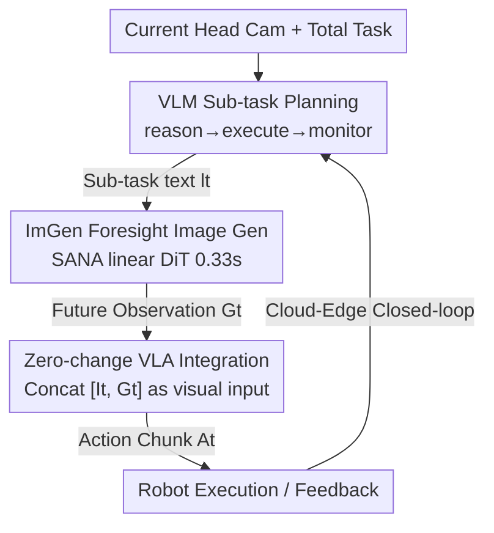

# ForeAct: Steering Your VLA with Efficient Visual Foresight Planning

**Conference**: CVPR 2026  
**Paper**: [CVF Open Access](https://openaccess.thecvf.com/content/CVPR2026/html/Zhang_ForeAct_Steering_Your_VLA_with_Efficient_Visual_Foresight_Planning_CVPR_2026_paper.html)  
**Code**: https://github.com/mit-han-lab/foreact  
**Area**: Robotics / Embodied AI  
**Keywords**: VLA, Visual Foresight Planning, World Model, Closed-loop Control, Sub-task Planning  

## TL;DR
Instead of driving a VLA with a single high-level language instruction, ForeAct utilizes an efficient "foresight image generator + VLM sub-task planner" to progressively provide the VLA with "imagined future observations + sub-task text." This allows the VLA to focus exclusively on visuo-motor mapping. On 11 real-world multi-step tasks, it improves the average success rate of $\pi_0$ from 46.5% to 87.4% (+40.9%).

## Background & Motivation
**Background**: Vision-Language-Action (VLA) models map "visual observations + language instructions" end-to-end to robotic actions and represent the current mainstream for general-purpose robots (e.g., RT-2, OpenVLA, $\pi_0$, $\pi_{0.5}$, GR00T-N1).

**Limitations of Prior Work**: While these VLAs perform well on simple tasks like "pick and place," they struggle with complex, long-horizon, and open-environment tasks. The authors attribute the root cause to the **difficulty for VLAs to ground abstract high-level instructions into concrete executable action sequences**. Forcing a small backbone (typically ~3B) to perform both high-level semantic reasoning and low-level visuo-motor mapping is overly taxing for the model.

**Prior Approaches and Their Shortcomings**: (1) Embedding planning and control into the same model—but small backbones have limited reasoning capabilities, and fine-tuning on robot data can cause catastrophic forgetting of general abilities. (2) Hierarchical frameworks that delegate planning to independent strong models—this mitigates forgetting but **fails to fundamentally solve the "instruction grounding" challenge** since the VLA still receives text. (3) Using video generation for visual prediction to guide control (e.g., SuSIE, CoT-VLA)—the concept is sound, but these methods are generally slow, computationally expensive, mostly open-loop (ignoring feedback), and incompatible with off-the-shelf SOTA VLAs.

**Key Insight**: The authors observe that **it is more effective to show a robot "what to achieve" rather than telling it "what to do."** An image of a "clean table" contains significantly more information than the sentence "clean the table." However, final states are often too abstract and lack intermediate steps. Thus, the authors ask: Can we **progressively** provide the robot with "visual instructions," one future observation image at a time, to guide it to the goal?

**Core Idea**: An **efficient world model is used to generate "imagined next-step future observations" in real-time**, coupled with a VLM for sub-task decomposition. This future image is fed to the VLA as an additional visual input. This relieves the VLA of high-level semantic reasoning, allowing it to **focus solely on visuo-motor inference**, improving both accuracy and generalization. Furthermore, this requires only "visual input expansion," necessitating zero structural changes to existing VLAs.

## Method

### Overall Architecture
ForeAct is a visual foresight planner integrated alongside off-the-shelf VLAs within a **closed-loop** system: A VLM sub-task planner analyzes the current head-camera observation and generates a sub-task text for the immediate step $\rightarrow$ The foresight image generation module, ImGen, renders the "future observation image after half a sub-task" $\rightarrow$ This future image, along with the sub-task text and three-way camera views, is fed to the VLA $\rightarrow$ The VLA outputs actions which the robot executes $\rightarrow$ The VLM monitors the new state, determines if the sub-task is complete, and re-plans the next sub-task.

Formally, a standard VLA learns the conditional distribution $\pi(A_t \mid I_t, q_t, l)$, where $A_t=[a_t,\dots,a_{t+H-1}]$ is an action chunk of length $H$, $I_t$ is the current multi-camera observation, $q_t$ is the proprioceptive state, and $l$ is the language instruction. ForeAct rewrites this as:

$$\pi(A_t \mid I_t, q_t, l) = \pi_l(A_t \mid [I_t, G_t], q_t, l_t)\,\pi_h(G_t, l_t \mid I_t, l)$$

$\pi_h$ is the foresight planner providing the predicted future observation $G_t$ and sub-task description $l_t$; $\pi_l$ is the VLA, which treats $G_t$ as additional visual input and $l_t$ as the linguistic condition. The planner is further decomposed:

$$\pi_h(G_t, l_t \mid I_t, l) = \pi_g(G_t \mid I_t, l_t)\,\pi_v(l_t \mid I_t, l)$$

Where $\pi_g$ is the core—the foresight image generation model ImGen—which grounds high-level instructions into a concrete future observation; $\pi_v$ is a VLM responsible for reasoning about complex tasks and inferring sub-tasks.

### Key Designs

**1. Efficient Foresight Image Generation (ImGen): Real-time Rendering of the "Imagined Next Step"**

This is the core of the method, addressing the slow and expensive nature of video-based foresight. The goal is a world model for closed-loop control: given the current observation $I_t$ and sub-task text $l_t$, it predicts a high-resolution (640×480) future observation $G_t$ rapidly. The architecture adopts the **SANA** design: a **32× deep compression autoencoder (DCAE)** encodes images into compact latents (reducing tokens), and a **linear DiT** ensures linear complexity for high-resolution attention. To adapt the text-to-image SANA for image conditioning, the authors **concatenate the condition image with noise in the token dimension**, transforming denoising into "conditional denoising based on the current image." Training uses flow matching, initialized from SANA-1.6B-512px. To ensure generalization, the model **only consumes vision + language without proprioception** (avoiding embodiment lock-in) and **only generates for the head camera** (maximal global information). It produces reliable images in **0.33s** using 8 denoising steps on an H100.

**2. Large-scale Cross-Embodiment Pre-training: Learning Universal "Embodied Dynamics"**

The world model must understand how actions change the world. The authors collected massive **cross-embodiment, multi-task** data from AgiBot-World Colosseo, RoboMind, Galaxea Open-World, and Bridge (excluding low-res datasets like Open-X-Embodiment). For long-horizon data, existing sub-task segments were used; for Bridge, original task descriptions were used, resulting in **1.16 million sub-tasks**. Within each sub-task, condition frames were sampled at 1s intervals, and future frames were sampled "half a sub-task length" later to capture meaningful changes. With approximately **10 million pairs**, the model was trained for 800k steps. Ablations show the model **completely fails** on OOD tasks without pre-training (0.00 fidelity/quality), confirming pre-training is the source of generalization.

**3. VLM "Reason-Execute-Monitor" Loop: Managing Closed-loop and Error Recovery**

While ImGen draws the images, the VLM (Qwen-3-VL-8B-Instruct) manages "what sub-task to do next," "if the last step finished," and "when to re-plan" via a **reason–execute–monitor** cycle. Given the task and observation, it first **reasons** an immediately executable sub-task. After VLA execution, it **monitors** the updated state; if the sub-task is complete, it **re-plans** the next. This loop allows dynamic recovery from failures—where baselines might get stuck in an infinite loop (e.g., trying to grab an object that was already moved), ForeAct monitors progress and generates the appropriate next-step foresight image.

**4. Zero-Architecture VLA Integration + Cloud-Edge Deployment: Plug-and-Play SOTA VLAs**

To ensure practical adoption, ForeAct only modifies the **visual input**. During fine-tuning, the current observation and "future observation" are concatenated. During inference, the ImGen-generated foresight image is appended to the current observation as visual input, and the sub-task text serves as the language input. This requires zero changes to the VLA architecture (e.g., $\pi_0$, $\pi_{0.5}$). Deployment uses a **hierarchical cloud-edge loop**: the edge (VLA on RTX 5090) handles reactive control, while the cloud (VLM + ImGen on H100) handles high-level planning and foresight generation, streaming a "dual-guidance package" ($l_t + G_t$) back to the edge.

### Loss & Training
ImGen is trained with a flow matching objective. Images are resized to 640×480. A constant learning rate of 5e-5 (5k warmup steps) is used, initialized from SANA-1.6B. During robot-specific deployment, lightweight fine-tuning is performed for 5 epochs (batch 32, lr 1e-5). VLAs ($\pi_0 / \pi_{0.5}$) are fine-tuned on sub-task segments with visual inputs expanded to "current + future" concatenations.

## Key Experimental Results

### Main Results: Real-world 11 Tasks ($\pi_0$ Backbone)
Evaluated on 11 Kitchen/Workspace/Factory tasks using Galaxea R1 Lite (420 episodes $\rightarrow$ 2,312 sub-tasks). Scoring is based on "atomic action" success rate.

| System | Avg. Success Rate | Rel. to $\pi_0$ |
|------|-----------|---------|
| $\pi_0$ (3.3B VLA Baseline) | 46.5% | — |
| VLM + $\pi_0$ (Text Sub-task) | 57.1% | +10.6% |
| **Ours (ForeAct)** | **87.4%** | **+40.9%** |

ForeAct outperformed all 11 tasks, with each task >70%. Compared to VLM+$\pi_0$, it shows a **+30.3%** gain, indicating that "visual foresight" is the primary driver of improvement over simple sub-task decomposition.

### Scaling to Stronger Backbone: $\pi_{0.5}$
| Task | $\pi_{0.5}$ | Ours | Task | $\pi_{0.5}$ | Ours |
|------|------|------|------|------|------|
| Pick_Veg | 60.0 | 86.6 | Office_Desk | 76.0 | 85.4 |
| Place_Bowl | 75.0 | 83.3 | Pick_Tool | 50.0 | 96.7 |
| Pen_Drawer | 68.8 | 81.3 | Pack_Flower | 91.8 | 95.8 |

Average success rate increased from 70.3% to **88.2%**, proving the framework's scalability to stronger VLAs.

### LIBERO Simulation ($\pi_{0.5}$ Backbone)
| Method | Spatial | Object | Goal | Long | Avg. |
|------|---------|--------|------|------|------|
| OpenVLA | 84.7 | 88.4 | 79.2 | 53.7 | 76.5 |
| CoT-VLA | 87.5 | 91.6 | 87.6 | 69.0 | 83.9 |
| $\pi_{0.5}$ | 97.3 | 98.8 | 96.9 | 94.2 | 96.8 |
| CogVLA | 98.6 | 98.8 | 96.6 | 95.4 | 97.4 |
| **Ours (w/ $\pi_{0.5}$)** | 97.3 | **99.8** | **97.3** | 95.4 | **97.5** |

Even with $\pi_{0.5}$ at near-saturation, ForeAct pushed the average from 96.8% to 97.5%.

### Ablation Study

**Foresight Generation: Role of Pre-training (Human Eval 0/1)**

| Config | In-domain Fidelity | In-domain Quality | OOD Fidelity | OOD Quality |
|------|-----------|---------|-----------|---------|
| w/o Pre-train | 0.18 | 0.24 | 0.00 | 0.00 |
| w/ Pre-train | 1.00 | 1.00 | 0.88 | 0.96 |

The 1.16M sub-task pre-training is the fundamental source of generalization.

**Instruction Modality Ablation (Pick_Tool)**: $\pi_0$ with semantic text achieved only 20.0%; with "spatial text," it reached 46.8%. Ours (semantic text + target image) reached **93.4%**—confirming that fine-grained visual guidance is vastly superior to coarse text.

### Key Findings
- **Visuals > Decomposition**: VLM+$\pi_0$ (text only) reached 57.1%, while adding visual foresight jumped to 87.4%. The +30.3% gap identifies visual instruction as the core.
- **Data Efficiency**: In Clean_Rubb, ForeAct reached >90% success with only 60% of data. It grounds abstract semantics into visual goals, bypassing the need to exhaustively sample configurations.
- **Robustness to Compositional OOD**: On OOD variants of Pick_Veg, ForeAct maintained 58–77% while baselines dropped to 5–46%. The monitor-replan loop prevents stagnant failure.
- **Speed**: Generating 640×480 images in 0.33s enables real-time closed-loop application.

## Highlights & Insights
- **Paradigm Shift: "Show, Don't Tell"**: The core insight is converting the difficult "language $\rightarrow$ action" grounding into a more natural "image $\rightarrow$ action" mapping using imagined future frames.
- **Adapting SOTA T2I to World Models**: Repurposing SANA’s DCAE + linear DiT with noise-concatenation allows for a high-efficiency world model that generates in 0.33s—a rare example of dual computational efficiency and world-model quality.
- **Zero-Invasive Integration**: Not requiring VLA architectural changes ensures compatibility with any current or future SOTA VLA, lowering adoption barriers.
- **Closed-loop Monitoring**: While many foresight methods are open-loop, ForeAct’s "monitor-replan" loop ensures the system handles generation errors or execution failures effectively.

## Limitations & Future Work
- **Dependency on Heavy Compute**: Running ImGen + VLM on H100s while VLA runs on RTX 5090 imposes strict network and hardware requirements. Purely edge-based real-time performance remains unverified.
- **Heuristic Supervision**: Using the "sub-task end frame" and fixed temporal offsets as training targets may not be optimal for sub-tasks with highly non-linear or varying durations.
- **Platform Specificity**: Real-world experiments were conducted on a single dual-arm platform (Galaxea R1 Lite). Cross-embodiment deployment (as opposed to just pre-training) needs further validation.
- **Metric Subjectivity**: Image fidelity relies on binary human evaluation, which lacks the objectivity of continuous benchmarks.

## Related Work & Insights
- **vs $\pi_0 / \pi_{0.5}$ (End-to-end VLA)**: These models burden a single backbone with both reasoning and action. ForeAct outsources high-level reasoning to VLM+ImGen, allowing the VLA to excel at visuo-motor tasks.
- **vs CoT-VLA / SuSIE**: These unify goal generation and action in one model. ForeAct decouples foresight into an independent, efficient module reusable across any VLA.
- **vs Video-based Control**: Video generation is typically slow and open-loop; ForeAct provides a 0.33s, closed-loop, and VLA-compatible alternative.

## Rating
- Novelty: ⭐⭐⭐⭐⭐ The paradigm shift to "visual instructions" via imagined future observations is clear and effective.
- Experimental Thoroughness: ⭐⭐⭐⭐⭐ Comprehensive coverage across real-world tasks, multiple backbones, simulations, and OOD scenarios.
- Writing Quality: ⭐⭐⭐⭐ Strong motivation and theoretical framing, though some deployment latency details are brief.
- Value: ⭐⭐⭐⭐⭐ High practical value due to zero architecture changes, real-time speed, and high data efficiency.

<!-- RELATED:START -->

## Related Papers

- [\[CVPR 2026\] HiF-VLA: Hindsight, Insight and Foresight through Motion Representation for Vision-Language-Action Models](hif-vla_hindsight_insight_and_foresight_through_motion_representation_for_vision.md)
- [\[CVPR 2026\] CLaD: Planning with Grounded Foresight via Cross-Modal Latent Dynamics](clad_planning_with_grounded_foresight_via_cross-modal_latent_dynamics.md)
- [\[ICLR 2026\] Sparse Imagination for Efficient Visual World Model Planning](../../ICLR2026/robotics/sparse_imagination_for_efficient_visual_world_model_planning.md)
- [\[CVPR 2026\] Mantis: A Versatile Vision-Language-Action Model with Disentangled Visual Foresight](mantis_a_versatile_vision-language-action_model_with_disentangled_visual_foresig.md)
- [\[CVPR 2026\] Spatial-Aware VLA Pretraining through Visual-Physical Alignment from Human Videos](spatial-aware_vla_pretraining_through_visual-physical_alignment_from_human_video.md)

<!-- RELATED:END -->
