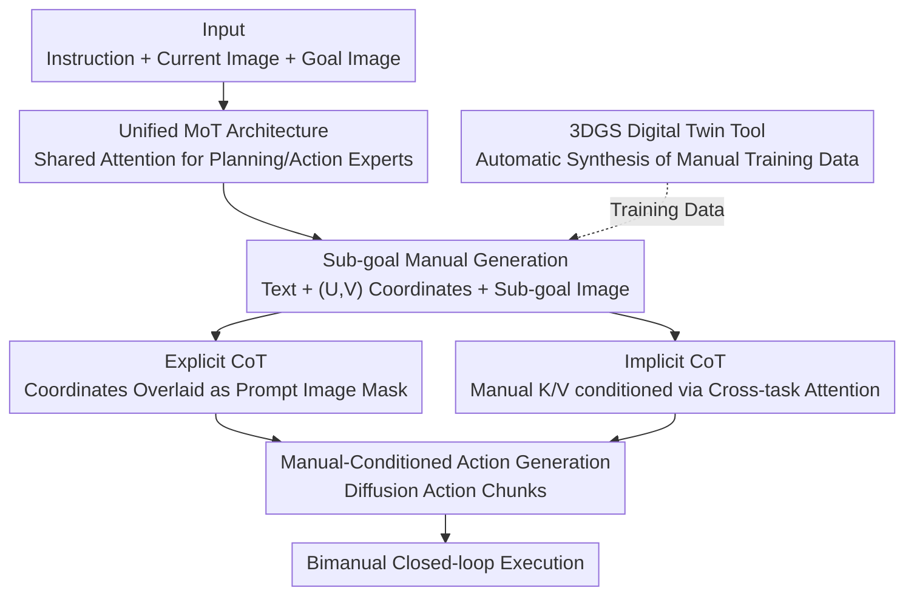

# From Manuals to Actions: A Unified VLA Model for Chain-of-Thought Manual Generation and Robotic Manipulation

**Conference**: CVPR 2026  
**Paper**: [CVF Open Access](https://openaccess.thecvf.com/content/CVPR2026/html/Gu_From_Manuals_to_Actions_A_Unified_VLA_Model_for_Chain-of-Thought_CVPR_2026_paper.html)  
**Code**: [Project Page](https://sites.google.com/view/maunalvla) (Open source code not yet available)  
**Area**: Robotics / Embodied AI  
**Keywords**: VLA, Manual CoT, Mixture-of-Transformers, Long-horizon manipulation, 3DGS Digital Twin

## TL;DR
ManualVLA employs a unified Mixture-of-Transformers framework that enables a VLA model to first "imagine" intermediate manuals (comprising sub-goal images, pixel coordinates, and text instructions) from a "goal state." It then translates these manuals into precise actions through explicit and implicit Manual Chain-of-Thought paths. On long-horizon tasks such as LEGO assembly and object rearrangement, the average success rate is 32% higher than previous hierarchical SOTA methods.

## Background & Motivation
**Background**: Vision-Language-Action (VLA) models connect internet-scale pre-trained vision-language models to robot control, performing end-to-end mapping from observation to action. They demonstrate strong generalization in open-scene grasping and manipulation.

**Limitations of Prior Work**: Existing VLA models struggle with long-horizon tasks given an "explicit goal state"—such as assembling LEGOs according to a final model or arranging tabletop objects in a specified layout. These tasks specify "what" the result should look like but not "how" to achieve it. Current models either map sensory inputs directly to actions, lacking planning for intermediate processes, or rely on manual manuals/demonstration videos, which suffer from poor generalization and high human labor dependency.

**Key Challenge**: Long-horizon goal tasks require two intertwined capabilities: (1) High-level planning: deriving a sequence of reasonable intermediate sub-goals from the final state; (2) Precise control: strictly aligning with target configurations at every step. Existing methods either possess only one capability or decouple planning and control into two independent models, breaking the relationship between sub-goals and fine-grained actions.

**Goal**: To equip a VLA model with human-like "what-to-how" capability—decomposing a predefined final goal into a sequence of coherent and precise execution steps.

**Key Insight**: Humans do not need frame-by-frame demonstrations to build LEGOs; instead, they imagine key intermediate states and operate accordingly. The authors allow the model to "imagine" intermediate manuals and use these as both explicit control conditions and implicit guidance signals for action generation.

**Core Idea**: A unified MoT model combines "manual generation" and "action execution" experts, using Manual Chain-of-Thought to translate generated multimodal manuals into precise actions—without relying on human manuals or demonstration videos.

## Method

### Overall Architecture
ManualVLA uses Janus-Pro as a backbone, extended into a unified Mixture-of-Transformers (MoT) model. It contains two experts sharing the same attention mechanism but possessing independent FFN, attention projection, and LayerNorm parameters: the **Planning Expert** generates multimodal manuals, and the **Action Expert** generates precise actions.

The workflow is as follows: given a language instruction $l$, the current image $\mathcal{I}^{\text{current}}_t$, and the final goal image $\mathcal{I}^{\text{goal}}$, the planning expert first generates a sub-goal manual—including a text description of the target object $\hat{l}_t$, pixel coordinates of the target object's centroid $p_t=(U,V)$, and the next sub-goal image $\mathcal{I}^{\text{subgoal}}_t$:

$$\pi_\theta(\mathcal{I}^{\text{subgoal}}_t, p_t, \hat{l}_t \mid \mathcal{I}^{\text{goal}}, \mathcal{I}^{\text{current}}_t, l).$$

The system then overlays the predicted coordinates as a mask on the current image to obtain a prompt image $\mathcal{I}^{\text{prompt}}_t$. The action expert then generates action chunks $a_{t:t+h}$ in a diffusion manner, conditioned on the robot state $s_t$, the prompt image, and the K/V features $\mathcal{F}^{\text{subgoal}}_t, \mathcal{F}^p_t, \mathcal{F}^{\hat{l}}_t$ cached during manual generation:

$$\pi_\theta(a_{t:t+h} \mid s_t, \mathcal{I}^{\text{prompt}}_t, \mathcal{F}^{\text{subgoal}}_t, \mathcal{F}^p_t, \mathcal{F}^{\hat{l}}_t).$$

The entire pipeline is trained end-to-end on a single token sequence. To alleviate data scarcity for long-horizon tasks, the authors developed a 3DGS-based digital twin tool to automatically generate manual data.

### Key Designs

**1. Unified MoT Dual-Expert Architecture: Connecting Planning and Control**

VLA models that directly map sensory input to actions cannot handle "goal-only" tasks, while decoupling planning and control into independent models disconnects sub-goals from actions. ManualVLA constructs an MoT on top of DeepSeek-LLM 1.5B: all non-embedding components (FFN, projection matrices $W_Q/W_K/W_V/W_O$, LayerNorm) are replicated for each task category $t_i\in\{\text{manual},\text{action}\}$. Tokens select parameters based on their task type. A single MoT layer is defined as:

$$\mathrm{MoT}_\Theta(x) = x + \mathcal{N}^{t(\cdot)}_{\text{ffn}}\!\Big(\Phi^{t(\cdot)}_{\text{ffn}}\big(x + \mathcal{N}^{t(\cdot)}_{\text{attn}}(\Phi_{\text{attn}}(x))\big)\Big),$$,

where $t(\cdot)$ indicates that tokens at each position use parameters corresponding to their task. Crucially, while projection matrices are selected per-task, attention weights $A=\mathrm{softmax}(QK^\top/\sqrt{d_k})$ are computed globally across all tokens. This allows manual and action tokens to specialize while interacting across tasks. The vision side also branches: manual generation uses a VQGAN-style discrete tokenizer (codebook $Z\in\mathbb{R}^{16384\times 8}$), while action generation uses a SigLIP-Large continuous encoder. Ablations show that a standard MoE (replicating only FFN) fails to produce high-quality manuals and actions simultaneously.

**2. Sub-goal Manual Generation: Translating "Goal State" into Multimodal Steps**

The difficulty of long-horizon tasks lies in unknown intermediate steps. The planning expert generates a tri-modal manual: text descriptions (clarifying which object to manipulate and which action to perform), pixel-level $(U,V)$ coordinates (centroid positions for precise localization), and sub-goal images (providing concrete modeling of physical dynamics). The authors assume that long-horizon tasks do not require dense temporal sub-goals; guidance at frames where the task state changes critically—such as placing a block on a board—is sufficient. ManualVLA generates a new manual only after the previous sub-goal is completed. It first outputs a text description; if the object being manipulated differs from the previous step, it generates a new manual; otherwise, it reuses the old manual for action generation. This reduces redundant guidance and planning overhead.

**3. Manual Chain-of-Thought: Explicit + Implicit Paths for Action Grounding**

Generating manuals is insufficient; the key is grounding them into precise actions. ManualCoT uses two complementary paths: **Explicit CoT** overlays predicted $(U,V)$ coordinates as a mask on the current image, highlighting affordance regions as a prompt image for the action expert. **Implicit CoT** operates in the latent space; using cross-task shared attention and a specialized attention mask, it treats manual latent representations as conditional signals for action modeling, providing guidance in the order of "what (object) → where (placement) → anticipated outcome." The attention mask allows the action expert to attend to manual representations while blocking earlier inputs. Ablations indicate both paths are essential; removing either leads to a significant drop in success rates. Even with slight manual errors, the MoT capacity ensures robust action output.

**4. 3DGS Digital Twin Tool: Automatic Synthesis of Long-horizon Training Data**

Goal-state tasks involve high uncertainty, requiring massive data with intermediate labels to train the planning expert. Reliance on manual collection is too costly. The authors developed a high-fidelity digital twin tool based on 3D Gaussian Splatting (3DGS). They reconstruct 3D assets of LEGO boards and blocks from multi-view images and align them to a Cartesian coordinate system. Following an iterative placement process, they start from an initial state and randomly sample legal positions for blocks. They render current configurations using a front-view camera at every intermediate state, batch-producing realistic intermediate images, positions, and text. Synthesizing over 10K manual frames per task allows the model to learn generalizable manipulation from only ~100 real-world demonstrations.

### Loss & Training
A three-stage training strategy is used, initializing with Janus-Pro pre-trained parameters and replicating the LLM twice to initialize planning/action experts:
- **Stage 1: Action Expert Pre-training**: Trained for 5 epochs on assembly data filtered from 400K+ cross-embodiment trajectories, conditioned only on instructions, current images, and robot states. The diffusion objective minimizes MSE between predicted and ground-truth noise: $\mathcal{L}_{\text{action}}=\mathbb{E}_{\epsilon\sim\mathcal{N}(0,1),i}\|\hat\epsilon_i-\epsilon\|_2^2$.
- **Stage 2: Manual Expert Pre-training**: Only the manual expert is trained using data from the digital twin tool (10K+ frames per task), supervised by cross-entropy $\mathcal{L}_{\text{manual}}$ on sub-goal manuals (object descriptions + target positions + sub-goal image tokens).
- **Stage 3: Joint Fine-tuning**: 100 demonstrations (action data + automatically extracted manual data) are collected via SpaceMouse teleoperation for each downstream task. All components are trained jointly on a unified token sequence with the total objective $\mathcal{L}_{\text{final}}=\mathcal{L}_{\text{manual}}+\mathcal{L}_{\text{action}}$.

## Key Experimental Results

The platform used is a bimanual Franka setup for three long-horizon goal tasks: 2D LEGO assembly, 3D LEGO assembly, and object rearrangement.

### Main Results
Manual generation quality (300 unseen test samples; PSNR/FID for sub-goal images, MAE for coordinates):

| Task | Sub-goal Image PSNR↑ | Sub-goal Image FID↓ | (U,V) MAE↓ |
|------|------|------|------|
| 2D LEGO | 29.01 | 36.39 | 3.23 |
| 3D LEGO | 28.68 | 34.63 | 3.58 |
| Object Rearrangement | 28.11 | 24.46 | 6.21 |

Manipulation Success Rate Comparison (20 unseen goal states; S.R. is end-to-end task success rate):

| Method | 2D LEGO S.R. | 3D LEGO S.R. | Object Rearrangement S.R. |
|------|------|------|------|
| $\pi_0$ | 0.15 | 0.10 | 0.10 |
| $\pi_{0.5}$ | 0.20 | 0.15 | 0.15 |
| FAST | 0.10 | 0.05 | 0.05 |
| CoT-VLA | 0.30 | 0.25 | 0.30 |
| VLM + $\pi_{0.5}$ (Hierarchical SOTA) | 0.60 | 0.35 | 0.50 |
| **ManualVLA** | **0.85** | **0.65** | **0.65** |

Compared to the strongest hierarchical baseline (VLM + $\pi_{0.5}$), the final task completion rate improves by 15%–30%, with an average gain of ~32% across three tasks. Direct action-mapping models like $\pi_0$/$\pi_{0.5}$/FAST fail almost entirely on long-horizon tasks (often succeeding early but failing later).

### Ablation Study
Conducted on the 2D LEGO task; reporting long-horizon success rates:

| Configuration | Conclusion |
|------|------|
| Manual contains only (U,V) → +Sub-goal Image → Tri-modal | Success rate increases with more manual modalities; text/image/coordinates are irreplaceable. |
| w/o Explicit CoT | Success rate drops significantly when using only latent features and current images. |
| w/o Implicit CoT | Success rate drops significantly when using only prompt images. |
| MoT → Degraded to MoE (FFN only) | Fails to produce high-quality manuals and actions concurrently. |
| Action Generation Paradigm | Diffusion is superior to other paradigms. |

### Key Findings
- **More manual information is better**: Success rates increase monotonically as sub-goal images and text descriptions are added to explicit (U,V) coordinates, proving all three modalities provide unique implicit conditions.
- **Explicit and Implicit CoT are complementary**: Both pixel-level visible conditions and latent semantics are necessary; removing either degrades performance.
- **MoT beats MoE**: Long-horizon tasks require high-quality planning and control. Replicating only FFNs (MoE) is insufficient; attention projections and LayerNorm must also be task-specific.
- **Robust Generalization**: Under perturbations in background, object shape, and lighting, ManualVLA's success rate on 2D LEGO drops from 0.85 to 0.65/0.60/0.70. These drops are smaller than those of VLM + $\pi_{0.5}$ due to the rich guidance from the manual expert and digital twin data.

## Highlights & Insights
- **The "What-to-How" paradigm is effective**: Translating the human intuition of "imagining intermediate states" into learnable manual generation addresses the core bottleneck of long-horizon tasks. This is more elegant than scaling human manuals or demonstration videos.
- **Dual Explicit/Implicit CoT is a clever design**: Using the same manual as both a visible pixel prompt and a latent signal provides redundancy and robustness against minor manual errors—a strategy transferable to other planning-execution tasks.
- **Insight from MoT vs. MoE**: The ablation demonstrates that for long-horizon tasks, replicating FFNs is not enough. Task-specific attention projection is required to prevent planning and control from interfering with each other—providing empirical evidence for sharing granularity in unified models.
- **3DGS Digital Twin Data Generation**: Automating the creation of long-horizon data with intermediate labels using 3DGS-based rendering significantly reduces labor. Achieving generalized manipulation with ~100 real-world demonstrations is highly practical.

## Limitations & Future Work
- **Manual Errors**: The authors admit generated manuals may have slight errors. While ManualCoT provides tolerance, robustness in even longer tasks with higher error accumulation remains unproven.
- **Keyframe Assumption**: The method assumes guidance at critical state changes is sufficient. Its effectiveness on fine-grained continuous tasks (e.g., deformable objects or small assembly tolerances) is not fully validated.
- **Narrow Task Domain**: Experiments are limited to regular, rigid objects well-reconstructed by 3DGS. Data quality may degrade in unstructured scenes or with heavy occlusion, transparency, or reflections.
- **Future Directions**: Exploring uncertainty estimation/self-correction for manuals, extending digital twins to deformable bodies and complex physical interactions, and verifying MoT gains on smaller backbones.

## Related Work & Insights
- **vs. CoT-VLA**: CoT-VLA also uses goal images and predicts future frames but relies only on explicit pixel-level sub-goals. It lacks implicit latent-space connection, leaving the link between sub-goals and fine-grained control weak. ManualVLA uses dual-path CoT and tri-modal manuals, significantly improving success rates (e.g., 0.30 → 0.85 on 2D LEGO).
- **vs. VLM + $\pi_{0.5}$ (Hierarchical SOTA)**: Hierarchical baselines are "non-unified" versions of the manual approach. ManualVLA's unified MoT allows smoother information flow between planning and control via shared attention and shows better robustness under perturbations.
- **vs. CheckManual / Video-based (Vid2Robot, DexCap)**: These rely on pre-defined human manuals or hand videos, introducing human labor and computational overhead. ManualVLA is the first to use a unified VLA to generate multimodal manuals and ground them into actions autonomously.

## Rating
- Novelty: ⭐⭐⭐⭐⭐ First unified model to generate multimodal manuals and ground them via explicit/implicit CoT.
- Experimental Thoroughness: ⭐⭐⭐⭐ Solid real-world experiments and ablations, though the domain is limited to rigid objects.
- Writing Quality: ⭐⭐⭐⭐ Clear motivation and good figure-text correspondence.
- Value: ⭐⭐⭐⭐⭐ Directly addresses long-horizon task bottlenecks; the combination of manuals, dual CoT, and digital twins is highly practical.

<!-- RELATED:START -->

## Related Papers

- [\[CVPR 2026\] ACoT-VLA: Action Chain-of-Thought for Vision-Language-Action Models](acot-vla_action_chain-of-thought_for_vision-language-action_models.md)
- [\[CVPR 2026\] Unifying Perception and Action: A Hybrid-Modality Pipeline with Implicit Visual Chain-of-Thought for Robotic Action Generation (VITA)](unifying_perception_and_action_a_hybrid-modality_pipeline_with_implicit_visual_c.md)
- [\[CVPR 2026\] FantasyVLN: Unified Multimodal Chain-of-Thought Reasoning for Vision-and-Language Navigation](fantasyvln_unified_multimodal_chain-of-thought_reasoning_for_vision-and-language.md)
- [\[CVPR 2026\] TRM-VLA: Temporal-Aware Chain-of-Thought Reasoning and Memorization for Vision-Language-Action Models](trm-vla_temporal-aware_chain-of-thought_reasoning_and_memorization_for_vision-la.md)
- [\[CVPR 2026\] Motus: A Unified Latent Action World Model](motus_a_unified_latent_action_world_model.md)

<!-- RELATED:END -->
