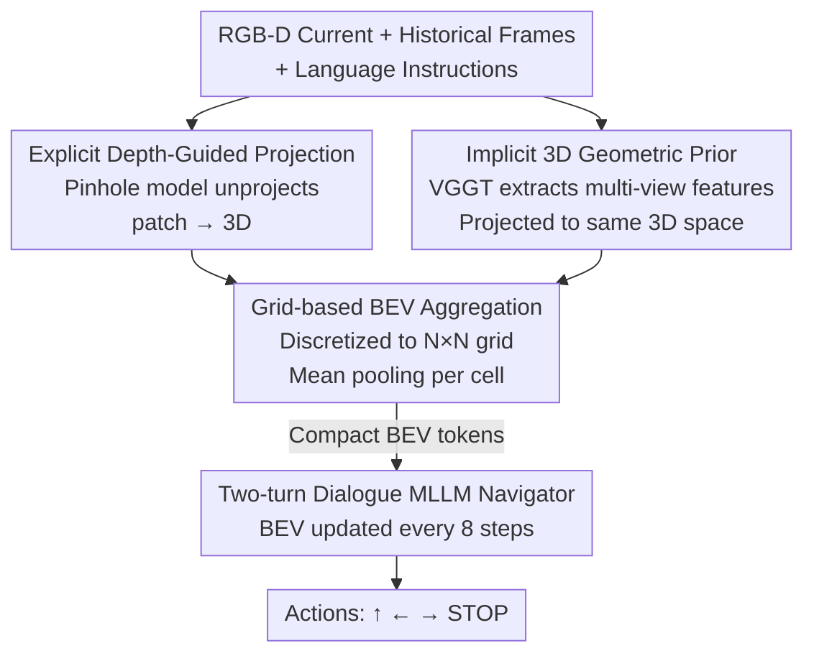

# GA-VLN: Geometry-Aware BEV Representation for Efficient Vision-Language Navigation

**Conference**: CVPR 2026  
**Paper**: [CVF Open Access](https://openaccess.thecvf.com/content/CVPR2026/html/Yang_GA-VLN_Geometry-Aware_BEV_Representation_for_Efficient_Vision-Language_Navigation_CVPR_2026_paper.html)  
**Code**: None  
**Area**: Robotics / Embodied AI  
**Keywords**: Vision-Language Navigation, BEV Representation, MLLM, Geometry-Aware, Token Compression

## TL;DR
This work projects RGB-D observations into a compact, agent-centric Bird's-Eye View (BEV) representation that fuses explicit depth geometry with implicit priors from a 3D foundation model. By replacing redundant dense RGB patch tokens in MLLM navigators with this representation, the method achieves SOTA performance in continuous-environment VLN with significantly fewer tokens, without requiring DAgger augmentation or VQA co-training.

## Background & Motivation

**Background**: Current Vision-Language Navigation in Continuous Environments (VLN-CE) primarily employs Multi-modal Large Language Models (MLLM) as navigation policy backbones. These models encode historical RGB frames frame-by-frame into visual tokens, which, along with language instructions, are fed into the MLLM to predict discrete actions (Move Forward/Turn Left/Turn Right/STOP). The powerful instruction understanding and reasoning capabilities of MLLMs have made this approach effective.

**Limitations of Prior Work**: This image-centric paradigm suffers from two major drawbacks. First, token explosion: each frame generates $H_p \times W_p$ patch tokens, accumulating $t \times H_p \times W_p$ tokens over $t$ frames, leading to uncontrollable computation costs (the paper reports ~4003 tokens per inference step). Second, lack of spatial structure: flattened patch embeddings do not explicitly capture geometric relationships between frames, causing spatial consistency to collapse during viewpoint changes and limiting long-range exploration and spatial memory.

**Key Challenge**: MLLMs inherit a 2D patch processing bias from image-level training, while navigation is inherently a 3D spatial reasoning task. Dense 2D tokens are both computationally expensive and incapable of expressing geometry, representing a fundamental mismatch between representation format and task requirements.

**Goal**: To design a visual representation that is both **compact and spatially expressive** for MLLM navigators, reducing token count while enhancing geometric awareness.

**Key Insight**: Although navigation occurs in 3D indoor spaces, movement is mostly constrained to the 2D ground plane. Compressing observations into a Bird's-Eye View (BEV) naturally centers the representation on the agent and aligns multiple frames into a unified coordinate system, eliminating redundancy and explicitly encoding spatial layouts.

**Core Idea**: Use RGB-D data to back-project patch features into 3D and aggregate them into a BEV grid (explicit geometry), while incorporating features from a pre-trained 3D foundation model (implicit geometric prior). These complementary components form a Geometry-Aware BEV (GA-BEV) that drives MLLM navigation instead of dense RGB tokens.

## Method

### Overall Architecture

GA-VLN takes current and historical RGB-D egocentric views (60° FOV) and language instructions as input to output discrete action sequences. The core mechanism replaces "a stack of historical RGB frames" with "a single GA-BEV" for MLLM input. The pipeline follows four steps: first, unproject each patch center to 3D based on depth using a camera pinhole model (explicit geometry); simultaneously, extract multi-view geometric features from the history sequence using a frozen 3D foundation model (VGGT), align dimensions, and project them into the same 3D space (implicit geometric prior); then, discretize these 3D features into an agent-centric $N \times N$ BEV grid using mean pooling, retaining only non-empty cells to obtain compact tokens; finally, feed BEV tokens, current view features, and instructions into the MLLM using a two-turn dialogue mechanism to predict actions.

### Key Designs

**1. Explicit Depth-Guided Spatial Projection: Anchoring 2D Patches in 3D World Coordinates**

To address the lack of geometry in flattened patch embeddings, this step injects spatial structure at the input stage. For each step, patch-level RGB features $V_t \in \mathbb{R}^{H_p \times W_p \times d_p}$ are paired with a depth map $D_t$ (resampled via bicubic interpolation). Using the pinhole camera model, each patch center $(u,v)$ is back-projected to world coordinates:

$$\hat{p}_t(u,v) = \begin{bmatrix} R_t & p_t \end{bmatrix} K^{-1} \begin{bmatrix} u \\ v \\ 1 \end{bmatrix} D_t(u,v)$$

where $K$ represents camera intrinsics, $R_t$ and $p_t$ are the current camera rotation and position. This "grounding" of 2D patches in the physical world allows multi-frame observations to align in a unified coordinate system, which is essential for redundancy removal and spatial consistency in BEV aggregation.

**2. Implicit 3D Geometric Prior: Complementing Sparse Depth with Foundation Models**

Explicit projection relies on single-frame local depth, which may fail if depth is sparse or noisy. This design introduces a pre-trained 3D foundation model $f_{3DFM}$ (VGGT-1B), which provides multi-view geometric awareness and shape priors learned from large-scale 3D reconstruction. Historical image sequences are encoded into features with implicit priors $V^g = f_{3DFM}(\{I_1,\dots,I_t\})$, followed by a projection layer $\tilde{V}^g = f_{project}(V^g)$ (a 2-layer MLP with 4096-dimensional hidden layers matching SigLIP) to align visual dimensions. $\tilde{V}^g$ is then processed using the **same depth-guided projection** as Design 1. $f_{3DFM}$ remains frozen during training, acting as a fallback for degraded depth.

**3. Grid-based BEV Aggregation: Compressing Sparse 3D Features into Compact Tokens**

3D features are inherently sparse. This step unifies both feature sets $V = V \cup \tilde{V}^g$ and their corresponding 3D positions $\hat{P}$, projecting them onto the $(x,z)$ plane discretized into an $N \times N$ grid with spacing $\Delta$ and sensing range $[-R,R]$. Each grid cell $(i,j)$ collects features $S_{i,j}$ falling within its bounds (aggregating different heights $y$ into the same $(x,z)$), followed by mean pooling:

$$B = \Big\{ \frac{1}{|S_{i,j}|} \sum_{v \in S_{i,j}} v + e_{i,j} \;\Big|\; |S_{i,j}| > 0,\; i,j \in [1,N] \Big\}$$

where $e_{i,j}$ is a 2D sinusoidal position encoding. By **retaining only non-empty cells**, the final BEV token count is significantly lower than $N \times N$ and even smaller than the original patch count $t \times H_p \times W_p$. Historical 3D points are transformed into the current agent coordinate system at each step to maintain egocentric alignment, reducing tokens from ~4003 to a few hundred.

**4. Two-turn Dialogue Navigation Framework: Efficient BEV Updates**

Navigation is modeled as a two-turn dialogue. In each turn, the MLLM generates 4 actions (8 total per update cycle). The first turn uses instructions, the current egocentric view, and BEV features aggregated from up to 8 historical frames. The second turn **only updates the current view and reuses the initial BEV features**, effectively distributing the cost of BEV construction over 8 actions, significantly reducing inference latency.

### Loss & Training
The backbone MLLM uses LLaVA-Video-7B with SigLIP as the visual encoder and VGGT-1B (frozen, using penultimate layer features) as the 3D model. BEV grid parameters: $\Delta = 0.25$m, range $[-10, 10]$m. Learning rates: 5e-6 for the visual encoder, 2e-5 for others, using cosine annealing. Pre-training lasts 2 epochs on navigation data only (R2R-CE / RxR-CE / EnvDrop / ScaleVLN / SRDF), **without DAgger or VQA co-training**.

## Key Experimental Results

### Main Results
On val unseen splits of three standard VLN-CE benchmarks (R2R-CE / RxR-CE / NavRAG-CE), GA-VLN achieves SOTA on most metrics. The table below shows results for R2R-CE and RxR-CE (SR: Success Rate, SPL: Success weighted by Path Length):

| Method | System | DAgger | R2R SR↑ | R2R SPL↑ | RxR SR↑ | RxR SPL↑ |
|------|------|--------|---------|----------|---------|----------|
| Uni-NaVid | Image-MLLM | ✓ | 47.0 | 42.7 | 48.7 | 40.9 |
| NaVILA | Image-MLLM | × | 54.0 | 49.0 | 49.3 | 44.0 |
| StreamVLN | Image-MLLM | ✓ | 56.9 | 51.9 | 52.9 | 46.0 |
| InternVLA-N1 | Image-MLLM | ✓ | 58.2 | 54.0 | 53.5 | 46.1 |
| **GA-VLN (Ours)** | GA-VLN | **×** | **61.0** | **55.2** | **55.4** | 45.2 |

Key Observation: **Without DAgger**, GA-VLN achieves 61.0% SR and 55.2% SPL on R2R-CE, outperforming DAgger-dependent models like StreamVLN and InternVLA-N1, demonstrating high data efficiency through strong spatial inductive bias.

### Ablation Study
Table 2 decomposes GA-BEV components (BEV Rep. = Explicit Projection; 3D-Geo. = Implicit Prior) and reports TFLOPs and latency per step on R2R-CE val unseen:

| Config | BEV Rep. | 3D-Geo. | SR↑ | SPL↑ | Total TFLOPs | Latency (ms) |
|------|----------|---------|------|------|-----------|----------|
| #1 Baseline | × | × | 51.49 | 46.18 | 32.19 | 342.9 |
| #2 GA-VLN (w/o VGGT) | ✓ | × | 59.21 | 53.87 | 5.15 | 212.9 |
| #3 GA-VLN (Full) | ✓ | ✓ | 60.96 | 55.19 | 8.73 | 258.7 |

Adding explicit BEV projection (#1 to #2) jumps SR from 51.49% to 59.21% while crashing TFLOPs from 32.19 to 5.15 and nearly halving latency. Adding the implicit prior (#3) further improves SR to 60.96% with a manageable 1.97 TFLOPs overhead.

### Key Findings
- **Compactness yields a Win-Win**: Reducing tokens from 4003 to ~500 increases SR from 46% to 60%, suggesting dense patches contain noise/redundancy whereas BEV provides a superior inductive bias.
- **Explicit Projection is Primary, Implicit Prior is Robustness**: The explicit BEV provides the largest performance leap, while the VGGT prior adds 1–2% SR, primarily aiding robustness against noisy/sparse depth.
- **History Window**: A 32-step history is sufficient; longer windows saturate or introduce noise.
- **Robust to Sensor Noise**: Adding noise ($\sigma=0.05$m for position, $\sigma=5°$ for rotation) results in only minor SR drops, and zero-shot deployment on a Stretch 3 robot was successful.

## Highlights & Insights
- **"Changing Fuel" for MLLMs**: The method succeeds by keeping the MLLM backbone intact but swapping visual tokens for geometry-grounded BEV tokens, proving that representation engineering can be more efficient than scaling data/models.
- **Explicit + Implicit Fusion**: Fusing precise local geometry (depth) with fuzzy global priors (3DFM) in the same BEV space provides a "hard geometry + soft prior" paradigm applicable to various embodied tasks.
- **True Data Efficiency**: Achieving SOTA without DAgger or VQA co-training suggests that correct spatial inductive biases can compensate for smaller data scales.

## Limitations & Future Work
- **RGB-D Dependency**: Relies on depth for projection. Robustness boundaries in RGB-only scenarios are not fully explored.
- **NavRAG-CE Performance**: SR is lower (22.2%) on this benchmark due to distribution shifts, though still competitive.
- **Frozen 3DFM**: VGGT-1B remains frozen; end-to-end tuning or lighter 3D models were not explored.
- **2D Ground Assumption**: The BEV approach may struggle with complex 3D tasks like multi-floor navigation or vertical manipulation.

## Related Work & Insights
- **vs. Image-centric MLLM Navigators**: These utilize dense RGB tokens (high cost, no explicit geometry). GA-VLN reduces tokens by an order of magnitude and encodes geometry without needing DAgger.
- **vs. Traditional BEV-based VLN**: Earlier works used BEV primarily as an auxiliary structure for waypoint relations; GA-VLN is the first to use BEV as the primary input for an MLLM navigator fused with 3D foundation model priors.

## Rating
- Novelty: ⭐⭐⭐⭐ First to use geometry-aware BEV as primary MLLM input with 3DFM fusion.
- Experimental Thoroughness: ⭐⭐⭐⭐⭐ Extensive benchmarks, noise analysis, and real-world deployment.
- Writing Quality: ⭐⭐⭐⭐ Clear motivation, complete formulas, and effective diagrams.
- Value: ⭐⭐⭐⭐⭐ High practical value for embodied navigation by reducing computation while improving accuracy without extra data augmentations.

<!-- RELATED:START -->

## Related Papers

- [\[ACL 2026\] VLN-NF: Feasibility-Aware Vision-and-Language Navigation with False-Premise Instructions](../../ACL2026/robotics/vln-nf_feasibility-aware_vision-and-language_navigation_with_false-premise_instr.md)
- [\[CVPR 2026\] GeoDexGrasp: Geometry-aware Generation for Data-efficient and Physics-plausible Dexterous Grasping](geodexgrasp_geometry-aware_generation_for_data-efficient_and_physics-plausible_d.md)
- [\[CVPR 2026\] AwareVLN: Reasoning with Self-awareness for Vision-Language Navigation](awarevln_reasoning_with_self-awareness_for_vision-language_navigation.md)
- [\[CVPR 2026\] FantasyVLN: Unified Multimodal Chain-of-Thought Reasoning for Vision-and-Language Navigation](fantasyvln_unified_multimodal_chain-of-thought_reasoning_for_vision-and-language.md)
- [\[CVPR 2026\] Cross from Left to Right Brain: Adaptive Text Dreamer for Vision-and-Language Navigation](cross_from_left_to_right_brain_adaptive_text_dreamer_for_vision-and-language_nav.md)

<!-- RELATED:END -->
