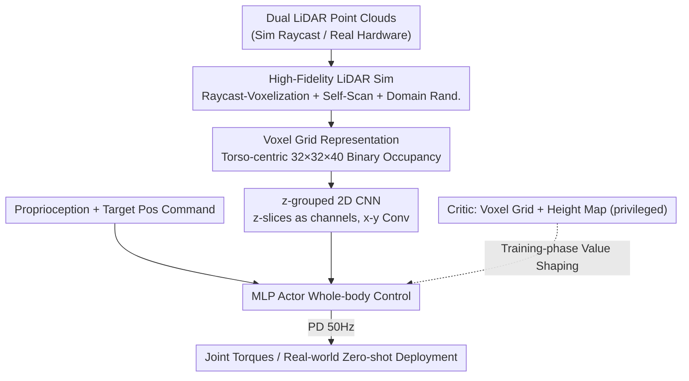

# Gallant: Voxel Grid-based Humanoid Locomotion and Local-navigation across 3D Constrained Terrains

**Conference**: CVPR 2026  
**Paper**: [CVF Open Access](https://openaccess.thecvf.com/content/CVPR2026/html/Ben_Gallant_Voxel_Grid-based_Humanoid_Locomotion_and_Local-navigation_across_3-D_Constrained_CVPR_2026_paper.html)  
**Code**: Project Page Gallant (Annotated as "Website: Gallant" in the paper; no explicit repository link provided. ⚠️ Refer to the original text)  
**Area**: Robotics / Embodied AI  
**Keywords**: Humanoid Robots, Perceptual-Motor Control, Voxel Grid, LiDAR Simulation, Local Navigation

## TL;DR
Gallant voxelizes vehicle-grade LiDAR point clouds into robot-centric occupancy grids, utilizing a lightweight 2D CNN that treats the z-axis as channels for end-to-end mapping to whole-body control strategies. By incorporating high-fidelity LiDAR simulation that accounts for the robot's own limbs, a single policy achieves zero-shot sim-to-real transfer. It marks the first instance of achieving >90% success rates in tasks like stair climbing and high-platform mounting while covering ground, lateral, and overhead obstacles simultaneously.

## Background & Motivation
**Background**: Stable humanoid locomotion in unstructured 3D environments relies on accurate, globally consistent perception of the surrounding geometry. Current mainstream perception modules either use depth maps or compress LiDAR point clouds into elevation maps (2.5D height fields) for reinforcement learning policies.

**Limitations of Prior Work**: Both approaches provide only "local and flattened" views of the environment. Depth cameras have a narrow field of view (approx. 0.43π steradians) and limited range, making it difficult to reason about spatially extended complex scenes. Elevation maps collapse each ground grid point into a single height value, **completely losing vertical information and multi-layer structures**. "Overhead constraints" such as ceilings, low beams, stair undersides, and mezzanines simply do not exist in height fields. Furthermore, height fields require a reconstruction phase, introducing algorithm-specific distortions and latency, which further decouples perception and control. While raw LiDAR point clouds offer wide FoV and fine geometry, they are sparse and noisy, making them neither sample-efficient for training nor computationally viable for real-time inference.

**Key Challenge**: A perception representation must satisfy three criteria: retaining full 3D multi-layer structures, being lightweight enough for real-time end-to-end training, and maintaining sim-to-real consistency. Existing representations often sacrifice information completeness for computational trainability, or vice versa.

**Goal**: Develop a single end-to-end policy covering ground obstacles, lateral clutter, overhead constraints, multi-layer structures, and narrow passages, with zero-shot transfer from simulation to real hardware.

**Key Insight**: Robot-centric LiDAR occupancy grids are inherently sparse—most (x, y) columns contain only one or two occupied z-slices, with large volumes of empty space. Given this regular structure, expensive 3D convolutions are unnecessary.

**Core Idea**: Utilize a **voxel grid** as a geometrically faithful yet lightweight representation, processed efficiently by a **2D CNN treating z as channels**. This is combined with **high-fidelity LiDAR simulation capable of scanning dynamic objects (including the robot's own limbs)** to ensure sim-to-real consistency, forming a full-stack pipeline from sensor simulation to control.

## Method

### Overall Architecture
Gallant is a voxel-grid-driven perception-learning framework that models humanoid perceptual-motor control as a Partially Observable Markov Decision Process (POMDP), trained using PPO for an actor-critic policy. The system consists of three components: (i) a parallelized high-fidelity LiDAR simulation pipeline generating realistic observations with noise/latency during training; (ii) a lightweight 2D CNN perception module customized for sparse voxel grids; and (iii) a curriculum training set consisting of eight representative terrains.

The data flow is: dual LiDAR point clouds (raycast-generated in sim, measured in real) → unified to the base frame and voxelized into a $32\times32\times40$ binary occupancy grid → encoded by a z-grouped 2D CNN into compact features → concatenated with proprioceptive signals (joints, angular velocity, gravity vector, action history, etc.) → MLP actor outputs whole-body actions → PD controller tracks at 50Hz. The entire pipeline is end-to-end optimizable. Target positions (rather than velocity commands) are used as inputs, **merging local navigation and locomotion control into the same policy**.

### Key Designs

**1. Voxel Grid Perception: Robot-centric Occupancy Grids for Vertical Structures**

To address the limitation where elevation maps flatten the scene and lose overhead/multi-layer structures, Gallant unifies dual torso LiDAR returns into the torso frame. Observations are discretized within a cubic volume $\Omega=[-0.8,0.8]\,\text{m}\times[-0.8,0.8]\,\text{m}\times[-1.0,1.0]\,\text{m}$ at a resolution of $\Delta=0.05\,\text{m}$, resulting in a $32\times32\times40$ grid. Each voxel is set to 1 if it contains at least one LiDAR point and 0 otherwise, producing a binary occupancy tensor $X\in\{0,1\}^{C\times H\times W}$ where $C=40$ (height slices), $H=W=32$. Compared to 2.5D height fields, voxel grids retain full multi-layer structures over a ~4.00π steradian FoV (enabling the robot to "see" ceilings and the undersides of stairs), while aggregating sparse, noisy point clouds into voxels to reduce dimensionality and smooth noise for efficient learning. In Tab.1, Gallant is the only method supporting ground, lateral, and overhead obstacles simultaneously.

**2. z-grouped 2D CNN: Height Slices as Channels for Sparse Voxels**

Occupancy grids are highly sparse and locally concentrated. Using standard 3D convolutions would waste parameters and memory on empty voxels. The authors **treat the z-axis as the channel dimension**, performing 2D convolutions only on the x-y plane: with $X\in\mathbb{R}^{C\times H\times W}$ and $W\in\mathbb{R}^{O\times C\times k\times k}$, the output is:

$$Y_{o,v,u}=\sigma\!\left(\sum_{c=0}^{C-1}\sum_{\Delta v,\Delta u}W_{o,c,\Delta v,\Delta u}\cdot X_{c,v+\Delta v,u+\Delta u}+b_o\right).$$

Channel mixing captures vertical structures, while 2D spatial convolutions leverage x-y context. Compared to 3D kernels of size $k^3$, this design reduces computation and memory by approximately $k$ times. This is superior to sparse convolutions because voxels are relatively dense in the x-y plane; sparse convolutions wouldn't save much computation but would be slowed down by rulebook overhead. Treating z as channels preserves vertical patterns while utilizing optimized dense 2D operators for efficient parallel training and real-time onboard inference. It provides an appropriate inductive bias for egocentric grids that are approximately translation-invariant in x-y but rotate with the body.

**3. High-fidelity LiDAR Simulation (Self-scan + Domain Randomization)**

Mainstream GPU simulators often lack efficient LiDAR support or only scan static meshes. In reality, when a robot ducks under a ceiling, its own legs occupy voxels and create occlusion "holes" in rays directed toward the ground. If simulation only scans static terrain (w/o-Self-Scan), the ground in the voxel grid is incorrectly filled, causing significant Out-of-Distribution (OOD) perception issues during non-upright poses. Gallant implements a lightweight raycast-voxelization pipeline using NVIDIA Warp: pre-calculating BVHs for each mesh in its local frame, and during simulation, only transforming ray origins/directions into the mesh's local frame—$\text{raycast}(TM,\mathbf{p},\mathbf{d})=T^{-1}\text{raycast}(M,T^{-1}\mathbf{p},R^{-1}\mathbf{d})$. This avoids expensive whole-scene BVH reconstruction every step and allows for **scanning both static terrain and dynamic meshes (including the robot's limbs)**. On top of this, four types of domain randomization are layered: LiDAR pose perturbation, hit point noise, 100–200ms latency at 10Hz, and random 2% voxel flips. This self-scanning and domain randomization are crucial for aligning sim observations with deployment conditions.

**4. Goal-conditioned End-to-End Single Policy + Asymmetric Actor-Critic**

Traditional local navigation often uses hierarchical designs (high-level planner for velocity commands, low-level policy for tracking). This decoupling prevents the policy from fully exploiting terrain geometry, while tracking errors and slow updates degrade performance. Gallant uses **target positions** as commands, allowing the policy to reason about movement over terrain directly, merging navigation and locomotion into a single end-to-end policy. The reward replaces velocity tracking with a reaching reward $r_{\text{reach}}=\frac{1}{1+\|\mathbf{P}_t\|^2}\cdot\frac{\mathds{1}(t>T-T_r)}{T_r}$ ($T_r=2\text{s}$), only rewarding proximity near timeout to allow for trajectory exploration. A key design is **asymmetric observations**: the actor only receives voxel grids (avoiding latency-sensitive channels like height maps), while the critic also receives height maps as privileged information. Height maps are latency-free in sim and highly informative for ground obstacles; they are used to shape the value function and improve credit assignment without making the deployed policy dependent on them.

### Loss & Training
Trained using PPO. Each episode starts in the center of an $8\,\text{m}\times8\,\text{m}$ block, sampling a target G on the perimeter with a 10s time limit. Eight terrain types (Plane / Ceiling / Forest / Door / Platform / Pile / Upstair / Downstair) are curriculum-interpolated via a difficulty scalar $s\in[0,1]$: $\mathbf{p}_\tau(s)=(1-s)\mathbf{p}_\tau^{\min}+s\mathbf{p}_\tau^{\max}$. Episodes terminate upon falling, excessive collision force (>100N), or timeout. Each policy is trained for 4000 iterations, with 5 independent evaluations (1000 full episodes each).

## Key Experimental Results

The hardware is a 29-DoF Unitree G1 equipped with front and back Hesai JT128 LiDARs (95°×360° FoV). Simulation uses IsaacSim with 8x RTX 4090s. Real-world deployment uses an onboard Orin NX, with a head-mounted Livox Mid-360 + FastLIO2 for target positioning and OctoMap for voxel preprocessing.

### Main Results (Sim Success Rate on 8 Terrains, Tab.3)
Success rate $E_{\text{succ}}$ (%, higher is better); selected key terrains across ablation dimensions:

| Configuration | Ceiling | Forest | Platform | Pile | Upstair | Description |
|------|---------|--------|----------|------|---------|------|
| Gallant (Full) | **97.1** | **84.3** | **96.1** | 82.1 | **96.2** | z-2D CNN + Voxel/Height Critic + 5cm |
| w/o-Self-Scan | 28.4 | 78.1 | — | — | — | No dynamic scanning → OOD during crouching |
| Only-Height-Map | 5.3 | 10.5 | 96.0 | 86.2 | 98.3 | Cannot represent multi-layer → Failure in overhead/lateral |
| Only-Voxel-Grid | 96.9 | 75.9 | 94.2 | 72.3 | 89.3 | Voxel-only critic; proves asymmetric design advantage |
| 3D-CNN | 97.5 | 73.9 | 92.7 | 65.3 | 86.0 | Occasionally better, but generally worse/slower |

### Ablation Study (Perception Network / Resolution, Tab.3)

| Configuration | Forest | Pile | Upstair | Key Findings |
|------|--------|------|---------|---------|
| Gallant (5cm, z-2D CNN) | **84.3** | **82.1** | **96.2** | Best trade-off between accuracy and latency |
| Sparse-2D-CNN | 80.2 | 57.6 | 89.1 | x-y is dense; sparse conv adds rulebook overhead |
| 10cm Resolution | 77.5 | 65.2 | 94.1 | Large FoV but coarse quantization; loses gap details |
| 2.5cm Resolution | 59.0 | 54.1 | 86.3 | High precision but narrow FoV; poor for overhead |

### Key Findings
- **Self-scanning is critical**: Failing to scan the robot's own limbs in sim makes the voxel grid OOD during crouching, causing Ceiling success rates to crash from 97.1% to 28.4%.
- **Optimal asymmetric config**: Using height maps only for the critic as privileged signals provides training gains without making the deployment policy dependent on latency-sensitive channels.
- **Resolution sweet spot**: 5cm is optimal for FoV coverage and geometric fidelity; 2.5cm has too small a FoV (hurting long vertical structures like Ceilings), while 10cm is too coarse.
- **Pile is the main bottleneck**: Success rate is ~80%. Reducing sim LiDAR latency to zero boosts this to >90%, indicating sensor latency is the primary limiting factor.
- **Strong sim-real correlation**: High-performing sim terrains also perform well in real-world tests, validating large-scale sim evaluation as a reliable predictor.

## Highlights & Insights
- **"z as channels" is a brilliant simplification**: It transforms a sparse occupancy problem seemingly requiring 3D CNNs into mature, efficient dense 2D convolutions. This saves ~$k$x computation and provides appropriate inductive bias via x-y translation invariance—a trick transferable to any robot-centric, z-sparse occupancy task.
- **The nuance of self-scanning is non-obvious but vital**: Most LiDAR simulations only scan the environment. Gallant demonstrates that including the robot's own legs is necessary to prevent OOD issues during crouching.
- **Clean asymmetric actor-critic application**: Placing "useful for training but harmful for deployment" height maps specifically in the privileged critic channel is an elegant application of privileged learning to perception representations.
- **Unified navigation and locomotion via goal positioning** allows the policy to actively adjust foot trajectories for climbing or crossing gaps rather than passively following velocity commands—the key prerequisite for merging hierarchical architectures.

## Limitations & Future Work
- **Authors' admission**: 100% success rate is not yet achieved, primarily due to LiDAR latency—>100ms per frame at 10Hz limits the robot's predictive response. Future work involves using Gallant as a teacher and exploring lower-latency sensors.
- **Pile terrain ceiling**: Requires precise foot placement; real-world success is ~80% and highly sensitive to latency.
- **Self-observation**: ⚠️ Real-world success rates (Fig.6/Fig.7) are based on small sample sizes (15 trials) and compared against only two baselines (HeightMap / NoDR). Code is marked "Website" without an explicit repository, making reproduction challenging.
- Perception volume is fixed to a $1.6\times1.6\times2.0\,\text{m}$ torso-centric cube; navigation to distant goals relies on external positioning (Livox + FastLIO2) and is not strictly end-to-end.

## Related Work & Insights
- **vs Elevation Map methods (Long et al. / Wang et al. / Ren et al.)**: These only reason about ground/lateral obstacles. Ours preserves multi-layer structures and overhead constraints while avoiding reconstruction artifacts, at the cost of requiring training-phase LiDAR simulation.
- **vs Depth Map methods (Zhuang et al.)**: Depth cameras are fast but narrow (~0.43π FoV). Gallant uses dual LiDARs for ~4.00π steradian spatial perception.
- **vs Direct Point Cloud input (Wang et al.)**: Point clouds preserve geometry but are too computationally heavy for onboard real-time use; voxelization is the "structured + efficient" compromise.
- **vs Hierarchical Navigation**: Merging goal positions into a single policy avoids tracking errors and goal conflicts inherent in decoupled high/low-level systems.

## Rating
- Novelty: ⭐⭐⭐⭐ The combination of voxel grids, z-as-channel 2D CNN, and self-scanning LiDAR simulation is a robust new full-stack solution for humanoid perceptual-motor control.
- Experimental Thoroughness: ⭐⭐⭐⭐ Sim ablations cover self-scanning, networks, representations, and resolutions, though the real-world sample size and baselines are slightly limited.
- Writing Quality: ⭐⭐⭐⭐ Clear motivation-method-experiment chain with good formulas and diagrams.
- Value: ⭐⭐⭐⭐⭐ First to achieve >90% success on tasks like stairs/platforms while covering three obstacle types; highly practical for humanoid robotics deployment.

<!-- RELATED:START -->

## Related Papers

- [\[CVPR 2026\] Do You Have Freestyle? Expressive Humanoid Locomotion via Audio Control](do_you_have_freestyle_expressive_humanoid_locomotion_via_audio_control.md)
- [\[AAAI 2026\] Coordinated Humanoid Robot Locomotion with Symmetry Equivariant Reinforcement Learning Policy](../../AAAI2026/robotics/coordinated_humanoid_robot_locomotion_with_symmetry_equivariant_reinforcement_le.md)
- [\[NeurIPS 2025\] Adversarial Locomotion and Motion Imitation for Humanoid Policy Learning](../../NeurIPS2025/robotics/adversarial_locomotion_and_motion_imitation_for_humanoid_policy_learning.md)
- [\[CVPR 2026\] Towards Motion Turing Test: Evaluating Human-Likeness in Humanoid Robots](towards_motion_turing_test_evaluating_human-likeness_in_humanoid_robots.md)
- [\[CVPR 2026\] D3D-VLP: Dynamic 3D Vision-Language-Planning Model for Embodied Grounding and Navigation](d3d-vlp_dynamic_3d_vision-language-planning_model_for_embodied_grounding_and_nav.md)

<!-- RELATED:END -->
