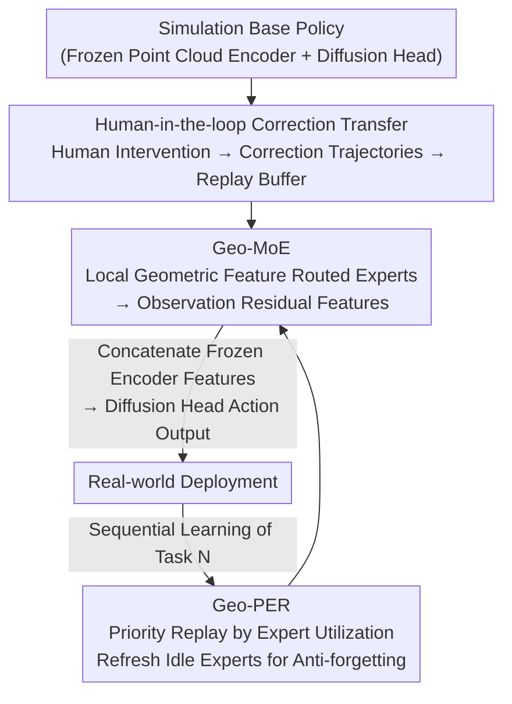

# GeCo-SRT: Geometry-aware Continual Adaptation for Cross-Task Sim-to-Real Transfer

**Conference**: CVPR 2026  
**Paper**: [CVF Open Access](https://openaccess.thecvf.com/content/CVPR2026/html/Yu_GeCo-SRT_Geometry-aware_Continual_Adaptation_for_Cross-Task_Sim-to-Real_Transfer_CVPR_2026_paper.html)  
**Code**: Yes (The paper states it is open-sourced; links are available on the CVF paper page)  
**Area**: Robotics / Embodied AI  
**Keywords**: sim-to-real, continual learning, geometric features, Mixture-of-Experts, experience replay  

## TL;DR
GeCo-SRT transforms "sim-to-real" transfer from a one-off parameter tuning process into a **cross-task continuous accumulation** process. It quantifies the sim-to-real gap using human-in-the-loop correction trajectories and utilizes the "Geometry-aware Mixture-of-Experts (Geo-MoE)" to treat local geometric features of point clouds (planarity, linearity, saliency) as reusable knowledge carriers involving both cross-task and cross-domain invariance. Furthermore, "Geometry-expert guided Priority Experience Replay (Geo-PER)" is employed to prevent idle experts from being forgotten. Ultimately, the average success rate on four real robotic arm tasks is 52% higher than the baseline, and performance parity is achieved using only 1/6 of the data.

## Background & Motivation
**Background**: Training real robots with low-cost simulation data is an attractive path, but an inevitable gap exists between simulation and reality (unrealistic rendering, physical simplifications), causing policies learned in simulation to suffer sharp performance drops upon real-world deployment—the classic "sim-to-real gap." Mainstream solutions fall into three categories: System Identification for modeling real physical parameters, Domain Randomization for training on numerous simulation variants, and data-driven correction methods (e.g., Transic using human correction trajectories).

**Limitations of Prior Work**: System identification relies on predefined model structures, involves high manual costs, and struggles to model complex nonlinear dynamics. Domain randomization depends on expert-configured randomization ranges, which may fail to cover the true characteristics of the real system. While data-driven methods move away from manual design, they are **restricted to single-task adaptation**. This means for every new task, data must be recollected and parameters retuned from scratch, completely wasting transfer experience accumulated from previous tasks.

**Key Challenge**: Existing methods treat every sim-to-real transfer as an **isolated transfer**, failing to reuse past transfer experience for new tasks. Essentially, they lack a knowledge carrier that is invariant across both tasks and domains—visual perception is extremely sensitive to domain shifts in texture and material, making it an unstable bridge.

**Key Insight**: The authors observe that **local geometric features** naturally possess dual invariance. First, they are **domain-invariant**: geometric structures derived from 3D data, such as surface normals and planarity, are consistent across simulation and reality, unlike textures that vary by domain. Second, they are **task-invariant**: the flat surface of a cube is both the grasping target for "pick cube" and a key feature for "stack cube." Geometric primitives (edges, corners) are shared across different manipulation tasks.

**Core Idea**: Treat local geometric features as **carriers for cross-task continual knowledge accumulation**. Use a Mixture-of-Experts network to allow different experts to specialize in different geometric patterns, and use experience replay to protect this expert knowledge from being overwritten by new tasks, thereby upgrading isolated transfer into "more efficient transfer over time" via continual adaptation.

## Method

### Overall Architecture
GeCo-SRT addresses two questions: (1) How to convert human-designed sim-to-real heuristics (when to correct) into a format learnable by neural networks? (2) What knowledge is actually transferable across multiple transfer iterations?

Regarding the first question, the method uses **human-in-the-loop** interaction to restructure sim-to-real transfer as "learning from human correction trajectories." First, a frozen base diffusion policy is trained in simulation using imitation learning. After deployment to the real environment, a human intervenes in real-time under a shared autonomy framework. The correction data $D^{hi}_{real}$ and simulation data $D^{ei}_{sim}$ are synthesized into a replay buffer $D^{mi}_{buf}$ to train a **shared perceptual residual module** $E^s_p$ to align point cloud observation features. Regarding the second question, the authors implement this shared residual module as a **Geo-MoE** (Geometry-aware Mixture-of-Experts), which extracts local geometric features and dynamically activates experts. Finally, **Geo-PER** prioritizes the replay of historical samples based on "expert utilization" during continual learning to protect specialized expert knowledge. The pipeline is as follows:

### Key Designs

**1. Human-in-the-loop Correction Transfer: Quantifying sim-to-real heuristics into learnable replay buffers**

The pain point is that "when and how to correct" resides as heuristics in the human brain, which neural networks cannot learn. The authors use a shared autonomy framework to make this explicit: for each task $i$, a base diffusion policy $\pi_{bi}$ (point cloud encoder $E^{bi}_p$ + diffusion action head $\pi^{bi}_h$) is trained in simulation by optimizing a simplified L2 diffusion loss $L_{diff}=\mathbb{E}[\|\epsilon-\epsilon_\theta(a^k_t,k,o_t)\|^2]$. Upon real-world deployment, if the operator predicts a failure at any timestep, they intervene to take over $a_t\leftarrow a^h_t$ and set the indicator $I^h_t$ to true; otherwise, the policy proceeds $a_t\leftarrow\pi_{bi}(o_t)$. These $(o_t,a_t,I^h_t)$ tuples form the real correction dataset $D^{hi}_{real}$, which is combined with simulation trajectories into the replay buffer $D^{mi}_{buf}$. Crucially, the **base policy $\pi_{bi}$ is frozen throughout**, and only the shared perceptual residual module $E^s_p$ is updated across all tasks. This allows it to gradually solidify reusable knowledge from each task buffer, turning "correction" into a sustainable data stream.

**2. Geo-MoE Geometry-aware Mixture-of-Experts: Local geometric features as cross-domain and cross-task knowledge**

This is the core of the method, addressing the question of "what knowledge is transferable." As the perceptual residual module $E^s_p$, Geo-MoE specifically handles local geometric discrepancies and dynamically activates specialized experts. Process: Local point groups $g_i$ are sampled from the input point cloud $P$ using k-Nearest Neighbors (k-NN). For each group, local PCA estimates three types of local geometric features—**planarity, linearity, and saliency**. A lightweight gating network $G$ calculates routing weights $w_i=\mathrm{Softmax}(G(g_i))$ for $M$ parallel experts. The group feature is the weighted sum of outputs:

$$g'_i = \sum_{j=1}^{M} w_{i,j}\cdot \mathrm{Expert}_j(g_i).$$

All group features are aggregated into a single correction residual vector $g'_{res}$, concatenated with the frozen base encoder output to form the corrected feature $\hat f=\mathrm{Concat}(E^{bi}_p(o), g'_{res})$, and fed into the diffusion head for action $\hat a=\pi^{bi}_h(\hat f)$. During training, only Geo-MoE is updated with $L_{total}=\mathrm{MSE}(\hat a,a)+\alpha L_{balance}$, where $L_{balance}$ is the standard auxiliary loss to prevent gating collapse. This is effective because, unlike methods using "global point clouds" to patch the sim-to-real gap, Geo-MoE routes different patterns based on local geometric attributes, learning finer-grained knowledge.

**3. Geo-PER Geometry-expert guided Priority Experience Replay: Replay by utilization to protect specialized knowledge**

When learning the $N$-th task, data from the previous $N-1$ tasks are stored in a unified replay buffer $R=\bigcup_{j=1}^{N-1}D^{mj}_{buf}$. The greatest challenge is **expert-level catastrophic forgetting**: standard PER prioritizes samples by task loss, which ignores "idle experts" not used in the current task, leading to the gradual loss of their specialized geometric knowledge. The core of Geo-PER is changing the priority metric **from task loss to expert utilization**. For every historical sample $i$, the expert activation vector $W_i=\{w_{i,1},\dots,w_{i,M}\}$ is stored. When processing new data for task $N$, the average utilization of each expert $U^{new}=\{u^{new}_1,\dots,u^{new}_M\}$ is calculated. The sampling priority for historical samples is updated as:

$$P_i \propto \sum_{j=1}^{M} w_{i,j}\cdot \frac{1}{u^{new}_j+\epsilon}.$$

This formula actively counteracts expert imbalance: if expert $j$ is rarely used in the new task (low $u^{new}_j$), its reciprocal $(u^{new}_j+\epsilon)^{-1}$ becomes large. Thus, historical samples that strongly activated that expert (high $w_{i,j}$) are sampled with high probability, ensuring the parameters of idle experts are consistently included in gradient updates.

### Loss & Training
Training occurs in two stages. Simulation stage: Diffusion base policy is trained with a learning rate of $3\times10^{-4}$, 10 denoising steps, action chunk size of 8, using 2000 expert trajectories. Continual sim-to-real stage: 60 human correction trajectories are collected per task, mixed with historical task data. Residual learning rate is $1\times10^{-3}$, and each expert’s learning rate is $1\times10^{-3}$. Geo-PER uses a priority exponent of 0.6, a smoothing term of $1\times10^{-6}$, and an EMA coefficient for priority updates of 0.4.

## Key Experimental Results
Evaluation covers 4 robotic arm manipulation tasks (Pick Cube / Stack Cube / Pick Banana / Plug Insert) across ManiSkill simulation and the real world (Xarm5 arm + Robotiq-2F140 gripper + fused point clouds from two RealSense D435/D435i). Two metrics: Success Rate (SR) for forward transfer (average of 30 trials per task) and Normalized Negative Backward Transfer (N-NBT) for catastrophic forgetting (lower is better).

### Main Results
Single-task sim-to-real transfer (Success Rate SR):

| Method | Pick Cube | Stack Cube | Pick Banana | Plug Insert | Average SR |
|------|-----------|------------|-------------|-------------|---------|
| Direct Deploy | 5.7% | 0.0% | 6.7% | 0.0% | 3.1% |
| Action Residual | 16.7% | 3.3% | 10.0% | 0.0% | 7.5% |
| Transic | 66.7% | 30.0% | 23.3% | 33.3% | 38.3% |
| **Geo-MoE (Ours)** | **80.0%** | **43.3%** | **40.0%** | **36.7%** | **50.0%** |

Direct deployment failed (3.1%), confirming a massive gap. Patching residues only in the action space (7.5%) is insufficient without addressing the observation gap.

Cross-task continual learning (Order: Pick Cube→Stack Cube→Pick Banana→Plug Insert; SR↑ / N-NBT↓ averages):

| Method | Average SR ↑ | Average N-NBT ↓ |
|------|-----------|--------------|
| Naive Fine-tuning | 9.2% | 75.0% |
| Transic + PER | 40.0% | 55.0% |
| Geo-MoE + EWC | 38.3% | 49.5% |
| Geo-MoE + PER | 55.8% | 29.6% |
| **Ours (GeCo-SRT)** | **63.3%** | **26.5%** |

Replacing the backbone with Geo-MoE significantly improved performance and reduced forgetting, and adding Geo-PER reached the highest success rate (63.3%) and lowest forgetting.

### Ablation Study
Decomposing the two core components of Geo-MoE (Observation Residual = aligning gaps using the point cloud encoder; MoE = Mixture-of-Experts architecture):

| Observation Residual | MoE | Average SR ↑ | Average N-NBT ↓ | Explanation |
|:---:|:---:|---------|--------------|------|
| × | × | 7.5% | 75.0% | Baseline (Action residual only) |
| × | ✓ | 9.2% | 65.5% | MoE is ineffective without informative features |
| ✓ | × | 45.8% | 37.0% | Observation residual provides the largest jump |
| ✓ | ✓ | **55.8%** | **29.6%** | Full model with complementary components |

### Key Findings
- **Observation residual is the primary driver**: Adding MoE alone (×,✓) yields negligible improvement (7.5%→9.2%), but adding the Observation Residual (✓,×) jumps SR to 45.8%—expert architectures require informative geometric features to function.
- **MoE specializes on stable features**: Adding MoE on top of the observation residual reaches 55.8% by routing geometric patterns to targeted experts.
- **Task geometric similarity determines transfer gains**: With scarce data (10 trajectories), transferring from Pick Cube to the similar Stack Cube is a significant positive transfer (40.0% vs. 26.7% from-scratch). 
- **Data Efficiency**: The continual version reaches 76.6% on Pick Cube with only 20 trajectories, matching from-scratch performance that uses 3× the data (60 trajectories).

## Highlights & Insights
- **The "dual invariance" of geometric features is the most clever thesis**: It grounds the abstract "what is transferable" into concrete, computable local geometry (planarity/linearity/saliency).
- **Geo-PER's utilization-based priority is a transferable trick**: In any MoE + continual learning scenario, using the reciprocal of utilization to force-refresh idle experts is a clean mechanism for anti-forgetting.
- **Frozen base policy + shared residual module** design creates a clear container for knowledge.

## Limitations & Future Work
- Evaluation is limited to 4 tasks on a single hardware platform (Xarm5); geometric diversity is relatively constrained.
- It relies on human correction trajectories (60 per task), which involves lower but non-zero human cost compared to manual tuning.
- Local geometric features estimated by PCA are sensitive to point cloud noise and depth camera accuracy; it may fail on texture-dominant tasks (flexible or transparent objects).

## Related Work & Insights
- **vs Transic**: Transic uses human correction for single-task transfer with a monolithic residual network. This work upgrades it with a Geo-MoE backbone and continual learning, achieving 63.3% vs. 40.0% success rates.
- **vs System ID / Domain Randomization**: This work bypasses explicit physical modeling and manual randomization ranges by using data-driven geometric residual alignment.
- **vs Standard Continual Learning (EWC / Standard PER)**: Neither account for expert-level utilization in MoEs. Geo-PER proves that aligning continual learning mechanisms with the MoE structure is necessary to maximize anti-forgetting.

## Rating
- Novelty: ⭐⭐⭐⭐⭐ 
- Experimental Thoroughness: ⭐⭐⭐⭐ 
- Writing Quality: ⭐⭐⭐⭐⭐ 
- Value: ⭐⭐⭐⭐ 

<!-- RELATED:START -->

## Related Papers

- [\[CVPR 2026\] GeCo-SRT: Geometry-aware Continual Adaptation for Robotic Cross-Task Sim-to-Real Transfer](gecosrt_geometryaware_continual_adaptation_for_rob.md)
- [\[CVPR 2026\] Contact-Aware Neural Dynamics](contact-aware_neural_dynamics.md)
- [\[CVPR 2026\] QuantVLA: Scale-Calibrated Post-Training Quantization for Vision-Language-Action Models](quantvla_scale-calibrated_post-training_quantization_for_vision-language-action_.md)
- [\[CVPR 2026\] GA-VLN: Geometry-Aware BEV Representation for Efficient Vision-Language Navigation](ga-vln_geometry-aware_bev_representation_for_efficient_vision-language_navigatio.md)
- [\[CVPR 2026\] GeoDexGrasp: Geometry-aware Generation for Data-efficient and Physics-plausible Dexterous Grasping](geodexgrasp_geometry-aware_generation_for_data-efficient_and_physics-plausible_d.md)

<!-- RELATED:END -->
