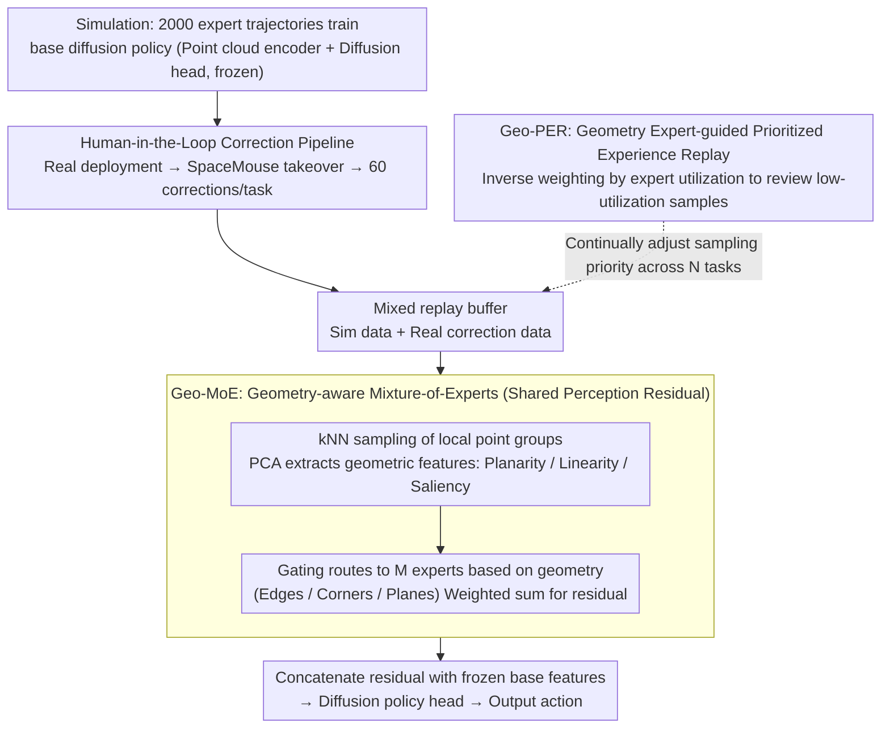

# GeCo-SRT: Geometry-aware Continual Adaptation for Robotic Cross-Task Sim-to-Real Transfer

**Conference**: CVPR 2026  
**arXiv**: [2602.20871](https://arxiv.org/abs/2602.20871)  
**Code**: None  
**Area**: Robotics / Embodied AI  
**Keywords**: Sim-to-Real Transfer, Continual Learning, Geometry-aware MoE, Point Cloud Representation, Experience Replay  

## TL;DR
GeCo-SRT proposes a continual cross-task Sim-to-Real transfer paradigm that leverages the domain and task invariance of local geometric features. By using a geometry-aware MoE module to extract reusable geometric knowledge and expert-guided prioritized experience replay to prevent forgetting, it achieves an average success rate improvement of 52% across four manipulation tasks compared to baselines, while requiring only 1/6 of the data.

## Background & Motivation
Traditional Sim-to-Real methods (system identification, domain randomization, data-driven transfer) treat each transfer as an independent process—every new task requires parameter tuning and data collection from scratch, which is costly and wastes prior experience. The Core Problem is that the Sim-to-Real gaps of different tasks actually share a significant amount of structured cross-domain knowledge (e.g., geometric shapes are consistent between simulation and reality), but existing methods cannot accumulate and reuse this knowledge across tasks.

## Core Problem
How can **transferable knowledge be continually accumulated** across multiple Sim-to-Real tasks so that each new task transfer is faster and better, rather than starting from zero? What knowledge representation is both cross-domain and cross-task?

## Method

### Overall Architecture

GeCo-SRT aims to address the efficiency loss of "starting each Sim-to-Real task from scratch" by linking multiple transfer tasks into a continual learning chain. The pipeline follows a Human-in-the-Loop mode: first, a base diffusion policy is trained in a simulator using 2,000 expert trajectories. Upon real-world deployment, an operator provides real-time error corrections via a SpaceMouse (approx. 60 correction trajectories per task). This correction data and simulation data are mixed into a single replay buffer to train only a shared perception residual module, Geo-MoE. The base policy remains frozen throughout, while knowledge is consolidated in this continually updated residual module. As tasks arrive sequentially, Geo-PER schedules replay sampling to prevent the forgetting of learned geometric knowledge.

### Key Designs

**1. Human-in-the-Loop Correction Pipeline: Quantifying the Sim-to-Real gap into cumulative correction trajectories**

Domain gaps are implicit and difficult to optimize directly. This work makes them explicit as human correction trajectories. A base diffusion policy (point cloud encoder + diffusion head) is first trained in simulation. During real-world deployment, an operator intervenes via SpaceMouse in a shared autonomy framework whenever failure is anticipated. These correction trajectories (approx. 60 per task) serve as concrete samples of the gap. By mixing correction data with simulation data and **updating only the shared perception residual module while freezing the base policy**, a clean path for "new knowledge from new tasks" is established—increments from each transfer accumulate in the same residual module.

**2. Geometry-aware Mixture-of-Experts (Geo-MoE): Using local geometry as a cross-domain, cross-task knowledge carrier**

The root cause of repeated parameter tuning is the lack of reusable knowledge that is both cross-domain (Sim/Real) and cross-task. The Key Insight here is that local geometric features possess this **dual invariance**—a plane or an edge looks the same in both sim and real (domain invariance) and appears across different tasks like grasping or stacking (task invariance). Geo-MoE implements the shared perception residual module: it samples local point groups via kNN, extracts features like planarity and linearity via PCA, and uses these to route groups to different experts. Each expert specializes in a geometric structure (edge/corner/plane). The weighted outputs are aggregated into a residual vector and concatenated with frozen base features.

**3. Geometry Expert-guided Prioritized Experience Replay (Geo-PER): Periodically refreshing idle experts**

In continual learning, standard PER based on task loss often ignores experts not used by the current task, leading to catastrophic forgetting of geometric knowledge from old tasks. Geo-PER shifts the priority from "task loss" to "expert utilization." It records expert activation vectors for historical samples. When adapting to a new task, it calculates the average utilization $u_j^{\text{new}}$ for each expert. If an expert is under-utilized in the current task, samples that **strongly activate that expert** (high weight $w_{i,j}$) are prioritized from the buffer:

$$P_i \propto \sum_{j=1}^{M} w_{i,j} \cdot \frac{1}{u_j^{\text{new}} + \epsilon}$$

This inverse weighting ensures all geometric experts are periodically reviewed, rather than only serving the current task.

### Loss & Training

$\mathcal{L}_{\text{total}} = \text{MSE}(\hat{a}, a) + \alpha \mathcal{L}_{\text{balance}}$, where the balance loss prevents gating collapse. Base policy training lr=$3 \times 10^{-4}$, residual learning lr=$1 \times 10^{-3}$; Geo-PER priority parameter 0.6, EMA update coefficient 0.4; 60 correction trajectories per task.

## Key Experimental Results

| Setting | Metric | GeCo-SRT | Transic+PER | Geo-MoE+PER | Direct Deploy |
|--------|------|------|----------|------|------|
| Single Task Transfer | Avg SR(%) | **50.0** | 38.3 | - | 3.1 |
| Continual 4-Task Transfer | Avg SR(%) | **63.3** | 40.0 | 55.7 | 3.1 |
| Continual 4-Task Transfer | Avg N-NBT(%) | **26.5** | 48.2 | 36.3 | - |
| Data Efficiency | Data to match baseline | **1/6** | - | - | - |

### Ablation Study
- The observation residual (point cloud encoder) is the most critical component: SR jumps from 3.1% to 45.8% upon inclusion.
- Adding MoE without the observation residual is ineffective (geometric routing requires meaningful base features).
- The combination of observation residual + MoE is optimal (55.8% SR).
- Geo-PER vs. standard PER: 63.3% vs. 55.7%, proving expert-level priority is superior to task-level loss priority.
- Task similarity impacts transfer: PickCube→StackCube shows positive transfer (40%), while PlugInsert→StackCube shows negative transfer (16.7%).
- Expert count $N=3$ is optimal; $N=2$ and $N=8$ are also robust (60-65%).
- New tasks (Faucet/Tidying): Continual learning (83.3/56.7%) significantly outperforms zero-shot (53.3/30%) and training from scratch (76.6/43.3%).

## Highlights & Insights
- First to extend Sim-to-Real transfer from isolated tasks to a continual cross-task knowledge accumulation paradigm.
- The insight regarding the "dual invariance" of local geometric features is novel and experimentally validated as an ideal knowledge carrier.
- The design of Geo-PER, shifting replay priority from task-level to expert-level, is unique and customized for MoE architectures.
- High data efficiency: 20 trajectories can approximate the performance of 60 trajectories trained from scratch.
- MoE interpretability: Visualizations show experts spontaneously specialize in edges, corners, and planes.

## Limitations & Future Work
- Primarily addresses the observation gap (vision); effectiveness on complex dynamics gaps (physics) is limited.
- Relies on Human-in-the-Loop correction data, which still requires human involvement despite needing only 60 trajectories.
- The 4-task scale is relatively small; effectiveness on much larger task sequences remains to be verified.
- Only uses point cloud input; RGB performance is significantly worse (40% vs 80%).

## Related Work & Insights
- **Transic**: Also uses human corrections for Sim-to-Real, but uses a behavioral cloning residual network without MoE or continual learning (38.3% single task vs. 50% for GeCo-SRT).
- **Domain Randomization**: Requires manual range tuning and is independent for each task; GeCo-SRT automatically accumulates knowledge.
- **LIBERO/LOTUS**: Continual learning for pure imitation learning without addressing the Sim-to-Real gap; GeCo-SRT introduces continual learning to Sim-to-Real transfer.

## Rating
- Novelty: ⭐⭐⭐⭐ Continual cross-task Sim-to-Real is a new setting; the Geo-MoE + Geo-PER combination is original.
- Experimental Thoroughness: ⭐⭐⭐⭐ 4+3 real robotic tasks, detailed ablation, transfer analysis, and interpretability.
- Writing Quality: ⭐⭐⭐⭐ Clear problem-driven structure and hierarchical methodology.
- Value: ⭐⭐⭐⭐ Provides a new continual learning perspective for Sim-to-Real transfer with high data efficiency.

<!-- RELATED:START -->

## Related Papers

- [\[CVPR 2026\] GeCo-SRT: Geometry-aware Continual Adaptation for Cross-Task Sim-to-Real Transfer](geco-srt_geometry-aware_continual_adaptation_for_cross-task_sim-to-real_transfer.md)
- [\[CVPR 2026\] RoboWheel: A Data Engine from Real-World Human Demonstrations for Cross-Embodiment Robotic Learning](robowheel_a_data_engine_from_real-world_human_demonstrations_for_cross-embodimen.md)
- [\[CVPR 2026\] Learning to See and Act: Task-Aware Virtual View Exploration for Robotic Manipulation](learning_to_see_and_act_task-aware_virtual_view_exploration_for_robotic_manipula.md)
- [\[CVPR 2026\] QuantVLA: Scale-Calibrated Post-Training Quantization for Vision-Language-Action Models](quantvla_scale-calibrated_post-training_quantization_for_vision-language-action_.md)
- [\[CVPR 2026\] GA-VLN: Geometry-Aware BEV Representation for Efficient Vision-Language Navigation](ga-vln_geometry-aware_bev_representation_for_efficient_vision-language_navigatio.md)

<!-- RELATED:END -->
