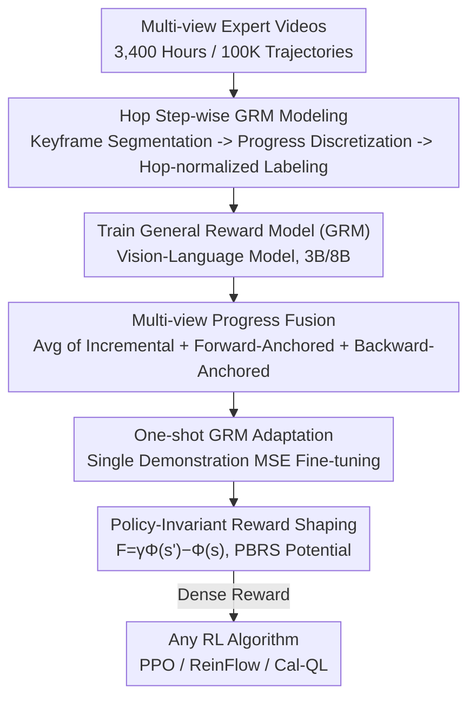

# General Process Reward Modeling for Robotic Reinforcement Learning

**Conference**: CVPR 2026  
**Paper**: [CVF Open Access](https://openaccess.thecvf.com/content/CVPR2026/html/Tan_General_Process_Reward_Modeling_for_Robotic_Reinforcement_Learning_CVPR_2026_paper.html)  
**Code**: https://robo-dopamine.github.io (Project Page)  
**Area**: Robotics / Reinforcement Learning / Reward Modeling  
**Keywords**: Process Reward Model, Robot Manipulation, Reinforcement Learning, Reward Shaping, Multi-view

## TL;DR
Ours proposes Robo-Dopamine: first training a "step-wise, cross-task" general process reward model (GRM) using 3,400 hours of multi-view video, then feeding dense signals to RL through a theoretically guaranteed "policy-invariant reward shaping" mechanism. This enables real-robot policies to improve from near 0% to a 95% success rate with a single demonstration and approximately 150 online rollouts (~1 hour).

## Background & Motivation

**Background**: Applying reinforcement learning to real-world robotic manipulation is primarily hindered by reward function design. Sparse binary rewards (1 for success, 0 otherwise) make exploration extremely difficult in long-horizon, contact-rich tasks. Conversely, hand-coded dense rewards require extensive domain knowledge and are difficult to scale. Consequently, recent research has shifted toward "learned" Process Reward Models (PRM), which use a model to estimate real-time task progress as a dense reward.

**Limitations of Prior Work**: The authors identify two fundamental flaws in existing PRMs. First, the reward models themselves are inadequate—many are task-specific with poor generalization, assume a uniform progress distribution (failing to capture differences between critical sub-steps), and rely on single-view observations, making them unable to judge fine-grained progress visible only from specific angles (e.g., wrist cameras) in occluded scenes. Second, the algorithms using these dense signals for reward shaping are often theoretically flawed: naively adding dense progress to the return induces a "semantic trap," where agents tend to "hover" in high-progress states to farm rewards rather than actually completing the task.

**Key Challenge**: Dense rewards can accelerate exploration, but unless they satisfy "optimal policy invariance," they implicitly alter the task objective and mislead the policy. Balancing dense guidance with objective consistency is an unavoidable tension in this research direction.

**Goal**: (1) Learn a cross-embodiment, cross-task, occlusion-robust step-wise progress reward model; (2) design a shaping scheme that utilizes dense signals while mathematically guaranteeing the preservation of the optimal policy; (3) enable real-robot policies to achieve efficient self-improvement with minimal online interaction.

**Key Insight**: The authors treat "task progress" itself as the supervision signal. Instead of directly regressing absolute progress, they learn the "relative relative progress" (hop) and utilize the classical Potential-Based Reward Shaping (PBRS) framework to guarantee policy invariance.

**Core Idea**: Construct a general reward model using "hop-normalized step-wise progress + multi-view fusion," then safely integrate it into any RL algorithm using policy-invariant shaping where "potential = progress."

## Method

### Overall Architecture
Robo-Dopamine consists of two main components: **Dopamine-Reward** (how to learn the GRM) and **Dopamine-RL** (how to safely use the GRM in RL). The former segments massive multi-view videos based on "sub-task keyframes," discretizes them into progress states, and trains a vision-language GRM in "hop" format to predict relative progress between any two states; during inference, robust progress is obtained by fusing predictions from three complementary views. The latter takes the pre-trained GRM, adapts it to new tasks via a single human demonstration, and uses progress as a potential function for policy-invariant reward shaping, which is then fed into arbitrary RL algorithms (e.g., PPO / ReinFlow / Cal-QL) for online learning.

### Key Designs

**1. Hop Step-wise Progress Modeling: Converting "Progress" into Bounded, Accumulatable Supervision**

The pain point is that directly regressing the absolute progress gain $\Phi_\delta(s_p,s_q)=\Phi(s_q)-\Phi(s_p)$ between two states leads to accumulated errors during iterative prediction, pushing the reconstructed progress $\Phi^\star(s)$ outside the $[0,1]$ range. The authors first segment each expert trajectory into sub-task segments using manually annotated multi-view keyframes $\{K_0,\dots,K_N\}$, then adaptively sample within each segment based on a chunk size $C$ ($m=\frac{1}{N}\lfloor L/C\rfloor$ intermediate points per segment) to obtain a state sequence and define ground-truth global progress $\Phi(s_i)=i/M$. Critically, instead of absolute gain, they learn the **hop**—a relative progress normalized by the "remaining/traveled" distance:

$$H(s_p,s_q)=\begin{cases}\dfrac{\Phi(s_q)-\Phi(s_p)}{\Phi(s_M)-\Phi(s_p)} & q\ge p\ (\text{PROGRESS})\\[2mm]\dfrac{\Phi(s_q)-\Phi(s_p)}{\Phi(s_p)-\Phi(s_0)} & q<p\ (\text{REGRESS})\end{cases}$$

Progress is normalized by "remaining distance to goal," while regression is normalized by "distance already traveled from start," squashing the supervision into $[-1,1]$. The theoretical benefit is that when iteratively applying predicted hops to reconstruct global progress, $\Phi^\star(s)$ is guaranteed to strictly fall within $[0,1]$ (proof provided in the appendix). During sampling, hops are discretized into $N_{hop}$ bins and temporal distances into $N_{dis}$ bins for balancing, with an additional proportion $\alpha$ of zero-hop samples ($|\Phi(s_q)-\Phi(s_p)|\le\epsilon$) injected to suppress bias toward static segments. The final pipeline yields 35M samples covering real-world, simulation, and first-person human videos.

**2. Multi-view Progress Fusion: Using Three Complementary Perspectives to Offset Drift**

Simple incremental prediction, while locally detailed, accumulates error drift along long trajectories. During inference, the authors calculate three versions of progress and average them. The incremental view iterates: $\Phi^\star_I(s_t)=\Phi^\star(s_{t-1})+\Delta\Phi^\star_{t-1,t}$, where the hop is scaled by sign ($H^\star\ge0$ multiplied by remaining $[1-\Phi^\star(s_{t-1})]$; $H^\star<0$ multiplied by traveled $\Phi^\star(s_{t-1})$). The forward-anchored view anchors to the initial zero-progress state $\Phi^\star_F(s_t)=H^\star(s_{init},s_t)$ providing a stable global reference; the backward-anchored view anchors to the goal state $\Phi^\star_B(s_t)=1+H^\star(s_{goal},s_t)$, being particularly sensitive near completion. Averaging the three $\Phi^\star(s_t)=\frac{1}{3}(\Phi^\star_I+\Phi^\star_F+\Phi^\star_B)$ combines the strengths of "local accuracy / start stability / end sensitivity" into a robust, drift-resistant progress estimate. Note that "multi-view" here refers both to these three anchoring methods and the input side, where wrist camera and third-person views are fed into the GRM simultaneously to resolve occlusions.

**3. One-shot GRM Adaptation: Aligning General Models to New Tasks with a Single Demo**

Since the pre-trained GRM already possesses a generalized prior for evaluating progress, it does not need retraining for new or high-precision tasks. Instead, it uses a single human demonstration $D_{human}$ for least-squares fine-tuning: $L_{GRM}(\omega)=\mathbb{E}_{(s_p,s_q)\sim D_{human}}\|H^\star_\omega-H_{gt}\|_2^2$, performing SFT from pre-trained parameters $\omega_0$ to obtain a task-adapted $GRM_{\omega^\star}$. This step is the prerequisite for the "0 to 95%" sample efficiency: calibrating the reward signal to the target task at minimal cost before online RL.

**4. Policy-Invariant Reward Shaping: Treating Progress as Potential to Cure the "Semantic Trap"**

Standard dense rewards $r=\Phi^\star(s_{t+1})-\Phi^\star(s_t)$ optimize discounted returns, which is equivalent to maximizing a rewritten objective $J'(\pi)\propto\mathbb{E}_\pi[\sum\gamma^{t-1}\Phi^\star(s_t)]$. This rewards "staying in high-progress states" rather than completing the task—the semantic trap. The authors require the shaping reward to satisfy three criteria: invariance of the optimal policy, compatibility with standard discounted returns/TD updates, and local calculability from single-step transitions. These uniquely determine the potential-based form. Deriving from continuous-time "discounted potential" $e^{-\lambda t}\Phi^\star(s_t)$, the discrete single-step increment is $F(s_t,s_{t+1})=\gamma\Phi^\star(s_{t+1})-\Phi^\star(s_t)$ (where $\gamma=e^{-\lambda h}$). Sparse success rewards are automatically determined: when estimated progress $\Phi^\star(s_{t+1})\ge1-\delta$ ($\delta=0.05$), the task is considered complete with $r_{gold}=1$. The final reward is:

$$r_{GRM}(s_t,a_t,s_{t+1})=r_{gold}+\gamma\Phi^\star(s_{t+1})-\Phi^\star(s_t)$$

Since the shaping term is a telescoping sum along the trajectory, its accumulation collapses into a constant boundary term $-\Phi^\star(s_0)$ dependent only on the initial state $s_0$. Consequently, the shaped Q-function is merely a state-wise translation of the original Q: $Q^\pi_{GRM}(s,a)=Q^\pi_{gold}(s,a)-\Phi^\star(s)$. Because the translation is independent of action $a$, $\arg\max_a Q^\star$ remains unchanged—this is the classic PBRS framework. Here, progress $\Phi^\star$ acts as the potential function, providing dense guidance without altering the optimal policy. This framework is universal for online/offline/offline-to-online and value-based/gradient-based RL algorithms.

### Loss & Training
GRM pre-training learns relative progress on 35M hop samples. Downstream adaptation uses a single demonstration for MSE fine-tuning (Eq. 9). The RL stage uses $r_{GRM}$ (Eq. 11), which can be directly integrated into algorithms like PPO (with OpenVLA-OFT), ReinFlow (with π0), or Cal-QL (real-robot offline-to-online).

## Key Experimental Results

### Main Results
The authors evaluate GRM's progress awareness across 8 datasets using Video Ordinal Correlation (VOC: rank correlation between predicted progress and true temporal order of shuffled frames, range $[-1,1]$, higher is better) and evaluate policy learning in simulation and on real robots.

| Evaluation | Metric | GVL | VLAC-2B | GRM-8B Single-view | GRM-8B Multi-view |
|------|------|------|---------|--------------|--------------|
| VOC Mean (Sparse/Med/Dense) | Rank Corr ↑ | 0.20 / 0.12 / 0.13 | 0.24 / 0.29 / 0.33 | 0.92 / 0.91 / 0.89 | **0.96 / 0.96 / 0.94** |
| Task Completion (Avg of 60 tests) | Accuracy ↑ | 37.2% | 33.9% | 83.9% | **92.8%** |

In task completion judgment, GRM-8B Multi-view (92.8%) outperformed general large models like GPT-5 (83.9%), Gemini-2.5-Pro (81.1%), and Qwen3-VL (76.7%). Baseline PRMs (GVL/VLAC) significantly degraded as sampling density increased, while GRM remained stable and high-performing across all densities.

Policy Performance: After one-shot adaptation, Dopamine-RL improved real-robot policies from near 0% to a 95% success rate with ~150 online rollouts (~1 hour of interaction), reaching 100% on some tasks. In simulation (Insert-Squares / Stack-Three-Cubes / Fold-the-Towels), success rates increased by approximately +38.3, +68.2, and +55.0 percentage points compared to sparse-reward RL.

### Ablation Study

| Configuration | VOC Mean (S/M/D) | Description |
|------|------------------|------|
| GRM-8B Multi-view (Full) | 0.96 / 0.96 / 0.94 | Multi-view Input + Multi-view Fusion |
| GRM-8B Single-view | 0.92 / 0.91 / 0.89 | Performance drop without multi-view inputs |
| GRM-3B Multi-view | 0.96 / 0.94 / 0.93 | Still far exceeds baselines at 3B parameters |
| GVL / VLAC-2B | ≤0.33 | Existing PRM baselines |

### Key Findings
- **Multi-view is critical for robustness**: The improvement from single-view to multi-view is most pronounced in dense sampling (0.89 -> 0.94), confirming that wrist cameras are indispensable in occluded scenarios.
- **Baselines degrade with density, Ours does not**: This indicates that hop-normalization + multi-view fusion captures fine-grained temporal dynamics rather than relying on coarse keyframe heuristics.
- **Process Reward Models can surpass general LMMs**: GRM-8B Multi-view outperforming GPT-5 (92.8% vs 83.9%) proves that specialized small models for robotic progress modeling are more reliable than general VLMs.
- **Extremely high sample efficiency**: Achieving 95% success from near zero in 1 hour is due to one-shot adaptation calibrating the reward and policy-invariant shaping preventing wasted exploration.

## Highlights & Insights
- **Applying PBRS theory to solve specific "symptoms"**: The semantic trap is essentially caused by shaping modifying the objective. Using potential-based shaping (telescoping sum collapsing to constant) mathematically guarantees policy invariance, which is much cleaner than empirical dense reward addition.
- **The "relative relative" design of hop is clever**: Normalizing by remaining/traveled distance provides directional signals while naturally bounding reconstructed progress within $[0,1]$, avoiding the boundary violations and error accumulation of absolute regression.
- **Decoupled and algorithm-agnostic**: $r_{GRM}$ is a plug-and-play reward compatible with PPO/ReinFlow/Cal-QL. Migrating to a new robot stack only requires swapping the RL backend while keeping the reward side intact.
- **Data scale as a moat**: 3,400 hours, 100K trajectories, 350+ daily tasks, and a mix of real/sim/human videos provide the foundation for GRM's cross-embodiment generalization. This labeling pipeline itself is highly reusable.

## Limitations & Future Work
- **Reliance on manual keyframe segmentation**: GRM training data depends on human-annotated multi-view keyframes for sub-task segmentation, which is costly and limits further scaling.
- **Blind spots of progress as the sole reward**: Treating "completion" as the only signal leaves the model unable to account for non-progress objectives like safety, energy efficiency, or collision avoidance. Complex constrained tasks may require additional reward terms.
- **OOD hallucinations still require safeguards**: The authors include a section on perception-robust estimation in the appendix to mitigate hallucinations in OOD scenarios, suggesting that GRM may still provide incorrect progress outside its distribution.
- **Limited real-robot evaluation scale**: Evaluation on 8 real-robot tasks and 60 rollouts is relatively small. Stability on larger-scale, long-horizon tasks remains to be verified.

## Related Work & Insights
- **vs. Task-specific PRMs (e.g., SARM)**: These design rewards for single tasks with poor generalization; Ours uses hop + large-scale multi-embodiment data for a general GRM, transferable via one-shot adaptation.
- **vs. General VLMs as rewards (GVL)**: GVL uses VLMs to judge progress directly, but degrades severely as sampling density increases; GRM uses relative progress supervision and multi-view fusion to remain stable under dense sampling.
- **vs. Naive dense reward shaping**: Directly adding progress differences leads to semantic traps (stalling); Ours uses the PBRS potential form to guarantee policy invariance, avoiding this at the root.
- **vs. Imitation Learning (IL)**: IL relies on static expert data and suffers from poor sample efficiency and OOD generalization; Ours uses RL + dense GRM rewards to surpass the static data performance cap through online interaction.

## Rating
- Novelty: ⭐⭐⭐⭐⭐ The trio of hop relative progress + multi-view fusion + policy-invariant shaping addresses both major flaws of the PRM route.
- Experimental Thoroughness: ⭐⭐⭐⭐ Extensive VOC evaluation on 8 datasets + real/sim policies + multiple RL algorithms, though real-robot judgment scale is small.
- Writing Quality: ⭐⭐⭐⭐ Clear logic and solid theoretical foundation, though heavy equations require referring to the appendix.
- Value: ⭐⭐⭐⭐⭐ 0 to 95% in 1 hour on real robots has direct practical value for reward engineering in robotic RL.

<!-- RELATED:START -->

## Related Papers

- [\[ICLR 2026\] MVR: Multi-view Video Reward Shaping for Reinforcement Learning](../../ICLR2026/robotics/mvr_multi-view_video_reward_shaping_for_reinforcement_learning.md)
- [\[ICLR 2026\] APPLE: Toward General Active Perception via Reinforcement Learning](../../ICLR2026/robotics/apple_toward_general_active_perception_via_reinforcement_learning.md)
- [\[CVPR 2026\] DemoFunGrasp: Universal Dexterous Functional Grasping via Demonstration-Editing Reinforcement Learning](demofungrasp_universal_dexterous_functional_grasping_via_demonstration-editing_r.md)
- [\[AAAI 2026\] Actor-Critic for Continuous Action Chunks: A Reinforcement Learning Framework for Long-Horizon Robotic Manipulation with Sparse Reward](../../AAAI2026/robotics/actor-critic_for_continuous_action_chunks_a_reinforcement_le.md)
- [\[CVPR 2026\] Learning to See and Act: Task-Aware Virtual View Exploration for Robotic Manipulation](learning_to_see_and_act_task-aware_virtual_view_exploration_for_robotic_manipula.md)

<!-- RELATED:END -->
