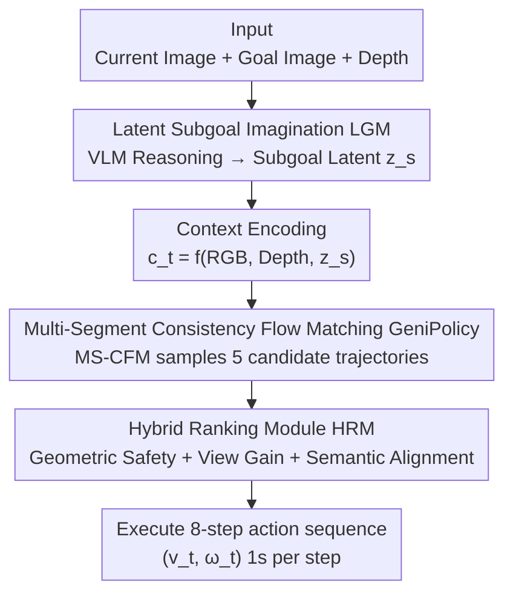

# GeniNav: Generative Model Driven Image-Goal Navigation via Imagination-Guided Consistency Flow Matching

**Conference**: CVPR 2026  
**Paper**: [CVF Open Access](https://openaccess.thecvf.com/content/CVPR2026/html/Chen_GeniNav_Generative_Model_Driven_Image-Goal_Navigation_via_Imagination-Guided_Consistency_Flow_CVPR_2026_paper.html)  
**Code**: Project Page https://cyq638.github.io/geninav/ (No public repository seen)  
**Area**: Robotics / Embodied AI  
**Keywords**: Image-goal navigation, generative policy, flow matching, latent subgoal, trajectory evaluation  

## TL;DR
GeniNav employs a VLM to "imagine" intermediate subgoals in a latent space to guide a Multi-Segment Consistency Flow Matching (MS-CFM) policy for generating smooth trajectories. A Hybrid Ranking Module (HRM), which integrates geometric safety, semantic alignment, and field-of-view gain, is then used to select the optimal path, improving the success rate from ~54% to 68.7% in mapless image-goal navigation.

## Background & Motivation
**Background**: Image-goal navigation requires a robot to reach a target viewpoint based only on current RGB-D observations and a goal image, without a pre-built map. Early works used deterministic policies to map observations directly to low-level actions, but step-by-step decision-making ignores the fact that "multiple feasible paths exist to the goal," leading to short-sighted behavior and difficulties in long-range planning. Recently, generative policies (diffusion / flow matching) have become mainstream—they produce coherent action sequences at once and can reason over multiple candidate paths. NoMaD uses diffusion policies for iterative denoising, while FlowNav uses Conditional Flow Matching (CFM) to achieve similar expressiveness with fewer inference steps.

**Limitations of Prior Work**: The authors identify three specific shortcomings. First, methods like NoMaD are essentially local planners that rely on pre-built topological maps for intermediate targets; exploration efficiency is low when maps are missing, especially when semantic differences between the start and goal are large. Second, although diffusion-based frameworks offer multimodal flexibility, they do not fully utilize semantic and safety cues, often generating kinematically valid but semantically suboptimal paths. Third, the field lacks a unified closed-loop benchmark—existing datasets only provide open-loop trajectories or static scene reconstructions, preventing fair and reproducible comparisons.

**Key Challenge**: There is a disconnect between the "multimodal sampling capability" of generative policies and "semantic/geometric constraints." While multiple paths can be sampled, there is no reliable mechanism to judge which is both semantically correct and physically feasible. Simultaneously, explicitly generating intermediate subgoal images (e.g., ViNT, ImagineNav) is prone to producing geometrically inconsistent or unreachable hallucinated targets.

**Goal**: To unify three components within a single framework under a mapless setting: (1) providing reliable intermediate semantic guidance for the policy; (2) generating temporally consistent and smooth trajectories; and (3) evaluating and selecting the final trajectory using unified multimodal criteria.

**Key Insight**: Rather than generating explicit subgoal images, subgoals should be represented as **latent semantic features** reasoned by a VLM. This implicitly ensures geometric feasibility while maintaining semantic alignment and directional consistency, avoiding the hallucination problems of explicit image subgoals.

**Core Idea**: Use a VLM to imagine subgoals in the latent space to "pull" a multi-segment consistency flow matching policy, followed by a hybrid ranker that considers both geometric safety and semantic alignment, complemented by a unified closed-loop benchmark to standardize the process.

## Method

### Overall Architecture
GeniNav models image-goal navigation as a **continuous multi-segment flow process** driven by multimodal perception. Given the current RGB image $I^{rgb}_t$, depth map $I^{dep}_t$, and subgoal features $z_s$ extracted from the LGM, the system first encodes semantic, geometric, and task information into a unified context $c_t = f_\theta(\phi(I^{rgb}_t), \psi(I^{dep}_t), z_s)$. Conditioned on $c_t$, GeniPolicy uses MS-CFM to transform Gaussian noise into goal-oriented action sequences segment by segment, sampling 5 candidate trajectories $A_k$ at once. Finally, the HRM evaluates candidates under triple criteria—geometric feasibility, view visibility, and semantic consistency—to select the execution path. The framework is trained in two stages: pre-training the LGM on "observation-goal" pairs, followed by joint optimization with GeniPolicy to ensure consistency between guidance and trajectories.

The three contributing modules form a clear pipeline: LGM imagines subgoals → GeniPolicy generates candidate trajectories → HRM ranks and selects the path.

### Key Designs

**1. Latent Subgoal Imagination Module (LGM): Imaging intermediate goals in latent space via VLM rather than generating images**

Traditional image-goal navigation uses only a single goal embedding as a policy condition, which provides weak semantic guidance and fails to capture intermediate semantic dependencies, often leading to long-range planning failure. Explicitly generating subgoal images introduces geometric inconsistencies and unreachable targets. LGM's approach is to represent subgoals as **latent semantic features**, acting as an interface between "semantic reasoning" and "trajectory generation." Specifically, the current observation $I^{rgb}_t$, goal image $I_g$, and a text navigation prompt $P$ are fed into Qwen2.5-VL-7B: text is tokenized, and the two images are encoded by a 2D visual encoder into image tokens. All tokens are fused through a multimodal transformer, and the last hidden state $X_{vlm}$ is taken. A lightweight transformer encoder-decoder module then aggregates cross-modal context to enhance spatial-semantic alignment, followed by mean-pooling and an MLP projection to obtain the latent subgoal $z_s$. The key is that the VLM does not explicitly draw a subgoal image but **implicitly infers navigation intent** through vision-text attention, thereby bypassing the hallucination issues of explicit image subgoals.

Since $z_s$ lacks explicit constraints, the authors use three complementary auxiliary losses to "shape" the latent space: (i) **Semantic Alignment Loss** $L_{sem}$ aligns $z_s$ with future subgoal features extracted by a pre-trained vision-language teacher, guiding it to encode task-relevant future context; (ii) **Geometric Embedding Loss** discretizes the relative pose of the current-target viewpoint into SE(2) classifications—radial distance $r$ and orientation angle $\phi$ are divided into $N_r$ and $N_\theta$ bins, and the model predicts $p_\theta(\phi|z_s)$ and $p_\theta(r|z_s)$ optimized via cross-entropy; (iii) **Contrastive Regularization** $L_{NCE}$ enhances inter-instance discrimination to prevent representation collapse. The total objective is:

$$L_{total} = \lambda_{sem}L_{sem} + \lambda_{dir}L_{dir} + \lambda_{dis}L_{dist} + \lambda_{nce}L_{NCE}$$

The resulting latent space is both semantically aligned and geometrically grounded, providing stable conditional signals for GeniPolicy.

**2. GeniPolicy and Multi-Segment Consistency Flow Matching (MS-CFM): Partitioning global flows into segments with independent yet consistent segments to ensure temporal smoothness**

Standard Flow Matching (FM) uses a global vector field $v_\theta$ to deterministically evolve Gaussian noise $a_0$ along a trajectory $\gamma_a(\tau)$ to the target action. The training objective is to minimize the difference between the predicted and ground-truth velocities $L_{FM}=\mathbb{E}\|v_\theta(\tau,a_t^\tau|c_t)-u_t(a_t^\tau|c_t)\|_2^2$. A problem is that a single global field tends to produce curved, temporally inconsistent trajectories in long-range control. Consistency Flow Matching (CFM) introduces velocity alignment constraints $v(t,\gamma_a(t))=v(s,\gamma_a(s))$ to enforce consistency along time, making trajectories straighter and more stable.

MS-CFM further partitions the time interval $[0,1]$ into $K$ local segments, each with an independent conditional vector field $v^{(i)}_\theta$. The local flow mapping within a segment is defined as $f^{(i)}_\theta(\tau,a_t^\tau|c_t)=a_t^\tau+(\frac{i}{K}-\tau)v^{(i)}_\theta(\tau,a_t^\tau|c_t)$. The training loss aligns the flow mapping and velocity of adjacent moments within each segment (using EMA parameters $\theta^-$ and a small offset $\Delta\tau$):

$$L_{GeniPolicy} = \mathbb{E}_{\tau\sim U_i}\Big[\|f^{(i)}_\theta(\tau)-f^{(i)}_{\theta^-}(\tau+\Delta\tau)\|_2^2 + \alpha\|v^{(i)}_\theta(\tau)-v^{(i)}_{\theta^-}(\tau+\Delta\tau)\|_2^2\Big]$$

During inference, the vector field evolves deterministically along $K$ segments $a^{i/K}_t=a^{(i-1)/K}_t+\frac{1}{K}v^{(i)}_\theta(\frac{i-1}{K},a^{(i-1)/K}_t|c_t)$. The advantage of this multi-segment design is that it maintains global smoothness (linked by consistency constraints to form a piecewise linear flow) while allowing each segment to locally adapt to changes in the action distribution—providing more expressiveness than a single global flow and requiring far fewer inference steps than diffusion policies.

**3. Hybrid Ranking Module (HRM): Filtering by geometric safety, then selecting the path via GPT-4V semantic scoring and field-of-view gain weighting**

Generating 5 candidates is insufficient; a unified criterion is needed to pick the one that is "both physically feasible and semantically correct." HRM first discretizes each continuous trajectory into a sequence of 3D poses, transforms them to the camera frame using the extrinsic matrix $T_{cam\leftarrow robot}$, and projects them into pixel polylines onto the current frame using the intrinsic matrix $K$. Three evaluations follow:

- **Geometric Safety**: Discrete 3D points are projected onto the depth map. If $z'_i - I^{dep}_t(u_i,v_i) > \delta$ ($\delta$ is a safety tolerance for sensor noise and robot volume), a collision is detected. Any trajectory containing collision points is discarded; only collision-free trajectories proceed.
- **Semantic Alignment**: The projected visualization and text descriptions of the current/goal images generated by the LGM are combined into a vision-language prompt for GPT-4V to obtain a semantic score $\tilde{R}_k$. This measures the matching of the trajectory endpoint orientation, spatial consistency, and semantic relevance to the target scene.
- **View Gain**: $M$ rays are sampled uniformly within a $\pm30°$ horizontal field-of-view around the endpoint orientation $\theta^{(k)}_{end}$. These are projected onto the depth map to get visible depths, normalized as $\tilde{S}^k_{view}=\frac{1}{M D_{max}}\sum_{m=1}^{M}D_t(u_m,v_m)$. A higher score indicates fewer occlusions at the endpoint, favoring exploration.

Finally, trajectories passing the safety constraint are weighted by $F_k=\lambda_1\tilde{R}_k+\lambda_2\tilde{S}^k_{view}$, and the path $k^*=\arg\max_k F_k$ is selected. HRM differs from cost-guided methods that only look at low-level spatial cues or pure VLM evaluations that only look at semantics by unifying visual relevance, geometric feasibility, and dynamic stability into a single multimodal score.

### Loss & Training
Two-stage training: In the first stage, LGM is pre-trained on observation-goal pairs (sum of four losses: semantic alignment, SE(2) geometric classification, and contrastive regularization, Eq. 1). In the second stage, LGM and GeniPolicy are jointly optimized using the intra-segment consistency loss of MS-CFM (Eq. 6) to ensure alignment between subgoal guidance and generated trajectories. During inference, 5 candidates are sampled at each step, each containing 8 steps of actions, with each step executed for 1 second.

## Key Experimental Results

### Main Results
All methods were trained on the Gibson training set and evaluated under mapless, no-prior, consistent sensor input conditions. Methods dependent on global maps (NoMaD/FlowNav/NaviDiffusor/MetricNet/NaviBridger) were modified to use only the goal image, and LiDAR methods (LDP/DTG/VL-TGS) were modified to use Habitat depth maps. Evaluation was performed on the Gibson validation set for in-domain performance and MP3D for cross-domain generalization (without fine-tuning).

| Method | Selection | Gibson SR%↑ | Gibson SPL%↑ | Gibson CR%↓ | MP3D SR%↑ | MP3D SPL%↑ | MP3D CR%↓ |
|------|----------|------|------|------|------|------|------|
| NoMaD | Random | 35.0 | 22.3 | 21.3 | 24.4 | 11.9 | 28.8 |
| FlowNav | Random | 44.7 | 27.7 | 15.1 | 31.5 | 22.6 | 21.3 |
| NaviDiffusor | Cost-Guided | 48.0 | 37.4 | 12.8 | 40.9 | 28.6 | 18.3 |
| MetricNet | Cost-Guided | 54.5 | 43.3 | 11.9 | 41.2 | 29.4 | 17.5 |
| VL-TGS | VLM | 48.2 | 37.6 | 14.2 | 35.6 | 25.0 | 20.3 |
| NavDP | Critic-Guided | 52.4 | 41.5 | 13.6 | 40.6 | 28.4 | 19.5 |
| **GeniNav (Ours)** | **HRM** | **68.7** | **59.4** | **9.8** | **55.2** | **45.7** | **14.2** |

Compared to the strongest generative baseline, MetricNet, GeniNav achieved a +14.2 increase in SR and +16.1 in SPL on Gibson, while reducing CR from 11.9 to 9.8. It maintained the highest SR/SPL on MP3D, demonstrating that relying only on vision and depth—without any pre-built maps—can generate geometrically consistent, dynamically stable trajectories with cross-domain robustness. The authors also conducted sim-to-real experiments: after fine-tuning on small-scale real-world data, the model was deployed on a physical robot with a RealSense D435i, running in real-time on an RTX 6000 Ada, producing smooth, collision-free, and semantically aligned trajectories without maps.

### Ablation Study
Ablation was performed on Gibson / MP3D validation sets per module (Gibson values shown below):

| Config | Gibson SR↑ | Gibson SPL↑ | Gibson CR↓ | Description |
|------|------|------|------|------|
| **Full GeniNav** | **68.7** | **59.4** | **9.8** | Full model |
| w/o LGM | 58.2 | 48.8 | 14.1 | Only goal embedding used; SR drops 10.5 |
| w/o Aux Loss | 61.8 | 50.9 | 12.7 | Removed auxiliary losses; latent drift and collisions increase |
| w/ Explicit Image Subgoal | 62.5 | 51.6 | 11.2 | Explicit diffusion of subgoal images (ViNT-style); worse than latent design |
| Conditional Flow Matching | 63.7 | 53.2 | 13.5 | Single global flow; curved trajectories and temporal inconsistency |
| Diffusion Policy | 39.0 | 26.4 | 25.7 | Insufficient diffusion steps under same budget; significant performance drop |
| Random Selection | 53.2 | 37.5 | 18.9 | HRM replaced with random; goal preference unstable and drifting |
| Critic-based Eval. | 63.8 | 53.5 | 14.1 | HRM replaced with critic (NavDP-style); subject to domain bias |
| VLM Eval. | 60.3 | 51.4 | 15.8 | HRM replaced with pure VLM; lacks geometric awareness, selects unsafe paths |

### Key Findings
- **GeniPolicy (MS-CFM) provides the largest contribution**: Replacing it with Diffusion Policy under the same inference budget caused SR to plummet from 68.7 to 39.0 and CR to spike to 25.7—multi-segment consistency flow is decisive for efficiency and temporal stability in generative navigation. Replacing it with a single global CFM also dropped SR to 63.7, proving the utility of the "segmentation."
- **Latent Subgoals > Explicit Image Subgoals**: The "w/ Explicit Image Subgoal" variant (62.5) outperformed the unsupervised variant but still lost to the full latent design (68.7), confirming that explicit subgoals lead to inconsistency and unreachability. Auxiliary losses are also critical; removing them significantly increased collisions.
- **HRM must consider geometric and semantic factors**: Pure VLM evaluation (60.3) selects "semantically reasonable but spatially unsafe" trajectories, while critic evaluation (63.8) has domain bias and poor generalization. Only HRM, integrating geometric safety, view gain, and semantic alignment, reaches 68.7.
- **Dataset Scale**: GeniBench (491.6 km) is larger than NavDP's 363.2 km and is the only one supporting data-aligned closed-loop evaluation.

## Highlights & Insights
- **"Latent Imagination" instead of "Image Imagination"**: Changing subgoals from "generating a future image" to "latent semantic features reasoned by a VLM" simultaneously avoids hallucinations and reachability issues while remaining naturally end-to-end trainable—this is an elegant interface for connecting VLMs to navigation policies.
- **Multi-Segment Consistency Flow Matching**: MS-CFM reconciles "global smoothness" and "local adaptation" using $K$ independent vector fields and intra-segment consistency losses; it is a natural upgrade of FlowNav-style CFM for long-range control.
- **Transferable HRM Criteria**: The "hard filtering by safety followed by soft weighting" paradigm (Geometric Safety → Semantic Alignment → View Gain) can be directly migrated to any robotics task that generates multiple candidate trajectories.
- **Closed-loop Benchmark GeniBench**: Includes 176 scenes (86 Gibson + 90 MP3D), 491.6 km of data, and realistic robot dynamics, filling the void for unified closed-loop testing in generative navigation.

## Limitations & Future Work
- **Heavy Reliance on Large Models**: Online inference requires GPT-4V for HRM semantic scoring and Qwen2.5-VL-7B for LGM. Real-time performance and cost are concerns for deployment (papers claim real-time on RTX 6000 Ada, but GPT-4V latency/cost details are missing; ⚠️ refer to original text).
- **Indoor Focused**: GeniBench consists entirely of indoor scenes (Gibson/MP3D); generalization to outdoor, dynamic pedestrians, or large-scale scenes is unverified.
- **Fixed Candidate Count**: Sampling exactly 5 candidates per step may not provide sufficient coverage at complex intersections; the relationship between candidate count and performance lacks systematic analysis.
- **Qualitative Sim-to-Real**: Real-world deployment is shown via visuals without quantitative SR/SPL, making the cross-domain gap hard to evaluate.

## Related Work & Insights
- **vs. NoMaD / FlowNav**: These are local planners dependent on pre-built topological maps and use random trajectory selection; GeniNav is mapless and uses HRM for active selection, improving Gibson SR from 35.0/44.7 to 68.7.
- **vs. ViNT / ImagineNav**: These generate explicit intermediate subgoal images prone to geometric inconsistency; GeniNav uses latent subgoals to implicitly ensure feasibility (Explicit: 62.5 < Latent: 68.7).
- **vs. VL-TGS**: Uses CVAE generation and language-driven selection, where latents are prone to mode collapse and selection ignores geometry; GeniNav uses flow matching to avoid collapse and HRM considers both safety and stability (MP3D SR 35.6 → 55.2).
- **vs. NavDP**: Uses a critic for safety evaluation in sim-to-real, but the benchmark has only 3 scenes and the critic is domain-biased; GeniNav’s HRM requires no critic training and covers 176 scenes in GeniBench.

## Rating
- Novelty: ⭐⭐⭐⭐ The combination of latent subgoal imagination, multi-segment consistency flow, and hybrid geometric-semantic selection is a novel system design for image-goal navigation.
- Experimental Thoroughness: ⭐⭐⭐⭐ In-domain/cross-domain datasets, per-module ablation, and sim-to-real included; however, real-world results are qualitative and hyperparameter analysis for candidate counts is missing.
- Writing Quality: ⭐⭐⭐⭐ Three modules correspond to three contributions; formulas and motivations are clearly explained.
- Value: ⭐⭐⭐⭐ Delivery of both a method and a closed-loop benchmark (491.6 km) provides practical value to the generative navigation community.

<!-- RELATED:START -->

## Related Papers

- [\[CVPR 2026\] Global Prior Meets Local Consistency: Dual-Memory Augmented Vision-Language-Action Model for Efficient Robotic Manipulation](global_prior_meets_local_consistency_dual-memory_augmented_vision-language-actio.md)
- [\[CVPR 2026\] ActiveGrasp: Information-Guided Active Grasping with Calibrated Energy-based Model](activegrasp_information-guided_active_grasping_with_calibrated_energy-based_mode.md)
- [\[CVPR 2026\] FloVerse: Floor Plan-Guided Multi-Modal Navigation](floverse_floor_plan-guided_multi-modal_navigation.md)
- [\[ICLR 2026\] Sparse Imagination for Efficient Visual World Model Planning](../../ICLR2026/robotics/sparse_imagination_for_efficient_visual_world_model_planning.md)
- [\[CVPR 2026\] Memory-Augmented Scene Understanding and Exploration for Open-World Aerial Object-Goal Navigation](memory-augmented_scene_understanding_and_exploration_for_open-world_aerial_objec.md)

<!-- RELATED:END -->
