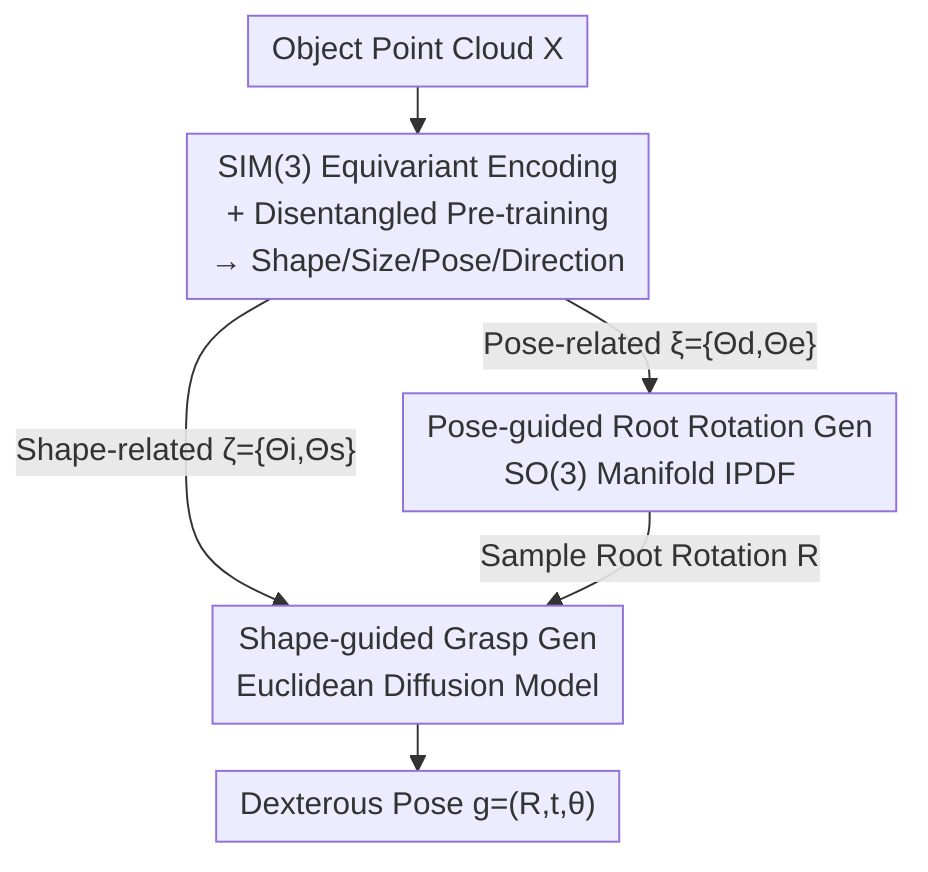

# GeoDexGrasp: Geometry-aware Generation for Data-efficient and Physics-plausible Dexterous Grasping

**Conference**: CVPR 2026  
**Paper**: [CVF Open Access](https://openaccess.thecvf.com/content/CVPR2026/html/Han_GeoDexGrasp_Geometry-aware_Generation_for_Data-efficient_and_Physics_plausible_Dexterous_Grasping_CVPR_2026_paper.html)  
**Code**: https://xjtbinghan.github.io/GDG.github.io (Project Page)  
**Area**: Robotics / Dexterous Grasping  
**Keywords**: Dexterous Grasping, SIM(3) Equivariance, Geometric Representation, Diffusion Models, Physical Plausibility

## TL;DR
GeoDexGrasp utilizes a SIM(3) equivariant network with self-supervised disentangled pre-training to extract four categories of interpretable and transferable geometric representations (shape, size, pose, and interaction direction) from point clouds. It decomposes dexterous grasping into a two-stage decoupled pipeline: "root rotation generation on the SO(3) manifold + finger joint diffusion generation in Euclidean space." It achieves comparable success rates with less than one-fifth of the parameters of SOTA models and reduces penetration depth by approximately 40%.

## Background & Motivation
**Background**: Recent trends in dexterous grasping (e.g., using the 24-DoF ShadowHand) prioritize data-driven generative methods—utilizing CVAE, Glow flow, or diffusion models to fit multi-modal distributions from "object point cloud $X$ to hand pose $g=(R,t,\theta)$" on large-scale datasets like DexGraspNet, UniDexGrasp, and DexGraspAnything, trading data volume for diversity.

**Limitations of Prior Work**: These methods focus primarily on statistical fitting while neglecting inherent geometric priors of grasping. This leads to two consequences: first, **low data efficiency**, where success rates collapse significantly as data decreases; second, **poor physical plausibility**, as many "successful" grasps in simulation rely on "over-grasping," where fingers penetrate deeply into the object, making them unusable on real hardware.

**Key Challenge**: Models treat the same object under different rotations, scales, or poses as entirely new samples to memorize, rather than inferring grasping strategies based on shape, size, and orientation as humans do. Low-level networks lack intrinsic invariant/equivariant structures for SIM(3) transformations, forcing them to recall these transformations through massive data augmentation.

**Goal**: To simultaneously improve the data efficiency and physical plausibility of dexterous grasp generation using object-centric geometric representations, while achieving generalization to unseen sizes.

**Key Insight**: Human grasping relies on object geometry (shape, size, pose) for reasoning. The authors introduce equivariant networks (which embed geometric inductive biases into the architecture without needing to learn transformations from data) into high-DoF dexterous grasping—a gap where previous equivariant work was mostly limited to parallel grippers or policy learning.

**Core Idea**: First, a SIM(3) equivariant network with self-supervised disentangled pre-training is used to learn **interpretable and transferable** geometric representations (shape, size, pose, and interaction direction). Grasp generation is then **decoupled** into two distinct spaces: a probabilistic model on the SO(3) manifold for rotation and a diffusion model in Euclidean space for finger joints, each guided by corresponding geometric conditions.

## Method

### Overall Architecture
The input is an object point cloud $X\in\mathbb{R}^{N\times3}$, and the output is a set of high-quality, diverse dexterous hand poses $G=\{g_i\}$, where $g=(R,t,\theta)$: $R\in SO(3)$ is the root rotation, $t\in\mathbb{R}^3$ is the root translation, and $\theta\in\mathbb{R}^{24}$ represents the finger joint angles. The pipeline consists of three stages: **Stage 1** learns geometric representations (a SIM(3) equivariant network with self-supervised disentangled pre-training, supplemented by PointSO for interaction directions); **Stage 2** generates root rotations on the SO(3) manifold using pose-related representations $\xi=\{\Theta_d,\Theta_e\}$; **Stage 3** transforms the problem into a rotation-invariant task once the root rotation is fixed, using shape/size-related representations $\zeta=\{\Theta_i,\Theta_s\}$ as conditions for a Euclidean diffusion model to generate finger joint angles and root translation.

This "staged + space-decoupled" design stems from the observation that root rotation exists on the SO(3) manifold while finger joints reside in Euclidean space; coupling them for simultaneous generation is inefficient and difficult to converge. Formally, the joint distribution is factorized as:

$$p(g \mid X, \hat{\Theta}) = p(R \mid \xi)\cdot p(t,\theta \mid X, R, \zeta)$$

### Key Designs

**1. SIM(3) Equivariant Encoding + Disentangled Pre-training: Transforming transformations into structural biases**

To address the root cause of low data efficiency (treating rotated/scaled objects as new samples), the authors use a SIM(3) equivariant network $\Phi$ (based on the Vector Neuron framework with a VN-Transformer backbone) to encode point clouds. Equivariance is defined as: $f(\Gamma X)=\Gamma f(X)$ for any rigid transformation $\Gamma=(R,t,s)\in SIM(3)$. This produces latent representations $\Theta=\Phi(X):=(\Theta_e,\Theta_i,\Theta_c,\Theta_s)$ such that:

$$\Gamma\Theta = (\Theta_e R,\ \Theta_i,\ s\Theta_c R + t,\ s\Theta_s) = \Phi(sXR+t)$$

Where $\Theta_e\in\mathbb{R}^{C\times3}$ is the rotation-equivariant feature, $\Theta_i\in\mathbb{R}^{C}$ is the invariant feature, $\Theta_c$ is the centroid (used only for normalization), and $\Theta_s$ is the scale factor. As the object rotates/scales, the representations transform accordingly, removing the need for the network to "memorize" these transformations from data.

To align these symmetries with high-level semantics (shape, pose), **disentangled pre-training** is applied. Based on the principle that shape-encoding representations should reconstruct the object, two lightweight MLP branches are used: a pose branch regressing rotation $R_r$ from $\Theta_e$, and a shape branch reconstructing the point cloud $X_r$ from $\Theta_i$. The predicted rotation is applied to the reconstruction $Y=X_r R_r$, and constrained via a bidirectional Chamfer distance with the input $X$:

$$L_{pretrain}=\sum_{x\in X}\min_{y\in Y}\|x-y\|_2^2+\sum_{y\in Y}\min_{x\in X}\|y-x\|_2^2$$

After pre-training, the **encoder is frozen**. Additionally, since $\Theta_e$ lacks an explicit frame of reference, the authors use **PointSO** (a foundation model pre-trained on 3D data) to provide explicit interaction directions $\Theta_d=\Psi(X,l)$ based on language prompts. The final set of representations is $\hat\Theta=\{\Theta_d,\Theta_e,\Theta_i,\Theta_s\}$.

**2. Pose-guided Root Rotation Generation: Modeling rotation on the SO(3) manifold**

To solve the inefficiency of synchronous rotation and finger generation, Stage 2 generates the root rotation distribution $p(R\mid\xi)$ using pose-related representations $\xi=\{\Theta_d,\Theta_e\}$. The authors employ IPDF—a probabilistic density model on SO(3) that uniformly samples rotations using an equi-volume grid on a sphere. Interaction directions $\Theta_d$ and pose features $\Theta_e$ are fused and projected as conditional features. IPDF outputs unnormalized log-probabilities for fixed voxel bins:

$$p(R\mid\xi)=\frac{p(\xi,R)}{p(\xi)}\approx\frac{1}{V}\frac{\exp(f(\xi,R))}{\sum_{i=1}^{N}\exp(f(\xi,R_i))}$$

Where $N$ is the number of bins and $V=\pi^2/N$ is the bin volume. Training uses the negative log-likelihood $L_{rot}=-\log p(R_{gt}\mid\xi)$. At inference, $R$ is sampled randomly from the discrete distribution. This preserves multiple degrees of freedom, allowing the model to grasp objects from different angles rather than just horizontally.

**3. Shape-guided Grasp Generation: Rotation-invariant task with shape/size-conditional diffusion**

Once root rotation $R$ is determined, the point cloud and root translation are normalized: $\hat X=XR^{-1}$ and $\hat t=tR^{-1}$. The task becomes rotation-invariant: finger angles and root translation depend solely on object shape and size, converting $p(t,\theta\mid X,R, \zeta)$ to $p(\hat t,\theta\mid\hat X, \zeta)$. The authors use DDPM for denoising $h=(\hat t,\theta)\in\mathbb{R}^{3+K}$ in Euclidean space:

$$p_\theta(h_{0:T}\mid\hat X,\zeta)=p(h_T)\prod_{\tau=1}^{T}p_\theta(h_{\tau-1}\mid h_\tau,\hat X,\zeta,\tau)$$

Condition injection is crucial: shape representation $\Theta_i$ and scale $\Theta_s$ undergo Hadamard modulation to predict coefficients $\beta,\gamma$, which then modulate 3D features $V$ extracted by a PointTransformer as denoising conditions. The loss function includes standard noise MSE plus two geometric constraints: contact encouragement loss $L_c$ (guiding hand points toward the surface) and penetration penalty $L_p$ (penalizing intersection):

$$L_{grasp}=\eta_1 L_{MSE}+\eta_2 L_c+\eta_3 L_p$$

These constraints, combined with decoupled shape/size conditions, ensure generated grasps conform to object boundaries without penetration.

### Loss & Training
The SIM(3) equivariant network undergoes disentangled pre-training on the DexGraspAnything (DGA) dataset. In the main phase, the rotation generation module (Stage 2) and grasp generation module (Stage 3) are trained separately until convergence before joint fine-tuning.

## Key Experimental Results

Test objects were **unseen** during both pre-training and strategy training. Metrics: Physical Plausibility (penetration depth, lower is better), Success Rate (stability under 6-directional perturbations in Isaac Gym), and Diversity (std. deviation of joint values/root rotations).

### Main Results: Grasp Quality (Avg. across 5 datasets)

| Method | Penetration↓ (mm, Avg.) | Success Rate↑ (%, Avg.) | Params (M) |
|------|------|------|------|
| UniDexGrasp | 29.3 | 25.4 | 117.9 |
| SceneDiffuser | 30.8 | 37.1 | 27.5 |
| UGG | 25.5 | 44.7 | 67.0 |
| DexGraspAnything (Prev. SOTA) | 21.2 | 58.5 | 159.7 |
| D(R,O) | 26.0 | 49.7 | 14.1 |
| **GeoDexGrasp (Ours)** | **13.6** | **60.1** | 28.7 |

Penetration depth dropped from the previous SOTA of 21.2mm to 13.6mm (~40% reduction), with consistent leads across datasets. The average success rate of 60.1% was the highest, while parameter count was less than 1/5 of DexGraspAnything (28.7M vs 159.7M). Qualitatively, while prior models were often limited to horizontal grasps, ours enables multi-angle grasping with significantly less penetration.

### Ablation Study (DexGRAB Dataset)

| Config | Decoupled | $\Theta_e,\Theta_d$ | $\Theta_s,\Theta_i$ | Pre-training | Success↑ | Penetration↓ |
|------|:--:|:--:|:--:|:--:|------|------|
| a | | | | | 41.8 | 40.7 |
| b | ✓ | | | | 56.1 | 33.8 |
| c | ✓ | ✓ | | | 58.6 | 31.5 |
| d | ✓ | ✓ | ✓ | | 63.2 | 19.9 |
| e (Full) | ✓ | ✓ | ✓ | ✓ | **67.5** | **15.5** |

### Key Findings
- **Space Decoupling provided the biggest gain**: Transitioning from a to b (adding decoupling) jumped success from 41.8% to 56.1%, validating that separating SO(3) rotation from Euclidean finger generation eases convergence.
- **Shape-Size representations manage "Non-penetration"**: Adding $\Theta_s,\Theta_i$ (c to d) reduced penetration from 31.5 to 19.9, showing shape conditions help the model "see" boundaries; pose representations $\Theta_e,\Theta_d$ primarily improved success rates.
- **Disentangled Pre-training value**: d to e added +4.3% success and -4.4mm penetration, confirming the benefit of aligning equivariant features with high-level semantics.
- **Data Efficiency**: When reducing training data per object from 100% to 25%, baselines collapsed, while ours maintained high success—proving geometric priors are effective in low-data regimes.
- **Size Generalization**: Outperformed baselines on Cube/Cylinder/Torus (even OOD sizes). On complex topologies like the Toy Horse, all methods struggled due to the **contact mode reconfiguration** caused by scaling, which makes the joint-action mapping highly non-linear.

## Highlights & Insights
- **"Using the appropriate mathematical structure for each space"**: Root rotation belongs to the SO(3) manifold while fingers reside in Euclidean space. Instead of forcing a single network to fit both, the authors used appropriate probabilistic models (IPDF / Diffusion)—embedding task structure into the design rather than relying on massive data.
- **Combining Equivariance with Disentangled Pre-training**: Equivariance provides the low-level inductive bias for transformation consistency, while pre-training (reconstruction as a proxy) aligns this with high-level shape/pose semantics.
- **Lightweight yet Powerful**: Achieving SOTA performance with less than 1/5 the parameters suggests geometric priors are more cost-effective than pure data/parameter scaling for this task.
- **Exposing Success Rate Inflation**: The authors emphasize that many "successful" simulation grasps are physically impossible due to over-grasping—using penetration depth as a reality check for physical plausibility is insightful.

## Limitations & Future Work
- The mapping from size representations to dexterous actions is highly non-linear; explicit scale factors provided limited gains and require further exploration.
- Methods failed on topologically complex objects (Toy Horse), as contact mode reconfiguration under scale remains unsolved.
- Currently uses global shape representations; future work will incorporate local features for fine-grained contact modeling.
- Real-world deployment relies on SAM3D to reconstruct geometry from RGB-D to narrow the sim-to-real gap; performance degradation if reconstruction fails was not analyzed.

## Related Work & Insights
- **vs DexGraspAnything (Prev. SOTA)**: DGA fixes root rotation to the identity matrix to avoid coupling, sacrificing DoF; ours uses SO(3) IPDF to model rotation separately, maintaining multi-angle capability with lower penetration and 1/5 the parameters.
- **vs UniDexGrasp**: UDG also uses rotation-finger decoupling but employs Glow flow without explicit geometric representations; ours uses equivariant pre-training for interpretable conditions, boosting efficiency.
- **vs Equivariant Robotics (EquiAct / EquiBot)**: While prior work introduced SIM(3)/SE(3) equivariance to parallel grippers or policy learning, this is the first application to high-DoF dexterous grasp generation.
- **vs Optimization-based methods (D(R,O))**: Optimization provides stable solutions but is slow with poor exploration; our generative approach with geometric priors is superior in both penetration and average success.

## Rating
- Novelty: ⭐⭐⭐⭐ First introduction of SIM(3) equivariance + disentangled pre-training to dexterous grasping with a clear two-stage space-decoupled design.
- Experimental Thoroughness: ⭐⭐⭐⭐ Massive dataset coverage, data efficiency, and size generalization analyses; real-world testing provided.
- Writing Quality: ⭐⭐⭐⭐ Clear logic from motivation to methodology; well-defined representations.
- Value: ⭐⭐⭐⭐ Lightweight, low-penetration, and transferable representations are highly practical for real-world robotic deployment.

<!-- RELATED:START -->

## Related Papers

- [\[CVPR 2025\] DexGrasp Anything: Towards Universal Robotic Dexterous Grasping with Physics Awareness](../../CVPR2025/robotics/dexgrasp_anything_towards_universal_robotic_dexterous_grasping_with_physics_awar.md)
- [\[CVPR 2026\] GA-VLN: Geometry-Aware BEV Representation for Efficient Vision-Language Navigation](ga-vln_geometry-aware_bev_representation_for_efficient_vision-language_navigatio.md)
- [\[CVPR 2026\] DextER: Language-driven Dexterous Grasp Generation with Embodied Reasoning](dexter_language-driven_dexterous_grasp_generation_with_embodied_reasoning.md)
- [\[AAAI 2026\] Towards Affordance-Aware Robotic Dexterous Grasping with Human-like Priors](../../AAAI2026/robotics/towards_affordance-aware_robotic_dexterous_grasping_with_human-like_priors.md)
- [\[CVPR 2026\] MaskDexGrasp: Generative Masked Modeling for Part-Aware Dexterous Grasp Synthesis](maskdexgrasp_generative_masked_modeling_for_part-aware_dexterous_grasp_synthesis.md)

<!-- RELATED:END -->
