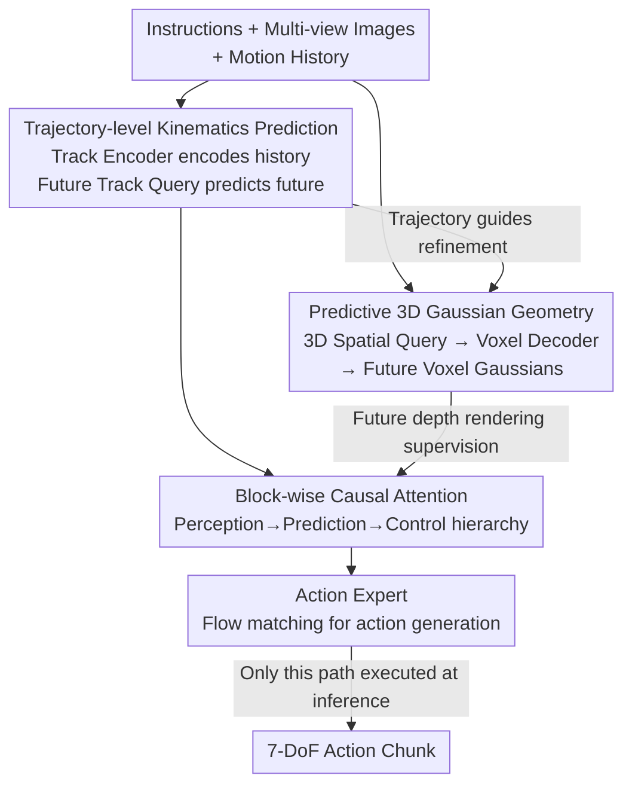

# GeoPredict: Leveraging Predictive Kinematics and 3D Gaussian Geometry for Precise VLA Manipulation

**Conference**: CVPR 2026  
**Paper**: [CVF Open Access](https://openaccess.thecvf.com/content/CVPR2026/html/Qian_GeoPredict_Leveraging_Predictive_Kinematics_and_3D_Gaussian_Geometry_for_Precise_CVPR_2026_paper.html)  
**Code**: [Project Page](https://jingjingqian75.github.io/GeoPredict-Page/) (Code not yet open source)  
**Area**: Robotics / Embodied AI  
**Keywords**: VLA, Robot Manipulation, Predictive Kinematics, 3D Gaussian Geometry, Training-time Supervision

## TL;DR
GeoPredict augments a continuous-action VLA policy (based on $\pi_0$) with two "future prediction" auxiliary tasks—predicting multi-step 3D trajectories of robot keypoints and predicting future 3D Gaussian geometry of the workspace. These two modules serve as supervision signals **only during training** and are not executed during inference. This allows the policy to learn internal representations oriented toward 3D space and long-horizon dynamics without increasing deployment overhead, significantly outperforming the $\pi_0$ baseline on RoboCasa, LIBERO, and real-world platforms.

## Background & Motivation
**Background**: Vision-Language-Action (VLA) models map the semantic and visual priors of pre-trained VLMs directly to robot actions. These models exhibit strong generalization and represent the current mainstream paradigm for manipulation policies (e.g., OpenVLA, $\pi_0$).

**Limitations of Prior Work**: These models are primarily "2D-centric and reactive"—they only process current observations and output actions directly in the image plane, lacking explicit 3D spatial modeling. Their reliability falters in tasks requiring precise 3D reasoning (e.g., judging object poses, gaps, or end-effector movement in workspace coordinates) and long-horizon, physically consistent control.

**Key Challenge**: While existing "predictive" visuomotor works (predicting future RGB, depth, or point clouds) provide temporal signals, they are mostly view-independent and do not enforce multi-view or 3D geometric consistency. Conversely, tightly coupling high-capacity 3D prediction modules with large VLA backbones—requiring complex 3D decoding during inference—results in computational overhead too high for real-time deployment. Thus, a tension exists between "wanting 3D predictive capability" and "wanting lightweight inference."

**Goal**: To equip VLA with two predictive capabilities simultaneously: (1) **Predictive Kinematics Priors**: Summarizing how the robot will likely move in the next several steps rather than looking only at instantaneous joint states; (2) **Predictive 3D Gaussian Geometry**: Using an explicit, differentiable representation aligned with the workspace to reason about scene evolution, supervised by depth or multi-view signals. The key constraint is that these predictive signals must be seamlessly integrated into the VLA with **almost no increase in inference overhead**.

**Core Idea**: Treat "predicting future trajectories" and "predicting future 3D Gaussian geometry" as **purely training-time auxiliary supervision** to shape the Transformer's internal representations. During inference, these modules are entirely removed, making the action generation path identical to the original VLA. In short—leverage "learning two extra prediction tasks during training while running none during inference" to obtain 3D priors and deployment efficiency simultaneously.

## Method

### Overall Architecture
GeoPredict is built upon a strong continuous-action VLA ($\pi_0$). $\pi_0$ utilizes PaliGemma (with a SigLIP vision encoder) as the VLM, followed by a robot-specific action expert that integrates noise into a 7-DoF action chunk $A_t=[a_t,\dots,a_{t+H-1}]$ via conditional flow matching ($H=50$, each $a_t\in\mathbb{R}^7$ includes translation, rotation offsets, and gripper state). GeoPredict attaches two prediction modules to this backbone and processes them via a central Transformer using block-wise causal attention.

The pipeline is as follows: given instructions, multi-view images, and motion history encoded by a Track Encoder, the central Transformer learns two tasks. First, it predicts multi-step 3D keypoint trajectories using a set of learnable Future Track Queries. Second, it predicts future workspace geometry (a set of 3D Gaussians) via 3D Spatial Queries and a Voxel Decoder. The predicted future trajectories, in turn, guide the Gaussian geometry via **track-guided refinement**, concentrating geometric capacity on interaction regions. Finally, the action expert generates actions. Note that the predicted trajectories and Gaussians are **used only for training supervision** (trajectories via MSE, Gaussians via future depth map rendering); these modules are not executed during inference.

### Key Designs

**1. Trajectory-level Kinematics Prediction: Injecting kinematics priors via historical and future tracks**

To address the issue where models "only see instantaneous states and cannot anticipate robot movement," GeoPredict models movement at the trajectory level. It tracks $K$ 3D keypoints (joints + end-effector; $K=8$ for LIBERO/RoboCasa, $K=7$ for real robots). On the **historical side**, the Track Encoder compresses the trajectory $T^k\in\mathbb{R}^{(t-1)\times 3}$ of each keypoint from time 0 to $t-1$ into a history token. A shared learnable query $Q_{hist}$ performs cross-attention over the embedded trajectory to obtain $Z^{hist}_k=\mathrm{CrossAttn}(Q_{hist}, \mathrm{MLP}(T^k), \mathrm{MLP}(T^k))$. These tokens encode inertia, joint limits, and movement patterns before being concatenated into the Transformer input. On the **future side**, $K$ learnable future track queries $\{q^{fut}_k\}$ are processed alongside instructions, current images, and history tokens to obtain future track embeddings $e^{fut}_k$. A shared MLP with 1D sinusoidal temporal encoding then decodes these into explicit coordinates for $H+1$ timesteps:

$$\hat p_{k,t+\tau}=\mathrm{MLP}\big(e^{fut}_k+\mathrm{PE}_{time}[\tau]\big),\quad \tau=0,\dots,H.$$

Training is supervised by MSE across all keypoints and timesteps: $L_{track}=\frac{1}{K(H+1)}\sum_k\sum_\tau\|\hat p_{k,t+\tau}-p^{gt}_{k,t+\tau}\|_2^2$. This provides a dual benefit: forcing the Transformer backbone to learn "dynamically consistent" motion representations and providing explicit future trajectories for the subsequent Gaussian module's spatial refinement.

**2. Predictive 3D Gaussian Geometry: Explicit future workspace geometry prediction via 3D Gaussians**

To address the "2D-centric, lack of explicit 3D geometry" limitation, this module predicts the future geometry of the workspace. The workspace (e.g., $1.6\times1.6\times1.0$ m) is discretized into voxels $v=0.04$m, then downsampled 4x per axis to create a coarse grid $N_x\times N_y\times N_z$. Each coarse voxel is assigned a learnable $C$-dimensional embedding to form spatial queries, coupled with 3D sinusoidal positional encodings $Q_{spatial}=Q_{init}+\mathrm{PE}_{spatial}$, flattened into a sequence for the Transformer. After attention, $E^{spatial}$ is obtained, and time-shifted versions $E^{spatial}_{t+\tau}=E^{spatial}+\mathrm{PE}_{time}[\tau]$ are constructed using temporal encodings. These are restored to the original voxel resolution via a Voxel Decoder (transposed convolutions/upsampling). Finally, a 3D convolution maps each voxel feature to $N_G$ 3D Gaussian primitives $g=\{\mu,\alpha,\Sigma\}$ (center, opacity, covariance). Since the focus is on geometry rather than appearance, **color coefficients are intentionally omitted**. The union of all voxel Gaussians forms the initial scene representation $G^{init}_{t+\tau}$. This concretizes "future prediction" as a "predictive differentiable 3D Gaussian field," which enforces 3D consistency more effectively than 2D image/depth prediction.

**3. Track-guided refinement: Focusing Gaussian capacity on interaction regions using predicted trajectories**

While coarse Gaussians capture the overall layout, precise manipulation requires high-fidelity geometry in interaction zones (near the end-effector, joints, and target objects). This design links the predicted trajectories (Design 1) with the Gaussians (Design 2). At time $t+\tau$, a binary refinement mask is defined for each voxel—set to 1 if any predicted keypoint $\hat p_{k,t+\tau}$ falls within that voxel:

$$M_{refine}[i,j,k]=\begin{cases}1,&\exists\, p\in P_{t+\tau}\ \text{s.t.}\ p\in V[i,j,k]\\0,&\text{otherwise}\end{cases}$$

For selected voxels, a shared MLP decodes the voxel features into $N'_G$ additional, finer Gaussians ($N'_G > N_G$, finalized at $N_G=4, N'_G=64$), forming the union $G^{total}_{t+\tau}=G^{init}_{t+\tau}\cup G^{refine}_{t+\tau}$. The advantage is that refined voxels occupy only a small fraction of the total volume. Thus, increasing $N'_G$ from 8 to 64 barely changes training time (15.5 to 15.7 h/epoch) while enabling precise refinement where the robot "intends to go," proving faster and more accurate than a globally high-resolution Gaussian grid (which takes 19.1 h/epoch for $N_G=8$).

**4. Future Depth Rendering Supervision + Block-wise Causal Attention**

How are the Gaussians supervised? $G^{total}_{t+\tau}$ is **rendered into depth maps** using differentiable alpha-compositing across all $H+1$ timesteps (rendering depth only, not color). For a pixel ray $r$, the accumulated transmittance is $T_i=\prod_{j<i}(1-\alpha_j)$, and the rendered depth is $\hat D(r)=\sum_{i\in N}T_i\alpha_i d_i$. A workspace mask $M_{spatial}$ is added to calculate the masked L1 depth loss $L_{depth}$ only for rays falling within the predefined workspace after back-projection. Integration into the Transformer follows a **block-wise causal attention** scheme modified from $\pi_0$: tokens are grouped into five sets in the order: (1) 2D Tokens (Text+Image) → (2) 3D Tokens (History Tracks) → (3) 3D Queries (Future Tracks + Spatial Queries) → (4) State Tokens (Proprioception) → (5) Action Noise. Within-block attention is bidirectional, while cross-block attention is strictly causal. This enforces a **"Perception → Prediction → Control" hierarchy**, ensuring action blocks generate movement conditioned on integrated 2D/3D perception and future motion/geometry predictions.

### Loss & Training
The model is trained end-to-end with a weighted sum of three terms: $L_{total}=\lambda_1 L_{action}+\lambda_2 L_{track}+\lambda_3 L_{depth}$, where $L_{action}$ is the continuous flow-matching loss from $\pi_0$, and all $\lambda$ are set to 1.0. Training spans 40,000 steps using AdamW (LR 2.5e-5) on 8×H20 GPUs with a total batch size of 32 and a prediction horizon $H=50$. Observations include 2 environment cameras + 1 wrist camera, with depth supervision applied only to the two $224\times224$ environment cameras. At **inference**, all context tokens (text, image, history, 3D queries) are computed once and their KV pairs cached. The action expert uses these to iteratively denoise actions; the voxel decoder, depth rendering, and other geometric modules are **not executed**, maintaining the original VLA action path.

## Key Experimental Results

### Main Results
Simulations were performed on RoboCasa (Human-50 few-shot, only 50 human demonstrations per task) and LIBERO. The primary baseline is $\pi_0$ without prediction modules to isolate the method's contribution.

| Benchmark | Setting | $\pi_0$ Baseline | GeoPredict (Ours) | Gain |
|------|------|---------|-----------|------|
| RoboCasa Human-50 | Avg. Success Rate (24 tasks) | 42.3% | **52.4%** | +10.1% |
| LIBERO | Avg. (4 suites) | 93.9% | **96.5%** | +2.6% |
| LIBERO-Long | Long-horizon suite | 87.6% | **94.0%** | +6.4% |

On RoboCasa, GeoPredict (52.4%) significantly outperforms other future-prediction/world-model methods (GWM at 39.2%) and 2D policies (BC-Transformer at 28.8%). On LIBERO, the average of 96.5% exceeds the current SOTA UniVLA (95.2%), leading across all four suites (Spatial 98.0 / Object 98.2 / Goal 95.7 / Long 94.0).

| Real Robot Task | $\pi_0$ Baseline | GeoPredict (Ours) | Gain |
|----------|---------|-----------|------|
| Spatial (Unseen placement) | 60.0% | **85.0%** | +25.0% |
| Geometry (Unseen object sizes) | 50.0% | **95.0%** | +45.0% |
| Robustness (Distractors) | 35.0% | **90.0%** | +55.0% |

On a real DISCOVER arm (50 demonstrations per task, 20 trials), the gains are particularly stark. The +45% in "Geometry" indicates that predictive 3DGS provides a generalizable understanding of 3D geometry, allowing the policy to adapt its grasp to object geometry—something the 2D-centric $\pi_0$ lacks.

### Ablation Study
Bottom-up addition of modules on RoboCasa (Avg. Success Rate %):

| Configuration | Avg. Success Rate | Description |
|------|-----------|------|
| $\pi_0$ Baseline | 42.3 | No predictive modules |
| + History Track Encoder | 44.8 | Historical kinematics prior |
| + Future Track Query ($L_{track}$) | 47.2 | Explicit future trajectory prediction |
| + Future Depth (Init $G^{init}$ only) | 49.4 | Added predictive 3DGS depth supervision |
| $L_{track}+L_{depth}$ (No refinement) | 50.5 | Joint training without track-guided refinement |
| + Track-guided refinement (Full) | **52.4** | Complete model |

Further ablation of the depth rendering design: Color rendering (49.2%) does not outperform depth-only rendering (49.4%), confirming geometric information is sufficient. Global refinement at $N_G=8$ reaches 51.4% but increases training time from 12.0 to 19.1 h/epoch. In contrast, track-guided refinement ($N_G=4, N'_G=64$) requires only 15.7 h/epoch to achieve the peak of 52.4%.

### Key Findings
- **3DGS geometry module provides the largest contribution**: The jump from 47.2% (kinematics only) to 49.4% (adding depth supervision) is the largest single gain. Track-guided refinement adds another +1.9% (50.5% → 52.4%), validating that using kinematics to refine 3DGS provides superior geometric priors.
- **Refinement is more cost-effective than global resolution**: Interaction zones occupy a fraction of the volume, so increasing $N'_G$ to 64 adds almost zero overhead (15.5 to 15.7 h), whereas increasing global resolution ($N_G=8$) is slower and less accurate (51.4%).
- **Highest gains in geometry-sensitive scenarios**: Real-robot tasks showed gains of +45% in Geometry and +55% in Robustness, suggesting predictive geometric priors are most effective when spatial/geometric reasoning is critical. Few-shot RoboCasa also benefited significantly (+10.1%).

## Highlights & Insights
- **"Training-time supervision, inference-time removal" is a clever paradigm**: Treating expensive 3D Gaussian prediction/depth rendering as a scaffold to shape internal representations allows the policy to retain 3D priors without sacrificing real-time performance. This is the key to resolving the 3D capability vs. deployment overhead tension.
- **Alignment between kinematics and geometry**: Directly linking track prediction to Gaussian refinement ensures that limited Gaussian capacity is spent on the regions the robot is about to visit.
- **Depth-only rendering**: Manipulation tasks fundamentally require geometry over appearance. Omitting color saves computation without penalizing performance (49.2 vs 49.4%), representing a clean "model-as-needed" decision.
- **Transferable Insight**: The "auxiliary tasks for training-only supervision" paradigm can be extended to other expensive intermediate representations (point clouds, occupancy grids, flow fields) to avoid burdening inference.

## Limitations & Future Work
- **Reliance on multi-view RGB-D and extrinsics**: Depth rendering supervision requires calibrated depth and extrinsics, which the authors admit poses challenges for scaling (though they suggest dataset availability and hardware are mitigating this).
- **Implicit nature of learned geometry**: Since the Gaussian module is removed during inference, it is difficult to quantify exactly how much geometry the policy has internalised; while qualitative refined Gaussians are clearer, quantitative probes for 3D consistency in the internal representation are lacking.
- **Fixed horizon and workspace**: The prediction horizon $H=50$ and workspace dimensions are predefined. Migrating to significantly different robots or environments may require recalibration.
- **Future Directions**: Exploring self-supervised geometric signals without depth ground truth/extrinsics (e.g., via multi-view consistency) or distilling training-time geometry into lightweight 3D tokens for inference.

## Related Work & Insights
- **vs. $\pi_0$ (Baseline)**: $\pi_0$ uses flow matching for continuous actions but is 2D-centric and reactive. GeoPredict builds directly on $\pi_0$, adding two training-time predictive tasks. Inference remains identical, but the Transformer contains 3D motion/geometric priors.
- **vs. Observation Prediction (Seer / SuSiE / UniPi / DreamVLA)**: These methods often predict future RGB/depth/point clouds, typically for single steps, and are view-independent. Denoising them often slows down control frequency. GeoPredict predicts the evolution of geometry in explicit 3D space for an $H$-step horizon purely during training.
- **vs. 3DGS-based World Models (GWM)**: GWM predicts massive sets of Gaussian attributes, making inference computationally expensive. GeoPredict uses 3DGS only as a training-time geometric supervisor, avoiding deployment burdens (52.4% vs. GWM 39.2% on RoboCasa).
- **vs. SpatialVLA / BridgeVLA**: These integrate explicit 3D information but lack a predictive understanding of 3D scene **dynamics**. GeoPredict’s core differentiation is predicting how future geometry evolves.

## Rating
- **Novelty**: ⭐⭐⭐⭐ The combination of track-guided 3DGS refinement and training-only supervision is clever, though individual components are based on existing concepts.
- **Experimental Thoroughness**: ⭐⭐⭐⭐⭐ Complete evidence chain across massive simulation benchmarks and real-robot tasks, with thorough ablations.
- **Writing Quality**: ⭐⭐⭐⭐ Clear hierarchy and well-defined motivations; some notation (e.g., $H$ for both horizon and spatial dimensions) requires careful reading.
- **Value**: ⭐⭐⭐⭐⭐ The "learn geometry at training, zero cost at inference" paradigm is highly practical for real VLA deployment.

<!-- RELATED:START -->

## Related Papers

- [\[CVPR 2026\] ActiveVLA: Injecting Active Perception into Vision-Language-Action Models for Precise 3D Robotic Manipulation](activevla_injecting_active_perception_into_vision-language-action_models_for_pre.md)
- [\[CVPR 2026\] Spatial-Aware VLA Pretraining through Visual-Physical Alignment from Human Videos](spatial-aware_vla_pretraining_through_visual-physical_alignment_from_human_video.md)
- [\[CVPR 2026\] From Manuals to Actions: A Unified VLA Model for Chain-of-Thought Manual Generation and Robotic Manipulation](from_manuals_to_actions_a_unified_vla_model_for_chain-of-thought_manual_generati.md)
- [\[CVPR 2026\] Structural Action Transformer for 3D Dexterous Manipulation](structural_action_transformer_for_3d_dexterous_manipulation.md)
- [\[CVPR 2026\] Localizing, Structuring, and Rendering: Bridging 3D and 2D Vision-Language-Action Models for Robotic Manipulation](localizing_structuring_and_rendering_bridging_3d_and_2d_vision-language-action_m.md)

<!-- RELATED:END -->
