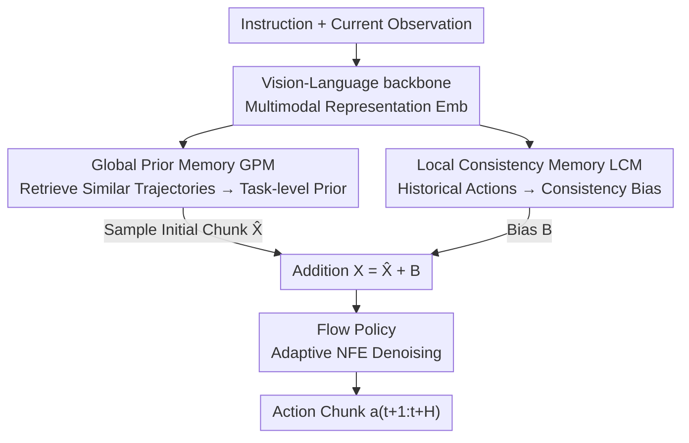

# Global Prior Meets Local Consistency: Dual-Memory Augmented Vision-Language-Action Model for Efficient Robotic Manipulation

**Conference**: CVPR 2026  
**arXiv**: [2602.20200](https://arxiv.org/abs/2602.20200)  
**Code**: https://cybertronagent.github.io/OptimusVLA.github.io/ (Project Page)  
**Area**: Robotics / Embodied AI / VLA  
**Keywords**: Vision-Language-Action Model, Flow Matching, Retrieval-based Prior, Temporal Consistency, Memory Mechanism

## TL;DR
OptimusVLA equips the action generator of a hierarchical VLA with two memory modules: the Global Prior Memory (GPM) replaces the Gaussian noise starting point with retrieved similar trajectories to shorten the flow matching path, and the Local Consistency Memory (LCM) models historical actions with a lightweight structure to inject temporal consistency constraints. This achieves higher success rates (98.6% on LIBERO) while delivering 2.9× inference acceleration on real robots.

## Background & Motivation

**Background**: Hierarchical VLA has become the mainstream paradigm for robotic manipulation—a vision-language backbone handles perception and understanding, while a generative policy (often diffusion or flow matching) handles high-frequency action generation. This division is significantly faster than pure autoregressive token decoding, as seen in models like $\pi_0$, $\pi_{0.5}$, and MemoryVLA.

**Limitations of Prior Work**: The authors argue that the bottleneck has shifted from perception to **action generation**, specifically two issues. First, **slow inference**: Flow matching transports isotropic Gaussian noise $\mathcal{P}_0=\mathcal{N}(0,I)$ to a structured action distribution $\mathcal{P}_1$. The large gap between these distributions requires many denoising steps (NFE, number of function evaluations), and random starting points often fall into kinematically infeasible regions. Second, **poor robustness**: Existing policies mostly follow the Markov assumption, failing to distinguish between visually similar states at different task stages (e.g., "drawer not yet opened" vs. "drawer just closed") and lacking temporal consistency with executed trajectories, leading to control jitter.

**Key Challenge**: Naive remedies have side effects. Using a fixed action-prior as a starting point can collapse the learned mapping into only generating that specific trajectory, losing diversity. Incorporating long historical observations into the input increases latency and memory consumption, while causing a distribution mismatch with single-frame VLA pre-training. The challenge is "shortening the generation path without losing generalization" and "achieving temporal awareness without slowing down control."

**Goal**: Solve both the efficiency and robustness of action generation without altering the VLA pre-training paradigm or introducing heavy re-computation.

**Key Insight**: The authors observe that **similar tasks share similar action distributions** in robotics (e.g., pick_a_cup and pick_a_plate are similar). Thus, a "good starting point" should not be a fixed noise design but a **retrieval problem**. Furthermore, temporal consistency does not require re-running the VLM; lightweight modeling of recent action chunks is sufficient.

**Core Idea**: Attach two memories to the action generator: GPM moves the generation starting point from $\mathcal{N}(0,I)$ to the "neighborhood of similar tasks," and LCM converts historical actions into a consistency bias added to the input. This memory-driven prior initialization and temporal constraint yield fast and stable action generation.

## Method

### Overall Architecture
OptimusVLA integrates GPM and LCM modules in parallel with a standard hierarchical VLA (Vision-Language backbone + flow policy). Given a language instruction $\ell$ and current observation $O_t$ (including proprioception $q_t$ and multi-view images), the VLM backbone first encodes multimodal representations $E_{emb}$. These representations branch out: one part is projected into a retrieval token $z_{re}$ to query the GPM memory bank for a task-level prior distribution $\mathcal{P}_{re}$, sampling an initial action chunk $\hat{\mathbf{X}}_t$; the other part passes the previously executed action chunk $\mathbf{A}_{t-1}$ to the LCM to compute a consistency bias $\mathbf{B}_t$. The sum $\mathbf{X}_t=\hat{\mathbf{X}}_t+\mathbf{B}_t$ forms the input to the flow policy. Finally, the flow policy $p_\theta$ denoises $\mathbf{X}_t$ into a future $H$-step action chunk $a_{t+1:t+H}$ using an **adaptive NFE** $N$. In short: GPM manages "where to start generation," and LCM ensures "generation is consistent with history."

### Key Designs

**1. Global Prior Memory (GPM): Replacing Gaussian Noise with Retrieved Task-level Priors**

This addresses "slow inference and samples falling into infeasible regions." GPM re-formulates prior initialization as a **memory retrieval** problem consisting of three components: (a) **Prior Head**: A lightweight MLP projects $E_{emb}$ into a retrieval token $z_{re}=\mathrm{PriorHead}(E_{emb})$; (b) **Memory Bank**: Stores $M$ pairs of $\{z_m,J_m\}$ (task embeddings and full trajectories), retrieving the $k$ nearest neighbor trajectories $\{J_i,s_i\}$ via cosine similarity. It calculates a normalized global similarity $\bar{s}=\sum_i\alpha_i s_i$ (where $\alpha_i=\mathrm{softmax}(s_i/\tau_s)$) and extracts action chunks $C_i$ via a sliding window to form a task-level Gaussian mixture prior $\mathcal{P}_{re}=\mathcal{N}(\mu,\mathrm{diag}(\mathrm{Var}))$, with $\mu=\sum_i\alpha_i C_i$ and $\mathrm{Var}=\sum_i\alpha_i(C_i-\mu)^{\odot 2}$; (c) **Prior-Aware Sampler**: Uses similarity to adaptively determine noise scale and denoising steps:

$$\lambda=\lambda_{\max}-\tfrac{\bar{s}+1}{2}(\lambda_{\max}-\lambda_{\min}),\quad N=N_{\min}+\big(1-\tfrac{\bar{s}+1}{2}\big)(N_{\max}-N_{\min})$$

The final initialization is $\hat{\mathbf{X}}_t=\mu+\lambda(\epsilon\odot\sqrt{\mathrm{Var}})$. Intuitively, higher similarity ($\bar{s}$) implies higher trust in the prior, injecting less noise $\lambda$ and using fewer steps $N$. This pulls the starting point closer to the target manifold, reducing NFE from $\pi_{0.5}$'s 10.0 to 3.2, while the Gaussian mixture prior maintains diversity.

**2. Local Consistency Memory (LCM): Lightweight Historical Action Modeling for Temporal Constraints**

This addresses visual ambiguity and control jitter. The key is gaining temporal awareness **without re-running the VLM**. LCM is a working memory composed of: a **Consistency Layer** which applies self-attention to the previous action chunk $\mathbf{A}_{t-1}=[\mathbf{a}_{t-H+1},\dots,\mathbf{a}_t]$ to capture intra-chunk dependencies, resulting in an intermediate representation $\hat{\mathbf{B}}_{t-1}$; and a **Dynamic Awareness Module** using a Mamba structure (linear complexity for long-range dependencies) to model **inter-chunk** dynamics, updating $\hat{\mathbf{B}}_{t-1}$ into the next consistency bias $\mathbf{B}_t$. This bias is added to the flow policy input ($\mathbf{X}_t=\hat{\mathbf{X}}_t+\mathbf{B}_t$), effectively turning "temporal consistency" into an additive constraint. Compared to methods that concatenate long observations, LCM only processes action sequences, incurring negligible computational overhead while providing the policy with progress awareness and trajectory smoothness.

### Loss & Training
Training consists of three stages: ① Pre-train a hierarchical VLA based on the $\pi_{0.5}$ architecture and protocol; ② Train the Prior Head using InfoNCE to learn task-discriminative representations $\mathcal{L}_{\mathrm{GPM}}=-\mathbb{E}_q[\log\frac{\exp(\mathrm{sim}(z_{re},z^+)/\tau_c)}{\sum_{j}\exp(\mathrm{sim}(z_{re},z_j)/\tau_c)}]$; ③ Freeze GPM and train LCM to predict the residual between the global prior mean $\mu_t$ and the ground truth action chunk $\mathbf{A}_t^\star$, targeting $\mathbf{B}_t^\star=\mathbf{A}_t^\star-\mu_t$ with MSE loss $\mathcal{L}_{\mathrm{LCM}}=\mathbb{E}[\|\mathbf{B}_t-\mathbf{B}_t^\star\|_2^2]$. The model has 3.6B parameters, trained on 8×A800 with a global batch size of 512 for 30,000 steps at a learning rate of 5e-5.

## Key Experimental Results

### Main Results

LIBERO (Success Rate %, average of 500 rollouts per suite):

| Method | Spatial | Object | Goal | Long | Avg. |
|------|---------|--------|------|------|------|
| OpenVLA-OFT | 97.6 | 98.4 | 97.9 | 94.5 | 97.1 |
| MemoryVLA | 98.4 | 98.4 | 96.4 | 93.4 | 96.7 |
| $\pi_{0.5}$ | 98.8 | 98.2 | 98.0 | 92.4 | 96.9 |
| **OptimusVLA** | **99.6** | **99.8** | **98.4** | **96.4** | **98.6** |

CALVIN (ABC→D, Avg. Len of 5 tasks): OptimusVLA 4.45, $\pi_{0.5}^\dagger$ 4.26, $\pi_0$ 3.92 (a 13.5% improvement over $\pi_0$). RoboTwin 2.0 Hard (Success Rate %): Avg. 38% (rank 1), with Stack Bowls Two reaching 58% (+28% over RDT).

Real Robot (GALAXEA R1 Lite, 14-DoF Dual-arm): Success rate of 85.0% for Generalization and 64.0% for Long-horizon, respectively 42.9% and 52.4% higher than $\pi_0$, with 2.9× inference acceleration. Efficiency: LIBERO inference is 6.5× faster with 3.1× fewer NFE (3.2 for OptimusVLA vs. 10.0 for $\pi_{0.5}$).

### Ablation Study

Individual contributions of GPM/LCM (Table 4, decrease relative to full model in parentheses):

| GPM | LCM | LIBERO-Long | CALVIN (Len) | Real Gen. |
|-----|-----|-------------|--------------|-----------|
| ✓ | ✓ | 96.4 | 4.45 | 85.0 |
| ✗ | ✓ | 93.2 (↓3.3%) | 4.28 (↓3.8%) | 77.0 (↓9.4%) |
| ✓ | ✗ | 94.8 (↓1.7%) | 4.38 (↓1.6%) | 79.5 (↓6.5%) |
| ✗ | ✗ | 92.4 (↓4.1%) | 4.26 (↓4.3%) | 75.0 (↓11.8%) |

Memory bank size ablation (Table 5, LIBERO-Long Success Rate):

| Configuration | Success Rate | Description |
|------|--------|------|
| Num=6500, k=8 | 96.4 | Full setup, Best |
| Num=6500, k=16 | 94.8 | Too many k causes degradation |
| Num=6500, k=1 | 92.6 | Single retrieval, overfits to 1 trajectory |
| Num=1300, k=8 | 95.2 | Smaller bank, still robust |
| Num=130, k=8 | 93.6 | Bank too small, insufficient priors |

### Key Findings
- **GPM is the primary driver for generalization**: Removing GPM leads to a 9.4% drop in real-world Generalization and 3.8% in CALVIN. Without the prior, the model collapses to standard flow matching, hindered by the large prior-target gap. It also stabilizes LIBERO-Long by anchoring generation near the target manifold.
- **LCM manages smoothness and stage awareness**: Removing LCM causes a 1.7% drop in LIBERO-Long, with more significant effects in dual-arm tasks (Long-horizon / RoboTwin) that require coordination constraints.
- **Memory bank needs to be "large enough with sufficient retrieval"**: Storing only one trajectory per task makes the prior too deterministic; $k=8$ provides a Gaussian mixture prior that balances specificity and exploration.
- **Faster Training**: Starting from $\pi_{0.5}$ weights, OptimusVLA reaches 97.6% on LIBERO-Goal in 18,000 steps, whereas $\pi_{0.5}$ requires 26,000 steps, as the prior reduces the difficulty of the noise-to-action transformation.

## Highlights & Insights
- **Re-formulating "noise prior design" as "memory retrieval"**: This acknowledges that "similar tasks have similar actions." Retrieving and mixing trajectories avoids the collapse associated with naive deterministic action-priors while shortening the generation path.
- **Adaptive noise and steps based on similarity**: $\lambda$ and $N$ are linked to similarity $\bar{s}$—more certainty leads to fewer steps, while uncertainty encourages exploration. This elegantly balances efficiency and robustness via a single scalar.
- **Temporal metadata from actions, not VLM**: LCM processes action chunks using self-attention and Mamba, avoiding the throughput bottleneck of re-running the VLM. This "lightweight side-path" approach can be transferred to any frozen-backbone system.
- **LCM learns "residuals from prior mean to ground truth"**: This training design clearly separates goals: GPM provides $\mu_t$, and LCM provides temporal corrections.

## Limitations & Future Work
- **Dependency on memory bank coverage**: GPM's effectiveness relies on the presence of semantically similar tasks in the training set. For entirely novel tasks with no similar action distributions, the retrieved prior might be unhelpful or misleading.
- **Memory scaling costs**: While 6500 trajectories suffice currently, the storage and retrieval overhead as task volume grows (and whether approximate nearest neighbor search is needed) remains undiscussed.
- **High hyperparameter count**: Parameters like $\lambda_{\min/\max}$, $N_{\min/\max}$, temperatures $\tau_s, \tau_c$, and $k$ require tuning.
- **Complex three-stage training**: Pre-training → Prior Head → LCM training is a somewhat cumbersome pipeline for reproduction or transfer to other backbones.

## Related Work & Insights
- **vs $\pi_0$ / $\pi_{0.5}$ (Standard Flow Matching VLA)**: These start from isotropic Gaussian noise with fixed NFE. Ours uses retrieved priors and adaptive NFE on the same architecture, improving both efficiency and generalization.
- **vs MemoryVLA / Working Memory methods**: These methods rely on VLM backbone representations at each step. Ours (LCM) models temporal consistency purely on the action side to maintain high throughput.
- **vs Long-observation concatenation**: Concatenating long sequences increases latency and causes distribution mismatch. Ours sidesteps this by using local memory on the action side.

## Rating
- Novelty: ⭐⭐⭐⭐ The "prior initialization = memory retrieval" reformulation is clever.
- Experimental Thoroughness: ⭐⭐⭐⭐⭐ Comprehensive evaluation across three simulation platforms and real dual-arm robots.
- Writing Quality: ⭐⭐⭐⭐ Clear logic, though minor typos exist.
- Value: ⭐⭐⭐⭐⭐ Achieves accuracy gains and 2.9× acceleration without changing the pre-training paradigm, making it highly practical for real-world deployment.

<!-- RELATED:START -->

## Related Papers

- [\[ICML 2026\] Dual-Stream Diffusion for World-Model Augmented Vision-Language-Action Model](../../ICML2026/robotics/dual-stream_diffusion_for_world-model_augmented_vision-language-action_model.md)
- [\[CVPR 2026\] Boosting Vision-Language-Action Finetuning with Feasible Action Neighborhood Prior](boosting_vision-language-action_finetuning_with_feasible_action_neighborhood_pri.md)
- [\[CVPR 2026\] Mantis: A Versatile Vision-Language-Action Model with Disentangled Visual Foresight](mantis_a_versatile_vision-language-action_model_with_disentangled_visual_foresig.md)
- [\[ICLR 2026\] MemoryVLA: Perceptual-Cognitive Memory in Vision-Language-Action Models for Robotic Manipulation](../../ICLR2026/robotics/memoryvla_perceptual-cognitive_memory_in_vision-language-action_models_for_robot.md)
- [\[CVPR 2026\] GeniNav: Generative Model Driven Image-Goal Navigation via Imagination-Guided Consistency Flow Matching](geninav_generative_model_driven_image-goal_navigation_via_imagination-guided_con.md)

<!-- RELATED:END -->
