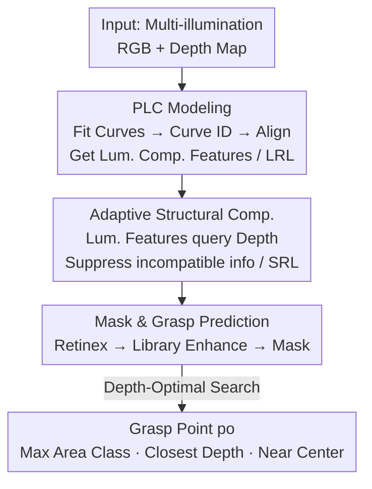

# GraspALL: Adaptive Structural Compensation from Illumination Variation for Robotic Garment Grasping in Any Low-Light Conditions

**Conference**: CVPR 2026  
**Paper**: [CVF Open Access](https://openaccess.thecvf.com/content/CVPR2026/html/Zhong_GraspALL_Adaptive_Structural_Compensation_from_Illumination_Variation_for_Robotic_Garment_CVPR_2026_paper.html)  
**Code**: https://github.com/Zhonghaifeng6/GraspALL (Available)  
**Area**: Robotics / Embodied AI  
**Keywords**: Garment Grasping, Illumination Adaptation, Multimodal Fusion, RGB-D, Service Robots  

## TL;DR
GraspALL encodes continuously varying illumination into a set of learnable "luminance curves," using estimated light levels to **dynamically regulate** the fusion weights of RGB and depth (non-RGB) features. This generates illumination-consistent garment grasping representations under arbitrary low-light conditions, improving the grasp success rate by 32–44% over baselines on a self-constructed multi-illumination garment dataset.

## Background & Motivation

**Background**: Service robots performing household tasks like cleaning or assisting with dressing require accurate garment grasping. Existing methods (based on object/relationship detection or learning strategies) achieve high precision under normal lighting. To handle degraded illumination, a common practice is to introduce non-RGB modalities such as depth maps—because they possess "illumination-invariant" structural characteristics that supplement geometric information when RGB signals decay.

**Limitations of Prior Work**: Illumination in household scenarios is highly dynamic (e.g., assistants for the sick, elderly, or infants often operate in dim or pitch-black environments). Low light severely destroys garment textures, wrinkles, and edge details. However, existing multimodal fusion methods treat non-RGB as a **static supplement**, injecting depth structural features in a fixed manner regardless of how bright or dark the scene is.

**Key Challenge**: The paper makes a critical observation using Canny edge detection (Fig. 2)—for the same garment under different brightness levels, the structural maps extracted from images are **inconsistent** as illumination distorts garment geometry. When RGB features are suppressed in low light, stronger non-RGB structural signals may "drown out" RGB information, causing the model to over-rely on depth cues and ignore subtle but vital RGB luminance signals. This reduces robustness to lighting changes. In short: **the model's dependence on non-RGB structural features should vary with illumination, but prior methods fixed it.**

**Goal**: To enable the model to first perceive the input illumination level and then extract **matching structural compensation** from the non-RGB modality. This is divided into two sub-problems: (1) accurately estimating the input illumination level to provide a quantitative guide for cross-modal fusion; (2) inducing non-RGB features to generate structural compensation adaptive to lighting variations based on that estimate.

**Core Idea**: Use a set of learnable **Parametric Luminance Curves (PLC)** to encode "arbitrary continuous illumination" into searchable quantitative references. These references are then used to **conditionally drive** the depth map to generate structural compensation while suppressing mismatched features based on light compatibility—replacing "non-RGB static supplement" with "illumination-adaptive dynamic compensation."

## Method

### Overall Architecture

GraspALL is a grasp point identification model built on "Luminance-Structure Interaction Compensation," supported by three core components: **Parametric Luminance Curves (PLC)**, **Luminance Response Library (LRL)**, and **Structural Response Library (SRL)**. The pipeline consists of three stages (corresponding to stages A/B/C in Fig. 3):

1. **Luminance Feature Modeling (A)**: PLC fits the input image's luminance pattern to a curve to determine a Curve ID. Using the brightest image as an anchor, luminance features from other lighting conditions are aligned to obtain "Luminance Compensation Features," which are written into the LRL via EMA according to the Curve ID;
2. **Structural Feature Modeling (B)**: The luminance features retrieved from the previous step query the depth map features. Correlation scores are calculated to suppress depth structures incompatible with the current lighting, yielding "Illumination-Adaptive Structural Compensation Features," which are constrained by Canny maps and written into the SRL;
3. **Semantic Mask and Grasp Point Prediction (C)**: Retinex decomposition is applied to the input; LRL and SRL are used to enhance luminance and structural features to decode a semantic mask. A "Depth-Optimal Search" strategy is then used on the dominant garment category to select stable grasp points.

### Key Designs

**1. Parametric Luminance Curves (PLC): Quantizing "Arbitrary Illumination" into Learnable References**

To address accurate illumination estimation, PLC replaces traditional non-learnable histogram methods with learnable parameters to represent representative luminance patterns. A curve library $C=\{C_1,\dots,C_N\}$ ($N=12$) is defined, where each curve $C_n$ is parameterized by $R=256$ discrete sampling points with learnable parameters $P_n=\{P_{n,1},\dots,P_{n,R}\}$. Given images $\{I_1,\dots,I_N\}$, the brightest $I_{max}$ is selected as the anchor. For other images, representative luminance values $H_R$ are calculated via histogram binning, and the curve with the most matching points is identified as the Curve ID:

$$ID_n = \arg\min \||H_i - C(P_{n,i})\||,\quad i\in R,\ n\in N.$$

Using $I_{max}$ as a luminance anchor, luminance features of other images $I_n$ are aligned via a shared encoder-decoder: $I_n^{max}=D(E(I_n))$, supervised by a spectral consistency loss $L_{sc}$ on the L1 distance between $I_{max}$ and $I_n^{max}$. The resulting encoded features $F_{en}^n=E(I_n)$ serve as "Luminance Compensation Features"—reflecting structural defects caused by lighting. These are written into the **Luminance Response Library (LRL)** $M_L$ using EMA (momentum $\alpha=0.05$): $M_L=(1-\alpha)M_L^n+\alpha\cdot F_{en}^n$.

**2. Illumination-Adaptive Structural Compensation: Using Luminance to "Select" Depth Features**

Depth maps are structurally stable but lack discriminative appearance under extreme darkness—deformable garments produce similar geometries, leading to category confusion. This design query-extracts depth features **conditionally**. For image $I_n$, the Curve ID is matched to retrieve $M_L^n$. The depth map is encoded as $F_{en}^{de}=E(I_{dep})$. Linear layers transform $M_L^n$ into query $Q_{lu}$ and $F_{en}^{de}$ into $K_{de},V_{de}$, using luminance to query structural information:

$$Score=\mathrm{Softmax}(Q_{lu}\cdot K_{de}),\quad F_{en}^s=\mathrm{Reshape}(Score\times V_{de}).$$

This score captures the relevance of depth information under current lighting—suppressing incompatible structural signals. To ensure geometric accuracy, a Canny consistency constraint is applied: $F_{en}^s$ is decoded into a structural map $S_{can}^{dep}=D(F_{en}^s)$ and supervised against the brightest image's Canny map $S_{can}$ using binary cross-entropy $L_{bce}$. These features are written into the **Structural Response Library (SRL)** $M_S$.

**3. Semantic Masking + Depth-Optimal Search: Categorical Awareness and Stable Grasping**

Existing methods often ignore semantic categories. GraspALL first performs Retinex decomposition $I_L,I_S=N_{Retinex}(I_n)$, encoding luminance $F_L$ and structure $F_S$. These query $M_L$ and $M_S$ respectively to obtain enhanced features $F_L^{en},F_S^{en}$, which are decoded into a semantic mask $M_m$.

For the grasp point (Fig. 4), the **maximum area** category $\Omega_{c^*}=\arg\max_{c\in C}|\Omega_c|$ is selected first. Within this region, the $k$ pixels $p_1,\dots,p_k=\mathrm{Depth_{top}}(\Omega_{c^*})$ with the smallest depth (closest to the camera) are identified as accessible surface points (wrinkles/protrusions). Finally, the optimal grasp point $p_o$ is selected from these candidates as the one closest to the geometric center of the minimum bounding box: $p_o=\arg\min_{p\in p_k}\||p-p_{center}\||_2$.

### Loss & Training
The objective function includes three signals: spectral consistency loss $L_{sc}$ for PLC indexing, binary cross-entropy $L_{bce}$ for structural supervision from RGB-D fusion, and cross-entropy $L_{ce}$ for semantic mask generation. Response libraries are updated via EMA ($\alpha=0.05$). Training was conducted on an NVIDIA 4090.

## Key Experimental Results

The **MIGG (Multi-Illumination Garment Grasping)** dataset was created using NVIDIA Isaac Sim, featuring two household scenes, eight garment assets, and physically controlled lighting. It contains 15,384 sets (13,008 for training / 2,376 for testing). Metrics include mIoU for masks and mGSR (Mean Grasp Success Rate).

### Main Results: mGSR (Performance Gap Widens in Lower Light)

| Illumination Range | BiFCNet | SAM-M | ReKep | DarkSeg | GraspALL | Gain vs. 2nd |
|---------|---------|-------|-------|---------|----------|---------|
| 80–120 (Medium) | 61.6% | 59.2% | 63.4% | 78.3% | **93.3%** | +32% |
| 40–80 | 52.4% | 51.6% | 52.4% | 63.3% | **88.3%** | +36% |
| 0–40 (Extreme Low) | 39.9% | 43.3% | 42.4% | 53.3% | **84.2%** | +44% |

GraspALL's mIoU remains highly stable across light levels (e.g., 84.8% at high vs. 82.8% at extreme low), with **fluctuations under 2%**, whereas MRFS drops by ~12%.

### Ablation Study (Lum: 0–40)

| Configuration | mIoU | mGSR | Description |
|------|------|------|------|
| Model-1 w/o PLC | 65.4% | 50.0% | Sharpest drop—no explicit light estimation/guidance |
| Model-2 w/o LRL | 71.3% | 72.5% | Impaired luminance-structure complementarity |
| Model-3 w/o SRL | 68.5% | 57.5% | Reduced structural discriminability |
| Model-4 w/o $L_{sc}$ | 64.9% | 50.2% | Lack of constraint for PLC indexing consistency |
| Model-6 Full | **82.6%** | **88.3%** | All components integrated |

### Key Findings
- **PLC is the Foundation**: Removing PLC (Model-1) caused mGSR to plummet from 88.3% to 50.0%, proving that interpretable lighting estimation is the prerequisite for adaptive fusion.
- **Darkness Resilience**: Gains relative to the second-best increase as light decreases (+32% to +44%), highlighting that adaptive compensation effectively targets the weaknesses of prior static methods.
- **Efficient and Lightweight**: By using response libraries as decouplers, GraspALL achieves higher mIoU with higher FPS and fewer parameters than baselines.
- **Generalization**: Grad-CAM reveals that PLC maintains stable attention across light levels; and real-world robot tests (Realman + RGB-D) confirmed high success rates (12/15 in extreme low light).

## Highlights & Insights
- **Illumination as a Searchable Index**: PLC quantifies continuous light into discrete searchable references. This "Library + Response" design provides explicit fusion guidance while decoupling heavy cross-modal computation.
- **Diagnosis-Oriented Design**: The authors prove that structural maps are inconsistent under varying lights using Canny observations (Fig. 2) before designing the dynamic compensation—solidifying the motivation.
- **Pragmatic Grasping**: The depth-optimal search addresses the "non-graspable geometric center" issue for deformable garments by identifying stable wrinkle points near the center.

## Limitations & Future Work
- **Simulation Reliance**: MIGG is primarily synthetic. Although real-world tests were conducted, they involved a smaller scale (1,013 images). 
- **Complex Lighting**: PLC currently models a dominant light factor. Complex effects like multiple sources or specific material reflections are reserved for future work.
- **Sensor Dependency**: The method relies heavily on depth maps; performance may degrade if depth data is noisy or unavailable.

## Related Work & Insights
- **vs. MRFS/AMDA**: These methods treat depth as a static supplement; GraspALL uses PLC to achieve significantly higher stability (fluctuation <2% vs. ~12% drop).
- **vs. DarkSeg/SAM-M**: Even large-scale models or specialized low-light segments struggle without explicit illumination-adaptive modeling, which is the core contribution of this work.

## Rating
- Novelty: ⭐⭐⭐⭐⭐ First to systematically analyze the impact of light on garments and treat it as a learnable dynamic index.
- Experimental Thoroughness: ⭐⭐⭐⭐ Extensive benchmarks and real-world validation; minor deduction for simulation dominance.
- Writing Quality: ⭐⭐⭐⭐ Clear motivation and solid formulation.
- Value: ⭐⭐⭐⭐ Directly addresses a key hurdle for 24/7 home service robots.

<!-- RELATED:START -->

## Related Papers

- [\[CVPR 2026\] Obstruction Reasoning for Robotic Grasping](obstruction_reasoning_for_robotic_grasping.md)
- [\[CVPR 2026\] Structural Action Transformer for 3D Dexterous Manipulation](structural_action_transformer_for_3d_dexterous_manipulation.md)
- [\[ICML 2026\] Neural Low-Discrepancy Sequences](../../ICML2026/robotics/neural_low-discrepancy_sequences.md)
- [\[CVPR 2026\] GraspLDP: Towards Generalizable Grasping Policy via Latent Diffusion](graspldp_towards_generalizable_grasping_policy_via_latent_diffusion.md)
- [\[CVPR 2026\] GraspGen-X: Cross-Embodiment 6-DOF Diffusion-based Grasping](graspgen-x_cross-embodiment_6-dof_diffusion-based_grasping.md)

<!-- RELATED:END -->
