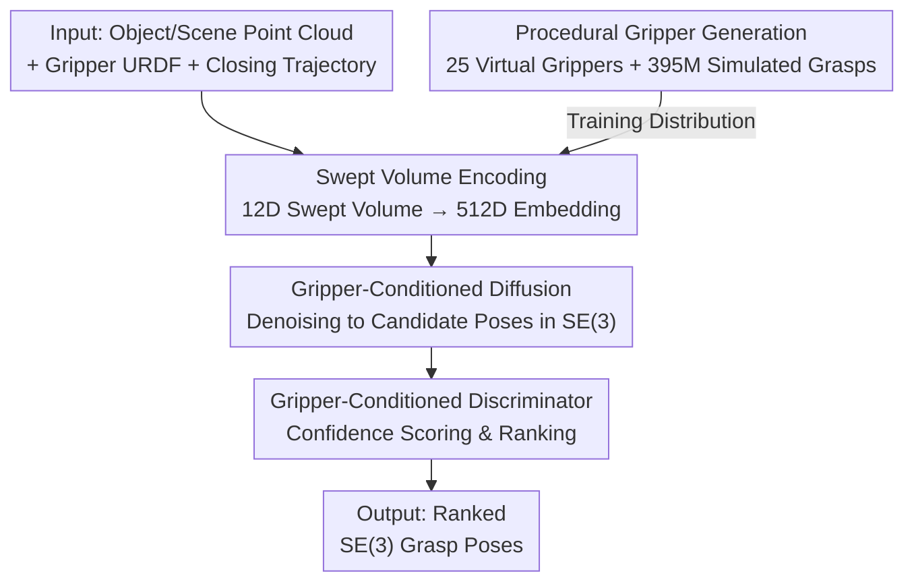

# GraspGen-X: Cross-Embodiment 6-DOF Diffusion-based Grasping

**Conference**: CVPR 2026  
**Paper**: [CVF Open Access](https://openaccess.thecvf.com/content/CVPR2026/html/Han_GraspGen-X_Cross-Embodiment_6-DOF_Diffusion-based_Grasping_CVPR_2026_paper.html)  
**Code**: https://graspgenx.github.io (Project page, announcing open-source models/code/395 million grasp dataset)  
**Area**: Robotic Grasping / Embodied AI  
**Keywords**: 6-DOF Grasping, Cross-embodiment, Diffusion Models, Gripper Representation (Swept Volume), Procedural Generation  

## TL;DR
GraspGen-X conditions a diffusion-based 6-DOF grasp model on "gripper representation"—a 12-dimensional Swept Volume heuristic describing the space the fingers sweep through during closing. By training on 25 procedurally generated grippers and 395 million simulated grasps, it achieves zero-shot 6-DOF grasping for **unseen real grippers + unseen objects** for the first time, with a real-robot success rate of 79%, significantly outperforming baselines such as grasp pose retargeting.

## Background & Motivation
**Background**: 6-DOF grasping (predicting stable $SE(3)$ gripper poses given an object point cloud) is a core module of robotic pick-and-place systems. Recently, generative models have evolved "grasp samplers" from heuristics (antipodal sampling, pixel-level prediction) to VAEs, flow-matching, and diffusion models, paired with a discriminator for ranking candidates. GraspGen is the current SOTA: a diffusion generator + discriminator that balances accuracy and coverage effectively.

**Limitations of Prior Work**: In a "universal pick-and-place system," modules like 3D perception, instance segmentation (SAM2), and motion planning are largely zero-shot transferable across robots—except for grasp generation. All existing 6-DOF grasp models are **trained for only one gripper**, requiring retraining whenever the gripper changes. For example, training a single-embodiment GraspGen model requires eight GPUs for a week for data generation and training. Consequently, grasp generation has remained the "least transferable" link in cross-embodiment deployment.

**Key Challenge**: The common compromise in the industry is **grasp pose retargeting**—applying a pose predicted for a Franka gripper to a new gripper by shifting it along the approach direction. However, this only compensates for the tip distance along the z-axis, completely ignoring differences in finger geometry, closing kinematics, and contact dynamics, resulting in a low performance ceiling.

**Goal**: To train a diffusion grasp model **explicitly conditioned on the gripper**, enabling zero-shot generalization to new grippers and new objects, while also serving as a robust starting point for fine-tuning.

**Key Insight**: The authors hypothesize that for a model to recognize an unseen gripper zero-shot, it must be provided with an **explicit, compact gripper parametrization** that captures the closing process, rather than implicit encoding or mere type labels. Furthermore, since real grippers are scarce and biased, the training distribution must be filled via **procedural generation**.

**Core Idea**: Represent the gripper using a 12-dimensional heuristic called "Swept Volume" (the volume swept by fingers during closing) and inject it into the diffusion generator and discriminator. Procedurally generate large-scale virtual grippers using Infinigen-Sim to cover the test distribution.

## Method

### Overall Architecture
GraspGen-X is built upon GraspGen: the input consists of the object/scene point cloud, the gripper's URDF, and the closing joint trajectory (from fully open to fully closed), and the output is a set of ranked $SE(3)$ grasp poses. GraspGen originally consisted of two parts—a generator diffusing in $SE(3)$ space conditioned on **object embeddings**, and a discriminator trained on on-generator positive/negative samples to rank candidates. The key modification in GraspGen-X is: **injecting a gripper embedding into both the generator and discriminator**, derived from the Swept Volume heuristic.

The pipeline comprises two branches: the **Inference Pipeline** (point cloud + gripper representation → generator diffuses candidates → discriminator ranks → output) and the **Data Pipeline** (procedurally generate grippers → ACRONYM/Isaac-Sim simulation labeling → 395M grasp training set). Three core contributions—Swept Volume encoding, gripper-conditioned diffusion generation/discrimination, and procedural grippers—address "how to represent the gripper," "how to utilize the gripper," and "what grippers to train on," respectively.

### Key Designs

**1. Swept Volume Encoding: Compact Characterization of Gripper Morphology and Closing Motion**

This is the core of the paper, targeting the "fail-on-change" bottleneck of grippers. Instead of encoding the full mesh or point cloud, the authors use an **axis-aligned bounding box (AABB)** to approximate the space swept by fingers during closing. Each Swept Volume consists of the 3D dimensions $(x, y, z)$ and the 3D translation $t$ of the cube relative to the gripper base, totaling 6 dimensions. Crucially, the authors take **two timestamps**—when the gripper is fully open and half-closed—to calculate two 6D Swept Volumes, concatenated into a $12$-dimensional vector and mapped to a $512$-dimensional embedding via a 3-layer MLP:

$$\mathbf{e}_{\text{gripper}} = \mathrm{MLP}\big(\,[\,\text{SV}_{\text{open}}\,;\,\text{SV}_{\text{half}}\,]\,\big),\quad [\text{SV}_{\text{open}};\text{SV}_{\text{half}}]\in\mathbb{R}^{12},\ \mathbf{e}_{\text{gripper}}\in\mathbb{R}^{512}$$

Why it works: ① It **aligns directly with the grasping problem**—success depends on where fingers sweep and pinch. The Swept Volume explicitly marks this "interaction zone," offering higher information density than fine geometric details like screws or linkages. ② Using both fully open and half-closed states is intentional: for **revolute 2-finger grippers** (e.g., Robotiq-2F140, XArm Hand), fingers move forward along the z-axis as they close. Considering only the open state would lose this closing dynamic information. For parallel grippers (Franka, Robotiq-2F85), it covers the cube between fingers; for rotating ones (Robotiq-3F), it approximates the volume swept.

**2. Gripper-Conditioned Diffusion Generator + Discriminator: End-to-End Cross-Embodiment Model**

This addresses the "low ceiling of retargeting" issue. GraspGen-X does not patch a single-embodiment model; instead, it uses the gripper embedding $\mathbf{e}_{\text{gripper}}$ and object embedding $\mathbf{e}_{\text{object}}$ (encoded from point clouds via PointTransformer/PointNet++) **jointly as conditions**. Both components use these: the diffusion generator denoises $SE(3)$ space to generate candidates, and the discriminator, trained on on-generator samples, scores them. When a new gripper is introduced, the model only needs its Swept Volume embedding to generate poses adapted to its specific geometry and motion. Zero-shot experiments prove this end-to-end approach is superior to "single-embodiment model + pose correction," showing a ~40% relative improvement on high-DoF 3-finger grippers.

**3. Procedural Gripper Generation: Covering the Test Distribution with Infinigen-Sim**

This addresses the "scarcity of real grippers." The authors collected 20 real grippers, split 10/10 for training/testing, but found that training on only 10 real grippers performed poorly due to the sparse, non-overlapping gripper space. Thus, they turned to procedural generation: using Infinigen-Sim (mathematical rules using Blender geometry nodes), they designed generators for three classes: parallel, revolute 2-finger, and high-DoF 3-finger grippers. It ignores fine details and focuses on the diversity of global scale/morphology and finger geometry, outputting training metadata like Swept Volume. A key step is **aligning the randomization range with real train/test grippers**. Distribution overlap between 50 procedural grippers (Proc-Train50) and the real test set (Real-Test10) was significantly higher than with the 10 real training grippers, explaining the improved generalization.

### Loss & Training
The pipeline follows the antipodal sampling and simulation labeling process of GraspGen + ACRONYM. The generator was trained on 175M grasps (approx. 8.7K GPU hours for data generation) using 8×A100 for 780K steps, with a learning rate of 1e-5 (approx. 80 hours). The discriminator used 50% positive / 50% negative on-generator samples, trained on 8×A100 for 300K steps (approx. 76 hours). Final training used 25 procedural grippers (10 parallel, 10 revolute, 5 3-finger) totaling 350-395 million samples—the largest multi-embodiment 6-DOF grasp dataset to date. A learning rate of 1e-6 was found most effective for fine-tuning.

## Key Experimental Results

### Main Results: Zero-Shot Generalization to New Grippers + New Objects (Simulation)
Measured by mAUC (mean Area Under Curve of the PR curve) across 10 unseen test grippers and unseen objects. GraspGen-DTR is direct transfer (Franka model), and RTG is grasp pose retargeting.

| Gripper Category | GraspGen-DTR | GraspGen-RTG | GraspGen-X (Ours) |
|------------------|--------------|--------------|-------------------|
| Parallel 2-finger| 0.215 | 0.365 | **0.502** |
| Revolute 2-finger| 0.033 | 0.379 | **0.413** |
| High-DoF 3-finger| 0.136 | 0.503 | **0.699** |
| Total (all 10)   | 0.126 | 0.398 | **0.506** |

DTR fails significantly on different categories (e.g., revolute). RTG improves over DTR by 200%+, proving retargeting is an effective heuristic, but limited by ignoring finger geometry. GraspGen-X is SOTA across all categories, improving 25% over RTG and nearly 40% on 3-finger grippers. The model even generalizes to a 5-finger Surge Hand (0.404) and Inspire Hand (0.363), which were not seen during training.

### Ablation Study 1: Comparison of Gripper Encodings (453 Objects × 10 Test Grippers, mAUC)

| Encoding Method | mAUC | Description |
|-----------------|------|-------------|
| PointNet++ | 0.349 | Gripper mesh point cloud encoding |
| UniGrasp (cVAE) | 0.418 | PointNet-VAE latent encoding |
| AdaGrasp (TSDF) | 0.432 | Voxel TSDF + 3D/2D CNN |
| **GraspGen-X (Swept Volume)** | **0.528** | 25% higher than the next best (TSDF) |

Swept Volume, despite being a 12D vector, outperformed heavier representations like TSDF and PointNet++, validating that compact heuristics "aligned with the grasping problem" are more efficient.

### Ablation Study 2: Decomposition of Swept Volume Parametrization
- **GripperTypeOnly / RetargetOffsetOnly**: Providing only a 3D one-hot type or z-axis offset is too simple to learn a comparable model.
- **FullyOpenOnly (6D)** performed worse than "Open + Half (12D)," primarily because revolute grippers shift forward during closing, which requires the half-closed state for encoding.
- **w/GripperType (adding one-hot type)** actually decreased performance: authors speculate that cross-embodiment training requires shared information; discrete labels may fragment the parameter space.

### Key Findings
- **Procedural > Real Training**: This held true across all encodings (Swept Volume, TSDF, PointNet++), due to better coverage of the test distribution; more procedural grippers (up to the 25 used) yielded better results.
- **Better Fine-tuning Starting Point**: Fine-tuning from GraspGen-X (GraspGen-X-SFT) converged faster than tuning from a single-embodiment Franka model or training from scratch across all metrics.
- **Real-Robot Zero-Shot** (Industrial UR10 + Robotiq-2F140, zero training on this setup):

| Method | Isolated Objects | Cluttered Scenes | Overall Success |
|--------|------------------|------------------|-----------------|
| **GraspGen-X (Ours)** | **85.7%** | **71.4%** | **79.0%** |
| GraspGen-RTG | 73.3% | 57.1% | 65.2% |
| AnyGrasp | 80.0% | 42.9% | 61.4% |

Trained only on simulation data, it generalized to a real-world new gripper. Success reached 100% for some YCB objects on a low-cost AgileX gripper. In cluttered scenes, performance drops due to motion planning failures/collisions, but GraspGen-X remains superior to AnyGrasp.

## Highlights & Insights
- **The "Swept Volume" representation is the "Aha!" moment**: Since grasp success depends on the volume swept/pinched by fingers, representing it with an AABB is highly effective. A 12D vector beating TSDF/cVAE shows that "the right inductive bias" outweighs "larger networks."
- **Dual-state (Open + Half) encoding is clever**: It injects "closing kinematics" into a static vector at minimal cost, solving the z-axis shift issue of revolute grippers.
- **Procedural generation fills the gap**: Rather than high-fidelity real grippers, it is better to use procedural synthesis aligned with real distributions to "cover the test set."
- **One-hot labels can hurt**: A counter-intuitive but insightful finding—cross-embodiment learning thrives on shared information; discrete labels can partition the parameter space unnecessarily.

## Limitations & Future Work
- Authors acknowledge scaling potential: increasing the 3.5K objects and 25 procedural grippers further.
- Currently covers parallel, revolute 2-finger, and 3-finger grippers; **5-finger anthropomorphic hands** have not been explicitly trained (though some zero-shot capability exists, scores are lower, ~0.36-0.40).
- ⚠️ Minor discrepancy in data scale mentioned in the text (abstract says 395M, conclusion says 350M); users should refer to the open-source dataset release.
- Subjective observation: AABB approximations might be too coarse for grippers with complex non-linear finger paths or interlocking fingers. Success in clutter (71.4%) still lags behind isolated cases, partly limited by motion planning.

## Related Work & Insights
- **vs GraspGen**: This is a cross-embodiment extension. GraspGen-X uses the same diffusion/discriminator architecture but adds gripper conditioning to both.
- **vs Retargeting (RTG)**: RTG only compensates for z-axis offsets. This work proves end-to-end cross-embodiment learning has a higher ceiling (relative +25%).
- **vs UniGrasp / AdaGrasp / Contact-based methods**: Prior works often used fewer real grippers or heavy mesh encodings. GraspGen-X generalizes to unseen real grippers using procedural synthesis and Swept Volume under partial point clouds.
- **vs VLA / RT-X**: While VLAs use readout tokens for action spaces, zero-shot hardware transfer is still weak. This paper argues that **explicit embodied parametrization** (Swept Volume) is key for zero-shot grasping.

## Rating
- Novelty: ⭐⭐⭐⭐⭐ First diffusion-based 6-DOF model to achieve true cross-gripper zero-shot utility; Swept Volume is a powerful, simple representation.
- Experimental Thoroughness: ⭐⭐⭐⭐⭐ Simulation zero-shot + fine-tuning + encoding ablations + distribution ablations + dual real-robot platforms.
- Writing Quality: ⭐⭐⭐⭐ Clear reasoning and analysis; slight discrepancies in data scale reporting.
- Value: ⭐⭐⭐⭐⭐ Transforms grasp generation from the "least transferable" part of the stack into a zero-shot module; the 395M dataset is a major community contribution.

<!-- RELATED:START -->

## Related Papers

- [\[CVPR 2026\] A Cross-view Fusion Framework for Robust 6-DoF Grasp Pose Estimation](a_cross-view_fusion_framework_for_robust_6-dof_grasp_pose_estimation.md)
- [\[CVPR 2026\] GraspLDP: Towards Generalizable Grasping Policy via Latent Diffusion](graspldp_towards_generalizable_grasping_policy_via_latent_diffusion.md)
- [\[ECCV 2024\] Learning Cross-Hand Policies of High-DOF Reaching and Grasping](../../ECCV2024/robotics/learning_cross-hand_policies_of_high-dof_reaching_and_grasping.md)
- [\[CVPR 2026\] RoboWheel: A Data Engine from Real-World Human Demonstrations for Cross-Embodiment Robotic Learning](robowheel_a_data_engine_from_real-world_human_demonstrations_for_cross-embodimen.md)
- [\[CVPR 2026\] TraceGen: World Modeling in 3D Trace Space Enables Learning from Cross-Embodiment Videos](tracegen_world_modeling_in_3d_trace_space_enables_learning_from_cross-embodiment.md)

<!-- RELATED:END -->
