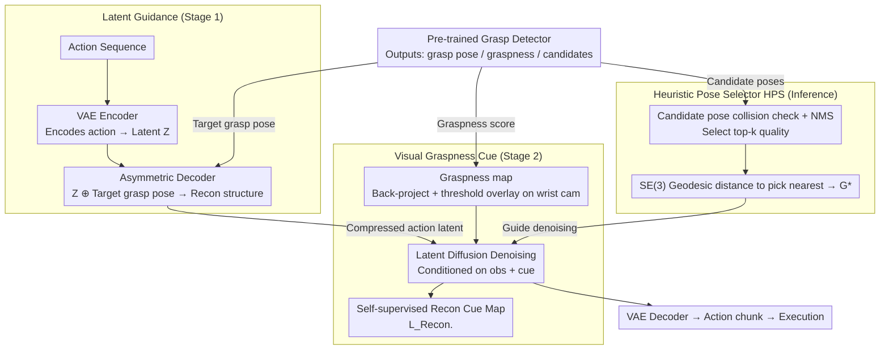

# GraspLDP: Towards Generalizable Grasping Policy via Latent Diffusion

**Conference**: CVPR 2026  
**arXiv**: [2602.22862](https://arxiv.org/abs/2602.22862)  
**Code**: Available (Project Page)  
**Area**: Robotics  
**Keywords**: Robotic Grasping, Latent Diffusion Policy, Grasp Prior, Imitation Learning, Generalization

## TL;DR
GraspLDP is proposed to inject grasp pose priors and graspness map visual cues from a pre-trained grasp detector into a latent diffusion policy framework. Through guidance in an action latent space encoded by a VAE and a self-supervised reconstruction objective, it significantly improves grasping precision and generalization.

## Background & Motivation
In robotic manipulation pipelines, grasping is a critical initial step for physical interaction. While imitation learning-based visuomotor policies (e.g., Diffusion Policy, ACT) show potential in general manipulation, they often underperform specialized grasping detection methods on grasping sub-tasks because modeling the entire sequence of grasping actions is inherently more complex.

Existing methods that integrate grasp priors into imitation learning (e.g., Robograsp, GPA-RAM) suffer from two issues: (1) merely concatenating the grasp pose as a conditional input to the policy model leads to a weak association between the grasp pose and the output action sequence, failing to provide effective guidance; (2) a modality mismatch exists between low-semantic grasp poses and high-dimensional visual inputs, making it difficult for the policy model to fully extract spatial distribution information of the grasp. On the other hand, data-driven methods like GraspVLA, while high-performing, require 160 RTX 4090 GPUs for 10 days to generate 1B frames of simulation data, which is prohibitively expensive.

Core Idea: Drawing inspiration from the success of Latent Diffusion Models in image generation, this work injects precise target grasp poses into the action latent space to guide action generation. Simultaneously, it uses graspness maps as visual cues to guide the diffusion process, bridging static target grasp poses and dynamic action sequences within a shared latent space.

## Method

### Overall Architecture
GraspLDP aims to address the performance gap where imitation learning policies are often inferior to specialized grasp detectors in the grasping stage. The limitation arises because these policies treat the entire grasp action sequence as a high-dimensional regression problem without effectively utilizing existing grasp priors. The proposed approach splits grasp priors into two streams: a precise target grasp pose injected into the **action latent space** to directly constrain action generation, and geometric visual cues like graspness maps injected into the **diffusion denoising process** to guide the end-effector toward graspable regions.

The training is divided into two stages. In the first stage (Action Latent Learning), a VAE is used to compress the action sequence into compact latent features, and the target grasp pose is concatenated at the decoder side to reconstruct the action, forcing the latent space to learn how actions are constrained by the pose. In the second stage (Diffusion on Latent Action Space), a diffusion policy is trained to denoise in this latent space, using the graspness map overlaid on wrist camera images as a visual condition, further adding a self-supervised reconstruction objective for this cue to ensure the model does not ignore it. During inference, a heuristic selector chooses the most suitable candidate pose from the detector's output to guide the process. Three key designs—Latent Guidance, Visual Graspness Cue, and Heuristic Pose Selector—correspond to these two stages and inference selection, with the pre-trained grasp detector providing grasp poses, graspness maps, and candidate poses.

### Key Designs

**1. Grasp Guidance in Latent Space: Strongly constraining actions via grasp pose at the decoder side**

Existing methods (Robograsp, GPA-RAM) feed the grasp pose as a condition into the policy. The distance between the pose and the output action across the network is large, resulting in weak association and diluted guidance. GraspLDP operates within the action latent space: the VAE encoder only observes actions $\mathbf{Z} = \mathcal{E}(A)$ to compress them into low-dimensional latent features; the decoder سپس concatenates the target pose to reconstruct $\hat{A} = \mathcal{D}(\mathbf{Z} \oplus \mathcal{G})$, with the training loss defined as $\mathcal{L}_{VAE} = \text{MSE}(A, \hat{A}) + \lambda \mathcal{L}_{KL}$. This asymmetric design is crucial—the encoder does not receive the pose, ensuring the latent variable purely encodes the action, while the pose modulates the reconstruction directly. The diffusion policy then denoises in this compact latent space rather than the high-dimensional original space, leading to more focused guidance and faster inference. Removing this Latent Guidance (w/o Latent Guidance) causes Object/Visual generalization success rates to drop from ~58/65 to ~21/19.

**2. Visual Graspness Cue: Utilizing geometric graspness as an illumination-invariant visual prompt**

Grasp poses are low-semantic geometric quantities, while RGB inputs are high-dimensional, creating a modality gap where it is difficult for a policy to "see" graspable areas from images alone. GraspLDP leverages a pre-trained graspness network to obtain scores for points in a point cloud, back-projects these to pixels to form a graspness map, and overlays it on the wrist camera image. Pixels with scores $M(j,k) > \tau$ are colored with a mask $O_{cue}(j,k)$. To prevent the model from ignoring this cue, a self-supervised objective $\mathcal{L}_{Recon.} = \text{MSE}(O_{cue}, \hat{O}_{cue})$ is added to reconstruct this map at each reverse diffusion step. The total loss is $\mathcal{L}_{LDP} = \mathcal{L}_{Diff.} + \lambda_{Recon.} \mathcal{L}_{Recon.}$. Since graspness is geometry-driven and robust to illumination, this provides the greatest gain in Visual Generalization (different lighting/appearance).

**3. Heuristic Pose Selector (HPS): Balancing grasp quality and kinematic proximity**

During inference, the detector outputs multiple candidate grasp poses. Selecting the highest-quality candidate might result in a pose too far from the current hand position, causing awkward trajectories, while selecting the nearest might result in an unstable grasp. HPS first applies collision detection and NMS to filter top-k quality candidates, then calculates the SE(3) geodesic distance $d_{\mathcal{G}_j, W} = \sqrt{\xi^\top W \xi}$ (where $\xi$ is the Lie algebra difference and $W$ is a weighting matrix) from the current end-effector pose $P$ to each candidate $\mathcal{G}_j$. The candidate with the minimum distance $\mathcal{G}^* = \arg\min_j d(\mathcal{G}_j)$ is chosen. This simultaneously considers grasp feasibility and trajectory smoothness.

### Loss & Training
The training is performed in two separate stages: Stage 1 trains the VAE with $\text{MSE}$ reconstruction and KL regularization losses; Stage 2 trains the latent diffusion policy with the diffusion loss and the self-supervised graspness cue reconstruction loss $\mathcal{L}_{Recon.}$. The training data consists of approximately 12K high-quality grasp demonstrations, which is orders of magnitude less than the 1B frames used by GraspVLA.

## Key Experimental Results

### Main Results

| Method | In Domain | Spatial Gen. | Object Gen. | Visual Gen. | Average |
|------|-----------|-------------|-------------|-------------|------|
| Diffusion Policy | 62.8 | 48.9 | 11.4 | 16.3 | 34.9 |
| GraspVLA | 50.8 | 49.5 | 46.8 | 51.7 | 49.7 |
| Ours Baseline (CG) | 72.3 | 59.1 | 48.3 | 47.7 | 56.9 |
| **GraspLDP** | **80.3** | **71.1** | **58.2** | **64.6** | **68.6** |

### Ablation Study

| Configuration | ID SR | SG SR | OG SR | VG SR |
|------|-------|-------|-------|-------|
| GraspLDP (full) | 80.3 | 71.1 | 58.2 | 64.6 |
| w/o Graspness Cue | 77.4 (-2.9) | 67.3 (-3.8) | 54.2 (-4.0) | 57.5 (-7.1) |
| w/o Latent Guidance w/ CG | 73.5 (-6.8) | 62.2 (-8.9) | 52.3 (-5.9) | 54.5 (-10.1) |
| w/o Latent Guidance | 60.6 (-19.7) | 49.8 (-21.3) | 21.2 (-37.0) | 19.4 (-45.2) |
| w/o GC & LG | 55.1 (-25.2) | 46.2 (-24.9) | 16.0 (-42.2) | 15.7 (-48.9) |

### Key Findings
- GraspLDP improves in-domain success rate by 17.5% over Diffusion Policy, with improvements of 22.2%, 46.8%, and 48.3% in Spatial, Object, and Visual generalization, respectively.
- Latent Guidance is the most critical component; its removal causes OG/VG to plummet to ~20%, indicating that grasp pose guidance in the latent space is essential for generalization.
- Graspness Cue provides the largest boost in Visual Generalization (-7.1%), as geometric graspness signals are robust to illumination changes.
- HPS outperforms random/highest/nearest selection strategies, highlighting the need to jointly consider quality and kinematic proximity.
- Inference latency is only ~15% higher than Diffusion Policy, making it much faster than GraspVLA.

## Highlights & Insights
- Migrating the concept of latent diffusion from image generation to robotic action generation proves that injecting priors into the latent space is more effective than conditional concatenation.
- The design of graspness maps as visual prompts is simple yet effective, and self-supervised reconstruction ensures information utilization.
- In real-world experiments, GraspLDP achieved a Scene Completion Rate (SCR) of 96.2% in cluttered scenes, approaching the 92.3% achieved by the open-loop method AnyGrasp.

## Limitations & Future Work
- Dependence on pre-trained grasp detection networks (e.g., AnyGrasp); if the detector fails on new objects, the pose prior degrades.
- Currently focuses only on the grasping sub-task and has not been extended to complete long-horizon manipulation sequences.
- VAE training and diffusion training are decoupled into two stages; end-to-end joint training might be more optimal.

## Related Work & Insights
- Diffusion Policy established the paradigm for using diffusion models for action generation; GraspLDP extends this to the latent space with task priors.
- GraspVLA follows a data-driven route (1B frames), while GraspLDP follows a prior-injection route, achieving higher efficiency with significantly less data.
- The concept of latent space guidance can be generalized to other manipulation tasks requiring prior knowledge, such as assembly or tool use.
- PPI used discrete key poses to guide continuous action generation; GraspLDP achieves finer guidance within the latent space.
- The graspness concept from GSNet is repurposed as a visual prompt, demonstrating the synergy between grasp detection and policy learning.

## Supplementary Details
- Real-world cluttered scene grasping: GraspLDP achieved an SCR of 96.2% and an average SR of 80% across 4 scenes.
- Inference timing: Graspness calculation takes 36ms, latent decoding takes less than 1ms, and total latency is approximately 100ms.
- The VAE uses an asymmetric decoder; the encoder does not accept grasp poses, whereas the decoder does—this design ensures the latent encodes the action while the decoder injects pose modulation.
- GFE (Grasp Frame Error) is a novel metric based on SE(3) geodesic distance to evaluate the precision of policy adherence to grasp pose guidance.
- Training requires only 12K demonstrations, far fewer than GraspVLA's 1B frames, yet it surpasses it in generalization performance.

## Rating
- Novelty: ⭐⭐⭐⭐ Latent grasp pose injection and self-supervised reconstruction of visual graspness cues are innovative.
- Experimental Thoroughness: ⭐⭐⭐⭐⭐ Comprehensive evaluation across simulation and real-world, multi-dimensional generalization, and detailed ablations for components and HPS.
- Writing Quality: ⭐⭐⭐⭐ Clear structure, detailed method description, and well-justified experimental design.
- Value: ⭐⭐⭐⭐⭐ Effectively addresses the practical problem of grasping generalization; the +46.8% improvement in Object Generalization is highly significant for deployment.

## Key Terms
- **Graspness**: A score for each point in a point cloud representing its graspability, providing a geometry-driven measure of feasibility.
- **Latent Diffusion Policy**: Performing diffusion denoising in an action latent space encoded by a VAE.
- **SE(3) Geodesic Distance**: A measure on the Special Euclidean group that unifiedly evaluates differences in rotation and translation.

<!-- RELATED:START -->

## Related Papers

- [\[CVPR 2026\] GraspGen-X: Cross-Embodiment 6-DOF Diffusion-based Grasping](graspgen-x_cross-embodiment_6-dof_diffusion-based_grasping.md)
- [\[CVPR 2026\] AffordGen: Generating Diverse Demonstrations for Generalizable Object Manipulation with Affordance Correspondence](affordgen_generating_diverse_demonstrations_for_generalizable_object_manipulatio.md)
- [\[CVPR 2026\] Obstruction Reasoning for Robotic Grasping](obstruction_reasoning_for_robotic_grasping.md)
- [\[CVPR 2026\] DiffuView: Multi-View Diffusion Pretraining for 3D-Aware Robotic Manipulation](diffuview_multi-view_diffusion_pretraining_for_3d_aware_robotic_manipulation.md)
- [\[ICLR 2026\] H$^3$DP: Triply-Hierarchical Diffusion Policy for Visuomotor Learning](../../ICLR2026/robotics/h3dp_triplyhierarchical_diffusion_policy_for_visuomotor_learning.md)

<!-- RELATED:END -->
