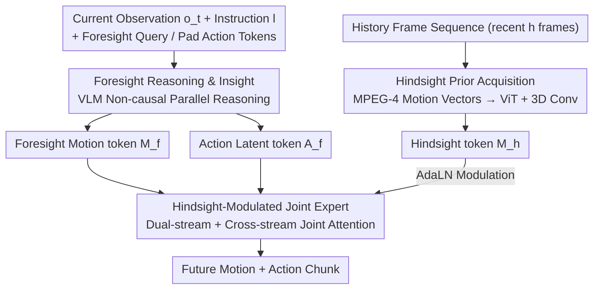

# HiF-VLA: Hindsight, Insight and Foresight through Motion Representation for Vision-Language-Action Models

**Conference**: CVPR 2026  
**arXiv**: [2512.09928](https://arxiv.org/abs/2512.09928)  
**Code**: [GitHub](https://github.com/OpenHelix-Team/HiF-VLA)  
**Area**: Robotics  
**Keywords**: VLA Model, Motion Representation, Temporal Reasoning, Long-horizon Manipulation, World Model

## TL;DR

The HiF-VLA framework is proposed, utilizing Motion Vectors as compact temporal primitives to unify Hindsight, Insight, and Foresight reasoning capabilities. By achieving bidirectional temporal expansion for VLA models, it significantly outperforms baselines in long-horizon manipulation tasks with minimal computational overhead.

## Background & Motivation

Vision-Language-Action (VLA) models have made significant progress in robotic manipulation by mapping visual and linguistic information to an action space for end-to-end control. However, most VLA models implicitly assume the Markov property—predicting actions based only on current observations—and lack explicit modeling of temporal dependencies. This leads to **temporal myopia**, manifested as fragmented trajectories and decreased task-level coherence in long-horizon operations.

Existing approaches to mitigate temporal myopia follow two main directions:

**History Frame Stacking**: Methods like TraceVLA and Octo take multiple past frames as input but suffer from heavy redundancy—adjacent frames are highly similar, leading to high computational costs and inference latency (Table 3 shows a 3.15× increase in latency when history=4).

**Pixel-level Sub-goal Prediction**: Methods like CoT-VLA and Seer predict future visual sub-goals but are susceptible to local distortion and semantic drift.

The core argument of this paper is: **motion is more suitable than raw pixels as a representation for temporal context**. Motion vectors capture dynamic changes between states while filtering out static pixel noise, serving as a natural bridge between the past and the future.

## Method

### Overall Architecture

HiF-VLA aims to address the "temporal myopia" of VLA models: original models predict an action chunk $\tilde{a}_{t:t+n} \sim P_\theta(a_{t:t+n} \mid o_t, l)$ based only on the current frame $o_t$ and instruction $l$, neither knowing what just happened nor rehearsing what comes next. HiF-VLA connects the model to both "past" and "future" ends, using **motion**—a compact temporal primitive—instead of pixels.

The framework is built upon OpenVLA-OFT (Prismatic-7B VLM backbone), modifying the data flow into three segments: first, historical motion $m^{his}_{t-h:t}$ from the recent $h$ frames is compressed into a hindsight context; then, the VLM outputs actions while simultaneously predicting future motion; finally, a joint expert fuses the two streams into the final action. Formally, the inference objective is expanded from pure actions to a joint distribution of actions and motion: $(\tilde{a}_{t:t+n}, \tilde{m}_{t:t+n}) \sim P'_\theta(a_{t:t+n}, m_{t:t+n} \mid o_t, l, m^{his}_{t-h:t})$. During training, both are learned together; during inference, the motion stream is optional—allowing for action-only decoding when computational resources are limited. The three contributing modules correspond to "Hindsight (Past) — Foresight (Future) — Fusion (Decoding)."

### Key Designs

**1. Hindsight Prior Acquisition: Using MPEG-4 Motion Vectors instead of frame stacking to compress history into a near-lossless yet lightweight context**

The pain point of history frame stacking is redundancy—adjacent frames are highly similar, and feeding more frames mainly duplicates static pixels, dragging down computation and latency. HiF-VLA directly leverages MPEG-4 Motion Vectors (MV) from video codecs: these encode the displacement of each macroblock between adjacent frames $MV_{t-1:t}(x,y) = (x_t - x_{t-1}, y_t - y_{t-1})$. The tensor size is only $h \times (H/16) \times (W/16) \times 2$, orders of magnitude smaller than raw frames, yet it retains the most critical temporal cues: "what is moving and where." This MV sequence is encoded by a lightweight ViT and shallow 3D convolutions into a compact hindsight token $M_h \in \mathbb{R}^{K_h \times d}$. MV is chosen over estimated optical flow because it is designed for "near-lossless reconstruction" in codec standards, effectively providing a free, efficient, and faithful summary of historical dynamics.

**2. Foresight Reasoning & Insight: Letting the VLM predict future motion instead of future pixels for distortion-free "rehearsal"**

Predicting future pixel-level sub-goals, as in CoT-VLA or Seer, often encounters local distortion and semantic drift—if the imagery becomes blurred or drifted, subsequent actions follow suit. HiF-VLA instead predicts future motion: $K_f$ learnable foresight query tokens and $K_a$ pad action tokens are prepended/appended to the instruction and current observation for VLM input. The VLM uses non-causal attention for one-shot parallel reasoning, outputting foresight motion tokens $M_f$ and action latent tokens $A_f$. By predicting motion instead of high-dimensional pixels, it avoids reconstruction distortion and eliminates redundant dimensions, essentially allowing the model to "determine the next move" before committing to specific actions.

**3. Hindsight-Modulated Joint Expert: Keeping history out of VLM input and using AdaLN conditioning in the decoder to decouple action and motion streams**

Feeding historical motion directly into the VLM input risks disrupting pre-trained vision-language alignments by introducing a new modality into the model's foundation. HiF-VLA instead reserves hindsight information for a downstream joint expert decoder, modulated via Adaptive Layer Normalization (AdaLN):

$$\text{AdaLN}(z; h_c) = \gamma(h_c) \cdot \frac{z - \mu(z)}{\sigma(z)} + \beta(h_c)$$

The hindsight context $h_c$ only scales and shifts the features $z$, leaving the VLM's attention structure intact. Inside this expert, foresight motion tokens and action tokens proceed as two parallel streams, interacting through **cross-stream joint attention** while maintaining independent FFNs to ensure representations are complementary but not conflated. The basis for this design is that motion is the physical projection of action in visual space; predicting them jointly aligns high-level semantic understanding with low-level dynamics.

### Loss & Training

The total loss is a weighted sum of the action L1 loss and motion reconstruction L1 loss:

$$\mathcal{L}_{all} = \mathcal{L}_A + \lambda \cdot \mathcal{L}_{MV}$$

where $\lambda = 0.01$. The model is trained for 150K steps on LIBERO and 80K steps on CALVIN using 8×A100 GPUs with a global batch size of 64.

## Key Experimental Results

### Main Results

**LIBERO-Long (10 tasks, 500 trials)**:

| Method | Perspective | Avg. Success Rate |
|------|------|-----------|
| OpenVLA-OFT | 3rd person | 91.0% |
| MemoryVLA | 3rd person | 93.4% |
| **HiF-VLA** | **3rd person** | **94.4%** |
| OpenVLA-OFT | Multi-view | 94.0% |
| Seer | Multi-view | 87.7% |
| **HiF-VLA** | **Multi-view** | **96.4%** |

The third-person variant of HiF-VLA (94.4%) nearly reaches the performance of the multi-view baseline.

**CALVIN ABC-D (Train A-C, Test unseen D)**:

| Method | Perspective | Avg. Len. ↑ |
|------|------|------------|
| VPP | Multi-view | 4.33 |
| Seer | Multi-view | 4.28 |
| **HiF-VLA** | **Multi-view** | **4.35** |
| HiF-VLA | 3rd person | 4.08 |

### Ablation Study

**Efficiency Comparison (LIBERO-Long, 3rd person, history=4)**:

| Config | GPU Memory | Latency | Success Rate |
|------|---------|------|--------|
| Baseline | 30.8GB (1.00×) | 72.9ms (1.00×) | 91.0% |
| + Sub-goal | 38.2GB (1.24×) | 115.9ms (1.59×) | 91.8% |
| + Foresight (HiF) | 31.8GB (1.03×) | 82.7ms (1.13×) | 92.2% |
| + History Frames | 63.6GB (2.06×) | 229.5ms (3.15×) | 90.4% |
| + Hindsight (HiF) | 31.4GB (1.02×) | 117.7ms (1.61×) | 92.2% |
| + Hindsight+Foresight | 32.2GB (1.05×) | 121.6ms (1.67×) | 93.2% |

History frame stacking results in a 3.15× latency increase and actually degrades performance; HiF-VLA's foresight only adds 0.13× latency.

**Hindsight Embedding Position**: Conditioning hindsight information in the expert decoder outperformed direct injection into VLM input, as motion information might interfere with vision-language pre-training alignment.

**Hindsight Length**: Peak performance was reached at a length of 8 (94.4% for 3rd person, 96.4% for multi-view).

### Key Findings

1. Raw frame stacking not only incurs massive computational overhead but can also **reduce** performance (90.4% vs 91.0%), as redundant pixel information dilutes task-relevant temporal cues.
2. Motion Vectors are both more efficient and more effective as historical representations—achieving a 1.2% absolute gain with only 2% additional GPU memory.
3. Inference latency for HiF-VLA increases only marginally with history length, whereas the frame-stacking baseline grows almost linearly (4.5× at history=8).
4. In real-world experiments, the baseline scored only 17.4% in Press-Buttons-Order due to an inability to detect subtle visual differences between pressed and unpressed states; HiF-VLA successfully detected these fine-grained state transitions using its temporal receptive field.

## Highlights & Insights

- **Clever use of Motion Vectors**: Borrowing MV from video coding as a historical representation is both theoretically grounded (near-lossless reconstruction) and practically advantageous (compact and efficient). This is an elegant cross-domain transfer.
- **"Think-before-you-act" paradigm**: Jointly predicting motion and action allows the VLA to reason about future dynamics while generating actions, mimicking human decision-making.
- **Insights on Hindsight Placement**: The experimentation on hindsight injection points is revealing—it suggests that for pre-trained multimodal models, the location of new modality information is crucial; decoders/post-processing layers are safer than direct embedding.

## Limitations & Future Work

1. Current motion representation relies on estimation accuracy and might be sensitive to noise in highly dynamic scenes.
2. Large-scale pre-training on internet videos to enhance motion understanding and generation has not yet been explored.
3. Hindsight length might require adaptive adjustment for different tasks, whereas a fixed window is currently used.
4. Validation is limited to LIBERO and CALVIN benchmarks, without involving more complex real-world tasks (e.g., kitchen manipulation, warehouse logistics).

## Related Work & Insights

- Compared to pixel-level sub-goal prediction in CoT-VLA and UP-VLA, using motion vectors for foresight is more compact and less prone to distortion.
- Compared to frame stacking in TraceVLA and Octo, MV encoding significantly reduces redundancy while maintaining information density.
- The AdaLN conditioning mechanism, derived from Diffusion Transformers (DiT), is creatively applied here for temporal modulation.
- This framework can be viewed as a motion-centric World Action Model, bridging perception, dynamics, and control.

## Rating

- Novelty: ⭐⭐⭐⭐⭐ (The use of Motion Vectors as temporal primitives + Hindsight-modulated Joint Expert is highly novel)
- Experimental Thoroughness: ⭐⭐⭐⭐⭐ (Sim-to-real, efficiency analysis, inference scalability, and detailed ablations)
- Writing Quality: ⭐⭐⭐⭐ (Clear structure, RQ-driven experimental design)
- Value: ⭐⭐⭐⭐⭐ (Provides an efficient and effective new paradigm for temporal modeling in VLAs)

<!-- RELATED:START -->

## Related Papers

- [\[CVPR 2026\] Cross-Hand Latent Representation for Vision-Language-Action Models](cross-hand_latent_representation_for_vision-language-action_models.md)
- [\[CVPR 2026\] ACoT-VLA: Action Chain-of-Thought for Vision-Language-Action Models](acot-vla_action_chain-of-thought_for_vision-language-action_models.md)
- [\[CVPR 2026\] ForeAct: Steering Your VLA with Efficient Visual Foresight Planning](foreact_steering_your_vla_with_efficient_visual_foresight_planning.md)
- [\[CVPR 2026\] Mantis: A Versatile Vision-Language-Action Model with Disentangled Visual Foresight](mantis_a_versatile_vision-language-action_model_with_disentangled_visual_foresig.md)
- [\[CVPR 2026\] StaMo: Unsupervised Learning of Generalizable Robot Motion from Compact State Representation](stamo_unsupervised_learning_of_generalizable_robot_motion_from_compact_state_rep.md)

<!-- RELATED:END -->
