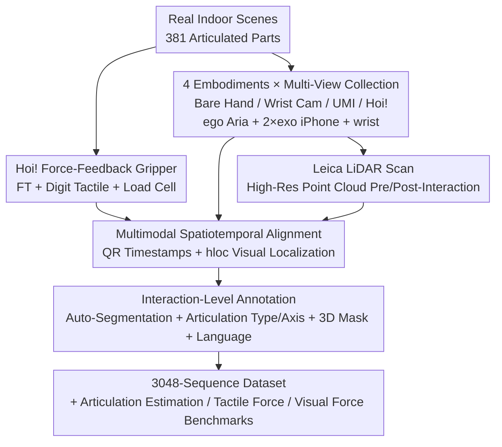

# Hoi! - A Multimodal Dataset for Force-Grounded, Cross-View Articulated Manipulation

**Conference**: CVPR 2026  
**Paper**: [CVF Open Access](https://openaccess.thecvf.com/content/CVPR2026/html/Engelbracht_Hoi_-_A_Multimodal_Dataset_for_Force-Grounded_Cross-View_Articulated_Manipulation_CVPR_2026_paper.html)  
**Code**: Project page https://hoi-dataset.ethz.ch (gripper design is open-sourced)  
**Area**: Robotics / Embodied Manipulation / Multimodal Dataset  
**Keywords**: Articulated manipulation, force grounding, cross-view, multi-embodiment, tactile perception

## TL;DR
Hoi! is a real-world multimodal dataset for "force-grounded, cross-view, and cross-embodiment" articulated furniture manipulation. Using a self-developed handheld force-feedback gripper, the authors collected 3,048 sequences of humans manipulating 381 articulated parts (such as drawers, doors, and refrigerators) across 38 real indoor scenes using four embodiments (bare hand / bare hand + wrist camera / UMI gripper / Hoi! gripper). Each sequence is spatially and temporally aligned with RGB-D, force/torque, tactile, hand pose, and scene-level LiDAR point clouds. It comes with three benchmarks: articulation estimation, tactile force estimation, and visual force estimation.

## Background & Motivation

**Background**: Computer vision is moving from "understanding what is scanned/seen" to "understanding how to use/interact," a transition largely driven by large-scale human-object interaction datasets. However, a close look reveals a disconnect: human-centric video datasets (cooking, assembly, sports) lean towards long-horizon activities, whereas robotics datasets mainly target short-horizon primitives like pick-and-place, wiping, or opening drawers.

**Limitations of Prior Work**: Although articulated furniture manipulation occurs daily, systematic video data of "human manipulating furniture" is extremely scarce. Existing articulated datasets (such as RBO and various part databases) are either purely simulated or consist of models obtained from static scanning, lacking paired motion data to "ground" annotations to real physical interaction. More critically, they rarely include **force/tactile** sensing, nor do they cover **multi-view** and **multi-embodiment** scenarios.

**Key Challenge**: No single dataset has successfully coupled "what is seen," "what is done," and "what is felt" simultaneously across both human and robot embodiments. Consequently, a series of transfer challenges cannot be systematically studied: Can interaction forces predicted from videos generalize to human videos? Is articulation tracking still effective from a third-person robot perspective? Can skills demonstrated by human hands be retargeted to parallel-jaw grippers?

**Goal**: To build a **force-grounded, cross-view, and cross-embodiment** articulated manipulation dataset that binds visual perception with tactile action.

**Key Insight**: Using a "gripper-on-a-stick" device—which is handheld by humans yet equipped with robot-grade force/tactile sensors—allows humans to operate furniture in the wild as if controlling a robot end-effector. This brings human demonstrations and robotic embodiments into the same sensing space.

**Core Idea**: For the same articulated object and the same interaction, perform it using four different embodiments while recording synchronously from multiple views, then use LiDAR scanning to provide scene-level geometric ground truth. This establishes a unified baseline to directly compare "human vs. robot perspectives" and "vision vs. force."

## Method

### Overall Architecture
The "method" of this paper is essentially a **data collection and alignment pipeline**: 7 demonstrators manipulated articulated parts in real rooms using four different embodiments. Multiple camera, force, and tactile modules recorded independently on their own clocks. All modalities were later aligned temporally and spatially to a unified world coordinate system established by LiDAR scans. Finally, interaction-level annotations were completed and three benchmarks were split. The core challenges this pipeline addresses are how to achieve spatiotemporal alignment of heterogeneous sensors in the wild, and how to reliably record and annotate "force/tactile" modalities, which have been entirely absent in prior video datasets.

### Key Designs

**1. Hoi! Handheld Force-Feedback Gripper: Collecting Robot-Grade Force and Tactile Sensing in the Wild**

The reason prior human-object interaction videos lack force data is that force sensors cannot easily be attached to human hands, and there is no unified contact interface. The authors designed and open-sourced a "gripper-on-a-stick" two-finger parallel gripper: grasping is driven by a calibrated load cell inside the handle—when a human squeezes the load cell, the measured load is mapped to gripping force, which then drives an antipodal (ALOHA-inspired) closing mechanism via a Dynamixel XM430-W350-T motor. Two opposing GelSight Digit sensors provide high-resolution tactile imaging, a Bota SensONE 6-DoF force/torque sensor on the wrist measures interaction forces, and a ZED Mini stereo camera + Project Aria on the wrist provide pose and RGB-D wrist views. The entire system runs on a battery-powered NVIDIA Jetson Orin Nano carried in a backpack, complete with gravity compensation and full calibration, allowing for fully mobile collection in real indoor rooms. This gripper introduces force/tactile readings that are isomorphic to robot end-effectors into human demonstrations for the first time, serving as the hardware foundation for the dataset's "force grounding."

**2. Synchronous 4-Embodiment + Multi-View Setup: Direct Comparisons Across Human and Robot Morphologies**

Each articulated object is manipulated once by four different embodiments: (i) bare hand, (ii) bare hand + wrist camera, (iii) handheld UMI gripper, and (iv) Hoi! gripper, with a small subset recorded using a teleoperated Spot robot (equipped with body cameras and a wrist Aria). Synchronous multi-view recordings are captured across all embodiments: an egocentric Project Aria provides RGB, SLAM, eye gaze, and hand poses; two static third-person iPhone 13 Pros provide RGB + LiDAR depth; plus a wrist-mounted view. The significance of this design is that the morphological differences from bare hands to parallel-jaw grippers are explicitly captured within multiple sequences of the same object. Researchers can directly analyze "how a human hand opens it vs. what happens when a gripper does it," rather than guessing between unrelated datasets. Tab. 2 lists the specific data streams available under each condition—only the Hoi! gripper simultaneously provides wrist depth, force/torque, finger tactile data, and motor torque.

**3. Multimodal Spatiotemporal Alignment: Unifying Latency-Prone Heterogeneous Streams**

The primary engineering hurdle of collecting data in the wild is that each recording module uses an independent internal clock and individual SLAM trajectories drift. Temporally, the authors construct 25 Hz QR codes encoding the current Unix timestamp and display them to each camera stream; decoding them post-collection yields the temporal offset of each video relative to a common reference clock. For typical frame rates of 30–60 Hz, this method achieves a temporal alignment accuracy of approximately $10\!\sim\!25\,\text{ms}$. Spatially, a Leica RTC360 scanner is deployed to capture the room before and after interactions, outputting dense 3D point clouds as the shared reference frame. Assuming negligible SLAM drift and global consistency for each device, the global registration problem is reduced to a single rigid 3D-3D alignment. By constructing a 2D-3D correspondence query database from the scanned point clouds and panoramic images, hloc is used to estimate the 6-DoF pose of automatically selected high-quality keyframes. This robustly yields a rigid transformation $T^{\text{query}}_{\text{world}}$ for each sensor trajectory. The alignment accuracy is validated using a Qualisys motion capture system (using hand-eye calibration to align the mocap volume with Aria coordinates); the position RMSE for head, wrist, and gripper trajectories is only $0.005\!\sim\!0.006\,\text{m}$, and the rotation RMSE is $0.012\!\sim\!0.016\,\text{rad}$ (Tab. 3).

**4. Interaction-Level Annotations and Three Benchmarks: Turning Data into Evaluable baselines**

The raw streams are first automatically segmented into individual interaction episodes based on QR code transitions and verified manually using light annotation tools. Articulation types (prismatic / revolute) and axes are labeled using ArtiPoint tools, which are extended to include 3D masks of the components (prompting SAMv2 on panoramic views to get 2D masks, then projecting them into 3D using the point clouds) along with language descriptions. Based on these annotations, three complementary "embodied object understanding" benchmarks are defined: **Articulation Object Estimation** (inferring component motion and kinematic parameters from images/video), **Tactile Force Estimation** (regressing normal/tangential contact forces solely from Digit tactile images), and **Visual Force Estimation** (predicting the 3D forces and affordances needed to achieve the manipulation goal given RGB-D observations). These three tasks tie together the multimodal value of the dataset, binding vision, touch, and force to a single set of ground-truth coordinates to directly evaluate the transferability of state-of-the-art methods to real-world, in-the-wild interactions.

### Loss & Training
This is a dataset and benchmark paper and does not train new models. All benchmarks evaluate existing models (GPT-5, ArtGS, ArtiPoint, Sparsh, ForceSight) using zero-shot configurations or following their original setups. The focus is to expose their performance gaps on real-world, in-the-wild data rather than chasing state-of-the-art numbers.

## Key Experimental Results

### Main Results

**Articulation Object Estimation (Tab. 4)**: Given a single pre-interaction image (GPT-5) or egocentric video (ArtGS/ArtiPoint), predict the articulation type and 3D axis. Metrics are classification recall $R$, angular axis error $\theta_{\text{err}}$, and rotational axis distance error $d_{L2}$.

| Dataset | Method | $R_{\text{pris}}$[%] | $R_{\text{rev}}$[%] | $\theta_{\text{pris}}$[°] | $\theta_{\text{rev}}$[°] | $d_{L2}$[m] |
|--------|------|------|------|------|------|------|
| Hoi! | GPT-5 (ego) | 71.9 | 89.7 | - | - | - |
| Hoi! | GPT-5 (exo) | 65.6 | 89.7 | - | - | - |
| Hoi! | ArtGS | 100.0 | 0.00 | 58.39 | 49.11 | 0.321 |
| Hoi! | ArtiPoint | 26.90 | 57.10 | 47.06 | 63.76 | 0.540 |
| Arti4D | ArtiPoint | 68 | 98 | 14.54 | 17.14 | 0.07 |

Conclusion: ArtGS collapses in cluttered real-world scenes due to its reliance on robust segmentation (yielding a revolute recall of 0). ArtiPoint on Hoi! suffers because it relies on scaled monocular depth (which contains frame-to-frame jitter), leading to severe degradation in 3D lifting and trajectory filtering, performing much worse than it does on Arti4D. In contrast, GPT-5 is surprisingly robust when simply performing type prediction. This shows that existing articulation estimation methods either over-rely on perfect depth map accuracy or fail under clutter and hand occlusions.

**Tactile Force Estimation (Tab. 5)**: Estimate normal/tangential forces solely from Digit tactile images. Metric is RMSE (in N, including 95% CI).

| Method | Tangential | Normal | Resultant |
|------|------|------|------|
| Sparsh w/ DINO | 3.07 [2.87, 3.26] | 3.45 [3.24, 3.66] | 3.86 [3.62, 4.11] |
| Sparsh w/ DINOv2 | 3.18 [2.99, 3.38] | 3.79 [3.61, 3.96] | 4.11 [3.90, 4.33] |

While Sparsh achieves millinewton-level accuracy on its original benchmark, its error surges to the scale of several Newtons on Hoi!. The authors attribute this to the contact geometries of real handles, edges, and furniture parts being far more complex than the simple indenters used during training (out-of-distribution contact algebra), coupled with out-of-distribution force ranges from human manipulation in the wild. ⚠️ The two setups are not fully equivalent (Hoi! aggregates the force from two opposing Digits), but the jump in error magnitude remains highly telling.

### Ablation Study

**Visual Force Estimation Ablation (Tab. 6): Raw vs. Motion-Aligned**

Given RGB-D observations and a manipulation goal (e.g., "open the drawer"), ForceSight zero-shot predicts 3D interaction forces; lower RMSE is better. "Projected" denotes the evaluation restricted only to the force component aligned with the gripper's movement direction (filtering out operator-unrelated perturbations).

| Configuration / Scene | RMSE Projected [N] | RMSE Raw [N] | Description |
|------|------|------|------|
| Hoi! Overall | 2.23 | 2.57 | Metrics are better post-projection, indicating susceptibility to real-life operator perturbations |
| kitchen_7 | 3.53 | 3.64 | Contains fridge + oven, requiring high force, yielding highest error |
| office_1 | 2.33 | 3.69 | Magnetic drawer, high raw error |
| livingroom_1 | 1.09 | 1.74 | Low load, lowest error |
| ForceSight Original Dataset | – | 0.40 | Only 0.40 N on original benchmark |

### Key Findings
- **Existing Methods Struggle in the Wild**: Whether in articulation estimation, tactile force estimation, or visual force estimation, state-of-the-art methods that excel in controlled lab environments experience severe degradation on Hoi! in-the-wild data—which highlights the unique value of this dataset.
- **Force as a Key Vulnerability on High-Stiffness Objects**: ForceSight struggles most on components requiring high force (refrigerators, ovens, magnetic drawers), showing that existing methods/datasets lack exposure to "stiff, force-intensive" articulated systems.
- **Motion Alignment Proves Effective**: Projecting the measured force/torque onto the linear/angular velocity vectors of the gripper to filter out unrelated components reduces the visual force RMSE from 2.57 N to 2.23 N, proving that the raw signal contains significant irrelevant perturbation introduced by the operator.
- **VLM Is Surprisingly Robust for Type Classification**: GPT-5 achieves up to 89.7% recall (revolute) when predicting only the prismatic/revolute type, but it cannot output precise 3D axes.

## Highlights & Insights
- **Clever Hardware Innovation for "Force Grounding"**: Designing a handheld "gripper-on-a-stick" with robot end-effector force/torque and GelSight tactile sensors enables human in-the-wild demonstrations to capture force readings isomorphic to robot end-effectors for the first time. This fills a structural gap in prior video datasets, and the gripper design is open-sourced for easy replication and expansion.
- **Synchronous 4-Embodiment + Multi-View Setup on the Same Object** serves as an ideal controlled variable setup for studying "human-to-robot skill transfer." Morphological discrepancies are explicitly captured in multiple sequences of the same object, rather than compared blindly across disjointed datasets.
- **QR Code Timestamps + LiDAR Rigid Alignment** provides a simple yet highly reliable trick for spatiotemporal alignment across multiple devices in the wild (25 Hz QR → 10-25 ms temporal accuracy; hloc visual localization → single rigid transformation matrix). This pipeline is highly transferable to any heterogeneous sensor collection in the wild.
- **Honest Benchmark Design**: The authors transparently report that existing SOTA methods fail on their dataset, attributing the drops to specific factors (depth noise, out-of-distribution contact geometries, operator perturbations). This positions the dataset as a vehicle to "expose gaps and drive research" rather than to simply top leaderboards.

## Limitations & Future Work
- **Hybrid Embodiment is Still Not a Real Robot**: Although the Hoi! gripper mimics robot end-effectors, it is ultimately operated by humans and cannot fully capture the kinematic/dynamic constraints of actual robotic arms. Full-body morphology transfer remains an open question (as acknowledged by the authors).
- **Limited Mechanism Coverage**: While covering a wide range of common household articulated objects, the dataset does not yet span all mechanical complexities or rare, atypical mechanisms.
- **Object-Centric, Perception-Heavy Benchmarks**: The benchmarks currently focus on foundational perception tasks like force estimation and articulation inference, without extending to closed-loop, end-to-end policy learning (perception-to-action).
- **Self-Evaluation Supplement**: The human-robot comparison in tactile force estimation is "not fully equivalent" (aggregating two Digits vs. using a single raw sensor), so the scale of error across setups should not be treated as a definitive indictment of model quality. Furthermore, although the dataset spans 48 hours, it is still relatively small compared to thousand-hour teleoperation datasets like RH20T or AgiBot, making it more suitable as an evaluative benchmark rather than a resource for large-scale pre-training.

## Related Work & Insights
- **vs RBO**: RBO offers RGB-D data of humans manipulating articulated objects with limited force measurements, but has a small scale (~1 hour, 14 objects), single perspective, and single embodiment. Hoi! expands drastically in scale (48 hours, 381 parts, 38 scenes), multi-view setups (ego/exo/wrist), and four distinct embodiments.
- **vs Arti4D / ArtiPoint**: Arti4D provides field-level articulated reconstruction data, while ArtiPoint infers articulation from egocentric RGB-D. Hoi! reuses ArtiPoint's annotation tool but supplements it with force/tactile feedback and cross-embodiment setups; experiments show these methods perform significantly worse under Hoi!'s more challenging "in-the-wild" conditions.
- **vs Egocentric Video Datasets (e.g., EgoExo4D, EpicKitchens)**: These cover broad semantic activities but only document "what happened," lacking applied force or contact feedback, which makes translation to physical manipulation difficult. Hoi! resolves this by coupling "what is seen, what is done, and what is felt."
- **vs ForceMimic / RH20T**: Both prove that incorporating force measurements significantly enhances robotic manipulation, yet they are confined to desktop environments and low domain-gap setups. Hoi! brings multimodal force/tactile data to household articulated furniture and human-robot cross-embodiment settings in the wild.

## Rating
- Novelty: ⭐⭐⭐⭐⭐ First "force-grounded, cross-view, cross-embodiment" real articulated manipulation dataset, accompanied by an open-sourced handheld force-feedback gripper.
- Experimental Thoroughness: ⭐⭐⭐⭐ Three benchmarks span articulation, tactile force, and visual force, honestly exposing SOTA performance gaps; but evaluations tilt heavily toward perception and lack policy learning.
- Writing Quality: ⭐⭐⭐⭐ Clear motivation, meticulous description of alignment pipelines, and a highly informative Tab. 1 side-by-side comparison.
- Value: ⭐⭐⭐⭐⭐ Fills a critical data gap for human-to-robot skill transfer and in-the-wild force estimation research, with both hardware design and datasets fully open-sourced.

<!-- RELATED:START -->

## Related Papers

- [\[CVPR 2026\] ForceVLA2: Unleashing Hybrid Force-Position Control with Force Awareness for Contact-Rich Manipulation](forcevla2_unleashing_hybrid_force-position_control_with_force_awareness_for_cont.md)
- [\[CVPR 2026\] CLaD: Planning with Grounded Foresight via Cross-Modal Latent Dynamics](clad_planning_with_grounded_foresight_via_cross-modal_latent_dynamics.md)
- [\[CVPR 2026\] A Cross-view Fusion Framework for Robust 6-DoF Grasp Pose Estimation](a_cross-view_fusion_framework_for_robust_6-dof_grasp_pose_estimation.md)
- [\[CVPR 2026\] Physically Ground Commonsense Knowledge for Articulated Object Manipulation with Analytic Concepts](physically_ground_commonsense_knowledge_for_articulated_object_manipulation_with.md)
- [\[CVPR 2026\] INSIGHT Bench: Towards Grounded IN-SItu Guidance for Robotic Manipulation](insight_bench_towards_grounded_in-situ_guidance_for_robotic_manipulation.md)

<!-- RELATED:END -->
