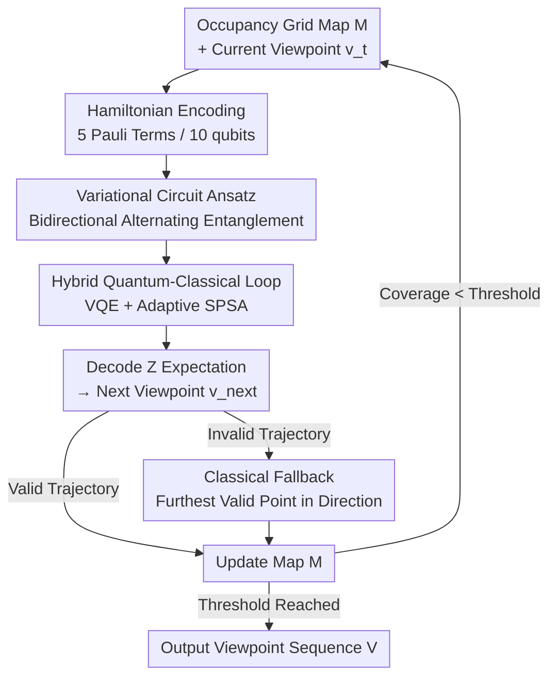

# HQC-NBV: A Hybrid Quantum-Classical View Planning Approach

**Conference**: CVPR 2026  
**Paper**: [CVF Open Access](https://openaccess.thecvf.com/content/CVPR2026/html/Yu_HQC-NBV_A_Hybrid_Quantum-Classical_View_Planning_Approach_CVPR_2026_paper.html)  
**Area**: Robotics / Active Perception (Next-Best-View Planning)  
**Keywords**: Next-Best-View, View Planning, Hybrid Quantum-Classical, Variational Quantum Circuits, Robotic Exploration

## TL;DR
The "Next-Best-View" (NBV) problem in robotic exploration is reformulated as finding the ground state of a quantum Hamiltonian. Using a 10-qubit variational circuit with VQE/SPSA to simultaneously evaluate multiple movement directions, the approach leverages quantum superposition and entanglement to escape local optima common in classical heuristics or sampling methods. In 2D exploration scenarios, it improves exploration efficiency by 7.9–49.2% compared to classical methods.

## Background & Motivation

**Background**: Next-Best-View (NBV) is a core problem in robotic exploration, search and rescue, and autonomous navigation—deciding where to move and look at each step to acquire maximum new information with minimum movement. Classical approaches are divided into sampling-based methods (e.g., scattering candidate viewpoints in free space using RRT/RRT* and selecting based on information gain/cost ratios) and deterministic methods (using heuristic rules like entropy minimization or frontier-based exploration).

**Limitations of Prior Work**: Sampling-based methods often yield suboptimal solutions due to approximate sampling of the solution space, and the number of candidates explodes exponentially with environment scale. Deterministic heuristics are prone to trapping in local optima, making it difficult to find global optima in large-scale scenes. Fundamentally, discretized NBV is a **combinatorial optimization** problem where the solution space complexity of the feasible viewpoint set $F$ is $O(|F|)$. Classical optimizers (Powell, COBYLA, etc.) easily struggle on such discrete, non-convex, and non-differentiable information gain landscapes.

**Key Challenge**: Classical methods can only evaluate candidate viewpoints **serially**. However, strong hierarchical dependencies exist between NBV decision parameters (direction, distance, orientation)—the chosen direction affects the appropriate distance and the required camera angle. Serial evaluation is slow and decouples these interdependent parameters.

**Key Insight**: Two characteristics of quantum computing address these pain points: **superposition** allows a set of qubits to represent and evaluate all candidate movement parameters simultaneously (parallel search), and **entanglement** naturally encodes hierarchical dependencies between parameters. Additionally, the combinatorial optimization nature of NBV aligns well with problems suited for quantum annealing or variational quantum algorithms.

**Core Idea**: A meticulously designed cost Hamiltonian $\hat{H}$ encodes the NBV objective function into 10 qubits, where the "optimal viewpoint" corresponds to the ground state. A variational quantum circuit with bidirectional alternating entanglement approximates this ground state, forming a hybrid quantum-classical loop combined with a classical SPSA optimizer and trajectory verification. This represents the first work to introduce a hybrid quantum-classical framework into information-driven view planning.

## Method

### Overall Architecture

HQC-NBV is an iterative exploration system that maintains a 3-state (unknown/free/occupied) occupancy grid map $\mathcal{M}$. Each step takes the current viewpoint and map as input and outputs the next best viewpoint until a coverage threshold is met. Internally, each step follows a hybrid loop: "Classical problem construction → Quantum solving → Classical decoding/verification." The exploration goal is encoded into a cost Hamiltonian $\hat{H}$, a parameterized variational circuit $U(\vec\theta)$ is constructed, and VQE with adaptive SPSA optimizes parameters to approach the ground state. The next viewpoint parameters are decoded from the measured $Z$ expectations, followed by trajectory legality verification (with a classical fallback strategy) before updating the map.

The classical optimization objective is:
$$\min_{v\in C} J(v) = -E(v) + \lambda_m M(v),\qquad \text{s.t. } P(v'\to v)\cap O=\varnothing$$
where $E(v)$ is exploration utility, $M(v)$ is movement cost, and the constraint ensures collision-free paths. Discretization turns this into $v^*=\arg\min_{v\in F}J(v)$, which is the step delegated to quantum solving.

### Key Designs

**1. Problem Hamiltonian Encoding: Mapping "Where to Look" to Quantum Energy Landscapes**

The discrete information gain function of NBV is unfriendly to optimizers (non-differentiable, rugged). This approach rewrites the objective $J(v)$ into a cost Hamiltonian composed of weighted sums of Pauli operators:
$$\hat{H} = \sum_i \alpha_i \hat{P}_i = \hat{H}_{dir} + \hat{H}_{dist} + \hat{H}_{adj} + \hat{H}_{orient} + \hat{H}_{coh}$$
where $\hat{P}_i$ are Pauli strings and $\alpha_i$ are coefficients. The key is to ensure "low classical cost viewpoint = low quantum energy state," so information about the optimal viewpoint is encoded in the **ground state** $|\psi_0\rangle$.

The 10 qubits are grouped by physical meaning: the first 2 encode primary direction, 2 for distance, 2 for fine-tuning, and 4 for orientation (requiring high precision). Coefficients for terms like $\hat{H}_{dir}$ (guiding movement via unexplored density) and $\hat{H}_{dist}$ (penalizing obstacle proximity) are calculated in real-time from the map. Crucially, the **coherence term** $\hat{H}_{coh}$ uses $X$ operators and two-qubit entanglement to maintain quantum superposition and coupling between physically related parameter pairs (e.g., direction-orientation). This transforms a rugged discrete landscape into a smooth energy expectation for which gradients can be computed.

**2. Parameter-Centric Variational Circuit: Capturing Hierarchical Dependencies**

To approximate the ground state, a 5-layer parameterized circuit $U(\vec\theta)$ is applied to $|+\rangle^{\otimes n}$. Each layer contains $R_y$ rotations for parameter group encoding, entanglement modules for quantum correlations, and $R_x$ rotations to expand the searchable Hilbert subspace.

The core of the entanglement module is a **two-level hierarchical + bidirectional alternating** structure. It performs **intra-group entanglement** using CNOT chains and **inter-group entanglement** between parameter sets. The connection pattern **alternates directions** between odd and even layers (e.g., $\text{CNOT}_{dir,adj}$ vs $\text{CNOT}_{adj,dir}$). This bidirectional flow allows information to move both ways between parameter groups, expressing complex hierarchical couplings like "direction ↔ distance ↔ orientation" without requiring deep circuits.

**3. Hybrid Quantum-Classical Iterative Loop: VQE + Adaptive SPSA + Classical Fallback**

Due to noise in NISQ-era hardware, a hybrid loop with classical safeguards is used. Each step employs VQE to minimize energy expectations $\vec\theta^*=\arg\min_{\vec\theta}\langle\psi(\vec\theta)|\hat{H}|\psi(\vec\theta)\rangle$. The optimizer is **adaptive SPSA**, which is robust to measurement noise and suitable for high-dimensional spaces. After optimization, the next viewpoint is decoded. **Trajectory verification** ensures the new viewpoint is in an observed area and collision-free; if not, a classical fallback strategy selects the furthest valid position along the movement direction.

## Key Experimental Results

### Main Results
HQC-NBV was compared against classical methods (RH-NBV, frontier-based) and classical optimizers (Powell, COBYLA) in four 2D scenarios of varying complexity (S1–S4).

| Scenario | Method | Coverage | Viewpoints Required |
|----------|--------|----------|---------------------|
| S1 | **HQC-NBV** | **92.85%** | 16 |
| S1 | RH-NBV / Frontier | 80.54% | 16 |
| S2 | **HQC-NBV** | **93.02%** | 12 |
| S2 | RH-NBV | 78.27% | ~24 |
| S3 | **HQC-NBV** | **91.97%** | 18 |
| S3 | Frontier-based | 81.75% (early term.) | — |

Overall, compared to classical exploration methods, path length was reduced by 9.60–27.92%, and exploration efficiency (coverage/distance) increased by 16.19–30.75%. The reported total exploration efficiency **Gain** ranged from **7.9–49.2%**, with maximum coverage reaching 95.8%.

### Ablation Study
Ablations were conducted on entanglement architectures (Full, No entanglement, Intra-group only, Inter-group only) and coherence terms within the Hamiltonian.

| Dimension | Variant | Key Observation |
|-----------|---------|-----------------|
| Entanglement | No Entanglement | Requires **61.11% / 57.14%** more viewpoints to reach 65% coverage (S1/S2). |
| Entanglement | Inter- vs Intra-group | Inter-group consistently outperforms intra-group, proving cross-parameter coupling is vital. |
| Coherence | No Coherence | Frequently trapped in local optima; coverage stalls at **68.46% / 65.77%**. |

### Key Findings
- **Inter-group > Intra-group Entanglement**: Maintaining entanglement between parameter groups (direction ↔ distance ↔ orientation) is more critical for exploration than within groups.
- **Coherence enables late-stage breakthroughs**: Removing two-qubit coherence terms severely impacts performance in late-stage exploration (coverage >50%) when unexplored areas are sparse.
- **Good Scalability**: In S4 (4x the area of S1-S3), the required viewpoint count scaled proportionally, suggesting the method does not degrade as environments enlarge.
- **Parallel Search Visualization**: Initial uniform probabilities across directions gradually converge during iterations, demonstrating the quantum superposition process.

## Highlights & Insights
- **Converting non-differentiable discrete gain into differentiable energy expectations**: This is the most ingenious contribution. Rewriting the rugged NBV objective into a structured Hamiltonian allows for smooth gradients, fundamentally explaining the advantage over Powell/COBYLA.
- **Physically-driven qubit allocation and entanglement topology**: Allocating qubits and connections based on the actual physical dependencies of the parameters (10 bits for dir/dist/adj/orient) minimizes circuit depth while matching problem structure.
- **Bidirectional alternating entanglement** allows bidirectional information flow between parameters, providing a way to express deep coupling in shallow NISQ-friendly circuits.

## Limitations & Future Work
- **Proof of Concept in 2D**: The work is limited to 2D environments and simplified sensor models without 3D complexity or realistic sensor noise.
- **Simulated Execution**: All experiments were conducted on the Qiskit Aer simulator; the impact of decoherence and gate errors on real NISQ hardware remains untested.
- **Empirical Attribution**: While gains are clear, some may stem from the "differentiable energy landscape" formulation rather than quantum advantage itself; more rigorous comparisons against strengthened classical baselines are needed.

## Related Work & Insights
- **vs. Classical NBV (RH-NBV, frontier-based)**: While classical methods rely on heuristics and are prone to local optima, the quantum approach uses superposition for parallel evaluation and entanglement to capture parameter coupling.
- **vs. Quantum Computer Vision**: Most existing work uses Ising/QUBO models for adiabatic quantum computing; this work utilizes the **Variational Quantum Algorithm (VQE)** framework and is the first application to information-driven view planning.

## Rating
- **Novelty**: ⭐⭐⭐⭐⭐ First introduction of hybrid quantum-classical variational frameworks to NBV.
- **Experimental Thoroughness**: ⭐⭐⭐⭐ Solid multi-scenario comparisons and dual-dimension ablations, though limited to 2D simulation.
- **Writing Quality**: ⭐⭐⭐⭐ Clear formulas and logic.
- **Value**: ⭐⭐⭐⭐ Significant directional value for quantum computing in robotic perception.

<!-- RELATED:START -->

## Related Papers

- [\[CVPR 2026\] Learning to Act Robustly with View-Invariant Latent Actions](learning_to_act_robustly_with_view-invariant_latent_actions.md)
- [\[CVPR 2026\] AirSim360: A Panoramic Simulation Platform within Drone View](airsim360_a_panoramic_simulation_platform_within_drone_view.md)
- [\[CVPR 2026\] Hoi! - A Multimodal Dataset for Force-Grounded, Cross-View Articulated Manipulation](hoi_-_a_multimodal_dataset_for_force-grounded_cross-view_articulated_manipulatio.md)
- [\[CVPR 2026\] DiffuView: Multi-View Diffusion Pretraining for 3D-Aware Robotic Manipulation](diffuview_multi-view_diffusion_pretraining_for_3d_aware_robotic_manipulation.md)
- [\[CVPR 2026\] A Cross-view Fusion Framework for Robust 6-DoF Grasp Pose Estimation](a_cross-view_fusion_framework_for_robust_6-dof_grasp_pose_estimation.md)

<!-- RELATED:END -->
