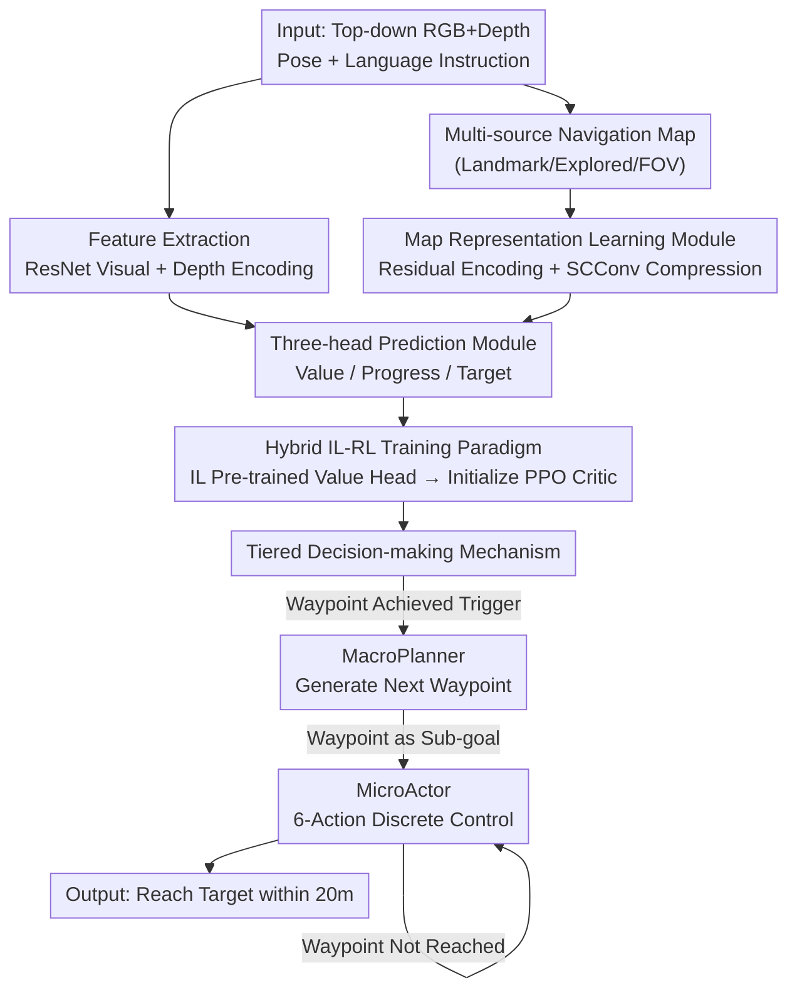

# HTNav: A Hybrid Navigation Framework with Tiered Structure for Urban Aerial Vision-and-Language Navigation

**Conference**: CVPR 2026  
**Paper**: [CVF Open Access](https://openaccess.thecvf.com/content/CVPR2026/html/Fan_HTNav_A_Hybrid_Navigation_Framework_with_Tiered_Structure_for_Urban_CVPR_2026_paper.html)  
**Area**: Robotics / Embodied Navigation (Aerial Vision-and-Language Navigation)  

**Keywords**: Aerial VLN, UAV Navigation, Imitation Learning + Reinforcement Learning, Tiered Decision-making, Map Representation Learning

## TL;DR
HTNav establishes a foundation for urban UAV vision-language navigation using a hybrid training paradigm of "IL pre-training + PPO fine-tuning," layered with a tiered decision-making mechanism ("Macro planification of waypoints + Micro action selection") and a residual map encoding module. It doubles the success rate on unseen test scenarios in CityNav from 9.70% to 25.49%.

## Background & Motivation
**Background**: Aerial Vision-and-Language Navigation (Aerial VLN) enables UAVs to fly to target locations at an urban scale based on natural language instructions, holding significant application value (logistics delivery, urban inspection, disaster monitoring). Current mainstream research follows two routes: one category (CityNav, FG-AVDN, FlightGPT) uses satellite remote sensing/top-down 2D images to plan paths on real urban base maps; the other (AerialVLN, OpenUAV, OpenFLY) is built in simulation environments like AirSim for 3D immersive navigation. This paper follows the former, based on the CityNav urban-scale benchmark.

**Limitations of Prior Work**: The authors categorize failures in realistic urban navigation into three types (Paper Figure 1). First, **poor generalization**—success rates drop sharply and navigation errors accumulate when moving from seen to unseen scenarios, with overall SR remaining low. Second, **long-range planning failure**—errors accumulate continuously during iterative decision-making, causing the UAV to easily lose the target's location, leading to trajectory failure. Third, **weak spatial understanding**—complex urban spatial relationships prevent the model from correctly parsing spatial constraints in instructions like "opposite the building" or "past the parking lot," leading to flight in the wrong direction.

**Key Challenge**: Pure Imitation Learning (IL) only learns from expert trajectories and is locked into the demonstration data distribution, lacking exploration capabilities in unseen scenarios. Pure Reinforcement Learning (RL) can explore new strategies through trial and error and has strong transferability, but it trains slowly and exploration is "unguided" during cold starts, leading to extremely slow convergence in large urban state spaces. Both paradigms have critical flaws, and neither is sufficient on its own.

**Goal**: To stabilize long-range UAV navigation in complex, unseen urban environments, addressing generalization, long-range planning, and spatial understanding simultaneously.

**Key Insight**: The authors' key observation is that IL learns not just an action policy but also a **state value function $V(s_t)$** as a byproduct. If this value head is well-trained during the IL phase and used to initialize the RL critic, the RL agent starts with a high-quality value baseline, transforming exploration from "unguided" to "guided." This stitches the strengths of both paradigms together: IL provides initialization and policy priors, upon which RL continues to explore.

**Core Idea**: Use a hybrid IL-RL paradigm of "IL pre-trained value function → initializing RL critic" as the foundation, overlaid with macro/micro tiered decision-making to decompose long-range tasks into waypoint sequences, combined with a residual map module to strengthen spatial representation.

## Method

### Overall Architecture
HTNav is built upon the MGP framework to solve the CityNav task: given a target description (e.g., "the blue and white building around the large parking lot") and its own pose, the UAV uses real-time top-down RGB + depth observations to incrementally build a navigation map and fly to within 20 meters of the target for success.

The pipeline consists of three coordinated parts: the **Feature Extraction Module** uses ResNet to encode RGB, depth, and map inputs; the **Prediction Module** features a three-head structure—a value head predicting expected cumulative reward $V(s_t)$, a progress head predicting navigation completion, and a target head regressing final target coordinates; the **Tiered Decision-making Module** uses this information to make decisions, where the MacroPlanner generates the next waypoint and the MicroActor selects specific actions in a six-action discrete space. Training begins with IL pre-training to obtain a stable baseline policy and value head, followed by RL fine-tuning via PPO, where value head weights are directly transferred to the PPO value network.

### Key Designs

**1. Hybrid IL-RL Training Paradigm: Guided RL Exploration via IL-Learned Value Functions**

This addresses the core conflict between IL's distribution lock and RL's cold-start slow convergence. HTNav splits training into two stages. Stage one uses expert demonstration trajectories to train a multi-task target predictor. In addition to predicting target position and progress, it explicitly adds a **state value head** estimating the expected discounted return from state $s_t$:

$$V(s_t) = \mathbb{E}\left[\sum_{k=0}^{\infty} \gamma^k r_{t+k} \mid s_t\right]$$

The elegance of this step is that the value head is trained "alongside" imitation learning, allowing the model to capture the reward structure of the environment early in training. Stage two fine-tunes the policy with PPO, using a clipped surrogate objective $L^{CLIP}(\theta) = \mathbb{E}_t[\min(r_t(\theta)\hat{A}_t,\ \text{clip}(r_t(\theta), 1-\epsilon, 1+\epsilon)\hat{A}_t)]$ to prevent aggressive policy updates. **Crucially, the PPO value network is directly initialized with the value parameters learned in stage one**—this is the source of the "guided exploration," as the RL critic starts with a high-quality baseline rather than exploring the reward landscape from scratch. The total loss is defined piece-wise: $L_{total} = L_{IL} + L_V + \lambda_{RL} L_{RL}$ (when RL is enabled) or $L_{IL}$ (otherwise), where both $L_{IL}$ and $L_V$ use MSE. The reward function comprises four terms: distance reward (encouraging proximity to the target), orientation reward (encouraging alignment using angular difference within $[0, \pi]$), target reward (triggered upon reaching the distance threshold), and step penalty (suppressing ineffective exploration); raw rewards are clipped to $[r_{min}, r_{max}]$ for numerical stability.

**2. Tiered Decision-making Mechanism: Decomposing Long-range Navigation into "Macro-waypoints + Micro-actions"**

This targets the pain points of long-range navigation error accumulation and loss of target localization. Traditional methods (e.g., the teacher algorithm in MGP) rely on rigid pre-calculated paths and ignore real-time perception, making them both short-sighted and fragile. HTNav decouples the task into two levels. The high-level **MacroPlanner** $G(m, s_t, d)$ ingests navigation map features $m$ (including landmark information), the UAV pose $s_t=(p_t,\theta_t)$, and the target description $d$ to output the next waypoint $w_{k+1}$; it breaks the global task into a sequence of local sub-goals $\{w_1, \dots, w_K\}$ (where $w_K \approx g$, the target point), preventing long-range planning from falling into local optima. The MacroPlanner is only triggered when the current sub-goal is reached—i.e., when $\|p_t - w_k\|_2 < \epsilon$. The low-level **MicroActor** $\pi_{micro}(o_t, s_t, w_k)$ receives current RGB observations, pose, and the current sub-goal to continuously select actions in a six-action discrete space $\{$Up, Down, Forward, Left, Right, Stop$\}$, driving the state transition $s_t \to s_{t+1}$ until the waypoint is reached and control returns to the MacroPlanner. This division of labor between "global rationality + local reaction" ensures the navigation follows the general direction while adapting to local changes.

**3. Map Representation Learning Module: Residual Encoding + SCConv Compression for Spatial Semantics**

This addresses weak spatial understanding—existing methods do not sufficiently model or utilize map information. The module is built on a residual network, where each residual block performs $F^{(l+1)} = \sigma(\text{BN}(\text{Conv}(F^{(l)})) + F^{(l)})$, using residual connections to mitigate gradient vanishing and preserve original spatial information and local geometric continuity. Above this, the **SCConv module** is introduced, using joint spatial-channel modeling via projected depthwise and pointwise convolutions to adaptively identify and suppress redundant features: $F_{SCConv} = \text{ReLU}(\text{BN}(U \odot C))$, where $U$ represents spatial convolution features and $C$ represents channel fusion features. Finally, the target prediction head processes these features to output target coordinates. Notably, the authors **refined the maps** by removing the target and environment maps from MGP's original five sub-maps, keeping only the landmark, explored, and field-of-view maps. This saves computation and avoids dependency on GroundingDINO and MobileSAM (ablation showed dropping the landmark map causes SR to plummet to 1.86%, while the target/environment maps were negligible).

### Loss & Training
The IL phase uses AdamW (batch size 4, learning rate 1.5e-3); the RL phase uses PPO (learning rate 3e-5). Visual and depth encoders use ResNet-50 pre-trained on ImageNet and PointGoalNav, respectively. All experiments were conducted on a single NVIDIA RTX A5000. The RL weight $\lambda_{RL}$ is a critical hyperparameter, set to 0.20 by default.

## Key Experimental Results

### Main Results
The dataset is CityNav (5,850 targets, 32,637 instruction-trajectory pairs across Train/Val-Seen/Val-Unseen/Test-Unseen). The authors also manually corrected approximately 800 landmark annotation errors and removed 311 trajectories without landmark descriptions, resulting in a revised version (marked `*`). Success is defined as ending within 20m of the ground truth target. Metrics: Navigation Error (NE↓), Success Rate (SR↑), Oracle Success Rate (OSR↑), and Success weighted by Path Length (SPL↑).

| Method | Val-Seen SR↑ | Val-Unseen SR↑ | Test-Unseen SR↑ | Test-Unseen NE↓ |
|------|------|------|------|------|
| MGP (baseline) | 8.69 | 5.84 | 6.38 | 93.8 |
| MGP* (Revised) | 10.96 | 8.33 | 9.70 | 82.6 |
| FlightGPT* | 19.95 | 16.25 | 24.47 | 61.4 |
| **HTNav** | 28.30 | 15.85 | 22.23 | 68.5 |
| **HTNav*** (Revised) | **31.05** | **17.69** | **25.49** | **40.3** |
| Human | 89.31 | 88.39 | 87.86 | 9.8 |

HTNav* achieved the best performance across all splits: compared to the MGP baseline, Test-Unseen SR more than doubled from 9.70% to 25.49%, and NE was cut from 82.6m to 40.3m. However, human performance (SR ~88%) still significantly exceeds all agents, indicating a massive gap in spatial reasoning and dynamic decision-making.

By difficulty (Test-Unseen), HTNav* SR for Easy/Medium/Hard were 23.62 / 26.26 / 28.45, respectively, showing higher stability in difficult scenarios; the authors analyze that some Easy/Medium instructions are shorter and possess more vague target descriptions, leading to lower success rates—a phenomenon also observed in MGP.

### Ablation Study
A=Hierarchical structure, B=Residual map encoder, C=SCConv module, all on revised data, Test-Unseen split:

| Configuration | SR↑ | NE↓ | Description |
|------|------|------|------|
| MGP (baseline) | 9.70 | 82.6 | Original baseline |
| + IL-RL | 18.95 | 47.8 | Hybrid paradigm alone contributes most |
| + A | 24.03 | 44.0 | Added hierarchy; NE drops, SPL rises |
| + A + B | 24.18 | 41.0 | Added residual encoder |
| + A + C | 24.16 | 41.8 | Added SCConv |
| + A + B + C (Full) | **25.49** | **40.3** | Full model |

Two additional key ablations: (1) **RL Weight** $\lambda_{RL}$: Increasing from 0 to 0.20 raises SR steadily from 18.90% to 25.49%, with 0.20 being optimal; further increases to 0.25/0.30 caused degradation, indicating high weights introduce training instability. (2) **Sub-map Ablation**: Removing target and environment maps kept SR nearly constant (28.30→28.62 range), but removing the **landmark map** caused SR to collapse to 1.86%, proving the landmark map is the lifeline of spatial localization.

### Key Findings
- **The hybrid IL-RL paradigm is the single largest contributor**: Adding it alone pulled Test-Unseen SR from 9.70% to 18.95% (nearly doubling), with the remaining three modules contributing an additional ~6.5 points. The authors clearly state that "the improvement in unseen environments is mainly driven by RL."
- **Landmark maps are irreplaceable**: Losing them causes SR to drop from 28% to ~2%, whereas MGP's original target/environment maps are nearly redundant—this supports the "streamlining to three sub-maps and shedding GroundingDINO+MobileSAM" design.
- **Data revision is effective**: The same MGP model improved across all scenarios on the revised version (e.g., Test-Unseen SR 6.38→9.70), showing that correcting ~800 landmark annotations significantly improved benchmark quality.

## Highlights & Insights
- **"Transferring the IL-learned value head to the RL critic" is a cost-effective transfer trick**: It requires no extra training stages; simply adding a value head during imitation learning allows RL to start with guided exploration. This "value function parameter transfer" logic is applicable to other IL→RL embodied tasks.
- **Hierarchical decoupling prevents error accumulation**: The macro level is only triggered upon waypoint achievement, while the micro level handles local reactions. This effectively slices a long trajectory into multiple short-range tasks, each with explicit sub-goals, naturally suppressing long-term drift.
- **Data-driven "subtractive" design**: Through sub-map ablation, the authors discovered target/environment maps were redundant and dared to remove them, thereby shedding two heavy segmentation models (GroundingDINO, MobileSAM). This is a rare engineering insight where "less is more."

## Limitations & Future Work
- **Significant gap with humans**: HTNav* SR on Test-Unseen is only 25.49% compared to 87.86% for humans; there is an order of magnitude difference in spatial reasoning and dynamic decision-making, far from practical use.
- **Strong dependency on landmark prior maps**: The method relies on pre-built landmark maps for localization; without high-quality landmark annotations, SR collapses to ~2%, questioning transferability to new cities.
- **Single benchmark validation**: The method was only validated on the CityNav 2D satellite map route and not on 3D simulations like AerialVLN/OpenFLY, limiting the scope of its generalizations.
- **Lack of isolated ablation for value head initialization**: While the authors highlight "IL value head initializing RL critic" as a core innovation, they did not separate the impact of "with vs. without value head initialization" on convergence speed and final performance, making the evidence for this specific selling point slightly weak.

## Related Work & Insights
- **vs. MGP (Baseline)**: MGP's teacher algorithm relies on rigid pre-calculated paths and ignores real-time perception while using five heavy sub-maps. HTNav adds hybrid IL-RL + hierarchical decision-making and streamlines sub-maps to three, doubling Test-Unseen SR (9.70→25.49).
- **vs. FlightGPT**: FlightGPT uses Large Language Models to decompose navigation into sub-goals (the LLM-driven route). HTNav avoids LLMs, relying on the IL-RL hybrid paradigm + tiered planning, outperforming it in NE (40.3 vs 61.4) and most SR splits on the revised version with lower compute requirements (single A5000).
- **vs. AerialVLN / OpenFLY**: These are built on AirSim simulations with continuous actions and higher degrees of freedom. HTNav follows the CityNav real-world satellite map and discrete 6-action route, which is closer to urban base map planning but lacks 3D immersion.

## Rating
- Novelty: ⭐⭐⭐⭐ The combination of "IL value head transfer to RL critic" and tiered decision-making is solid, though components (PPO, residual encoding, SCConv, hierarchical planning) are largely engineering integrations of existing techniques.
- Experimental Thoroughness: ⭐⭐⭐⭐ Main experiments + difficulty stratification + three sets of ablations are comprehensive, though limited to the CityNav benchmark and lacking an independent value head ablation.
- Writing Quality: ⭐⭐⭐⭐ Clear motivation regarding three pain points, well-coordinated figures/tables, smooth methodological narrative, and complete formulas.
- Value: ⭐⭐⭐⭐ Doubled SOTA SR on urban aerial VLN and released a revised CityNav benchmark. This provides a practical push for this sub-field, although it remains far from human performance levels.

<!-- RELATED:START -->

## Related Papers

- [\[CVPR 2026\] AURA: Multi-modal Shared Autonomy for Urban Navigation](aura_multi-modal_shared_autonomy_for_urban_navigation.md)
- [\[CVPR 2026\] Memory-Augmented Scene Understanding and Exploration for Open-World Aerial Object-Goal Navigation](memory-augmented_scene_understanding_and_exploration_for_open-world_aerial_objec.md)
- [\[CVPR 2026\] Parse, Search, and Confirmation: Training-Free Aerial Vision-and-Dialog Navigation with Chain-of-Thought Reasoning and Structured Spatial Memory](parse_search_and_confirmation_training-free_aerial_vision-and-dialog_navigation_.md)
- [\[CVPR 2026\] AwareVLN: Reasoning with Self-awareness for Vision-Language Navigation](awarevln_reasoning_with_self-awareness_for_vision-language_navigation.md)
- [\[CVPR 2026\] ProFocus: Proactive Perception and Focused Reasoning in Vision-and-Language Navigation](profocus_proactive_perception_and_focused_reasoning_in_vision-and-language_navig.md)

<!-- RELATED:END -->
