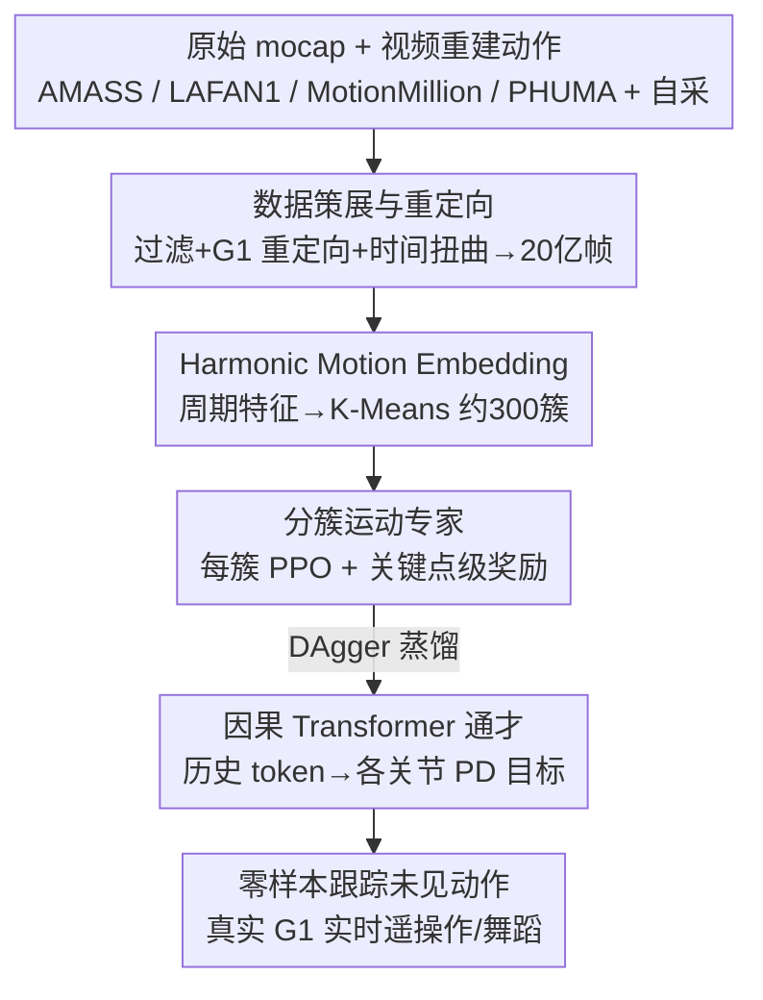

# Humanoid Generative Pre-Training for Zero-Shot Motion Tracking

**Conference**: CVPR 2026  
**Paper**: [CVF Open Access](https://openaccess.thecvf.com/content/CVPR2026/html/Qi_Humanoid_Generative_Pre-Training_for_Zero-Shot_Motion_Tracking_CVPR_2026_paper.html)  
**Code**: None  
**Area**: Robotics / Embodied AI  
**Keywords**: Humanoid Robots, Whole-Body Motion Tracking, Zero-Shot Generalization, Expert Distillation, Scaling Laws

## TL;DR
This work reformulates humanoid whole-body motion tracking as "GPT-style causal sequence modeling": first, pre-training approximately 300 clustered motion experts via RL on a 2-billion-frame retargeted motion corpus, and then distilling them into a single causal-attention Transformer (Humanoid-GPT) using DAgger. By simultaneously leveraging data and model scale to break the "agility vs. generalization" trade-off, Humanoid-GPT achieves zero-shot tracking of unseen, highly dynamic motions such as dancing, kung-fu, and jumping on a physical Unitree-G1 robot.

## Background & Motivation
**Background**: Humanoid motion tracking aims to convert a reference human motion sequence into low-level control commands for each joint of the robot to enable real-time imitation. Current mainstream approaches employ shallow MLP policies trained on small-scale mocap corpora—common datasets (such as AMASS and LAFAN1) contain trajectories only on the order of $10^4$, totaling about 7.2 million frames.

**Limitations of Prior Work**: The dual deficit in data scale and model capacity forces a persistent failure mode—**a trade-off between agility and generalization**. Trackers capable of tracking highly dynamic and agile motions (e.g., boxing, fast dance steps) well (such as BeyondMimic, ASAP) often collapse on unseen styles, whereas trackers with slightly better generalization (such as TWIST, UniTracker) underfit complex dynamics, resulting in less crisp tracking.

**Key Challenge**: The authors argue that this trade-off is **not inherent** but rather a symptom of "insufficient scale + mismatched training design." However, simply stuffing more motion segments into the same old pipeline does not work. When the scale increases by several orders of magnitude, three questions become critical: (1) What data should be used and how should massive, noisy data be processed? (2) What model architecture fits the "online tracking cannot look into the future" constraint while continuously scaling up? (3) What training recipe can maintain stability when the dataset scales from millions to billions of frames?

**Goal**: To build a unified, online, and general-purpose humanoid motion tracker that achieves both agility and zero-shot generalization simultaneously.

**Key Insight**: Translating the widely validated concept from NLP/CV—"scaling is the most reliable path to generalization"—to humanoid control. Since GPT unlocks emergent capabilities through scale, motion tracking should follow suit. However, to make scaling truly effective, the data, architecture, and training must be redesigned.

**Core Idea**: Re-formulate motion tracking as GPT-style sequence modeling—first train a large set of RL motion experts to cover the dynamics distribution, then **distill them into a single causal Transformer** to perform generative pre-training on a 2-billion-frame (over 200x larger than prior datasets) retargeted corpus.

## Method

### Overall Architecture
Humanoid-GPT is a three-stage pipeline consisting of "data curation → expert training → distillation." **Stage a (Data Curation)**: Aggregate all mainstream mocap sources and self-collected data, retarget them to the 29-DOF joint space of the Unitree-G1, apply strict filtering and time-warping augmentation to obtain a 2-billion-frame G1 motion dataset; meanwhile, use Harmonic Motion Embedding (HME) to cluster the entire corpus into approximately 300 motion clusters. **Stage b (Training Motion Experts)**: Train a specialized RL tracking policy for each cluster using PPO, driven by keypoint-level rewards to align the robot with reference poses while maintaining balance, yielding a "motion prior library" consisting of ~300 high-fidelity experts. **Stage c (Distilling into a Generalist)**: Use DAgger to distill the behaviors of all experts into a single causal Transformer. The current proprioceptive state and reference pose are concatenated into tokens, and a Transformer with causal temporal attention is used to predict the PD target for each joint, supervising the entire history in parallel during a single forward pass. During inference, a queue of historical tokens of length H is maintained, and the output at the last position is taken as the current control target, achieving an end-to-end whole-body control latency of < 1.5ms.

### Key Designs

**1. 2-Billion-Frame Corpus Curation: Scaling Up Tracker Training by 200x**

Previous trackers were confined to small corpora of around 7.2 million frames, which is the root cause of the "agility vs. generalization" trade-off. The authors aggregate all public mocap sources, including AMASS, LAFAN1, MotionMillion, and PHUMA, with large-scale self-collected data into a unified corpus, and then employ an off-the-shelf retargeting framework to map each human motion to the 29-DoF joint space of the Unitree-G1. Two key processing steps are applied: first, **filtering out explicit object interactions** (e.g., sitting on a chair, swimming, climbing stairs) to ensure the motions are compatible with the robot's physical capabilities in empty environments; second, performing **motion time-warping augmentation** (uniformly accelerating/decelerating each sequence) to expand the dataset to approximately 5 times its original size, enriching speed variations and enhancing robustness to motion speeds. This yields 2 billion frames of G1 retargeted tokens, which is over 200x larger than previous tracking datasets. The paper also presents the first system-level evidence: when the model and training set are appropriately scaled up, **video-estimated motions can substantially improve tracking performance**—meaning reliance on expensive in-studio mocap is lifted.

**2. Harmonic Motion Embedding (HME): Measuring and Balancing Motion Diversity via Periodic Features**

More data does not automatically guarantee better generalization—common styles (e.g., walking, standing) dominate large corpora, leaving rare but critical motions drowned out in the long tail. Directly measuring and clustering diversity on raw motions is challenging. The authors propose HME as a representation learning tool. Specifically, several Periodic Autoencoders are first trained on different data splits to extract **joint-wise periodic amplitudes and frequencies** from each sequence. These joint-level harmonic features' mean and standard deviation are aggregated for each sequence to yield a compact HME vector. Finally, K-Means clustering (using pairwise distance as similarity) is applied to all HME embeddings to group the data into approximately 300 motion clusters, each containing roughly 1k–2k sequences. This ensures strong intra-cluster consistency while preserving global coverage. HME also supports quantitative measurement of dataset diversity: on the embedding matrix $X=[x_1,\dots,x_N]^\top$, the covariance matrix $\Sigma$ is computed, defining:

$$\text{gstd} = \exp\Big(\frac{1}{D}\sum_{j=1}^{D}\log\sigma_j\Big), \qquad \text{log-volume} = \frac{1}{2}\log\det(\Sigma+\epsilon I),$$

where $\sigma_j$ is the standard deviation along the $j$-th dimension. A larger value indicates that the data is more broadly and uniformly spread over the latent manifold. Based on this, the authors derive a simple yet powerful conclusion: **diversity and balance are both indispensable**—having diversity without balance still leads to overfitting on high-frequency patterns, while balance without diversity caps the performance upper bound.

**3. Clustered RL Motion Experts: Generating Physically Feasible Motion Priors via Keypoint-Level Rewards**

To provide high-quality supervision for the generalist distillation, one must first obtain a set of experts capable of accurate tracking. For each HME cluster, a PPO policy $\pi: G\times S\mapsto A$ is trained, mapping reference joint poses $g_t=q^{\text{ref}}_t$ and privileged proprioceptive robot states $s^{\text{priv}}_t$ (joint positions/velocities, root angular velocity, projected gravity, previous action) to joint actions $a_t$, which are then converted to torques via PD controllers. The rewards are computed at the **body keypoint level** (position and velocity consistency of key parts such as arms, hips, feet, and pelvis). For each keypoint $k$ at time $t$, given position residual $e^{\text{pos}}_{k,t}$, velocity residual $e^{\text{vel}}_{k,t}$, and rotation error $\theta_{k,t}$ induced by the SO(3) log map, alongside weight $w_k$ and scaling factors, the reward is defined as:

$$R_{\text{kpt}}(t)=R_{\text{pos}}+R_{\text{rot}}+R_{\text{vel}}+R_{\text{penal}},\quad R_{\text{pos}}(t)=\sum_{k\in K} w_k\exp(-\alpha_{\text{pos}}\|e^{\text{pos}}_{k,t}\|_1),$$

The rotation and velocity terms similarly apply soft penalties to deviations using exponential forms, and $R_{\text{penal}}$ contains penalties for self-collision, smoothness, etc. The exponential formulation softly penalizes deviations in position, orientation, and velocity, ensuring both global accuracy and local stability. After training, only **high-fidelity and long-horizon stable** experts are retained to construct a prior library covering heterogeneous motion domains—this is a prerequisite for ensuring the subsequent distillation is not degraded by noise.

**4. Distilling Sequences into a Causal Transformer via DAgger: Compressing Hundreds of Experts into a Single Zero-Shot Generalist**

While individual experts perform exceptionally well within their respective clusters, they deteriorate sharply when encountering out-of-distribution targets. During the distillation phase, DAgger is utilized to consolidate the knowledge of all experts into a single generalist policy $G_\theta$, **reformulating distillation as a sequence modeling problem**. At each timestamp, the proprioceptive state $s_t$ and reference pose $q^{\text{ref}}_t$ are concatenated to form token embedding $e_t$. A sequence of tokens of length $H$, $\{e_{t-H+1},\dots,e_t\}$, is fed into a Transformer with a **temporal causal mask** to capture long-range dependencies and temporal consistency. Following a single forward pass, the actions at all output positions are supervised using the historical outputs of the corresponding teacher, with the loss calculated using SmoothL1:

$$\hat{a}_{t-H+1:t}=\bigcup_{t_i\in T}\operatorname{concat}_{k\in[-H+1,0]} t_i(s^{\text{priv.}}_{t-k},g_{t-k}),\quad l=L(G_\theta(e_{t-H+1:t}),\hat{a}_{t-H+1:t}).$$

This design simultaneously leverages two strengths of the Transformer: **parallel sequence supervision** (supervising the entire history in a single forward pass, which is far more efficient than training Transformers using standard PPO in HumanPlus) and **autoregressive temporal prediction**. Because tokens at different positions attend to different historical lengths, the model implicitly learns "position-independent temporal prediction"—delivering stable, physically consistent control targets even at the beginning of an episode where historical information is scarce. The causal mask also naturally aligns with the online deployment constraint of "cannot look into the future during testing," which is precisely why it scales better with size compared to non-causal modeling and capacity-limited MLPs.

## Key Experimental Results

### Main Results
The evaluation is performed in MuJoCo for simulation and on a 29-DoF Unitree-G1 for real-world testing. Metrics: tracking success rate SR (percentage of non-falling trajectories), mean per-joint position error MPJPE (rad), joint velocity error MPJVE (rad/s), root linear velocity error RootVelErr (m/s), and mean per-keypoint position error MPKPE (mm). The test set consists of the AMASS-test split (unseen during training) in a completely zero-shot manner.

| Backbone | Training Tokens | Parameter Count | SR ↑ | MPJPE ↓ | MPJVE ↓ | RootVelErr ↓ | MPKPE ↓ |
|----------|-----------|--------|------|---------|---------|--------------|---------|
| MLP (3 layers) | 2M | 0.25M | 76.89 | 0.1191 | 0.6081 | 0.2304 | 100.49 |
| TCN (8 layers) | 2M | 0.65M | 81.48 | 0.0885 | 0.5716 | 0.2266 | 79.75 |
| Humanoid-GPT-S | 2M | 5.7M | 83.26 | 0.0853 | 0.5492 | 0.2049 | 62.65 |
| Humanoid-GPT-S | 20M | 5.7M | 86.02 | 0.0802 | 0.5210 | 0.1868 | 46.49 |
| Humanoid-GPT-B | 200M | 22.1M | 88.27 | 0.0793 | 0.5076 | 0.1820 | 44.78 |
| Humanoid-GPT-B | 2B | 22.1M | 90.43 | 0.0768 | 0.4891 | 0.1756 | 41.49 |
| Humanoid-GPT-L | 2B | 80.4M | **92.58** | **0.0735** | **0.4820** | 0.1785 | **40.99** |

On four unseen physical G1 dance sequences, Humanoid-GPT-B consistently outperforms GMT, TWIST, and Any2Track in terms of MPJPE/MPJVE (for instance, on "Can Do Can Go!", MPJPE of 0.0974 vs. 0.1087 for GMT / 0.1253 for TWIST), and the physical results closely match the simulation, demonstrating robust zero-shot sim-to-real transfer.

### Ablation Study
Table 2 itself is a joint ablation of "data scale × model scale × architecture", which can be interpreted as:

| Comparison | Key Change | Description |
|------|---------|------|
| MLP/TCN → Transformer (all at 2M tokens) | SR 76.9/81.5 → 83.3, MPKPE 100 → 63 | The architecture alone creates a gap; MLP/TCN can only handle short-range dynamics, yielding poor long-term consistency. |
| GPT-S Data 2M → 20M | SR 83.3 → 86.0, MPKPE 62.6 → 46.5 | Scaling up data alone brings a significant performance boost. |
| GPT-B Data 200M → 2B | SR 88.3 → 90.4 | Scaling up data further for the same model continues to yield benefits. |
| GPT-B → GPT-L (all at 2B tokens) | SR 90.4 → 92.6 | Scaling up the model alone further improves performance, showing no early saturation. |

### Key Findings
- **A clear scaling law exists for humanoid motion tracking**: Simultaneously scaling up data and model capacity monotonically improves SR, MPJPE, and MPKPE. Importantly, MLP and TCN saturate early, whereas the Transformer does not—making architecture a prerequisite to unlocking scaling benefits.
- **Diversity and balance are both indispensable**: In the HME space, the log-volume of the curated dataset in this work is about 4–5 higher than that of AMASS, showing a significantly wider latent coverage. Diversity without balance still overfits high-frequency patterns, while balance without diversity caps the capability ceiling.
- **Video-estimated motions are usable**: When model and data scales are sufficiently large, video-reconstructed motions can substantially boost tracking, lifting the reliance on expensive in-studio mocap.
- **Scaling does not sacrifice real-time performance**: With an ONNX + TensorRT + C++ streaming pipeline, the end-to-end latency is < 1.5ms (on a single RTX 4090), which is about 5x faster than TWIST.

## Highlights & Insights
- **Translating control into GPT pre-training**: Utilizing a causal Transformer with DAgger for parallel sequence supervision not only complies with the online constraint of "cannot look into the future" but also supervises the entire history in a single forward pass, unifying training efficiency with deployment constraints—the definitive answer to "why a Transformer instead of a larger MLP."
- **HME is a highly transferable tool**: Structuring motion embeddings through the joint-level amplitudes and frequencies of a Periodic Autoencoder enables both clustering/grouping and quantitative measurement of dataset diversity via gstd and log-volume. This approach of "mapping motions to a periodic feature space before measuring distributions" can be transferred to any motion/sequential dataset requiring balanced sampling.
- **Emergence of position-independent temporal prediction**: Because tokens at different positions observe histories of varying lengths during training, the model implicitly learns to generate stable control even at the very beginning of an episode when historical information is scarce—bringing "free" robustness from sequence modeling that is worth replicating in other online control tasks.
- **Breaking the agility-generalization trade-off via "expert library + generalist distillation"**: Clustered experts ensure each motion is tracked accurately (agility), while distilling them into a single policy ensures cross-domain generalization, escaping the dilemma of forcing a single policy to balance both agility and generalization simultaneously.

## Limitations & Future Work
- The authors acknowledge that currently only kinematic/proprioceptive states are utilized as inputs. Richer modalities (contact forces, vision, language) will need to be incorporated in the future.
- During the data curation phase, **object-interaction motions are explicitly filtered out** (such as sitting, swimming, and climbing stairs). Therefore, the current system only covers whole-body movements in open, empty environments and does not support human-object interaction—marking a clear boundary in its applicability.
- Evaluations are primarily conducted on the AMASS-test split and a few dancing/teleoperation scenarios, lacking systematic evaluations against real-world robustness challenges such as terrain variations, external forces, or payloads. The physical robot quantitative table contains only four dance sequences, which is a relatively small sample size.
- Future work mentions coupling the model with long-horizon planning or VLA-style instructions toward more general embodied foundation models—implying that the current Humanoid-GPT still only "tracks a given reference" and does not make high-level decisions.

## Related Work & Insights
- **vs. SONIC**: Also takes a scaling path (100M frames) but employs an MLP controller, leading to capacity saturation as data scales. In contrast, this work uses a Transformer with 2B frames; the architecture does not saturate, fully benefiting from scaling.
- **vs. HumanPlus**: Similarly uses a Transformer controller but trains it via standard PPO, missing out on the parallel-supervision advantages of Transformers. This work uses DAgger sequence distillation, which supervises the entire history in parallel in a single forward pass.
- **vs. GMT / UniTracker**: GMT utilizes MoE + adaptive sampling, and UniTracker relies on a CVAE teacher-student framework to expand coverage, yet both are constrained by limited motion scales. This work treats scale as a first-class citizen and addresses the "diversity $\neq$ balance" long-tail problem via HME.
- **vs. BeyondMimic / TWIST**: The former is agile but generalizes poorly to zero-shot scenarios, while the latter generalizes well but struggles with highly dynamic movements—precisely the trade-off this paper aims to resolve. Humanoid-GPT demonstrates that this trade-off stems from insufficient scale and mismatched design rather than being inherent.

## Rating
- Novelty: ⭐⭐⭐⭐⭐ First work to distill hundreds of RL experts into a GPT-style causal tracker and systematically characterize the scaling laws of humanoid tracking.
- Experimental Thoroughness: ⭐⭐⭐⭐ Solid joint-scaling analysis across data, model, and architecture, with credible real-world deployment. However, physical quantitative samples are scarce, and assessments for disturbance robustness are missing.
- Writing Quality: ⭐⭐⭐⭐ Clear three-stage pipeline and logical motivators, with robust analyses of HME and scaling laws.
- Value: ⭐⭐⭐⭐⭐ Provides a highly reproducible "scale + distillation" roadmap for general whole-body control, with the zero-shot physical dancing experiments delivering a powerful impact.

<!-- RELATED:START -->

## Related Papers

- [\[ICML 2026\] LIMMT: Less is More for Motion Tracking](../../ICML2026/robotics/limmt_less_is_more_for_motion_tracking.md)
- [\[CVPR 2026\] TrajRAG: Retrieving Geometric-Semantic Experience for Zero-Shot Object Navigation](trajrag_retrieving_geometric-semantic_experience_for_zero-shot_object_navigation.md)
- [\[CVPR 2026\] Towards Motion Turing Test: Evaluating Human-Likeness in Humanoid Robots](towards_motion_turing_test_evaluating_human-likeness_in_humanoid_robots.md)
- [\[CVPR 2026\] InternData-A1: Pioneering High-Fidelity Synthetic Data for Pre-training Generalist Policy](interndata-a1_pioneering_high-fidelity_synthetic_data_for_pre-training_generalis.md)
- [\[CVPR 2026\] Iterative Closed-Loop Motion Synthesis for Scaling the Capabilities of Humanoid Control](iterative_closed-loop_motion_synthesis_for_scaling_the_capabilities_of_humanoid_.md)

<!-- RELATED:END -->
