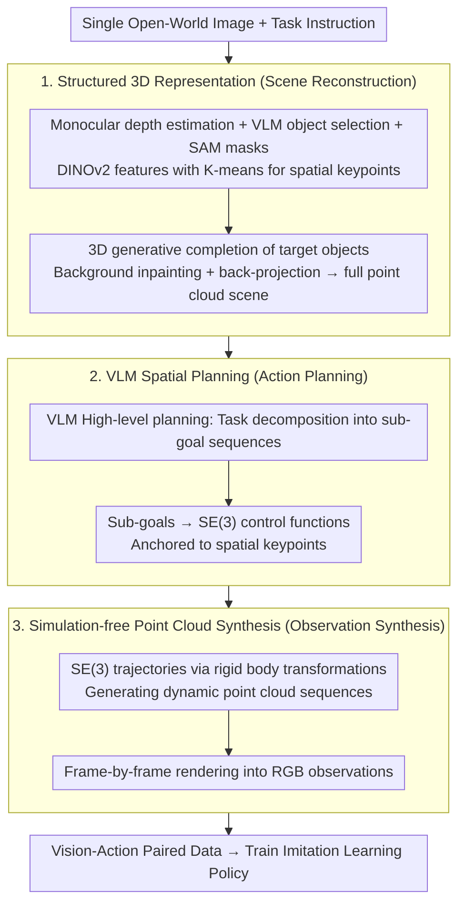

# IGen: Scalable Data Generation for Robot Learning from Open-World Images

**Conference**: CVPR 2026  
**arXiv**: [2512.01773](https://arxiv.org/abs/2512.01773)  
**Code**: [https://chenghaogu.github.io/IGen/](https://chenghaogu.github.io/IGen/)  
**Area**: Robotics  
**Keywords**: Robot learning, Data generation, Open-world images, Visuomotor policy, 3D reconstruction

## TL;DR
IGen starts from a single open-world image and automatically generates large-scale vision-action training data through a pipeline of 3D scene reconstruction → VLM task planning → SE(3) action generation → point cloud synthesis → frame rendering. Policies trained solely on this generated data can successfully perform real-world manipulation tasks.

## Background & Motivation
1. **Background**: General-purpose robot policies require large-scale vision-action paired data, but real-world data collection is expensive and limited to specific environments.
2. **Limitations of Prior Work**: Real-to-Sim methods require explicit reconstruction of physical workspaces; video generation methods cannot provide explicit actions and perform poorly on complex long-horizon tasks.
3. **Key Challenge**: Open-world images are extremely rich and diverse but lack robot-related action information, making them unsuitable for direct policy learning.
4. **Goal**: Automatically generate grounded vision-action data from unstructured open-world images.
5. **Key Insight**: Convert 2D pixels into structured 3D representations, then leverage VLMs for task planning and action generation.
6. **Core Idea**: Image → 3D point cloud + keypoints → VLM high-level planning + low-level control → SE(3) trajectories → point cloud sequence synthesis → frame rendering.

## Method

### Overall Architecture
IGen addresses the core question: how can a common open-world image (e.g., a random desktop photo) without any robot action information be transformed into vision-action data for policy training. The approach "elevates" a static 2D image into an actionable 3D workspace, allows a VLM to plan an action trajectory within this space, and finally synthesizes continuous observation frames along the trajectory. The pipeline is divided into three stages: scene reconstruction (structured 3D representation) → action planning (VLM spatial planning) → observation synthesis (simulation-free point cloud synthesis). The data flow is: single image → 3D point cloud + spatial keypoints → VLM high-level plans + low-level SE(3) trajectories → rigid body transformations for dynamic point cloud sequences → frame-by-frame rendering into RGB. This process avoids building physical simulation workspaces, relying instead on geometric reconstruction and point cloud manipulation.

### Key Designs

**1. From Pixels to Structured 3D Representation: Elevating static images into actionable workspaces**

Planning directly on 2D images is infeasible as robot actions occur in 3D space, and 2D pixels lack depth and grasp points. IGen first estimates the depth of the entire image using a monocular geometric foundation model, uses a VLM to identify task-relevant objects, and applies SAM for object masking. Within the masks, DINOv2 features are extracted and clustered via K-means to obtain **spatial keypoints** that serve as anchors for actions. To handle occlusions, the target object's full shape is completed using a 3D generative model, while background regions are filled via image inpainting before back-projection. This results in an interactive scene with closed foreground objects and a complete background rather than a simple depth-mapped "flat sheet."

**2. VLM-based Spatial Planning: Grounding language instructions into specific 3D poses**

With the 3D scene established, the system must determine the robot's movement. IGen feeds the scene context and task description to a VLM to produce a high-level plan (e.g., a sequence of sub-goals like "grasp → move → place"), which is then mapped to low-level SE(3) sequences for the end-effector. The previously clustered spatial keypoints serve as anchors, allowing the VLM to bind actions to specific geometric points in the scene rather than predicting coordinates in a vacuum. VLMs are utilized for their ability to ground natural language instructions into scene semantics, enabling them to handle complex spatial reasoning like "place the cup to the left of the plate."

**3. Simulation-free Point Cloud Synthesis: Replacing physics engines with rigid body transformations**

The final step is to convert the planned trajectories into observable sequences. Traditional Real-to-Sim approaches require building a full physical simulation environment. IGen bypasses this by treating the SE(3) trajectories as rigid body motions applied incrementally to the object point clouds. This generates a dynamic point cloud sequence representing the manipulation, which is rendered frame-by-frame into RGB. Since the object's shape remains constant while its pose changes, rigid body transformations effectively represent most pick-and-place actions. This method is far lighter than running a physics engine and relaxes rendering requirements, as long as the observations remain visually consistent and geometrically aligned with the actions.

### A Complete Example

Using a desktop photo with the instruction "place the red cup into the plate": ① A monocular depth model estimates the depth, the VLM identifies the "cup" and "plate," SAM extracts masks, and DINOv2+K-means identifies keypoints on the cup (e.g., rim, body). The cup and plate shapes are completed via 3D generation, and the table background is inpainted and back-projected to establish the 3D scene. ② The VLM provides a high-level plan: "grasp cup → move above plate → release," expanding this into a series of SE(3) poses anchored at the cup's keypoints. ③ Rigid body transformations are applied to the cup's point cloud along these SE(3) trajectories, generating a sequence of the cup moving toward the plate, which is then rendered into RGB. The result is "image observation + corresponding action" paired data ready for imitation learning.

### Loss & Training
The generated vision-action data is treated as standard demonstration data to train standard imitation learning policies (e.g., ACT, DP3) using the standard behavior cloning loss, without additional training tricks.

## Key Experimental Results

### Main Results

| Evaluation Dimension | Metric | IGen | TesserAct | Cosmos | Description |
|----------------------|--------|------|-----------|--------|-------------|
| Visual Fidelity | Consistency Score | High | Medium | Low | Closer to real-world |
| Action Quality | Instruction Following + Physics Alignment | Best | Strong | Poor | More reasonable actions |
| Policy Transfer | Success Rate in Real-world Tasks | Comparable/Superior to Real Data | - | - | Purely synthetic data is effective |

### Ablation Study

| Configuration | Key Metric | Description |
|---------------|------------|-------------|
| Full IGen | Best | Complete pipeline |
| w/o 3D Reconstruction | Significant Drop | 3D understanding is foundational |
| w/o Spatial Keypoints | Drop | Keypoints provide spatial anchoring |
| 2D Generation Replacement | Drop | 2D methods lack physical grounding |

### Key Findings
- Policies trained solely on IGen-generated data successfully execute manipulation tasks in the real world without any real-world collection.
- In some scenarios, policies trained on IGen data outperform those trained on real data, likely due to higher scene diversity.
- Compared to video generation methods, IGen produces actions that are more physically consistent and show higher instruction-following fidelity.

## Highlights & Insights
- **"Image as data source"**: The concept of leveraging internet images as the primary resource for robot data is highly compelling.
- **Simulation-free synthesis**: This avoids the most time-consuming bottleneck of traditional Real-to-Sim pipelines—the construction of simulation environments.
- **3D representation + VLM planning**: This combination provides physical grounding while remaining lightweight.

## Limitations & Future Work
- Dependency on monocular depth estimation; accuracy is limited by the foundation model.
- The rigid body motion assumption limits modeling of deformable or fluid manipulations.
- Insufficient modeling of complex physical interactions, such as contact force feedback.

## Related Work & Insights
- **vs RoLA**: While RoLA also generates data from open images, it relies on physical property estimation and is limited to simple interactions. IGen supports more complex tasks through VLM planning.
- **vs TesserAct/Cosmos**: Video generation-based methods lack explicit actions; IGen provides complete vision-action pairs.

## Rating
- Novelty: ⭐⭐⭐⭐⭐ The full pipeline from open-world images to robotic data is a novel contribution.
- Experimental Thoroughness: ⭐⭐⭐⭐ Evaluated across three dimensions with real-world validation.
- Writing Quality: ⭐⭐⭐⭐ Clear pipeline description and comprehensive comparisons.
- Value: ⭐⭐⭐⭐⭐ Potential to fundamentally change how data is acquired for robotics.

<!-- RELATED:START -->

## Related Papers

- [\[CVPR 2026\] Video2Robo: 3DGS-based Synthetic Data from One Video Enables Scalable Robot Learning](video2robo_3dgs-based_synthetic_data_from_one_video_enables_scalable_robot_learn.md)
- [\[CVPR 2026\] CoMo: Learning Continuous Latent Motion from Internet Videos for Scalable Robot Learning](como_learning_continuous_latent_motion_from_internet_videos_for_scalable_robot_l.md)
- [\[CVPR 2026\] Scalable Trajectory Generation for Whole-Body Mobile Manipulation](scalable_trajectory_generation_for_whole-body_mobile_manipulation.md)
- [\[CVPR 2026\] RoboWheel: A Data Engine from Real-World Human Demonstrations for Cross-Embodiment Robotic Learning](robowheel_a_data_engine_from_real-world_human_demonstrations_for_cross-embodimen.md)
- [\[CVPR 2026\] PvP: Data-Efficient Humanoid Robot Learning with Proprioceptive-Privileged Contrastive Representations](pvp_data-efficient_humanoid_robot_learning_with_proprioceptive-privileged_contra.md)

<!-- RELATED:END -->
