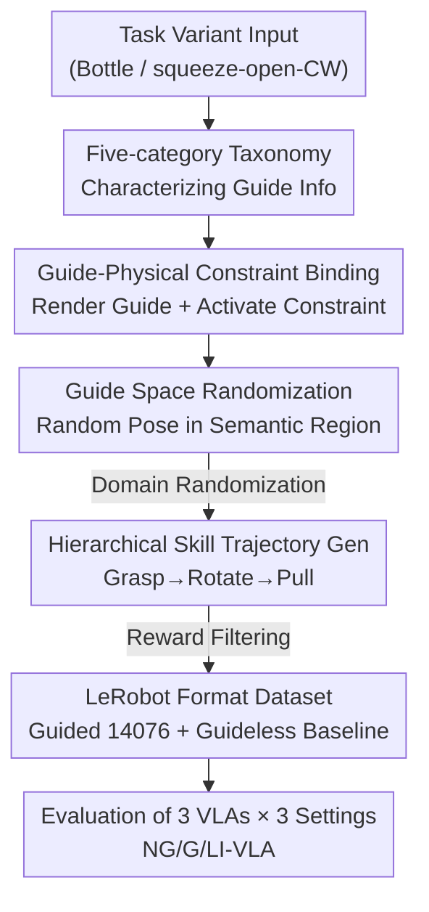

# INSIGHT Bench: Towards Grounded IN-SItu Guidance for Robotic Manipulation

**Conference**: CVPR 2026  
**Paper**: [CVF Open Access](https://openaccess.thecvf.com/content/CVPR2026/html/Kim_INSIGHT_Bench_Towards_Grounded_IN-SItu_Guidance_for_Robotic_ManipulaTion_CVPR_2026_paper.html)  
**Area**: Robotics / Embodied AI  
**Keywords**: Robotic manipulation, VLA, in-situ guidance, benchmark, physical constraints

## TL;DR
Addressing the gap where current VLA models follow external language instructions but fail to understand in-situ symbols like "PUSH/PULL/Arrows/Squeeze" printed on objects, this paper proposes INSIGHT Bench—a robotic manipulation benchmark that programmatically binds in-situ visual guidance with physical constraints. It features a five-category guidance taxonomy, a scalable automated data generation pipeline, and a dataset of 14,076 trajectories, revealing that π0, GR00T N1.5, and SmolVLA generally fail to stably ground such in-situ guidance.

## Background & Motivation

**Background**: Robotic manipulation has progressed significantly with Vision-Language-Action (VLA) models. Models like π0, GR00T, and SmolVLA leverage web-scale pre-training to map **external language instructions** such as "open the drawer" or "push the door open" into generalizable actions.

**Limitations of Prior Work**: When interacting with objects, humans rely heavily on **text and symbols printed on the objects themselves**—"PUSH/PULL" on doors, "push down while turning" icons on child-proof caps, or arrows indicating rotation direction. These in-situ guides are concise, visually consistent, and tightly coupled with physical affordances (twisting, pressing, pulling). However, existing VLAs almost entirely ignore this information, leading to frequent failures in symbol-dense daily environments.

**Key Challenge**: Previous visual prompting and goal-image methods provide **externally supplied** visual context, whereas in-situ guidance is **physically attached to the object** and directly encodes affordance—the two are fundamentally different, and the former cannot capture the latter. Crucially, this capability has remained **unmeasurable**: without a standard benchmark, the community cannot determine if existing models can read in-situ guidance or where they fall short.

**Goal**: ① Formalize the "in-situ guidance grounding" task and provide a taxonomy; ② Create a benchmark and scalable data generation framework that programmatically binds visual guidance with physical constraints; ③ Systematically evaluate existing VLAs to locate their true bottlenecks.

**Key Insight**: The authors view in-situ guidance as a form of "asynchronous human intent"—designers carve operational knowledge directly onto objects, removing the need for a human-in-the-loop. The core question becomes: can models translate visual symbols on objects into physically constrained actions?

**Core Idea**: Use "guide-conditioned physical constraints" to transform the task from simple visual pattern matching into **causal reasoning**. For example, a medicine bottle cap's revolute joint is locked by default and only unlocks when a "squeeze" force is applied. Thus, successfully rotating the joint becomes sufficient evidence that the model "understood the guide."

## Method

### Overall Architecture
INSIGHT Bench is essentially "a taxonomy + a simulation benchmark + an automated data generation pipeline." It first characterizes the types of information conveyed by in-situ guides through a five-category taxonomy, then builds three major tasks (Cabinet / Door / Bottle) in NVIDIA Isaac Lab, programmatically **binding each visual guide to its corresponding physical constraint**. An automated skill-based pipeline generates two sets of trajectory data (Guided/Guideless). Finally, three mainstream VLAs are evaluated under three fine-tuning settings (NG-VLA / G-VLA / LI-VLA) to locate specific failures in grounding.

The data generation pipeline (the core contribution of the benchmark) flows as follows:

### Key Designs

**1. Five-category In-situ Guidance Taxonomy: Defining object-printed information**

Previously, no systematic framework existed for the types of information carried by in-situ guides. This paper breaks it down into five categories: ① **Contact Affordance**—indicating which part to interact with (e.g., "PUSH" on a panel, arrows pointing to buttons); ② **In-Part Contact Specification**—specifying precise contact methods/locations on a known part (e.g., points to press on a cap to unlock it); ③ **Action Directional**—constraining the execution direction and action space (rotation arrows, push/pull signs); ④ **Procedural Guidance**—specifying a sequence of steps ("turn handle then pull"); ⑤ **Target Disambiguation**—identifying the target when multiple interactive parts exist (e.g., labeling only the top drawer). This taxonomy serves as the backbone: tasks are designed to **isolate and test specific information types**.

**2. Guide-Conditioned Physical Constraint Binding: Forcing symbols into physical locks**

If symbols are merely rendered without physical consequences, models might ignore them and succeed via brute force. This paper pairs guides with **programmatically activated physical constraints**. For a given episode, a high-level task and sub-task (e.g., Bottle: squeeze then CW open) are sampled. The corresponding visual guide is rendered, and the associated constraint is **programmatically activated**. In a Bottle-Squeeze scenario, the cap's revolute joint remains locked unless the end-effector applies a squeeze force. Success is defined as "target joint exceeding a threshold." Since the joint cannot rotate without first satisfying the guide's constraint, success serves as proof of grounding.

**3. Guide Space Randomization: Forcing models to "find and read" rather than memorize**

To ensure models do not simply learn spatial layouts, the authors **decouple semantic content from placement**. A semantic region (e.g., the top of a cap) is defined, and the guide's pose is **programmatically sampled** within this region, supplemented by general domain randomization (asset pose, mass, friction). Models must actively locate and reason about the guide's content.

**4. Hierarchical Skill-based Trajectory Generation: Scalable 14k trajectory generation**

To avoid the poor scalability of teleoperation, an automated **hierarchical, skill-based** pipeline is used. High-level tasks are fixed sequences of parameterized skills (e.g., GRASP→ROTATE→PULL). Skill parameters $\theta_i$ are instantiated based on simulation states (e.g., identifying the target handle link). The skill library $\mathcal{S}=\{\textsc{Grasp}(\cdot),\textsc{Rotate}(\cdot),\textsc{Pull}(\cdot)\}$ includes: $\psi_{grasp}(p,q)$ moves the end-effector to a target pose; $\psi_{rot}(\phi)$ rotates $\phi$ radians around the local z-axis; $\psi_{pull}(d)$ translates $d$ along the forward axis. Skills are executed via the CuRobo motion planner and joint-level PID. A trajectory is represented as:

$$\zeta=\{(o_t,a_t,r_t)\}_{t=0}^{T}$$

Where $o_t$ includes proprioception and visual input, $a_t\in\mathbb{R}^8$ is the target joint position and gripper command, and $r_t$ is a sparse reward.

## Key Experimental Results

### Main Results

| Model | NG-VLA | G-VLA | LI-VLA |
|------|--------|-------|--------|
| π0 | 12.1% | 14.1% | 18.5% |
| GR00T N1.5 | 17.2% | 18.5% | 24.3% |
| SmolVLA | 10.1% | 7.4% | — |

Two core findings: **G-VLA shows no significant Gain over NG-VLA**, suggesting models do not effectively ground the visual semantics of guides. Conversely, **LI-VLA significantly outperforms both**, indicating that the failure is not in physical execution (squeezing/rotating/pulling) but strictly in **perception and understanding**.

### Key Findings
- **Bottleneck is "Reading" not "Execution"**: LI-VLA's superiority proves models can perform the physical actions; they simply cannot interpret the symbols on the objects.
- **Information Type Dictates Success**: Models learn simple target disambiguation (Cabinet) from visual guides but fail on procedural, directional, and in-part contact information.
- **Heavy Reliance on VLM Backbone**: Success in complex tasks (Door / Bottle-Squeeze) relies heavily on the grounding capabilities of the underlying VLM (e.g., Eagle-2.5 in GR00T).
- **Real-world Consistency**: Real-world fine-tuning on GR00T mirrored simulation trends (LI-VLA 65% vs G-VLA 45% on Bottle-Std), confirming that the grounding challenge persists in reality.

## Highlights & Insights
- **The "Guide-Physical Constraint Binding" is the most ingenious aspect**: It transforms visual recognition into a hard physical requirement, where the success criterion naturally prevents "cheating."
- **Clean Contrastive Design**: By feeding the same information via "None / Visual / Language," the study isolates the perception bottleneck from action execution.
- **Automated Skill-based Pipeline**: Generates 14k trajectories with per-frame skill labels without human teleoperation, providing a ready-made playground for hierarchical strategy research.
- **Counter-intuitive Insight**: Language instructions are not always superior—for target disambiguation, visual guides provide a clearer signal than language.

## Limitations & Future Work
- **Diagnostic Benchmark Only**: The paper exposes the failure of VLAs to ground in-situ guidance but does not propose a new model architecture to solve it.
- **Low Overall Success Rate**: Even the best LI-VLA reaches only 24.3%, suggesting interference from factors like motion planning or contact detection.
- **Limited Asset Diversity**: Only 12 icons and 20 text assets are used, which does not capture the full variety (fonts, wear, multi-language) of real-world guides.
- **Future Directions**: Exploring end-to-end training of VLM guidance parsing with action policies or designing "symbol-region attention" modules.

## Related Work & Insights
- **vs. Visual Prompting / Goal-image**: These provide external context, whereas this work focuses on object-centric, physically attached guides encoding in-situ affordances.
- **vs. Navigation Sign Understanding**: Previous work used signs for localization; this work shifts to **fine-grained manipulation** based on local object guides.
- **vs. Manipulation Benchmarks (LIBERO, CALVIN, etc.)**: These rely on external instructions or demonstrations. INSIGHT Bench adds the missing dimension of grounding in-situ guides into physically constrained actions.

## Rating
- Novelty: ⭐⭐⭐⭐⭐ 
- Experimental Thoroughness: ⭐⭐⭐⭐ 
- Writing Quality: ⭐⭐⭐⭐ 
- Value: ⭐⭐⭐⭐⭐ 

<!-- RELATED:START -->

## Related Papers

- [\[CVPR 2026\] Language-Grounded Decoupled Action Representation for Robotic Manipulation (LaDA)](lada_robotic_manipulation.md)
- [\[CVPR 2026\] Localizing, Structuring, and Rendering: Bridging 3D and 2D Vision-Language-Action Models for Robotic Manipulation](localizing_structuring_and_rendering_bridging_3d_and_2d_vision-language-action_m.md)
- [\[CVPR 2025\] RoboGround: Robotic Manipulation with Grounded Vision-Language Priors](../../CVPR2025/robotics/roboground_robotic_manipulation_with_grounded_vision-language_priors.md)
- [\[CVPR 2026\] Action-Sketcher: From Reasoning to Action via Visual Sketches for Robotic Manipulation](action-sketcher_from_reasoning_to_action_via_visual_sketches_for_robotic_manipul.md)
- [\[CVPR 2026\] Hoi! - A Multimodal Dataset for Force-Grounded, Cross-View Articulated Manipulation](hoi_-_a_multimodal_dataset_for_force-grounded_cross-view_articulated_manipulatio.md)

<!-- RELATED:END -->
