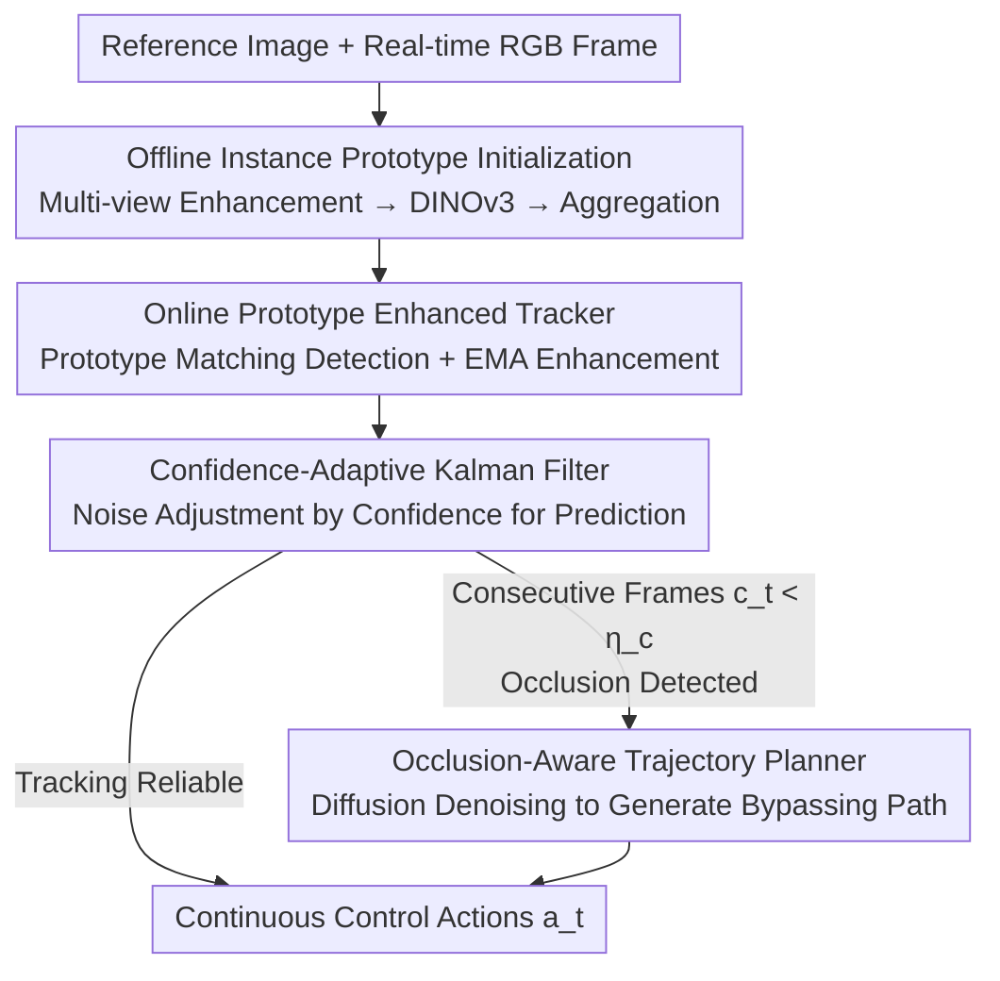

# Instance-level Visual Active Tracking with Occlusion-Aware Planning

**Conference**: CVPR 2026  
**arXiv**: [2604.21453](https://arxiv.org/abs/2604.21453)  
**Code**: https://github.com/SHWplus/OA-VAT (Available)  
**Area**: Visual Active Tracking / Embodied AI / UAV Perception  
**Keywords**: Active Visual Tracking, Instance-level Discrimination, Occlusion Recovery, Diffusion Policy Planning, Prototype Matching

## TL;DR
OA-VAT constructs discriminative "instance prototypes" offline from a single reference image to resist similar distractors. It utilizes online EMA-enhanced prototypes and confidence-adaptive Kalman filtering to maintain stable tracking, while training a target-box-conditioned diffusion trajectory planner to actively bypass obstacles and recover the target upon occlusion—achieving an average SR of 0.93 on UnrealCV, 90.8% average CAR on real images, and 81.6% TSR on real UAVs, reaching 35 FPS on an RTX 3090.

## Background & Motivation
**Background**: Visual Active Tracking (VAT) requires an agent to control a camera or UAV in real-time to follow a target in 3D space, which is applied in scenarios such as UAV videography and security patrolling. Mainstream approaches are divided into two categories: Reinforcement Learning (RL), which maps pixels directly to actions end-to-end (low latency but sparse rewards, reliance on simulation, and sim-to-real gaps), and pipeline methods, which decouple perception and control by using pre-trained vision models for perception (better generalization and easier deployment).

**Limitations of Prior Work**: Even deployable pipeline methods suffer from two major flaws in real-world scenarios. The first is a **lack of instance-level discrimination**; real scenes often contain multiple similar distractors (e.g., a crowd of people, a row of cars), whereas most VAT methods operate at the category level and fail to distinguish "the specific target," leading to tracking errors. The second is the **absence of active occlusion handling**; most pipelines use simple controllers like PID that merely center the target in the frame. Once the target is blocked by an obstacle, the agent loses it and stays stationary instead of actively bypassing the obstacle to re-establish visual contact.

**Key Challenge**: The perception end requires "instance-level discriminative power," but the raw features of general vision foundation models (Grounding-DINO, SAM, DINOv3) are category-level and insufficient to distinguish instances of the same class. The control end requires "active recovery under occlusion," but expert trajectories for such recovery are almost non-existent in the real world, making it difficult to train an obstacle-avoiding policy without data.

**Goal**: To simultaneously address "similar instance discrimination" and "active occlusion recovery" within a unified pipeline that is lightweight, real-time, and ready for deployment on real hardware.

**Key Insight**: The authors observe that while single-view foundation model features lack discrimination, **aggregating multi-view enhanced features** into a prototype can push different instances further apart in the feature space (with theoretical guarantees). To address the lack of expert data for occlusion recovery, the authors **synthesize occlusion trajectories in simulation** and use the **target box instead of visual appearance** as the planning condition. This decouples the policy from specific targets and allows zero-shot generalization to unseen objects.

**Core Idea**: Use "offline multi-view prototypes + online prototype enhancement/Kalman filtering" to solve instance discrimination and stable tracking, and a "target-box-conditioned diffusion trajectory planner" to solve active recovery under occlusion.

## Method

### Overall Architecture
OA-VAT is a serial pipeline consisting of three modules. **Offline Phase**: Given a single target reference image, multi-view enhancement and segmentation are performed to extract the target; DINOv3 features are then extracted and aggregated into a discriminative "instance prototype." **Online Phase**: If the target is not yet locked, cosine similarity matching between the prototype and all candidates in the current frame is used for detection. Once locked, a low-level tracker performs frame-by-frame localization, while the prototype is enhanced online via EMA and target motion is predicted using a confidence-adaptive Kalman filter. **Occlusion Phase**: When the tracker is unreliable for consecutive frames (target occluded), the predicted target box from the Kalman filter serves as a condition to trigger the diffusion trajectory planner, generating an obstacle-bypassing recovery path to guide the agent to a position where the target can be seen again. The input includes RGB frames and one reference image, and the output consists of continuous control actions $a_t=[v_f, v_l, v_v, \omega_y]^T$ (forward/lateral/vertical linear velocities + yaw).

### Key Designs

**1. Instance-level Offline Prototype Initialization: Pushing "Intra-class Instances" Apart via Multi-view Aggregation**

The limitation is that foundation model features are only discriminative at the category level, causing the raw features of similar targets to overlap and lead to confusion during tracking. OA-VAT constructs a prototype from a single reference image **without training**: it first applies horizontal/vertical flip enhancement (since human appearance varies significantly with viewpoint, additional views are generated using a diffusion model). A set of target crops $\tilde{\mathbf{I}}=\{\tilde{\mathcal{I}}_{ref}, \tilde{\mathcal{I}}_1, \dots, \tilde{\mathcal{I}}_N\}$ is segmented via YOLO-E, features $\mathbf{f}_{ref}, \mathbf{f}_i$ are extracted via DINOv3 with global average pooling, and finally, the prototype is obtained by summing the reference feature with the mean of the enhanced features and normalizing:

$$\tilde{\mathbf{f}} = \frac{\mathbf{f}_{ref} + \frac{1}{N}\sum_{i=1}^N \mathbf{f}_i}{\lVert \mathbf{f}_{ref} + \frac{1}{N}\sum_{i=1}^N \mathbf{f}_i \rVert_2}.$$

Mechanism: The authors provide a theoretical guarantee (Proposition 1)—under the assumptions that "multi-view enhanced features cover the true feature manifold better than a single reference feature" and "intra-target cohesion and inter-target separability," the squared distance between any two aggregated instance prototypes is no less than the distance between the original reference features. In other words, aggregation **monotonically increases the instance margin**. t-SNE visualization confirms that aggregated prototypes form clear clusters by instance, whereas raw DINOv3 features overlap significantly. The average cosine similarity margin between the target and distractors increases from 0.08 (DINOv3) to 0.28.

**2. Online Prototype Enhancement + Confidence-Adaptive Kalman Filter: Adapting to Appearance and Reliability**

VAT lacks an initial bounding box, and target appearance and motion change drastically during tracking. In the detection phase (when the box is empty), segmentation yields $M$ candidate masks. Features are extracted and compared with the current prototype $\tilde{\mathbf{f}}'$ via cosine similarity $S(\tilde{\mathbf{f}}', \mathbf{f}_{cand}^i)$. The candidate with the highest similarity exceeding threshold $\eta_s$ is selected as the target to initialize the ORTrack base tracker. Once locked, two enhancements run in parallel: first, **Online Prototype EMA Update** $\tilde{\mathbf{f}}' \leftarrow \beta\tilde{\mathbf{f}}' + (1-\beta)\hat{\mathbf{f}}_{tar}$, which runs in a separate thread to avoid slowing down the main tracking, allowing the prototype to incorporate new viewpoints and maintain discrimination over long sequences.

Second, the **Confidence-Adaptive Kalman Filter**. The state vector $\mathbf{x}_t=[x,y,w,h,\dot{x},\dot{y},\dot{w},\dot{h}]^T$ includes the box and its velocity. The key innovation is modeling the measurement noise covariance $\mathbf{R}_t$ as a function of the tracker confidence $c_t$:

$$\mathbf{R}_t = \sigma^2(c_t)\mathbf{I}, \quad \sigma^2(c_t) = \frac{1}{1 + e^{\lambda(c_t - \gamma)}}.$$

When $c_t$ is higher than $\gamma$, $\sigma^2$ decreases, increasing the Kalman gain $\mathbf{K}_t$ and trust in the observation. When $c_t$ is low, the gain is reduced, favoring the internal state prediction. Mechanism: Low confidence usually implies the box is occluded or drifting. Trusting the observation blindly would lead to errors; instead, reducing the gain allows the filter to extrapolate motion using $\hat{\mathbf{x}}_{t|t-1}=\mathbf{F}\hat{\mathbf{x}}_{t-1|t-1}$ during tracking failures, increasing the probability of re-capturing the target. If no reliable observation occurs for consecutive frames, the planning module is triggered.

**3. Occlusion-Aware Diffusion Trajectory Planner: Box-Conditioned Learning for "Obstacle Bypassing"**

PID controllers only pull the target toward the center of the frame and fail when obstructed. Since expert occlusion trajectories are unavailable in the real world, the authors synthesized the **Planning-20k** dataset in UnrealCV's SimpleRoom: 2D occupancy maps were built with random obstacles, the target was generated on one edge of an obstacle, and the tracker was placed on an adjacent edge to create occlusion (fully visible samples were discarded). Expert trajectories were searched using A* on the occupancy map, covering common occlusion structures (single-side, double-side, and corridor), with randomization of lighting and textures (8k default textures + 12k random textures).

Planning is modeled as a conditional denoising diffusion process $p(\mathbf{A}_t | \mathcal{I}_t, \mathbf{b}_t)$, where trajectory points are denoised from noise $\mathbf{A}_t^K \sim \mathcal{N}(0,\mathbf{I})$ over $K$ steps. **The core difference from Diffusion Policy** is the explicit use of the target box $\mathbf{b}_t$ as an input condition. Diffusion policies using only visual conditions tend to overfit the appearance and texture of specific targets, failing when the target changes. By conditioning on the box, the model focuses on the spatial relationship between "where the target is" and "where the obstacles are," learning physics-based bypassing rules independent of the specific target, thus enabling **zero-shot generalization to unseen objects**. Online, once $c_t < \eta_c$, the predicted box from the Kalman filter is fed to the planner to generate a recovery trajectory.

### Loss & Training
The planner is trained using MSE for noise prediction: $\mathcal{L} = \mathbb{E}_{k,\mathbf{A}_t^0,\bm{\varepsilon}}[\lVert \bm{\varepsilon} - \epsilon_\theta(\mathcal{I}_t, \mathbf{b}_t, \mathbf{A}_t^0 + \bm{\varepsilon}, k)\rVert^2]$, forcing the network to reconstruct the noise added to the ground-truth trajectory. The prototype initialization and online tracker are **completely training-free** (directly using off-the-shelf models like DINOv3, YOLO-E, and ORTrack). Only the diffusion planner requires training—taking 15 hours on a single RTX 3090, compared to 24×H100 for a similar duration for TrackVLA.

## Key Experimental Results

### Main Results
Evaluated **zero-shot** on UnrealCV (3 maps with distractors) and DAT against 12 baselines.

| Benchmark | Metric | OA-VAT | Prev. SOTA | Gain |
|------|------|--------|-----------|------|
| UnrealCV (Distractors, Avg.) | SR | 0.93 | TrackVLA 0.91 | +2.2% |
| UnrealCV (Distractors, Avg.) | AR / EL | 390 / 483 | TrackVLA - / 474 | — |
| UnrealCV (No Distractor, 5 Scenarios) | SR / EL | 1.00 / 500 | Tied with TrackVLA | — |
| DAT (6 Scenarios Avg.) | CR | 321 | GC-VAT 242 | +32.6% |
| DAT (6 Scenarios Avg.) | TSR | 0.86 | GC-VAT 0.72 | +19.4% |
| Real Images (VOT/DTB70/UAVDT Avg.) | CAR | 90.8% | GC-VAT 78.7% | +12.1% |
| DJI Tello Real UAV | TSR | 81.6% | Best Baseline 18.9% | +62.7pt |

In terms of efficiency, OA-VAT has only 584M parameters (TrackVLA > 7B, EVT 748M) and runs at 35 FPS on an RTX 3090 (TrackVLA is only 10 FPS on an RTX 4090). CAR on real images: VOT 0.879, DTB70 0.900, UAVDT 0.945, comprehensively outperforming GC-VAT's 0.795/0.833/0.802.

### Ablation Study
Ablation of modules on UnrealCV with distractors (average SR):

| Module | Configuration | Avg. SR | Description |
|------|------|---------|------|
| Offline Prototype Init | w/ DINOv3 Prototype | 0.87 | Direct use of raw features |
| | **Ours** | **0.93** | Multi-view aggregation, +6.9% |
| Online Prototype Enhancement | w/o Enhancement | 0.82 | No prototype update |
| | w/ Mean Update | 0.89 | Simple averaging |
| | **Ours (EMA)** | **0.93** | +13.4% / +4.5% |
| Confidence Kalman | w/o Filtering | 0.87 | No motion prediction |
| | w/ Linear Kalman | 0.90 | Fixed noise |
| | **Ours** | **0.93** | +6.9% / +3.3% |
| Trajectory Planner | w/o Planning (PID) | 0.85 | No obstacle bypassing |
| | w/ EVT Planning | 0.87 | Offline RL |
| | w/o Target Box Condition | 0.89 | Visual-only condition |
| | **Ours** | **0.93** | +6.9% / +4.5% |

### Key Findings
- **Online EMA enhancement contributes the most**: Removing it drops the average SR from 0.93 to 0.82 (−13.4%), indicating that appearance drift in long sequences is the primary risk to stable tracking, and prototypes must continuously incorporate new views.
- **Target box conditioning is key to planning generalization**: Removing the box condition (visual-only) drops SR by 4.5%, verifying that decoupling the policy from appearance via box-conditioning allows zero-shot generalization to unseen targets. OA-VAT achieved 0.86 TSR on DAT targets never seen during training.
- **Confidence-adaptive filtering outperforms fixed-noise Kalman**: The adaptive version provides a +3.3% gain over linear Kalman. By reducing the gain at low confidence and switching to state extrapolation, it corrects unreliable boxes and maintains motion prediction during brief failures.
- **Significant gains in real-world deployment**: In long-term occlusion scenarios, OA-VAT actively bypasses obstacles to recover the target, achieving 81.6% TSR compared to 18.9% for the best baseline. Baselines like EVT/FAn often lose the target permanently, highlighting the value of active planning for real deployment.

## Highlights & Insights
- **Training-free Prototype with Theoretical Guarantee**: The entire instance discrimination pipeline (enhancement → segmentation → DINOv3 → aggregation) requires zero training, yet Proposition 1 proves it monotonically increases instance margins. This elevates an engineering trick into a grounded design, with similarity margins increasing from 0.08 to 0.28.
- **Embedding Confidence into Kalman Noise**: Using a sigmoid function to map tracker confidence to measurement noise variance essentially teaches the filter "when not to trust the observation." This approach of integrating perceptual uncertainty into state estimation is transferable to any "detection+filtering" tracking system.
- **Target Box as an Alternative to Visual Appearance for Diffusion Conditioning**: The paper identifies the root cause of Diffusion Policy overfitting to appearance and provides a simple solution—replacing the condition with a box. This "decoupling by condition" strategy is highly instructive for other conditional generative policies requiring generalization.
- **Lightweight Model Outperforming Large Models**: With only 584M parameters, 15h of single-card training, and 35 FPS, OA-VAT outperforms the >7B TrackVLA in distractor-heavy scenes. This suggests that the bottleneck in VAT may not be model capacity but structural capabilities like instance discrimination and active occlusion handling.

## Limitations & Future Work
- **Simulation-based Planning Data**: Planning-20k was synthesized in UnrealCV SimpleRoom, limiting occlusion structures to single-side, double-side, and corridor types. Whether it covers complex dynamic occlusions in the real world (moving obstacles, multi-target crossings) is uncertain.
- **Reliance on Serial Model Chain**: The pipeline concatenates YOLO-E, DINOv3, ORTrack, and Diffusion Planning. Failure in any stage (e.g., missing small targets in segmentation) can lead to cascaded errors, which the paper does not fully discuss.
- **Implicit Requirement for Confidence Reliability**: The adaptive Kalman filter and occlusion trigger rely on the tracker confidence $c_t$ accurately reflecting uncertainty. If $c_t$ is inaccurate (e.g., confidently following a distractor), the mechanism might magnify errors.
- **2D Occupancy Map + A\* Experts**: Planning is modeled on a 2D plane with A*-generated experts. Its adequacy for 3D maneuvers (flying over or through obstacles) has not been verified.

## Related Work & Insights
- **vs RL-based VAT (SARL / AD-VAT / EVT / GC-VAT)**: These learn end-to-end policies with low latency but suffer from sparse rewards and sim-to-real gaps. OA-VAT uses a decoupled perception-control pipeline with pre-trained models for strong generalization, requiring training only for the planner, resulting in superior deployment costs and real-world performance.
- **vs TrackVLA**: TrackVLA uses a >7B VLA model for end-to-end tracking, achieving high performance but at 10 FPS and requiring 24×H100 for training. OA-VAT, with 584M parameters and 35 FPS, outperforms it in distractor-rich scenes (0.93 vs 0.91 SR) through structured instance prototypes rather than parameter scaling.
- **vs Follow Anything (FAn) / FAn+SAM2**: These provide category-level following using foundation models but lack instance discrimination and active occlusion handling. OA-VAT's offline prototypes and diffusion planning fill these gaps.
- **vs Diffusion Policy**: While directly inspired by it, this paper points out that visual-only conditions overfit target appearance and modifies the condition to target boxes to achieve target-agnostic planning—a key modification for generative policies needing to generalize to unseen objects.

## Rating
- Novelty: ⭐⭐⭐⭐ The combination of instance prototype aggregation (with theory), confidence-adaptive Kalman, and box-conditioned diffusion planning is novel, though individual components are clever assemblies of existing modules.
- Experimental Thoroughness: ⭐⭐⭐⭐⭐ Evaluated on two simulation benchmarks, three real image datasets, and real UAVs. Complete ablation study and convincing zero-shot settings.
- Writing Quality: ⭐⭐⭐⭐ Clear structure, sufficient diagrams, and inclusion of theoretical analysis, though some details (hyperparameters, failure modes) are relegated to the appendix.
- Value: ⭐⭐⭐⭐⭐ Lightweight, real-time, and deployable on real hardware with open-source code; highly practical for UAV videography and security.

<!-- RELATED:START -->

## Related Papers

- [\[CVPR 2026\] UAST: Unified Active Search and Tracking for Arbitrary Targets with UAVs](uast_unified_active_search_and_tracking_for_arbitrary_targets_with_uavs.md)
- [\[CVPR 2026\] ForeAct: Steering Your VLA with Efficient Visual Foresight Planning](foreact_steering_your_vla_with_efficient_visual_foresight_planning.md)
- [\[CVPR 2026\] Spatial-Aware VLA Pretraining through Visual-Physical Alignment from Human Videos](spatial-aware_vla_pretraining_through_visual-physical_alignment_from_human_video.md)
- [\[CVPR 2026\] FLARE: A Failure-Aware Framework for Autonomous Correction and Recovery in Visual-Language Robotic Manipulation](flare_a_failure-aware_framework_for_autonomous_correction_and_recovery_in_visual.md)
- [\[CVPR 2026\] AdaDexTrack: Dynamic Modulation for Adaptive and Generalizable Dexterous Manipulation Tracking](adadextrack_dynamic_modulation_for_adaptive_and_generalizable_dexterous_manipula.md)

<!-- RELATED:END -->
