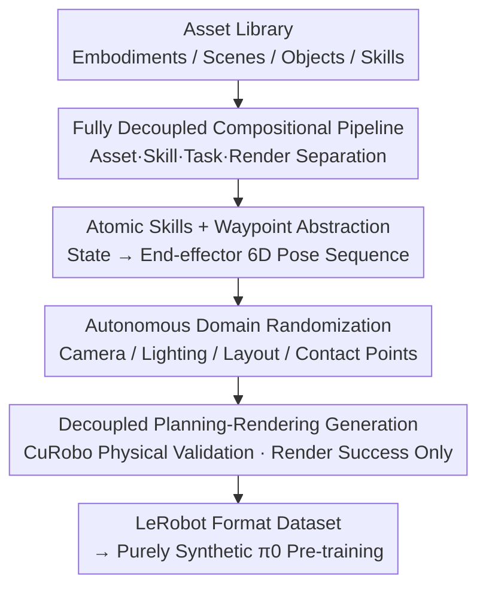

# InternData-A1: Pioneering High-Fidelity Synthetic Data for Pre-training Generalist Policy

**Conference**: CVPR 2026  
**Paper**: [CVF Open Access](https://openaccess.thecvf.com/content/CVPR2026/html/Tian_InternData-A1_Pioneering_High-Fidelity_Synthetic_Data_for_Pre-training_Generalist_Policy_CVPR_2026_paper.html)  
**Code**: Authors claim open-sourcing the dataset and generation pipeline (Check the original text for specific repository addresses, ⚠️ Subject to the original text)  
**Area**: Robotics / Embodied AI  
**Keywords**: VLA Pre-training, Synthetic Data, Sim-to-Real, Robotic Manipulation, Data Scaling

## TL;DR
InternData-A1 utilizes a fully decoupled and autonomous simulation synthesis pipeline to generate 630,000 trajectories (7,433 hours) of high-fidelity robotic manipulation data. It demonstrates for the first time that a VLA model pre-trained solely on "purely synthetic data" can match the performance of the official $\pi 0$ pre-trained on the closed-source real-world $\pi\text{-dataset}$ across 49 simulation and 9 real-world tasks.

## Background & Motivation
**Background**: The strong generalization capabilities of Vision-Language-Action (VLA) models in the past two years have been primarily supported by large-scale real-world data. The $\pi\text{-series}$ demonstrated the power of real-world pre-training using the closed-source $\pi\text{-dataset}$.

**Limitations of Prior Work**: Collecting large-scale real-world data is prohibitively expensive, requiring skilled operators, specialized hardware, and significant labor. Most research groups cannot afford to build real-world datasets of such scale and diversity. Consequently, the community lacks a systematic understanding of the fundamental question: "What kind of data is needed for VLA pre-training?" While simulation should be a complementary route, existing datasets (e.g., MimicGen, RoboCasa, RoboTwin) suffer from narrow skill sets (mainly pick-and-place), focus almost exclusively on rigid bodies, still require manual operation, and have rarely been validated for their efficacy in large-scale VLA pre-training.

**Key Challenge**: There is a tension between the non-scalability of expensive real-world data and the failure of cheap synthetic data to demonstrate competitive performance at scale. The root cause lies in existing simulation pipelines being simultaneously limited in object types, scenes, skills, and physical fidelity, preventing them from approaching the pre-training effectiveness of real-world data.

**Goal**: This work aims to solve two sub-problems: (1) Developing a high-fidelity synthetic pipeline that scales across embodiments, scenes, skills, and physical fidelity simultaneously; (2) Verifying if a model pre-trained purely on its synthetic output can match the performance of the strongest real-world data on downstream real-world tasks.

**Key Insight**: The authors bet on "Decoupling + Composition"—completely separating assets, skill policies, task composition, and rendering. This allows tasks to be assembled like LEGO bricks. As long as these four modules are robustly designed, the combinatorial space expands exponentially while manual costs remain nearly constant.

**Core Idea**: An autonomous simulation pipeline with "asset/skill/task/render full decoupling" is built. With negligible labor, it expands basic skills into 630,000 trajectories covering 70 tasks, 227 scenes, and 4 embodiments. This purely synthetic data is then used to match the results of closed-source real-world data.

## Method

### Overall Architecture
The core of InternData-A1 is not a model but a **data synthesis pipeline** and the $\pi 0$ policy pre-trained with it. The pipeline decomposes the generation of a robotic manipulation trajectory into four serial stages: 1) Constructing the environment by retrieving embodiments, scenes, and objects from an asset library (Environment Construction); 2) Selecting skills from an atomic skill library and composing them into complete tasks via configuration files (Skill Composition); 3) Applying autonomous domain randomization to camera views, lighting, layouts, and contact points (Domain Randomization); 4) Planning dense joint motions using CuRobo, performing pure physical simulation for validation, and rendering only successful trajectories into LeRobot format (Generation & Storage). The key lies in "decoupling": each skill is an automatic mapping from "state $\rightarrow$ waypoint." Changing objects, spatial ranges, scenes, or even embodiments requires no additional labor beyond adjusting spatial bounds. After engineering optimization, 8 RTX 4090 GPUs can produce 209.7 hours of data per day at a cost of less than $\$0.003$ per episode.

### Key Designs

**1. Fully Decoupled Compositional Pipeline: Decomposing "Task Creation" into Four Scalable Blocks**

This addresses the pain point of existing simulation datasets having narrow skills, limited objects, and high manual requirements. The authors decouple asset specifications, skill policies, task composition, and rendering. Each task is generated by "retrieving embodiment + scene + object" and "composing scripted skill policies." Skill policies calculate and interpolate trajectories conditioned on robot and object states. Because the four modules are independent, the combinatorial space is their Cartesian product. The same skill set applied to different objects/scenes/embodiments creates new tasks. Starting from basic human skills (folding, pouring, rotating, stacking, etc.), 70 tasks were composed, including 18 long-horizon tasks containing at least three sequential skills (125k trajectories). Unlike old methods that inflate task counts by simply swapping operated objects (where picking hundreds of objects still counts as one task), each task here defines a unique context, atomic skill combination, and action space constraints, achieving "task-level" diversity.

**2. Atomic Skill + Waypoint Unified Abstraction: Zero Cost for Swapping Objects/Embodiments**

If skills are coupled with low-level motion execution, changing an object or robot requires rewriting policies, hindering scalability. The authors designed modular scripted policies for each skill. The inputs are object states (pose, joint states), robot states (base and end-effector poses), and user constraints; the output is a standardized sequence of waypoints (target end-effector 6D poses). Waypoints serve as a unified representation that cleanly decouples high-level skill logic from low-level execution. For example, the "Pick" skill filters grasp candidates and calculates pre-grasp/grasp/post-grasp poses, while the "Push" skill for articulated objects uses contact annotations to calculate pre-contact/contact/post-contact poses. Since skills are automatic mappings, swapped objects or embodiments incur no extra cost. The user only needs to specify arms and arrange the skills, allowing long-horizon bimanual tasks to unfold automatically.

**3. Autonomous Domain Randomization: Injecting Diversity in Both Vision and Trajectory Dimensions**

Purely synthetic data fails to transfer if visuals are monotonous or trajectories are rigid. Authors apply randomization in two dimensions: Vision-wise, the primary and wrist camera views are perturbed within $\pm 5^{\circ}$ rotation and $\pm 5$ cm translation; 174 environment maps are used with randomized color temperature and intensity to simulate natural lighting; target objects can be replaced by others of the same category, and table/background layouts are randomized. Trajectory-wise, object positions and orientations are sampled within task-specific spatial ranges, and contact regions are randomized—e.g., the grasp pipeline generates millions of candidates and randomly selects one from the top-40 high-confidence candidates. This "autonomous" randomization enables a single task to yield numerous episodes with varying visuals and motions, providing robustness under "Hard" settings.

**4. Planning-Rendering Decoupled Generation: Budgeting Compute Only for Successful Trajectories**

Rendering is significantly slower than physical simulation. Rendering every attempt would waste compute on failed plans, especially for long-horizon or dexterous tasks. The authors use CuRobo to interpolate dense joint-space actions between waypoints. For each trial, they first **disable rendering** and run pure physical simulation to follow the actions. The rendering engine is only turned on to replay and save the trajectory if planning and execution are successful. This "validation before rendering" decoupling concentrates compute on valid trajectories and is the engineering key to producing 209.7 hours of data daily on 8 GPUs. Each final episode records object metadata, language instructions, multi-view RGB, camera parameters, proprioception, and action labels in LeRobot format.

### Loss & Training
This paper does not propose a new loss but follows the $\pi 0$ architecture: Paligemma VLM + flow-matching based action expert. During pre-training, Paligemma weights are initialized, the action expert starts from scratch, and the model is pre-trained **only on InternData-A1**. It is then compared to the official $\pi 0$ (trained on the closed-source $\pi\text{-dataset}$) to isolate the effects of pre-training data quality.

## Key Experimental Results

### Main Results
Simulation evaluation was conducted on 49 bimanual tasks from RoboTwin 2.0, categorized into "Easy" (clean) and "Hard" (cluttered). 100 trials were run per task across two checkpoints, totaling 19,600 rollouts.

| Setting | $\pi 0$ (Scratch) | Official $\pi 0$ ($\pi\text{-dataset}$) | $\pi 0$ (InternData-A1) | Gain vs Official $\pi 0$ |
|------|------|------|------|------|
| 49 Task Avg. Easy | 23.5% | 55.0% | **60.0%** | +5.0% |
| 49 Task Avg. Hard | 2.5% | 20.0% | **26.5%** | +6.5% |

Purely synthetic pre-training not only matched but slightly outperformed the official $\pi 0$ trained on closed-source real-world data. Compared to non-pre-trained Paligemma, it showed a 36.5% improvement in Easy and 24.0% in Hard tasks. Real-world evaluation across three embodiments (Genie-1, ARX Lift-2, ARX AC One) and 9 tasks (5 conventional, 4 dexterous) showed that conventional tasks outperformed $\pi\text{-dataset}$ by 6.2% on average. For the 4 long-horizon dexterous tasks (folding clothes, sorting parts, uncapping bottles, zipping—using the unseen ARX AC One), it achieved levels comparable to $\pi\text{-dataset}$.

### Comparison with Open Datasets
Different datasets were used to pre-train $\pi 0$ for 500k iterations and evaluated on 49 Sim tasks + 2 Real tasks:

| Dataset | Type | 49 Sim Easy | 49 Sim Hard | Sort Rubbish | Pass Bottle |
|------|------|------|------|------|------|
| OXE | Real | 32.5% | 11.0% | 40.0% | 36.7% |
| Agibot World | Real | 52.5% | 12.0% | 53.3% | 56.7% |
| RoboCasa | Sim | 50.0% | 11.0% | 23.3% | 13.3% |
| **InternData-A1** | Sim | **60.0%** | **26.5%** | **90.0%** | **60.0%** |

RoboCasa trailed by only 10% in simulation but collapsed in the real world—InternData-A1 outperformed it by 57.7% on real tasks, attributed to high-fidelity rendering and data volume.

### Key Findings
- **Larger Gains in Hard Settings** (+6.5% vs +5.0% in Easy): Even when downstream fine-tuning uses clean, non-randomized data, the visual/spatial robustness from InternData-A1's domain randomization is retained, indicating that diversity is "internalized" during pre-training.
- **Surprising Sim-to-Real Data Efficiency**: Starting from the same $\pi 0$ (InternData-A1) checkpoint, basic skills like "Sort Rubbish" or "Wipe Stain" required only 200 synthetic episodes to match 200 real episodes. Complex tasks involving dynamic objects + language grounding (e.g., "Flip Package") required ~1,600 synthetic episodes. Overall, the "Sim:Real" equivalence ratio narrowed to within 8:1, and for 6 tasks involving repetitive picking, joints, or bimanual coordination, 500 synthetic episodes exceeded a 50% success rate.

## Highlights & Insights
- **First Clear Answer to "Can Synthetic Data Match the Best Real-World Data?"**: Previously, synthetic data was seen only as a supplement. By matching official $\pi 0$ results, this work proves that synthetic data alone is sufficient if scaled across physics, embodiments, scenes, and skills. This liberates research groups that lack the budget for real-world data collection.
- **Waypoint Abstraction as the Scaling Lever**: Solving the modular "state $\rightarrow$ waypoint" mapping allows for zero-cost swaps of objects/embodiments. This engineering abstraction determines the scalability of the pipeline more than any single simulation trick.
- **Decoupled Planning-Rendering for Cost-Efficiency**: Performing physical simulation first to filter failed plans and rendering only successful ones reduces the cost per episode to under $\$0.003$. This "expensive operation last, only for winners" logic is applicable to any "generate-and-verify" data pipeline.

## Limitations & Future Work
- The authors admit that complex tasks (dynamic objects, language grounding) still require ~1,600 synthetic episodes to match 200 real ones, showing that the equivalence ratio varies significantly with task difficulty.
- Sim-to-real evaluation relies on "well-aligned sim-to-real settings"; transferability to scenarios where cameras, lighting, or contacts deviate significantly from reality was not fully tested (⚠️ Results primary focus on well-aligned tasks).
- Comparison with official $\pi 0$ is limited by the closed-source nature of $\pi\text{-dataset}$, making it difficult to perform a complete data-level ablation to disentangle the contributions of data quality, volume, and architecture.
- Future work: Upgrading domain randomization from manual ranges to "learnable/adaptive" distributions may further bridge the sim-to-real gap and reduce remaining manual efforts.

## Related Work & Insights
- **vs $\pi\text{-series}$ / $\pi\text{-dataset}$**: While $\pi\text{-dataset}$ uses large-scale closed-source real data, this work uses open-source reproducible synthetic data. It proves synthetic data can match the best real-world data and lowers the barrier for VLA research.
- **vs RoboTwin 2.0 / RoboCasa etc.**: These either have narrow skills, focus on rigid bodies, or show severe performance drops in real-world transfer. InternData-A1 covers rigid/articulated/deformable/fluid objects across 70 tasks and 227 scenes and maintains performance in the real world due to its decoupled pipeline and high-fidelity rendering.
- **vs MimicGen etc.**: While others rely on teleoperation + augmentation, this work relies on autonomous atomic skill composition, requiring no teleoperation and offering a higher ceiling for scale and diversity.

## Rating
- Novelty: ⭐⭐⭐⭐ Not a new model, but systematic evidence that "fully decoupled autonomous synthesis + purely synthetic data" can match real-world performance. Robust engineering and argumentation.
- Experimental Thoroughness: ⭐⭐⭐⭐⭐ 49 Sim tasks + 9 Real tasks + comparison with multiple open datasets + sim-to-real efficiency analysis. Highly comprehensive.
- Writing Quality: ⭐⭐⭐⭐ Pipeline stages are clear, though some experimental figures are tucked into captions, and tables are densely packed.
- Value: ⭐⭐⭐⭐⭐ Open-sourcing the data and pipeline provides tangible infrastructure for communities without real-world data resources.

<!-- RELATED:START -->

1. **Pi0: We Really Don’t Need More Robots?** (Physical Intelligence, 2024) - Basis for the $\pi 0$ architecture comparison.
2. **RoboCasa: Large-Scale Simulation of Tasks into Real-World Environments** (2024) - Key simulation dataset comparison.
3. **Open X-Embodiment: Robotic Learning at Scale** (2023) - Reference for large-scale real-world robotic data.

<!-- RELATED:END -->

## Related Papers

- [\[CVPR 2026\] Video2Robo: 3DGS-based Synthetic Data from One Video Enables Scalable Robot Learning](video2robo_3dgs-based_synthetic_data_from_one_video_enables_scalable_robot_learn.md)
- [\[AAAI 2026\] Realistic Synthetic Household Data Generation at Scale](../../AAAI2026/robotics/realistic_synthetic_household_data_generation_at_scale.md)
- [\[CVPR 2026\] FM-Steer: Enhance Generalist Policies with Value-Guided Cascaded Denoising](fm-steer_enhance_generalist_policies_with_value-guided_cascaded_denoising.md)
- [\[CVPR 2026\] OctoNav: Towards Generalist Embodied Navigation](octonav_towards_generalist_embodied_navigation.md)
- [\[NeurIPS 2025\] LabUtopia: High-Fidelity Simulation and Hierarchical Benchmark for Scientific Embodied Agents](../../NeurIPS2025/robotics/labutopia_high-fidelity_simulation_and_hierarchical_benchmark_for_scientific_emb.md)

<!-- RELATED:END -->
