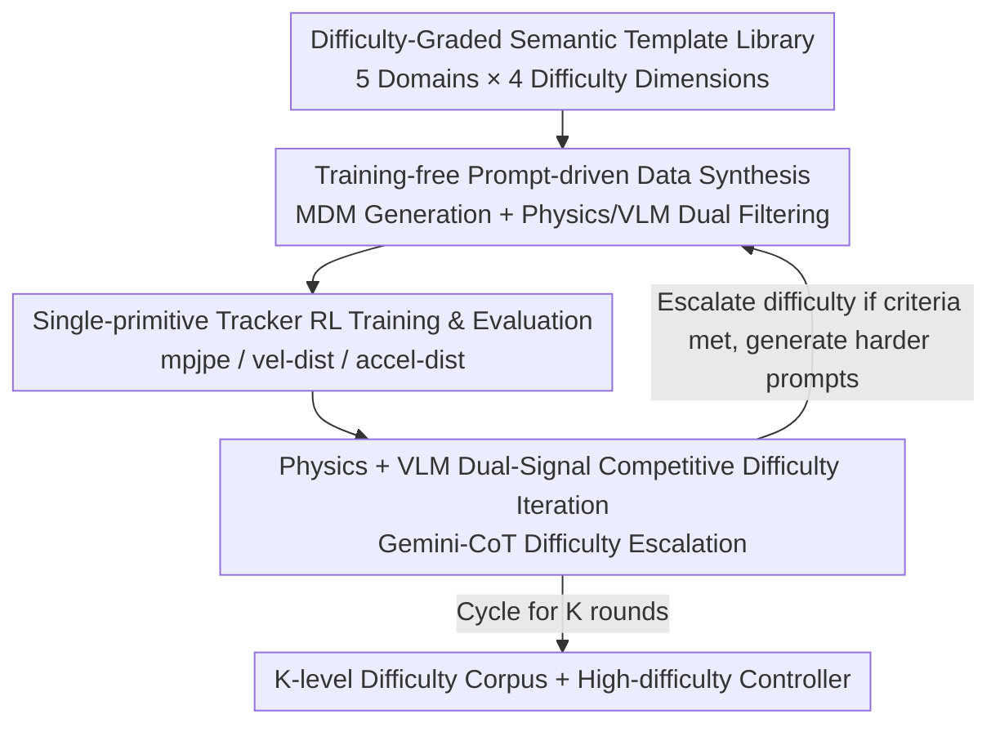

# Iterative Closed-Loop Motion Synthesis for Scaling the Capabilities of Humanoid Control

**Conference**: CVPR 2026  
**Paper**: [CVF Open Access](https://openaccess.thecvf.com/content/CVPR2026/html/Xu_Iterative_Closed-Loop_Motion_Synthesis_for_Scaling_the_Capabilities_of_Humanoid_CVPR_2026_paper.html)  
**Code**: https://wesleyxu224.github.io/CLAIMS/ (Project Page)  
**Area**: Robotics / Embodied AI  
**Keywords**: Humanoid Control, Closed-loop data generation, Motion Diffusion Models, Difficulty Curriculum, Physics Simulation

## TL;DR
This paper proposes CLAIMS—a closed-loop framework where "motion data synthesis" and "humanoid controller training" co-evolve. It utilizes motion diffusion models to generate professional high-dynamic motions from difficulty-graded semantic template prompts. Following dual filtering via physics and VLM, a physics-based motion tracker is trained. Feedback from physics metrics and VLM then drives an LLM to automatically escalate difficulty, reducing the average failure rate of the PHC tracker by 45% on a 2201-segment test set using only approximately 1/10 of the AMASS data volume.

## Background & Motivation
**Background**: Physics-based humanoid control typically follows a standard pipeline of "imitating motion capture data via Reinforcement Learning"—DeepMimic demonstrated that complex skills are learnable, AMP improved realism, and ASE/PHC advanced skill reuse and generalization. The capability upper bound of these methods is dictated by the distribution of the training data.

**Limitations of Prior Work**: Existing motion corpora suffer from two major flaws. First, **fixed and relatively low difficulty distribution**: over 90% of AMASS consists of low-dynamic daily motions. AIST++ focuses only on dance, while professional high-dynamic motions (martial arts, gymnastics, combat) are severely scarce. Consequently, controllers trained on these corpora fail when encountering high-dynamic skills such as flips or somersaults. Second, **high cost of acquiring high-quality data**: professional MoCap systems are expensive and difficult to scale; while video mining or cross-morphology aggregation (Humanoid-X, HuBE) can increase volume, they still lack high difficulty, reliable semantics, and difficulty stratification.

**Key Challenge**: The capability upper bound of a controller is locked by the "fixed difficulty distribution" of the data. Breaking this ceiling requires harder professional data, which is precisely the most difficult to collect—there is a lack of a mechanism that can **automatically upgrade data difficulty as capabilities grow**.

**Goal**: (1) Provide a scalable semantic definition and difficulty stratification for professional motions; (2) Enable data generation and controller training to proceed alternately in a competitive cycle, allowing policies to break through their own difficulty ceilings.

**Key Insight**: The authors observe that while the motion diffusion model MDM is trained on the low-dynamic HumanML3D, its **latent space supports the compositional blending of motion primitives**. This allows it to generate new combinations (OOD motions) not present in the training set—thus, professional high-dynamic motions can be "extracted" using structured prompts without retraining the generator.

**Core Idea**: Treat "data synthesis" and the "controller" as a pair of **competitively co-evolving** players. Once the controller masters the current distribution, physics and VLM feedback are used to let an LLM generate harder prompts and synthesize more difficult data, forcing the controller to continue its ascent, forming a self-reinforcing curriculum.

## Method

### Overall Architecture
CLAIMS is an end-to-end automated closed-loop system. In each iteration: prompts are sampled from a **difficulty-aware variable library** covering five professional domains (Martial Arts, Dance, Combat, Sports, Gymnastics) graded across four dimensions; MDM synthesizes motion trajectories from the prompts, followed by physics validity checks (e.g., root joint height) and VLM semantic alignment filtering; a single-primitive physics tracker is trained using the filtered synthetic data via Reinforcement Learning; upon convergence, physical tracking metrics and VLM subjective difficulty feedback are collected into an observation vector for an LLM policy (driven by Gemini Chain-of-Thought), which outputs the next round of "harder and targeted" prompts. After $K$ rounds, a five-domain corpus with $K$ levels of difficulty gradients and a controller capable of adapting to heterogeneous high-difficulty motions are obtained. Only the controller requires training compute, making the framework controller-agnostic.

### Key Designs

**1. Difficulty-Graded Semantic Template Library: A Controllable Definition of "Hard"**

To address the "fixed difficulty distribution" of existing corpora, the authors formalize "professionalism" and "difficulty." Focusing on expert requirements and collection risks, five high-dynamic domains are selected (Martial Arts, Dance, Combat, Gymnastics, Sports). Difficulty is defined along four axes: **Base Actions** (atomic skills), **Combinations** (compositional logic), **Details** (technical nuances like limb placement), and **Speed & Rhythm** (temporal structure). A dance prompt might combine a grand allegro (base) + saut de basque sequence (combination) + triple pirouette (detail) at a steady tempo (speed). This template constrains generation and guides dataset optimization, ensuring difficulty escalation is "principled" rather than random. t-SNE verification shows that motions synthesized with expert prompts highly overlap with real professional martial arts manifolds, whereas random prompts fall far away—indicating the templates encode significant domain priors.

**2. Training-free Prompt-driven Data Synthesis: Extracting OOD High-Dynamic Motions**

To mitigate high data acquisition costs, the authors use a pre-trained, low-cost text-conditioned diffusion model MDM (50-step sampler + DistilBERT text encoder). Although MDM was trained on low-dynamic data, its latent space allows for the **compositional blending** of primitives, producing new combinations absent in the original dataset. Instead of modifying the generator, the authors use **templated motion prompts** (instantiated by an auxiliary LLM) derived from the semantic taxonomy. Filtering is applied after synthesis: physics legality checks (e.g., root height boundaries to eliminate floating/sinking/clipping) and VLM evaluation (alignment between prompt and motion semantics). t-SNE shows that samples from expert prompts fall largely **outside** the MDM training manifold, proving this path can extract OOD professional content.

**3. Single-primitive Tracker RL Training & Multi-dimensional Physics Eval: Mapping Capability Frontiers**

Synthetic data requires a training and evaluation phase to measure what the controller has "mastered." The single-primitive tracker uses RL for imitation with a single policy and dense rewards (pose, joint velocity, end-effectors, contact events). After convergence, four metrics are used for evaluation: $\text{mpjpe-g}$ (mean per-joint position error in world coordinates), $\text{mpjpe-l}$ (root-relative joint position error), $\text{vel-dist}$ (per-joint linear velocity difference, reflecting smoothness), and $\text{accel-dist}$ (per-joint acceleration difference, exposing high-frequency jitter). These metrics **outline the capability frontier of the controller** and are fed back into the next loop to guide difficulty escalation.

**4. Physics + VLM Dual-Signal Competitive Difficulty Iteration: Enabling Co-evolution**

This is the core for breaking capability ceilings. The authors adopt a **competitive iterative curriculum**: after each training round, if objective metrics exceed a threshold, the current distribution is considered "mastered," and data difficulty is upgraded. Progress is driven by a joint evaluation merging **objective physics tracking metrics and subjective visual judgment**. Motions are rendered as SMPL sequences for two VLMs (GPT-4o and Qwen-VL-MAX) to provide subjective difficulty scores and descriptors (technical complexity, intensity, balance, coherence). The controller simultaneously reports objective physics metrics. These signals are concatenated into a **semantic observation vector** $o_k=[m_k, v_k, e_k]$ (physics metrics $m_k$, VLM feedback $v_k$, previous motion encoding $e_k$) and fed into the Gemini CoT LLM policy $\pi_\theta$. The policy outputs the next batch of prompts $A_k\sim\pi_\theta(o_k,\mathcal{L},\mathcal{T})$ (Algorithm 1) from the variable library. The optimization is implicit: the policy aims to raise the labeled difficulty while improving physics tracking scores.

### A Complete Example
Starting with a single-primitive tracker from AMASS: loop0 uses expert prompts + filtering to obtain initial data. Initially, it **lags behind the AMASS baseline** on four high-difficulty benchmarks (L0 average 55.9% vs. baseline 58.3%). Through tracking metrics and VLM feedback, Gemini CoT proposes harder prompts for loop1, where the controller **surpasses the baseline** (L1 average 64.0%). Subsequent loops continue to raise the difficulty, reaching an average success rate of 76.9% at L6. This represents a 45% reduction in average failure rate compared to the AMASS baseline (from 41.7% to 23.1%).

### Loss & Training
The controller side uses standard RL imitation with dense rewards covering pose/joint velocity/end-effectors/contact events, following PHC single-primitive hyperparameters. The closed-loop side has no explicit loss; the policy $\pi_\theta$ implicitly optimizes for "Physics Score ↑ + Labeled Difficulty ↑." All experiments were conducted on a single NVIDIA A6000.

## Key Experimental Results

### Main Results
Evaluated across six standard test sets (kungfu, emdb, amass, mdm, aist++, video-converted), the main table summarizes success rates for 2201 segments.

| Method | Kungfu | EMDB | AIST++ | VC | Avg |
|--------|--------|------|--------|-----|-----|
| AMASS Baseline | 47.1 | 53.3 | 67.6 | 31.2 | 58.3 |
| L0 (loop0) | 37.8 | 31.1 | 68.8 | 33.3 | 55.9 |
| L1 | 47.7 | 33.3 | 75.3 | 38.7 | 64.0 |
| L3 | 59.1 | 64.4 | 82.1 | 50.9 | 72.4 |
| **Ours (L6)** | 60.3 | 64.4 | 88.1 | 58.9 | **76.9** |

While L0 initially lags, loop1 surpasses the baseline, with subsequent loops showing continuous improvement. L6 reduces the average failure rate by 45% compared to AMASS using only 1/10 of the data.

Portability to MaskedMimic:

| Test Set | AMASS | loop0 | loop1 |
|----------|-------|-------|-------|
| Motion-X/Kungfu | 57.2 | 54.0 | 65.8 |
| EMDB | 53.3 | 48.9 | 71.1 |
| AIST++ | 68.9 | 75.3 | 83.9 |
| Video-Convert | 41.6 | 47.4 | 62.4 |

Loop1 shows significant and consistent improvements across high-dynamic tasks, proving the framework is model-agnostic.

### Ablation Study
Ablating the observation vector and variable library from loop0 to loop3:

| Configuration | Key Conclusion | Description |
|---------------|----------------|-------------|
| Full (Physics + VLM) | Optimal | Complete observation |
| w/o VLM | Sub-optimal | Removing VLM signals drops performance but still beats no-physics. |
| w/o Physics metrics | Poor | Physics metrics are most diagnostic; significant drop without them. |
| w/o both | Worst | No observation; scheduler degrades to random. |
| w/o Variable Library | Lagging | The library provides structured priors that stabilize generation. |

The consistent ranking is **No Observation < No Physics < No VLM < Full**.

### Key Findings
- **Physics metrics are the most critical feedback signals**, while VLMs provide complementary subjective difficulty cues.
- **Gains stem from iterative feedback, not just data volume**: Large-scale training without iterative loops (size-matched) consistently lags behind the iterative version.
- **Difficulty indeed rises monotonically**: Success rates of a pre-trained PHC decline monotonically across subsequent loops, while velocity distributions move toward higher peaks and longer tails.

## Highlights & Insights
- **Competitive Co-evolution**: Allowing data difficulty to climb alongside controller capability through a "self-reinforcing curriculum" is a strategy transferable to many embodied AI tasks where high-difficulty data is scarce.
- **Training-free OOD Data Extraction**: Using structured templates to extract high-dynamic motions from low-dynamic generators is a highly cost-effective approach.
- **Dual Physics-VLM Feedback**: Combining objective trackability with subjective visual difficulty provides a robust paradigm for designing feedback in closed-loop curricula.

## Limitations & Future Work
- Synthesis quality is constrained by the **generative model's capabilities in extreme dynamics** (though the modular design allows for future generator upgrades).
- The manually curated **variable library lacks automated multi-modal coverage** and objective calibration.
- Heavy reliance on closed-source LLMs (Gemini CoT, GPT-4o) affects reproducibility and cost.
- Discussion on sim-to-real gaps for physical robots is limited.

## Related Work & Insights
- **vs PARC**: PARC uses a single evaluation criterion; CLAIMS uses multi-dimensional Physics + VLM feedback and a semantic taxonomy for more principled escalation.
- **vs PHC / MaskedMimic**: Instead of replacing controllers, CLAIMS acts as a model-agnostic enhancement tool by providing adaptive curriculum data.
- **vs Humanoid-X / HuBE**: These focus on volume via video mining; CLAIMS focuses on the "high-dynamic professional" gap via closed-loop difficulty escalation.

## Rating
- Novelty: ⭐⭐⭐⭐ (Competitive co-evolution combined with training-free OOD extraction is highly creative.)
- Experimental Thoroughness: ⭐⭐⭐⭐ (Comprehensive ablation and cross-tracker validation, though lacks real-world deployment.)
- Writing Quality: ⭐⭐⭐⭐ (Clear motivation and convincing signal design.)
- Value: ⭐⭐⭐⭐ (45% failure reduction with 1/10 data is significant for high-dynamic humanoid control.)

<!-- RELATED:START -->

## Related Papers

- [\[CVPR 2026\] Closed-Loop Neural Activation Control in Vision-Language-Action Models](closed-loop_neural_activation_control_in_vision-language-action_models.md)
- [\[CVPR 2026\] Towards Motion Turing Test: Evaluating Human-Likeness in Humanoid Robots](towards_motion_turing_test_evaluating_human-likeness_in_humanoid_robots.md)
- [\[CVPR 2026\] DAWN: Pixel Motion Diffusion is What We Need for Robot Control](dawn_pixel_motion_diffusion_robot_control.md)
- [\[CVPR 2026\] End-to-End Language-Action Model for Humanoid Whole Body Control](end-to-end_language-action_model_for_humanoid_whole_body_control.md)
- [\[CVPR 2026\] Do You Have Freestyle? Expressive Humanoid Locomotion via Audio Control](do_you_have_freestyle_expressive_humanoid_locomotion_via_audio_control.md)

<!-- RELATED:END -->
