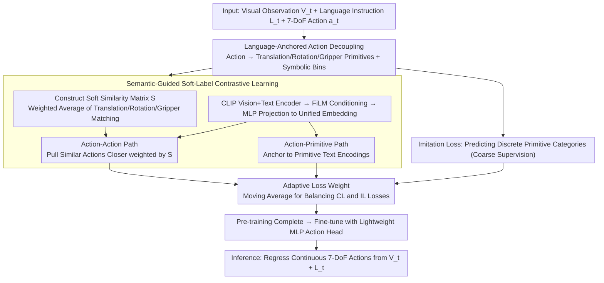

# Language-Grounded Decoupled Action Representation for Robotic Manipulation (LaDA)

**Conference**: CVPR 2026  
**arXiv**: [2603.12967](https://arxiv.org/abs/2603.12967)  
**Code**: None  
**Area**: Robotic Manipulation  
**Keywords**: Action Decoupling, Language Semantic Bridge, Soft-label Contrastive Learning, VLA, Cross-task Generalization

## TL;DR

The LaDA framework is proposed to decouple continuous 7-DoF actions into interpretable primitives (translation, rotation, and gripper) using natural language as a semantic bridge. By employing soft-label contrastive learning to align cross-task action representations in a shared embedding space, the model achieves a 93.6% success rate on LIBERO with only 0.6B parameters, surpassing all baselines ranging from 1.3B to 8.5B parameters.

## Background & Motivation

**Background**: Vision-Language-Action (VLA) models have significantly advanced robotic manipulation in recent years. However, the heterogeneity between high-level semantic understanding and low-level action control remains a fundamental challenge.

**Limitations of Prior Work**: Three existing paradigms have distinct shortcomings: (1) End-to-end VLA (e.g., OpenVLA, RT-2) tightly couples perception and control, resulting in uninterpretable actions and an inability to reuse shared motion structures; (2) Implicit action learning (e.g., LAPA, UniSkill) encodes actions in a compact latent space defined by observational differences, which lacks explicit semantic labels and limits cross-task transfer; (3) Language-conditioned policies (e.g., CLIP-RT, PPL) introduce language but rely on coarse-grained discrete primitives (e.g., "move forward," "close gripper"), lacking fine-grained motion parameters such as translation magnitude or rotation angles.

**Key Challenge**: Tasks like "pouring water" and "placing a bottle" share many low-level motion primitives (reach, grasp, rotate). However, existing models fail to utilize these shared structures, leading to redundant learning and poor cross-task generalization. The root cause is the absence of a semantic grounding layer that connects symbolic intent with continuous execution.

**Goal**: To construct an action representation that is both semantically grounded and transferable across tasks, enabling the sharing and alignment of fine-grained motion semantics.

**Key Insight**: Language naturally serves as a universal interface connecting human intent, visual perception, and robot control. It possesses compositionality and semantic regularity, allowing motion concepts to be encoded, compared, and generalized within a unified space.

**Core Idea**: Fine-grained action primitives anchored in language are used as an intermediate layer between continuous control and high-level semantics. This facilitates semantic alignment of cross-task actions via soft-label contrastive learning.

## Method

### Overall Architecture

LaDA addresses the gap between high-level semantics and low-level control in VLA models. Instead of performing end-to-end black-box mapping, it inserts a "language-anchored action representation." Given visual observations $V_t$, language instructions $L_t$, and 7-DoF actions $\mathbf{a}_t$, the pipeline operates as follows: continuous actions are first decomposed into three linguistically describable primitives (translation, rotation, and gripper). A soft similarity matrix $S$ is then calculated to reflect primitive-level semantic relatedness. This matrix guides dual-path soft-label contrastive learning—aligning action-to-action pairs and anchoring actions to their primitive text descriptions—to align reusable motion structures across tasks in a shared embedding space. During training, an adaptive weight dynamically balances contrastive and imitation losses. After pre-training, a lightweight MLP action head is fine-tuned to regress continuous 7-DoF actions directly from $(V_t, L_t)$.

### Key Designs

**1. Language-Grounded Action Decoupling: Translating Continuous Control into Sharable Semantic Primitives**

The limitation of implicit action learning is that actions are compressed into uninterpretable latent codes. Tasks like "pouring water" and "placing a bottle" share many underlying motions (reach, grasp, rotate) that cannot be explicitly utilized. LaDA defines a projection $\Pi: \mathbf{a}_t \mapsto \mathbf{p}_t$ to decompose 7-DoF actions into three primitive categories with language templates: translation ("Move [dist] meters along [dir]"), rotation ("Rotate [mag] degrees around [axis]"), and gripper ("Open/Close"). Each primitive is further discretized into language-aligned symbolic bins: translation directions (forward/backward/left/right/up/down), rotation axes (x/y/z), and a binary gripper state. The critical aspect is that each motion segment is assigned an explicit semantic label. Primitives like "rotate 90° around the z-axis" are labeled with the same symbol across different tasks, exposing shared structures for subsequent contrastive learning.

**2. Semantic-Guided Soft-Label Contrastive Learning: Replacing Binary pairs with Partial Similarity**

Standard contrastive learning recognizes only binary positive/negative pairs, which fails to express partial similarities like "same translation but different rotation." LaDA constructs a soft similarity matrix by calculating a weighted average of matches across the three dimensions:

$$S = \frac{w_t M_t + w_r M_r + w_g M_g}{w_t + w_r + w_g}$$

where $M_t, M_r, M_g$ are binary matching matrices for translation, rotation, and gripper dimensions, respectively. For example, if two actions share the same translation direction and gripper state but differ in the rotation axis, $S_{ij}$ will fall between 0 and 1. On the representation side, embeddings are extracted using CLIP, conditioned via FiLM, and projected into a unified space $A_i$. The model then executes two soft-label InfoNCE paths: the Action-Action path pulls semantically similar action embeddings closer based on $S_{ij}$, while the Action-Primitive path anchors each action to its corresponding primitive text encoding $P_j$. The total contrastive loss is $\mathcal{L}_{CL} = \mathcal{L}_a + \lambda \mathcal{L}_m$. This allows the gradient to account for correspondences down to individual motion components, facilitating the reuse of motion semantics across tasks.

**3. Adaptive Loss Weights: Preventing Suppression between Coarse Supervision and Fine Alignment**

Training involves two supervisory forces: the imitation loss $\mathcal{L}_{IL}$, which predicts discretized primitive categories (coarse-grained behavior), and the contrastive loss $\mathcal{L}_{CL}$, which performs fine-grained semantic alignment. Since their convergence rates and granularities differ, a fixed weight might allow one to dominate. Inspired by curriculum learning, LaDA uses the moving average (MA) of each loss to dynamically normalize the weights:

$$w_{IL} = \frac{\text{MA}(\mathcal{L}_{IL})}{\text{MA}(\mathcal{L}_{IL}) + \text{MA}(\mathcal{L}_{CL})}$$

The final loss is $\mathcal{L}_{total} = w_{CL} \mathcal{L}_{CL} + w_{IL} \mathcal{L}_{IL}$. Higher weights are automatically assigned to the larger current loss, maintaining balance between the two supervisory signals throughout training.

### Loss & Training

- **Pre-training**: Conducted on the OXE dataset (~22.5 million frames, 22 robot types) using $\mathcal{L}_{total}$. Structured language descriptions are automatically generated for each continuous action as auxiliary supervision.
- **Fine-tuning**: Utilizes a lightweight MLP action head with an $\ell_1$ trajectory regression loss.
- **Inference**: Directly outputs continuous actions from $(V_t, L_t)$ without requiring explicit primitive labels.

## Key Experimental Results

### Main Results

| Model | Parameters | LIBERO-Spatial | LIBERO-Object | LIBERO-Goal | LIBERO-Long | LIBERO-Avg |
|------|--------|---------------|---------------|-------------|-------------|------------|
| OpenVLA | 7.5B | 84.7% | 88.4% | 79.2% | 53.7% | 76.5% |
| FlowVLA | 8.5B | 93.2% | 95.0% | 91.6% | 72.6% | 88.1% |
| CLIP-RT | 1.3B | 95.2% | 99.2% | 94.2% | 83.8% | 93.1% |
| **Ours (LaDA)** | **0.6B** | **95.2%** | **99.2%** | **93.6%** | **86.4%** | **93.6%** |

| Model | MimicGen 9-Task Avg | Rep. Task: StackThree_D1 |
|------|-------------------|----------------------|
| OpenVLA | 38% | 20% |
| Phoenix | 58% | 20% |
| CLIP-RT* | 51% | 52% |
| **Ours (LaDA)** | **67%** | **71%** |

### Ablation Study

| Configuration | Spatial | Object | Goal | Long | Avg |
|------|---------|--------|------|------|-----|
| w/o SCL (No Soft-label Contrastive) | 79.2% | 82.8% | 76.6% | 63.4% | 75.5% |
| w/o AW (No Adaptive Weighting) | 93.6% | 94.4% | 87.2% | 74.4% | 87.4% |
| **Ours (LaDA Full)** | **95.2%** | **99.2%** | **93.6%** | **86.4%** | **93.6%** |

### Key Findings

- Removing SCL caused the LIBERO average to drop by 18.1 percentage points (93.6% to 75.5%), with the Long task dropping from 86.4% to 63.4%, indicating that long sequences rely most on cross-task semantic sharing.
- Removing adaptive weighting resulted in a 6.2-point drop on average and a 12-point drop on the Long task, proving the importance of optimization balance for long-horizon tasks.
- In generalization tests, CLIP-RT* achieved a 0% success rate in cross-task settings, while LaDA reached 12.3%, demonstrating that language-anchored primitives enable the reuse of motion semantics for unseen instructions.
- On MimicGen, LaDA showed significant gains in multi-task training (where CLIP-RT showed almost none), suggesting that semantic structures effectively promote the sharing of motion patterns across tasks.

## Highlights & Insights

- The concept of "language as a semantic bridge" directly addresses the VLA pain point—by establishing an explicit semantic interface at the action level rather than using end-to-end black-box mapping, actions become comparable and transferable. This is more elegant than both implicit action learning and coarse language conditioning.
- Soft-label contrastive learning is a methodological innovation. Unlike traditional contrastive learning using binary pairs, LaDA uses a continuous relatedness matrix for soft InfoNCE, allowing partial matches (e.g., same translation, different rotation) to generate appropriate gradient signals. This approach can be extended to other fields requiring fine-grained semantic alignment, such as object detection or segmentation.
- Exceptional parameter efficiency: Achieving performance superior to 7B+ models with only 0.6B parameters suggests that well-designed structural inductive biases (action decoupling and contrastive alignment) can significantly reduce a model's dependence on scale.

## Limitations & Future Work

- While the three primitive categories (translation, rotation, gripper) cover standard 7-DoF industrial arms, they may be insufficient for dexterous manipulation (e.g., humanoid fingers with 20+ DoF), necessitating more complex primitive designs.
- Language templates are currently manually designed (e.g., "Move X meters along Y"). Automated primitive discovery could offer greater flexibility.
- Real-world experiments were limited to a single pick-and-place task, lacking validation in complex real-world scenarios.
- The weights $(w_t, w_r, w_g)$ in the soft similarity matrix are hyperparameters that may require re-tuning for different task domains.

## Related Work & Insights

- **vs CLIP-RT**: Both use language-conditioned control, but CLIP-RT models actions as discrete language token classification, lacking continuous semantic alignment of motion parameters. LaDA uses soft-label contrastive learning for continuous relatedness matching, achieving comparable or superior performance with half the parameters.
- **vs LAPA**: Implicit action learning encodes actions as uninterpretable latent codes, requiring implicit learning for cross-task transfer. LaDA makes the action space interpretable and directly alignable through semantics.
- **vs Phoenix**: Phoenix relies on motion-level self-reflection for correction, reaching 58% on MimicGen. LaDA achieves 67% without self-correction, suggesting that a superior representation is more effective than complex reasoning strategies.

## Rating

- Novelty: ⭐⭐⭐⭐ The combination of language-anchored action decoupling and soft-label contrastive learning is a new methodological approach.
- Experimental Thoroughness: ⭐⭐⭐⭐ Utilizes LIBERO and MimicGen benchmarks, ablation studies, generalization tests, and real-world experiments, though the real-world setup is simple.
- Writing Quality: ⭐⭐⭐⭐ Problem definitions are clear, and the comparison of the three paradigms is persuasive.
- Value: ⭐⭐⭐⭐ Surpassing 7B+ models with 0.6B parameters has strong practical significance, and the soft-label contrastive learning is widely applicable.

<!-- RELATED:START -->

## Related Papers

- [\[CVPR 2025\] LaDA: Language-Grounded Decoupled Action Representation for Robotic Manipulation](../../CVPR2025/robotics/language-grounded_decoupled_action_representation_for_robotic_manipulation.md)
- [\[CVPR 2026\] INSIGHT Bench: Towards Grounded IN-SItu Guidance for Robotic Manipulation](insight_bench_towards_grounded_in-situ_guidance_for_robotic_manipulation.md)
- [\[CVPR 2026\] Action-Sketcher: From Reasoning to Action via Visual Sketches for Robotic Manipulation](action-sketcher_from_reasoning_to_action_via_visual_sketches_for_robotic_manipul.md)
- [\[CVPR 2026\] ActiveVLA: Injecting Active Perception into Vision-Language-Action Models for Precise 3D Robotic Manipulation](activevla_injecting_active_perception_into_vision-language-action_models_for_pre.md)
- [\[CVPR 2026\] Localizing, Structuring, and Rendering: Bridging 3D and 2D Vision-Language-Action Models for Robotic Manipulation](localizing_structuring_and_rendering_bridging_3d_and_2d_vision-language-action_m.md)

<!-- RELATED:END -->
