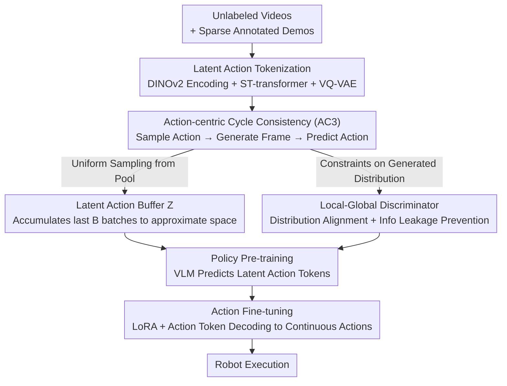

# Learning a Unified Latent Action Space from Videos with Action-centric Cycle Consistency

**Conference**: CVPR 2026  
**Paper**: [CVF Open Access](https://openaccess.thecvf.com/content/CVPR2026/html/Chen_Learning_a_Unified_Latent_Action_Space_from_Videos_with_Action-centric_CVPR_2026_paper.html)  
**Code**: TBD  
**Area**: Robotics / Embodied AI  
**Keywords**: Latent Action, Video Pre-training, Cycle Consistency, VLA, Cross-embodiment  

## TL;DR
CycleMimic is proposed to learn a latent action tokenizer from unlabeled videos using "Action-centric Cycle Consistency (AC3)." By establishing a closed loop of "sampling latent actions → generating future frames → predicting the action back from the original and generated frames," the method enforces a semantically consistent and unified cross-embodiment latent action space. It improves performance over OpenVLA by 20.1% on LIBERO and increases the average completed tasks on CALVIN from 3.27 to 3.93.

## Background & Motivation
**Background**: Robot imitation learning relies on expensive action-annotated demonstrations, whereas video constitutes a massive, nearly free data source. Recent mainstream approaches involve training a "latent action tokenizer": given adjacent frames $o_t, o_{t+H}$, an encoder produces a latent action $z_t$, while a decoder uses the current frame and latent action to reconstruct the future frame. This distills behavioral patterns from videos into discrete action tokens for pre-training Vision-Language-Action (VLA) policies (e.g., Genie, LAPA, UniVLA).

**Limitations of Prior Work**: A pilot study reveals two major weaknesses. First, each current frame is **uniquely paired** with its future frame; the tokenizer can simply memorize this pair to achieve reconstruction without understanding the underlying transition dynamics. This leads to semantic inconsistency (applying a latent action from a reference video to a new frame results in divergent motion). Second, to accommodate heterogeneous morphologies of different robots, tokenizers typically assign **disjoint latent action subsets** to each embodiment, leading to a fragmented action space and preventing cross-embodiment knowledge transfer.

**Key Challenge**: The reconstruction objective is too "easy"—the unique pairing allows the tokenizer to take shortcuts, failing to learn semantically consistent actions or unified representations across embodiments.

**Goal**: To construct a **unified latent action space** that simultaneously satisfies (1) semantic consistency and (2) cross-embodiment unification.

**Key Insight**: Break the "unique pairing" shortcut. Instead of only using paired $(o_t, o_{t+H})$ from the dataset, the method **samples** actions from a latent action pool, generates **diverse** future frames, and requires the tokenizer to **predict back** the sampled action from the original and generated frames.

**Core Idea**: Adapt the CycleGAN concept to the action space via a self-supervised task: the "sampled action → generated frame → back-predicted action" loop forces the tokenizer to learn semantically coherent and cross-embodiment reusable latent actions.

## Method

### Overall Architecture
The input to CycleMimic consists of unlabeled video datasets $T^o$ and a small amount of action-annotated robot demonstrations $T^a$. The pipeline consists of three stages: learning a latent action tokenizer with AC3 constraints (the core innovation), pre-training a VLA policy on videos to predict latent action tokens (treating the tokenizer encoder as an inverse dynamics model), and finally fine-tuning the policy with annotated data to produce continuous low-level robot actions.

The tokenizer is a VQ-VAE style encoder-decoder: the encoder $E$ uses DINOv2 to extract features from current and future frames, concatenates learnable latent action tokens, and applies a spatio-temporal (ST) transformer to aggregate transition dynamics into quantized discrete actions $z_t^q$ (each action uses $l_z$ tokens with codebook size $K$). The decoder $D$ reconstructs the future frame from the current frame and $z_t^q$. The system is enhanced by three components: Action-centric Cycle Consistency, a latent action buffer, and a local-global discriminator.

### Key Designs

**1. Action-centric Cycle Consistency (AC3): Enforcing semantic consistency and cross-embodiment unification via closed-loop tasks.**

This is the core contribution addressing the "shortcut" issue. Given a dataset frame $o_c$, an action $z_s^q$ is sampled from the latent action buffer $Z$, and the decoder generates a synthetic future frame $\hat{o}_g = D(o_c, z_s^q)$. The pair $(o_c, \hat{o}_g)$ is then fed into the encoder to **recover the original sampled action** $\hat{z}_s^q = E(o_c, \hat{o}_g)$, enforcing $\hat{z}_s^q \approx z_s^q$. To allow gradient flow, the L2 distance between the pre-quantized embedding $\hat{z}_s^e$ and codebook vectors is used as similarity, and cross-entropy is applied using the sampled action index as the label:

$$\mathcal{L}_C = -\sum_{k=1}^{K} y_k \log\left(\frac{\exp(-d(\hat{z}_s^e, e_k)/\tau)}{\sum_{j=1}^{K}\exp(-d(\hat{z}_s^e, e_j)/\tau)}\right)$$

Unlike fixed-pair reconstruction, the future frame here is diverse and not uniquely paired. The tokenizer must truly understand "which action causes which change" to succeed, forcing semantic consistency. Cross-embodiment unification is achieved naturally: sampling an action $z_s^q$ encoded by embodiment $E_i$ and applying it to a frame $o_c$ from embodiment $E_j$ forces the resulting action prediction to match, aligning different embodiments into a shared space.

**2. Latent Action Buffer $Z$: Providing a sampled approximation of a dynamic action space.**

AC3 requires sampling from the latent action space, but this space is **dynamically evolving** during training. Sampling only from the current batch allows the tokenizer to collapse the space to simplify the cycle consistency task. The solution is a buffer $Z$ that **accumulates encoded latent actions from the previous $B$ batches**. Uniform sampling from this buffer approximates the true action space while preventing collapse by maintaining diversity across time. Ablations show $B=4$ is optimal; $B=1$ leads to collapse, while $B=16$ introduces "stale" actions from too far in the past.

**3. Local-Global Discriminator: Aligning distributions and preventing info leakage.**

AC3 introduces two risks: distribution shift between generated and real frames, and the risk of the decoder "leaking" action information directly into pixels (shortcuts). A local-global discriminator $\Psi$ is used. It employs a spatial transformer to extract patch features for patch logits (local details) and global pooling for global logits (style), performing adversarial training at both levels:

$$\mathcal{L}^{\Psi}_{GAN} = -\log(\Psi(o)) - (1 - \log(\Psi(D(o,z)))), \quad \mathcal{L}^{D}_{GAN} = 1 - \log(\Psi(D(o,z)))$$

The discriminator forces the decoder to generate realistic frames and penalizes any distribution shifts caused by encoded action "watermarks," effectively plugging information leaks.

**4. Three-stage Policy Learning and Action Token Decoding.**

Once the tokenizer is trained, encoder $E$ acts as an inverse dynamics model to extract latent action tokens from $o_t, o_{t+H}$. The policy is based on Prismatic-7B VLM (SigLip+DINOv2 + LLaMA-2). The vocabulary is expanded with $K$ dedicated tokens $\{LACT_1,...,LACT_K\}$. The VLM is pre-trained on videos to predict latent actions autoregressively. During fine-tuning, a query token `ACT` is appended after latent action tokens to aggregate continuous robot actions (delta end-effector poses) from the VLM's hidden states using a dedicated decoder. The VLM uses LoRA while the action decoder is fully trained.

## Key Experimental Results

### Main Results
Average success rate on LIBERO (130 language-conditioned tasks):

| Method | Spatial | Object | Goal | Long | Average |
|------|---------|--------|------|------|------|
| LAPA | 73.8 | 74.6 | 58.8 | 55.4 | 65.7 |
| OpenVLA | 84.7 | 88.4 | 79.2 | 53.7 | 76.5 |
| UniVLA | 96.5 | 96.8 | 95.6 | 92.0 | 95.2 |
| Ours w/ Genie (Full) | 91.6 | 92.7 | 85.5 | 84.9 | 88.6 |
| **Ours (Bridge)** | 95.8 | 97.6 | 96.2 | 92.0 | 95.4 |
| **Ours (Full)** | **97.5** | **98.2** | **97.3** | **93.4** | **96.6** |

**Highlight**: Ours trained only on the Bridge dataset (much smaller than the datasets used by OpenVLA/Octo) outperforms them. Replacing AC3 with Genie's objective drops the average to 88.6, validating the gain from cycle consistency.

CALVIN (Unseen scene generalization, Avg. Len. = Average consecutive tasks completed in 1000 sequences):

| Method | 1 | 2 | 3 | 4 | 5 | Avg. Len. |
|------|---|---|---|---|---|-----------|
| OpenVLA | 0.913 | 0.778 | 0.620 | 0.521 | 0.435 | 3.27 |
| UniVLA | 0.955 | 0.858 | 0.754 | 0.669 | 0.565 | 3.80 |
| Ours w/ Genie | 0.952 | 0.838 | 0.691 | 0.542 | 0.437 | 3.46 |
| **Ours** | **0.973** | **0.867** | **0.792** | **0.704** | **0.594** | **3.93** |

### Ablation Study
Conducted on Bridge pre-training + LIBERO fine-tuning:

| Configuration | Spatial / Object / Goal / Long | Description |
|------|-------------------------------|------|
| Buffer $B=1$ | 93.4 / 95.7 / 92.5 / 87.9 | Current batch only, space collapse |
| **Buffer $B=4$** (Default) | 95.8 / 97.6 / 96.2 / 92.0 | Optimal |
| Buffer $B=16$ | 92.5 / 98.1 / 95.3 / 91.5 | Stale actions pollute space |
| No Discriminator | 90.3 / 88.1 / 87.9 / 81.6 | Info leakage, significant drop |
| Local Discriminator only | 95.4 / 95.6 / 93.3 / 90.8 | Inferior to Local-Global |
| **Local-Global Disc.** (Default) | 95.8 / 97.6 / 96.2 / 92.0 | Optimal |
| Discrete Action Decoding | 89.6 / 90.3 / 85.9 / 78.6 | Limited precision |
| **Action Token Decoding** (Default) | 95.8 / 97.6 / 96.2 / 92.0 | Optimal |

### Key Findings
- **Discriminator Importance**: Removing it causes a drop from 92.0 to 81.6 on LIBERO-Long, proving that preventing info leakage is critical for AC3 to function correctly.
- **Buffer Sweet Spot**: $B=4$ balances preventing collapse with maintaining action freshness.
- **Data Efficiency**: Ours outperforms massive baseline models using only small-scale datasets, demonstrating superior data utilization through AC3.

## Highlights & Insights
- Adapting CycleGAN consistency to the latent action space is a clever conceptual shift: while CycleGAN ($F(G(x))\approx x$) handles unpaired domain mapping, $E(o_c, D(o_c, z))\approx z$ solves unsupervised action consistency.
- The "Latent Action Buffer" is a simple but effective design to sample from a non-stationary distribution during training.
- The Local-Global discriminator serves a dual purpose: distribution alignment and plugging pixel-level information leaks.

## Limitations & Future Work
- Dependency on generation quality: if the decoder fails to produce high-quality frames in complex scenarios, the AC3 constraint may weaken.
- Sensitivity to hyperparameters like buffer size $B$ and discriminator depth, which may require tuning for different datasets.
- Evaluation on real robots was conducted on a relatively small scale (9 tasks, 30 demos each).
- Still requires a small set of action-annotated data for fine-tuning.

## Related Work & Insights
- **vs Genie**: Genie relies on causal future frame prediction (fixed-pair reconstruction). Replacing this with AC3 significantly improves results, proving cycle consistency is superior to simple reconstruction.
- **vs UniVLA**: UniVLA is a strong baseline for cross-embodiment latent actions; Ours achieves better results on the Bridge dataset than UniVLA does with larger datasets.
- **vs CycleGAN/TCC**: While cycle consistency has been used for image translation and temporal alignment, this is the first systematic application to latent action representation learning.

## Rating
- Novelty: ⭐⭐⭐⭐⭐ 
- Experimental Thoroughness: ⭐⭐⭐⭐ 
- Writing Quality: ⭐⭐⭐⭐ 
- Value: ⭐⭐⭐⭐⭐

<!-- RELATED:START -->

## Related Papers

- [\[CVPR 2026\] Motus: A Unified Latent Action World Model](motus_a_unified_latent_action_world_model.md)
- [\[AAAI 2026\] Object-Centric Latent Action Learning](../../AAAI2026/robotics/object-centric_latent_action_learning.md)
- [\[CVPR 2026\] Cross-Hand Latent Representation for Vision-Language-Action Models](cross-hand_latent_representation_for_vision-language-action_models.md)
- [\[CVPR 2026\] TraceGen: World Modeling in 3D Trace Space Enables Learning from Cross-Embodiment Videos](tracegen_world_modeling_in_3d_trace_space_enables_learning_from_cross-embodiment.md)
- [\[CVPR 2026\] CoMo: Learning Continuous Latent Motion from Internet Videos for Scalable Robot Learning](como_learning_continuous_latent_motion_from_internet_videos_for_scalable_robot_l.md)

<!-- RELATED:END -->
