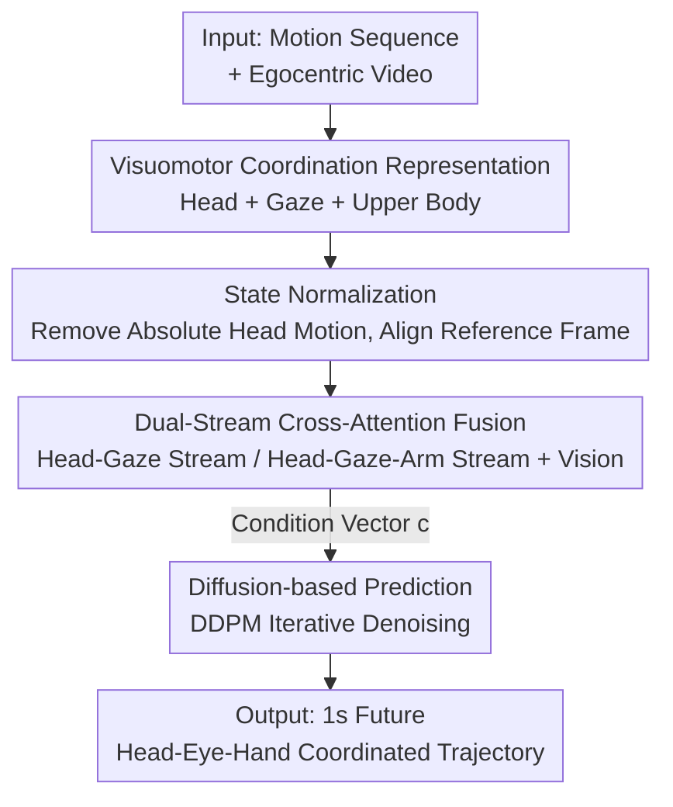

# Learning Predictive Visuomotor Coordination

**Conference**: CVPR 2026  
**arXiv**: [2503.23300](https://arxiv.org/abs/2503.23300)  
**Code**: https://vjwq.github.io/VCR/ (Project Page)  
**Area**: Robotics / Embodied AI / Egocentric Vision  
**Keywords**: Visuomotor Coordination, Egocentric Video, Motion Prediction, Diffusion Models, Head-Eye-Hand Synergy

## TL;DR
This paper unifies "head pose + gaze + upper body joints" into a **Visuomotor Coordination Representation (VCR)**. Using a conditional diffusion model, it predicts coordinated motion for the next 1 second from egocentric video and motion history. On EgoExo4D, it achieves a translation error of 59 mm and a head rotation error of 13.2°, comprehensively outperforming strong baselines like Diffusion Policy.

## Background & Motivation
**Background**: Predicting "what the wearer will do next" in egocentric vision is a core capability for AR glass assistants and robot imitation learning. Previous work has predicted ego-motion, gaze, or hand trajectories separately from egocentric videos.

**Limitations of Prior Work**: These works almost exclusively focus on a **single modality**—predicting only gaze or only hand trajectories—treating head, eye, and hand signals as independent. However, human movement is never isolated: neuroscience shows that during daily tasks (e.g., making a sandwich), humans rely on visual memory from previous fixations to plan actions for the next few seconds. The head turns first, the eyes look first, and then the hand reaches; this is a **predictive coordinated control system**. Modeling them in isolation loses these coupling relationships.

**Key Challenge**: To predict natural human movements, one must simultaneously model the spatio-temporal dependencies between the head, eyes, and hands. However, existing datasets have long lacked synchronized 3D head pose, gaze, and full-body joint annotations, making this "coordination" problem impossible to evaluate quantitatively.

**Goal**: (1) Formalize visuomotor coordination as a **quantifiable predictive task**; (2) Design a generative framework capable of jointly modeling the head, eyes, and upper body.

**Key Insight**: Leveraging the newly emergent EgoExo4D / Nymeria datasets (which include 3D gaze, head pose, and body joint annotations), the authors are the first to treat "coordination" as a unified whole.

**Core Idea**: Bind the three types of signals together using a unified Visuomotor Coordination Representation and use a diffusion model to jointly predict their future trajectories under egocentric visual conditions—**learning coordination as a whole rather than combining three independent predictors**.

## Method

### Overall Architecture
The input consists of a sequence of past visuomotor states $S_{t-\tau:t}$ (approx. 1s, 10 fps) and corresponding egocentric RGB video clips $E_{t-\tau:t}$ (4 fps). The output is the future visuomotor states $\hat{S}_{t+1:t+\Delta}$ for $\Delta$ steps. The pipeline follows four steps: first, define head, eye, and upper body as a unified VCR state; perform "normalization" to remove absolute head motion and retain relative coordination; fuse motion and visual features via dual-stream cross-attention to obtain a condition vector $\mathbf{c}$; finally, generate future trajectories using a DDPM conditioned on $\mathbf{c}$ through iterative denoising.

### Key Designs

**1. Visuomotor Coordination Representation (VCR): Binding Head, Eye, and Hand into One State**

Addressing the pain point that "prior work models only single modalities and loses head-eye-hand coupling," the authors define a joint state $S=\{H,G,U\}$. Here, head pose $H=(\mathbf{p}_{head},\mathbf{R}_{head})$ includes position $\mathbf{p}_{head}\in\mathbb{R}^3$ and orientation $\mathbf{R}_{head}\in SO(3)$, providing a spatial reference frame. Gaze is represented by its endpoint $\mathbf{g}=\mathbf{p}_{head}+\lambda\mathbf{d}_{gaze}$ (where $\mathbf{d}_{gaze}$ is the unit gaze direction derived from head pose and $\lambda$ controls ray length), representing visual attention and intent. The upper body $U=\{\mathbf{j}_i\in\mathbb{R}^3\mid i=1,\dots,6\}$ consists of six joints (shoulders, elbows, wrists), carrying interaction movements. The authors deliberately **include only the upper body and exclude the lower body**—because lower body movement is largely determined by terrain/external constraints and has a weaker link to internal visuomotor coordination; including it would introduce noise. By placing these three signals in a single state vector for joint prediction, the model learns the coordination between them rather than calculating each independently.

**2. Visuomotor State Normalization: Stripping Absolute Head Motion, Retaining Relative Coordination**

In egocentric data, the head is constantly moving and the viewpoint is always changing. Under absolute coordinates, the same "reaching" action looks completely different due to varying viewpoints, making it hard for models to learn stable patterns. The authors perform normalization **based on the head pose of the last observed frame**: using a transformation $\Phi$ to align that frame's head pose to identity rotation $\mathbf{I}$ and translate it to the origin $\mathbf{0}$, obtaining $H^c_t=\Phi(H_t)$. The same $\Phi$ is applied simultaneously to gaze endpoints and upper body joints ($\mathbf{g}^c_t=\Phi(\mathbf{g}_t)$, $U^c_t=\Phi(U_t)$), ensuring internal spatial relationships remain unchanged. For other frames in the time dimension, they are first transformed relative to $S_t$ then mapped to the canonical frame: $S^c_i=T_{i\to t}(S_i)\circ S^c_t$, aligning all frames under a unified reference system. This step eliminates "absolute head motion" as a confounding factor, leaving only the relative coordination between the head, eyes, and hands, making it more robust to viewpoint changes and improving generalization.

**3. Dual-Stream Cross-Attention Fusion: Selective Injection of Visuals into Motion Features**

Egocentric frames always reflect head and gaze direction, but due to occlusion and limited field of view, their relevance to **full-body coordination** is uncertain—forcing visual features into all motion features can introduce noise. The authors thus construct **two motion representations**: one containing only head+gaze $\mathbf{k}^{hg}_t=\text{Concat}(\mathbf{k}^{head}_t,\mathbf{k}^{gaze}_t)$ to capture viewpoint and attention dynamics; another adding the arms $\mathbf{k}^{hga}_t=\text{Concat}(\mathbf{k}^{head}_t,\mathbf{k}^{gaze}_t,\mathbf{k}^{arm}_t)$ to include upper body motion cues. Visual embeddings $\mathbf{v}\in\mathbb{R}^{128}$ are extracted from video by a 3D ResNet, followed by cross-attention on both streams: $\mathbf{k}^{\prime hg}_t=\mathcal{A}(\mathbf{k}^{hg}_t,\mathbf{v},\mathbf{v})$ and $\mathbf{k}^{\prime hga}_t=\mathcal{A}(f_{proj}(\mathbf{k}^{hga}_t),\mathbf{v},\mathbf{v})$. Finally, they are summed $\mathbf{k}^{fused}_t=\mathbf{k}^{\prime hg}_t+\mathbf{k}^{\prime hga}_t$ and fed into a Transformer temporal encoder $\mathcal{T}$ to be flattened into the condition vector $\mathbf{c}$. This "stable head-eye stream, broad head-eye-arm stream" split design allows the model to use visuals fully when reliable and rely on kinematics when visuals are blurred, preventing a single fusion from being misled by occlusions.

**4. Diffusion Visuomotor Prediction: Prediction as Conditional Denoising**

Following the logic of Diffusion Policy, the authors model prediction as a DDPM denoising process. The forward process gradually adds Gaussian noise to the ground truth future state $q(S_t|S_0)=\mathcal{N}(S_t;\sqrt{\bar\alpha_t}S_0,(1-\bar\alpha_t)\mathbf{I})$. The reverse process iteratively denoises under the guidance of condition vector $\mathbf{c}$: $p_\theta(S_{t-1}|S_t,\mathbf{c})=\mathcal{N}(S_{t-1};\mu_\theta(S_t,t,\mathbf{c}),\sigma_\theta^2\mathbf{I})$, where $\mathbf{c}$ remains constant throughout the denoising process. Compared to directly regressing a deterministic trajectory, the diffusion framework naturally models the **multi-modal uncertainty** of actions (multiple reasonable future paths for the same context), resulting in smoother and more temporally coherent trajectories.

### Loss & Training
Training uses the standard DDPM denoising loss $\mathcal{L}=\mathbb{E}_{S_0,t,\epsilon}[\|\epsilon-\epsilon_\theta(S_t,t,\mathbf{c})\|^2]$, predicting the added noise. The visual encoder is pre-trained on Kinetics-400, while the Transformer modules and diffusion model are trained from scratch. Implemented in PyTorch with AdamW, learning rate $5\times10^{-4}$, 400 epochs, batch size 384; training takes about 8 hours on a single H100.

## Key Experimental Results

The dataset is **EgoExo4D**, selecting four types of activities requiring hand-eye coordination: Basketball, Cooking, Bike Fixing, and Health, totaling 23,372 training samples and 5,126 test samples (approx. 15.8 hours). Metrics include PA-MPJPE (structural consistency, joint error after rigid alignment, mm), Head/Gaze/Hand position errors (mm), and Head Rotation Error (HRE, degrees), **all lower is better**, with a prediction horizon of approx. 1s.

### Main Results
| Method | PA-MPJPE↓ | Head Pos.↓ | Gaze Pos.↓ | Hand Pos.↓ | Head Rot.↓ |
|------|-----------|-----------|-----------|-----------|-----------|
| Constant Pose (Copy Last) | 68.3 | 184 | 193 | 274 | 16.7 |
| Constant Velocity (Extrapolation) | 109 | 161 | 201 | 436 | 18.5 |
| Transformer Encoder + MLP | 65.3 | 119 | 135 | 211 | 13.8 |
| Diffusion Policy-CNN | 64.1 | 112 | 132 | 208 | 13.9 |
| **Ours** | **59** | **106** | **124** | **188** | **13.2** |

Compared to Diffusion Policy-CNN, PA-MPJPE improved by 8.6%, head/gaze errors decreased by 5.7%/6.5%, and head rotation by 4.5%. **Hand position** is the most difficult sub-task, where this method achieved the largest gain (274/208→188), proving that unified representation indeed captures head-eye-hand coordination.

### Ablation Study
| Configuration | Head Pos. | Gaze Pos. | Hand Pos. | Head Rot. | Description |
|------|---------|---------|---------|---------|------|
| Complete Visuomotor | 106 | 124 | 188 | 13.2 | Full Input |
| w/o Head Rotation | 111 (+4.7%) | 130 | 195 | — | Remove Head Rot |
| w/o Head Rot. & Gaze | 112 (+5.7%) | — | 196 | — | Remove Gaze as well |
| w/o Head | — | 132 (+6.5%) | 194 | — | Remove all Head info |
| w/o Gaze | 111 | — | 194 | 13.9 (+4.5%) | Remove Gaze |
| w Last Step Arm | 113 (+6.6%) | 141 (+5.2%) | 199 (+5.9%) | 13.7 | Lat frame arm pose only |
| w/o Egocentric Frame | 111 (+4.7%) | 130 | 193 | 14.1 (+6.0%) | Remove Egocentric Video |

### Key Findings
- **Head and Gaze are Key to Coordination**: Removing head rotation and then gaze results in a step-by-step increase in head/gaze/hand errors (hand 188→196), showing head pose significantly impacts overall coordination. Removing gaze also raises head rotation error from 13.4 to 13.9, proving gaze helps stabilize head orientation.
- **Temporal History is Most Critical for Hand Prediction**: Keeping only the last step arm pose (losing motion history) causes hand error to jump by 5.9%; a single frame lacks the temporal context to support upper body prediction.
- **Egocentric Vision Primarily Stabilizes Head and Eye**: Removing vision increases head position error by +4.7% and head rotation by +6.0%. However, gaze error slightly decreases, suggesting the model relies more on kinematics to estimate gaze when vision is absent. Conclusion: "Motion history helps the hands; vision helps the head/eyes"—modality complementarity.
- **Failures**: For sudden unexpected movements like a basketball bouncing (visible only in the very last frame), the model predicts a "standard catch" and ignores the sudden trajectory change—fast motion + occlusion remains the main weakness.

## Highlights & Insights
- **Quantifying "Coordination" from Neuroscience**: While previous works treated head/eye/hand separately, this paper binds them via a VCR state for joint prediction and uses PA-MPJPE/HRE for quantitative comparison—this task formulation is a major contribution.
- **Normalization is a Low-cost, High-reward Trick**: Aligning the sequence to the head pose of the last observed frame strips away absolute head motion as a confounder. This zero-parameter trick significantly improves robustness to viewpoint changes and can be applied to any egocentric motion modeling.
- **Dual-Stream Fusion Reflects Pragmatic Intuition**: Splitting the head-eye and head-eye-arm streams for cross-attention acts as an "on-demand" switch for visual injection, particularly useful in egocentric scenarios where occlusion and limited field-of-view are common.
- **Hand Improvement is the Ultimate Proof**: The hands are the most difficult part and the most dependent on head/eye guidance. Significant success here validates that "coordination modeling" rather than just "adding modalities" is the true source of gain.

## Limitations & Future Work
- The authors admit failures in **fast, unexpected, or heavily occluded** scenes (e.g., a bouncing ball), where subtle cues are insufficient for precise coordination. Future work could introduce explicit contact modeling or environmental reasoning.
- Modeling only the upper body and excluding the lower body avoids terrain priors but limits applicability to walking or full-body tasks.
- The prediction range is only about 1s and only evaluated on four specific activity types in EgoExo4D; generalization to longer horizons or open-world scenarios remains unverified.
- Direct comparison with concurrent works like EgoCast or EgoAgent was not possible due to differences in task definitions/input modalities and lack of public implementations; baselines were primarily Diffusion Policy and Transformer.

## Related Work & Insights
- **vs. Single Modality Prediction (Gaze/Hand Forecasting)**: Previous works predict signals in isolation, ignoring head-eye-hand coupling. This paper proves unified VCR modeling is more accurate, especially for the hands.
- **vs. Full-body Motion Prediction**: Traditional full-body prediction includes the lower body, which is constrained by terrain. By focusing only on the upper body, this work avoids environmental priors and focuses on parts driven truly by visuomotor coordination.
- **vs. Diffusion Policy / Imitation Learning**: Imitation learning often requires demonstrators to act "robot-like" to simplify policy learning, losing natural behavior. This work builds a predictive model for natural human coordination instead, serving as a data-driven foundation for robot imitation learning from human videos.

## Rating
- Novelty: ⭐⭐⭐⭐ First to unify head-eye-hand coordination into a quantifiable prediction task using a diffusion model.
- Experimental Thoroughness: ⭐⭐⭐⭐ Main results and two types of ablations confirm modality contributions, though limited to 1s and four activity types.
- Writing Quality: ⭐⭐⭐⭐ Motivation is grounded in neuroscience; method layers are clear. (Note: minor discrepancy in text vs. table numbers for Constant Velocity PA-MPJPE).
- Value: ⭐⭐⭐⭐ High value for AR assistants and robots learning from human video; normalization and dual-stream fusion tricks are highly reusable.

<!-- RELATED:START -->

## Related Papers

- [\[ICML 2026\] STEP: Warm-Started Visuomotor Policies with Spatiotemporal Consistency Prediction](../../ICML2026/robotics/step_warm-started_visuomotor_policies_with_spatiotemporal_consistency_prediction.md)
- [\[CVPR 2026\] GeoPredict: Leveraging Predictive Kinematics and 3D Gaussian Geometry for Precise VLA Manipulation](geopredict_leveraging_predictive_kinematics_and_3d_gaussian_geometry_for_precise.md)
- [\[CVPR 2026\] Predict Before You Explore: Predictive Planning with Specialized Memory for Embodied Question Answering](predict_before_you_explore_predictive_planning_with_specialized_memory_for_embod.md)
- [\[ICML 2026\] R2R2: Robust Representation for Intensive Experience Reuse via Redundancy Reduction in Self-Predictive Learning](../../ICML2026/robotics/r2r2_robust_representation_for_intensive_experience_reuse_via_redundancy_reducti.md)
- [\[NeurIPS 2025\] Inner Speech as Behavior Guides: Steerable Imitation of Diverse Behaviors for Human-AI Coordination](../../NeurIPS2025/robotics/inner_speech_as_behavior_guides_steerable_imitation_of_diverse_behaviors_for_hum.md)

<!-- RELATED:END -->
