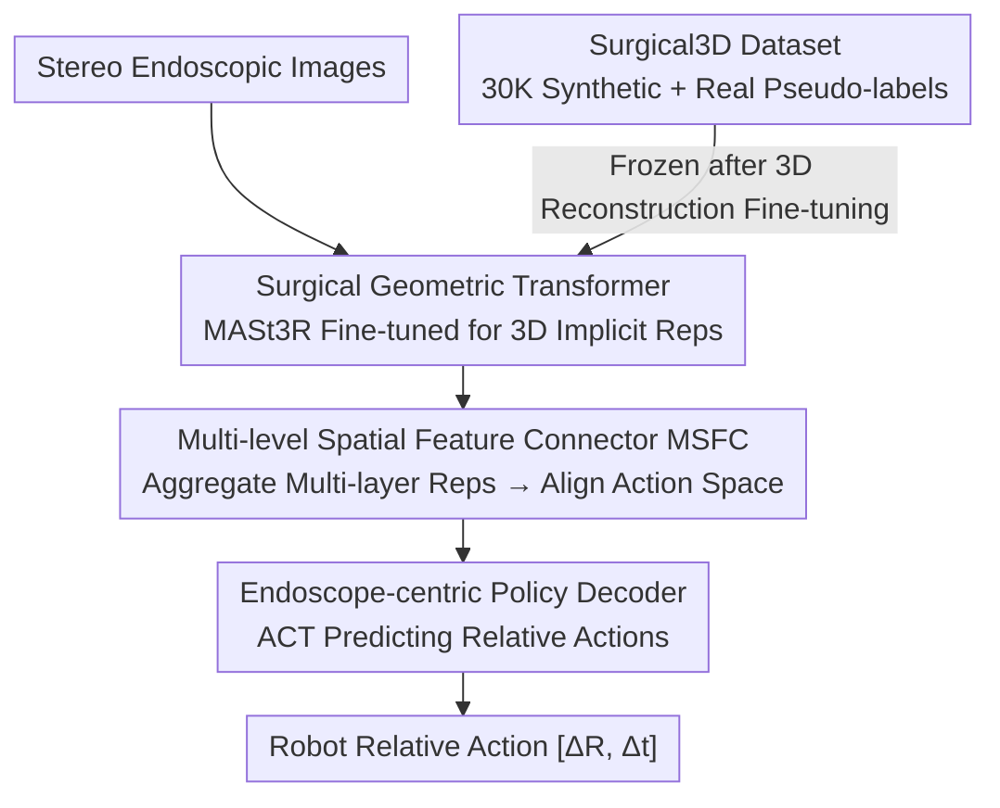

# Learning Surgical Robotic Manipulation with 3D Spatial Priors

**Conference**: CVPR 2026  
**Paper**: [CVF Open Access](https://openaccess.thecvf.com/content/CVPR2026/html/Sheng_Learning_Surgical_Robotic_Manipulation_with_3D_Spatial_Priors_CVPR_2026_paper.html)  
**Code**: To be open-sourced (authors stated dataset and code will be public)  
**Area**: Robotics / Embodied AI  
**Keywords**: Surgical Robotics, Visuomotor Policy, Imitation Learning, 3D Geometric Priors, Stereo Endoscopy

## TL;DR
A feed-forward 3D geometric reconstruction model (MASt3R) is fine-tuned on a self-constructed synthetic surgical dataset to extract 3D implicit representations end-to-end from stereo endoscopic images. These representations are aligned to the robot action space using a lightweight connector, enabling real surgical robots to achieve SOTA success rates in delicate tasks like knot tying and ex-vivo gallbladder dissection without relying on wrist-mounted cameras.

## Background & Motivation
**Background**: Autonomous surgical robots (such as the da Vinci) must operate on minute structures like needles and tissues with millimeter-level precision. A key bottleneck is providing visuomotor policies with 3D spatial awareness. Existing approaches fall into two categories: one uses optimization-based methods (SfM / NeRF / 3DGS) to explicitly reconstruct the surgical scene before learning manipulation skills, while the other (SRT series) mounts wrist cameras on Patient Side Manipulators (PSM) to supplement stereo endoscopic views with multi-view information for end-to-end training.

**Limitations of Prior Work**: Explicit reconstruction is a multi-stage pipeline where reconstruction errors accumulate at each stage and cannot be jointly optimized end-to-end. The wrist camera solution is nearly unfeasible in clinical settings—trocars impose strict spatial constraints on PSM insertion paths, making instruments with extra cameras unable to pass through. Furthermore, wrist cameras are susceptible to damage by blood or water and can obstruct the endoscopic field of view.

**Key Challenge**: Surgical scenes lack 3D supervision, and unlike general tabletop robotics, additional sensors cannot be easily added. While feed-forward geometric models (DUSt3R/MASt3R/VGGT) can rapidly produce implicit representations rich in geometric information, they are rarely trained on surgical images, leading to a massive domain gap. Simply embedding large pre-trained encoders into policy networks often results in performance degradation due to misalignment between representations and task objectives.

**Goal**: (1) Fill the gap in 3D-labeled data for the surgical domain; (2) Enable feed-forward 3D geometric priors to serve fine-grained surgical manipulation policies in an end-to-end, hardware-independent manner.

**Key Insight**: Rather than using explicitly reconstructed point clouds, it is more effective to directly utilize 3D implicit representations from the intermediate layers of a feed-forward geometric model as spatial priors. This bypasses the inefficiency of per-scene optimization and avoids the hardware constraints of wrist cameras.

**Core Idea**: A three-part system consisting of a "Surgical-domain fine-tuned geometric Transformer for 3D implicit representation extraction + a lightweight multi-level connector for action space alignment + an endoscope-centric action frame" is used to inject 3D spatial priors into visuomotor policies end-to-end.

## Method

### Overall Architecture
The method, named Spatial Surgical Transformer (SST), follows a two-step pipeline: **first, fine-tune a geometric Transformer on the self-built Surgical3D synthetic dataset for 3D reconstruction; then, freeze it and feed its multi-layer 3D implicit representations into a policy network to learn manipulation.** Specifically, stereo endoscopic images enter the geometric Transformer to obtain 3D implicit representations. A Multi-level Spatial Feature Connector (MSFC) aggregates representations from different layers and aligns them with the action feature space. An endoscope-centric policy decoder predicts the robot's relative actions $[\Delta R, \Delta t]$ within the endoscope coordinate system.

### Key Designs

**1. Surgical3D Dataset: Filling the 3D annotation gap with hybrid synthetic + real pseudo-label data**

Surgical environments are extremely narrow (organ-to-camera distance often < 10cm), exceeding the range of most 3D sensors, which makes surgical data with 3D annotations extremely scarce. Consequently, feed-forward geometric models generalize poorly. The authors synthesized Surgical3D using NVIDIA Omniverse: integrating 8 types of open-source organ models and surgical instrument assets, plus 10 high-realism meshes obtained by scanning real organs with an iPad. Combined with domain randomization (variable stereo baselines, intrinsics/extrinsics, lighting, and tissue textures), they generated 30K stereo image pairs with corresponding depth maps, point clouds, and extrinsics. To bridge the domain gap (organ morphology and intra-abdominal lighting), they performed another round of mixing: first fine-tuning a VGGT point prediction head on synthetic data, then using it to infer depth pseudo-labels for real surgical videos, keeping only high-confidence regions.

**2. Surgical Geometric Transformer: Choosing lightweight MASt3R over heavy VGGT for real-time stability**

Surgical images present two unique challenges: organ surfaces are often textureless or highly repetitive, making traditional feature matching unreliable; and the narrow stereo baseline means small pixel misalignments accumulate into significant depth errors. The authors chose MASt3R as the prototype—it is feed-forward, independent of camera parameters and feature matching, and produces dense 3D points directly from image pairs while inheriting internet-scale pre-training. In the fine-tuning stage, decoder tokens via a DPT head regress dense point maps in the endoscope frame, using a regression loss that performs scale normalization: $L_{reg}(v,i)=\sum_{v}\sum_{i\in D^v}\|\tfrac{1}{z}X^{v,1}_i-\tfrac{1}{\hat z}\hat x^{v,1}_i\|$ (where $z, \hat z$ are scale factors). For textureless regions, a per-pixel confidence $C^{v,1}_i$ is introduced for weighted regression: $L_{conf}=\sum_v\sum_{i\in D^v}C^{v,1}_i L_{reg}(v,i)-\alpha\log C^{v,1}$.

**3. Multi-level Spatial Feature Connector (MSFC): Bypassing explicit point cloud errors using complementary representations**

Directly feeding explicit 3D point maps into a policy can be biased by reconstruction errors and scale ambiguity. MSFC captures different abstraction levels: lower layers encode fine-grained local details, while higher layers encode global context. Precise surgery requires both accurate object localization and an understanding of overall motion direction. The system takes implicit representations from four decoder layers of the geometric Transformer, projects them to low-dimensional compressions, concatenates them, and uses a lightweight MLP to align them with the action space.

**4. Endoscope-centric Policy Decoder: Unifying perception and action in the same frame and avoiding imprecise forward kinematics via relative poses**

Since 3D implicit representations are defined in the endoscope frame, the action space is also moved to this frame. The primary difference between surgical and general robots is the lack of accurate forward kinematics—PSM Set-Up Joints use potentiometers that are inherently imprecise. The solution is using relative pose representations: the change in end-effector pose $E_i=(R_i,tr_i)\in SE(3)$ between adjacent frames is $a_t=\{(tr^i_{t+1}-tr^i_t,\,(R^i_t)^T R^i_{t+1})\}$. Rotational differences are expressed as Euler angles. The gripper use absolute opening angles. The decoder employs the ACT framework to predict $k$ future actions, which are averaged using exponential weighting $w_i=\exp(-m\cdot i)$ to suppress trajectory jitter.

### Loss & Training
Two stages: (1) Geometric Transformer fine-tuning using the confidence-weighted reconstruction loss $L_{conf}$; (2) Policy learning while freezing the geometric Transformer, minimizing the MSE between predicted and GT actions: $L_{MSE}=\text{MSE}(\hat a_t,\pi_\theta(o_t,x_t))$. The geometric Transformer uses ViT-Large (patch=16, MASt3R initialization). The policy decoder has 12 layers with a hidden size of 768.

## Key Experimental Results

> No public surgical manipulation benchmark exists; the authors deployed SST on a real Torin surgical robot, conducting 10 independent trials for three real tasks: peg pickup, knot tying, and ex-vivo gallbladder dissection.

### Main Results

| Task/Sub-task | Setting | SRT (w/ wrist cam) | ACT | DP | SST (Ours, w/o wrist cam) |
|------|------|------|------|------|------|
| Peg Pickup Test1 | — | 10/10 | 9/10 | 10/10 | 10/10 |
| Peg Pickup Test2 (Large range + depth) | — | 6/10 | 2/10 | 1/10 | **8/10** |
| Knot Tying Grasp | — | 10/10 | 4/10 | 5/10 | **10/10** |
| Knot Tying Loop | — | 3/10 | 0/10 | 1/10 | **7/10** |
| Knot Tying Overall | — | 2/10 | 0/10 | 1/10 | **7/10** |
| Gallbladder Overall | — | — (Excluded) | 0/10 | 0/10 | **6/10** |

SST leads significantly in difficult tasks **without using a wrist camera**. ACT/DP only function in simple peg pickup, failing complex tasks. SRT performs well in peg pickup due to the wrist camera, but lags behind SST in the knot tying "loop" sub-task.

### Ablation Study

| Ablation Dimension | Config | Key Metrics | Note |
|------|------|---------|------|
| Fine-tuned on Surgical3D | w/o ToS | Peg T1/T2: 2/10, 0/10; Acc/Comp: 0.0111/0.0140 | Without tuning, spatial offsets lead to failed grasps |
| Fine-tuned on Surgical3D | w/ ToS (Ours) | Peg T1/T2: 10/10, 8/10; Acc/Comp: 0.0048/0.0064 | Fine-tuning nearly doubles reconstruction accuracy |
| Connector Design | LFC (Last layer only) | Peg 10/10, 0/10; Knot 0 | Limited spatial cues in last layer only |
| Connector Design | MSFC (Ours) | Peg 10/10, 8/10; Knot Grasp/Loop 10/10, 7/10 | Multi-level compact fusion is optimal |

### Key Findings
- **Surgical3D fine-tuning is vital**: Without it, the model fails to learn meaningful behavior for knot tying, proving geometric prior quality is a decisive factor, not just an enhancement.
- **Lightweight models are preferred**: MASt3R inference takes 56.2ms, while VGGT takes 140.4ms. Inference rates below 10Hz introduce motion jitter, making VGGT unsuitable for real-time deployment.
- **Spatial Generalization**: In peg pickup with irregular liver models and large depth variations, SST adaptively grasps based on actual object locations, whereas ACT targets fixed training locations.

## Highlights & Insights
- **Using implicit representations instead of explicit point clouds**: This inherits internet-level priors while avoiding error accumulation and the need for per-scene optimization.
- **Clinical constraints as motivation**: Designing for "endoscope only" visibility is driven by the reality that wrist cameras cannot survive the clinical environment or pass through trocars.
- **Coordinate Consistency**: Unifying perception and action within the endoscope frame is a critical engineering detail that ensures spatial priors are effectively utilized.
- **Robustness**: The combination of relative poses, Euler angles, and ACT weighted averaging successfully addresses imprecise forward kinematics and trajectory jitter.

## Limitations & Future Work
- Evaluation is limited to a real robot with 10 trials per task; sample sizes are small, and no public benchmark is available for cross-comparison.
- Success rates in dissection are lower (6/10) due to difficulties in localizing the gallbladder-liver boundary.
- The geometric Transformer is frozen after training; allowing the policy to fine-tune the geometric representation might improve task adaptation.
- Only three tasks were evaluated; bridging the gap to varied clinical workflows remains a challenge.

## Related Work & Insights
- **vs. SRT Series**: SRT relies on wrist cameras for multi-view data, which is clinically unfeasible. SST achieves better results on knot tying loops and dissection using only the default endoscope.
- **vs. Explicit Reconstruction (SfM/NeRF/3DGS)**: These are multi-stage and cannot run in real-time. SST is end-to-end and uses feed-forward implicit representations for better efficiency.
- **vs. Standard Policies (ACT/DP)**: Applying standard policies to single-view endoscopic input fails in complex tasks due to a lack of geometric priors.
- **vs. Stronger Encoders**: Simply replacing the encoder often leads to performance drops; the MSFC multi-level alignment is key to utilizing foundation model representations correctly.

## Rating
- Novelty: ⭐⭐⭐⭐ 
- Experimental Thoroughness: ⭐⭐⭐ 
- Writing Quality: ⭐⭐⭐⭐ 
- Value: ⭐⭐⭐⭐ 

<!-- RELATED:START -->

<!-- RELATED:END -->

## Related Papers

- [\[CVPR 2026\] DiffuView: Multi-View Diffusion Pretraining for 3D-Aware Robotic Manipulation](diffuview_multi-view_diffusion_pretraining_for_3d_aware_robotic_manipulation.md)
- [\[CVPR 2026\] PointWorld: Scaling 3D World Models for In-The-Wild Robotic Manipulation](pointworld_scaling_3d_world_models_for_in-the-wild_robotic_manipulation.md)
- [\[CVPR 2026\] ActiveVLA: Injecting Active Perception into Vision-Language-Action Models for Precise 3D Robotic Manipulation](activevla_injecting_active_perception_into_vision-language-action_models_for_pre.md)
- [\[ICLR 2026\] From Spatial to Actions: Grounding Vision-Language-Action Model in Spatial Foundation Priors](../../ICLR2026/robotics/from_spatial_to_actions_grounding_vision-language-action_model_in_spatial_founda.md)
- [\[CVPR 2026\] Structural Action Transformer for 3D Dexterous Manipulation](structural_action_transformer_for_3d_dexterous_manipulation.md)

<!-- RELATED:END -->
