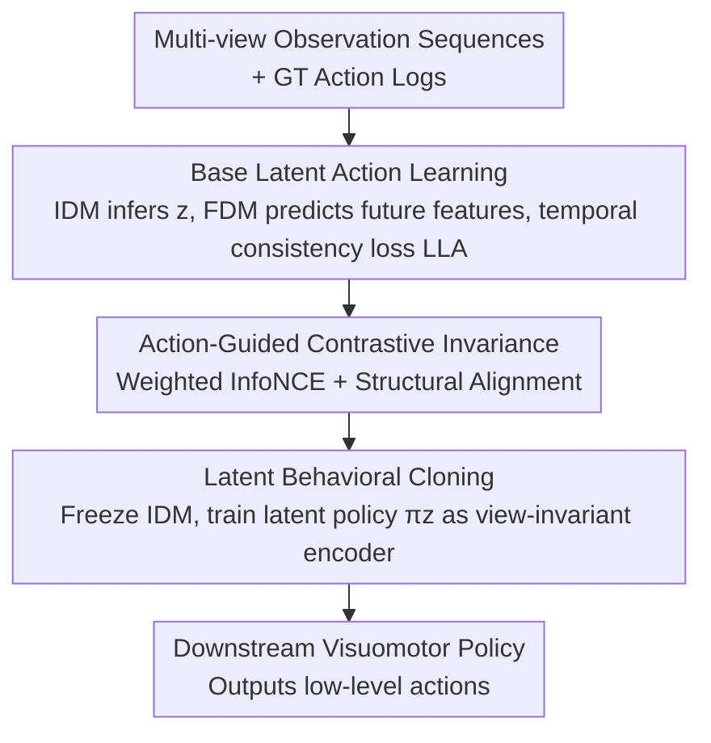

# Learning to Act Robustly with View-Invariant Latent Actions

**Conference**: CVPR 2026  
**Paper**: [CVF Open Access](https://openaccess.thecvf.com/content/CVPR2026/html/Jeong_Learning_to_Act_Robustly_with_View-Invariant_Latent_Actions_CVPR_2026_paper.html)  
**Code**: To be confirmed  
**Area**: Robotics/Embodied AI  
**Keywords**: View-Invariance, Latent Actions, Visuomotor Policy, Contrastive Learning, Robot Pre-training

## TL;DR
VILA proposes that view-invariance should not be imposed on the "visual representation of the entire scene," but rather solely on "action-related dynamic changes." It learns a compact latent action encoding adjacent frame changes via IDM/FDM, then uses ground-truth action sequences for action-guided weighted contrastive learning and structural alignment to align latent actions of the same movement across different views. Finally, this latent policy serves as a view-invariant encoder to condition downstream policies, achieving significantly higher robustness to unseen views and new tasks in both simulation and real-world experiments.

## Background & Motivation
**Background**: Vision-based robot policies are extremely fragile to camera viewpoint changes; even slight shifts can lead to a collapse in success rates. Dominant solutions fall into two categories: ones acting on the "observation level" using New View Synthesis (NVS) or geometric inputs to augment views (or explicitly feeding camera intrinsics/extrinsics to the policy), and others acting on the "representation level" by pre-training a visual encoder stable to camera motion.

**Limitations of Prior Work**: Both categories share the goal of "forcing robustness at the image level"—requiring a compact feature vector to summarize the entire image (static layout, background, etc.) while also carrying all task-related motion information. This demands invariance from a representation that is "much wider than necessary for control," which is unnecessarily harsh and fails to distinguish between "static context" and the "dynamics that truly drive action."

**Key Challenge**: Scene-level representations mix "task-related motion" with "static appearance/background." Forcing view-invariance on this mixture wastes model capacity on "what the scene looks like from a certain angle" rather than "how the agent and objects move." Control specifically requires the latter.

**Goal**: Shift the target of invariance from "static scene-level visual representations" to "action-related dynamic changes" and solve two sub-problems: (1) How to learn a compact dynamic representation that only encodes "changes between adjacent observations"? (2) Given multi-view robot data (where action logs are typically available), how to use action information to align the same movement across different views into a view-invariant form?

**Key Insight**: The authors observe that representations of "change" are naturally more compact than "appearance," primarily characterizing how agents and objects move rather than the entire scene's appearance. Thus, they are more natural and efficient carriers for view-invariance. Latent actions are precisely such "compact codes that explain changes between adjacent observations."

**Core Idea**: Force view-invariance in the latent action space (rather than the scene-level representation space) by using ground-truth action sequences as supervision signals for cross-view alignment, pulling latent actions of the same movement from different cameras closer together.

## Method

### Overall Architecture
VILA consists of two stages. **Stage 1 (Latent Action Learning)**: On top of LAOM-style base latent action learning, an "action-guided contrastive invariance" objective is added to learn a compact, view-invariant latent action representation grounded in physical dynamics. **Stage 2 (Latent Behavioral Cloning)**: The Stage 1 Inverse Dynamics Model (IDM) is frozen, and a latent policy $\pi_z$ is trained—it predicts latent actions from the current observation alone, thereby acting as a view-invariant visual encoder to condition downstream visuomotor policies (e.g., Diffusion Policy) that output low-level actions. Future frames are not required during inference.

### Key Designs

**1. Base Latent Action Learning: Learning compact codes for "inter-frame changes" via IDM/FDM**

To address the issue of scene-level representations mixing appearance and motion, this step builds a foundation that purely characterizes dynamics (following LAOM) without view-invariance. Let $o_t^v$ be the observation at time $t$ and view $v$; the visual encoder $E$ provides features $s_t^v = E(o_t^v)$. Sample a time offset $k \in \{1,\dots,K\}$ to get $s_{t+k}^v$. The Inverse Dynamics Model (IDM) infers the latent action $z_t^v = \mathrm{IDM}(s_t^v, s_{t+k}^v)$, and the Forward Dynamics Model (FDM) predicts future features $\hat{s}_{t+k}^v = \mathrm{FDM}(s_t^v, z_t^v)$. The temporal consistency loss is $L_{\text{LA}} = \mathbb{E}\big[\lVert \mathrm{FDM}(s_t^v, z_t^v) - s_{t+k}^{\text{tgt},v} \rVert_2^2\big]$, where the target feature $s_{t+k}^{\text{tgt},v}$ comes from a target encoder $E^{\text{tgt}}$ (an EMA of the online encoder $E$ without gradient backpropagation). This forces $(E, \mathrm{IDM}, \mathrm{FDM})$ to discover a compact latent action $z$ that explains the transition $o_t \to o_{t+k}$ without needing to reconstruct pixels. Being defined on "change," it naturally favors motion over static appearance, providing a better carrier for view-invariance than scene-level representations.

**2. Action-Guided Contrastive Invariance: Aligning the same movement across views using ground-truth actions**

This is the core innovation of the paper, addressing "how to align latent actions across views." The intuition is: if two transitions correspond to similar future ground-truth action sequences, their latent actions should be close. When constructing a batch, offset $k$ is sampled, then $N$ base time steps are sampled, and $V$ random views are sampled for each step, resulting in $B = NV$ latent action samples. Each sample is associated with its ground-truth action sequence $A_i^{\text{GT}} \in \mathbb{R}^{k\times D}$. First, the normalized squared distance $d_{ij} = \lVert A_i^{\text{GT}} - A_j^{\text{GT}} \rVert_F^2 / (kD)$ is defined, then converted into soft weights $w_{ij} = \exp(-d_{ij}/\beta) / \sum_\ell \exp(-d_{i\ell}/\beta)$ (where $\beta$ controls distribution sharpness; more similar actions receive higher weights). **Local structure** is refined using weighted InfoNCE: $L_{\text{W-NCE}} = -\sum_i \sum_{j\neq i} w_{ij}\log\frac{\exp(\mathrm{sim}(z_i,z_j)/\tau)}{\sum_\ell \exp(\mathrm{sim}(z_i,z_\ell)/\tau)}$, where $\mathrm{sim}$ is cosine similarity. **Global structure** is aligned via a structural alignment loss: cosine similarity matrices $S_z, S_{\text{GT}}$ are constructed from L2-normalized latent actions and ground-truth actions, respectively, and $L_{\text{struct}} = \lVert S_{\text{GT}} - S_z \rVert_F^2$ is used to align the global similarity structure of the latent action space with the action space. The total representation loss is $L_{\text{VILA}} = L_{\text{LA}} + \lambda_1 L_{\text{W-NCE}} + \lambda_2 L_{\text{struct}}$. Unlike latent action pre-training on "unlabeled internet videos," VILA targets multi-view robot learning where action logs are readily available as natural supervision for cross-view alignment.

**3. Latent Behavioral Cloning: Treating the latent policy as a view-invariant encoder**

How is the learned view-invariance transferred to downstream policies? The authors train a latent policy $\pi_z$ to predict latent actions directly from the current observation: $L_{\text{BC}} = \lVert \pi_z(s_t^v) - \mathrm{IDM}(s_t^v, s_{t+k}^v) \rVert_2^2$, where the IDM is frozen after Stage 1. Since $\pi_z$ operates within the pre-trained latent action space, it **inherits the view-invariant and structured properties** of that space. During fine-tuning, $\pi_z$ predicts latent actions from the current observation alone (no future frames needed), which then serve as conditions for the downstream policy to output low-level actions. In other words, $\pi_z$ is not a standard policy but an encoder that "maps any view observation to the same view-invariant latent action," seamlessly piping Stage 1's invariance to the control side.

## Key Experimental Results

Evaluation setup: Simulation used five RoboSuite tasks (Lift / Square / Stack Three / Coffee / Mug Cleanup). For each trajectory, $5\times5=25$ views were constructed over azimuth $[-90°, +90°]$ and elevation $[-15°, +15°]$. 10 views were fixed for training (seen), and 15 were held out for evaluation (unseen), alongside 8 extrapolation views. Real-world experiments used SO-ARM101 for pick-and-place with ZeroNVS view augmentation (4 training, 3 testing). Downstream utilized Diffusion Policy with 20 episodes per view (sim) and 10 episodes per view (real). Rel. = Ratio of unseen/seen success rate (higher indicates less drop-off on unseen views).

### Main Results (Simulation, Fine-tuning, unseen success rate %)

| Task | VILA (Ours) | Vanilla | CLASS | ReViWo | Note |
|------|-----------|---------|-------|--------|------|
| Lift | **94.70** | 77.00 | 65.00 | 38.00 | Best across all unseen tasks |
| Square | **19.80** | 8.70 | 9.00 | 0.35 | High precision, high difficulty |
| Stack Three | **53.65** | 23.70 | 10.35 | 0.00 | Multi-block stacking |
| Coffee | **12.65** | 0.35 | 0.35 | 0.00 | Baselines nearly all failed |
| Mug Cleanup | **27.85** | 9.70 | 6.35 | 0.00 | Long-horizon multi-step |

Under the frozen encoder setting, VILA is the only method that maintains non-trivial success rates on most tasks (others often collapse to near 0 on unseen views). ⚠️ Numbers are based on processed table data; refer to Table 1 in the original paper for precise values.

### Extrapolation, Real-world & Task Transfer

| Evaluation | VILA | Strongest Baseline | Note |
|------|------|---------|------|
| Extrapolation Lift (Table 2) | **93.10** | CLASS 51.30 | 8 views outside the training grid |
| Extrapolation Stack Three | **35.00** | Vanilla 6.25 | Baselines failed extensively |
| Real-world 3 Unseen Views (Table 3) | **63.33** | π0.5 36.67 | Outperformed VLA baselines π0.5 / SmolVLA (33.33); Vanilla only 3.33 |
| Task Transfer Stack Three→Coffee | Consistently > Vanilla | Other encoders often worse than Scratch | Provides better priors at all label budgets |

### Ablation Study (Lift task, Fine-tuning, unseen %, Table 4)

| Configuration | Unseen | Rel. | Note |
|------|--------|------|------|
| VILA (full: $L_{\text{LA}}$+$L_{\text{W-NCE}}$+$L_{\text{struct}}$) | **94.70** | 95.18 | Full objective |
| Structural loss replaced with CKA alignment | 92.00 | 93.40 | Distance-based structural loss is better |
| w/o Structural loss (only $L_{\text{LA}}$+$L_{\text{W-NCE}}$) | 91.70 | 92.63 | Performance drop |
| Standard Contrastive ($L_{\text{LA}}$+$L_{\text{NCE}}$) | 90.00 | 94.24 | Action weights helpful but not mandatory |
| w/o Contrastive (only $L_{\text{LA}}$+$L_{\text{struct}}$) | 84.30 | 84.72 | Largest drop; contrastive term is key |

### Key Findings
- **Weighted contrastive term is the primary driver:** Removing $L_{\text{W-NCE}}$ (leaving only $L_{\text{LA}}$+$L_{\text{struct}}$) caused the unseen rate to plummet from 94.70 to 84.30, the most severe drop in the ablation. This confirms that "action-guided alignment of identical motions across views" is the main engine for view-invariance.
- **Invariance on Dynamics >> Invariance on Scenes:** Scene-level invariance baselines (CLASS, ReViWo) often collapsed to near 0 on difficult tasks and unseen/extrapolation views. VILA remained functional, validating that imposing invariance on action-related changes is far more efficient and effective than doing so on the entire image.
- **Latent action priors are more transferable:** In cross-task transfer, other multi-view pre-trained encoders were often worse than Vanilla (scratch), as scene-level invariance tends to overfit task appearance. VILA’s priors are view-generalized and dynamics-centric, remaining useful even with limited target data.
- **Outperforming VLA baselines:** In real-world tests, VILA (63.33) outperformed π0.5 (36.67) and SmolVLA (33.33), suggesting that current VLAs remain fragile to camera changes and that explicit invariance objectives are a complementary path to improving VLA robustness.

## Highlights & Insights
- **"Changing the target" is the critical move:** Rather than inventing a new loss, simply relocating view-invariance from "scene-level visual representations" to "latent actions (inter-frame changes)" significantly narrows the problem from "making a wide representation omnipotent" to "aligning a narrow dynamic." This saves capacity and is more task-aligned.
- **Practical use of existing action logs for alignment:** Unlike unsupervised latent actions from internet videos, robot action logs are readily available. VILA uses the similarity of ground-truth action sequences as soft labels for cross-view alignment at essentially zero extra labeling cost.
- **Dual-purpose design of Latent Policy as Encoder**: $\pi_z$ serves as both the strategy to predict latent actions and the encoder for the downstream policy. By freezing the IDM, Stage 1's invariance is passed to control "for free," resulting in a clean architecture.
- **Local + Global Dual Alignment**: Weighted InfoNCE handles local neighborhood structure while the Frobenius structural loss handles the global similarity matrix. Constraining the latent action space at both scales proved essential in ablations.

## Limitations & Future Work
- **Dependence on Ground-truth Action Sequences**: Alignment supervision relies on action logs; it cannot be directly applied to pure video data without action labels. Although unweighted variants are still relatively strong, the full method assumes action availability.
- **Reliance on Synthetic Multi-view Data**: Real-world experiments used ZeroNVS to augment views rather than true multi-camera acquisition. The gap between synthetic and real views might affect the generalizability of the conclusions.
- **Hyperparameter Sensitivity**: Parameters like $\beta, \tau, \lambda_1, \lambda_2$ and the offset range $K$ require tuning. Experiments showed sensitivity to the offset range (approx. 10 steps was optimal) and distance metrics (L2/Cosine better than DTW).
- **Future Directions**: Exploring alternative alignment signals without action labels (e.g., self-supervised motion consistency); integrating latent action invariance into VLA foundation models rather than just Diffusion Policy; and scaling to longer-horizon, contact-rich real-world tasks.

## Related Work & Insights
- **vs. CLASS**: Also uses weighted InfoNCE based on ground-truth action sequence distances, but CLASS applies it to **scene-level** representations. VILA applies it to **latent actions**. Ablations show scene-level invariance collapses on difficult tasks/unseen views, proving the choice of "target" is key.
- **vs. ReViWo**: Learns scene-level view-invariant representations via multi-view observation decomposition. It failed on Square/Coffee tasks, while VILA’s dynamics-centric representation remained stable.
- **vs. Know Your Camera (KYC)**: Explicitly conditions the policy on camera parameters. VILA does not require intrinsics/extrinsics, implicitly gaining invariance through latent action alignment.
- **vs. Standard Latent Action Models (LAOM, etc.)**: These optimize latent actions to be "predictable and useful for control" but do not explicitly target view robustness. VILA retains their objectives while adding multi-view action-guided regularization.
- **vs. VLA (π0.5 / SmolVLA)**: VILA outperformed these in real-world tests, indicating that large VLA models remain fragile to camera variations and benefit from explicit invariance objectives.

## Rating
- Novelty: ⭐⭐⭐⭐⭐ "Relocating view-invariance from scene-level representations to latent actions (dynamic changes)" is a clear and rare perspective shift, strongly supported by experiments.
- Experimental Thoroughness: ⭐⭐⭐⭐ Five simulation tasks + extrapolation views + real-world + task transfer + detailed ablations. Real-world reliance on NVS synthetic views is a minor caveat.
- Writing Quality: ⭐⭐⭐⭐ The motivation (why dynamics-centric) is explained thoroughly; formulas and the two-stage process are clearly presented.
- Value: ⭐⭐⭐⭐⭐ View robustness is a core pain point for real-world deployment. The method is plug-and-play (as an encoder) and outperforms VLA baselines, making it highly practical.

<!-- RELATED:START -->

## Related Papers

- [\[CVPR 2026\] Learning to See and Act: Task-Aware Virtual View Exploration for Robotic Manipulation](learning_to_see_and_act_task-aware_virtual_view_exploration_for_robotic_manipula.md)
- [\[CVPR 2026\] MM-ACT: Learn from Multimodal Parallel Generation to Act](mm-act_learn_from_multimodal_parallel_generation_to_act.md)
- [\[ICML 2026\] From Imagined Futures to Executable Actions: Mixture of Latent Actions for Robot Manipulation](../../ICML2026/robotics/from_imagined_futures_to_executable_actions_mixture_of_latent_actions_for_robot_.md)
- [\[CVPR 2026\] Training One Model to Master Cross-Level Agentic Actions via Reinforcement Learning](training_one_model_to_master_cross-level_agentic_actions_via_reinforcement_learn.md)
- [\[CVPR 2026\] CoMo: Learning Continuous Latent Motion from Internet Videos for Scalable Robot Learning](como_learning_continuous_latent_motion_from_internet_videos_for_scalable_robot_l.md)

<!-- RELATED:END -->
