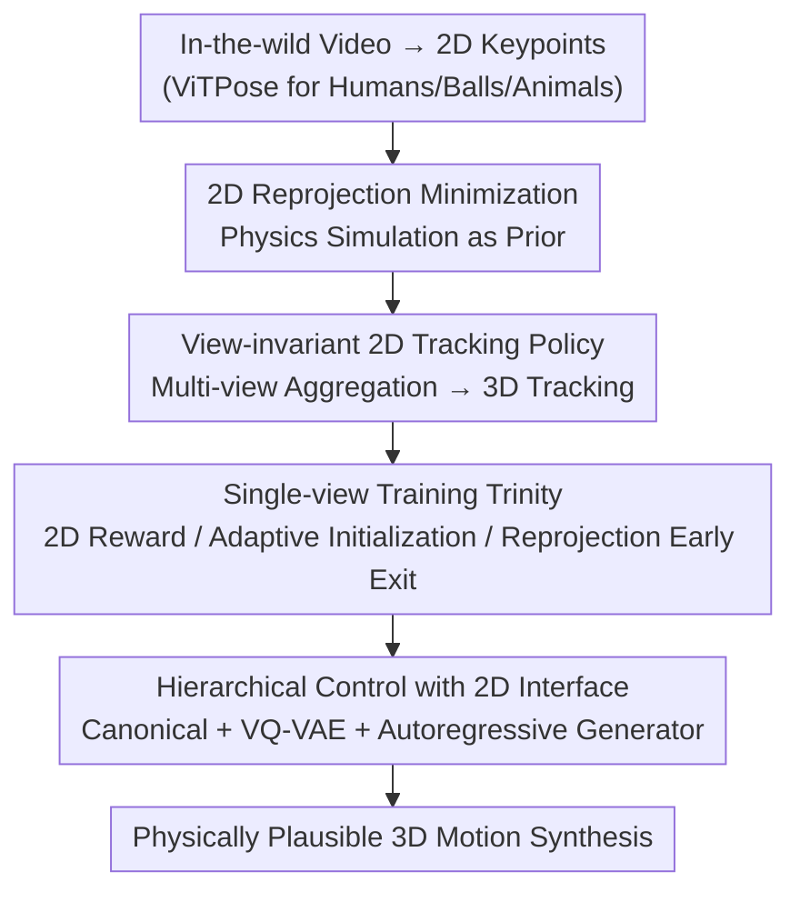

# Learning to Control Physically-simulated 3D Characters via Generating and Mimicking 2D Motions

**Conference**: CVPR 2026  
**Paper**: [CVF Open Access](https://openaccess.thecvf.com/content/CVPR2026/html/Li_Learning_to_Control_Physically-simulated_3D_Characters_via_Generating_and_Mimicking_CVPR_2026_paper.html)  
**Code**: https://jiannli.github.io/mimic2dm/ (Project Page)  
**Area**: Robotics / Physically-simulated Character Control  
**Keywords**: Physically-simulated character control, Reinforcement Learning, 2D motion mimicking, View-invariant policy, Hierarchical control

## TL;DR
Mimic2DM reformulates "learning physically controllable characters from video" as a pure 2D reprojection tracking problem. Using only 2D keypoints extracted from in-the-wild videos and leveraging physical simulation as a prior to filter infeasible poses, it trains a view-invariant tracking policy. This policy is extended to 3D tracking via multi-view feature aggregation in a zero-shot manner and integrated with an autoregressive 2D motion generator to form a hierarchical controller. It synthesizes physically plausible motions like dancing, soccer dribbling, and quadruped locomotion without ever touching explicit 3D motion data.

## Background & Motivation

**Background**: Training physically-simulated character controllers (outputting PD targets in simulators like Isaac Gym via RL to learn skills) currently relies on Motion Capture (MoCap) data for motion tracking rewards or style discriminators. While effective, MoCap collection is expensive and depends on professional actors and specialized equipment. To reduce costs, recent work has shifted toward using video as a data source.

**Limitations of Prior Work**: Existing "video-to-skill" methods are almost all **two-stage**—first estimating 3D motion trajectories from video using off-the-shelf 3D human pose estimators, then performing physics-based imitation. However, 3D estimators lack physical constraints and frequently produce physically infeasible poses; such flawed 3D supervision severely hinders or even completely breaks policy learning. Worse, these reconstructors rely heavily on large-scale 3D training sets, making them inapplicable in domains where 3D data is extremely scarce (e.g., complex human-object interaction HOI, non-human characters).

**Key Challenge**: 2D-to-3D inversion is an ill-posed problem. Forcing 3D reconstruction before imitation is equivalent to "over-constraining" the physical imitator with noise as ground truth. Meanwhile, the actual constraints capable of ensuring physical plausibility (the simulator itself) are placed in the second stage, not participating in the interpretation of 2D evidence.

**Goal**: Skip the intermediate 3D reconstruction step and learn control policies directly from ubiquitous 2D motions, covering humans, HOI, and non-human characters.

**Key Insight**: Although 2D observations lack depth, **physical simulation inherently provides a strong prior** that automatically filters out infeasible states. In-the-wild videos naturally come from diverse perspectives; stacking 2D constraints from different views is sufficient to implicitly characterize 3D structures (see Figure 2 in the paper: under a single view, both orange and gray characters can perfectly align with the same 2D reference, causing ambiguity that multi-view resolves).

**Core Idea**: Unify motion reconstruction and motion imitation into a single "physically-constrained 2D reprojection minimization" problem, solved end-to-end via RL, allowing physical simulation rather than external reconstructors to guarantee 3D plausibility.

## Method

### Overall Architecture
The input to Mimic2DM is a 2D keypoint sequence extracted from in-the-wild videos using ViTPose (including human joints, soccer balls, and animal keypoints). The output is a control policy that drives a character in a simulator such that its 3D motion, when projected to a specified camera view, aligns precisely with the 2D reference. The pipeline consists of four parts: reformulating the imitation problem as a 2D reprojection minimization; training a **view-invariant** single-view tracking policy (assisted by three training techniques); extending this zero-shot to 3D tracking via multi-view feature aggregation; and finally using it as a low-level controller coupled with an autoregressive 2D motion generator to form a hierarchical framework for long-range synthesis and interaction control. 2D motion serves as the unified interface between the high-level generative model and low-level physical control.

### Key Designs

**1. 2D Reprojection Minimization: Unifying Reconstruction and Imitation**

To address the issue of infeasible supervision from two-stage methods, the authors define the objective directly in 2D: given 2D motions $X \in \mathbb{R}^{T \times J \times 2}$, find a policy $\pi$ such that $\min_\pi \mathbb{E}_{s_0 \sim d(s_0)} \lVert P_\pi(C) - X \rVert$, subject to $f_\pi = 0$ (physics constraints and MDP dynamics), where $P_\pi(C)$ is the 2D projection of 3D joints synthesized by the policy under camera $C$. Physics constraints are thus directly integrated into the interpretation of 2D evidence—the simulator automatically regularizes unreasonable 3D solutions, ensuring plausibility. Camera parameters $C$ and the initial state distribution $d(s_0)$ are jointly estimated from the source video using SMPLify-like optimization (minimizing 2D reprojection error) and remain **fixed** during policy training.

**2. View-invariant 2D Tracking Policy + Multi-view Aggregation for 3D Tracking**

Optimizing single-view reprojection alone suffers from depth ambiguity, leading to unnatural poses. The authors intentionally **strip explicit camera view information** from the observations, forcing the policy to infer the view of the reference motion solely based on the character's actual 2D projection in simulation. Consequently, it learns to satisfy reprojection constraints for any view, implicitly gaining 3D understanding. The observation is $o^{2D|C}_t = [P(x^{3D}_t, C),\ x_{t:t+L}]$, representing the projection of current 3D keypoints plus future $L$ frames of 2D reference; the policy also takes proprioception $s^{prop}_t$ and external object states $s^{ext}_t$, outputting a diagonal Gaussian over the action space (PD targets). A key benefit is that because the policy is view-invariant, multiple views $\{X_k, C_k\}_{k=1}^K$ can be **aggregated via feature averaging** $o^{agg}_t = \frac{1}{N}\sum_i \phi(o^{2D_i}_t)$ and fed into the same policy $\pi_{mv}(a_t|s^{prop}_t, o^{agg}_t)$. This upgrades the single-view policy to a multi-view 3D tracker **without any fine-tuning**, matching the accuracy of 3D-supervised baselines.

**3. Single-view Training Trinity: 2D Reward + Adaptive State Initialization + Reprojection Early Exit**

With only 2D supervision, standard 3D imitation paradigms fail. The authors introduce three fixes. The reward combines 2D distance tracking and energy penalties: $r_t = w_p r^p_t + w_e r^e_t$, where $r^p_t = \exp(-\alpha \sum_j \lVert P(x^{3D|j}_t) - x^j_t \rVert)$ directly minimizes reprojection error and $r^e_t = -\sum_j \dot{q}^j_t \cdot \tau^j_t$ penalizes joint velocity $\times$ torque. **Adaptive State Initialization (ASI)** replaces RSI: since no reliable 3D reference exists, the authors maintain a state buffer for each reference frame. During training, the critic network scores rolled-out states; high-scoring states are saved back to the buffer, and sampling probabilities are exponentially weighted by scores, gradually replacing infeasible initial states with feasible ones. **Reprojection Early Exit** terminates an episode immediately if the projected pose deviates significantly from the 2D reference, preventing unrecoverable states and improving efficiency.

**4. Hierarchical Control with 2D Interface: Canonical Representation + VQ-VAE + Autoregressive Generator**

To move from "tracking" to "generation," the authors add a kinematic 2D generator atop the tracking policy. Raw 2D coordinates have high variance due to global translation/scaling, so a **canonical representation** is defined: each frame is decomposed into root translation $x^{root}$, scale $s$, and local pose $\bar{x} = (x - x^{root})/s$. Including relative scale change $\delta s_t = \log(s_t/s_{t-1})$ and normalized root translation $\delta x^{root}_t = (x^{root}_t - x^{root}_{t-1})/s_t$, we get $x^{can}_t = (\bar{x}_t, \delta x^{root}_t, \delta s_t)$, which is reversibly convertible to absolute coordinates $X^{can} = G(X)$. A **VQ-VAE** discretizes canonical sequences into compact tokens, adding an absolute coordinate reconstruction loss $L_{rec} = \lVert X^{can} - \hat{X}^{can} \rVert + \omega \lVert G^{-1}(X^{can}) - G^{-1}(\hat{X}^{can}) \rVert$ to ensure global consistency. Finally, a GPT-style **causal transformer** models $p(c) = \prod_i p(c_i | c_0,\dots,c_{i-1})$ for real-time infinite generation. Generated 2D references are converted back to global coordinates and fed to the view-invariant tracking policy under any chosen projection view.

### Loss & Training
The policy is an MLP (hidden layers 512/256/256) in Isaac Gym (control 30Hz, physics 60Hz); VQ-VAE codebook size 512, embedding dimension 128; autoregressive transformer has 4 layers, 4 heads, embedding dimension 128. Single-view tracking policies were trained for approximately one week on AIST++ and Dribble (4×NVIDIA P40), and three days for animal motions.

## Key Experimental Results

**Key Metrics**: **Succ.↑** success rate (failure if max reprojection >100 pixels); **E2D↓** 2D tracking error (pixels); **EO2D↓** 2D tracking error of objects in HOI; **E3D↓** 3D tracking error (mean joint position error); **Jitters↓** third derivative of joint positions (smoothness); **FID↓** distribution distance between synthesized and reference motions (calculated on 2D projections).

### Main Results
Comparison against the representative two-stage baseline Sfv* (3D estimation followed by physical imitation, with upgraded reconstruction modules) on Soccer Dribble and Animal datasets:

| Dataset | Method | Succ.↑ | E2D↓ | EO2D↓ | Jitters↓ |
|--------|------|--------|------|-------|----------|
| Soccer Dribble | Sfv* w/ SLAHMR | 47.8 | 19.9 | 38.2 | 2.62 |
| Soccer Dribble | Sfv* w/ SMPLify | 37.1 | 25.1 | 42.0 | 2.54 |
| Soccer Dribble | **Ours** | **91.3** | **17.1** | **17.5** | **1.69** |
| Animal | Sfv* w/ SMPLify | 50.0 | 68.9 | — | 9.20 |
| Animal | **Ours** | **83.3** | **26.8** | — | **3.36** |

The success rate nearly doubled, object tracking error (EO2D) halved, and jitter significantly decreased—baselines struggled with complex ball-foot interaction and quadruped movement due to inaccurate 3D reconstruction.

On AIST++ large-scale imitation and generation, 2D supervision approaches the performance of ground truth 3D supervision:

| Training Data | Input | Succ.↑(Test) | E3D↓(Test) | E2D↓(Test) | Jitters↓(Test) |
|----------|------|--------------|------------|------------|----------------|
| 3D (GT) | 3D | 89 | 141 | 21.3 | 2.99 |
| 2D | 1 View | 82.5 | 254.6 | 38.6 | 1.79 |
| 2D | 2 Views | 88.0 | 164.9 | 24.5 | 1.60 |
| 2D | 3 Views | 88.9 | 161.5 | 24.1 | 1.60 |

### Ablation Study
| Configuration | Succ.↑ | E2D↓ | EO2D↓ | Jitters↓ | Notes |
|------|--------|------|-------|----------|------|
| Ours (Dribble) | 91.3 | 17.1 | 17.5 | 1.69 | Full model |
| w/ Rnd. | 83.2 | 22.1 | 26.1 | 1.92 | Ball randomized in 1×1m area at inference |
| w/ Rnd. + Force | 72.6 | 27.4 | 29.9 | 2.03 | + 300N random force every 2s |
| w/ Noisy S.I. | 93.4 | 21.6 | 24.5 | 1.92 | Training initial pose with σ=0.5 noise |

### Key Findings
- Even under randomized ball initialization and periodic 300N external forces, the policy recovers and maintains tracking (Succ. 72.6%), proving it learns stable physical control rather than rote trajectory memorization.
- Adding noise to initial poses (Noisy S.I.) during training does not degrade learning (Succ. 93.4%), suggesting the method is insensitive to initial states and ASI can self-correct.
- View diversity is critical for learning complex skills: policies trained on homogeneous views exhibit unnatural motions and fail at interactions like "lifting a box."
- Autoregressive generators significantly outperform diffusion baselines in driving low-level controllers (AIST++ FID 2.44 vs 5.92, Succ. 0.92 vs 0.44), as they are better suited for producing stable 2D guidance.

## Highlights & Insights
- Collapsing "reconstruction + imitation" into a single 2D reprojection constraint optimization transforms the simulator from an "after-the-fact corrector" into a "prior for interpreting 2D evidence"—this is a paradigm-level simplification and the root cause for its success with HOI and non-human data.
- The concept of "stripping camera info to force view-invariance $\rightarrow$ zero-shot 3D via feature averaging" is clever: 3D capability is a free byproduct, transferable to any setting where multiple observations constrain the same latent variable.
- Using 2D motion as a unified interface decouples "what to generate" from "how to execute," allowing projection views to be chosen arbitrarily at inference time for high scalability.

## Limitations & Future Work
- High training cost: The single-view tracking policy requires approximately one week on 4×P40 GPUs.
- Camera and initial state estimation depend on SMPLify-like optimization and are fixed; large estimation errors may limit applicability to videos with extreme camera motion.
- Multi-view 3D tracking relies on having multiple views of the same 3D action; in-the-wild videos may not always provide sufficient diversity, and 3D accuracy still slightly lags behind ground truth 3D baselines (E3D 161.5 vs 141).
- Future improvements: Integrating camera parameters into end-to-end joint optimization or introducing self-supervised view augmentation to reduce dependence on natural view diversity.

## Related Work & Insights
- **vs Sfv / Two-stage Video Imitation (Peng et al. SFV, Yu et al.)**: They rely on 3D estimators then imitation; this work optimizes 2D directly and uses simulation for physical plausibility, supporting HOI and non-human characters naturally.
- **vs MoCap-based Physical Control (DeepMimic etc.)**: They require expensive 3D MoCap; this work uses only 2D keypoints from videos, greatly improving data accessibility.
- **vs Diffusion Motion Generation**: In a hierarchical framework, the AR generator in this work yields lower FID and higher success rates, better meeting the requirements of real-time tracking by a physical policy.

## Rating
- Novelty: ⭐⭐⭐⭐⭐ Reformulating video-to-control as a pure 2D problem using physics as a prior is a clean and pathfinding approach.
- Experimental Thoroughness: ⭐⭐⭐⭐ Covers HOI/animal/dance domains with robust ablations, though more extensive character types and fine-grained 3D comparison would be ideal.
- Writing Quality: ⭐⭐⭐⭐ Clear motivation and illustrations; some formulas are dense and require careful reading.
- Value: ⭐⭐⭐⭐⭐ Significantly lowers the data threshold for physically controllable characters, with direct applications in animation, robotics, and embodied AI.

<!-- RELATED:START -->

## Related Papers

- [\[ECCV 2024\] GraspXL: Generating Grasping Motions for Diverse Objects at Scale](../../ECCV2024/robotics/graspxl_generating_grasping_motions_for_diverse_objects_at_scale.md)
- [\[CVPR 2026\] Bridging the 2D-3D Gap: A Hierarchical Semantic-Geometric Map for Vision Language Navigation](bridging_the_2d-3d_gap_a_hierarchical_semantic-geometric_map_for_vision_language.md)
- [\[CVPR 2026\] Physically Ground Commonsense Knowledge for Articulated Object Manipulation with Analytic Concepts](physically_ground_commonsense_knowledge_for_articulated_object_manipulation_with.md)
- [\[CVPR 2026\] Learning Surgical Robotic Manipulation with 3D Spatial Priors](learning_surgical_robotic_manipulation_with_3d_spatial_priors.md)
- [\[CVPR 2026\] Closed-Loop Neural Activation Control in Vision-Language-Action Models](closed-loop_neural_activation_control_in_vision-language-action_models.md)

<!-- RELATED:END -->
