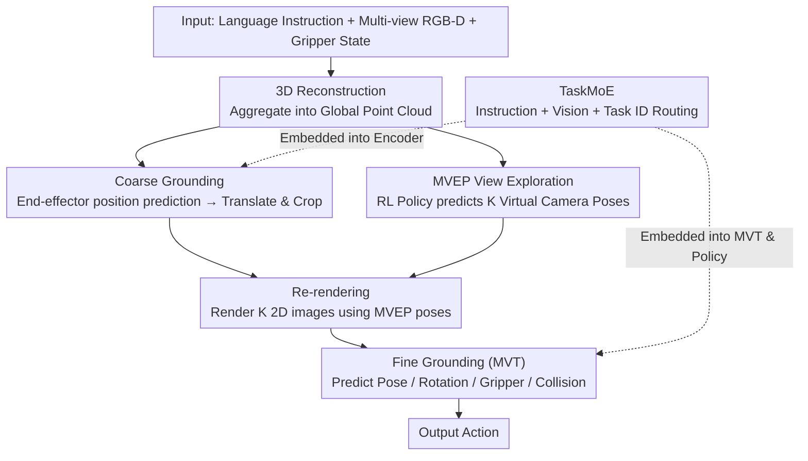

# Learning to See and Act: Task-Aware Virtual View Exploration for Robotic Manipulation

**Conference**: CVPR 2026  
**arXiv**: [2508.05186](https://arxiv.org/abs/2508.05186)  
**Code**: [Yes](https://github.com/) (TAVP)  
**Area**: Robotics/Embodied AI  
**Keywords**: View Exploration, Multi-task Manipulation, Mixture-of-Experts, Virtual View Rendering, Reinforcement Learning

## TL;DR

The TVVE framework is proposed, which selects optimal virtual camera viewpoints through a reinforcement learning-driven Multi-View Exploration Policy (MVEP) and performs online observation re-rendering. Concurrently, a task-aware MoE visual encoder (TaskMoE) is designed to resolve feature interference in multi-task settings, achieving an average success rate of 86.6% across 18 RLBench tasks.

## Background & Motivation

**Background**: Vision-Language-Action (VLA) models are rapidly advancing in the field of end-to-end robotic manipulation, with methods like OpenVLA and $\pi_0$ achieving impressive results on complex, fine-grained tasks. These approaches typically rely on single-view or a small set of fixed-view RGB-D observations to guide action prediction.

**Limitations of Prior Work**: Fixed viewpoints pose severe problems in cluttered or dynamic scenes—occlusions frequently occur when target objects or the end-effector are repositioned during task execution. For example, when executing the instruction "put the sugar in the cupboard," a front camera might see the cupboard but not the sugar, while shoulder cameras might see the grasped sugar but not the cupboard, leading to incomplete scene understanding and failed action predictions.

**Key Challenge**: First, fixed views vs. dynamic scenes—fixed cameras cannot adaptively select the best observation angle as the task progresses. Second, shared encoders vs. task heterogeneity—methods like RVT/RVT-2 use shared visual encoders for all tasks, leading to severe feature interference between vastly different tasks such as "picking an apple" and "opening a drawer."

**Goal**: (1) To dynamically select virtual observation viewpoints that maximize coverage of task-critical information; (2) To avoid interference between visual features and action policies in multi-task settings.

**Key Insight**: Utilize RGB-D data to reconstruct 3D point clouds as a scene representation. Explore optimal virtual camera poses on the point cloud using a reinforcement learning policy, then re-render 2D observations from the point cloud. Simultaneously, employ an MoE architecture to route different tasks to specialized expert networks.

**Core Idea**: "Learn to see, then learn to act"—model viewpoint selection as a trainable RL policy. Avoid expensive physical simulation through pseudo-environment interaction, and implement selective parameter sharing between tasks using TaskMoE with decoupled gating.

## Method

### Overall Architecture

The core problem TVVE aims to solve is that fixed cameras in robotic manipulation are often occluded by moving objects or grippers, failing to capture critical task information. The approach is to let the model "learn to see" first—actively picking a set of superior virtual viewpoints to clarify the scene—and then "learn to act"—predicting actions based on the cleared observations. The pipeline takes language instructions, multi-view RGB-D images, and current gripper states as input, following four steps:

1.  **3D Reconstruction**: Back-project multiple RGB-D images into point clouds and aggregate them into a global point cloud in the world coordinate system as a unified representation for subsequent viewpoint exploration.
2.  **Coarse Grounding**: Predict the approximate location of the end-effector, translate the point cloud center to this position, and crop irrelevant regions to focus exploration on task-critical areas.
3.  **MVEP**: Predict $K$ virtual camera poses on the global point cloud using an RL policy and re-render $K$ 2D observation images from the cropped point cloud.
4.  **Fine Grounding**: Feed rendered images into a TaskMoE-enhanced Multi-View Transformer (MVT) to predict ultimate actions (position, rotation, gripper state, collision state).

Note that steps 2 and 3 are two parallel branches stemming from the global point cloud—Coarse Grounding locks onto the critical area, while MVEP selects viewpoints. They converge at the re-rendering stage. TaskMoE is embedded within the MVT visual encoder and action policy, allowing feature extraction and action prediction at both coarse and fine levels to be routed adaptively by task.

### Key Designs

**1. MVEP: Modeling Viewpoint Selection as a Trainable RL Policy**

Fixed cameras cannot capture the full extent of dynamic scenes, but there are no supervisory labels for "the best angle." TVVE models viewpoint selection as a reinforcement learning problem. MVEP receives the global point cloud and its RGB features, parameterizing each camera pose as a 5D spherical coordinate vector $(\theta, \phi, r, \theta_{up}, \phi_{up})$ using a look-at camera model. An MLP predicts the mean and variance of a Gaussian distribution, from which poses are sampled using the reparameterization trick, with spherical coordinates constrained via sigmoid. This naturally fits the "orbiting the target" semantics, while probabilistic sampling introduces exploration essential for PPO optimization.

**2. TaskMoE: Selective Parameter Sharing via Decoupled Gating**

Methods like RVT/RVT-2 share a single visual encoder for all tasks, causing interference. TaskMoE replaces visual/action modules with a Mixture-of-Experts structure, routing dynamically based on task semantics. The routing feature is not a simple Task ID lookup: cross-attention merges language instructions and scene vision, followed by a FiLM layer to modulate the Task ID, yielding a context-aware routing feature. Crucially, the number of gates $N_G$ is decoupled from the total number of tasks $N_J$ ($N_G < N_J$): semantically similar tasks share a gate but can still route to different experts, while highly dissimilar tasks maintain independent channels. This allows the model to discover latent task clusters and transfer knowledge to unseen tasks.

### Loss & Training

Training "seeing" and "acting" concurrently is unstable, so TVVE splits it into three stages:

**Stage 1 — Fixed View Pre-training**: Train a base model using three default views (front, left, top). The loss is the sum of action components:

$$\mathcal{L}_{s1} = \mathcal{L}_{hc} + \mathcal{L}_{hf} + \mathcal{L}_{rot} + \mathcal{L}_{gri} + \mathcal{L}_{col}$$

This includes coarse/fine heatmap cross-entropy, rotation, gripper state, and collision indicators. This model serves as the reward baseline for Stage 2.

**Stage 2 — PPO Optimization for MVEP**: Freeze other components and only train MVEP. The reward consists of three terms: $r_0 = \mathcal{L}_{ref} - \mathcal{L}_{TVVE}$ (relative improvement in task loss over the fixed-view model), $r_1$ is the negative mean entropy of the heatmap (encouraging confident predictions), and $r_2$ is the mean cosine distance between viewpoints (encouraging diversity). These are normalized via Welford’s algorithm, weighted, and clipped to $[-10, 10]$: $r = \sum_{i=0}^{2} w_i \cdot \mathcal{N}(r_i)$.

**Stage 3 — Joint Fine-tuning**: Conversely, freeze MVEP and fine-tune remaining modules to adapt the "acting" to the viewpoints selected by "seeing."

## Key Experimental Results

### Main Results

**Table 1: RLBench Multi-view Setting (18 Tasks)**

| Method | Avg. SR (%) ↑ | Avg. Rank ↓ | Insert Peg | Sort Shape | Slide Block | Close Jar |
|------|:---:|:---:|:---:|:---:|:---:|:---:|
| PerAct | 49.4 | 7.06 | 5.6 | 16.8 | 74.0 | 55.2 |
| RVT | 62.9 | 5.28 | 11.2 | 36.0 | 81.6 | 52.0 |
| 3D Diffuser Actor | 81.3 | 3.0 | 65.6 | 44.0 | 97.6 | 96.0 |
| RVT2 | 81.4 | 2.89 | 40.0 | 35.0 | 92.0 | 100.0 |
| ARP | 81.6 | 2.83 | 53.2 | 35.2 | 98.4 | 97.6 |
| **TVVE (Ours)** | **86.6** | **2.17** | **98.0** | **62.0** | **100.0** | **100.0** |

TVVE shows a **Gain of ~5%** over the Prev. SOTA (ARP 81.6%) and a significant +32.4% Gain on the "Insert Peg" task.

**Table 2: RLBench-OG Robustness Test (Occlusion + Generalization)**

| Method | Avg. SR (%) | Occlusion 1 | Occlusion 2 | Light | Table Texture | Camera Pose |
|------|:---:|:---:|:---:|:---:|:---:|:---:|
| Diffusion Policy | 23.8 | 27.4 | 23.4 | 22.9 | 22.6 | 22.2 |
| ARP | 63.7 | 73.0 | 52.6 | 59.8 | 61.3 | 69.7 |
| RVT2 | 64.5 | 72.8 | 46.9 | 60.8 | 64.0 | 74.0 |
| **TVVE (Ours)** | **67.0** | **75.0** | **58.0** | **63.7** | **66.8** | 73.2 |

In occlusion scenarios (Occlusion 2), TVVE achieves an **+11.1% Gain** over RVT2, demonstrating the effectiveness of dynamic view exploration against occlusions.

### Ablation Study

**Component Ablation (18 tasks, Table 5)**:

| Configuration | Avg. SR (%) |
|------|:---:|
| TVVE (TaskMoE + MVEP) | **86.6** |
| w/o TaskMoE | 85.6 (-1.0) |
| Fixed Viewpoints (w/o MVEP) | 83.3 (-3.3) |
| Random Viewpoints | 8.9 (-77.7) |

- Random viewpoints cause performance to crash to 8.9%, proving that MVEP learns a meaningful selection strategy.
- Fixed viewpoints lead to a 3.3% drop, highlighting the benefit of dynamic exploration.

**TaskMoE Generalization (Table 6)**: With TaskMoE, success rate on 5 seen tasks is 80.8% (vs. 72.0% without), and for the unseen task "Open Drawer," it is 72% vs. 60%.

**Ablation on View Count K and Radial Constraints (Table 7)**: Increasing K from 2→3→4 results in success rates of 27.2%→49.6%→55.2%. Tighter distance constraints (0.90~1.04m) improve performance from 49.6% to 56.0%. K=3 is chosen as a balance.

### Key Findings

1.  **Dynamic View >> Fixed View >> Random View**: MVEP viewpoint selection is not just beneficial for noise; it learns a task-relevant information maximization strategy.
2.  **TaskMoE is Crucial for Generalization**: The decoupled gating mechanism allows the model to discover latent task clusters, facilitating cross-task transfer.
3.  **Sim-to-Real Transferability**: Real-world robot experiments (Dobot: TVVE 88% vs DP 68%; Franka: TVVE 78% vs ARP 72%) validate the approach.

## Highlights & Insights

-   **Pseudo-environment Interaction** significantly reduces MVEP RL training costs by using offline data and a reference model for reward signals instead of real environment calls.
-   **Three-stage Training Strategy** is well-designed: Establish base capabilities -> Learn exploration -> Synchronize seeing and acting. This avoids joint training instability.
-   **Gating Decoupling** ($N_G < N_J$) offers clear engineering value by balancing parameter sharing and task isolation for system scale.

## Limitations & Future Work

-   Multi-view re-rendering increases inference latency, limiting real-time performance.
-   Dependence on accurate 3D point cloud reconstruction makes it vulnerable to reflective or transparent objects.
-   The current ablation study is limited to 5 representative tasks.
-   Stage 2 PPO training requires substantial GPU resources (e.g., 4x A800).
-   Direct comparisons with recent 3D diffusion-based policies (e.g., 3D Diffuser Actor) in OOD settings were not fully explored.

## Related Work & Insights

-   **RVT-2**: TVVE builds upon the coarse grounding module of RVT-2 but upgrades fixed views to dynamic exploration.
-   **ARP**: An autoregressive action policy baseline; TVVE enhances its action generation module with TaskMoE.
-   **SDP**: Integrates MoE into diffusion policies for multi-task learning, though without task-aware routing.
-   **Insight**: The pseudo-environment interaction strategy can be extended to other sensory tasks where real interaction is expensive (e.g., active perception, navigation).

## Rating

⭐⭐⭐⭐ High design completeness (MVEP + TaskMoE + 3-stage training). Experimental coverage includes simulation, OOD, and real-world robots, achieving significant Gains on 18 RLBench tasks. However, inference efficiency and point cloud reliance remain deployment bottlenecks.

<!-- RELATED:START -->

## Related Papers

- [\[CVPR 2026\] Learning to Act Robustly with View-Invariant Latent Actions](learning_to_act_robustly_with_view-invariant_latent_actions.md)
- [\[CVPR 2026\] DiffuView: Multi-View Diffusion Pretraining for 3D-Aware Robotic Manipulation](diffuview_multi-view_diffusion_pretraining_for_3d_aware_robotic_manipulation.md)
- [\[CVPR 2026\] PALM: Progress-Aware Policy Learning via Affordance Reasoning for Long-Horizon Robotic Manipulation](palm_progress-aware_policy_learning_via_affordance_reasoning_for_long-horizon_ro.md)
- [\[NeurIPS 2025\] Act to See, See to Act: Diffusion-Driven Perception-Action Interplay for Adaptive Policies](../../NeurIPS2025/robotics/act_to_see_see_to_act_diffusion-driven_perception-action_interplay_for_adaptive_.md)
- [\[CVPR 2026\] GeCo-SRT: Geometry-aware Continual Adaptation for Robotic Cross-Task Sim-to-Real Transfer](gecosrt_geometryaware_continual_adaptation_for_rob.md)

<!-- RELATED:END -->
