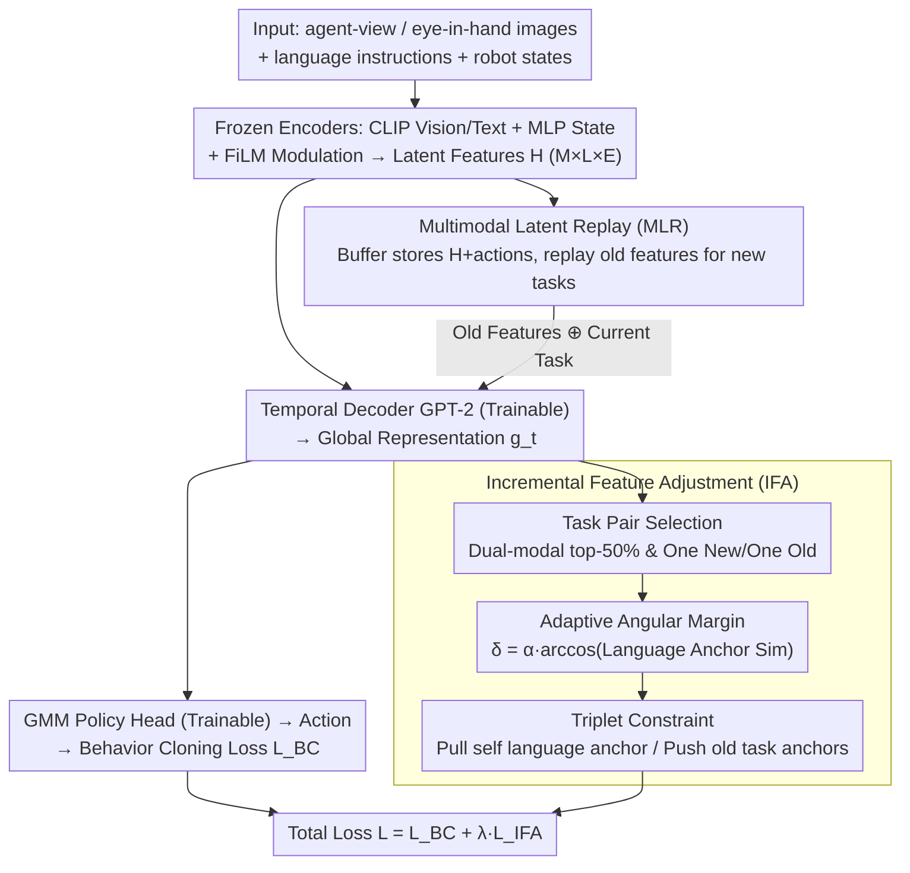

# Lifelong Imitation Learning with Multimodal Latent Replay and Incremental Adjustment

**Conference**: CVPR 2026  
**arXiv**: [2603.10929](https://arxiv.org/abs/2603.10929)  
**Code**: [https://github.com/yfqi/lifelong_mlr_ifa](https://github.com/yfqi/lifelong_mlr_ifa)  
**Area**: Robotics  
**Keywords**: lifelong imitation learning, multimodal latent replay, incremental feature adjustment, catastrophic forgetting, LIBERO

## TL;DR
A lifelong imitation learning framework is proposed that stores and replays compact representations in the feature space of frozen encoders via Multimodal Latent Replay (MLR). It introduces the Incremental Feature Adjustment (IFA) mechanism with angular distance constraints to maintain inter-task separability, achieving a 10-17 point AUC improvement and up to 65% reduction in forgetting on the LIBERO benchmark.

## Background & Motivation
Imitation Learning (IL) enables robots to learn behaviors by observing human demonstrations. However, real-world environments are dynamic, with new objects, goals, and contexts constantly emerging. Standard IL assumes a fixed task set and does not support dynamic expansion. Lifelong Imitation Learning (LIL) aims to allow agents to continuously learn new skills while retaining old ones, where the core challenge is catastrophic forgetting. Existing LIL methods include: (1) Experience replay (e.g., LOTUS stores raw trajectories, CRIL uses GANs for data generation), which requires large memory and is sensitive to similarity between old and new tasks; (2) Progressive model expansion (e.g., TAIL trains independent adapters for each task), but requires known task IDs at test time; (3) Distillation (e.g., M2Distill), which involves complex pipelines. These methods suffer from low storage efficiency, reliance on PEFT or task IDs, or complex distillation procedures.

## Core Problem
There are two core challenges in lifelong imitation learning: (1) **Storage Efficiency**—traditional experience replay stores raw trajectories (high-dimensional images + state sequences), leading to high memory overhead; (2) **Representation Interference**—latent representations of new tasks may overlap with old tasks, causing interference in the shared embedding space. The goal is to achieve efficient lifelong learning with a simple pipeline without using PEFT, task IDs, or knowledge distillation.

## Method

### Overall Architecture

To learn new skills from a continuous stream of tasks without forgetting previous ones, this work proposes "freezing encoders and replaying only in the feature space." The policy network consists of three modal encoders (CLIP vision, CLIP text, MLP state) + FiLM modulation layers + GPT-2 temporal decoder + GMM policy head. Multi-task pre-training is first conducted to establish shared representations (all modules trainable, CLIP fine-tuned with LoRA rank-8). During the lifelong learning phase, all encoders and FiLM layers are frozen, and only the temporal decoder and policy head are updated. Inputs include agent-view images, eye-in-hand images, language instructions, and robot states; the output is a 5-component GMM action distribution. Two key components are added: **Multimodal Latent Replay (MLR)**, which stores latent features of old tasks in a buffer and replays them during new task training to resist forgetting; and **Incremental Feature Adjustment (IFA)**, which applies an angular distance regularization on the global representation $g_t$ to separate new and old tasks in the embedding space. The final loss is $\mathcal{L}=\mathcal{L}_{BC}+\lambda_{IFA}\mathcal{L}_{IFA}$. This design deliberately avoids PEFT, task IDs, and knowledge distillation to maintain a simple pipeline.

### Key Designs

**1. Multimodal Latent Replay (MLR): Replaying compressed features instead of raw trajectories**

Traditional experience replay stores raw trajectories, which incur high memory costs. MLR stores multimodal latent features $\mathbf{H} \in \mathbb{R}^{M \times L \times E}$ (M=modalities, L=timesteps, E=embedding dim) and corresponding actions modulated by frozen encoders and FiLM. When a new task arrives, latent representations of old tasks are sampled from the buffer and trained alongside current data. Since encoders are frozen, features are fed directly, skipping the forward pass during replay. Storage requirements are significantly lower than raw images; the buffer is balanced across tasks, storing features equivalent to approximately 5 demonstrations per task (sampling probability 0.5).

**2. Incremental Feature Adjustment (IFA): Maintaining task separability via triplet constraints**

Replay alone is insufficient as representations of new tasks may overlap with old ones in the shared embedding space. IFA maintains a reference embedding for each task and penalizes cases where "the current task representation is further from its own anchor than from an old task anchor":

$$\mathcal{L}_{IFA} = \max(0, d(g_t(T_k), h^{(r)}(T_k)) - d(g_t(T_k), h^{(r)}(T_j)) + \delta)$$

This is essentially a triplet loss that pulls the global representation $g_t(T_k)$ closer to its own anchor and pushes it away from old task anchors, thereby defining clear boundaries for each task in the representation space.

**3. Adaptive Angular Margin: Automatically scaling margins based on task similarity**

A fixed margin $\delta$ cannot adapt to task pairs with varying similarities. This work defines the margin as a ratio of the angular distance between task reference embeddings: $\delta = \alpha \cdot \arccos(\text{cos\_sim})$. Using angular distance rather than cosine distance provides higher resolution for high-similarity pairs—where cosine distance saturates, arccos remains sensitive, effectively separating tasks most prone to confusion. The scaling factor $\alpha$ is set between 0.1–0.7 depending on the dataset. Language embeddings are used as anchors because they remain fixed under frozen encoders, unlike global means which drift during training.

**4. Task Pair Selection Strategy: Constraining only the most confusing pairs**

Applying IFA to all task pairs is inefficient and may cause over-regularization. The method calculates the average cosine similarity between tasks in both agent-view and language modalities and only selects task pairs that are **simultaneously in the top 50% of most similar tasks for both modalities**, provided one task is new and the other is old. This concentrates regularization on areas with genuine interference risk.

### Loss & Training

The total objective is $\mathcal{L} = \mathcal{L}_{BC} + \lambda_{IFA} \mathcal{L}_{IFA}$, with $\lambda_{IFA}=0.1$. $\mathcal{L}_{BC}$ is the behavior cloning loss based on the GMM policy head (negative log-likelihood). The AdamW optimizer is used with a learning rate of $10^{-4}$, a linear scheduler, and a batch size of 10 for 100 epochs. Configurations are consistent across pre-training and lifelong learning phases.

## Key Experimental Results

| Dataset | Metric | MLR+IFA (Ours) | LOTUS (Prev. SOTA) | ISCIL | Gain |
|--------|------|------|----------|------|------|
| LIBERO-OBJECT | FWT↑ | 84.6 | 74.0 | 71.7 | +10.6 vs LOTUS |
| LIBERO-OBJECT | NBT↓ | 11.4 | 11.0 | 11.9 | Comparable |
| LIBERO-OBJECT | AUC↑ | 79.4 | 65.0 | 66.3 | +14.4 vs LOTUS |
| LIBERO-GOAL | FWT↑ | 80.0 | 61.0 | 70.4 | +19.0 vs LOTUS |
| LIBERO-GOAL | NBT↓ | 6.9 | 30.0 | 19.4 | -64% vs ISCIL |
| LIBERO-GOAL | AUC↑ | 77.2 | 56.0 | 60.5 | +16.7 vs ISCIL |
| LIBERO-50 | FWT↑ | 60.8 | 39.0 | 47.8 | +13.0 vs ISCIL |
| LIBERO-50 | NBT↓ | 8.6 | 43.0 | 15.0 | -43% vs ISCIL |
| LIBERO-50 | AUC↑ | 56.1 | 45.0 | 37.7 | +11.1 vs LOTUS |

### Ablation Study
- **MLR alone** significantly outperforms SOTA (AUC 77.6 on OBJECT vs LOTUS 65); adding IFA further increases it (79.4).
- **Modal similarity selection**: The language + agent-view combination is optimal (AUC 79.4); single modality or other combinations are inferior.
- **Task pair ratio**: Selecting the top 50% is optimal; 33.3% is insufficient, while 66.6% leads to over-regularization and increased NBT.
- **Reference selection**: Language embeddings as anchors outperform global means, as the former is stable while the latter drifts.
- **Buffer size**: Reducing sampling probability from 0.5 to 0.1 drops AUC from 79.4 to 76.6, emphasizing the importance of sufficient storage.
- **Angular vs. Cosine distance**: Angular distance consistently outperforms cosine distance with lower variance.
- **Full fine-tuning vs. LoRA**: Full fine-tuning of the temporal decoder is far superior to LoRA (AUC 79.4 vs ≤54.2), indicating the decoder requires full capacity.
- **FiLM Layer**: Removing FiLM causes a sharp performance drop (AUC 79.4 to 41.6), highlighting the necessity of task-conditional modulation.

## Highlights & Insights
- **Minimalist pipeline**: Frozen pre-trained encoders + fine-tuned temporal decoder + latent replay achieves high efficiency without distillation, PEFT, or task IDs.
- **Clever IFA formulation**: Utilizes the amplification property of arccos in high-similarity regions combined with an adaptive margin to handle task pairs of varying difficulty.
- **Language embeddings as anchors**: Leverages the stability of language descriptions under frozen encoders to prevent anchor drift during training.
- **Storage efficiency**: Latent replay memory consumption (approx. 188MB for OBJECT / 121MB for GOAL) is far lower than storing raw images.

## Limitations & Future Work
- Validated only on LIBERO simulation benchmarks; not yet tested on real robots.
- Fine-tuning CLIP with LoRA during pre-training may limit generalization to out-of-distribution scenarios.
- $\alpha$ requires manual tuning per dataset (0.1/0.3/0.7), and its optimal value varies significantly; automatic selection remains an open problem.
- Short task sequences (4 new tasks for OBJECT/GOAL); scalability to longer sequences remains to be verified.
- Does not explore cross-domain (sim-to-real) transfer capabilities.
- Latent replay depends on the quality of frozen encoders; bottlenecks may occur if encoders lack representation power for certain tasks.

## Related Work & Insights
- **vs LOTUS**: LOTUS stores raw trajectories and uses an open-vocabulary vision encoder for skill discovery, creating a complex pipeline; Ours uses frozen CLIP + latent replay, which is simpler and outperforms LOTUS by 10-17 AUC points.
- **vs M2Distill**: M2Distill uses multimodal distillation to maintain a consistent latent space, requiring teacher models and GMM alignment; Ours avoids distillation and regularizes the representation space directly via IFA, leading on LIBERO-50 metrics.
- **vs TAIL**: TAIL requires task IDs to select adapters, making it unsuitable for task-agnostic scenarios; Ours significantly outperforms TAIL under the same evaluation protocol.
- The latent replay strategy can be transferred to other multimodal continual learning scenarios (e.g., VLM fine-tuning).
- The adaptive angular margin design in IFA can be applied to any continual learning method requiring inter-class separability.

## Rating
- Novelty: ⭐⭐⭐⭐ The combination of MLR and IFA is new in the LIL domain, and the angle-based adaptive margin design is insightful.
- Experimental Thoroughness: ⭐⭐⭐⭐⭐ Extremely detailed ablation studies covering almost all design choices, including UMAP visualizations and computational efficiency analysis.
- Writing Quality: ⭐⭐⭐⭐ Clear structure, complete mathematical derivations, and informative figures.
- Value: ⭐⭐⭐⭐ Set a new SOTA across all LIBERO benchmarks with open-source code, providing practical value for lifelong robotic learning.

<!-- RELATED:START -->

## Related Papers

- [\[CVPR 2026\] Arcadia: Toward a Full-Lifecycle Framework for Embodied Lifelong Learning](arcadia_toward_a_full-lifecycle_framework_for_embodied_lifelong_learning.md)
- [\[CVPR 2026\] Learning to Act Robustly with View-Invariant Latent Actions](learning_to_act_robustly_with_view-invariant_latent_actions.md)
- [\[CVPR 2026\] CoMo: Learning Continuous Latent Motion from Internet Videos for Scalable Robot Learning](como_learning_continuous_latent_motion_from_internet_videos_for_scalable_robot_l.md)
- [\[CVPR 2026\] Learning a Unified Latent Action Space from Videos with Action-centric Cycle Consistency](learning_a_unified_latent_action_space_from_videos_with_action-centric_cycle_con.md)
- [\[CVPR 2026\] AGiLe: Learning Robust Long-Horizon Manipulation via Affordance-Grounded Bidirectional Latent Planning](agile_learning_robust_long-horizon_manipulation_via_affordance-grounded_bidirect.md)

<!-- RELATED:END -->
