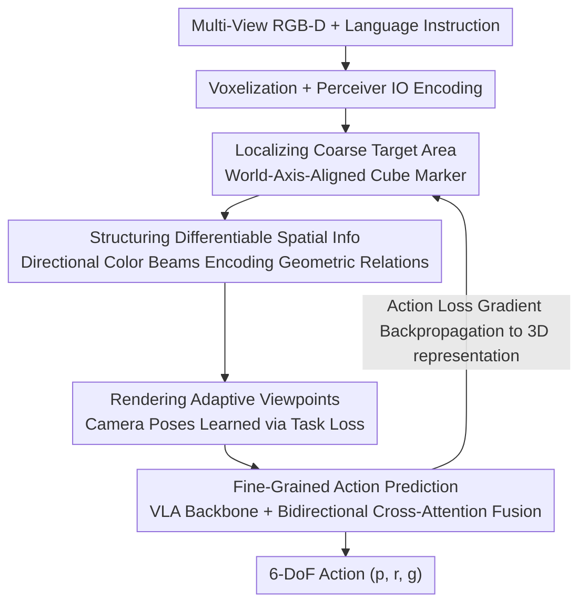

# Localizing, Structuring, and Rendering: Bridging 3D and 2D Vision-Language-Action Models for Robotic Manipulation

**Conference**: CVPR 2026  
**Paper**: [CVF Open Access](https://openaccess.thecvf.com/content/CVPR2026/html/Zhao_Localizing_Structuring_and_Rendering_Bridging_3D_and_2D_Vision-Language-Action_Models_CVPR_2026_paper.html)  
**Code**: https://github.com/zyl123456aB/DIFFVLA  
**Area**: Robotics / Embodied AI / Vision-Language-Action  
**Keywords**: VLA, Differentiable Rendering, Robotic Manipulation, Spatial Reasoning, 3D-2D Bridge  

## TL;DR
DiffRender-VLA utilizes "differentiable rendering" as a bridge to encode 3D spatial relations in point clouds into differentiable images with colored light beams, which are then fed into a 2D VLA. This allows the action loss of the 2D VLA to backpropagate to the 3D representation to optimize object localization and viewpoint, thereby achieving an average success rate improvement of +12.1% on occluded, cluttered, and complex spatial manipulation tasks.

## Background & Motivation
**Background**: VLA models for robotic manipulation have developed along two complementary paradigms. One is **3D VLA** (e.g., PerAct, VoxPoser, Act3D, 3D Diffuser), which uses voxel/point cloud representations for explicit geometric reasoning, accurately predicting physically reachable actions. The other is **2D VLA** (e.g., RT-2, OpenVLA, PaLM-E, Pi0), which leverages large-scale vision-language pre-training for strong semantic generalization and directly predicts actions from images.

**Limitations of Prior Work**: Both paradigms suffer from critical drawbacks. 3D VLA is "calculative but lacking visual intuition" — while possessing high geometric precision, it loses pixel-level dense visual semantics, resulting in poor interpretability. 2D VLA is "intuitive but lacking geometric precision" — it has rich visual intuition and continuous semantics but lacks explicit global 3D spatial grounding, frequently leading to incorrect positions or orientations during fine-grained manipulation. A natural formulation is to feed depth information into 2D VLAs (such as RGB-D fusion like Depth Helps and DepthVLA), but depth maps only represent surface geometry from a fixed viewpoint rather than **encoding relative spatial relations between objects**. Furthermore, most fusion methods occur at the feature level, offering zero interpretability into how spatial clues are integrated.

**Key Challenge**: Geometric reasoning (3D) and semantic perception (2D) are optimized as two separate systems, with no gradient-flowing pathway between them — meaning 3D spatial understanding cannot be transferred in an image-readable and 2D VLA-training-friendly manner.

**Goal**: Instead of choosing between "2D image" and "3D reasoning", this paper aims to construct a differentiable visual bridge that injects 3D spatial perception into 2D VLAs in the form of images, allowing the loss of the 2D VLA to backpropagate into the 3D representations.

**Key Insight**: The authors observe that "rendering" is naturally the interface between geometry and visual perception. Drawing 3D spatial relationships **directly onto images** (rather than feeding them as features) retains the visual interpretability directly readable by 2D VLAs and allows gradients to flow back to the 3D geometry via differentiable rendering.

**Core Idea**: "Spatial-enhanced images" are generated via differentiable rendering: inserting a world-axis-aligned cube marker at the next end-effector target, encoding the surrounding geometry's spatial relations relative to the marker into point clouds using colored beams, and then learning a set of adaptive viewpoints to project these relations into images. These differentiable images serve as inputs to the 2D VLA, while allowing the action loss to backpropagate to the cube's position and camera poses, forming a closed differentiable loop that unifies reasoning and perception.

## Method

### Overall Architecture
DiffRender-VLA takes a language instruction $I$ and multi-view RGB-D observations $O=\{o_i\}$ as inputs, and outputs a 6-DoF end-effector action $a=(p,r,g)$ (position, Euler angle rotation, gripper open/close). The pipeline operates sequentially in four stages: **localizing $\rightarrow$ structuring $\rightarrow$ rendering $\rightarrow$ fine-grained action prediction**. First, multi-view point clouds are voxelized, and a shared encoder simultaneously predicts a "coarse target cube" and "dynamic viewpoint parameters." Next, each surrounding point is dyed with direction-encoded colored beams based on its signed distance to the six faces of the cube, yielding a differentiable point cloud. Then, these point clouds are rasterized into images using the learned adaptive camera poses. Finally, these spatial-enhanced images are fed into a trainable, pre-trained VLA backbone and fused with coarse spatial features via bidirectional cross-attention to predict the final action.

The crux is the **closed differentiable loop**: the gradient of the action task loss $L_{task}$ can backpropagate all the way to the cube's position via $\frac{\partial L_{task}}{\partial I}\to\frac{\partial I}{\partial c_{beam}}\to\frac{\partial c_{beam}}{\partial p_{coarse}}$, and to the camera pose via $\frac{\partial L_{task}}{\partial I_i}\to\frac{\partial I_i}{\partial(R_i,t_i,\phi_i)}\to\frac{\partial(R_i,t_i,\phi_i)}{\partial\theta_{view}}$. Consequently, "where to localize", "what relations to encode", and "from which viewpoint to observe" are learned end-to-end based on the final action task, instead of being optimized in separate stages.

### Key Designs

**1. Localizing Coarse Target Area: World-axis-aligned cube "draws" spatial information as pure geometric clues**

Since 2D VLAs lack explicit 3D grounding, they require a spatial anchor. The authors reconstruct multi-view point clouds and voxelize them into $V\in\mathbb{R}^{D\times H\times W}$. A Perceiver IO encoder is used to jointly process voxels and language embeddings, **outputting three elements simultaneously**:

$$(Q_{coarse}, Z_{coarse}, \theta_{view}) = \Phi_{enc}(V, e_{lang})$$

where $Q_{coarse}$ represents the coarse target voxel probabilities across the workspace, $Z_{coarse}$ represents the coarse spatial features for subsequent fusion, and $\theta_{view}$ parameterizes the dynamic viewpoints—allowing joint reasoning over "where the target is" and "from where to observe" within the same encoder. The position with the highest confidence $p_{coarse}$ is calculated using the differentiable spatial expectation over $Q_{coarse}$, and a cube $B$ of side length $\ell_{cube}$ is centered at this position. **Crucially, this cube is aligned with the world axis rather than the camera axis**: its shape after 2D projection implicitly contains historical information about the 3D space — a square projection indicates an orthogonal camera orientation, rectangular distortion reveals the oblique viewing angle, and projection size scales inversely with distance. These pure geometric cues allow the 2D model to perceive implied depth and orientation without explicit 3D reasoning.

**2. Structuring Differentiable Spatial Information: Colored beams dye "relative orientation and distance to target" into point clouds**

While the cube projection reveals the relationship between the camera and the target, it does not clarify the relative spatial relations of surrounding objects to the target. The Structuring module uses "colored depth gradient encoding" to transform abstract 3D relations into perceivable visual features. For each point $x$, its signed distance $d_j(x)$ to the six faces $j$ of the cube is first computed. Each face has a signature color representing its axis ($\pm X$ red/cyan, $\pm Y$ green/magenta, $\pm Z$ blue/yellow). The final color mixes the original appearance and directional clues:

$$c_{beam}(x) = (1-\alpha(x))\,c_{orig}(x) + \alpha(x)\sum_{j=1}^{6} c_j \exp\!\big(-k_{beam}\,w_j(d_j(x))\big)$$

where $d_j(x)=\text{sign}(n_j\cdot(x-p_c))\cdot\|x-\Pi_j(x)\|$ is the signed distance from the point to face $j$, the mixing weight $\alpha(x)=\sigma_{sig}\big(\frac{r_{target}-\|x-p_c\|}{\sigma_{blend}}\big)$ controls the color blending based on the distance to the cube, and $k_{beam}$ controls the gradient sharpness—forming a "light beam" effect: **intensity encodes distance, while hue encodes direction**. Since the colors align with the world axis instead of the camera axis, the orientation semantics remain consistent across different viewpoints, which is vital for generalizable spatial reasoning; the adaptive blending $\alpha(x)$ ensures that target-related light beams remain visually dominant even in scenes with colorful clutter. Remarkably, the entire process is differentiable with respect to $p_{coarse}$, so as the action prediction improves, gradients flow back through the rendered images to fine-tune the cube placement and beam encoding.

**3. Rendering Adaptive Viewpoints: Camera poses learned via task loss to actively avoid occlusions**

Suboptimal viewpoints can severely degrade spatial information — occlusions hide cube faces, awkward angles blur gradients, or a distant viewpoint makes the cube clues too small to see. Rather than performing an expensive viewpoint search, this work learns the viewpoint parameters $\theta_{view}$ (predicted earlier along with $Q_{coarse}$) end-to-end via the action loss. For each dynamic camera $i$, the decoder $D_{view}$ outputs a valid pose $(R_i, t_i, \phi_i)$ (rotation, translation, field-of-view), utilizing 6D rotation representations for gradient stability. This allows the model to spontaneously discover task-relevant viewpoints: revealing color gradients clearly from multiple angles, minimizing occlusion of the target area, and adjusting FOV so that the cube is sufficiently visible. In experiments on picking tasks, the cameras spontaneously converged to overlook angles between 0°-45°, and this specialization **emerged without any viewpoint annotations**, demonstrating the effectiveness of end-to-end differentiability.

**4. Fine-Grained Action Prediction: Trainable VLA backbone + bidirectional cross-attention to couple semantics and spatial scaffolding**

After generating spatial-enhanced images in the first three steps, a pre-trained VLA backbone (initialized from OpenVLA, SigLIP+DinoV2+Llama-2-7B) is utilized as a semantic feature extractor: $Z_{VLA}^i=\psi_{VLA}(I_i, e_{lang})$. **The backbone remains trainable** to learn how to interpret the beam markers and cube projections while retaining its pre-trained semantic knowledge. Subsequently, bidirectional cross-attention is employed to fuse VLA semantic features and coarse spatial features:

$$Z_{fused} = \text{CrossAttn}(Z_{coarse}, Z_{VLA}) + \text{CrossAttn}(Z_{VLA}, Z_{coarse})$$

The first term guides VLA features to spatial-relevant areas, while the second term refines the coarse estimates using semantic understanding. Spatial scaffolding without semantics is fragile, and semantics without spatial grounding lacks precision; bidirectional fusion allows both to co-adapt. Finally, the action is decoded from $Z_{fused}$ using independent heads: for position, a plane probability $Q_{trans}^i$ is refined for each viewpoint, and an argmax is projected into space, average-pooling across the six faces of the cube to obtain $p=\frac{1}{6}\sum_i p^{(i)}$; rotation is discretized into 5° Euler angle bins, and the gripper is determined via binary classification.

### Loss & Training
Jointly optimize translation, rotation, and gripper action components with loss weights $\lambda_{trans}=1.0,\ \lambda_{rot}=0.8,\ \lambda_{grip}=0.5$. In simulation, the model was trained using 100 demonstrations per task on 220x220 RGB-D images using the LAMB optimizer (lr=$2.4\times10^{-4}$, batch size = 32, 100k steps). On real robots, 50 demonstrations per task were used with identical hyperparameters. The VLA backbone was initialized from OpenVLA, while spatial modules were trained from scratch. Crucially, **end-to-end joint training** was used instead of two-stage training (e.g., training the spatial module first then fine-tuning the VLA), as the latter leads to a 4.3% drop in success rate due to the lack of co-adaptation.

## Key Experimental Results

### Main Results
Simulation evaluations were conducted on 12 RLBench tasks (Franka Panda), while real-world deployment was tested on an AgileX PIPER robot with a Robotiq 2F-85 gripper, with 20 trials per task.

| Dataset/Platform | Metric | Ours | Prev. SOTA | Gain |
|------------|------|----------------|----------|------|
| RLBench Simulation (Avg of 12 Tasks) | Success Rate | **80.5%** | GWM 68.4% | +12.1% |
| RLBench Occlusion Tasks | Success Rate | 91.7% | GWM | +7.6% |
| RLBench Cluttered & Precision Tasks | Success Rate | 69.4% | GWM | +24.0% |
| AgileX PIPER Real Robot (Avg of 6 Tasks) | Success Rate | **78.3%** | VLA-Adapter 60.8% | +17.5% |

On real-world single-task setups, the improvement over the strongest baseline is particularly pronounced: Place Stamp +25.0%, Place Banana / Press Button / Block Stacking each +20.0%. Compared to 3D methods, Ours also leads across the board: DP3 +16.5%, ManiGaussian +14.8%, Act3D +14.7%, showing that rendering 3D spatial semantics into 2D representations is more effective than direct 3D processing.

### Ablation Study
Component ablation and gradient flow validation (scores indicate success rate in %):

| Configuration | Avg. Success Rate | Description |
|------|-----------|------|
| Full Method | 80.5 | Complete model |
| w/o Coarse Cube | 68.4 | Removing coarse cube localization leads to a 12.1% drop |
| w/o Adaptive View | 71.6 | Removing adaptive viewpoints leads to an 8.9% drop |
| w/o Spatial Beams | 72.5 | Removing color beams leads to an 8.0% drop |
| Non-Diff. Beams | 74.8 | Non-differentiable beams lead to a 5.7% drop |
| Non-Diff. Viewpoint | 73.6 | Non-differentiable viewpoints lead to a 6.9% drop |
| Two-Stage Training | 76.2 | Non-end-to-end training leads to a 4.3% drop |
| Trajectory Traces (similar to TraceVLA) | 75.3 | Temporal trajectory lacking immediate 3D geometry leads to a 5.2% drop |
| Keypoint Markers (similar to RoboPoint) | 74.1 | Keypoints lacking directional relationships lead to a 6.4% drop |
| Fixed Multi-View (similar to RVT-2) | 77.4 | Fixed viewpoints cannot optimize for marker visibility, leading to a 3.1% drop |

### Key Findings
- **Coarse cube localization contributes the most** (removing it leads to a 12.1% drop), serving as the spatial anchor for subsequent structuring and rendering; without it, the entire spatial scaffolding collapses.
- **Differentiability itself is highly valuable**: modifying beams or viewpoints to be non-differentiable drops success rates by 5.7% and 6.9% respectively, and two-stage training drops it by 4.3%. This demonstrates that the closed gradient loop of "action loss backpropagating to the 3D representation" is a primary driver of performance, rather than a trivial implementation detail.
- **Beam appearance has a sweet spot**: a thickness of 3-5px and alpha of 0.5-0.7 achieves 99% of peak performance; deviations drop performance toward 85%, requiring a balance between perceivable directional cues and avoidance of original appearance occlusion.
- **Stronger generalization advantages**: under Out-Of-Distribution (OOD) conditions such as zero-shot transfer to new objects/new scenes/new lighting, the average success rate is still 73.6%, dropping only 6.9% compared to in-distribution; furthermore, its lead over RVT-2/OpenVLA expands rather than shrinks in generalization scenarios (12.6%/27.1%), demonstrating that world-axis-aligned beam encoding provides robust, appearance-invariant spatial features.

## Highlights & Insights
- **"Drawing" 3D relations onto images instead of "stuffing" them as features**: This is the core insight. Color beams convert relative object orientation (hue) and distance (intensity) to target into pixels that 2D vision encoders can directly read. This maintains interpretability and opens the 2D $\leftrightarrow$ 3D gradient channel via differentiable rendering — a paradigm transferable to any task requiring spatial grounding while employing pre-trained 2D backbones.
- **World-axis alignment is a stroke of genius**: Both the cube and color beams align with the world axis instead of the camera axis, causing the projected shape to carry camera orientation information while keeping direction semantics consistent across views. This formulation acts as a zero-cost constraint that allows the 2D model to perceive geometry "for free".
- **Viewpoint as a learnable parameter**: Framing camera poses as parameters to be learned via end-to-end task loss causes the picking camera to spontaneously converge to a top-down view without needing viewpoint labels. This is an elegant example of using task loss to conduct hyperparameter/architecture searches.
- **Closed differentiable loop unifying perception and reasoning**: Action loss shapes localization, encoding, and viewpoint simultaneously. This avoids the suboptimal traps of stage-wise independent optimization, and the "two-stage training drops 4.3%" ablation directly quantifies the value of co-adaptation.

## Limitations & Future Work
- Relies on **multi-view RGB-D inputs** to reconstruct point clouds and voxelize them (503 grid), leaving its applicability to monocular setups or cheap sensors with noisy depth measurements questionable.
- The cube size $\ell_{cube}$ (10-15cm, scaled down to 0.8$\times$ object size for small targets) and beam parameters (thickness/transparency/samples) must be manually tuned. The sweet spot is narrow (deviations drop performance to 85%), requiring potential tuning when changing datasets or object scales.
- The backbone consists of a 7B OpenVLA + voxel encoder + differentiable rendering, leading to non-trivial training and inference overhead; the paper does not fully discuss real-time viability and computing costs.
- Evaluations are concentrated on tabletop manipulation tasks (grabbing, placing, pressing, stacking), meaning its scalability to long-horizon, bi-manual, or deformable object manipulation has yet to be validated.

## Related Work & Insights
- **vs 3D VLA (PerAct / VoxPoser / Act3D / 3D Diffuser)**: These directly reason over voxels or point clouds, yielding high geometric precision but sacrificing visual intuition and interpretability; Ours retains 3D geometric precision while rendering representations as images to feed 2D backbones, preserving interpretability and outperforming DP3/Act3D by 14-16% in simulation.
- **vs 2D / RGB-D VLA (RT-2 / OpenVLA / DepthVLA)**: These leverage pre-trained vision-language models for semantics but lack explicit 3D grounding, and even those adding depth maps only use single-view surface geometry fused at the feature level without interpretability; Ours explicitly encodes relationship distances and orientations using world-aligned color beams, keeping spatial information in the image domain rather than the feature domain.
- **vs Rendering-based Representations (RVT / NeRF / Gaussian Splatting / OmniManip)**: NeRF and Gaussian Splatting require scene-specific optimization and complex modeling; Ours uses point cloud rendering, which is lightweight, geometrically transparent, and naturally compatible with gradient-based robot learning, serving as a differentiable, interpretable 3D $\leftrightarrow$ 2D bridge.

## Rating
- Novelty: ⭐⭐⭐⭐⭐ "Differentiable rendering as a 2D-3D bridge + world-axis color-beam spatial encoding + viewpoint as learnable parameters" is highly novel and elegant.
- Experimental Thoroughness: ⭐⭐⭐⭐⭐ 12 simulation tasks + 6 real-world tasks + ablations on components/gradients/encoding methods + zero-shot generalization, covering major comparisons with mainstream 2D/3D VLAs.
- Writing Quality: ⭐⭐⭐⭐ The localizing-structuring-rendering narrative is clear, and the formulas and gradient paths are explicitly explained; a few symbols (e.g., units of $\sigma_{blend}$, definition of $r_{target}$) are slightly brief.
- Value: ⭐⭐⭐⭐⭐ Provides a reusable differentiable rendering paradigm for injecting 3D spatial understanding into 2D VLAs while maintaining interpretability, backed by solid real-world robot validation.

<!-- RELATED:START -->

## Related Papers

- [\[CVPR 2026\] ActiveVLA: Injecting Active Perception into Vision-Language-Action Models for Precise 3D Robotic Manipulation](activevla_injecting_active_perception_into_vision-language-action_models_for_pre.md)
- [\[CVPR 2026\] Bridging the 2D-3D Gap: A Hierarchical Semantic-Geometric Map for Vision Language Navigation](bridging_the_2d-3d_gap_a_hierarchical_semantic-geometric_map_for_vision_language.md)
- [\[CVPR 2026\] ACoT-VLA: Action Chain-of-Thought for Vision-Language-Action Models](acot-vla_action_chain-of-thought_for_vision-language-action_models.md)
- [\[CVPR 2026\] MoEActok: A MoE-based Action Tokenizer for Vision-Language-Action Models](moeactok_a_moe-based_action_tokenizer_for_vision-language-action_models.md)
- [\[CVPR 2026\] Language-Grounded Decoupled Action Representation for Robotic Manipulation (LaDA)](lada_robotic_manipulation.md)

<!-- RELATED:END -->
