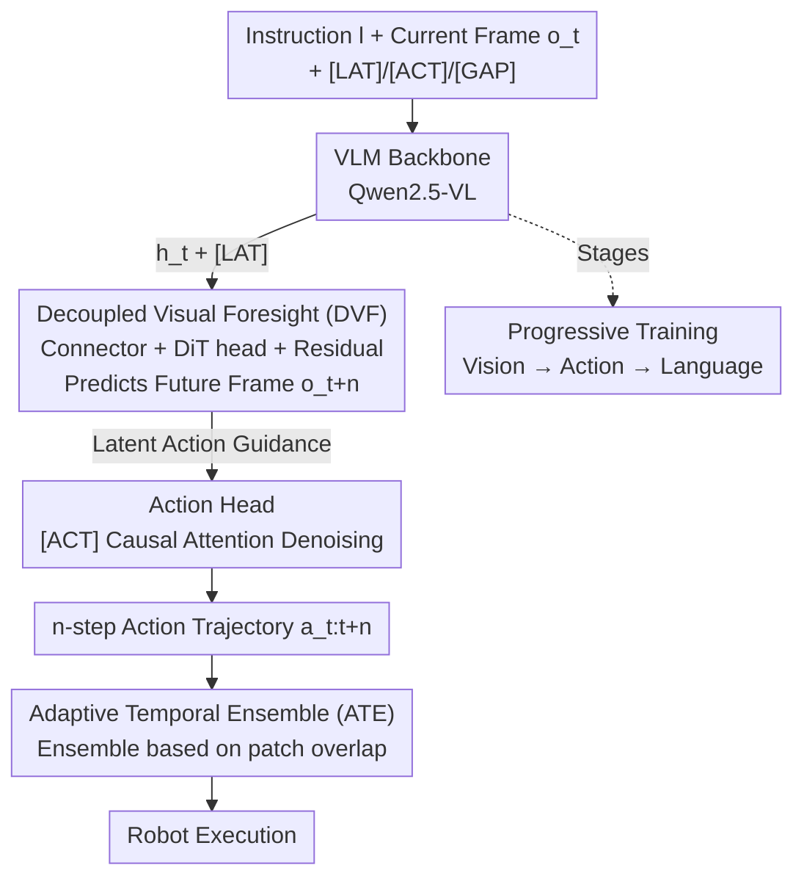

# Mantis: A Versatile Vision-Language-Action Model with Disentangled Visual Foresight

**Conference**: CVPR 2026  
**Paper**: [CVF Open Access](https://openaccess.thecvf.com/content/CVPR2026/html/Yang_Mantis_A_Versatile_Vision_Language_Action_Model_with_Disentangled_Visual_Foresight_CVPR_2026_paper.html)  
**Code**: https://github.com/SJTU-DENG-Lab/Mantis  
**Area**: Robotics / VLA Models  
**Keywords**: Vision-Language-Action model, visual foresight, latent actions, DiT, progressive training

## TL;DR
Mantis decouples "future frame prediction" from the VLA backbone—using a set of latent action queries and an independent Diffusion Transformer (DiT) head to generate future frames. This allows the backbone to output only compact inter-frame dynamics as action supervision signals, preserving the benefits of visual foresight while maintaining backbone capacity for language understanding and reasoning. It achieves a 96.7% success rate on LIBERO and outperforms π0.5 in instruction following and generalization on real robots.

## Background & Motivation
**Background**: Vision-Language-Action (VLA) models utilize pre-trained VLMs to translate language instructions and visual observations into robotic actions, representing a promising path for robot manipulation learning. However, a structural contradiction exists: action signals are low-dimensional and sparse (e.g., joint angles), while the model processes high-dimensional, dense visual inputs. Sparse supervision is insufficient to train large models, leaving significant representation capacity underutilized.

**Limitations of Prior Work**: To supplement sparse action supervision, the mainstream approach introduces "visual foresight"—predicting future visual states alongside actions. Three main approaches exist: (1) **Pixel-level foresight** (direct prediction of future frames) introduces action-irrelevant redundant information like texture and lighting, distracting the model and leading to high training costs, slow convergence, or hallucinations where physical motion is erroneously linked to appearance changes. (2) **Trajectory guidance** (compressing vision into keypoint tracks) is compact but suffers from information bottlenecks and cumulative errors due to the limited precision of extracted tracks. (3) **Latent action supervision** requires separately training an action quantization model to learn discrete latent actions from frame differences, introducing additional computational complexity.

**Key Challenge**: The trade-off between information density and compactness. Furthermore, most methods **ignore language supervision**; specialized robot training often overwrites the vision-text alignment learned during VLM pre-training, leading to degraded instruction following and reasoning capabilities.

**Goal**: To identify a compact and accurate auxiliary signal for visual foresight without sacrificing the backbone's language understanding and reasoning abilities.

**Core Idea**: Instead of the VLA backbone "personally" generating future frames, foresight prediction is **decoupled** from the backbone. The backbone produces a set of latent action queries, which an independent DiT head reconstructs into future frames. Thus, the backbone outputs "inter-frame dynamics" rather than redundant pixels. This decoupling removes the burden of visual reconstruction from the backbone, allowing it to retain language supervision.

## Method

### Overall Architecture
Mantis consists of several components: a VLM backbone $\mathcal{P}$ (Qwen2.5-VL), a connector $\mathcal{C}$, a DVF head $\mathcal{D}$ (based on Sana's DiT), an action head $\pi$, and three sets of learnable query tokens: latent action queries `[LAT]`, action queries `[ACT]`, and multi-spacing queries `[GAP]`.

The data flow operates as follows: At time $t$, the backbone receives language instruction $l$ and current visual observation $\mathbf{o}_t$. Combined with `[LAT]`, these are processed as a sequence to output hidden representations $\mathbf{h}_t = \mathcal{P}(\mathbf{o}_t, l, \texttt{[LAT]})$. Then, $\mathbf{h}_t$ and the current frame $\mathbf{o}_t$ are fed into the connector $\mathcal{C}$, projected as conditional inputs for the DiT, and the DVF head generates the future frame $\mathbf{o}_{t+n} = \mathcal{D}(\mathcal{C}(\mathbf{o}_t, \mathbf{h}_t))$. Crucially, under the objective of "predicting future frames," `[LAT]` automatically learns inter-frame dynamics (latent actions) characterizing the visual trajectory. Finally, the action head $\pi$ uses action queries `[ACT]` to extract information from the context (including `[LAT]`) to denoise and generate the next $n$ steps of the action trajectory $\mathbf{a}_{t:t+n}$. During inference, the DVF head is removed; visual foresight serves only as a "crutch" during training.

### Key Designs

**1. Decoupled Visual Foresight (DVF): Splitting frame generation from the backbone to force compact latent actions**

This design resolves the conflict between the heaviness of pixel-level foresight and the information loss of compression. Instead of the backbone generating pixels, a latent action query `[LAT]` and an independent DiT head are used. The backbone provides the hidden representation $\mathbf{h}_t$ corresponding to `[LAT]`, while the DiT head performs the heavy reconstruction. The core is the **residual connection** that feeds the current frame $\mathbf{o}_t$ directly to the DiT. Since the DiT already perceives the full appearance from $\mathbf{o}_t$, `[LAT]` does not need to encode "what the frame looks like" but only "how the frame changes"—the inter-frame dynamics. These dynamics are visual projections of explicit robot motions, termed **latent actions**. They are naturally compact and accurate, providing targeted guidance for action prediction.

To produce denser visual supervision and adapt to tasks with different step sizes, **multi-spacing queries `[GAP]`** are used. Inserted before `[LAT]`, they guide the DiT to generate future frames at different intervals $n$ (from 1 to 6), enabling the model to learn multi-scale dynamics.

**2. Progressive Training: Phased introduction of modalities to avoid competition**

Simultaneously training with vision, language, and action supervision can cause the model to bias toward easily learned signals or be dominated by one modality, leading to instability. Mantis employs a three-stage introduction:

- **Stage 1: Multi-spacing Visual Training**: Future frame prediction is performed on human manipulation videos without action labels (SSV2). This optimizes the diffusion loss $\mathcal{L}_{\text{DVF}}$, unfreezing the DVF head and queries while **freezing the backbone** to preserve pre-trained language representations.
- **Stage 2: Vision-Action Joint Training**: Robot demonstration data (DROID) is introduced. The temporal interval is fixed to match action chunk sizes. The objective is $\alpha\mathcal{L}_{\text{DVF}} + \mathcal{L}_{\text{action}}$ ($\alpha=0.1$), unfreezing action queries while keeping the backbone frozen.
- **Stage 3: Mixed Language Supervision Training**: 38 multimodal datasets are mixed with DROID. The **backbone is unfrozen**, and cross-entropy $\mathcal{L}_{\text{lang}}$ is applied to language outputs. The total objective is $\alpha\mathcal{L}_{\text{DVF}} + \mathcal{L}_{\text{action}} + \beta\mathcal{L}_{\text{lang}}$.

**3. Adaptive Temporal Ensemble (ATE): Selective computation for efficiency**

Temporal Ensemble (TE) is commonly used in VLA inference to smooth actions but is computationally expensive. ATE is based on the insight that **high stability is not required at all times**: fine manipulation (e.g., grasping) requires stability, whereas reaching does not. ATE maintains two sets of visual patches to determine the current state: (1) **Target patches**, the regions most relevant to the instruction, and (2) **Dynamic patches**, the regions with the most significant visual change. The **overlap** between these indicates that fine manipulation is occurring on the target object, triggering the temporal ensemble. This reduces inference counts by approximately 50% with negligible success rate loss.

### Loss & Training
The total training objective in Stage 3 is $\alpha\mathcal{L}_{\text{DVF}} + \mathcal{L}_{\text{action}} + \beta\mathcal{L}_{\text{lang}}$. Both $\mathcal{L}_{\text{DVF}}$ and $\mathcal{L}_{\text{action}}$ are diffusion losses, while $\mathcal{L}_{\text{lang}}$ is the cross-entropy for language outputs. The model has 5.8B parameters. The DVF head undergoes 30 diffusion steps and the action head 10 steps. Training utilizes AdamW with DeepSpeed.

## Key Experimental Results

### Main Results
Evaluation was conducted on the LIBERO benchmark using Success Rate (SR):

| Category | Method | Spatial | Object | Goal | Long | Avg. |
|------|------|---------|--------|------|------|------|
| Non-Visual En. | OpenVLA | 84.7 | 88.4 | 79.2 | 53.7 | 76.5 |
| Non-Visual En. | π0 | 96.8 | 98.8 | 95.8 | 85.2 | 94.2 |
| Visual En. | CoT-VLA | 87.5 | 91.6 | 87.6 | 69.0 | 81.1 |
| Visual En. | UnifiedVLA | 95.4 | 98.8 | 93.6 | 94.0 | 95.5 |
| Visual En. | F1 | 98.2 | 97.8 | 95.4 | 91.3 | 95.7 |
| Visual En. | **Mantis (Ours)** | **98.8** | **99.2** | 94.4 | **94.2** | **96.7** |

Mantis achieved the best performance in three out of four suites, with an average SR of 96.7%, outperforming all baselines.

### Ablation Study
**DVF Variants**:
- `pretrained-DVF`: 96.2% (DVF pre-trained on human+robot video, optimal).
- `vanilla-DVF`: 95.7% (Full DVF trained from scratch).
- `flawed-DVF`: 94.4% (No residual connection).
- `no-DVF`: 91.3% (Action head only).

**ATE Efficiency**: In the Long suite, TE uses 260.5 inference counts (IC), while ATE uses 117.8 with similar SR (94.2 vs 94.4). Average IC across suites decreased by nearly 50%.

### Key Findings
- **Decoupling is more vital than raw visual information**: Entangled foresight (UnifiedVLA) converges much slower, while Mantis matches the convergence speed of non-visual enhanced models.
- **Residual connections are essential for DVF**: Removing the residual (flawed-DVF) drops performance by 1.3 points, as `[LAT]` is forced to reconstruct entire frames rather than capturing dynamics.
- **Language supervision preserves generalization**: On real Agilex robots, Mantis significantly outperforms π0.5 on Out-of-Distribution (OOD) instructions requiring world knowledge (e.g., "Taylor Swift") or arithmetic (e.g., "3+5").

## Highlights & Insights
- **Decoupling + Residuals for Latent Actions**: Cleverly using a residual connection allows the DiT head to see the current frame, forcing the learning objective of `[LAT]` to shift from "frame reconstruction" to "change detection" without explicit supervision.
- **Training crutch, inference weight reduction**: The DVF head is removed during inference, meaning the model "supplements during training, lightens during inference."
- **ATE as a geometric problem**: Approximating fine manipulation as the overlap between target and dynamic patches provides a lightweight, interpretable trigger for adaptive inference.

## Limitations & Future Work
- The authors note a slight "motion rollback" in real-world scenarios due to the lack of proprioception input.
- Foresight signals are still 2D frame-level, which may be insufficient for tasks requiring precise 3D spatial understanding; 3D point cloud inputs are planned.
- Training cost is high (5.8B backbone + 1.4B DiT head).
- ATE thresholds are currently manually tuned and may lack robustness across platforms.

## Related Work & Insights
- **vs. Pixel-level foresight (CoT-VLA / UnifiedVLA)**: These burden the backbone with redundant pixel reconstruction, leading to slow convergence. Mantis decouples generation and converges faster.
- **vs. Trajectory guidance (ATM)**: ATM relies on keypoint tracks with limited precision; Mantis learns end-to-end inter-frame dynamics.
- **vs. Latent action supervision (UniVLA)**: UniVLA requires a separate quantization model; Mantis allows latent actions to emerge naturally through the DVF objective.

## Rating
- Novelty: ⭐⭐⭐⭐ 
- Experimental Thoroughness: ⭐⭐⭐⭐ 
- Writing Quality: ⭐⭐⭐⭐ 
- Value: ⭐⭐⭐⭐ 

<!-- RELATED:START -->

## Related Papers

- [\[ICML 2026\] Test-Time Training for Visual Foresight Vision-Language-Action Models](../../ICML2026/robotics/test-time_training_for_visual_foresight_vision-language-action_models.md)
- [\[CVPR 2026\] ForeAct: Steering Your VLA with Efficient Visual Foresight Planning](foreact_steering_your_vla_with_efficient_visual_foresight_planning.md)
- [\[CVPR 2026\] HiF-VLA: Hindsight, Insight and Foresight through Motion Representation for Vision-Language-Action Models](hif-vla_hindsight_insight_and_foresight_through_motion_representation_for_vision.md)
- [\[CVPR 2026\] Global Prior Meets Local Consistency: Dual-Memory Augmented Vision-Language-Action Model for Efficient Robotic Manipulation](global_prior_meets_local_consistency_dual-memory_augmented_vision-language-actio.md)
- [\[CVPR 2026\] Evo-1: Lightweight Vision-Language-Action Model with Preserved Semantic Alignment](evo-1_lightweight_vision-language-action_model_with_preserved_semantic_alignment.md)

<!-- RELATED:END -->
