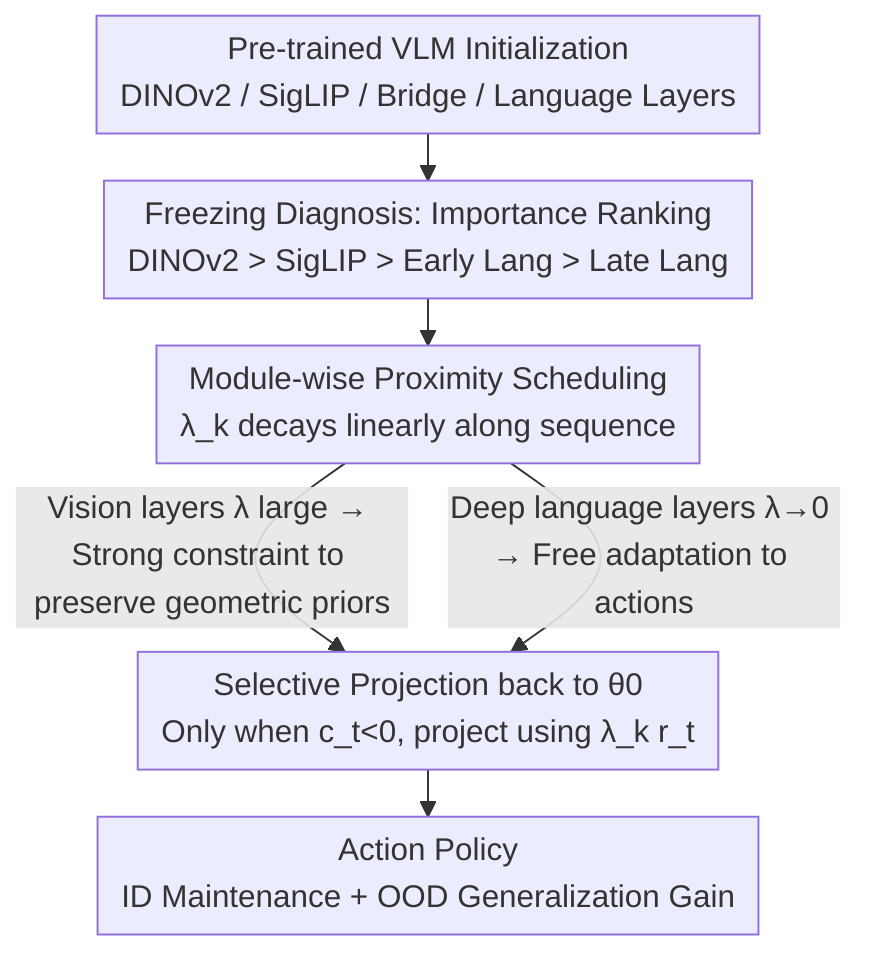

# MAPS: Preserving Vision-Language Representations via Module-Wise Proximity Scheduling for Better Vision-Language-Action Generalization

**Conference**: CVPR 2026  
**论文**: [CVF Open Access](https://openaccess.thecvf.com/content/CVPR2026/html/Huang_MAPS_Preserving_Vision-Language_Representations_via_Module-Wise_Proximity_Scheduling_for_Better_CVPR_2026_paper.html)  
**Code**: https://mapsvla.github.io (Project Page)  
**Area**: Robotics / VLA Generalization  
**Keywords**: VLA, Robust Fine-tuning, Catastrophic Forgetting, Projection Regularization, Module-wise Scheduling

## TL;DR
Addressing the issue where fine-tuning VLA models initialized from VLMs destroys pre-trained representations and compromises generalization, MAPS replaces the "global proximity constraint" in robust fine-tuning with a module-wise schedule that linearly decays from the vision encoder to the language layers. By keeping vision layers strictly tethered to pre-trained geometric priors while allowing action-oriented language layers to adapt freely—without adding parameters or data—OOD generalization is improved by up to 30% across SimplerEnv, CALVIN, LIBERO, and real-world Franka robots.

## Background & Motivation

**Background**: Vision-Language-Action (VLA) models represent a unified paradigm for robotic learning—perceiving environments, understanding linguistic instructions, and outputting actions end-to-end. Due to the scarcity of robotic data, training from scratch is impractical. Consequently, nearly all VLAs are initialized from VLMs pre-trained on web-scale data (e.g., DINOv2, SigLIP, LLaMA) and then fine-tuned on robotic data to learn action policies.

**Limitations of Prior Work**: While this "leverage VLM priors, then fine-tune for actions" approach yields strong task performance, it often comes at the cost of **sacrificing generalization**. Performance drops significantly when encountering unseen tasks, objects, or environments. The root cause is the scale mismatch between pre-training (large-scale, broad) and robotic fine-tuning (sparse, task-specific). Over-fine-tuning on narrow robotic data induces spurious correlations and overfitting, leading to the catastrophic forgetting of spatial reasoning, world knowledge, and linguistic grounding. Prior work has localized this evidence: ReVLA found that the DINOv2 encoder collapses after fine-tuning, with depth estimation degrading into low-detail, spatially uniform maps; other studies found that fine-tuned VLAs focus on irrelevant regions under OOD conditions, with feature spaces collapsing into degenerate clusters.

**Key Challenge**: VLA training is essentially a trade-off between "action adaptation" and "preservation of pre-trained generalization." Too much fine-tuning leads to drifting away from the pre-trained initialization, making the model brittle to distribution shifts; too little fine-tuning fails to align with the action space. Existing mitigation strategies have drawbacks: freezing the vision encoder preserves perception but limits robot-specific adaptation; dual-encoder architectures (one frozen, one trainable) double memory and computation; weight interpolation (gradually pulling vision weights back to the pre-trained state while tuning language) requires multi-stage training. Most of these methods focus solely on "preserving vision," **ignoring the role of semantic priors in language components**, and introduce additional computational or architectural complexity.

**Key Insight**: The authors first performed a systematic analysis using the simplest baseline—"model freezing." By decomposing the VLA into four blocks—DINOv2, SigLIP, early language layers, and late language layers—and freezing them individually, they measured ID/OOD performance. The results confirmed a frequently hypothesized but rarely quantified intuition: vision modules should be strongly constrained while language modules require greater flexibility, with a clear ranking of importance across modules. However, freezing itself introduces task-specific inductive biases, and certain freezing configurations actually fail in new domains. Thus, the authors turned to flexible soft regularization (Robust Fine-Tuning, RFT), but found that existing RFT methods apply a **uniform constraint strength via a single hyperparameter to the entire model**, implicitly assuming all layers should drift equally—which is ill-suited for VLAs where different components encode different priors and vary in sensitivity to fine-tuning.

**Core Idea**: Replace the global uniform constraint of RFT with a "layer-wise proximity constraint that linearly decays along the module sequence." Early vision layers use the strongest constraints to adhere to pre-trained geometric priors, while constraints loosen toward deeper language layers to allow for action semantic adaptation. This approach is plug-and-play, adding no parameters or data.

## Method

### Overall Architecture

MAPS does not alter the VLA network architecture; it is a robust fine-tuning framework applied during the **action fine-tuning phase**. The logic follows three steps: first, a "freezing diagnosis" to identify which modules to preserve or release (4.1–4.2); second, an analysis of why uniform constraints in existing soft regularization are insufficient (4.3); and finally, the implementation of the constraint strength as a module-wise linear decay scheduler (4.4).

It is built upon the family of projection-based robust fine-tuning (L2-SP → TPGM → SPD). These methods project updated weights back into a ball centered at the pre-trained initialization $\theta_0$ if the parameters drift too far. SPD (Selective Projection Decay) further uses a global scalar $\lambda$ to control the "aggression of the constraint radius expansion/contraction." The core contribution of MAPS is replacing the **globally uniform $\lambda$ of SPD with a module-wise $\lambda_k$ that decays linearly along the architectural sequence**.

### Key Designs

**1. Freezing Diagnosis: Quantifying "Importance Ranking" through Systematic Ablation**

Instead of designing the scheduler immediately, MAPS first answers "which modules should be preserved or released." Using the OpenVLA family (which combines DINOv2 and SigLIP into a joint vision encoder) as a baseline, the authors decomposed the VLA into four parts—DINOv2, SigLIP, early language layers, and late language layers. By enumerating various freezing combinations and testing on ID and OOD tasks, they turned the "freeze vision" intuition into quantifiable evidence, yielding five key observations: ① Language adaptation is essential (freezing the entire language backbone near-zeroes SimplerEnv and drops LIBERO by up to 60%); ② Freezing vision encoders generally improves performance (ID +7–17%, OOD +7–25% on SimplerEnv); ③ Late language layers drive task performance (tuning only late layers while freezing early ones improves OOD by +1–3% because they directly produce actions); ④ Preserving DINOv2 is more critical than SigLIP (freezing DINOv2 yields ~5% higher OOD than freezing SigLIP, as geometric priors are more vital than vision-language alignment); ⑤ Freezing effects are inconsistent across benchmarks—some configurations help in one but hurt in another, indicating that hard freezing injects task-specific inductive biases. Together, these form a clear importance gradient:

$$\text{DINOv2} > \text{SigLIP} > \text{Early Language} > \text{Late Language}$$

This ranking dictates the direction of the linear schedule—stronger constraints for the vision front-end, loosening toward the language back-end.

**2. From Hard Freezing to Soft Constraints: Addressing the Mismatch of Uniform RFT**

Freezing offers modularity (precise selection of skills to retain) but at the cost of strong inductive bias and brittleness in new domains. A natural alternative is soft regularization—Robust Fine-Tuning (RFT), which guides rather than prohibits updates. However, the authors found that applying existing RFT directly to action fine-tuning yielded only marginal gains. The reason lies in the formulations: L2-SP uses $\mathcal{L}_{\text{L2-SP}}=\mathcal{L}(\theta_t)+\frac{\lambda_{\text{reg}}}{2}\lVert\theta_t-\theta_0\rVert_2^2$ to penalize drift, TPGM uses a hard constraint $\lVert\theta_t-\theta_0\rVert_2\le\gamma$ with projection, and SPD uses a single scalar $\lambda$ to control radius dynamics. **All three use a global hyperparameter for the entire model**, implying all layers should contract or expand toward the pre-trained state at the same rate. This contradicts the diagnosis in step 1, which showed that different components should evolve at different rates. Uniform constraints flatten these structural differences, leading naive RFT to achieve only mediocre results.

**3. Module-Wise Proximity Scheduling: Replacing Global λ with Linearly Decaying $\lambda_k$**

This is the core of MAPS. Sub-modules are arranged as an ordered stack $L=(\ell_1,\dots,\ell_{|L|})$ following the architecture: DINOv2 → SigLIP → Bridge → Language. For the $k$-th module, proximity strength follows a linear decay:

$$\lambda_k=\lambda_{\max}\left(1-\frac{k-1}{|L|-1}\right)$$

Thus, early vision layers receive the strongest constraint $\lambda_1=\lambda_{\max}$, while the end of the language backbone decays to $\lambda_{|L|}=0$ (full fine-tuning). For modules initialized from scratch without pre-trained $\theta_0$ (action heads, proprioception projectors), $\lambda_k=0$ is used. During optimization, MAPS calculates the unconstrained step $\tilde\theta_t$ and checks the gradient-displacement correlation $c_t:=-g_t^\top(\theta_{t-1}-\theta_0)$. Only when $c_t<0$ (the update direction conflicts with preserving the pre-trained structure) is the module-specific projection applied:

$$\theta_t\leftarrow\tilde\theta_t-\lambda_k\, r_t\,(\tilde\theta_t-\theta_0)$$

Where $r_t$ is the deviation ratio from SPD. Unlike SPD, which uses a global constraint that cannot distinguish between layers with different gradient scales or semantic roles, MAPS explicitly encodes architectural structure into the constraints—ensuring minimal drift for DINOv2 and maximum adaptation for language layers.

### Loss & Training
MAPS does not introduce new loss terms. The task loss remains the native action objective of each backbone (e.g., L1 regression, diffusion denoising, flow matching, or discrete token classification). It only inserts the "selective projection according to $\lambda_k$" into the optimizer's update step. In all benchmarks, the authors fine-tuned base VLM weights directly using MAPS without relying on external large-scale pre-training data (like Open X-Embodiment).

## Key Experimental Results

### Freezing Diagnosis (Motivation Table)

Trends of module freezing on SimplerEnv / LIBERO ("Frz" = Preserve pre-training, "\\" = Full fine-tune):

| Configuration Key | Phenomenon | Inference |
|----------|------|------|
| Freeze entire Lang backbone | SimplerEnv near 0, LIBERO drops up to 60% | Lang adaptation is essential |
| Freeze vision encoders | SimplerEnv ID +7–17%, OOD +7–25% | Preserving vision priors is beneficial |
| Frz Early Lang, Tune Late Lang | OOD +1–3% | Late Lang layers produce actions |
| Frz DINOv2 vs. Frz SigLIP | DINOv2 ~5% higher OOD | Geometric priors > VL alignment |
| Certain freezing configs | Up in one benchmark, down in another | Hard freezing injects task bias |

### Main Results

OOD average changes for MAPS (relative to vanilla fine-tuning) across backbones:

| Backbone / Benchmark | Metric | Vanilla | +MAPS | Δ |
|----------------------|------|---------|-------|---|
| MiniVLA-OFT / SimplerEnv | Avg. ID | 13.5 | 30.0 | +16.5 |
| MiniVLA-OFT / SimplerEnv | Avg. OOD | 8.9 | 35.8 | **+26.9** |
| OpenVLA-OFT / SimplerEnv | Avg. OOD | 8.7 | 17.1 | +8.4 |
| MiniVLA-VQ / LIBERO | Avg. OOD | 0.0 | 4.75 | +4.75 |
| MiniVLA-OFT / LIBERO | Avg. OOD | 4.75 | 7.0 | +2.25 |
| Real Franka / MiniVLA-OFT | Avg. ID | 40.0 | 72.5 | +32.5 |
| Real Franka / MiniVLA-OFT | Avg. OOD | 22.5 | 52.5 | **+30.0** |

Notably, MiniVLA-OFT using only the small BridgeData V2 corpus achieves OOD performance comparable to or exceeding large models like RT-1-X (3.4), Octo (10.6), and π0 (40.9) when using MAPS. On CALVIN, MAPS brings +0.7 average sequence length and ~15% improvement in success rates for 2–5 consecutive tasks.

### Key Findings
- **The primary contribution is "differentiated preservation" rather than "preserving more"**: Naive RFT with uniform constraints showed minimal improvement. Significant OOD gains only occurred after introducing the module-wise linear decay—indicating the value lies in "structured differential constraints."
- **OOD gains far exceed ID gains**: Across most backbones, ID performance remained stable (or saw minor drops) while OOD surged (e.g., +26.9 for MiniVLA-OFT on SimplerEnv). This aligns with the design intent: preserving pre-trained generalization without sacrificing fitting.
- **Real-world gains are the most significant**: On the Franka robot, ID rose by +32.5 and OOD by +30.0. Gains were stronger than in simulation, suggesting that preserving priors is even more critical when data is sparse (~150 demos per task) and distribution shifts are real.
- **Schedule shape matters**: Linear scheduling outperformed constant and cosine shapes, aligning with the importance gradient identified in the freezing diagnosis.

## Highlights & Insights
- **Quantifying "folk wisdom" into a gradient for design**: By systematically measuring the importance (DINOv2 > SigLIP > Early Lang > Late Lang) and aligning the schedule to this gradient, the design is data-driven rather than heuristic. This "diagnose then design" paradigm is transferable to any pre-train-then-fine-tune generalization problem.
- **Minimal code change, significant impact**: Replacing the global $\lambda$ with a one-line linear decay $\lambda_k$ captures the bottleneck of RFT for heterogeneous architectures like VLAs with zero cost.
- **"Drifting the right modules at the right speed" is a general principle**: Applying full fine-tuning ($\lambda_k=0$) to scratch-initialized action heads while heavily constraining the vision front-end provides a structured approach to multi-module fine-tuning that can be extended to other domains like SFT for multimodal LLMs or layer-wise LoRA.

## Limitations & Future Work
- **Heuristic schedule shape**: While linear proved superior to constant/cosine, it may not be optimal for all architectures. The decay curve and $\lambda_{\max}$ remain hyperparameters requiring manual tuning; an adaptive scheduling mechanism is missing.
- **Module sequence depends on a defined stack**: The DINOv2 → SigLIP → Bridge → Language sequence is clear for OpenVLA, but for VLAs with intertwined vision/language structures, the "linear-decay-along-the-stack" assumption requires further validation.
- **Low absolute values on LIBERO**: Absolute success rates for some backbones remain in the single digits (e.g., 4.75%), indicating that while MAPS provides significant relative improvement, absolute generalization remains far from practical, partly due to the strict "no external pre-training" protocol.
- **Minor ID trade-offs**: In specific configurations (e.g., OpenVLA-OFT on LIBERO), ID performance dropped slightly (92→90), suggesting that heavy vision constraints can occasionally impair ID fitting.

## Related Work & Insights
- **vs. Freezing / Dual-encoders (ReVLA, Dual-encoder)**: These methods use hard freezing or extra trainable copies to preserve vision, either injecting brittleness through strong bias or doubling computational overhead. MAPS uses soft module-wise constraints with zero extra parameters and includes language priors.
- **vs. Weight Interpolation (ReVLA vision interpolation)**: Interpolation requires multi-stage training; MAPS is single-stage and end-to-end, automatically controlling drift via $\lambda_k$ during every optimization step.
- **vs. Unified RFT (L2-SP / TPGM / SPD)**: These treat the model as a monolith, which is ill-suited for the structural heterogeneity of VLAs. MAPS evolves SPD by making it "architecture-aware."

## Rating
- Novelty: ⭐⭐⭐⭐ A minimal yet effective extension of SPD that specifically targets the VLA structural bottleneck after data-driven diagnosis.
- Experimental Thoroughness: ⭐⭐⭐⭐⭐ Five backbones across SimplerEnv, CALVIN, LIBERO, and real Franka robots, supported by freezing diagnoses and ablation of schedule shapes.
- Writing Quality: ⭐⭐⭐⭐ Clear logical progression from freezing diagnosis to soft constraints. Mathematical transitions (L2-SP→TPGM→SPD→MAPS) are well-articulated.
- Value: ⭐⭐⭐⭐ Zero-cost, plug-and-play improvement of up to +30% OOD. The principle of "differentiated layer-wise preservation" is highly transferable.

<!-- RELATED:START -->

## Related Papers

- [\[CVPR 2026\] MoEActok: A MoE-based Action Tokenizer for Vision-Language-Action Models](moeactok_a_moe-based_action_tokenizer_for_vision-language-action_models.md)
- [\[CVPR 2026\] ACoT-VLA: Action Chain-of-Thought for Vision-Language-Action Models](acot-vla_action_chain-of-thought_for_vision-language-action_models.md)
- [\[ACL 2026\] When Does Language Matter? Multilingual Instructions Reveal Step-wise Language Sensitivity in Vision-Language-Action Models](../../ACL2026/robotics/when_does_language_matter_multilingual_instructions_reveal_step-wise_language_se.md)
- [\[CVPR 2026\] SRPO: Self-Referential Policy Optimization for Vision-Language-Action Models](srpo_self-referential_policy_optimization_for_vision-language-action_models.md)
- [\[CVPR 2026\] QuantVLA: Scale-Calibrated Post-Training Quantization for Vision-Language-Action Models](quantvla_scale-calibrated_post-training_quantization_for_vision-language-action_.md)

<!-- RELATED:END -->
