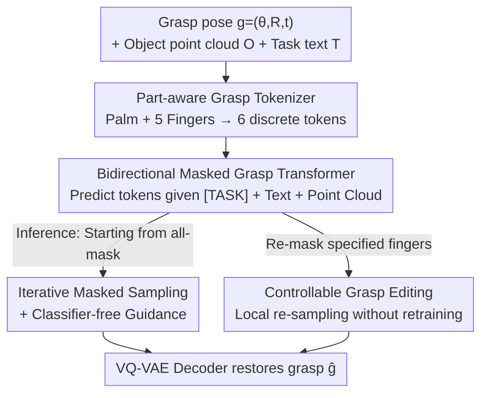

# MaskDexGrasp: Generative Masked Modeling for Part-Aware Dexterous Grasp Synthesis

**Conference**: CVPR 2026  
**Paper**: [CVF Open Access](https://openaccess.thecvf.com/content/CVPR2026/html/Zuo_MaskDexGrasp_Generative_Masked_Modeling_for_Part_Aware_Dexterous_Grasp_Synthesis_CVPR_2026_paper.html)  
**Area**: Robotics / Dexterous Grasp Synthesis  
**Keywords**: Dexterous Grasping, Part-Aware, VQ-VAE, Masked Modeling, Controllable Editing  

## TL;DR
MaskDexGrasp decomposes dexterous hand grasping into six components (palm + five fingers) based on hand anatomy, quantizes them into discrete tokens using VQ-VAE, and iteratively samples these tokens via a bidirectional masked Transformer conditioned on object point clouds and task text. This approach generates high-quality, semantically aligned, and per-finger editable grasps, achieving SOTA on the self-built TDG dataset (65k grasps / 260k texts / 11 task categories).

## Background & Motivation

**Background**: Dexterous grasp generation is a core task for achieving human-level robotic manipulation. Mainstream generative approaches compress the entire hand pose into a compact continuous latent space—using VAE-based or diffusion-based models—and then sample grasps from this space.

**Limitations of Prior Work**: Dexterous hands (e.g., Shadow Hand) possess 22 degrees of freedom (DoF) for joints, plus global rotation and translation, resulting in an extremely high-dimensional action space. Encoding the entire grasp "holistically" into a single latent vector erases the inherent structural and modular semantics of the hand—each finger actually plays distinct yet cooperative functional roles. Consequently, holistic latent spaces cannot decouple "how a specific finger responds to a conditional signal." This leads to poor coordination and weak generalization across tasks and object geometries. Another pain point is conditioning: many methods rely solely on object geometry, leading to a lack of semantic consistency, while the few methods incorporating task descriptions often suffer from ambiguous task conditions due to insufficient text diversity.

**Key Challenge**: There is a fundamental conflict between the "compactness" of a high-dimensional holistic latent space and the natural "part-based structure" of the hand. Achieving controllability, decoupling, and semantic alignment is hindered by holistic representations that merge these structural details into a single entity.

**Goal**: To unify "structural decomposition," "text-driven conditioning," and "controllable grasp generation" into a single framework that produces high-quality grasps while allowing for part-level editing.

**Key Insight**: The authors observe that dexterous grasping can be hierarchically decomposed into part-level hand primitives, where each primitive has a distinct but interdependent function. Inspired by the success of "discrete representation + autoregression" in human motion generation, they propose to discretize the grasp space.

**Core Idea**: Use "part-aware discrete tokens + bidirectional masked generation" to replace "holistic continuous latent vectors + single-step decoding," addressing the structural decoupling and controllable generation of high-dimensional dexterous grasps.

## Method

### Overall Architecture
MaskDexGrasp aims to solve "how to generate dexterous grasps conditionally while preserving the structural components of the hand." The pipeline consists of two training stages and one inference stage: first, a **part-aware grasp tokenizer** (VQ-VAE) is trained to discretize a grasp pose into 6 tokens (one for the palm and one for each of the five fingers); next, a **Bidirectional Masked Grasp Transformer (BMGT)** is trained to predict these 6 tokens conditioned on the object point cloud and task text; during inference, starting from an "all-mask" sequence, **iterative masked sampling** is used to fill in the tokens, refined by classifier-free guidance, and finally reconstructed into a grasp by the VQ-VAE decoder. The discrete representation also naturally enables **controllable editing**: local grasps can be modified by re-masking and re-sampling only specific finger tokens without retraining.

### Key Designs

**1. Part-aware Grasp Tokenizer: Decomposing the hand into six parts before discretization to solve the structure loss in holistic latent spaces**

To address the loss of modular semantics, the authors split the grasp along anatomical structures instead of using a single encoder for the whole hand. Specifically, the Shadow Hand grasp is parameterized as $g=(\theta, R, t)$, where $\theta\in\mathbb{R}^{22}$ represents joint angles, $R\in SO(3)$ the global orientation, and $t\in\mathbb{R}^3$ the translation. Forward kinematics converts $g$ into hand surface points $H\in\mathbb{R}^{2000\times3}$, which are partitioned into $N=6$ parts $\{H_i\}$ (palm + thumb/index/middle/ring/little fingers). Each part is independently encoded by a PointNet $E_i$ to obtain a latent vector $z_i=E_i(H_i)$, followed by nearest-neighbor quantization in a learnable codebook $B_i=\{b_i^k\}_{k=1}^K$:

$$\hat z_i = b_i^{s_i},\quad s_i = \arg\min_k \lVert z_i - b_i^k\rVert_2$$

The entire hand is thus compressed into an index sequence of length 6, $S=\{s_1,\dots,s_6\}$, serving as a "compositional representation." Training follows the standard VQ-VAE objective—reconstruction loss plus a commitment loss (with stop-gradient $sg[\cdot]$ and weight $\beta$): $L_{rec}=\lVert\hat g - g\rVert_2 + \sum_i\lVert\hat H_i - H_i\rVert$. This is effective because "one token per finger" naturally corresponds to the structural functional specialization of the human hand, transforming the complex grasp manifold into a discrete space suitable for compositional reasoning. EMA updates and codebook resets are used to prevent codebook collapse.

**2. Bidirectional Masked Grasp Transformer (BMGT): Using bidirectional masking instead of unidirectional autoregression to model local coordination and global dependencies**

With 6 tokens, the problem becomes conditional generation. Standard autoregression (predicting indices one by one) only sees previous tokens, which is suboptimal for modeling global coordination like inter-finger dependencies. BMGT employs **bidirectional masked modeling**: a random portion of tokens in sequence $S$ is replaced with $[MASK]$ to create $S_M$. The network recovers the masked tokens using bidirectional contexts under condition $C$, maximizing $\sum_i \log p(s_i\mid S_M, C)$. The condition $C$ is a fusion of three components: a learned $[TASK]$ embedding, a CLIP-encoded text embedding $t=F_T(T)$, and a PointNet-encoded object geometry embedding $o=F_O(O)$. A cosine schedule $\gamma(\tau)=\cos(\frac{\pi\tau}{2})$ controls the masking ratio. This allows each token to "see the whole picture," capturing both intra-finger coordination and inter-finger dependencies.

**3. Iterative Masked Sampling + Classifier-free Guidance: Progressively filling tokens for high-fidelity and diverse grasps**

Inference is an iterative process starting from a full-mask sequence $S^{(0)}=\{[MASK]_1,\dots,[MASK]_N\}$. Over $T$ iterations, BMGT predicts tokens and their confidence scores for masked positions. The tokens with the lowest confidence (approximately $\gamma(\frac{t}{T})\cdot N$) are re-masked for the next iteration, while high-confidence ones are kept until the sequence is complete. This "score-based progressive convergence" ensures generation quality. Furthermore, classifier-free guidance is applied: during training, conditions are dropped with $p_{uncond}=10\%$. At inference, the conditional logits are pushed away from unconditional ones using scale $s$: $\omega_g=(1+s)\cdot\omega_c - s\cdot\omega_u$, balancing fidelity and diversity.

**4. Controllable Grasp Editing: Leveraging discrete tokens and bidirectional masking for per-finger modification**

The combination of part-aware quantization and bidirectional masking enables local editing without retraining. For an estimated token sequence $\hat S$, tokens corresponding to fingers requiring modification are masked and re-sampled under a new condition $C'$. Formally, given an editable region $\Omega$, the context $S_{\bar\Omega}$ is fixed, and only $\tilde S_\Omega \sim p(S_\Omega\mid S_{\bar\Omega}, C')$ is updated. Since each finger is an independent token, modifying one does not disrupt the others, providing an interpretable interface for interactive adjustment.

### Loss & Training
Two-stage training: ① Tokenizer uses VQ-VAE objective $L_{VQ}=L_{rec}+\sum_i(\lVert sg[z_i]-\hat z_i\rVert_2^2 + \beta\lVert z_i - sg[\hat z_i]\rVert_2^2)$, with a $256\times512$ codebook, trained for 200 epochs (batch 256, ~7h); ② BMGT minimizes the negative log-likelihood of masked tokens $L_{AR}=-\sum_i\log p(s_i\mid S_M,([TASK];t;o))$, featuring a 9-layer Transformer (16 heads, 512 embedding dim), trained for 500 epochs (batch 128, ~18h). All were completed on a single RTX 4070Ti Super.

## Key Experimental Results

### Main Results
Evaluated on two subsets of the self-built TDG (Subset 1 from AffordPose, Subset 2 from OakShape) against 5 generative baselines across five metrics for quality and diversity.

| Dataset | Method | Suc.↑ | Q1↑ | Pen.↓ | Hmean↑ | Hstd↓ |
|--------|------|-------|-----|-------|--------|-------|
| Subset 1 | DexGraspAnything | 46.54 | 0.042 | 0.376 | **4.207** | 0.377 |
| Subset 1 | **Ours** | 44.68 | **0.048** | **0.340** | 3.876 | 0.421 |
| Subset 2 | DexGraspAnything | 58.90 | 0.125 | 0.477 | 3.662 | 0.253 |
| Subset 2 | **Ours** | **75.16** | **0.126** | **0.413** | **3.922** | 0.406 |

In Subset 2, success rate jumps from 58.90 to 75.16 (+16 points), leading in stability (Q1) and penetration (Pen.). In Subset 1, success rate is slightly lower than DexGraspAnything (44.68 vs 46.54), but Q1 and Pen. are superior. The authors note that while diffusion methods have advantages in diversity (Hmean)—a known weakness of VQ-VAE—the proposed method is superior in overall quality.

### Efficiency and Editing

| Metric | DGTR | DexGYS | SceneDiffuser | UGG | DexGraspAnything | Ours |
|------|------|--------|---------------|-----|------------------|------|
| Parameters (M)↓ | 3.85 | 23.14 | 22.98 | 67.03 | 159.68 | 71.29 |
| Inference Time (s)↓ | 0.284 | 0.202 | 1.130 | 3.236 | 4.417 | **0.033** |

Inference speed is dominant: 0.033s, approximately 130x faster than the strongest baseline DexGraspAnything (4.417s), because diffusion needs 50+ steps whereas this method requires very few iterations. Editing experiments confirm the ability to modify specific fingers without retraining.

### Ablation Study

| Config | Subset 2 Suc.↑ | Subset 2 Pen.↓ | Description |
|------|------|------|------|
| w/ vanilla VQ-VAE | 50.63 | 0.498 | Holistic hand latent, no part structure |
| Codebook 128×256 | 61.64 | 0.482 | Small codebook |
| Codebook 512×1024 | 72.57 | 0.410 | Large codebook |
| Iteration 3 | 74.47 | 0.464 | 3 iterations |
| Iteration 5 | 74.66 | 0.409 | 5 iterations |
| **Ours (256×512)** | **75.16** | 0.413 | Full model |

### Key Findings
- **Part-aware structure is the largest contributor**: Replacing it with a vanilla holistic VQ-VAE drops Subset 2 success rate from 75.16 to 50.63 (−24.5 points), proving "finger-based tokens" are the primary performance driver.
- **Codebook dimensions have a sweet spot**: Too small (128×256) leads to underfitting; too large (512×1024) slightly decreases performance while doubling parameters.
- **Diminishing returns for iterations**: 3 steps achieve 74+, and 5 steps offer marginal gains, explaining the extremely fast inference.
- Real-world deployment (XArm7 + Freedom Hand) demonstrates stable grasping across various objects, validating Sim-to-Real transferability.

## Highlights & Insights
- **"One token per finger" is the central theme**: Mapping hand anatomy directly to a discrete sequence structure provides architectural decoupling, compositional reasoning, and retraining-free editing. The 24-point drop in ablation shows this is the "lifeblood" of the performance.
- **Cross-domain paradigm transfer**: Adapting the "VQ codebook + Bidirectional Masked Transformer" recipe from human motion generation (e.g., MaskGIT/MoMask) to dexterous grasping is a successful cross-task migration that could be applied to other structured high-dimensional pose generation tasks.
- **Discrete representation solves "editability"**: Holistic continuous spaces usually suffer from the "butterfly effect" where changing one joint affects everything. Token-level masking allows for precise modifications, such as "only changing the ring finger," which is highly practical for human-robot collaboration.
- **Speed advantage is algorithmic, not just engineering**: The 0.033s speed results from the "fixed length 6 tokens + few iterations" paradigm versus the "50-step denoising" of diffusion.

## Limitations & Future Work
- **Discrete Scope**: The framework relies on a finite discrete space, which may limit diversity and adaptation to continuous control compared to diffusion models.
- **Static Single-step**: Currently generates only static grasp poses, not dynamic trajectories or multi-step manipulation; the authors aim to address dynamic generation in the future.
- **Subset 1 Success Rate**: Not the SOTA in all metrics on Subset 1, suggesting that discrete representations might be more effective for stability and penetration than raw success rate in certain data distributions.
- **Dataset Concerns**: Evaluation on a self-built TDG dataset complicates cross-comparisons with original paper reports. Text labels generated by VLMs (Qwen-VL-Max) may contain unquantified biases.

## Related Work & Insights
- **vs Holistic Generative Models (UGG, DexGraspAnything)**: These compress the hand into one continuous latent vector. This work uses 6 discrete tokens, offering faster speed, better stability, and per-finger editability at the cost of slightly lower diversity.
- **vs Task-conditioned Grasping (DexGYS, DGTR)**: While they also include task conditions, they do so in holistic spaces, making it difficult to decouple how specific fingers respond.
- **vs Human Motion Generation (MoMask)**: This work inherits the core "VQ + Bidirectional Masked Sampling" mechanism but substitutes temporal tokens for anatomical part tokens.

## Rating
- Novelty: ⭐⭐⭐⭐ 
- Experimental Thoroughness: ⭐⭐⭐⭐ 
- Writing Quality: ⭐⭐⭐⭐ 
- Value: ⭐⭐⭐⭐ 

<!-- RELATED:START -->

## Related Papers

- [\[CVPR 2026\] DextER: Language-driven Dexterous Grasp Generation with Embodied Reasoning](dexter_language-driven_dexterous_grasp_generation_with_embodied_reasoning.md)
- [\[CVPR 2026\] GeoDexGrasp: Geometry-aware Generation for Data-efficient and Physics-plausible Dexterous Grasping](geodexgrasp_geometry-aware_generation_for_data-efficient_and_physics-plausible_d.md)
- [\[ICCV 2025\] DexVLG: Dexterous Vision-Language-Grasp Model at Scale](../../ICCV2025/robotics/dexvlg_dexterous_vision-language-grasp_model_at_scale.md)
- [\[AAAI 2026\] Towards Affordance-Aware Robotic Dexterous Grasping with Human-like Priors](../../AAAI2026/robotics/towards_affordance-aware_robotic_dexterous_grasping_with_human-like_priors.md)
- [\[CVPR 2026\] Iterative Closed-Loop Motion Synthesis for Scaling the Capabilities of Humanoid Control](iterative_closed-loop_motion_synthesis_for_scaling_the_capabilities_of_humanoid_.md)

<!-- RELATED:END -->
