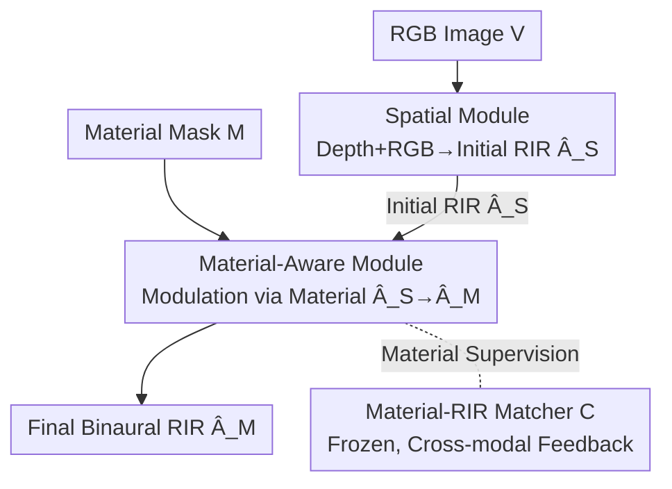

# Materialistic RIR: Material Conditioned Realistic RIR Generation

**Conference**: CVPR 2026  
**arXiv**: [2604.21119](https://arxiv.org/abs/2604.21119)  
**Code**: None  
**Area**: Embodied AI / Acoustic Rendering / Multimodal RIR Generation  
**Keywords**: Room Impulse Response, Material-conditioned Generation, Spatial-material Decoupling, Vision-to-audio, Cross-modal Supervision

## TL;DR
Given an indoor RGB image and a user-specified "material segmentation map," MatRIR utilizes a **spatial module** to predict an initial RIR related only to the room layout, followed by a **material-aware module** that "modulates" it into the final binaural room impulse response according to materials. This allows users to change materials arbitrarily (e.g., carpeting a floor or adding steel plates to walls) and hear corresponding reverberation changes without altering the spatial structure. It achieves a 16.8% reduction in RT60 error compared to the strongest baseline and a 71% improvement in material consistency.

## Background & Motivation
**Background**: Room Impulse Response (RIR) characterizes how sound reflects, absorbs, and scatters in a scene before reaching the listener. Convolving it with any audio reproduces how that sound would be heard in that specific room. Recent mainstream methods focus on predicting RIRs from single or multi-modal observations (RGB, depth, audio) to bypass expensive physical wave simulations, serving applications like VR/AR, robotics, and spatial audio design.

**Limitations of Prior Work**: Existing methods typically **encode visual, spatial, and material cues jointly into a single latent representation** to predict RIRs. This joint encoding entangles the contributions of semantics, material, and layout, making the model learn implicit correlations. Consequently, users cannot adjust a single factor independently (e.g., "only change the wall to concrete") to obtain a matching RIR. While the recent M-CAPA first supported RIR generation with arbitrary material configurations, it **still employs joint modeling**, resulting in correlated representations with limited fine-grained control; furthermore, it depends on clean audio input, which is difficult to obtain in real-world scenarios.

**Key Challenge**: Acoustics are influenced by both **spatial layout** (geometry of walls and objects determining reflection paths) and **surface materials** (absorption/transmission coefficients of wood, concrete, carpet). These should ideally be two independent, controllable knobs; however, joint learning in one latent space inevitably leads to entanglement, rendering the material knob non-functional.

**Goal**: (1) Achieve **explicit decoupling** of space and material during RIR generation, allowing users to swap materials while maintaining spatial structure; (2) Enable **purely visual** input (independent of audio) for practicality; (3) Propose evaluations for "material sensitivity" that standard RIR metrics fail to capture.

**Key Insight**: Instead of expecting the network to separate materials from entangled representations, the **architecture level** is split into two serial modules: a spatial geometry phase producing an initial RIR, followed by a material module performing modulation. In this way, the spatial component is naturally material-agnostic, and the material knob is physically isolated.

**Core Idea**: A **two-stage decoupled architecture**—where a spatial module estimates RIR followed by a material-aware module modulating it via material masks—is used to replace the old paradigm of joint encoding into one latent, resulting in controllable, interpretable, and vision-only material-conditioned RIR generation.

## Method

### Overall Architecture
MatRIR (Material-Aware RIR Network) addresses **material-conditioned RIR generation**: it takes a $90^\circ$ FoV RGB image $V$ and a material segmentation mask $M$ (where each pixel belongs to one of $N$ material categories) as input, and outputs the binaural RIR spectrogram $\hat{A}$ recorded at the camera position (two channels, $256\times256$, corresponding to 0.5s / 16kHz impulse response). The full model $\mathcal{F}(V,M)=\hat{A}$ consists of two serial modules: the **spatial module** $\mathcal{F}_S$ extracts geometric cues from the image to produce an initial RIR $\hat{A}_S$ reflecting only layout; the **material-aware module** $\mathcal{F}_M$ then takes $\hat{A}_S$ and the material mask $M$ to "modulate" material-related absorption, reflection, and transmission effects, yielding the final $\hat{A}_M$. During training, losses constrain the acoustic consistency of both $\hat{A}_S$ and $\hat{A}_M$ with the ground truth, while a frozen "material-RIR matcher" provides cross-modal material supervision.

### Key Designs

**1. Spatial Module: Geometry-only, producing material-agnostic initial RIR**

Previous methods entangle material and space, making material control impossible. Here, the spatial component is isolated first. The spatial module $\mathcal{F}_S$ uses a pre-trained MiDaS depth predictor to estimate a normalized depth map $\hat{D}\in[0,1]^{H\times W}$ from RGB, then uses a pre-trained DINOv2-Large to encode $V$ and $\hat{D}$ into visual features $e_v$ and depth features $e_d$ (layer 18, 256 tokens, dimension 1024). Depth provides coarse room layout, while RGB supplements detailed arrangements of objects and surfaces. The spatial RIR decoder $\mathcal{R}_S$ fuses these features with modality embeddings $s_v, s_d$ into $f\in\mathbb{R}^{256\times512}$, using a 4-layer transformer decoder with "spatial queries" to cross-attend and extract spatial RIR features $g_s$. Finally, an upsampling network $\mathcal{U}_S$ restores $g_s$ into the initial spectrogram $\hat{A}_S$. Crucially, $\hat{A}_S$ **does not see materials**—qualitative results show that when materials are changed for the same scene, the texture of $\hat{A}_S$ remains constant, directly proving decoupling.

**2. Material-Aware Module: Material modulation rather than re-generation**

Given the material-agnostic $\hat{A}_S$, the material module $\mathcal{F}_M$ aims to **modulate** this initial estimate by injecting material-specific effects like transmission and absorption. It encodes the material mask $M$ into features $e_m\in\mathbb{R}^{256\times1024}$ using DINOv2-Large. Simultaneously, it extracts spatial audio features $e_s$ from $\hat{A}_S$ patches via a small MLP. The material RIR encoder $\mathcal{R}_M$ (4-layer transformer encoder) performs self-attention on $e_m$, $e_s$, and a set of **reweighting tokens** $R$ (projected as $e_r$) to output material-aware audio features $g_m$ and reweighting features $g_r$. Finally, the upsampler $\mathcal{U}_M$ restores $g_m$ to $\hat{A}_M$, using $g_r$ to modulate feature importance at each upsampling layer. Implementing "material conditioning" as "attentional modulation over existing spatial RIR" preserves spatial fidelity while making material an independent knob.

**3. Reweighting tokens: Layer-wise injection of material cues**

Injecting material cues only at the final layer is often insufficient, as material effects manifest across different time-frequency scales. This paper introduces four **audio feature reweighting tokens** $R$. After self-attention in $\mathcal{R}_M$, they yield $g_r$, which is used at **every layer** of the upsampler $\mathcal{U}_M$ to reweight the importance of features at that resolution. This informs the network which audio features are most critical for the current material configuration at specific resolutions. Ablations show that removing $R$ causes RTE to jump from 77.18ms to 142.4ms and MatC to crash from 89.29% to 20.02%, indicating that layer-wise injection of material cues is vital for material sensitivity.

**4. Material-RIR Matcher $\mathcal{C}$: Cross-modal alignment for material supervision**

Regression losses against ground truth RIRs provide limited material sensitivity. The authors **pre-train** a material-RIR matching network $\mathcal{C}$ to output 1 for matching (RIR, material mask) pairs and 0 otherwise. $\mathcal{C}$ is **frozen** during the training of $\mathcal{F}$. $M$ and the predicted $\hat{A}_M$ are fed into it to evaluate their correspondence, and the error is backpropagated to $\mathcal{F}_M$ as an auxiliary loss $L_C$. This acts as a specialized referee focusing solely on "material correctness." Ablations show that removing $\mathcal{C}$ drops MatC from 89.29% to 65.02%, identifying this cross-modal referee as the primary contributor to material classification accuracy.

### Loss & Training
The total loss is $\mathcal{L}=\mathcal{L}_S+\mathcal{L}_M$, supervising both initial and final estimates:

$$\mathcal{L}_S=\lambda_1\|\hat{A}_S-A\|_1+\lambda_2 L_D(\hat{A}_S,A)$$

$$\mathcal{L}_M=\lambda_1\|\hat{A}_M-A\|_1+\lambda_2 L_D(\hat{A}_M,A)+\lambda_3 L_C(\hat{A}_M,M)$$

where $\|\cdot\|_1$ is the L1 loss on magnitude spectrograms; $L_D$ is the energy decay loss ensuring the predicted and ground truth RIR have similar energy decay curves to capture late reverberation; $L_C$ is the cross-modal correspondence loss from the frozen matcher $\mathcal{C}$. Training uses Adam with cosine annealing, initial learning rate $7\times10^{-5}$, and batch size 150.

## Key Experimental Results

The dataset used is Acoustic Wonderland (AcoW, from M-CAPA): 76 seen scenes + 8 unseen scenes, 2673 material configurations. The test set comprises three splits: $D_{us}$ (seen material configurations), $D_{uu}$ (unseen material configurations), and $D_{uk}$ (unseen configurations with mismatched pairings). Metrics include L1, STFT, RTE (RT60 error, ms), CTE (Clarity error, dB), and new metrics MatC / MatD (Material Classification/Distribution Accuracy, %).

### Main Results (Representative figures for unseen scenes)

| Split | Metric | MatRIR | M-CAPA (Strongest Baseline) | Image2Reverb |
|-------|------|--------|------------------|--------------|
| $D_{us}$ | RTE↓ (ms) | **75.56** | 89.23 | 245.2 |
| $D_{us}$ | MatC↑ (%) | **89.26** | 9.32 | 10.01 |
| $D_{us}$ | MatD↑ (%) | **31.75** | 21.85 | 9.01 |
| $D_{uu}$ | RTE↓ (ms) | **77.18** | 92.80 | 223.3 |
| $D_{uu}$ | L1↓ (×$10^{-2}$) | **5.60** | 6.06 | 14.13 |
| $D_{uk}$ | RTE↓ (ms) | **77.69** | 91.75 | 244.5 |

RTE on $D_{us}$ dropped from 89.23ms to 75.56ms (~15.3% reduction). While baselines scored in the single digits or low teens for MatC, MatRIR achieved ~89%, a gain of approximately 71%.

### Ablation Study ($D_{uu}$ split)

| Config | RTE↓ (ms) | MatC↑ (%) | MatD↑ (%) | Mechanism |
|------|-----------|-----------|-----------|------|
| Full model | 77.18 | 89.29 | 31.0 | Full Model |
| a) w/o $\mathcal{C}$ | 78.94 | 65.02 | 29.30 | Removing matcher drops MatC by 24 points |
| b) w/o $R$ | 142.4 | 20.02 | 11.20 | Removing reweighting tokens doubles RTE and crashes MatC |
| c) w/ $(V,D)$ Only | 154.7 | 9.09 | 9.95 | Spatial only; material metrics crash |
| d) w/ $M$ Only | 97.78 | 18.20 | 17.25 | Material only; lacks spatial context |

### Key Findings
- **Reweighting tokens $R$ provide the largest contribution**: Removing them caused RTE to skyrocket and MatC to collapse, proving that layer-wise injection of material cues is the lifeblood of material sensitivity.
- **Both space and material are indispensable**: Using only the spatial module (row c) resulted in failed material metrics, while using only the material module (row d) significantly worsened RTE. Explicitly modeling both separately is superior to joint modeling.
- **Standard metrics and material metrics aren't always aligned**: Improvements in RTE do not always correlate with MatC/MatD, justifying the introduction of material-sensitive metrics.
- **User Study**: In 60.4% of cases, 7 subjects perceived MatRIR as more realistic than M-CAPA.
- **Failures**: When the camera is too close to a wall or the FOV is restricted, the model over-relies on spatial cues and becomes insensitive to material (Fig. 5); $360^\circ$ views are suggested for future work.

## Highlights & Insights
- **Decoupling via Architecture, not just Losses**: Rather than relying on regularization to separate latent factors, this work uses a serial structure ("spatial estimation → material modulation"). $\hat{A}_S$ remains constant when materials change—this "structure for controllability" approach is applicable to any generative task requiring factor separation.
- **Frozen Referee Network for Cross-modal Supervision**: Pre-training a matcher and then freezing it as a loss function converts the hard-to-regress "material correctness" into a backpropagatable signal. This trick is effective for any scenario where the output is difficult to supervise pixel-wise but can be judged against conditions.
- **Metrics as a Contribution**: Standard RIR metrics failed to detect material quality, so the authors designed MatC and MatD. Introducing evaluation protocols that expose existing blind spots is a robust research practice.
- **Vision-only and Material-swappable**: Unlike the audio-dependent M-CAPA, MatRIR requires only RGB + material masks, aligning with real-world interactions like "drag-and-drop materials to hear acoustic effects."

## Limitations & Future Work
- The model degrades to spatial dependency when the camera is too close to walls; $360^\circ$ panoramic views are suggested as a remedy.
- Sensitivity relies on a **dense material segmentation mask** $M$; obtaining these labels in real-world deployments remains challenging.
- Evaluation was limited to the synthetic Acoustic Wonderland dataset; generalization to real rooms and the ability to capture high-frequency material differences under the 0.5s/16kHz setting were not fully verified.
- The user study was small (7 subjects), and while 60.4% favorability is a majority, it lacks overwhelming statistical dominance.

## Related Work & Insights
- **vs M-CAPA**: M-CAPA first supported arbitrary materials but used **joint modeling** (entangled representations) and required audio. MatRIR is decoupled, vision-only, reduces RTE by ~16.8%, and raises MatC from single digits to ~89%.
- **vs Image2Reverb / FAST-RIR++**: These are vision-only but ignore materials, resulting in near-random material metrics. MatRIR proves material modeling is essential for realism.
- **vs JM-* Joint Modeling Baselines**: Baselines using the same $(V,\hat{D},M)$ inputs with **joint encoding** were outperformed by MatRIR. This confirms that the performance gain stems from the explicit structural decoupling rather than just the additional material input.

## Rating
- Novelty: ⭐⭐⭐⭐ Incorporating spatial-material decoupling into a serial architecture with frozen cross-modal supervision is a clear and effective approach.
- Experimental Thoroughness: ⭐⭐⭐⭐ Extensive splits, ablations, and user studies, though real-world generalization remains unverified.
- Writing Quality: ⭐⭐⭐⭐ Motivation and architecture are well-explained; metrics are clearly defined.
- Value: ⭐⭐⭐⭐ Provides a practical vision-only solution for interactive acoustic design and VR applications.

<!-- RELATED:START -->

...

## Related Papers

- [\[AAAI 2026\] Realistic Synthetic Household Data Generation at Scale](../../AAAI2026/robotics/realistic_synthetic_household_data_generation_at_scale.md)
- [\[ACL 2026\] GoViG: Goal-Conditioned Visual Navigation Instruction Generation via Multimodal Reasoning](../../ACL2026/robotics/govig_goal-conditioned_visual_navigation_instruction_generation_via_multimodal_r.md)
- [\[CVPR 2026\] MM-ACT: Learn from Multimodal Parallel Generation to Act](mm-act_learn_from_multimodal_parallel_generation_to_act.md)
- [\[CVPR 2026\] Towards Human-Like Robot Handwriting via Contour-Aware Generation](towards_human-like_robot_handwriting_via_contour-aware_generation.md)
- [\[CVPR 2026\] Scalable Trajectory Generation for Whole-Body Mobile Manipulation](scalable_trajectory_generation_for_whole-body_mobile_manipulation.md)

<!-- RELATED:END -->
