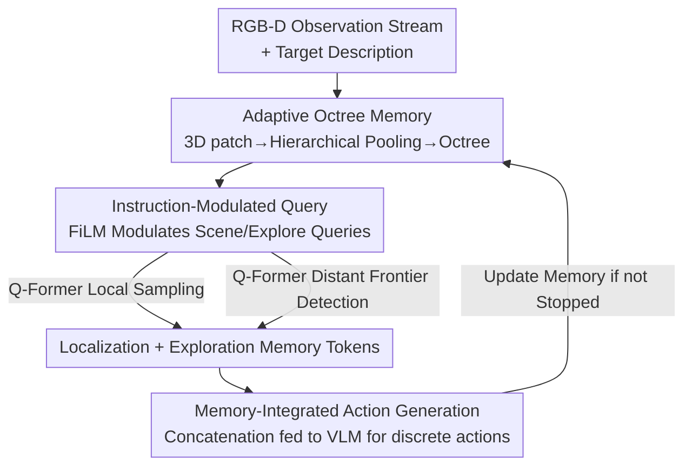

# Memory-Augmented Scene Understanding and Exploration for Open-World Aerial Object-Goal Navigation

**Conference**: CVPR 2026  
**Paper**: [CVF Open Access](https://openaccess.thecvf.com/content/CVPR2026/html/Zhou_Memory-Augmented_Scene_Understanding_and_Exploration_for_Open-World_Aerial_Object_Goal_Navigation_CVPR_2026_paper.html)  
**Area**: Embodied Navigation / Robotics / Vision-Language Navigation  
**Keywords**: Aerial Object Navigation, UAV, Octree Memory, Instruction-Modulated Query, Embodied AI

## TL;DR
Focusing on the Aerial ObjectNav task in large-scale outdoor scenes—where only target descriptions are provided without step-by-step instructions—this paper proposes OctMem-Agent. It utilizes an **adaptive octree memory** to incrementally aggregate historical RGB-D observations into a scalable hierarchical 3D representation, then employs **instruction-modulated memory queries** to extract compact "localization" and "exploration" tokens for VLA decision-making. On the UAV-ON benchmark, the success rate is improved by 7.5% over the previous SOTA.

## Background & Motivation
**Background**: Aerial Object-Goal Navigation (ObjectNav) requires a UAV to autonomously fly near a target object based solely on visual observations and a high-level description (e.g., "a round fruit with a smooth surface and green stripes") without step-by-step instructions. This is a critical capability for UAVs in emergency rescue, search and rescue, and package delivery, where communication is often disrupted and manual remote control is unavailable. Existing methods (AOA, OpenFly) mostly feed the current frame plus a few recent frames or pose history directly into a VLM to generate actions.

**Limitations of Prior Work**: These methods rely solely on local observations and short-term history, lacking global scene understanding and long-term spatial memory. AOA uses current observations plus recent poses, and OpenFly uses only the current frame plus the two previous frames. This leads to "myopic decision-making," causing the UAV to fly in circles in large outdoor areas, repeatedly exploring the same regions without finding the target.

**Key Challenge**: Can scene representations from indoor ground navigation be directly applied? No. Dense voxel maps and neural feature fields commonly used in indoor navigation grow **cubically** with scene volume, which is unsustainable for large-scale outdoor environments. Sparse representations like topological maps or mesh graphs are designed for indoor object-level scenes; their discrete abstractions and hierarchical structures fail to generalize in large-scale outdoor environments characterized by drastic height and viewpoint changes. In short: **fine precision (seeing nearby objects clearly) and memory efficiency (not exploding in distant areas) directly conflict in large-scale aerial scenes**.

**Goal**: Split into two sub-problems: (1) Construct a spatial memory that preserves local details while compressing large distant areas and scales incrementally during flight; (2) Extract truly useful information from this memory **based on the current task** to support both precise target localization and active exploration of unexplored areas.

**Key Insight**: The authors observe that requirements for "near" and "far" are fundamentally different in navigation. Precise target approach requires fine-grained local geometry and semantics, whereas effective exploration only requires the rough layout of distant space and frontiers between explored and unexplored areas. Thus, **distance-adaptive voxel granularity** is used to match this asymmetric demand, with an octree serving as the scalable index.

**Core Idea**: Replace single dense or sparse maps with a "distance-adaptive octree memory + instruction-modulated dual-category query," providing the UAV with both **long-term scene understanding** and **active frontier exploration** capabilities.

## Method

### Overall Architecture
OctMem-Agent is built on the OpenVLA framework, transforming it into a discrete action predictor for Aerial ObjectNav. The workflow follows three steps: For each RGB-D observation, it is first aggregated into a global **adaptive octree memory** (incrementally updated over time). Then, a set of learnable queries modulated by language instructions extracts two types of compact tokens via a Q-Former: scene tokens for localization and exploration tokens for identifying unexplored frontiers. Finally, these memory tokens, the current frame, and language instructions are concatenated into a sequence and fed into the VLM backbone, with an action decoder outputting discrete actions (Move Forward, Turn Left/Right, Up, Down, Stop).

Formulating the problem: Given a language instruction $I_{goal}$ describing the target, the agent starts from an initial 3D pose $p_0=(x_0,y_0,z_0,\phi_0)$. At each time step $t$, it receives observations $O_t=\{D_t,V_t\}$ (depth map + RGB) and outputs an action $a_t\in\mathcal{A}$ to update the pose. Translation is 3 units, elevation change is 3 meters, and rotation is 30 degrees; the mission is successful if the agent lands within 20 meters of the target.

### Key Designs

**1. Adaptive Octree Memory: Balancing local detail and memory efficiency via distance-adaptive voxel granularity**

This design directly addresses the core conflict in large-scale aerial scenes. Memory construction consists of three stages. **3D Patch Representation**: For each RGB frame, a vision encoder extracts patch features $X_p\in\mathbb{R}^{h\times w\times d}$. Using camera parameters and depth, each patch is back-projected into 3D world coordinates $P\in\mathbb{R}^{h\times w\times 3}$. These are encoded into 3D positional embeddings $P'$ via a two-layer MLP and added to 2D features to obtain spatial 3D patches: $X_{3D}=X_p+P'$. **Hierarchical Spatial Aggregation** is the core mechanism: points beyond $d_{max}$ (e.g., points 10,000m away when searching for a 100m target) are filtered out. Remaining points are divided into $K$ intervals $D=\{[d_0,d_1),\dots,[d_{K-1},d_K]\}$ based on their distance to the agent. Each interval uses a voxel size $s_k$ where $s_1<s_2<\cdots<s_K$. Fine voxels preserve geometric/semantic details nearby, while coarse voxels capture large-scale layouts and frontiers afar. Points and features within the same voxel are mean-pooled: $x_v=\frac{1}{|I_v|}\sum_{i\in I_v}x_i$. **Memory Integration**: Aggregated patches are incrementally inserted into a global octree $M_t$, recursively partitioning space. Features falling into existing cells are updated by averaging, while new cells are created for unvisited areas. This allows for fast spatial indexing and infinite scalability during flight without the cubic memory explosion of dense voxels.

**2. Instruction-Modulated Query: Making queries "aware" of the current target**

If a fixed set of learnable queries is used to retrieve memory, it treats all tasks equally, extracting information irrelevant to the current goal. This design uses **Feature-wise Linear Modulation (FiLM)** to inject instruction information into the queries. A pretrained language encoder encodes the instruction $I_{goal}$ into a vector $e_I\in\mathbb{R}^d$ via mean pooling. Linear projections then calculate feature-wise scaling $\gamma(e_I)$ and shift $\beta(e_I)$ to apply an affine transformation to the initial queries:

$$Q_{task}=\mathrm{FiLM}(Q,e_I)=(1+\gamma(e_I))\odot Q+\beta(e_I)$$

where $\odot$ denotes element-wise multiplication along the feature dimension. This step ensures that subsequent memory attention is "conditioned on the navigation goal." Ablations show that removing this modulation (IMQ) causes drops across SR, OSR, and SPL.

**3. Task-Aware Memory Extraction: Scene and Exploration queries for specific roles**

Localization and exploration have different needs. This design splits $Q_{task}$ into two complementary subsets that query different memory regions. **Scene tokens** $Q_{scene}\in\mathbb{R}^{N_s\times d}$ focus only on memory voxels within a boundary distance $d_b$, targeting semantic objects that match the target description for precise localization. **Exploration tokens** $Q_{explore}\in\mathbb{R}^{N_e\times d}$ focus on voxels beyond $d_b$, identifying frontiers between explored and unexplored regions to guide the UAV to potential search areas when the target is not yet found. Both share the same FiLM modulation ($N_s+N_e=N_q$). In the $L$ layers of the Q-Former, each layer perform self-attention followed by cross-attention with the memory. For cross-attention, the memory is split by the boundary distance:

$$M_{near}=\{m_c^{(t)}\in M_t\mid dis(c)<d_b\},\quad M_{far}=\{m_c^{(t)}\in M_t\mid dis(c)\geq d_b\}$$

Scene tokens only cross-attend with $M_{near}$ to capture local context, while exploration tokens only cross-attend with $M_{far}$ to find distant unexplored areas, producing complementary $Q^{(L)}_{scene}$ and $Q^{(L)}_{explore}$. This "hard partitioning" ensures each token type serves its purpose, preventing localization queries from being distracted by distant noise and exploration queries from being overwhelmed by local details.

### Loss & Training
Action generation follows OpenVLA: $Q^{(L)}_{scene}$ and $Q^{(L)}_{explore}$ are concatenated and linearly projected into a memory representation $H_{mem}$. Along with the current frame $H_{obs}$ and instruction $H_{lang}$, these are fed as a sequence $H_{input}=[H_{lang},H_{obs},H_{mem}]$ into the VLM backbone. An action decoder discretizes the predicted tokens into actions. The vision encoder combines DINOv2 + SigLIP features, and the LLM backbone uses LLaMA-2 7B, initialized with weights from the same pretraining as OpenFly for fair comparison. Hyperparameters: $d_{max}=500$, $d_b=50$, intervals $D=[0,d_b), [d_b,d_{max})$ with steps $s_k\in\{5,25\}$. Total $N_q=144$ queries ($N_s=128$, $N_e=16$). Batch size 64, learning rate 2e-5, trained for 2 epochs on 4 L20 GPUs. Training trajectories are shortest reachable paths generated by 3D A* on the UAV-ON annotations.

## Key Experimental Results

### Main Results
The UAV-ON benchmark contains 14 high-fidelity outdoor environments (villages, towns, cities, forests, water) built in Unreal Engine, 1,270 target objects, and 10,000 training episodes (10 environments) + 1,000 test episodes (10 seen environments + 4 held-out environments with new objects). Metrics are SR (Success Rate within 20m), OSR (Oracle Success Rate along trajectory), and SPL (Success weighted by Path Length).

| Object Size | Metric | OctMem-Agent | OpenFly (Prev. SOTA) | Navid | CLIP-H (Zero-shot) |
|-------------|--------|--------------|----------------------|-------|--------------------|
| Total       | SR↑    | **19.50%**   | 12.00%               | 11.50%| 6.20%              |
| Total       | OSR↑   | **29.30%**   | 25.90%               | 29.10%| 11.90%             |
| Total       | SPL↑   | 6.37%        | 6.09%                | **6.44%**| 4.15%           |
| Small       | SR↑    | **18.91%**   | 12.40%               | 10.02%| 2.86%              |
| Large       | SR↑    | **23.60%**   | 13.04%               | 17.39%| 13.04%             |

Compared to trained aerial VLN models, OctMem-Agent's SR is **7.5%** higher than OpenFly and 8.0% higher than Navid. Compared to zero-shot methods, it surpasses CLIP-H by 13.4% SR and AOA-F by 12.2% SR. Note that SPL is roughly tied with Navid (6.37 vs 6.44), indicating that the main Gain comes from "finding the target/finding accurately" rather than significantly superior path efficiency.

Generalization (Seen vs. Unseen):

| Setting | Method | SR↑ | OSR↑ | SPL↑ |
|---------|--------|-----|------|------|
| Seen    | OctMem-Agent | **22.72%** | **30.48%** | **8.40%** |
| Seen    | OpenFly      | 12.29%     | 26.20%     | 6.83%     |
| Unseen  | OctMem-Agent | **17.57%** | 28.59%     | 5.15%     |
| Unseen  | Navid        | 10.70%     | 28.51%     | 5.99%     |

SR still leads in unseen environments (new objects/instructions), but SPL (5.15%) is lower than Navid (5.99%), suggesting that while it finds targets more frequently in new scenes, it takes less efficient paths.

### Ablation Study
| Configuration | SR↑ | OSR↑ | SPL↑ | Description |
|---------------|-----|------|------|-------------|
| Baseline      | 12.40% | 20.60% | 3.35% | Pure observation-based decision making |
| + Octree Memory | 15.70% | 21.10% | 4.35% | Multi-scale spatial encoding |
| + Instruction-Modulated Query (Full) | **19.50%** | **29.30%** | **6.37%** | Complete model |
| Full w/o Hierarchical Aggregation | 19.10% | 27.50% | 5.70% | Drop in OSR/SPL (uniform voxels) |
| Full w/o FiLM Modulation (IMQ) | 18.60% | 27.30% | 5.97% | General slight decrease |

### Key Findings
- **Compounding Effects**: Adding octree memory raises SR from 12.40% to 15.70% (+3.3%), and adding instruction-modulated queries further raises it to 19.50% (+3.8%). OSR surges by +8.2% in the second step, showing that instruction-guided exploration queries significantly reduce the waste of "flying nearby without realizing it."
- **Hierarchical Aggregation vs. Uniform Voxels**: Replacing hierarchical aggregation with uniform voxels of size 5 results in nearly unchanged SR but a drop in OSR (-1.8%) and SPL (-0.67%), indicating that hierarchical granularity primarily improves **trajectory quality and exploration coverage**.
- **Minor FiLM Gains**: Removing IMQ only drops SR by 0.9%, OSR by 2.0%, and SPL by 0.4%, making it the least critical of the three designs, though still useful for OSR.
- **Qualitative Observations**: OctMem-Agent explores surroundings first, narrows down to relevant zones (like "playgrounds"), and then localizes precisely. In contrast, OpenFly often gets stuck in place, and Navid misses objects entirely, validating the role of long-term spatial memory in avoiding myopic decisions.

## Highlights & Insights
- **Distance as a First-Class Citizen in Memory Allocation**: By using distance-adaptive voxel granularity and octree indexing, memory overhead grows "on-demand" rather than cubically. This is a critical engineering trade-off for porting indoor dense maps to outdoor scales and can be transferred to any online 3D memory construction for large scenes.
- **Hard Partitioning of "Localization/Exploration" Tokens**: Dividing memory based on $d_b$ to let two sets of queries handle different tasks is a clean inductive bias. It explicitly decouples the conflicting needs of "approaching targets" and "actively exploring frontiers," as evidenced by the +8.2% OSR gain.
- **FiLM for Queries, Not Features**: Unlike typical FiLM applications on visual features, modulating the Q-Former's learnable queries effectively makes the "questions asked" dependent on the instruction, offering a lightweight and clever task-conditioning mechanism.

## Limitations & Future Work
- **Sensor Dependency**: Octree memory relies on accurate depth estimation and pose/IMU data. Depth estimation can degrade in low light, bad weather, or textureless areas, leading to memory errors. Future work aims for robust depth fusion and multi-sensor integration.
- **Low Absolute Performance**: The best Total SR is only 19.50% (17.57% unseen). Aerial ObjectNav is far from practical; this work represents "relative optimality" rather than a solved problem.
- **Limited SPL Gains**: In unseen environments, SPL (5.15%) is lower than Navid's, suggesting the model "finds targets but wanders more." Path efficiency did not scale with success rate.
- **Weak FiLM Contribution**: Instruction modulation only contributes ~0.9% SR. Whether this complexity is justified or if stronger instruction-memory interaction (like explicit semantic matching) is needed remains to be explored.
- **Oracle Training**: Trajectories are generated via 3D A* on known maps. The cost of migrating to real-world deployment without such shortest-path supervision has not been evaluated.

## Related Work & Insights
- **vs. AOA / OpenFly**: These models use only current frames and short history, leading to myopia. Ours explicitly accumulates long-term 3D representations via octree memory, yielding a 7.5% higher SR than OpenFly. The core difference is the "scalable global memory."
- **vs. Indoor Dense Maps / Neural Fields**: Dense representations explode cubically. Ours uses distance-adaptive granularity + octrees for on-demand allocation, a specific adaptation for outdoor scales.
- **vs. Sparse Topological/Mesh Graphs**: Sparse abstractions for indoor object-level scenes fail in outdoor environments with viewpoint changes. Ours preserves continuous multi-scale voxel features, balancing local localization and wide-area exploration.
- **Insight**: Attaching an incrementally updated structured spatial memory and task-modulated retrieval to VLA models is a general paradigm to provide long-term spatial reasoning. This can be transferred to ground robots, long-range indoor navigation, or any embodied task requiring spatio-temporal memory.

## Rating
- Novelty: ⭐⭐⭐⭐ Combination of distance-adaptive octree memory and dual-category queries provides a solid inductive bias for large-scale aerial scenes, though components (FiLM, Q-Former, Octree) are clever reassemblies of existing parts.
- Experimental Thoroughness: ⭐⭐⭐⭐ Extensive ablations on the UAV-ON benchmark (size, seen/unseen, components, aggregation); however, verified on only one benchmark without real-robot experiments.
- Writing Quality: ⭐⭐⭐⭐ Clear chain of motivation—conflict—method. Well-defined formulas and frameworks.
- Value: ⭐⭐⭐⭐ Provides a practical paradigm for scalable memory in Aerial ObjectNav with significant SR improvements; however, absolute success rates remain low and SPL gains are limited.

<!-- RELATED:START -->

## Related Papers

- [\[AAAI 2026\] PanoNav: Mapless Zero-Shot Object Navigation with Panoramic Scene Parsing and Dynamic Memory](../../AAAI2026/robotics/panonav_mapless_zero-shot_object_navigation_with_panoramic_scene_parsing_and_dyn.md)
- [\[CVPR 2026\] Parse, Search, and Confirmation: Training-Free Aerial Vision-and-Dialog Navigation with Chain-of-Thought Reasoning and Structured Spatial Memory](parse_search_and_confirmation_training-free_aerial_vision-and-dialog_navigation_.md)
- [\[CVPR 2026\] HTNav: A Hybrid Navigation Framework with Tiered Structure for Urban Aerial Vision-and-Language Navigation](htnav_a_hybrid_navigation_framework_with_tiered_structure_for_urban_aerial_visio.md)
- [\[NeurIPS 2025\] C-NAV: Towards Self-Evolving Continual Object Navigation in Open World](../../NeurIPS2025/robotics/c-nav_towards_self-evolving_continual_object_navigation_in_open_world.md)
- [\[CVPR 2026\] IGen: Scalable Data Generation for Robot Learning from Open-World Images](igen_scalable_data_generation_for_robot_learning_from_open-world_images.md)

<!-- RELATED:END -->
