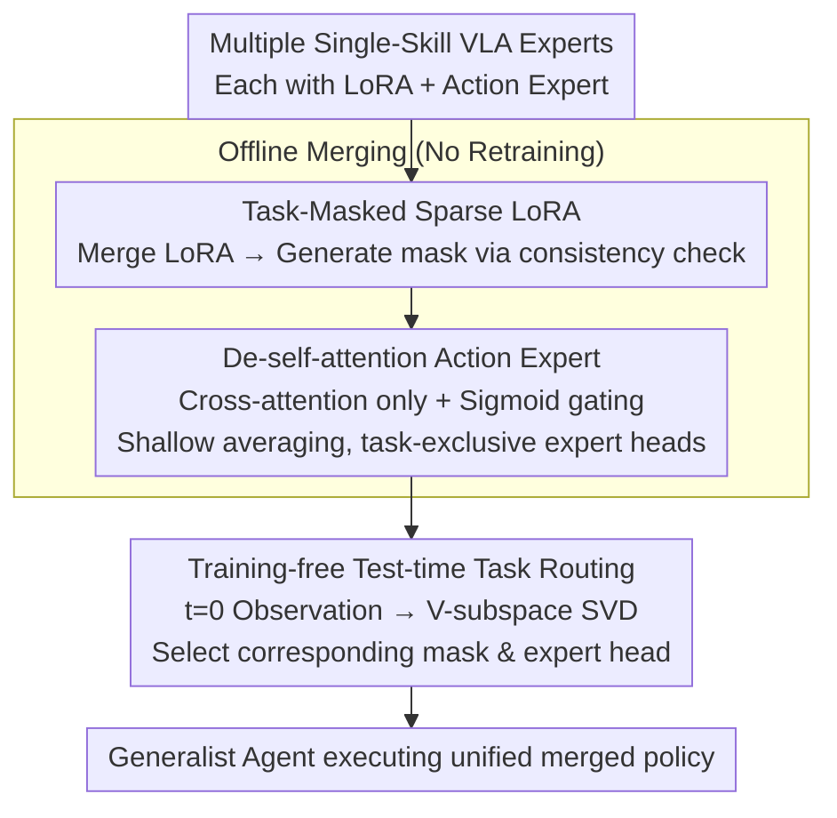

# MergeVLA: Cross-Skill Model Merging Toward a Generalist Vision-Language-Action Agent

**Conference**: CVPR 2026  
**arXiv**: [2511.18810](https://arxiv.org/abs/2511.18810)  
**Code**: None  
**Area**: Robotics/Embodied AI  
**Keywords**: VLA Model Merging, Multi-skill Robot, Sparse LoRA Mask, Action Expert Redesign, Test-time Task Routing

## TL;DR

This work provides the first systematic diagnosis of two root causes preventing VLA model merging (selfish parameter conflicts in LoRA and task coupling caused by self-attention in action experts). It proposes MergeVLA—a framework that merges multiple single-skill VLA experts into a generalist agent using task-masked sparse LoRA activation, de-self-attention action experts, and training-free test-time routing. It achieves a 90.2% success rate on LIBERO and 90% on the real-world SO101 robot.

## Background & Motivation

**Background**: Vision-Language-Action (VLA) models, fine-tuned from large-scale VLMs on millions of robotic demonstrations, perform exceptionally well under single-task or single-embodiment settings. However, real-world generalist agents must support multiple skills, embodiments, and environments. A natural approach is to merge multiple independently fine-tuned VLA experts into a unified policy.

**Limitations of Prior Work**: While model merging is mature in LLM/VLM domains (e.g., Task Arithmetic, TIES, DARE), direct application to VLA leads to a success rate drop to **0%**—a phenomenon never observed in LLM merging.

**Root Cause Diagnosis** (Key contribution):

1.  **LoRA Selfish Parameters**: After LoRA fine-tuning on four LIBERO tasks, >75% of parameters are "selfish" (retained only by a single task mask), indicating that different tasks push LoRA in highly disjoint directions. Direct averaging or sign-based merging activates irrelevant or contradictory parameters, destroying the shared vision-language subspace.
2.  **Incompatible Action Expert Architecture**: Even if the VLM is merged perfectly, weight averaging the action expert still results in a 0% success rate. This stems from action experts being trained from scratch with self-attention layers. Self-attention causes task information to accumulate and propagate across layers, making deep parameters highly task-specific and non-recomposable.

**Key Insight**: Since the issue lies in the "inherent unmergeability of the architecture," the solution is to design a VLA that is "mergeable by design."

## Method

### Overall Architecture

The goal of MergeVLA is to merge multiple single-skill VLA experts into a generalist agent. Addressing the "inherent unmergeability," the framework redesigns the VLA from the architectural level. The base VLM uses Qwen2.5-0.5B, and the action expert is modified from VLA-Adapter, totaling approximately 0.7B parameters. The process involves an offline phase to merge experts and an online inference phase to automatically determine task identity. Three components address the three root causes: task-masked sparse LoRA resolves parameter conflicts, de-self-attention action experts resolve architectural incompatibility, and training-free test-time routing resolves task identification during inference.

### Key Designs

**1. Task-Masked Sparse LoRA: Activating only beneficial merged parameters**

For the four LIBERO tasks, over 75% of LoRA parameters are "selfish." MergeVLA constructs a binary mask $\mathbf{S}_m$ for each task $m$, selecting only beneficial parts from the merged parameters:

$$\Theta_{\text{merge}}^{(m)} = \Theta_0 + \mathbf{S}_m \odot \tau_{\text{merge}}$$

The mask is generated via parameter-level consistency checks: $\mathbf{S}_m = \mathbb{I}\left[|\tau_m| > \lambda |\tau_{\text{merge}} - \tau_m|\right]$, retaining parameters where the task-specific update is large and directionally consistent with the merged update ($\lambda=0.6$ is optimal). This implicitly protects the original vision-language representations from conflicting updates.

**2. De-self-attention Action Expert: Forcing reliance on VLM features**

Standard action experts use self-attention, which creates task-specific dependencies that are impossible to merge. MergeVLA removes self-attention, retaining only the cross-attention path to force reliance on robust VLM features. Tanh gating is replaced with sigmoid to prevent negative values from suppressing VLM signals. Merging is done layer-wise: shallow layers are weight-averaged, while the highly task-specific deep layer (the "expert head") is kept separate for each task. This design improves OOD performance on LIBERO-Plus by **13.4%** compared to VLA-Adapter.

**3. Training-free Test-time Task Routing: Identifying tasks via SVD subspaces**

To identify the task at inference without additional training, MergeVLA uses parameter subspace analysis. It performs SVD on the value projection matrix (V) of the merged action expert's $l$-th block to extract the primary subspace. Observations are projected to calculate response intensity $r_m$, and the highest-scoring task is selected. Using the V-subspace (89.7% accuracy) significantly outperforms the K-subspace (53.6%), as V encodes actual behavioral semantics.

### Loss & Training

Each task is fine-tuned independently (LoRA + action expert from scratch) using 50 demonstrations per task on a single A6000 (48GB). Merging is entirely offline: merge LoRA → compute masks → average shallow action expert layers → retain expert heads. The router requires no training and is based purely on SVD subspace analysis. Default settings: $l=L$, $k_r=8$, $\lambda=0.6$, $\alpha=1$.

## Key Experimental Results

### Main Results: LIBERO Success Rate (%)

| Method | Spatial | Object | Goal | Long | Average |
|---|---|---|---|---|---|
| OpenVLA (Indep. FT) | 84.7 | 88.4 | 79.2 | 53.7 | 76.5 |
| VLA-Adapter (Indep. FT) | 99.6 | 99.6 | 98.2 | 96.4 | 98.5 |
| MergeVLA (Indep. FT) | 98.0 | 98.6 | 95.0 | 95.0 | 96.7 |
| OpenVLA + TA (Full Merge) | 0.0 | 0.0 | 0.0 | 0.0 | 0.0 |
| OpenVLA + TA + Mask | 74.2 | 82.6 | 68.8 | 24.0 | 62.4 |
| VLA-Adapter + TA + Mask | 0.0 | 0.0 | 0.0 | 0.0 | 0.0 |
| **MergeVLA + TIES + Mask** | **94.8** | **94.6** | **91.8** | **79.4** | **90.2** |
| MergeVLA + TA + Mask | 98.0 | 98.8 | 85.4 | 76.6 | 89.7 |

### OOD Robustness: LIBERO-Plus Success Rate (%)

| Method | Scene | View | Inst. | Light | Layout | State | Noise | Avg. |
|---|---|---|---|---|---|---|---|---|
| π₀ (Indep. FT) | 81.4 | 13.8 | 58.8 | 85.0 | 68.9 | 6.9 | 79.0 | 56.3 |
| VLA-Adapter (Indep. FT) | 76.6 | 36.4 | 73.8 | 71.0 | 70.2 | 37.4 | 57.2 | 59.0 |
| MergeVLA (Indep. FT) | 92.7 | 62.4 | 75.7 | 92.7 | 73.7 | 46.4 | 74.7 | 72.4 |
| **MergeVLA + TIES Merge** | **85.7** | **50.7** | **66.0** | **84.2** | **68.1** | **30.3** | **66.0** | **62.5** |

### Ablation Study: Routing Subspace Selection (LIBERO Success Rate %)

| Subspace | Spatial | Object | Goal | Long | Average |
|---|---|---|---|---|---|
| K only | 98.0 | 0.0 | 39.6 | 76.6 | 53.6 |
| K & V | 98.0 | 0.0 | 85.8 | 76.6 | 65.1 |
| **V only** | **98.0** | **98.8** | **85.4** | **76.6** | **89.7** |

### Real Robot SO101 Success Rate (%)

| Method | Pick & Place | Push | Stack | Average |
|---|---|---|---|---|
| Indep. FT | 90.0 | 85.0 | 95.0 | 90.0 |
| MergeVLA + TA | 70.0 | 70.0 | 60.0 | 66.7 |
| **MergeVLA + TIES** | **90.0** | **90.0** | **90.0** | **90.0** |

## Key Findings

- **Both root causes are critical**: Adding masks without architectural changes (VLA-Adapter + TA + Mask) still results in 0%; changing architecture without masks also fails.
- **De-self-attention yields OOD gains**: MergeVLA Indep. FT outperforms VLA-Adapter by 13.4% on LIBERO-Plus, suggesting that "trusting the VLM" is more robust than task-specific learning.
- **Merge ≈ Independent FT**: TIES merging matches independent fine-tuning performance on real robots (90%).
- **Cross-embodiment generalization**: On RoboTwin (3 robots × 3 tasks), TIES merging reaches 70.7%.
- **Routing precision**: V-projection subspace routing is far superior to K-projection (89.7% vs 53.6%).
- **Mask sparsity**: $\lambda \in [0.6, 0.9]$ is optimal; too small allows conflicting parameters, while too large loses useful information.

## Highlights & Insights

1.  **Systematic diagnosis of "VLA unmergeability"**: First to reveal LoRA selfish parameters (>75%) and self-attention task coupling as independent root causes.
2.  **Architecture-level mergeability**: Instead of designing better merging algorithms, this work eliminates unmergeability at the architectural level.
3.  **Unexpected OOD benefits**: Modifications made for mergeability improved OOD generalization, proving that inheriting VLM robustness is superior to scratch-learning task-specific features.
4.  **Training-free routing**: Using SVD principal components for task identification is elegant, practical, and requires no auxiliary networks.
5.  **End-to-end validation**: Verified across LIBERO, LIBERO-Plus, RoboTwin, and real SO101 hardware, covering cross-task, cross-environment, and cross-embodiment scenarios.

## Limitations & Future Work

1.  **Lack of online incremental merging**: Adding new tasks requires recalculating masks and re-merging.
2.  **VLM scale constraints**: Only tested on Qwen2.5-0.5B; applicability to larger models (7B+) is yet to be explored.
3.  **Linear growth of expert heads**: Keeping independent expert heads for each task leads to parameter redundancy as tasks increase.
4.  **De-self-attention limits**: May restrict performance on tasks requiring very long-horizon temporal reasoning.
5.  **Routing dependency**: Relies on the $t=0$ observation; may fail if the initial frame is non-discriminative.

## Related Work & Insights

- **vs. Task Arithmetic / TIES**: While effective for LLMs, these fail (0%) for VLA until MergeVLA's architectural modifications make them viable.
- **vs. Multi-task Joint Training** (OpenVLA, π₀): Joint training requires access to all data and full retraining; MergeVLA merges weights offline without revisiting training data.
- **vs. VLA-Adapter**: Standard self-attention in action experts prevents merging; MergeVLA uses cross-attention and achieves better results.
- **vs. ReVLA**: ReVLA merges to solve visual forgetting; MergeVLA merges to achieve multi-skill capabilities.

## Rating

- Novelty: ⭐⭐⭐⭐⭐ Systematic solution to VLA merging with elegant diagnosis and design.
- Experimental Thoroughness: ⭐⭐⭐⭐⭐ 3 simulation benchmarks + real robot + extensive ablations + OOD evaluation.
- Writing Quality: ⭐⭐⭐⭐⭐ Logical flow from diagnosis to solution, with clear visualizations.
- Value: ⭐⭐⭐⭐⭐ Provides a viable lightweight path for scaling multi-skill embodied AI.

<!-- RELATED:START -->

## Related Papers

- [\[CVPR 2026\] Cross-Hand Latent Representation for Vision-Language-Action Models](cross-hand_latent_representation_for_vision-language-action_models.md)
- [\[CVPR 2026\] Evo-1: Lightweight Vision-Language-Action Model with Preserved Semantic Alignment](evo-1_lightweight_vision-language-action_model_with_preserved_semantic_alignment.md)
- [\[CVPR 2026\] Mantis: A Versatile Vision-Language-Action Model with Disentangled Visual Foresight](mantis_a_versatile_vision-language-action_model_with_disentangled_visual_foresig.md)
- [\[ICLR 2026\] Robust Finetuning of Vision-Language-Action Robot Policies via Parameter Merging](../../ICLR2026/robotics/robust_fine-tuning_of_vision-language-action_robot_policies_via_parameter_mergin.md)
- [\[CVPR 2026\] QuantVLA: Scale-Calibrated Post-Training Quantization for Vision-Language-Action Models](quantvla_scale-calibrated_post-training_quantization_for_vision-language-action_.md)

<!-- RELATED:END -->
