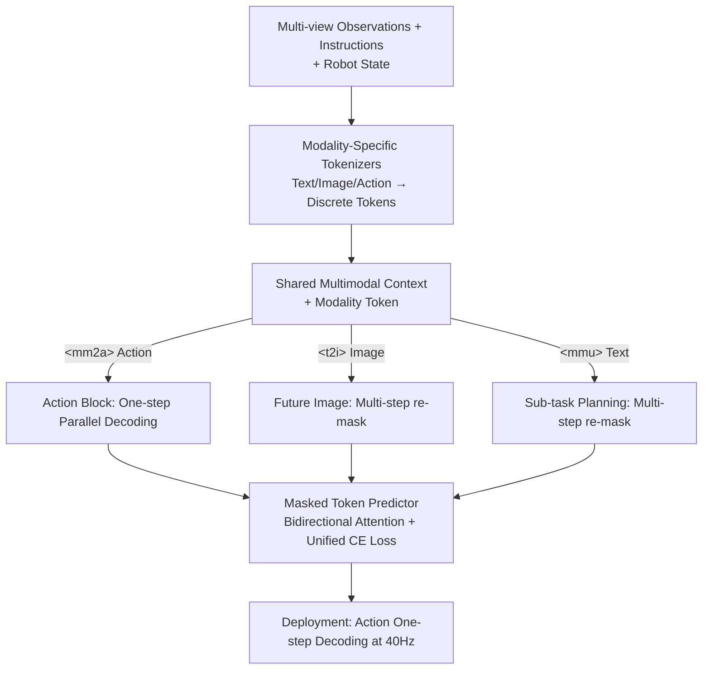

# MM-ACT: Learn from Multimodal Parallel Generation to Act

**Conference**: CVPR 2026  
**Paper**: [CVF Open Access](https://openaccess.thecvf.com/content/CVPR2026/html/Liang_MM-ACT_Learn_from_Multimodal_Parallel_Generation_to_Act_CVPR_2026_paper.html)  
**Code**: Available (https://github.com/HHYHRHY/MM-ACT)  
**Area**: Robotics / Embodied AI (VLA)  
**Keywords**: VLA, Unified Discrete Tokens, Parallel Decoding, Discrete Diffusion, Cross-modal Joint Training

## TL;DR
MM-ACT represents text, images, and actions within a unified set of discrete tokens, utilizing a masked token predictor with bidirectional attention for unified parallel decoding (multi-step re-masking for text/images, and one-step generation for actions). Through Context-Shared multimodal learning, task planning and future image prediction enhance action generation. It achieves 96.3% on LIBERO, 52.38% on eight tasks in RoboTwin2.0 (with a +9.25% gain from cross-modal training), and 72.0% on Franka real-world robots.

## Background & Motivation
**Background**: Generalist robot policies require both high-level semantic understanding (task planning) and the ability to predict interactions within the environment. Vision-Language-Action (VLA) models have emerged as the mainstream paradigm, typically integrating perception and control by adding action heads or expert modules to pre-trained VLMs.

**Limitations of Prior Work**: (1) **VLM-based approaches** (e.g., OpenVLA, $\pi_0$) excel at visual semantic understanding but lack explicit modeling of physical dynamics, making it difficult to guide temporal action generation. (2) **Visual prediction-based approaches** (e.g., CoT-VLA, DreamVLA World Models) introduce future visual prediction into policy learning, offering strong temporal/environmental dynamics, but they are primarily trained for prediction rather than task planning, resulting in weaker instruction understanding and sub-task planning. (3) **Unified VLA approaches** mostly adopt the "unified understanding-generation" paradigm without rethinking the policy architecture: some (e.g., WorldVLA) retain autoregressive text generation while using parallel decoding for images and actions, forcing the model to perform both single-token and block-level prediction in one forward pass, which requires multiple attention mechanisms and complex pipelines; others (e.g., UniVLA) use full autoregressive generation for text/images/actions, leading to slow action inference.

**Key Challenge**: There is an **objective mismatch** between autoregressive pre-training (token prediction objective) and diffusion-based action fine-tuning (denoising objective). This inconsistency introduces optimization misalignment and hinders the effective utilization of pre-trained knowledge. Moreover, hybrid paradigms must balance unification with action inference speed.

**Goal**: To develop a unified model that follows the same parallel decoding generation objective from start to finish, unifying text, image, and action modalities to simplify training while ensuring low-latency action generation.

**Key Insight**: Using the discrete diffusion unified model MMaDA (dLLM) as a backbone, actions are converted into discrete tokens and integrated into the same masked prediction objective, avoiding the paradigm split between AR and diffusion.

**Core Idea**: A shared discrete token space across three modalities + a unified masked token prediction objective + shared-context joint supervision. This allows cross-modal learning to benefit action generation, while only requiring "one-step parallel decoding" for actions during deployment.

## Method

### Overall Architecture
MM-ACT is an 8B Transformer-based masked token predictor with bidirectional attention. It encodes text, images, and robot proprioception/actions into discrete tokens using modality-specific tokenizers, concatenating them into a single sequence. Given a shared multimodal input (multi-view observations + task instructions + text descriptions + optional states), a **modality token** (`<|mm2a|>` for action / `<|t2i|>` for image / `<|mmu|>` for text) is prepended to specify the target modality, followed by a fixed-length `<mask>` block. The model calculates logits for all mask positions in a single forward pass and fills them according to the decoding strategy. Text and images use **multi-step re-mask parallel decoding** (re-masking low-confidence tokens with a cosine noise schedule), while actions use **one-step parallel decoding** ($t=1$, where the entire block is masked and generated at once). During training, all three modalities share the same context and are jointly optimized with a unified cross-entropy loss. During deployment, only one-step action decoding is performed, maintaining a stable 40Hz.

### Key Designs

**1. Unified Discrete Token Space: Text, Images, and Actions as the Same Category of Tokens**

To eliminate the objective mismatch between AR pre-training and diffusion action denoising, the authors discretize all three modalities into a single vocabulary. Text follows the LLaDA tokenizer; images use the Show-o pre-trained quantizer (codebook size 8,192), where inputs are padded, downsampled to 256×256, and encoded into 256 tokens; actions and proprioceptive states use a bin tokenizer (2,048 tokens), where continuous scalars are normalized to $[-1,1]$ before quantization. The action codebook is appended to the vocabulary without affecting the original text/image codebooks. This allows all modalities to be represented as equivalent discrete tokens, optimized via the same bidirectional attention and objective, removing the need for modality-specific decoders.

**2. Parallel Decoding Strategy: Multi-step for Text/Image, One-step for Action**

The model is designed as a block-level masked token predictor. For each continuous time $t \in (0, 1]$, tokens are independently replaced by `<mask>` with probability $p_{mask} = f_{modal}(t)$. The conditional distribution for a single position is:

$$q_t(x_t^i \mid f_{modal}(t), x_0^i) = (1 - f_{modal}(t)) \mathbf{1}\{x_t^i = x_0^i\} + f_{modal}(t) \mathbf{1}\{x_t^i = \texttt{<mask大>}\}$$

Text uses a linear schedule (following LLaDA), while images and actions use a cosine schedule to align with continuous denoising. For **actions**, $t=1$ is used—meaning the entire segment is masked ($x_t = \texttt{<mask大>} \times L$)—allowing the model to generate all action tokens in parallel in one forward pass for low latency. A multi-step **re-mask** version is also provided to balance performance and efficiency. **Images** utilize the same multi-step re-mask decoding. **Text** generation is limited to 256 tokens, allowing for full parallel decoding within a single block.

**3. Context-Shared Multimodal Learning: Shared Context + Unified Loss**

To address the lack of dynamics and planning in action generation, the three tasks share the same context $C_{modal} = \texttt{<modal>} + \text{shared\_input}$. The `shared_input` consists of interleaved tokens from multi-view observations, instructions, descriptions, and states. Each modality appends a fixed-length block: 256 for text (sub-task planning), 256 for images (future goal image), and $N_{\text{act\_block}} = d_{action} \times N_{\text{chunk\_size}}$ for actions. All modalities are optimized using a **single** cross-entropy loss calculated only at mask positions:

$$\mathcal{L}(\theta) = -\mathbb{E}_{t, x_0, x_t} \left[ \sum_{modal \in \mathcal{M}} \frac{\lambda_{modal}}{t} \sum_{i \in \mathcal{I}_{modal}} \mathbf{1}\{x_t^i = \mathrm{M}\} \log p_\theta(x_0^i \mid C_{modal}, x_t) \right]$$

where $\lambda_{modal}$ represents the loss weights. Training follows two stages: **Stage 1** sets $\lambda_{mm2a} = 0$, focusing on text and image generation. **Stage 2** focuses on action generation, with $\lambda_{mmu}$ and $\lambda_{t2i}$ reduced to 0.05–0.1 to maintain auxiliary capabilities. Consequently, planning knowledge and environmental dynamics are injected into action generation.

## Key Experimental Results

> Metrics: Success Rate (SR, %). LIBERO reports four benchmarks and their average; RoboTwin2.0 evaluates eight bimanual tasks in **unseen settings** (instructions/environments/object positions not seen during training); Franka evaluates three real-world tasks. `Vanilla` = Action-only; `+Text/+Image/+Text&Image` = Context-Shared joint training.

### Main Results

LIBERO Success Rate (Selected Table 1):

| Model | Spatial | Object | Goal | Long | Average |
| :--- | :--- | :--- | :--- | :--- | :--- |
| OpenVLA | 84.7 | 88.4 | 79.2 | 53.7 | 76.5 |
| $\pi_0$ | 96.8 | 98.8 | 95.8 | 85.2 | 94.2 |
| OpenVLA-OFT | 96.2 | 98.3 | 96.2 | 90.7 | 95.4 |
| UniVLA | 95.4 | 98.8 | 93.6 | 94.0 | 95.5 |
| MM-ACT (Vanilla) | 97.8 | 99.4 | 94.8 | 88.0 | 95.0 |
| **MM-ACT (+Text in Long)** | — | — | — | **93.0 (+5.0)** | **96.3** |

RoboTwin2.0 Average and Franka Real-world (Table 2/3):

| Model | RoboTwin2.0 8-task Avg SR | Franka Real-world Avg SR |
| :--- | :--- | :--- |
| OpenVLA-OFT | 23.13 | 58.6 |
| $\pi_0$ | 48.13 | 70.0 |
| MM-ACT (Vanilla) | 43.13 | — |
| MM-ACT (+Text) | 46.5 (+3.37) | — |
| MM-ACT (+Image) | 48.75 (+5.62) | — |
| **MM-ACT (+Text&Image)** | **52.38 (+9.25)** | **72.0** |

MM-ACT reaches 96.3% on LIBERO, outperforming all baselines. On the OOD RoboTwin2.0, its 52.38% leads $\pi_0$ by +4.25% and OpenVLA-OFT by +29.25%. It also ranks first on real-world robots at 72.0%.

### Ablation Study

| Configuration | RoboTwin2.0 Avg SR | Description |
| :--- | :--- | :--- |
| Vanilla (Action-only) | 43.13 | Baseline for single-modality training |
| + Text | 46.5 (+3.37) | Joint training with task planning |
| + Image | 48.75 (+5.62) | Joint training with future image prediction |
| + Text & Image | 52.38 (+9.25) | Full tri-modal joint training (Best) |
| LIBERO-Long: Action-only | 88.0 | — |
| LIBERO-Long: + Text Planning | 93.0 (+5.0) | Significant gain for long-horizon tasks |

### Key Findings
- **Cross-modal joint training enhances action generation**: In the OOD RoboTwin2.0, gains from text (+3.37), image (+5.62), and tri-modal joint training (+9.25) are cumulative, indicating that semantic planning and physical dynamics provide independent, additive benefits.
- **Image modality provides more aid than text**: The +5.62 gain from images compared to +3.37 from text suggests that dynamics supervision is more critical for action generation than pure text planning.
- **Long-horizon tasks rely most on planning**: LIBERO-Long improved from 88.0 to 93.0 (+5.0), confirming that sub-task planning is most beneficial for tasks requiring decomposition.
- **Future image quality is viable**: Generated images in unseen scenes remain close to ground truth sub-goals, validating that the image channel learns useful dynamics.

## Highlights & Insights
- **One-step action decoding is clever**: Treating action as an extreme $t=1$ masking case allows parallel generation of a full chunk in one forward pass, achieving 40Hz low latency within a unified masked prediction framework.
- **dLLM backbone eliminates paradigm mismatch**: Using a unified parallel decoding objective from pre-training to fine-tuning avoids the inconsistency found in "AR + Diffusion head" models like OpenVLA or $\pi_0$.
- **Shared-context joint supervision is transferable**: The paradigm of using the same observation/instruction to generate planning, images, and actions via a unified CE loss can be applied to other embodied tasks requiring multi-objective synergy.

## Limitations & Future Work
- **Trade-off between one-step and multi-step decoding**: One-step decoding saves time but may sacrifice precision compared to multi-step re-masking. Systemic conclusions for higher-dimensional or longer-horizon actions are still needed.
- **Modality tokenization relies on external quantizers**: SHOW-o and bin tokenizers downsample images to 256×256, which might lose critical information for fine-grained manipulation.
- **Task scope**: Experiments are limited to single/dual-arm tabletop manipulation. Generalization to mobile manipulation or contact-rich tasks is unverified.
- **Future directions**: Adaptive or curriculum-based $\lambda_{modal}$ weights and exploration of higher-fidelity action tokenization schemes.

## Related Work & Insights
- **vs. OpenVLA / $\pi_0$ (VLM+Action Head)**: These suffer from objective mismatch; MM-ACT maintains a unified parallel decoding objective throughout, achieving +19.8 / +2.1 on LIBERO with better architectural unity.
- **vs. WorldVLA (Hybrid Unified VLA)**: WorldVLA uses AR for text and parallel for others, requiring complex pipelines; MM-ACT is simpler with all-discrete tokens and bidirectional attention.
- **vs. UniVLA (Full-AR Unified VLA)**: UniVLA is slower due to AR action inference; MM-ACT's one-step parallel decoding is faster (40Hz) and slightly more accurate.
- **vs. DreamVLA / CoT-VLA (Visual Prediction)**: These excel at prediction but are weak in planning; MM-ACT incorporates future image prediction as an auxiliary task to support action generation, balancing both.

## Rating
- Novelty: ⭐⭐⭐⭐ Integrating action into a unified discrete diffusion framework with one-step parallel decoding and shared-context joint training is a clean synthesis.
- Experimental Thoroughness: ⭐⭐⭐⭐ Complete evaluation across simulation (LIBERO/RoboTwin2.0) and real robots (Franka) with modality ablations.
- Writing Quality: ⭐⭐⭐⭐ Paradigm comparisons and training workflows are clearly articulated.
- Value: ⭐⭐⭐⭐ Provides a unified, low-latency, self-improving VLA paradigm. Open-sourcing code/models adds significant value to the field.

<!-- RELATED:START -->

## Related Papers

- [\[CVPR 2026\] Learning to Act Robustly with View-Invariant Latent Actions](learning_to_act_robustly_with_view-invariant_latent_actions.md)
- [\[CVPR 2026\] Learning to See and Act: Task-Aware Virtual View Exploration for Robotic Manipulation](learning_to_see_and_act_task-aware_virtual_view_exploration_for_robotic_manipula.md)
- [\[NeurIPS 2025\] Act to See, See to Act: Diffusion-Driven Perception-Action Interplay for Adaptive Policies](../../NeurIPS2025/robotics/act_to_see_see_to_act_diffusion-driven_perception-action_interplay_for_adaptive_.md)
- [\[CVPR 2026\] Diagnose, Correct, and Learn from Manipulation Failures via Visual Symbols](diagnose_correct_and_learn_from_manipulation_failures_via_visual_symbols.md)
- [\[CVPR 2026\] From Manuals to Actions: A Unified VLA Model for Chain-of-Thought Manual Generation and Robotic Manipulation](from_manuals_to_actions_a_unified_vla_model_for_chain-of-thought_manual_generati.md)

<!-- RELATED:END -->
