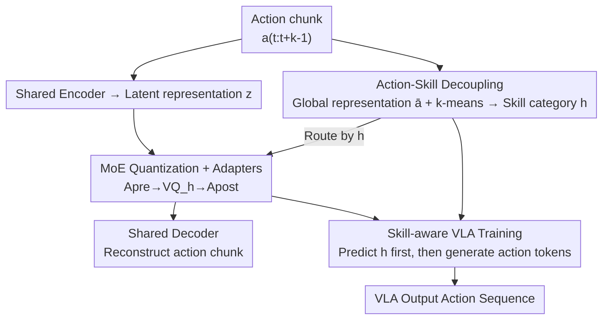

# MoEActok: A MoE-based Action Tokenizer for Vision-Language-Action Models

**Conference**: CVPR 2026  
**Paper**: [CVF Open Access](https://openaccess.thecvf.com/content/CVPR2026/html/Xu_MoEActok_A_MoE-based_Action_Tokenizer_for_Vision-Language-Action_Models_CVPR_2026_paper.html)  
**Code**: https://github.com/cpaaax/MoEActok (Available)  
**Area**: Robotics / Embodied AI (VLA action tokenizer)  
**Keywords**: VLA, Action Discretization, Mixture-of-Experts, VQ-VAE, Skill Decoupling

## TL;DR
MoEActok decomposes a single action tokenizer into "skill-clustered multi-expert VQ-VAEs," where each expert is responsible only for one category of action skill (e.g., translation / grasping). Combined with a coarse-to-fine training paradigm that "first predicts the skill category, then generates action tokens," it significantly outperforms existing discretization methods such as Binning, FAST, VQ-BET, and VQ-VLA in RoboTwin, Simpler-Env simulations, and real-world zero-shot transfer.

## Background & Motivation

**Background**: Current autoregressive vision-language-action (VLA) models discretize continuous control signals into tokens to reuse the next-token prediction paradigm of LLM/VLM. The performance of this route depends on the quality of the "action tokenizer"—which must compress high-dimensional, temporally coherent control signals into compact and semantically rich discrete representations. Early methods used "uniform binning" for dimension-wise discretization, failing to capture dependencies between timesteps. Recent works like FAST use DCT + BPE for frequency domain compression, while VQ-BET / VQ-VLA use Residual Vector Quantization (RVQ) for hierarchical discretization, all focusing on how to better compress within a "single tokenizer."

**Limitations of Prior Work**: All these tokenizers are **trained holistically** on the entire trajectory. However, a manipulation trajectory often mixes multiple heterogeneous skills—such as large-scale translational movements and fine-grained end-effector grasping. Forcing a single quantizer to handle both types of signals simultaneously compels it to compromise between "different kinematic patterns and different time scales," leading to suboptimal learning for all. Clustering action chunks on BridgeData V2 (Fig. 1) reveals that actions naturally form several clusters—Clusters 0/1 are movement primitives in opposite directions around the z-axis, while Clusters 2/3 are grasping actions (gripper open/close). This indicates that heterogeneous skills are indeed "separable," but existing tokenizers mix them during learning.

**Key Challenge**: The "capacity" of a single quantizer must serve multiple conflicting skill distributions (mixed-signal optimization), which inevitably reduces representation fidelity. Furthermore, without an explicit mechanism to decouple skill structures, the downstream VLA's grounding from "observation to precise action primitives" also degrades.

**Goal**: (1) Specially divide tokenizers by skill, with each expert specializing in one type of action; (2) Align the quantization spaces of heterogeneous experts for unified reconstruction; (3) Enable downstream VLAs to explicitly utilize skill structures to reduce learning difficulty.

**Key Insight**: Since action chunks naturally cluster into skill sets, unsupervised clustering can separate them, assigning a dedicated quantization expert to each cluster—replacing "one tokenizer for all skills" with "Mixture-of-Experts (MoE) specialized for each."

**Core Idea**: Replace "single VQ-VAE" with a "clustering-driven MoE VQ-VAE" for action discretization, where each expert specializes in one skill. The VLA training is modified into a two-stage coarse-to-fine process: "first identify skill category $h$, then generate action tokens conditioned on $h$."

## Method

### Overall Architecture
MoEActok consists of two layers: the upper layer is the **action tokenizer itself** (an MoE VQ-VAE), and the lower layer is the **VLA model based on it**. First, unsupervised clustering is used to divide all action chunks into $K$ skill clusters based on "global kinematic features." The tokenizer uses a shared encoder to compress action chunks into latent representations $z$, then routes $z$ to the corresponding expert quantizer $VQ_h$ (each expert has an independent codebook) based on the skill category $h$ of the chunk. Pre/post-adapters map between "shared space $\leftrightarrow$ skill-specific space," and finally, a shared decoder reconstructs the quantized result into actions. The downstream VLA tokenizes four modalities—text, image, proprioception, and action—into the same transformer, following the autoregressive sequence of "first predicting skill $h$, then generating action tokens."

Input: action chunk $a_{t:t+k-1}\in\mathbb{R}^{k\times 7}$ (7-DoF per arm), observation image $o_t$, proprioception $s_t$, instruction $l$. Output: discrete action token sequence $\rightarrow$ reconstructed/executed action chunk.

### Key Designs

**1. Action-Skill Decoupling: Unsupervised clustering using global kinematic representations to separate heterogeneous skills**

To enable "each expert managing one skill," action chunks must first be segmented by skill in an unsupervised and scalable manner. The authors extract a 7-dimensional compact global representation $\bar a\in\mathbb{R}^7$ from action chunks $a_{t:t+k-1}\in\mathbb{R}^{k\times 7}$: the first 6 dimensions are the element-wise **accumulation** of the entire arm movement, $\bar a_{1:6}=\sum_{j=t}^{t+k-1} a_{j,1:6}$, capturing the total displacement/rotation trend; the 7th dimension takes the **endpoint difference** of the gripper $\bar a_7=a_{t+k-1,7}-a_{t,7}$ to specifically isolate net opening/closing. This design is elegant because accumulation makes the "directionality" of translation/rotation emerge, while the endpoint difference naturally separates "pick/place" from "movement"—aligning with the cluster structure observed in Fig. 1. Running k-means on all $\bar a$ yields $K$ cluster centers, each treated as a "skill category." Compared to frequency domain transforms or RVQ, this directly leverages the kinematic structure of the action signals.

**2. MoE Quantizers + Dual Adapters: Independent codebooks for each expert, realigning heterogeneous quantization results into a unified space**

This is the core contribution. Given a latent representation $z$ and its skill category $h\in\{1,...,K\}$, $z$ is sent **only** to the corresponding expert $VQ_h$ for quantization:

$$z_q,\ q=\arg\min_{c\in VQ_h}\|z-c\|_2$$

Each expert updates its codebook only on its own skill cluster distribution, avoiding interference. However, directly feeding $z$ from a shared encoder to different experts causes "representation mismatch" due to varying distributions. The authors insert adapters before and after quantization. The **Pre-adapter** $A^{pre}_h$ projects shared representations into skill-specific subspaces:

$$z'=A^{pre}_h(z)=W_1\big(\sigma_1(W_2(z)*W_3(z))+\sigma_2(W_4(z))\big)$$

where $W_{1\sim4}$ are trainable linear weights and $\sigma$ is ReLU. The multiplicative term $W_2(z)*W_3(z)$ introduces gated non-linear interaction. The **Post-adapter** $A^{post}_h$ has the same structure and maps $z_q$ back to a unified space $z'_q=A^{post}_h(z_q)$ for the shared decoder. These adapters act as the bridge allowing $K$ specialized experts to be reconstructed consistently by one decoder—removing them causes the most significant performance drop (see below).

The tokenizer is trained with a standard VQ-VAE loss: reconstruction loss $L_{rec}=\|\hat a_{t:t+k-1}-a_{t:t+k-1}\|_2^2$, codebook loss $L_{emb}=\|\text{sg}[z']-z_q\|_2^2$, and commitment loss $L_{com}=\|z'-\text{sg}[z_q]\|_2^2$ (where $\text{sg}$ is stop-gradient), synthesized as $L_{total}=L_{rec}+\alpha L_{emb}+\beta L_{com}$.

**3. Skill-aware VLA Training: Transitioning from "implicitly guessing skills" to a coarse-to-fine "reporting skill, then action" sequence**

Standard autoregressive training $L_{VLA}=-\sum_r \log P(q_r|q_{<r},o_t,s_t,l)$ forces the model to **implicitly** guess the skill while predicting tokens, solving "skill classification" and "action prediction" simultaneously, which increases learning burden. The authors split the generation into two explicit stages:

$$L_{VLA}=-\log P(h\mid o_t,s_t,l)-\sum_{r=1}^{R}\log P(q_r\mid q_{<r},o_t,s_t,l,h)$$

The first term enforces explicit prediction of the skill cluster $h$, while the second term generates action tokens conditioned on $h$, effectively invoking the skill-specific patterns of the corresponding expert. In implementation, VLA unifies text, proprioception, images (via SigLIP-SO400M), and actions into a sequence using delimiters like `t_bos/eos`, `s_bos/eos`, `sk_bos/eos` (for skills), and `a_bos/eos`.

### Loss & Training
Two-stage training: first, pre-train the MoEActok tokenizer using AdamW (lr $5\times10^{-5}$); then, freeze MoEActok and SigLIP to fine-tune the LLM (Qwen2.5-0.5B backbone) and MLP projection layers (AdamW, initial lr $1\times10^{-4}$ with cosine annealing). MoEActok uses 4 experts and a 2048-dimensional codebook. Action chunk lengths are 8 for RoboTwin and 4 for BridgeV2.

## Key Experimental Results

### Main Results
Average success rates across 12 RoboTwin tasks (Selected tasks + Average):

| Tokenizer | Click Bell | Place Container Plate | Move Can Pot | Place Phone Stand | Average Success |
|-----------|-----------|----------------------|--------------|-------------------|-----------|
| Binning | 0.67 | 0.00 | 0.02 | 0.02 | 0.24 |
| FAST | 0.68 | 0.07 | 0.08 | 0.01 | 0.17 |
| VQ-BET | 0.64 | 0.54 | 0.13 | 0.04 | 0.29 |
| VQ-VLA | 0.59 | 0.79 | 0.30 | 0.23 | 0.45 |
| **Ours (MoEActok)** | **0.85** | **0.88** | **0.50** | **0.38** | **0.56** |

Simpler-Env (WidowX 4 tasks) success rates:

| Tokenizer | Put Spoon on Towel | Put Carrot on Plate | Stack Green on Yellow | Put Eggplant in Basket | Avg. |
|-----------|--------------------|---------------------|-----------------------|------------------------|------|
| Binning | 0.08 | 0.00 | 0.00 | 0.04 | 0.03 |
| FAST | 0.21 | 0.17 | 0.00 | 0.08 | 0.12 |
| VQ-BET | 0.04 | 0.04 | 0.00 | 0.00 | 0.02 |
| VQ-VLA | 0.29 | 0.33 | 0.21 | 0.00 | 0.21 |
| **Ours (MoEActok)** | **0.38** | **0.38** | 0.13 | **0.63** | **0.38** |

MoEActok improves average success from 0.45 (VQ-VLA) to 0.56 on RoboTwin, and from 0.21 to 0.38 on Simpler-Env (a 17% absolute gain). Inference throughput is ~10 Hz on a single RTX 4090, reaching 54 Hz with vLLM.

### Ablation Study
Removing components on RoboTwin / Simpler-Env:

| Configuration | RoboTwin Avg. | Simpler-Env Avg. | Note |
|------|---------------|------------------|------|
| Full (MoEActok) | 0.56 | 0.38 | Complete model |
| w/o Adapter | 0.45 | 0.17 | Quantization spaces cannot be coordinated |
| w/o Skill-aware | 0.47 | 0.30 | Reverts to implicit skill learning |

Impact of expert count $K$ ($K\in\{1,2,4\}$): Average success on RoboTwin rises from 0.50 ($K=1$) to 0.56 ($K=4$), and on Simpler-Env from 0.26 to 0.38.

Real-world zero-shot transfer (AgileX Cobot Magic, direct deployment of RoboTwin trained policy, 20 trials per task):

| Tokenizer | Click Bell | Place Container on Plate | Pick Diverse Bottles | Avg. |
|-----------|-----------|--------------------------|----------------------|------|
| VQ-BET | 7/20 | 2/20 | 0/20 | 0.15 |
| VQ-VLA | 10/20 | 7/20 | 0/20 | 0.28 |
| **Ours (MoEActok)** | **12/20** | **9/20** | **1/20** | **0.37** |

### Key Findings
- **Adapters are primary contributors**: Removing adapters caused a crash in Simpler-Env (0.38 to 0.17), proving that coordinating heterogeneous experts into a unified decoder space is critical.
- **Skill-aware training provides consistent gain**: Performance dropped (0.56 to 0.47 on RoboTwin) without it, validating that the coarse-to-fine decomposition simplifies the task.
- **More experts are better (within tested range)**: Steady gains from $K=1$ to $K=4$ support the hypothesis that manipulation consists of distinct skill primitives requiring specialized representations.
- **Real-world transfer maintains advantage**: Even without fine-tuning, MoEActok leads in all real-world tasks, showing that skill decoupling improves representation robustness across the sim-to-real gap.

## Highlights & Insights
- **"Specialization by skill" is a correct entry point**: The motivation is grounded in empirical clustering observations rather than just internal tokenizer optimization, which provides a more fundamental approach.
- **Clever 7D global representation**: Using accumulation and endpoint differences isolates "directionality" and "grasping" with minimal overhead, creating a robust driver for k-means.
- **Dual adapters are the hidden heroes**: Specialized experts are easy to create; the difficulty lies in making a shared decoder consume heterogeneous codebooks. The pre/post adapter bridge is a pattern applicable to other multi-codebook scenarios.
- **Pure tokenizer layer improvement**: Unlike diffusion-head methods that require changing the transformer architecture, MoEActok remains a discrete tokenizer, allowing seamless integration with standard autoregressive VLAs.

## Limitations & Future Work
- **Clustering is offline and static**: k-means is fixed before training; the cluster count $K$ and partition do not adapt. It may route out-of-distribution skill combinations to unsuitable experts.
- **Expert count restricted to K=4**: The saturation point was not explored, and the trade-offs between memory overhead and gains as $K$ increases are unquantified.
- **Hard routing based on global representation**: Using argmin for routing lacks fault tolerance or "soft" allocation for boundary cases.
- **Absolute success rates are still low**: Tasks like "Pick Diverse Bottles" remain extremely difficult (1/20), indicating that while representation conflict is eased, the intrinsic difficulty of fine manipulation remains.

## Related Work & Insights
- **vs Binning**: Binning is dimension-wise and independent per step; MoEActok uses chunk-level quantization with skill-based分工 for higher fidelity.
- **vs FAST**: FAST focuses on frequency domain compression (DCT+BPE); MoEActok focuses on kinematic structure and skill decoupling.
- **vs VQ-BET / VQ-VLA**: These use a **single** quantization stack with entangled latent spaces; MoEActok uses $K$ specialized quantizers to resolve "mixed-signal optimization" issues.
- **vs Diffusion-head methods**: Diffusion approaches are continuous and require transformer architecture changes; MoEActok preserves the discrete benefit and ecosystem of LLMs.

## Rating
- Novelty: ⭐⭐⭐⭐ Introducing MoE to action tokenizers with skill-based clustering is fundamental and rare.
- Experimental Thoroughness: ⭐⭐⭐⭐ Comprehensive across two simulations and real-world transfer, though $K$ was not fully explored.
- Writing Quality: ⭐⭐⭐⭐ Clear motivation derived from clustering, with intuitive diagrams.
- Value: ⭐⭐⭐⭐ Provides a high-performance, plug-and-play action tokenizer for the autoregressive VLA community.

<!-- RELATED:START -->

## Related Papers

- [\[CVPR 2026\] ACoT-VLA: Action Chain-of-Thought for Vision-Language-Action Models](acot-vla_action_chain-of-thought_for_vision-language-action_models.md)
- [\[CVPR 2026\] SRPO: Self-Referential Policy Optimization for Vision-Language-Action Models](srpo_self-referential_policy_optimization_for_vision-language-action_models.md)
- [\[CVPR 2026\] QuantVLA: Scale-Calibrated Post-Training Quantization for Vision-Language-Action Models](quantvla_scale-calibrated_post-training_quantization_for_vision-language-action_.md)
- [\[CVPR 2026\] Adaptive Action Chunking at Inference-time for Vision-Language-Action Models](adaptive_action_chunking_at_inference-time_for_vision-language-action_models.md)
- [\[CVPR 2026\] AT-VLA: Adaptive Tactile Injection for Enhanced Feedback Reaction in Vision-Language-Action Models](at-vla_adaptive_tactile_injection_for_enhanced_feedback_reaction_in_vision-langu.md)

<!-- RELATED:END -->
