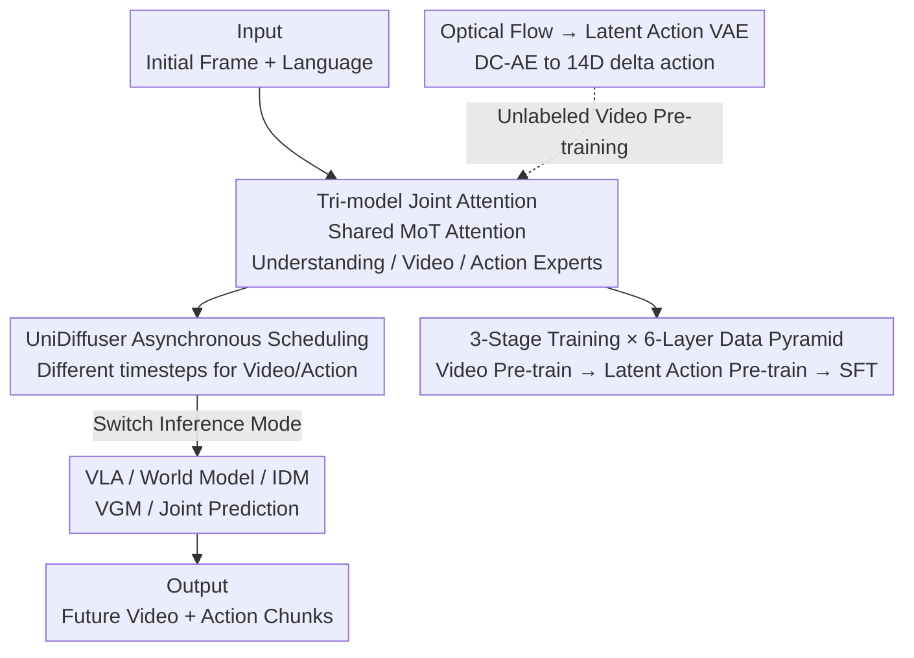

# Motus: A Unified Latent Action World Model

**Conference**: CVPR 2026  
**Paper**: [CVF Open Access](https://openaccess.thecvf.com/content/CVPR2026/html/Bi_Motus_A_Unified_Latent_Action_World_Model_CVPR_2026_paper.html)  
**Area**: Robotics / Embodied AI  
**Keywords**: Embodied Foundation Model, World Model, Latent Action, Optical Flow, Mixture-of-Transformers  

## TL;DR
Motus employs a Mixture-of-Transformers (MoT) architecture to integrate three pre-trained experts—Understanding, Video Generation, and Action—via shared self-attention (Tri-model Joint Attention) and UniDiffuser-style asynchronous scheduling. It unifies five embodied paradigms—VLA, World Model, IDM, video generation, and joint video-action prediction—within a single model. By extracting pixel-level "latent actions" from optical flow, the action expert can be pre-trained on massive unlabeled videos. Motus outperforms $\pi 0.5$ by 45% and X-VLA by 15% in simulation, with real-world improvements ranging from 11% to 48%.

## Background & Motivation
**Background**: An ideal embodied agent should be a unified entity capable of "understanding scene instructions → imagining the future → predicting consequences → generating actions." However, current mainstream approaches split these capabilities into five independent paradigms: VLA (learning static policies from vision-language), World Model (predicting future observations based on actions), IDM (inferring actions from adjacent frames), Video Generation (VGM), and joint video-action prediction. F1 combines VLA and IDM but still lacks World Models and video generation, making the unification incomplete.

**Limitations of Prior Work**: First, integrating these multimodal generation capabilities into a single framework is challenging. Existing Unified World Models (UWM) provide theoretical prototypes but either train from scratch with small bases or lack essential priors—missing either VLM's vision-language understanding or VGM's physical interaction priors—thereby lacking the complete world knowledge required for robust generalization. Second, embodied agents must learn from large-scale heterogeneous data (internet videos, ego-centric human demonstrations, multi-robot trajectories). However, action spaces across different embodiments vary significantly in dimension, range, and semantics, preventing direct reuse of control signals. Furthermore, most videos lack action labels, hindering large-scale pre-training for action experts.

**Key Challenge**: A conflict exists between capability "unification" and the "richness" of priors in existing architectures. UWMs sacrifice pre-trained priors for unification, while retaining VLM/VGM priors makes it difficult to align them with new action modalities. Simultaneously, action modalities are constrained by the "need for labels," preventing them from leveraging massive unlabeled video datasets.

**Goal**: (1) Model the distributions of VLA, World Model, IDM, VGM, and Joint Prediction simultaneously within one framework without sacrificing general multimodal priors; (2) Enable large-scale pre-training for action experts on cross-embodiment, unlabeled heterogeneous data.

**Key Insight**: Since unified multimodal models like Bagel have proven that "understanding experts" and "generation experts" can coexist and complement each other using MoT (Mixture-of-Transformers) with shared self-attention, can this be extended to an "action expert"? To enable action experts to utilize unlabeled videos, the authors leverage optical flow—a universal, embodiment-agnostic motion representation that aligns behaviors of different robots into the same motion space.

**Core Idea**: Use MoT to fuse three pre-trained experts (Understanding + Video Generation + Action) via shared self-attention into a unified generative model. Utilize UniDiffuser-style asynchronous noise scheduling to switch freely between five inference modes. Extract pixel-level "delta actions" as latent actions using optical flow, allowing action experts to undergo three-stage pre-training on a six-layer data pyramid.

## Method

### Overall Architecture
The input to Motus is "initial observation frame + language instruction (+ proprioception)," and the output is "future video chunks + future action chunks." The backbone is an MoT where the three experts maintain independent Transformer modules (Qwen3-VL-2B for Understanding, Wan 2.2 5B for Video Generation, and a new module for Action), but their multi-head self-attention mechanisms across layers are **concatenated** and shared, termed Tri-model Joint Attention. During training, the model uses a rectified flow objective to simultaneously predict video and action chunks. Different diffusion timesteps and noise scales are assigned to video and action (UniDiffuser scheduling), allowing the model to switch between VLA, World Model, IDM, VGM, or joint prediction during inference by setting certain modalities as known or pure noise.

Parallel to this is a branch for "unlabeled data": a latent action VAE compresses optical flow into 14-dimensional latent actions, enabling the action expert to pre-train on vast video data without action labels. The system follows a three-stage training process: "video pre-training → latent action pre-training → target robot fine-tuning," across a six-layer data pyramid: "Web → Human Ego-centric → Synthetic → Task-agnostic → Multi-robot → Target robot."

### Key Designs

**1. Tri-model Joint Attention: Stitching Three Experts via MoT**
UWMs typically concatenate observation and action tokens through a single sequence of $N$ blocks, which fails to leverage pre-existing VLM/VGM priors and risks modal interference. Motus maintains independent Transformer sets (FFN, AdaLN) for each expert, sharing only the concatenated multi-head self-attention context. This allows tokens from three paths to "see" each other while keeping feed-forward and normalization separate. This preserves the specialized roles (Understanding for 3D grounding, Generation for physical dynamics) while fusing cross-modal features. The Action expert is designed with Transformer blocks of the same depth as Wan, enabling equal interaction. To prevent video tokens from overwhelming action tokens, **Action-Dense Video-Sparse Prediction** is used, downsampling video frames (e.g., 1/6 of the action rate) to balance token counts and save computation.

**2. UniDiffuser Asynchronous Scheduling: One Set of Weights, Five Modes**
If video and action share the same diffusion timestep (Joint Diffuser), the model is limited to "joint prediction." Motus adopts UniDiffuser, assigning independent timesteps $\tau_o, \tau_a$ and noise scales to video and action. Accuracy is optimized via the sum of two rectified flow objectives:

$$l^\theta = \mathbb{E}\big\|v^\theta_a-(\epsilon_a-a_{t+1:t+k})\big\|_2^2 + \mathbb{E}\big\|v^\theta_o-(\epsilon_o-o_{t+1:t+k})\big\|_2^2$$

where $\tau_a, \tau_o \sim U(0,T_\tau)$. During inference, by setting a modality's timestep to 0 (known) or max (pure noise), the same weights can instantiate different distributions: video noise + action condition → World Model; action noise + video condition → IDM; language + image → VGM, etc. Ablations show this improves success rates by 9.79% over synchronous scheduling.

**3. Optical Flow Latent Action: Learning "Pixel-level Delta Actions"**
To address the lack of labels and embodiment gaps, Motus uses optical flow as a universal motion representation. Pixel displacements are calculated via DPFlow, converted to RGB, and reconstructed using a Deep Compression Autoencoder (DC-AE) to $4\times512$ tokens. A lightweight encoder projects these into a **14-dimensional vector**, aligning the latent space with real robotic control. "Weak action supervision" pulls the latent space toward the real control distribution using 10% labeled trajectories mixed with 90% unlabeled data. The total loss includes reconstruction, alignment, and KL terms:

$$L = L_{recon} + \lambda_a\|a_{real}-a_{pred}\|^2 + \beta L_{KL}$$

**4. Three-stage Training & Six-layer Data Pyramid**
Data is organized into levels (Web, Ego-centric, Synthetic, Task-agnostic, Multi-robot, Target-robot). Training proceeds in three stages: Stage 1 trains only the VGM on multi-robot trajectories and human videos to learn visual dynamics; Stage 2 freezes the VLM and trains the entire system with video, language, and latent actions to learn motion and interaction; Stage 3 performs SFT on target robot data. 

### Loss & Training
- **Main Model**: Sum of video and action rectified flow velocity field regressions (see Design 2).
- **Latent Action VAE**: Reconstruction + real action alignment + KL regularization (see Design 3).
- **Stages**: Progressive training from visual dynamics to motion representation to target embodiment.

## Key Experimental Results

### Main Results
Evaluated on 50+ RoboTwin 2.0 tasks. Motus achieves SOTA in both clean and randomized settings.

| Setting | $\pi 0.5$ | X-VLA | w/o Pretrain | Stage1 | Motus |
|------|------|-------|--------------|--------|-------|
| RoboTwin Clean Avg(%) | 42.98 | 72.80 | 72.8 | 82.86 | **88.66** |
| RoboTwin Random Avg(%) | 43.84 | 72.84 | 77.00 | 81.86 | **87.02** |

Motus outperforms $\pi 0.5$ by **45%** absolute success rate and X-VLA by **15%**. Real-world tests on AC-One and Aloha-2 show relative improvements of 11-48%.

### Ablation Study

| Configuration | Success Rate (%) |
|------|---------|
| Motus (Full) | 77.00 |
| w/o VLM | 64.94 |
| w/o VGM | 25.50 |
| Joint Diffuser (Sync) | 67.21 |
| UniDiffuser (Async) | 77.00 |

### Key Findings
- **VGM is the most critical expert**: Removing the VGM causes success rates to crash from 77% to 25.5%, whereas removing the VLM is far less catastrophic. This suggests physical interaction/dynamic priors from video generation are the backbone of policy learning.
- **Asynchronous scheduling unlocks capabilities**: UniDiffuser is not only more accurate but also enables the instantiation of World Model/IDM modes that synchronous schemes cannot support.
- **Superior scalability**: As the number of tasks increases, Motus shows 1.77× higher success rates than $\pi 0.5$ and requires 1/13.55 of the data to reach equivalent performance.

## Highlights & Insights
- **"Unification = Shared Attention + Async Scheduling"**: This combination is elegant. MoT handles cross-expert communication, while UniDiffuser allows a single model to play 5 roles.
- **Optical Flow as "Universal Motion Currency"**: Using DC-AE to compress motion to 14D and anchoring it with weak supervision allows unlabeled videos to feed the action expert effectively.
- **VGM > VLM**: The discovery that "imagining future video" is more critical than "understanding language" for manipulation tasks is a significant insight for the VLA community.

## Limitations & Future Work
- **Reliance on Heavy Backbones**: Combining Wan 2.2, Qwen3-VL, and the Action expert results in high training/deployment costs and inference latency.
- **Hyperparameter Sensitivity**: The weight of weak supervision (90/10 mix) and the 14D latent action dimension are empirical and require further sensitivity analysis.
- **Real-world Robustness**: While surpassing baselines, absolute success rates on long-horizon tasks (e.g., folding towels) are still low for reliable deployment.

## Related Work & Insights
- **vs. UWM**: UWM lacks VLM/VGM priors due to single-backbone training; Motus preserves these priors via MoT.
- **vs. F1**: F1 lacks World Model and VGM capabilities, offering incomplete unification compared to Motus.
- **vs. $\pi 0.5$ / X-VLA**: These VLA models rely on labeled trajectories and scale poorly; Motus leverages unlabeled data via latent actions and scales more efficiently.

## Rating
- Novelty: ⭐⭐⭐⭐⭐ 
- Experimental Thoroughness: ⭐⭐⭐⭐
- Writing Quality: ⭐⭐⭐⭐
- Value: ⭐⭐⭐⭐⭐ 

<!-- RELATED:START -->

## Related Papers

- [\[CVPR 2026\] Chain of World: World Model Thinking in Latent Motion (CoWVLA)](chain_of_world_world_model_thinking_in_latent_motion.md)
- [\[CVPR 2026\] Learning a Unified Latent Action Space from Videos with Action-centric Cycle Consistency](learning_a_unified_latent_action_space_from_videos_with_action-centric_cycle_con.md)
- [\[CVPR 2026\] NavForesee: A Unified Vision-Language World Model for Hierarchical Planning and Dual-Horizon Navigation Prediction](navforesee_a_unified_vision-language_world_model_for_hierarchical_planning_and_d.md)
- [\[ICLR 2026\] UniVLA: Unified Vision-Language-Action Model](../../ICLR2026/robotics/unified_vision-language-action_model.md)
- [\[CVPR 2026\] RehearseVLA: Simulated Post-Training for VLAs with Physically-Consistent World Model](rehearsevla_simulated_post-training_for_vlas_with_physically-consistent_world_mo.md)

<!-- RELATED:END -->
