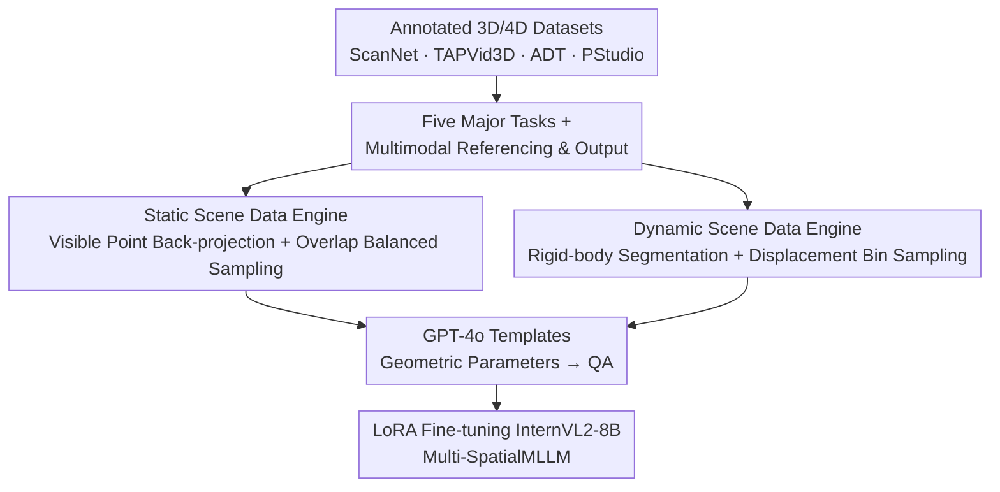

# Multi-SpatialMLLM: Multi-Frame Spatial Understanding with Multi-Modal Large Language Models

**Conference**: CVPR 2026  
**arXiv**: [2505.17015](https://arxiv.org/abs/2505.17015)  
**Code**: None (FAIR, Meta; project provides data/benchmark, the paper does not explicitly specify an open-source repository, ⚠️ subject to official updates)  
**Area**: Multimodal VLM / Spatial Understanding / Embodied AI  
**Keywords**: Multi-frame spatial understanding, depth perception, visual correspondence, camera/object motion, data engine

## TL;DR
Addressing the issue where MLLMs are limited to single-image spatial reasoning and struggle with basic orientations, this paper utilizes annotated 3D/4D scene datasets to automatically generate 27 million multi-frame spatial question-answering pairs (MultiSPA). By injecting foundational capabilities of depth, visual correspondence, and dynamic perception into InternVL2, the trained Multi-SpatialMLLM improves by an average of 36% over the base model on a self-constructed benchmark, matching the performance of closed-source models and specialized 3D models.

## Background & Motivation
**Background**: MLLM/VLMs have become general AI assistants and are increasingly deployed in real physical scenarios such as robotics and autonomous driving. These scenarios require models to possess human-like spatial understanding—judging distance, orientation, and motion.

**Limitations of Prior Work**: Current MLLMs exhibit surprisingly weak spatial understanding, sometimes even confusing left and right. Existing improvements (SpatialVLM, SpatialRGPT) attribute this to a "lack of spatial training data" and attempt to compensate with single-image spatial data. However, these remain confined to **single images**: the model's perception is locked in a static field of view, failing to capture any cross-frame dynamic information.

**Key Challenge**: Spatial understanding in the real world is inherently **multi-frame** (a classic proposition of Structure-from-Motion). However, multi-frame spatial data is extremely difficult to acquire—it requires both spatial and temporal alignment, which is nearly impossible for unstructured in-the-wild images. Furthermore, knowledge learned from single-image supervision **cannot generalize** to multi-image tasks (experiments show SpatialRGPT performs worse than zero-shot base models on multi-frame benchmarks).

**Goal**: To enable MLLMs to perform spatial reasoning across multiple images, specifically decomposed into three foundational capabilities: depth perception (inferring relative distance and 3D structure), visual correspondence (matching the same 3D point across images), and dynamic perception (perceiving camera self-motion and object motion).

**Key Insight**: Rather than stitching together annotations from off-the-shelf modules like monocular depth estimators on noisy in-the-wild images, it is better to **directly leverage precisely annotated 3D/4D scene datasets** (ScanNet, TAPVid3D, ADT, PStudio). By back-projecting point clouds onto images using camera intrinsics and extrinsics to establish pixel-level correspondence, clean spatial QA can be "extracted" from geometric ground truth.

**Core Idea**: Develop a geometry-driven data engine to automatically convert scans/tracking data with 3D ground truth into massive, multi-modally referenced, and diversely outputted multi-frame spatial QA. These are then injected into an off-the-shelf MLLM via standard LoRA fine-tuning—changing the data without altering the architecture.

## Method

### Overall Architecture
The core of this paper is not architectural innovation but a **data engine**: the inputs are annotated 3D (ScanNet) and 4D (TAPVid3D / ADT / PStudio) scene datasets, and the outputs are 27 million multi-frame spatial QA pairs (MultiSPA). These data are used to fine-tune a frozen visual encoder InternVL2-8B via LoRA to obtain Multi-SpatialMLLM. The pipeline consists of defining "five major tasks / three types of references / five types of outputs" to span the task space; then, static and dynamic branches back-project point clouds into pixel correspondences with balanced sampling to suppress long-tail distributions; finally, GPT-4o generates diverse templates to package geometric parameters into QA for fine-tuning.

### Key Designs

**1. Five tasks unifying three foundational spatial capabilities: Formulating "Spatial Understanding" into generatable question types**

The concept of spatial understanding is too abstract to define formally, making direct data generation difficult. This paper anchors it to three mature foundational capabilities in 3D vision, expanded into five tasks with **computable geometric ground truth**: depth perception (single-point depth estimation / two-point distance comparison), visual correspondence (finding the same 3D point in a second image given a pixel in the first), camera motion perception, object motion perception, and object size perception. Camera motion is divided into nine subtypes from coarse to fine—judging direction (translations/rotations), estimating scalars (distance or angle), and directly regressing displacement vectors. Object size requires the model to **fuse information across an image set** to estimate dimensions, positioned as a higher-order capability. The value of this classification lies in the fact that every answer can be precisely calculated from point clouds and camera parameters.

**2. Multimodal referencing + Diverse outputs: Covering maximum downstream interfaces**

Previous data used either semantic label referencing (SpatialVLM) or segmentation mask referencing (SpatialRGPT, requiring an extra segmentation module), with outputs often limited to multiple-choice or scalars. This paper supports three referencing methods simultaneously: visual prompting (drawing dots on images), pixel coordinates, and semantic labels. The pixel coordinate path **adds no annotations to the original image**, preserving the image appearance with zero extra dependencies. Outputs range from qualitative text to scalars, 2D pixel coordinates, and 3D displacement vectors. To maintain compatibility with different resolutions, pixel coordinates are normalized to 0–1000: $x_{\text{norm}}=\lfloor \frac{x}{W}\times 1000\rfloor, y_{\text{norm}}=\lfloor \frac{y}{H}\times 1000\rfloor$, and lengths are rounded in millimeters.

**3. Static scene data engine: Visible point back-projection + Overlap balanced sampling**

Static scenes (ScanNet) address two issues: calculating cross-image pixel correspondence and selecting image pairs with "appropriate difficulty." The former relies on geometric back-projection: for each world coordinate point $\mathbf{p}^W$, use extrinsic inverse transformation to the camera frame and intrinsic projection to pixels: $\mathbf{p}^C_i=(\mathbf{E}_i)^{-1}[\mathbf{p}^W;1]$. Occluded points are removed via the depth criterion $0<\mathbf{p}^C_i[2]<\mathbf{D}_i(u,v)$ to obtain the visible point set $\mathcal{P}_i$. The co-visible points $\mathcal{P}_i\cap\mathcal{P}_j$ naturally provide pixel-level correspondence, and the relative pose $\mathbf{E}_j^i=\mathbf{E}_i^{-1}\mathbf{E}_j$ provides translation vectors. The latter addresses the long-tail distribution of overlap ratios. The overlap ratio is defined as the IoU of visible points $\text{Overlap}(i,j)=\frac{|\mathcal{P}_i\cap\mathcal{P}_j|}{|\mathcal{P}_i\cup\mathcal{P}_j|}$. Only the 6%–35% range is retained, followed by **balanced sampling** across bins to ensure coverage of varying difficulties.

**4. Dynamic scene data engine: Rigid-body segmentation + Displacement bin sampling**

Object motion requires temporally aligned trajectories. Using TAPVid3D's per-frame tracking points $\{\mathcal{P}_t\}$ and camera parameters, the displacement vector and distance for each point between frames are calculated. To avoid sampling traps, the paper uses **rigid-body segmentation** based on clustering—grouping points whose relative distances remain constant over time and **sampling per group** to cover different motion patterns. Furthermore, **bin-balanced sampling** based on object translation distance is applied to ensure that both small and large displacements are adequately represented.

### Loss & Training
No architectural changes; standard language modeling objectives are used for fine-tuning. InternVL2-8B is the base model. LoRA (rank $R=16$) is used to update only the LLM, while the visual encoder and projection layers are frozen. Training uses AdamW + cosine scheduler, $\text{lr}=4\times10^{-5}$. For efficiency, one epoch is performed on a 3M QA subset, mixed with 60K general image-text instruction data to prevent degradation. Training took approximately 50 hours on 24 nodes $\times 8 \times 32$G V100 with a batch size of 192.

## Key Experimental Results

### Main Results
MultiSPA benchmark: 300 samples per subtask (7800 total). Scenes strictly do not overlap with the training set. Correctness for scalars/vectors is defined as $\|\mathbf{v}_{pred}-\mathbf{v}_{gt}\|_2\le 0.2\cdot\|\mathbf{v}_{gt}\|_2$, and for pixel coordinates as within 5% of image width.

| Task (Sub-item) | Metric | Multi-SpatialMLLM (8B) | InternVL2-8B Base | GPT-4o | Gain (vs Base) |
|--------|------|------|------|------|------|
| **Average** | Acc | **56.11** | 20.43 | 28.87 | **+35.68** |
| Depth Comparison | Acc | 74.00 | 49.50 | 54.84 | +24.50 |
| Depth Value | Acc | 75.33 | 3.34 | 22.50 | +71.99 |
| Visual Corr. (Coord) | Acc | 49.00 | 1.67 | 2.00 | +47.33 |
| Visual Corr. (MCQ) | Acc | 90.00 | 33.33 | 67.67 | +56.67 |
| Camera Direction | Acc | 90.83 | 48.17 | 58.84 | +42.66 |
| Camera Rot. Angle | Acc | 45.50 | 3.34 | 17.50 | +42.16 |
| Camera Trans. Vector | Acc | 18.00 | 0.33 | 0.00 | +17.67 |
| Object Motion Dist. | Acc | 40.42 | 8.84 | 8.92 | +31.58 |
| Object Size | Acc | 49.11 | 27.45 | 40.44 | +21.66 |

Closed-source models perform only slightly above random (50–60%) on qualitative tasks and fail almost entirely (near 0) on quantitative tasks (coordinate correspondence, camera/object motion vectors). The 8B model surpasses or matches these larger closed-source systems across all tasks.

### Ablation Study
| Experiment | Configuration | Key Metric | Description |
|------|------|---------|------|
| Cross-dataset Gen. (BLINK) | Ours 8B | Avg 84.3 (Base 57.9) | Multi-view reasoning M.V. reached 94.7, avg +26.4%. |
| General VQA Maintenance | Ours vs Base | POPE 85.3 vs 84.5 | Performance roughly equal across 6 standard VQA tests. |
| Multi-task Synergy | Cam. Vector: Single → Multi | 9.30 → 18.00 (+8.70) | Adding other task data improved performance. |
| Multi-task Synergy | Obj. Motion: 400K → +400K Other | 17.50 → 22.04 (+4.56) | Abilities transferable across datasets/question types. |
| Emergence (MCQ Corr.) | 8B / 13B / 26B | 25.67 / 42.67 / 82.33 | Only 26B mastered the capability from hard samples. |

### Key Findings
- **Single-image supervision does not transfer to multi-image**: SpatialRGPT, trained on massive single-image spatial data, performed worse than zero-shot InternVL on MultiSPA.
- **Multi-task synergy exists**: Training only on camera motion (500K) yielded 9.3%, which increased to 18.0% when mixed into a 3M multi-task set—task diversity is a critical scaling dimension.
- **Spatial understanding may "emerge"**: For difficult visual correspondence, 8B/13B models regressed after training, while only 26B learned effectively (82.33% vs 44.0 baseline), suggesting a capacity threshold.
- **Utility as a multi-frame reward annotator**: The model demonstrates potential for zero-shot static object recognition and motion distance prediction for robotic learning.

## Highlights & Insights
- **"Questioning by Ground Truth" paradigm**: Instead of noisy labels from monocular depth estimators, the paper calculates exact geometry from 3D/4D datasets, ensuring the 27M QA pairs are both massive and clean.
- **Balanced sampling is universal and critical**: Both static overlap and dynamic motion magnitudes are long-tailed; bin-based balanced sampling explicitly controls the "difficulty distribution" to avoid bias.
- **Frozen architecture, new data**: Freezing the visual encoder and using LoRA yields significant spatial gains without sacrificing general VQA capability, suggesting "model inability" is often just a "lack of supervision."
- **Emergence and synergy**: These observations have methodological value, suggesting that mixing spatial sub-capabilities is beneficial and that hard spatial tasks have specific capacity requirements.

## Limitations & Future Work
- **Dependency on annotated 3D/4D datasets**: The engine requires point clouds and camera parameters, limiting scene diversity to existing sets (mostly indoor scans) with limited outdoor or extreme lighting coverage.
- **Low absolute accuracy on the hardest tasks**: $18.0\%$ for camera translation and $12.92\%$ for object motion vectors are far from practical application; scaling data and parameters is needed.
- **Preliminary emergence conclusions**: Emergence was only observed in a single MCQ visual correspondence task; further validation across more tasks is required.

## Related Work & Insights
- **vs SpatialVLM / SpatialRGPT**: These also use spatial data but are limited to single images and specific referencing methods; this work expands to multi-frame and quantitative outputs.
- **vs SAT**: SAT uses simulation data, which has a sim-to-real gap, whereas this work uses real images.
- **vs Specialized 3D Models (VGGT)**: The 26B general VLM variant matches VGGT in camera vector prediction, proving general models can approach specialized ones with the right data.

## Rating
- Novelty: ⭐⭐⭐⭐ First large-scale multi-frame spatial dataset + benchmark.
- Experimental Thoroughness: ⭐⭐⭐⭐⭐ Comprehensive coverage of generalization, VQA maintenance, and robotics applications.
- Writing Quality: ⭐⭐⭐⭐ Clear task definitions and geometric derivations.
- Value: ⭐⭐⭐⭐⭐ Advances MLLM spatial understanding from single to multi-frame.

<!-- RELATED:START -->

## Related Papers

- [\[CVPR 2026\] FloVerse: Floor Plan-Guided Multi-Modal Navigation](floverse_floor_plan-guided_multi-modal_navigation.md)
- [\[CVPR 2026\] AURA: Multi-modal Shared Autonomy for Urban Navigation](aura_multi-modal_shared_autonomy_for_urban_navigation.md)
- [\[CVPR 2026\] DiffuView: Multi-View Diffusion Pretraining for 3D-Aware Robotic Manipulation](diffuview_multi-view_diffusion_pretraining_for_3d_aware_robotic_manipulation.md)
- [\[NeurIPS 2025\] HiMaCon: Discovering Hierarchical Manipulation Concepts from Unlabeled Multi-Modal Data](../../NeurIPS2025/robotics/himacon_discovering_hierarchical_manipulation_concepts_from_unlabeled_multi-moda.md)
- [\[CVPR 2026\] QuantVLA: Scale-Calibrated Post-Training Quantization for Vision-Language-Action Models](quantvla_scale-calibrated_post-training_quantization_for_vision-language-action_.md)

<!-- RELATED:END -->
