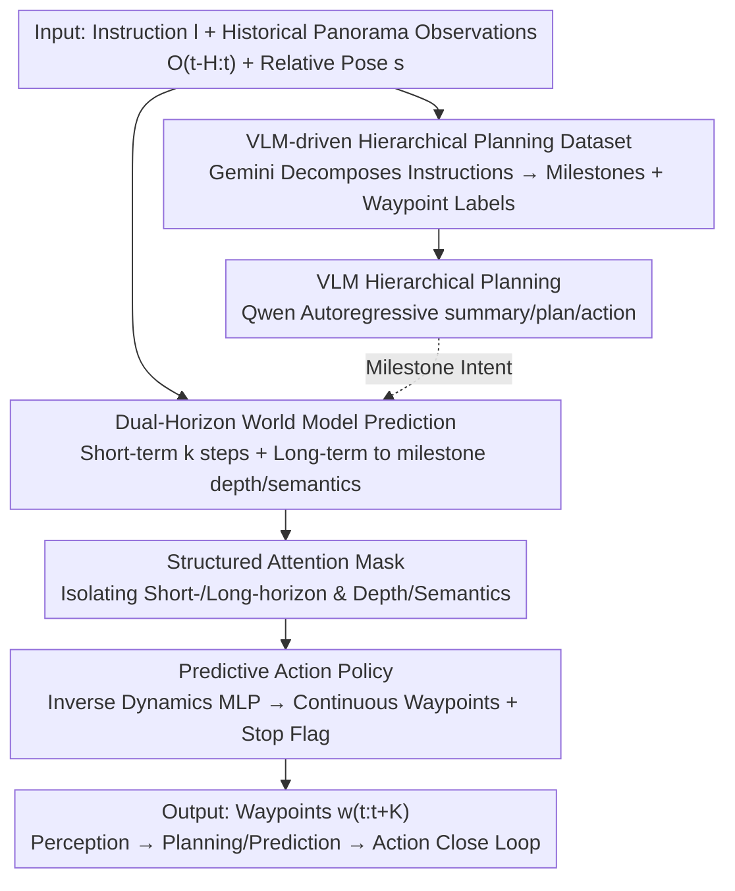

# NavForesee: A Unified Vision-Language World Model for Hierarchical Planning and Dual-Horizon Navigation Prediction

**Conference**: CVPR 2026  
**Paper**: [CVF Open Access](https://openaccess.thecvf.com/content/CVPR2026/html/Liu_NavForesee_A_Unified_Vision-Language_World_Model_for_Hierarchical_Planning_and_CVPR_2026_paper.html)  
**Code**: To be confirmed  
**Area**: Robotics / Embodied Navigation / Vision-Language Navigation  
**Keywords**: Vision-Language Navigation, World Models, Hierarchical Planning, VLM, Dual-Horizon Prediction  

## TL;DR
NavForesee unifies "high-level language planning" and "world model future prediction" into a single Qwen2.5-VL-3B. It decomposes long instructions into milestone subgoals and tracks progress, while predicting short-term ($k$ steps) and long-term (until the next milestone) depth/semantic features in the latent space. A lightweight MLP then translates these "imagined futures" into continuous waypoint actions, achieving 66.2% SR / 78.4% OSR on R2R-CE, approaching SOTA using only publicly available data.

## Background & Motivation

**Background**: Vision-Language Navigation (VLN) enables an embodied agent to understand natural language instructions, perceive the surrounding environment, and generate a sequence of actions to reach a target location. Since the rise of large-scale pretrained VLMs, VLN has been dominated by two paradigms: one treats the VLM as a **high-level planner** that autoregressively generates action plans or textual trajectories, while the other views it as an **end-to-end policy** that directly maps observations to actions. There is also a "fast-and-slow" dual-system architecture that uses a slow system for high-level reasoning and a fast system for low-level execution.

**Limitations of Prior Work**: Agents frequently fail in long-horizon tasks—often "getting lost" during execution, misinterpreting observations, or making incorrect decisions, leading to high failure rates. The paper attributes the root causes to two factors: (1) **Planning and memory deficiency**: Deployable VLMs have limited context windows and planning capabilities, making them prone to losing track in navigation environments; (2) **Lack of foresight**: Existing models are essentially **reactive**, executing actions based only on what they see, without predicting future environmental states to proactively guide actions.

**Key Challenge**: The paradigm of enhancing reasoning (via CoT or finely labeled data) and the paradigm of building world models to predict the future have **long been disconnected**. Pure VLM-centric agents suffer from "semantic hallucinations" where plans decouple from visual reality, while world models without language guidance face "semantic drift" where predictions gradually deviate from the instructed goals. The two lines of work operate in isolation, failing to mutually reinforce each other.

**Key Insight**: The authors draw inspiration from how humans navigate—human navigation is not a continuous sequence of low-level decisions, but a **hierarchical process centered around milestones**. Humans move toward a sequence of meaningful landmarks, largely ignoring the trivial path details between them. Artificial agents should follow a similar mechanism.

**Core Idea**: VLM planning and predictive foresight **should not be separated; instead, they should be unified and mutually reinforced within a single VLM**. NavForesee enables the same VLM to perform two tasks simultaneously—hierarchical language planning (decomposing instructions into milestone subgoals) and dual-horizon world model prediction (imagining short-term dynamics and long-term milestones)—forming an internal perception-planning/prediction-action feedback loop.

## Method

### Overall Architecture

NavForesee employs **Qwen2.5-VL-3B-Instruct** as its backbone, integrating two complementary capabilities into a single model: **VLM hierarchical planning** and **dual-horizon world model prediction**. Corresponding to two training objectives (hierarchical planning training and world model training), they are unified via **interleaved training data optimization**, enabling the model to retain multimodal planning capabilities while developing the ability to generate visual feature predictions.

Regarding the problem formulation, at time $t$ the agent receives a panoramic RGB observation $o_t$ and maintains a memory of the past $H$ frames $O_{t-H:t-1}$. The policy outputs $K$ future waypoints $w_{t:t+K}\in\mathbb{R}^{K\times 5}$, where each waypoint $w_t=[x_t,y_t,\sin\theta_t,\cos\theta_t,c_t]$ consists of planar coordinates, orientation angle (encoded as sine and cosine), and a binary stop signal $c_t$. Unless all predicted actions signal to stop, the agent continuously moves along the generated waypoints.

The execution pipeline operates as follows: First, **Gemini 2.5 Pro is used offline to decompose long instructions from R2R-CE/RxR-CE into milestones and waypoint-level labels**, creating a hierarchical planning dataset. During training, the **hierarchical planning branch** directly feeds textual data to the Qwen model for autoregressive learning (using the native encoder without structural modifications), teaching it to output structured text such as `<think>
...
<plan>...</plan></think>` containing progress summaries and next-step plans. The **world model branch** introduces a pose encoder, a set of "dream queries" (containing short- and long-term depth and semantic sub-queries), and action queries. These are concatenated into the multimodal input and, guided by a **structured attention mask**, fed into a lightweight convolutional decoder to generate environmental feature predictions and an MLP head to output navigation actions. Concurrently, a joint loss function constraints depth, semantics, and actions to close the loop: perception $\rightarrow$ planning/prediction $\rightarrow$ action.

### Key Designs

**1. VLM-driven Hierarchical Planning Dataset: Off-line "digest" of long instructions into milestone + waypoint labels**

Long-horizon failures in VLN are largely due to the model's lack of "progress tracking"—not knowing which step of the instruction has been completed and where to go next. Since manual labeling of massive trajectories was unfeasible, the authors used **Gemini 2.5 Pro as an annotator**. Starting from publicly available R2R-CE (10k episodes) and RxRx-CE (20k episodes), each episode is paired with a customized prompt template (specifying role, task, analysis steps, and mandatory output format) to instruct Gemini to **systematically break down long instructions into a sequence of sequential sub-instructions**, while selecting a **dense chain of keyframes** as navigation milestones. For long distances or sharp turns, intermediate milestones are force-inserted to ensure visual continuity. Each annotated episode standardizes into three components: milestone frame index, textual description of completed sub-instructions, and the upcoming instruction plan. Post-processing filters incomplete annotations, corrects logical contradictions in VLM outputs, splits episodes into multiple navigation segments, and samples waypoints between milestones. Each waypoint is annotated with planning labels: (1) navigation summary (completed sub-instructions), (2) future plan (next instruction), and (3) linguistic actions (forward / left / right / stop). This pipeline generates about 1.3 million training samples from RxR-CE and 200,000 from R2R-CE. Noting that straight-ahead samples (turn angle $<30^\circ$) accounted for 61.79%, the authors **downsampled excessive straight-ahead samples** for class balancing. The paper notes that samples where the final milestone did not align with the destination were removed (about 16.7%). Essentially, this step offloads the difficult task of "hierarchical progress tracking" to a powerful offline VLM, providing dense supervision rich in visual features, progress, and actions for the smaller model to be trained downstream.

**2. Dual-Horizon World Model Prediction: "Imaging" short-term dynamics and long-term milestones in latent space instead of rendering pixels**

Existing navigation world models face two challenges: action-conditioned models that rely on heavy trajectory sampling are too computationally intensive to deploy; and they mostly learn environmental dynamics without coupling with the VLM's linguistic reasoning. NavForesee's world model carefully **avoids expensive pixel-level generation**, predicting instead a compact set of high-level features—depth, DINOv2, and SAM features (similar to DreamVLA)—to capture both geometry and semantics. Specifically, it introduces two learnable sets of dream queries: short-term $Q_S\in\mathbb{R}^{L\times d}$ and long-term $Q_L\in\mathbb{R}^{L\times d}$, aligned with different prediction horizons. A pose encoder $h(\cdot)$ is applied to encode the pose-orientation state $s_{t-H:t}$ of each frame to enhance spatiotemporal correlation. These queries, combined with the instruction embedding $l$ and observation sequence $O_{t-H:t}$, are fed into the Qwen backbone $f(\cdot)$. **Causal attention** enforces autoregressive behavior, where short-term predictions are generated first, and long-term predictions are conditioned on the short-term predictions:

$$E_S = f(l, O_{t-H:t}, h(s_{t-H:t})\,|\,Q_S),\quad E_L = f(l, O_{t-H:t}, h(s_{t-H:t}), Q_S\,|\,Q_L)$$

A lightweight decoder $D$ maps $E_S, E_L$ to predicted depth $d_p$ and high-level semantics $c_p$. The short-term prediction corresponds to a **fixed horizon $k$**, whereas the long-term prediction **adaptively extrapolates $M_t$ steps**—where $M_t$ is not predefined but determined by the agent's progress to the next milestone:

$$p_{t+k}=D(E_S)=[d_p(t),c_p(t)],\quad p_{t+M_t}=D(E_L)=[d_p(t+M_t),c_p(t+M_t)]$$

Remarkably, the extent of the long-term horizon $M_t$ is implicitly provided by the planning task: sub-instructions are learned implicitly during hierarchical planning, allowing the **planning-aware latent state to naturally encode the current sub-goal intent**. This alignment is achieved through **interleaved training and shared representations** across planning and prediction tasks. This tightly couples "linguistic planning" and "future prediction"—long-term predictions are directed toward imagined milestones, while short-term predictions handle local obstacle avoidance and awareness of environmental dynamics.

**3. Structured Attention Mask: Isolating short/long horizons and depth/semantics within a sequence to prevent crosstalk**

Packing multiple query types (short-term depth, short-term semantics, long-term depth, long-term semantics, and actions) into a single attention sequence introduces a major risk of cross-contamination. To mitigate this, the authors designed a **structured attention mask**: long-term predictions naturally depend on short-term predictions as a temporal guide, so long-term queries are allowed to attend to short-term queries. Mutual attention between depth queries and semantic queries is **masked** to prevent cross-modal leakage or feature mixing. Meanwhile, the **action query can attend to all available information**—the past context plus the dream queries of both horizons—ensuring globally coherent navigation decisions. This mask is key to ensuring that "dual-horizon × dual-modality + action" functions cohesively and collaboratively.

**4. Predictive Action Policy: Translating "imagined futures" into waypoints via inverse dynamics**

Given two consecutive temporal states $o_t, o_{t+1}$, the intermediate action $\hat a(t)$ can be inferred by inverse dynamics. NavForesee uses this principle to learn an action policy conditioned on instructions $l$, historical observations $O_{t-H:t}$ and the dual-horizon predicted features $E_S, E_L$ generated by the world model. It introduces a learnable **action query $Q_a$**, concatenated with the dream queries and multimodal input. The backbone $f$ processes this to produce the action embedding $E_a$, which is projected into the action space:

$$E_a=f(l,O_{t-H:t},h(s_{t-H:t}),Q_S,Q_L\,|\,Q_a),\quad \hat a_{t:t+k}=M_{inv}(E_S,E_L\,|\,E_a)$$

The action policy head is implemented simply as a **lightweight MLP** ($M_{inv}$ represents the inverse dynamics model). Crucially: while the action embedding $E_a$ is extracted by the backbone, action predictions are **primarily conditioned on the dual-horizon predicted features**—meaning decisions are driven jointly by "past observations + predicted environmental dynamics" rather than reactively looking at the current frame alone. At this point, the perception $\rightarrow$ planning/prediction $\rightarrow$ action loop is fully closed.

### Loss & Training

For VLM planning, Qwen2.5-VL is optimized autoregressively in isolation to establish a capable hierarchical planner. World model prediction and action policy learning are then joint-trained across three tasks: the depth prediction loss $L_d$ is measured at the pixel level using the Scale-invariant Logarithmic Loss (SiLogLoss); semantic feature loss $L_c$ and action loss $L_a$ are supervised via Mean Squared Error (MSE). The total loss is defined as:

$$L = \alpha L_d + \beta L_c + L_a$$

where $\alpha, \beta$ are hyperparameter weights balancing different tasks (⚠️ The original paper uses Greek letters, replaced here by $\alpha, \beta$; refer to the original paper for accurate representations).

## Key Experimental Results

Evaluated on the Habitat simulator using R2R-CE and RxR-CE datasets. R2R-CE is built on Matterport3D, providing fine-grained step-by-step instructions with a minimum turning angle of $15^\circ$ and a $90^\circ$ horizontal field of view (FOV). RxR-CE features about 126k multilingual human instructions with more complex paths, a minimum turning angle of $30^\circ$, and a narrower $79^\circ$ FOV, requiring more deliberate planning. Metrics utilized are Success Rate (SR), Oracle Success Rate (OSR/OS), Success rate weighted by Path Length (SPL), and Navigation Error (NE). **The pipeline is trained solely on publicly available R2R-CE + RxR-CE data**, whereas many competitors used large-scale auxiliary datasets.

### Main Results

| Dataset | Method | NE↓ | OSR↑ | SR↑ | SPL↑ |
|--------|------|------|------|------|------|
| R2R-CE Val-Unseen | HNR* | 4.42 | 67.0 | 61.0 | 51.0 |
| R2R-CE Val-Unseen | NaVILA | 5.22 | 62.5 | 54.0 | 49.0 |
| R2R-CE Val-Unseen | StreamVLN | 4.98 | 64.2 | 56.9 | 51.9 |
| R2R-CE Val-Unseen | CorrectNav | 4.24 | 67.5 | 65.1 | **62.3** |
| R2R-CE Val-Unseen | **NavForesee (Ours)** | **3.94** | **78.4** | **66.2** | 59.7 |
| RxR-CE Val-Unseen | HNR* | 5.50 | 56.3 | - | 46.7 |
| RxR-CE Val-Unseen | CorrectNav | 4.09 | - | **69.3** | **63.3** |
| RxR-CE Val-Unseen | **NavForesee (Ours)** | 4.20 | - | 66.3 | 53.2 |

On R2R-CE, NavForesee achieves the lowest NE (3.94 m), highest OSR (78.4%), and highest SR (66.2%). The paper claims a 1.1% gain in SR, 10.9% gain in OSR, and a 0.3 m decrease in NE compared to state-of-the-art models. The massive surge in OSR demonstrates that world model predictions assist the agent in better exploration, obstacle avoidance, and dynamic environment awareness. SPL is slightly lower than CorrectNav (59.7 vs. 62.3), and overall performance is slightly lower on RxR-CE (SR 66.3 vs. 69.3), which the authors attribute to more complex RxR-CE environments and competitors using larger, more diverse datasets. Nonetheless, NavForesee secures the highest OSR across both benchmarks.

### Ablation Study

| Config | VLM Planning | Long-term Prediction | Short-term Prediction | SR↑ | OSR↑ | NE↓ | SPL↑ |
|------|:---:|:---:|:---:|------|------|------|------|
| 1 Full | ✓ | ✓ | ✓ | **66.2** | **78.4** | **3.94** | **59.7** |
| 2 w/o Short-term | ✓ | ✓ | | 48.8 | 75.5 | 5.61 | 39.4 |
| 3 VLM Planning Only | ✓ | | | 47.8 | 75.3 | 5.77 | 36.1 |
| 4 w/o VLM Planning | | ✓ | ✓ | 58.6 | 76.4 | 4.47 | 50.1 |
| 5 W/o All (Baseline) | | | | 52.6 | 67.4 | 5.53 | 46.7 |

Removing any visual/planning module leads to significant performance drops. Removing the VLM hierarchical planning (Config 4) drops the SR from 66.2 to 58.6 and SPL by about 9.6 points, proving that explicit instruction decomposition and progress tracking are crucial for efficient navigation (⚠️ The text claims "SPL drops by more than 16 points," which is inconsistent with the 59.7 $\rightarrow$ 50.1 difference in the table; the table statistics should be preferred). Dropping the long-term prediction (Config 2 with short-term, Config 3 with VLM planning only) leads to a clear regression in SR and an increase in NE, emphasizing the strategic guidance role of milestone forecasting along long trajectories. Stripping all three components (Config 5) results in the worst performance, with OSR dropping to 67.4.

### Short-term Horizon Ablation

| Short-term Horizon | SR↑ | OSR↑ | NE↓ | SPL↑ |
|------|------|------|------|------|
| k=5 | **66.2** | 78.4 | **3.94** | **59.7** |
| k=4 | 64.1 | **78.6** | 4.08 | 54.9 |
| k=3 | 56.5 | 77.2 | 4.85 | 48.5 |

Tuning the short-term horizon $k$ from 3 to 5 reveals that **$k=5$ (matching the action space waypoint history length) is optimal**—with SR monotonically increasing from 56.5 to 66.2, indicating that aligning the short-term prediction window with action step size is important.

### Key Findings
- **VLM hierarchical planning is the most critical module for performance**: Removing it (Config 4) drops SR by 7.6 points and SPL by nearly 10 points. On the other hand, maintaining only the VLM planning (Config 3) results in an SR of only 47.8, showing that planning and prediction depend on each other, achieving 66.2 only through synergy.
- **Superb OSR but slightly weaker SPL**: The high OSR suggests that the agent excels at reaching the vicinity of the target (aided by exploration/imagination), but the slightly inferior SPL compared to CorrectNav implies remaining room for path-efficiency optimization—imagining the future helps locate targets, but does not guarantee the shortest path.
- **Latent-space prediction is sufficient**: Qualitative results (Fig. 4/5) show that while predicted depth maps are coarse, they retain global geometry and spatial layout. Semantic predictions (visualized via DINOv2 + pretrained segmenter head) align closely with ground truths, displaying the ability to infer a bed's shape, location, and depth distribution from a brief glimpse of a room.

## Highlights & Insights
- **Unifying "planning" and "world model" in a single VLM**: Unlike prior works that treated these two paradigms separately, NavForesee uses shared representations and interleaved training so that the latent states of hierarchical planning **implicitly determine** how far long-term predictions should project (adaptive horizon $M_t$). This seamlessly bridges "language-guided prediction" and "prediction-informed execution" without brute-forcing two separate modules.
- **Structured attention masking as a reusable trick**: When running multiple heterogenous queries (long/short horizons $\times$ depth/semantics $\times$ action) within a single Transformer sequence, manual masking enforces information flows (long-term attending to short-term, depth and semantics being mutually exclusive, and action queries attending to everything). This reliably blocks cross-contamination and is highly generalizable to any "multi-task queries inside one sequence" setup.
- **Latent high-level feature prediction over pixel rendering**: Predicting depth/DINOv2/SAM features instead of rendering pixels saves compute while retaining geometric and semantic representation, rendering the world model deployable on resource-constrained embodied agents. This stands as a pragmatic alternative to video-generating models like Sora.
- **Milestone-style hierarchy matches human navigation intuition**: Moving toward landmarks while ignoring intermediate journey details is a strong prior directly reflected in data construction (Gemini-labeled milestones) and model mechanics (long-term predictions aligned with milestones), demonstrating high logical consistency.

## Limitations & Future Work
- **Weaker generalization on RxR-CE**: The authors admit that performance on the more complex RxR-CE benchmark lags slightly behind SOTA, primarily because they only train on public datasets, limiting generalization compared to competitors using massive scale data.
- **Suboptimal SPL**: While the agent locates the targets (high OSR), its path efficiency (SPL) falls behind CorrectNav, indicating that while prediction facilitates exploration, it has not fully optimized shortest-path planning.
- **Coarse prediction accuracy capped by supervision quality**: The depth maps are somewhat low-fidelity, limited by the pixel-level supervision quality of R2R-CE/RxR-CE. Semantic prediction visualization relies on a pretrained segmentation head, meaning downstream benefits arise largely from high-level features rather than fine-grained execution.
- **Heavy reliance on strong offline VLMs for labels**: The hierarchical planning dataset depends on Gemini 2.5 Pro for generation; hence, label quality and labeling costs are bounded by this external model. Removing 16.7% of unaligned endpoint samples also introduces selection bias.
- **Future avenues**: Integrating SPL into the training objectives (e.g., path efficiency rewards), introducing online RL to align planning and execution, or feeding back predicted features to rectify planning errors to close the loop further.

## Related Work & Insights
- **vs. HNR / NavMorph (Navigation World Models)**: HNR predicts multi-scale semantic features instead of pixels, and NavMorph uses RSSM to model dynamics in latent spaces—both focus on learning "environmental dynamics" but **fail to integrate predictions with the VLM's high-level language reasoning**. NavForesee's primary advantage is embedding language planning into the world model to shield it from "semantic drift."
- **vs. Pure VLM Planning Paradigms (Instruct-Nav / Textual Trajectory Generation)**: This category features strong reasoning but suffers from accumulated cascading errors during step-by-step token generation, high latency, and plans decoupled from visual realities (semantic hallucinations). NavForesee uses predicted features to ground planning in visual anchors.
- **vs. Fast-and-Slow System Designs**: Fast-and-slow approaches align slow reasoning with fast execution using RL, but long CoTs do not always reflect environmental spatiotemporal reality, and frequent slow reasoning steps may be redundant. NavForesee uses structured milestone planning, matching human navigation processes.
- **vs. DreamVLA**: NavForesee adopts its concept of predicting compact high-level features (depth + DINOv2 + SAM) but specifically adapts it for dual-horizon navigation and adaptive milestone horizons.

## Rating
- Novelty: ⭐⭐⭐⭐⭐ For the first time, hierarchical language planning and dual-horizon world model prediction are unified in a single VLM, with an elegant adaptive milestone horizon design.
- Experimental Thoroughness: ⭐⭐⭐⭐ Comprehensive evaluation on R2R-CE/RxR-CE, complete with ablation studies on modules and horizons, though only tested on two benchmarks with training details deferred to the supplementary materials.
- Writing Quality: ⭐⭐⭐⭐ Motivation and methods are clearly expressed with detailed diagrams; a few statistics (namely the extent of the SPL drop) have minor discrepancies between the body text and tables.
- Value: ⭐⭐⭐⭐ Approaches SOTA using only public data and delivers a deployable latent world model, offering tangible momentum for "anticipatory agents" in embodied navigation.

<!-- RELATED:START -->

## Related Papers

- [\[CVPR 2026\] Bridging the 2D-3D Gap: A Hierarchical Semantic-Geometric Map for Vision Language Navigation](bridging_the_2d-3d_gap_a_hierarchical_semantic-geometric_map_for_vision_language.md)
- [\[CVPR 2026\] Motus: A Unified Latent Action World Model](motus_a_unified_latent_action_world_model.md)
- [\[CVPR 2026\] D3D-VLP: Dynamic 3D Vision-Language-Planning Model for Embodied Grounding and Navigation](d3d-vlp_dynamic_3d_vision-language-planning_model_for_embodied_grounding_and_nav.md)
- [\[ICML 2026\] HDFlow: Hierarchical Diffusion-Flow Planning for Long-horizon Tasks](../../ICML2026/robotics/hdflow_hierarchical_diffusion-flow_planning_for_long-horizon_tasks.md)
- [\[ICML 2026\] Dual-Stream Diffusion for World-Model Augmented Vision-Language-Action Model](../../ICML2026/robotics/dual-stream_diffusion_for_world-model_augmented_vision-language-action_model.md)

<!-- RELATED:END -->
