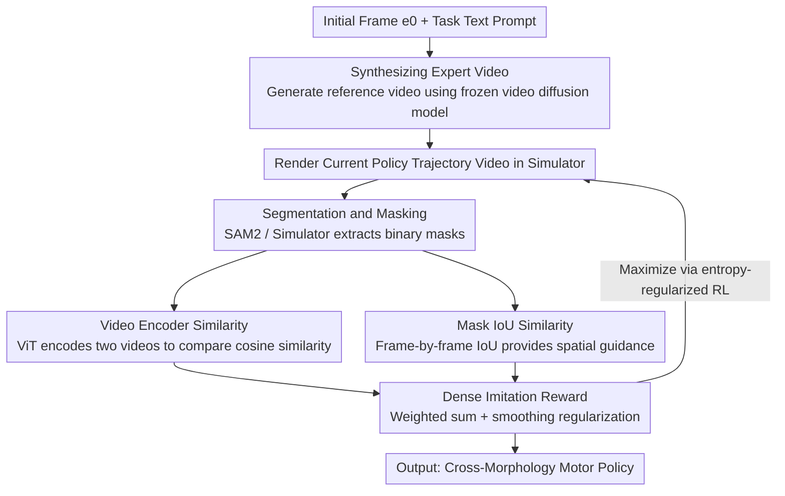

# NIL: No-data Imitation Learning

**Conference**: CVPR 2026  
**Paper**: [CVF Open Access](https://openaccess.thecvf.com/content/CVPR2026/html/Albaba_NIL_No-data_Imitation_Learning_CVPR_2026_paper.html)  
**Code**: https://nil.is.tue.mpg.de (project page, includes videos and code)  
**Area**: Robotics / Embodied AI  
**Keywords**: Imitation Learning, Video Diffusion Models, Physical Simulation, Zero-data, Motor Skills

## TL;DR
NIL uses a pre-trained video diffusion model to generate a reference video from "a single initial frame + a task description", and then trains an RL policy in a physics simulator to imitate this video—the reward comes entirely from "video embedding similarity + segmentation mask IoU" instead of a discriminator. This allows various robots, such as humanoid/quadruped, to learn whole-body skills like walking, sitting, and hanging on horizontal bars **without collecting any 3D motion capture data**.

## Background & Motivation
**Background**: To enable agents of various morphologies (humanoid, quadruped, animal) to learn physically plausible motor skills, two mainstream approaches exist. Reinforcement learning (RL) trains policies in physics simulators, producing behaviors that naturally satisfy physical laws, but requires manual reward function design for every "task × morphology" combination, which often leads to bizarre behaviors if rewards are not tuned correctly. Imitation learning (IL) bypasses reward engineering by directly learning from expert demonstrations, but heavily relies on high-quality 3D data—such as precise joint positions and velocities.

**Limitations of Prior Work**: High-quality 3D motion capture data is extremely scarce, expensive, or even impossible to collect for non-humanoid robots and animals. This limits IL strictly to a few morphologies with available motion capture data, making it impossible to generalize to unconventional embodiments.

**Key Challenge**: IL aims to avoid reward engineering at the cost of requiring 3D expert data, yet the unconventional morphologies that lack data are precisely those that need this approach the most. Meanwhile, video diffusion models can generate realistic videos of various morphologies (from humans to ants) from text—but these videos are "seemingly plausible, physically unrealistic," lack action annotations, and suffer from 2D-to-3D ambiguities, preventing them from being directly used for skill learning.

**Goal**: Can "on-demand generated 2D videos" completely replace "manually collected 3D motion capture" while still ensuring that the learned skills are physically plausible?

**Key Insight**: The authors' key insight is to decouple the two capabilities: **video diffusion models provide visual guidance (what the movement looks like), and physics simulators provide physical constraints (how the movement can be physically valid)**. The generated videos do not need to be physically correct because the simulator will "correct" unrealistic movements back to physically plausible ranges.

**Core Idea**: Replace "motion capture data + discriminator" with "generated video + physical simulation", converting the generated video into a discriminator-free dense imitation reward (video embedding similarity + mask IoU). This reward is directly maximized in the simulator using RL, achieving true "zero-data" imitation learning.

## Method

### Overall Architecture
NIL's goal: Given a skill $s_i$ and an embodiment $b_j$, learn a policy $\pi_{s_i,b_j}$ that enables the simulated agent to perform the skill. The entire pipeline consists of two stages executed sequentially: **Stage 1 generates a reference video, and Stage 2 trains a policy in a physics simulator to imitate it**. In Stage 1, the robot's initial frame is rendered, the background is removed, and it is passed into a frozen video diffusion model. With a text prompt like `"The {bj} agent is {si}, camera follows the agent."`, a camera-following reference video is generated. In Stage 2, the current trajectory of the RL agent in the simulator is also rendered into a video, and the similarity of each frame is evaluated against the reference video. The similarity (plus smoothing regularization) serves as the reward, and the policy is optimized using entropy-regularized RL. The overall reward calculation consists of three steps: segmentation masking $\rightarrow$ video encoding $\rightarrow$ similarity computation.

### Key Designs

**1. Synthesizing Expert Data: On-the-fly demonstration generation using video diffusion models, completely eliminating the reliance on 3D motion capture**

This is how NIL addresses the root problem of "no data for unconventional morphologies." Traditional IL requires preparing 3D motion capture trajectories with precise joint information for each embodiment. In contrast, NIL directly uses a frozen pre-trained video diffusion model $D$, takes the initial frame $e_0$ rendered from the simulator at a fixed starting pose along with a task text prompt $p_{s_i,b_j}$, and outputs a color video $D(p_{s_i,b_j}, e_0) = F_{s_i,b_j} \in \mathbb{R}^{n\times H\times W\times 3}$. Because the demonstration is "generated on-demand and conditioned on the initial state of the embodiment," demonstrations can be obtained for any "task × embodiment" combination, no longer constrained by motion capture availability. The authors acknowledge that the generated videos are often physically implausible, but this is the key to the decoupled design—visual plausibility is sufficient, and physics is handled by the downstream simulator.

**2. Discriminator-Free Video + Mask Two-Stream Reward: Transforming 2D videos into dense and stable imitation signals**

This is the core mechanism that converts a "single 2D video" into an "optimizable reward," which inspired the title "discriminator-free". Adversarial IL (e.g., GAIL, AMP) learns rewards using a discriminator, which is prone to overfitting and training instability. NIL replaces this by directly computing similarity using two complementary streams:

- **Video Encoding Similarity (Temporal + Semantic Guidance)**: Segment and extract the body from both the reference video $F$ and the simulation-rendered video $E$ (using SAM2 with initial frame mask prompts for the generated video, and simulation-provided masks for the simulation video). Then, construct $n_T$-frame clips for each and feed them into a pre-trained video ViT encoder $T$ (TimeSformer is used in this paper). The final hidden state is extracted to get embedding $z^F_t, z^E_t$. The reward is the cosine similarity between the two: $S_{v,t} = \frac{z^F_t \cdot z^E_t}{\|z^F_t\|\,\|z^E_t\|}$, ranging within $[-1,1]$. It captures the semantic and temporal structure of the overall movement but lacks fine-grained frame-by-frame spatial guidance.

- **Mask IoU Similarity (Spatial Guidance)**: Relying solely on video-level similarity is too "global", so the frame-by-frame Intersection over Union (IoU) of the binary masks for both videos is calculated:

$$S_{M,t} = \frac{\sum_{k,l} M^F_t(k,l)\cdot M^E_t(k,l)}{\sum_{k,l} M^F_t(k,l) + M^E_t(k,l) - M^F_t(k,l)\cdot M^E_t(k,l)}$$

ranging within $[0,1]$, providing frame-aligned spatial feedback. The two streams complement each other: the video encoder provides temporal/semantic guidance, while the mask IoU provides spatial guidance. Together, they create a stable imitation signal without a discriminator.

**3. Physical Regularization + Entropy-Regularized RL: Simulator guarantees physical plausibility while directly maximizing rewards**

Since the generated videos are not physically realistic, this component constrains the policy to physically feasible regions. The regularization term $P_t = P_{J,t}+P_{A,t}+P_{V,t}+P_{F,t}+P_{S,t} \le 0$ penalizes joint torques, action deltas, angular velocities, foot slipping, and torso tilting respectively. These are standard terms in robot control that ensure smooth, non-jittery, and physically valid motions. The final step reward is a weighted sum: $R_t = \zeta S_{v,t} + \beta S_{M,t} + \eta P_t$. Unlike SOTA IL with "discriminator + RL", NIL directly uses entropy-regularized RL (implemented using BRO) to maximize the expected discounted return $\max_\pi \mathbb{E}[\sum_t \gamma^t (R_t + \alpha H(\pi(\cdot|o_t)))]$. The entropy term encourages exploration, eliminating adversarial training and making the pipeline simpler and more stable. The observation $o_t$ consists of joint positions and velocities, and the action $a_t$ represents joint torques.

### Loss & Training
The reward weights are fixed across all embodiments as $\zeta=\beta=\eta=1$. The video encoder is a TimeSformer pre-trained on Kinetics-400, with a clip length of $n_T=8$ and an input resolution of 224×224. The control frequency is 100 Hz. One engineering detail is **temporal alignment**: the simulator renders at 100 Hz, while the generated video is typically only 24–30 Hz. The authors use RIFE to perform 4× frame interpolation on the generated video before imitation learning, preventing frame rate mismatch from disrupting frame-by-frame alignment.

## Key Experimental Results

### Main Results
Comparisons are made on motor tasks across various robot embodiments. NIL uses only **a single generated video**, while all baselines (AMP/GAIfO/BCO) are trained on 25 motion capture trajectories from LocoMujoco (containing perfect joint correspondences):

| Task (Env. Reward ↑) | NIL (Ours) | AMP | GAIfO | BCO | Expert |
|--------|------|------|------|------|------|
| Unitree H1 (Humanoid) | 396.1 | 393.5 | 347.8 | 72.0 | 400 |
| Talos (Humanoid) | **352.8** | 231.1 | 204.4 | 26.6 | 400 |
| Unitree G1 (Humanoid) | 356.9 | **393.4** | 353.1 | 21.2 | 400 |
| Unitree A1 (Quadruped) | **290.3** | 286.9 | 260.8 | 30.3 | 300 |

NIL matches AMP on H1 and A1 with more natural and balanced gaits. On the complex Talos morphology, it significantly outperforms all baselines. AMP is only more stable on G1. For whole-body manipulation tasks (sitting on a chair, hanging on a bar, balance board), both NIL and the RL upper-bound baseline achieve a 100% success rate with comparable normalized rewards—yet NIL functions without any task reward engineering or motion capture data.

### Ablation Study
Deconstructing the components of the reward function on the Unitree H1 walking task (Env. Reward ↑, Expert=400):

| Configuration | Env. Reward | Description |
|------|---------|------|
| NIL (All components) | 396.1 | Full model, walks fast and stably |
| w/o Regularization | 382.4 | Motion becomes jittery |
| w/o IoU| 381.4 | Behaviors slightly distorted |
| w/o Video Similarity | 387.3 | Walks slower and jitters |
| only Regularization | 363.6 | Fails to walk straight, large and suboptimal leg movements |
| only IoU | 328.4 | Cannot sustain forward walking |
| only Video Similarity | 369.6 | Jitters and stops halfway |

### Key Findings
- **No single component is sufficient; only the combination is stable**: Removing any single reward component significantly degrades performance (with only IoU performing the worst at 328.4). The three terms are highly complementary and necessary to approach the expert level: video similarity provides temporal semantics, IoU provides spatial alignment, and regularization ensures smoothness.
- **"Visual plausibility" of the reference video is more important than "physical correctness"**: Comparing five generators (Kling, Pika, Runway, Sora, SVD), Kling generates the most realistic visuals, leading to the best performance for NIL. Even when Pika's physical plausibility is poor, as long as the visuals are plausible, the imitation performance remains high. The authors evaluate visual plausibility using the LPIPS distance between generated videos and motion capture videos, finding a positive correlation with NIL's performance. This is because physics is corrected by the simulator; the generator only needs to clarify "what the action looks like."
- **Stronger generators yield stronger NIL performance**: Kling v1.6 yields a significantly more natural and balanced gait than v1.0, demonstrating that NIL can benefit "for free" from progress in video diffusion models.

## Highlights & Insights
- **Decoupled division of labor** is the most elegant design: delegating "motion semantics" to the generative model and "physical validity" to the simulator. As a result, it does not matter if the generated video is physically unrealistic—this cleanly bypasses the long-standing hurdle of "physically implausible video diffusion", enabling generated videos to be used directly as imitation rewards for the first time.
- **Discriminator-free dense rewards** are highly reusable: replacing the adversarial discriminator with "pre-trained video encoder cosine similarity + mask IoU" provides both temporal and spatial guidance while avoiding the instability of adversarial training. This "two-stream perceptual similarity as reward" concept is transferable to other video-based control learning tasks.
- The empirical finding that "visual plausibility > physical correctness" is counter-intuitive but consistent with the design logic. It provides a practical criterion for selecting generators (focusing on LPIPS visual similarity rather than physical evaluations).

## Limitations & Future Work
- **Performance ceiling is locked by the generated video quality**: The authors acknowledge that NIL's performance is strictly tied to the quality of the generated vision. On complex morphologies (e.g., Talos, G1), it still falls short of ideal when the generator fails to produce clean renderings.
- **Single video + single skill**: Currently, only one skill-embodiment pair is learned from a single reference video. Long-horizon, multi-skill composition, or more complex tasks like object interaction have not yet been demonstrated (noted by the authors as a future direction).
- **Reliance on closed-source generators and fixed camera**: The best results rely on the closed-source Kling with a fixed camera setup; robustness to camera configurations and frame interpolation is partially discussed in the supplementary materials, but actual deployment controllability remains a question.
- Future improvement directions: Use NIL as a **pre-training** phase and fine-tune with a small amount of motion capture data to conquer complex morphologies; extend to object-interaction-based whole-body tasks.

## Related Work & Insights
- **vs AMP / GAIfO (Adversarial IL)**: They learn rewards via a discriminator and require expert motion capture data; NIL uses discriminator-free video/mask similarity rewards and zero motion capture data. The advantages lie in being data-free and avoiding adversarial training instability; the disadvantage is that its performance ceiling is bounded by the quality on generated videos, and it can be less stable than AMP on certain morphologies (like G1).
- **vs UniPi / Track2Act / Gen2Act / RoboDreamer etc. ("using generative videos for planning/world models")**: These methods treat generated videos as open-loop plans or world models, and most still require partial action labeling or real robot trajectories. NIL treats generated videos as **dense imitation rewards in a simulator**, learning whole-body skills in physics simulations purely from generated videos. It is the first framework to prove that "physically plausible cross-morphology motor skills can be learned solely from generated videos."
- **vs Pure RL (BRO and other upper bounds)**: RL requires manual reward design for each task-embodiment. NIL replaces reward engineering with imitation rewards, matching the performance of RL on whole-body manipulation tasks without writing task-specific rewards.

## Rating
- Novelty: ⭐⭐⭐⭐⭐ First to prove that cross-morphology physically plausible whole-body skills can be learned in a simulator using "only generated 2D videos", offering a clean, decoupled perspective.
- Experimental Thoroughness: ⭐⭐⭐⭐ Covers 4 embodiments + whole-body manipulations + three types of ablation studies. However, the main table primarily presents single-point environmental rewards, lacking variance/multi-task long-horizon validations.
- Writing Quality: ⭐⭐⭐⭐⭐ Transparent logic from motivation to insight to method. The three-step reward mechanism and functional division are clearly explained.
- Value: ⭐⭐⭐⭐⭐ Links "data-free robot skill acquisition" with "advances in video generation," gaining free benefits as generative models improve. Opened up a new path for generative modeling × imitation learning.

<!-- RELATED:START -->

## Related Papers

- [\[ICLR 2026\] DataMIL: Selecting Data for Robot Imitation Learning with Datamodels](../../ICLR2026/robotics/datamil_selecting_data_for_robot_imitation_learning_with_datamodels.md)
- [\[CVPR 2026\] Expanding Spatial and Temporal Context for Robotic Imitation Learning With Scene Graphs](expanding_spatial_and_temporal_context_for_robotic_imitation_learning_with_scene.md)
- [\[CVPR 2026\] Video2Robo: 3DGS-based Synthetic Data from One Video Enables Scalable Robot Learning](video2robo_3dgs-based_synthetic_data_from_one_video_enables_scalable_robot_learn.md)
- [\[CVPR 2026\] Lifelong Imitation Learning with Multimodal Latent Replay and Incremental Adjustment](lifelong_imitation_learning_multimodal_latent_rep.md)
- [\[CVPR 2026\] IGen: Scalable Data Generation for Robot Learning from Open-World Images](igen_scalable_data_generation_for_robot_learning_from_open-world_images.md)

<!-- RELATED:END -->
