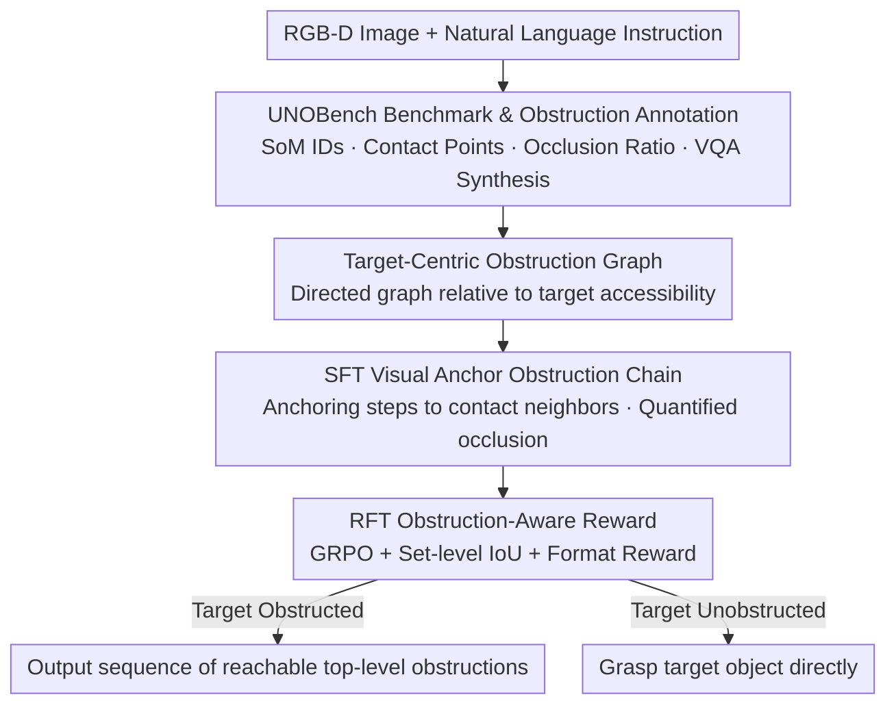

# Obstruction Reasoning for Robotic Grasping

**Conference**: CVPR 2026  
**Paper**: [CVF Open Access](https://openaccess.thecvf.com/content/CVPR2026/html/Jiao_Obstruction_Reasoning_for_Robotic_Grasping_CVPR_2026_paper.html)  
**Code**: https://tev-fbk.github.io/UnoGrasp/ (Yes, project page promises open data/models/code)  
**Area**: Robotic Grasping / Embodied Spatial Reasoning / Vision-Language Models  
**Keywords**: Obstruction Reasoning, Grasping in Clutter, Vision-Language Models, Reinforcement Fine-Tuning, Target-Centric Graph  

## TL;DR
Addressing the long-neglected problem in cluttered scenes where "the target object is obstructed and obstructions must be removed first," this paper proposes UNOGrasp. It is a Vision-Language Model (VLM) that constructs target-centric directed obstruction graphs and is trained via SFT+RFT (GRPO + IoU reward). Accompanied by the self-built UNOBench benchmark (100k+ obstruction paths), it outperforms Qwen2.5-VL and Google’s proprietary Gemini Robotics-ER 1.5 in both obstruction reasoning and grasping success rates across synthetic and real-world scenarios.

## Background & Motivation
**Background**: Enabling robots to grasp target objects in highly cluttered scenes like bin-picking or object assembly based on natural language instructions is a core skill for robotic manipulation. Recent VLMs demonstrate "emergent" spatial understanding, capable of grounding language references to specific objects (visual grounding). Works like SpatialVLM, SpatialBot, and RoboPoint have also integrated 3D/depth/affordance knowledge into these models.

**Limitations of Prior Work**: Existing VLMs are weak at "obstruction reasoning." They can recognize target objects but struggle to disentangle the physical dependencies between them. When a target is buried or blocked, the robotic hand cannot reach it; obstructions must be cleared in the correct order. Current approaches are insufficient: detection-based methods (e.g., [18]) estimate obstruction relations but lack support for multi-step action planning within a VLM's embodied reasoning framework. Early VLM explorations (e.g., FreeGrasp [12] using Molmo grounding + GPT-4o reasoning) are zero-shot patches with shallow task formalization and lack proper evaluation protocols.

**Key Challenge**: The "obstruction chain" formed in cluttered scenes—where A is blocked by B, and B is blocked by C—is a structural problem requiring multi-step, multi-path reasoning. Existing benchmarks (EmbSpatial-Bench, Spatial457, CAPTURe) mostly test static perception and do not evaluate action-oriented clearing plans (i.e., "which one to move first, then next"). Most also lack language annotations for VLM grounding.

**Goal**: To decouple obstruction understanding from low-level control and study it as a "spatial perception + reasoning" problem. Given a target, the model identifies obstruction paths leading from it to infer "which reachable obstructions to move next." The goal is to develop: (1) a dataset and metrics for training and evaluating obstruction reasoning; (2) a VLM capable of such reasoning.

**Key Insight**: The authors observe that grasping a target $o_t$ does not require reasoning about **all** pairwise obstruction relations in a scene, but only a subset related to the accessibility of $o_t$. By abstracting the problem into a "target-centric" directed graph, the reasoning space is significantly compressed.

**Core Idea**: Use a "target-centric obstruction graph + obstruction-aware visual cues (contact points, occlusion ratios, descriptive terms)" to guide the VLM in verifiable multi-step reasoning. Use reinforcement fine-tuning (RFT) to directly optimize the set-level goal of "which objects should ultimately be moved."

## Method

### Overall Architecture
UNOGrasp receives an RGB-D image $I=(I_{rgb}, I_d)$ and a free-form language instruction $q$ (e.g., "grasp the white iphone box"). It outputs a "clearing plan": if the target is unobstructed, it is grasped directly; if obstructed, the model outputs a sequence of currently **reachable** top-level obstructions to be removed. $I_{rgb}$ is used for reasoning and planning, while $I_d$ is used for 3D grasp point estimation. The pipeline operates on two levels: offline, UNOBench converts scenes into "obstruction graphs + VQA samples"; online, the model grounds the target, builds a target-centric graph, reasons along paths, and outputs the reachable obstruction set $\mathcal{F}(o_t)$. Based on Qwen2.5-VL-3B, the model undergoes two-stage training: SFT to output obstruction chains with visual anchors, followed by RFT (GRPO) using obstruction-aware rewards.

### Key Designs

**1. Target-Centric Obstruction Graph: Compressing Scene Relations into Reachability Paths**

Reasoning about all $N$ objects generates combinatorial explosions, where many relations are irrelevant to $o_t$. This paper builds a directed graph $G_t=(V_t, E_t)$ only for the target $o_t$. The vertex set $V_t$ contains $o_t$ and objects blocking it directly or indirectly. A directed edge $(o_i, o_j)\in E_t$ denotes "$o_i$ is obstructed by $o_j$ from the camera view." Edges point from the obstructed to the obstructor. Paths from $o_t$ terminate at "top-level" obstructions that are themselves unobstructed.

The ancestor set $\mathcal{A}(o_t)$ (all objects blocking the target) is defined as:

$$\mathcal{A}(o_t)=\{\, o_i\in\mathcal{O}\mid \exists \text{ a directed path } [o_t,\cdots,o_i]\in G_t \,\}.$$

The set of top-level obstructions $\mathcal{F}(o_t)$ that can be immediately moved is:

$$\mathcal{F}(o_t)=\{\, o_i\in\mathcal{A}(o_t)\mid \nexists\, o_j \text{ s.t. } (o_i,o_j)\in E_t \,\}.$$

The reasoning goal $f_\Theta(I,q)$ returns $\mathcal{F}(o_t)$ via ancestor reasoning if the target is blocked; otherwise, it returns $o_t$. This provides a set of "next-step candidates," allowing the robot to select based on fetchability without considering irrelevant obstructions.

**2. UNOBench: Translating Structural Obstructions into Trainable Language Benchmarks**

Existing datasets like MetaGraspNetV2 lack high-level reasoning labels. UNOBench adds: (i) free-form language descriptions; (ii) per-target obstruction graphs. The structure consists of: (a) **Set-of-Marks**: numerical IDs on masks with centroids $(x,y)$; (b) **Obstruction Info**: contact points, occlusion ratios, and descriptive terms (slightly / partially / mostly / heavily); (c) **Target-Centric Graph**; (d) **ID-Name-Coordinate mapping**. Over 190 native speakers verified 41,193 object names to ensure linguistic accuracy.

The benchmark includes two VQA types using a `<think>...</think><answer>...</answer>` format: **Oracle (with SoM)** uses numerical IDs to test pure reasoning; **Natural Language Prompting** uses names and coordinates to test both reasoning and spatial grounding. It comprises 108,174 reasoning paths. A new metric, **MP NED** (Multi-Path Normalized Edit Distance), is introduced to measure structural similarity between predicted and ground-truth reasoning paths using the Hungarian algorithm.

**3. SFT Visual Anchor Obstruction Chain: Anchoring Reasoning to Physical Neighbors**

VLMs often lose track of object identities in multi-step reasoning, causing MP NED to exceed 0.8. In SFT, $f_\Theta$ is fine-tuned to ground targets using name+coordinates $\{o_t,(x_t,y_t)\}$ and SoM IDs. The model learns to generate reasoning chains where **every step is anchored to a physically adjacent (contacting) neighbor**. Quantified occlusion ratios (e.g., "38% blocked") are included to improve reasoning stability and path reconstruction.

**4. RFT Obstruction-Aware Reward: Set-level IoU for Actionable Optimization**

After SFT, Group Relative Policy Optimization (GRPO) is applied. The reward $r$ is a weighted sum of format and task rewards:

$$r=\lambda_{\text{fmt}}\, r_{\text{fmt}}+\lambda_{\text{task}}\, r_{\text{task}}.$$

The task reward $r_{\text{task}}$ evaluates the final output $\mathcal{F}(o_t)$ using set-level IoU:

$$r_{\text{task}}=\frac{|\mathcal{F}_{\text{pred}}(o_t)\cap\mathcal{F}_{\text{gt}}(o_t)|}{|\mathcal{F}_{\text{pred}}(o_t)\cup\mathcal{F}_{\text{gt}}(o_t)|}.$$

IoU provides a smooth gradient compared to binary rewards, especially when multiple top-level obstructions exist. Notably, supervising only the final answer $\mathcal{F}(o_t)$ indirectly improves the quality of the internal reasoning path $\mathcal{A}(o_t)$.

## Key Experimental Results

### Main Results
UNOGrasp (based on Qwen2.5-VL-3B) was compared against base Qwen and Gemini Robotics-ER 1.5. Below are Path-level results on the synthetic test set (SR-F1, %):

| Setting / Difficulty | No-Occ SR | Easy SR-F1 | Medium SR-F1 | Hard SR-F1 |
|------|------|------|------|------|
| Gemini Robotics-ER 1.5 (Oracle/SoM) | 68.7 | 59.3 | 29.8 | 5.4 |
| Qwen2.5-VL SFT (Oracle) | 88.7 | 69.8 | 56.5 | 34.3 |
| **UNOGrasp (Oracle)** | **94.8** | **83.3** | **69.1** | **54.5** |
| Gemini Robotics-ER 1.5 (NL Prompt) | 50.2 | 52.1 | 32.5 | 10.1 |
| Qwen2.5-VL SFT (NL Prompt) | 91.4 | 65.3 | 51.5 | 31.9 |
| **UNOGrasp (NL Prompt)** | **92.5** | **74.9** | **59.7** | **37.2** |

On "Hard" synthetic scenes, UNOGrasp exceeds Qwen2.5-VL(SFT) by +20.2% SR-F1. On "Hard" real-world scenes, the gap reaches +38.0%, proving the importance of process-level supervision.

### Ablation Study
Ablating visual cues in SFT (Synthetic Overall):

| Configuration | SR-F1 | OR-F1 | MP NED |
|------|------|------|------|
| Baseline (Graph only) | 74.7 | 71.9 | 0.220 |
| + Contact Points | 75.3 | 72.5 | 0.216 |
| + Occlusion Ratio | 76.4 | 73.3 | 0.210 |

Ablating IoU reward in RFT:

| Variant / Difficulty | Easy SR-F1 | Medium SR-F1 | Hard SR-F1 | Overall SR-F1 |
|------|------|------|------|------|
| Baseline (SFT) | 81.8 | 67.1 | 50.1 | 76.4 |
| + RFT on Answer | 83.3 (+1.5) | 69.1 (+2.0) | 54.5 (+4.4) | 78.2 (+1.8) |

### Key Findings
- **Occlusion ratio is the most useful cue**: It provided the highest gain (+5.8% SR-F1 on Hard), reducing reasoning errors more effectively than contact points or descriptive terms.
- **RFT is critical for complexity**: The gain from IoU rewards increases with difficulty, helping the model identify complete sets of obstructions.
- **MP NED correlates with success**: Lower edit distance in reasoning paths leads to higher success rates across all difficulties.
- **Failure Modes**: Gemini often terminates early, missing obstructions. Standard Qwen2.5-VL tends to "over-reason," treating containers as obstructions.

## Highlights & Insights
- **Pruning via Target-Centric Graphs**: Ignoring pairwise relations for irrelevant objects reduces the reasoning space and hallucinations. This "end-to-beginning" logic is transferable to any sequential clearing task.
- **Quantifiable Visual Anchors**: Including "38% blocked" in the reasoning chain provides higher information density and grounding stability.
- **Set-level IoU for Multi-Step RL**: In tasks where multiple correct answers exist (multiple objects can be moved), IoU rewards provide smoother gradients than binary "all-or-nothing" rewards.
- **Efficiency**: A 3B parameter model with structural supervision outperforms proprietary giants like Gemini on this specific domain.

## Limitations & Future Work
- **Ignores Obstruction Severity**: The model checks if an obstruction exists but does not rank them by severity. Minimal obstructions might not always need removal.
- **Mask Dependency**: The UNOBench pipeline relies on amodal segmentation. Deploying this in novel environments requires an additional perception front-end for SoM and occlusion estimation.
- **Visual Robustness**: Performance drops in overexposed real-world scenes or with highly similar, clustered objects.
- **Grasping is Abstracted**: The model outputs IDs/coordinates, but the physical grasp is handled by GroundedSAM + GraspNet. End-to-end joint optimization is not yet explored.

## Related Work & Insights
- **vs. FreeGrasp / ThinkGrasp [12,17]**: These use zero-shot visual prompting with LLMs. UNOGrasp formalizes the problem via target-centric graphs and uses end-to-end training with structural metrics.
- **vs. Detection-based methods [18]**: Prior work lacks multi-step planning. UNOGrasp focuses specifically on the reachability chain.
- **vs. SpatialVLM / SpatialBot [7,6]**: These inject general 3D/depth knowledge but do not handle the sequential logic of clearing barriers for a target.
- **vs. Static Benchmarks**: While others measure static spatial relations, UNOBench is the first to evaluate action-oriented clearing plans with language grounding.

## Rating
- Novelty: ⭐⭐⭐⭐ Formalizing "clearing-based obstruction reasoning" as a target-centric graph is original and effective.
- Experimental Thoroughness: ⭐⭐⭐⭐ Extensive dual-benchmark testing (synthetic/real), path-level metrics, and real robot validation.
- Writing Quality: ⭐⭐⭐⭐ Clear task formalization and intuitive examples.
- Value: ⭐⭐⭐⭐ Demonstrating that a 3B model can beat proprietary models via structural supervision. Open-source commitment is highly valuable for the embodied AI community.

<!-- RELATED:START -->

## Related Papers

- [\[CVPR 2026\] Action-Sketcher: From Reasoning to Action via Visual Sketches for Robotic Manipulation](action-sketcher_from_reasoning_to_action_via_visual_sketches_for_robotic_manipul.md)
- [\[CVPR 2026\] GraspALL: Adaptive Structural Compensation from Illumination Variation for Robotic Garment Grasping in Any Low-Light Conditions](graspall_adaptive_structural_compensation_from_illumination_variation_for_roboti.md)
- [\[ICLR 2026\] Embodied-R1: Reinforced Embodied Reasoning for General Robotic Manipulation](../../ICLR2026/robotics/embodied-r1_reinforced_embodied_reasoning_for_general_robotic_manipulation.md)
- [\[AAAI 2026\] Towards Affordance-Aware Robotic Dexterous Grasping with Human-like Priors](../../AAAI2026/robotics/towards_affordance-aware_robotic_dexterous_grasping_with_human-like_priors.md)
- [\[CVPR 2026\] GraspLDP: Towards Generalizable Grasping Policy via Latent Diffusion](graspldp_towards_generalizable_grasping_policy_via_latent_diffusion.md)

<!-- RELATED:END -->
