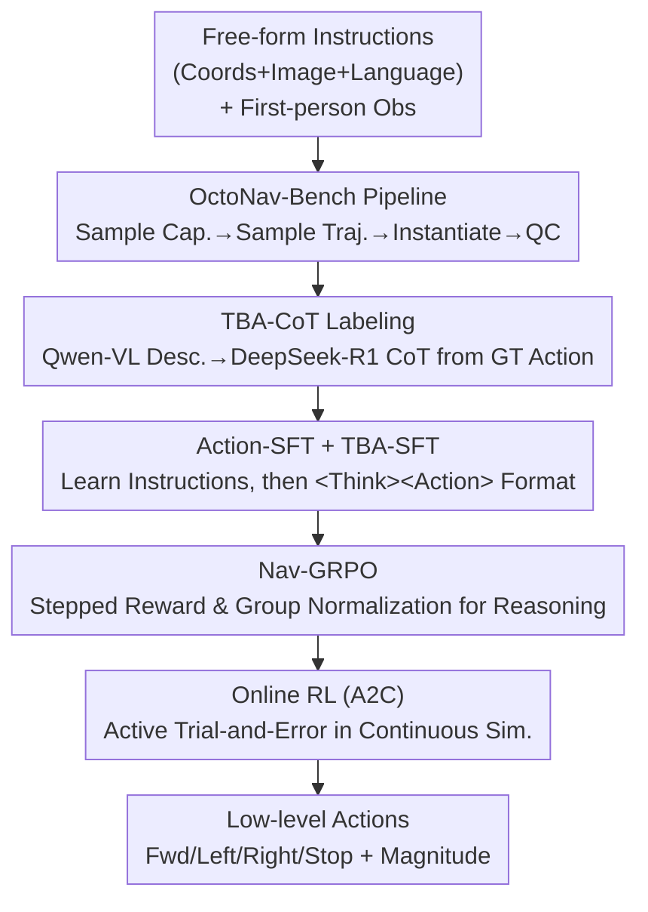

# OctoNav: Towards Generalist Embodied Navigation

**Conference**: CVPR 2026  
**Paper**: [CVF Open Access](https://openaccess.thecvf.com/content/CVPR2026/html/Gao_OctoNav_Towards_Generalist_Embodied_Navigation_CVPR_2026_paper.html)  
**Code**: https://buaa-colalab.github.io/OctoNav (Project Page)  
**Area**: Embodied Navigation / VLA / Reinforcement Learning  
**Keywords**: Generalist Navigation, Free-form Instructions, Think-Before-Action, VLA, GRPO

## TL;DR
OctoNav unifies five fragmented navigation tasks—ObjNav, PointNav, ImgNav, Ins-ImgNav, and VLN—into a single "free-form, multi-modal, multi-capability" instruction format. The work releases OctoNav-Bench, containing 45k+ instruction-trajectory pairs, and the TBA-CoT dataset with reasoning chains. It introduces OctoNav-R1 (based on LLaMA-VID), a VLA model that "thinks before acting" trained via a three-stage Hybrid Training Paradigm (SFT, GRPO, and online RL), improving the overall success rate from the previous best of 9.2% to 19.4% in a unified setting.

## Background & Motivation

**Background**: The mainstream approach to embodied navigation splits tasks into narrow sub-tasks—PointNav reaches coordinates, ImgNav/Ins-ImgNav finds scenes or objects matching a reference image, ObjNav searches for object categories, and VLN follows step-by-step linguistic instructions. Each sub-task has its own input modalities, goal definitions, benchmarks, and specialized models.

**Limitations of Prior Work**: This "one-task-one-model" fragmentation deprives agents of generalization flexibility—a VLN agent cannot perform ImgNav because it has never encountered "reference image as goal" modalities. Even recent "generalist" benchmarks like GOAT-Bench or LHPR-VLN only cover two capabilities, and each instruction still addresses a single capability/modality, making them collections of independent tasks rather than truly generalist navigation.

**Key Challenge**: Real-world instructions are naturally hybrid, such as "navigate to this place {image}, then go through the door next to the refrigerator, turn left to find the wardrobe, and return to {x,y,z} to wait." This spans three modalities (coordinates, visual, linguistic) and three capabilities (PointNav, ImgNav, VLN) simultaneously. Existing data and models assume "one instruction = one capability/modality," making them unable to represent or execute such composite instructions.

**Goal**: (1) Create a truly hybrid (multi-modal × multi-capability) unified benchmark; (2) Train a generalist VLA model that accepts free-form instructions and outputs low-level actions using only 2D visual observations.

**Key Insight**: The authors draw inspiration from the "think-before-answering" approach of OpenAI-o1 and DeepSeek-R1. Since navigation instructions are complex enough to require sub-goal decomposition, progress monitoring, and commonsense reasoning to infer target locations, an agent should move beyond the traditional VLA "observation → action" direct mapping to an "observation → explicit reasoning → action" paradigm.

**Core Idea**: By combining a unified free-form benchmark, Think-Before-Action (TBA) reasoning, and integrating RL into VLA training, the fragmented navigation tasks are converged into a thinking generalist agent.

## Method

### Overall Architecture

OctoNav provides two symbiotic outputs: **OctoNav-Bench** on the data side, which compresses five capabilities into single free-form instructions with corresponding trajectories and distilled reasoning chains; and **OctoNav-R1** on the model side, a VLA based on LLaMA-VID. The model processes multi-modal instructions and first-person history/current observations to end-to-end output low-level actions (move forward / turn left / turn right / stop + magnitude). It is trained using a three-stage Hybrid Training Paradigm (HTP): an automated labeling pipeline generates data, Qwen-VL+DeepSeek-R1 supplement actions with reasoning chains, followed by Action-SFT (instruction following), TBA-SFT (reasoning output), Nav-GRPO (reasoning quality optimization), and online RL (active trial-and-error in simulation).

### Key Designs

**1. OctoNav-Bench Labeling Pipeline: Compressing Five Capabilities into One Instruction**

The fundamental barrier to unified tasks is the lack of hybrid data. The authors address this with a four-stage pipeline. **(I) Instruction Generation**: A capability sampler decides which capabilities to include based on preset principles (balancing proportions and counts), and GPT generates instructions using placeholders for specific elements (e.g., reference images). **(II) Trajectory Generation and Instruction Instantiation**: Trajectories are sampled from a pool of 400+ indoor scenes (MP3D, HM3D, Gibson, ProcTHOR) with constraints on length and action distribution. Properties along the trajectory are used to ground placeholders—selecting multiple waypoints as sub-goals, each corresponding to a capability (e.g., an image from the first waypoint for ImgNav). **(III) Instruction Expansion**: LLMs expand instructions into semantically equivalent variants. **(IV) Quality Control**: Automatic and manual filtering removes ungrounded, overly long, or nonsensical instructions. This results in 45k+ grounded pairs, crucially using **Continuous Environments (CE)** instead of discrete ones, allowing the agent to move freely for online RL.

**2. TBA-CoT Reasoning Annotation: Adding "Why" to Every Action**

To move beyond hard mappings, the authors distill reasoning from existing trajectories. At timestep $t$, the ground truth (GT) action is known. Current and historical views, plus reference images, are converted into linguistic descriptions via Qwen-VL using structured prompts. These descriptions and the **GT action** are fed to DeepSeek-R1 to derive a detailed reasoning trace. Providing the GT action ensures the reasoning aligns with the correct action, effectively creating 10k+ "thinking textbooks" for the agent. This makes OctoNav-Bench the first navigation benchmark with TBA annotations.

**3. Action-SFT + TBA-SFT: Establishing Foundation and Thinking Initialization**

The first stage of HTP involves two steps of supervised fine-tuning (LoRA on LLaMA-VID). **Action-SFT** trains $\pi_\theta$ on instruction-trajectory pairs $(\mathcal{V}, \mathcal{I}, \mathcal{A})$, where $\mathcal{V}$ includes history $\mathcal{V}_h$ and current frame $\mathcal{V}_c$. Visual elements in instructions are replaced with placeholders like `<ImageNav>`, substituted by visual encoder embeddings. The output $\mathcal{A}$ includes action $a \in \{\text{forward, left, right, stop}\}$ and magnitude $m$. The loss is standard autoregressive:

$$\mathcal{L}_{act}(\theta) = -\mathbb{E}_{(\mathcal{V},\mathcal{I},\mathcal{A}) \sim D_{act}} \frac{1}{|\mathcal{A}|} \sum_{t=1}^{|\mathcal{A}|} \log \pi_\theta(\mathcal{A}^t \mid \mathcal{V}, \mathcal{I}, \mathcal{T}_{act}, \mathcal{A}^{<t})$$

**TBA-SFT** follows using TBA-CoT data to train the model to output a structured `<Think>Reasoning</Think><Action>Action</Action>` format. This allows flexible control over thinking frequency during inference and serves as the cold-start for subsequent RL.

**4. Nav-GRPO + Online RL: Strengthening Reasoning and Strategy via Verifiable Rewards**

Following SFT, the model may "mimic" thinking without quality. Two RL stages follow. **Nav-GRPO** samples $G$ TBA outputs for each $(\mathcal{V}_i, \mathcal{I}_i)$ and scores them using **stepped verifiable rewards**: 1 if action and magnitude are correct, 0.5 if only the action is correct, and 0 otherwise:

$$r_{i,j} = \begin{cases} 1, & a_{i,j}=a_{gt} \land m_{i,j}=m_{gt} \\ 0.5, & a_{i,j}=a_{gt} \land m_{i,j} \neq m_{gt} \\ 0, & a_{i,j} \neq a_{gt} \end{cases}$$

The 0.5 reward for partial accuracy stabilizes training. Advantages $\delta_{i,j}$ are group-normalized. **Online RL** (A2C) then utilizes the continuous environment for active learning. A linear critic scores states using the model's final Transformer hidden state. The reward $r_{on}$ encourages reaching the goal and progress:

$$r_{on}(\mathcal{S}, \mathcal{A}, \mathcal{S}') = \begin{cases} 1, & \mathcal{S}' \text{ is Success} \\ -(d_{\mathcal{S}'} - d_{\mathcal{S}}), & \text{Otherwise} \end{cases}$$

where $d$ is distance to the goal. For non-movement actions, the agent performs a small "virtual" move $d'$ cm to ensure non-zero reward signals.

### Loss & Training

HTP sequences four losses: $\mathcal{L}_{act}$ (Action-SFT) → $\mathcal{L}_{tba}$ (TBA-SFT) → $\mathcal{L}_{grpo}$ (Nav-GRPO with group advantages and KL constraint to $\pi_{\theta_{SFT}}$) → $\mathcal{L}_{on}$ (Online A2C TD error and MSE for the critic). Optimal inference frequency is found to be thinking every 20 steps.

## Key Experimental Results

Evaluation uses Habitat simulator with 400+ training and 40+ unseen test scenes. Metrics include SR (Success Rate), OSR (Oracle Success Rate), and SPL (Success weighted by Path Length).

### Main Results

Specialized models cannot handle hybrid instructions, so comparisons are made against generalist MLLMs (some fine-tuned on OctoNav-Bench).

| Method | Type | Overall SR | Overall SPL | Overall OSR |
|------|------|-----------|-------------|-------------|
| Qwen-VL | MLLM Zero-shot | 0.00 | 0.00 | 2.00 |
| Video-LLaVA | MLLM Zero-shot | 0.80 | 0.45 | 3.80 |
| NavGPT-2* | Discrete Env | 2.00 | 1.35 | 5.20 |
| NaVid | Continuous Env | 5.80 | 4.34 | 11.40 |
| Uni-NaVid | Continuous Env | 8.60 | 5.79 | 17.60 |
| Uni-NaVid† | +OctoNav FT | 9.20 | 6.21 | 17.80 |
| **OctoNav-R1 (Ours)** | **VLA + HTP** | **19.40** | **13.77** | **29.40** |

OctoNav-R1 leads across all categories, e.g., ImgNav SR 23.97 (vs. 11.16 second-best) and VLN SR 37.14.

### Ablation Study

| Configuration | Overall SR | Overall SPL | Description |
|------|-----------|-------------|------|
| Base-Model | 5.80 | 4.34 | LLaMA-VID Base |
| +Action-SFT | 8.80 | 7.20 | Learns instruction following; VLN SR drops slightly. |
| +TBA-SFT | 14.40 | 10.32 | Reasoning capability; +5.60 overall improvement. |
| +Nav-GRPO | 17.00 | 12.04 | Optimizes reasoning quality. |
| +Online RL | 19.40 | 13.77 | Learns more efficient policies via active trial. |

### Key Findings
- **TBA-SFT is the critical contributor**: It increases overall SR by 5.60, demonstrating that explicit "thinking" is essential for multi-capability composite instructions.
- **Generalist Tax exists**: For Action-SFT, specific strengths (like VLN) are initially sacrificed for overall generality, though recovered in later stages.
- **Thinking frequency**: A per-20-step frequency (19.40) is optimal; more frequent thinking (per-10) does not necessarily improve performance.
- **Sim2Real transfer**: Preliminary tests show OctoNav-R1 can transfer to physical robots without real-world fine-tuning.

## Highlights & Insights
- **Reasoning in Navigation VLA**: Transitions from reflexive "observation → action" mapping to symbolic reasoning, bringing the o1/R1 paradigm to embodied AI.
- **GT-based Reasoning Distillation**: Using ground truth actions to supervise LLM reasoning generation turns an open-ended generation problem into a controllable "explanation" task.
- **Stepped Rewards for Sparse Signals**: Granting partial rewards for correct actions with incorrect magnitudes provides smoother gradient signals than binary success/failure.
- **Data-Method Synergy**: The use of a Continuous Environment (CE) benchmark was a deliberate design choice to enable valid online RL trial-and-error.

## Limitations & Future Work
- **Absolute Success Rate**: 19.40% SR is state-of-the-art but far from deployment-ready.
- **Adaptive Thinking**: The model uses a fixed thinking frequency; future work should explore "where and when to think" based on agent uncertainty.
- **Post-hoc Reasoning**: TBA-CoT chains are generated after the fact and may contain hallucinations or misalignments with actual visual evidence.
- **Action Space**: The current model is limited to discrete actions + magnitudes, lacking high-precision or high-DOF control.

## Related Work & Insights
- **vs GOAT-Bench / LHPR-VLN**: Unlike these "collections" of tasks, OctoNav-Bench provides truly mixed multi-modal/multi-capability instructions and reasoning labels.
- **vs Uni-NaVid / NaviLLM**: Models relying solely on multi-task learning fail on free-form hybrid instructions; OctoNav-R1 proves that unified data + thinking + RL is a superior paradigm.
- **vs Vision-R1 / Video-R1**: While those apply RL+CoT to static tasks, OctoNav extends this to dynamic, embodied navigation where states evolve with the agent's path.

## Rating
- **Novelty**: ⭐⭐⭐⭐⭐ First to unify five navigation tasks into mixed instructions with TBA reasoning and RL-enhanced VLA.
- **Experimental Thoroughness**: ⭐⭐⭐⭐ Strong main experiments and ablation studies, though sim2real remains qualitative.
- **Writing Quality**: ⭐⭐⭐⭐ Clear motivation and pipeline descriptions; some RL parameters could be more detailed.
- **Value**: ⭐⭐⭐⭐⭐ Establishes a unified benchmark and replicable training paradigm for generalist embodied navigation.

<!-- RELATED:START -->

## Related Papers

- [\[CVPR 2026\] FM-Steer: Enhance Generalist Policies with Value-Guided Cascaded Denoising](fm-steer_enhance_generalist_policies_with_value-guided_cascaded_denoising.md)
- [\[ICLR 2026\] Embodied Navigation Foundation Model](../../ICLR2026/robotics/embodied_navigation_foundation_model.md)
- [\[ICLR 2026\] Lifelong Embodied Navigation Learning](../../ICLR2026/robotics/lifelong_embodied_navigation_learning.md)
- [\[CVPR 2026\] SocialNav: Training Human-Inspired Foundation Model for Socially-Aware Embodied Navigation](socialnav_training_human-inspired_foundation_model_for_socially-aware_embodied_n.md)
- [\[CVPR 2026\] MergeVLA: Cross-Skill Model Merging Toward a Generalist Vision-Language-Action Agent](mergevla_cross-skill_model_merging_toward_a_generalist_vision-language-action_ag.md)

<!-- RELATED:END -->
