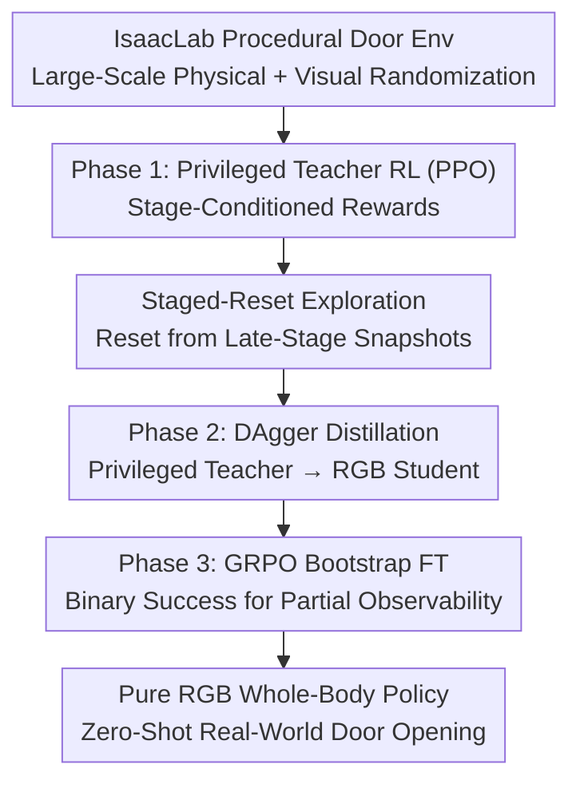

# Opening the Sim-to-Real Door for Humanoid Pixel-to-Action Policy Transfer

**Conference**: CVPR 2026  
**Paper**: [CVF Open Access](https://openaccess.thecvf.com/content/CVPR2026/html/Xue_Opening_the_Sim-to-Real_Door_for_Humanoid_Pixel-to-Action_Policy_Transfer_CVPR_2026_paper.html)  
**Code**: https://doorman-humanoid.github.io/ (Project Page)  
**Area**: Robotics / Embodied AI  
**Keywords**: Humanoid robots, whole-body manipulation, sim-to-real, visual reinforcement learning, teacher-student distillation

## TL;DR
DoorMan employs a three-stage "teacher-student-bootstrap" pipeline to train a **pure RGB-input** humanoid whole-body door-opening policy in IsaacLab via large-scale physical and visual randomization. This policy transfers zero-shot to various real-world doors, achieving completion times up to 31.7% faster than human teleoperation.

## Background & Motivation
**Background**: Humanoid robots can perform flashy maneuvers like backflips and punching, but the daily loco-manipulation task of "opening a door with single-eye (RGB camera) vision" remains unsolved. Door-opening is a highly demanding stress test: the robot must identify the handle from a shaky egocentric camera, turn a spring-loaded door handle, track the circular trajectory of the door panel, and maintain whole-body balance under the reaction force of the hinge—closely coupling perception, balance, contact, and navigation.

**Limitations of Prior Work**: Most systems dedicated to door-opening rely on depth sensors, object-centric features, or hard-coded motion primitives, and often run on wheeled bases; they either simplify contact mechanics or require precise object localization. Systems from the DARPA Robotics Challenge era relied heavily on scripting and human intervention, while recent teleoperation-driven pipelines are highly fragile. These are not scalable solutions capable of generalizing to daily environments.

**Key Challenge**: Applying established sim-to-real expertise (which has matured in locomotion, motion imitation, and dexterous manipulation) to loco-manipulation hits two fundamental roadblocks: (i) **the algorithm itself** must be simple, scalable, robust to partial observability, and capable of generating autonomous policies that coordinate vision and whole-body control (WBC), which prior work fails to deliver; (ii) **the visual sim-to-real gap** spans massive appearance and physical variations, requiring diverse and heterogeneous data rather than a few meticulously designed scenes.

**Goal**: To build a generalizable visual humanoid loco-manipulation learning pipeline, using door-opening as a highly challenging representative task.

**Core Idea**: To string together "privileged teacher RL $\rightarrow$ DAgger distillation to RGB student $\rightarrow$ GRPO bootstrap fine-tuning" into a three-stage pipeline, paired with unprecedented procedural randomization of door assets in IsaacLab. This enables the pure RGB student policy to open unseen real-world doors zero-shot.

## Method

### Overall Architecture
DoorMan takes robot proprioception (joint angles, joint velocities, root angular velocity) + a single egocentric RGB image stream as input, and outputs high-dimensional target joint angles of the Unitree G1 (29 body joints + 14 hand joints, action dimension of 33). These are tracked by a pre-trained whole-body controller at 50 Hz. The entire pipeline consists of three stages, completed interactively in IsaacLab:

- **Phase 1 Teacher RL**: Train a PPO teacher policy using "privileged observation" (real door pose, hand-to-handle transformation, contact torque, root velocity), paired with stage-conditioned rewards and a staged-reset exploration mechanism to stabilize long-horizon training.
- **Phase 2 Student Distillation**: Distill the teacher into an RGB-and-proprioception-only student policy using DAgger. The visual encoder and policy are joint fine-tuned under aggressive visual randomization.
- **Phase 3 Student Bootstrap**: Fine-tune the student using GRPO (a critic-free, actor-only variant of PPO) with binary success signals, enabling it to learn "partial-observability compensation" behaviors never demonstrated by the teacher (e.g., actively keeping the manipulation area in view).

Supporting these three stages is a **large-scale procedural randomization** pipeline that scales diversity across both physical (door type/size, hinge damping, latch dynamics, handle position, resistance torque) and visual (textures, lighting, camera extrinsic/intrinsic parameters) dimensions.

### Key Designs

**1. Teacher-student-bootstrap three-stage pipeline: Getting a foot in the door with a privileged teacher, then letting the RGB student find its own way**

Training a pure RGB whole-body door-opening policy end-to-end is almost impossible due to the 33-dimensional action space, 50 Hz inference requirement, rich contact dynamics, and balance constraints. This work adopts the classic teacher-student paradigm but introduces a crucial missing link. The teacher $\pi_T(a|s)$ receives privileged information unavailable during deployment—root-to-door transformation $\xi_{RD}$, hand-to-handle transformation, net contact torque on 18 hand rigid bodies $\tau_H \in \mathbb{R}^{18\times 6}$, and root linear velocity $v_R \in \mathbb{R}^3$—and is trained using standard PPO to solve the challenging task of "how to open a door" from an omniscient perspective. Then, DAgger is used to distill it into the student $\pi_S(a|o)$. The student receives only proprioception + RGB. The image is processed by a visual encoder, and the latent feature is concatenated with proprioceptive features, passed to two LSTM layers (512 units each), and mapped to target joint angles via three MLP layers (512/256/128). The visual encoder and the policy are jointly fine-tuned. DAgger is chosen over Behavior Cloning (BC) because DAgger provides direct supervision on **the student's own input distribution**, whereas BC only covers the teacher's distribution, leaving no labels when the student drifts. However, distillation alone is insufficient—which leads to the third stage.

**2. Staged-reset exploration: Leveraging the simulator's "rewindability" to feed late-stage states of long-horizon tasks to the policy**

Contact-rich precision manipulation tasks (like door opening) suffer from a pitfall in RL exploration not typically seen in locomotion: if the robot grips the door handle but has not learned to turn it in the correct direction, or fails to coordinate its whole-body movement, it receives severe penalties due to excessive motor torque, peak contact forces, or falls. As a result, the policy simply "forgets" the grasping behavior and avoids entering subsequent phases. This work decomposes the task into discrete sub-stages (Approach Stage 1, Door-Opening Stage 2, etc.). These stages correspond to disjoint subsets $\{S_1,\dots,S_K\}$ of the state space, connected by very narrow "bridges." The bridge transition probability is $p_{\text{bridge}} \ll 1$, meaning policies trained from the initial distribution $\rho_0$ can barely reach downstream stages early on, leading to poor long-horizon credit assignment. The solution is to utilize the simulator's ability to save and load states: whenever an environment enters a new stage, a rolling buffer caches 100 robot-environment snapshots (generalized coordinates of all rigid bodies and joints) before and after that step. During resets, the robot is reset to the initial stage or an intermediate stage with a non-zero probability. This is formalized as a staged reset law $\alpha = (\alpha_1,\dots,\alpha_K)$ with $\sum_y \alpha_y = 1$, modifying the starting distribution to:

$$\tilde{\rho}_\alpha = \sum_{y=1}^{K} \alpha_y \rho_y$$

The corresponding discounted occupancy measure $d^\alpha_\pi(s) = (1-\gamma)\sum_t \gamma^t \Pr(s_t=s \mid s_0 \sim \tilde\rho_\alpha, \pi)$ is reweighted toward late-to-end stages, which directly provides higher-frequency and larger-magnitude gradient updates to late-stage states. Ablation studies show that with a buffer size of 100, the teacher traverses all stages in about 1,700 iterations; with a buffer size of 10, it takes over 4,000 iterations; without it (buffer size of 0), exploration fails and stalls at Stage 2.

**3. GRPO bootstrap fine-tuning: Teaching the RGB student to actively keep the target in view, a strategy the teacher never needed**

Since the teacher has privileged observations while the student only has partial observations, occlusions can cause the student to lose critical features. Thus, relying solely on BC loss cannot achieve optimality. The student needs to bootstrap on **its own rollouts** to discover strategies that compensate for partial observability—such as adjusting its body position to keep the manipulation area within the camera's field of view. This work utilizes GRPO to fine-tune the student. GRPO is an actor-only variant of PPO that bypasses the value function and estimates the baseline using a group of trajectory scores. For $G$ rollouts $\{\tau_i\}$ with returns $R_i$, the normalized relative advantage is defined as:

$$\hat{A}_i = \frac{R_i - \text{mean}(R)}{\text{std}(R)}$$

The policy is then updated using the clipped PPO surrogate, with $r_{i,t}(\theta) = \pi_\theta(a_{i,t}|o_{i,t}) / \pi_{\text{old}}(a_{i,t}|o_{i,t})$. The fine-tuning phase mainly relies on a **binary task success signal**, regularized by simple shaping terms like joint velocity, acceleration, and action rate. This step allows the student to move beyond pure imitation, directly optimizing its behavior under partial observability. In practice, this learns compensatory actions never demonstrated by the teacher (such as centering the object in the frame and adjusting end-effector poses to maintain visibility). Because it only requires a non-zero baseline success rate, it acts as a plug-and-play, lightweight, and stable reinforcement learning fine-tuning phase.

**4. Large-scale procedural door randomization: Expanding physical and visual envelopes rather than replicating real scenes**

The visual sim-to-real gap is immense; training on a few meticulously constructed scenes (as done in some low-scale BC literature where evaluation is restricted to the same background, lighting, and time of day as data collection) fails to generalize. This paper designs a procedural generation pipeline in IsaacLab, deliberately **avoiding** replicating any specific real scene—meaning all real-world evaluation scenes were completely unseen during training. Physically, the asset library covers 5 door styles and 3 main classes (lever-handle push, lever-handle pull, and push-bar doors). It randomizes door dimensions, handle positions, hinge damping, and handle resistance torque, capturing the sudden shift in whole-body dynamics at the moment of unlatching. Visually, textures are randomly sampled from IsaacLab's PBR asset library and applied to all surfaces, combined with 5,233 dome light textures to simulate different locations and times of day. An RTX real-time renderer (performance mode with motion blur and auto-white balance enabled) is used, with camera intrinsic and extrinsic parameters aligned and slightly randomized. Compared to early RGB sim-to-real works using flat, solid-color textures, this high-fidelity rendering pipeline significantly enhances visual generalization.

## Key Experimental Results

### Main Results: Real-World Comparison against Human Teleoperation

| Evaluation | Metric | DoorMan | Expert Teleop | Non-expert Teleop |
|------|------|---------|-------------|-----------------|
| All door-opening tasks | Success Rate | **83%** | 80% | 60% |
| All door-opening tasks | Avg. Time (s, lower is better) | **15.40** | 20.02 | 22.55 |

DoorMan achieves a success rate on par with expert teleoperation and 28 percentage points higher than non-expert teleoperation. In terms of task fluency (completion time), it is 23.8% faster than experts and 31.7% faster than non-experts. Qualitative observation: human operators often struggle to judge the force needed for spring-loaded handles and door hinges, and struggle with how much the robot should lean to maintain a steady speed. They also struggle to track the door panel's circular trajectory—feedback loops that exceed current VR teleoperation bandwidth but can be interactively learned in simulation.

### Ablation Study 1: Visual Randomization (120 trials on unseen doors, unit %)

| Exp. | Appearance Rand. | Dome Light | Push Door (Lever) | Pull Door (Lever) | Push Door (Bar) |
|------|-----------|--------|--------|--------|------------|
| 1 | No Rand. | ✗ | 10.8 | 5.0 | 20.0 |
| 2 | Solid Color | ✓ | 67.5 | 65.8 | 70.0 |
| 3 | +10% Texture | ✗ | 58.3 | 50.8 | 76.7 |
| 4 | +10% Texture | ✓ | 79.2 | 77.5 | 77.5 |
| 5 | +100% Texture | ✗ | 73.3 | 55.8 | 76.7 |
| 6 | +100% Texture | ✓ | **85.8** | **80.8** | **85.0** |

### Ablation Study 2: Staged-Reset Buffer Size

| Buffer Size | Teacher Training Performance |
|------------|-------------|
| 100 snapshots | Reaches most stages in ~500 iterations; completes all stages in ~1,700 iterations |
| 10 snapshots | Requires 4,000+ iterations to complete exploration |
| 0 (No Reset) | Exploration fails; stalls at Stage 2 (Grasping handle) |

### Key Findings
- **Dome light (illumination) randomization contributes the most**: Removing it drops the success rate by 15–30%, with the largest impact on the longest-horizon and hardest task (the pulling door). Omitting visual randomization entirely plunges the success rate to 5–20%.
- **10% texture is often sufficient**: Using 100% textures only yields a modest 4–8% gain over 10% textures, indicating diminishing returns in texture diversity. Nonetheless, high-fidelity rendering still offers a massive advantage over solid colors (65.8–70%).
- **GRPO pulls the student up to the teacher's performance ceiling**: While the teacher maintains a stable success rate of 80–90%, the initial student (due to unrecoverable observation gaps) only achieves 50–70%. Post-GRPO bootstrapping, the student climbs to 80.8–85.8%, plateauing near the teacher's upper bound.
- **Staged-reset is the make-or-break mechanism for training the teacher**: Without it, the teacher fails to even progress past the hand-to-handle grasping stage.

## Highlights & Insights
- **Adding the third-stage GRPO bootstrap on top of "teacher-student" is critical**: It elegantly answers a classic question: where is the performance ceiling for a distilled, partially observable student, and how can it be broken? Letting the student learn compensatory actions on its own using a binary success signal and actor-only GRPO, rather than trying to mimic the teacher more cleverly, is an elegant and plug-and-play approach.
- **Staged-reset turns the often-overlooked "rewindability" of simulators into an exploration weapon**: Contact-rich, long-horizon manipulation tasks usually suffer from policies "learning to avoid penalties." Directly resetting from late-stage snapshots forces late-phase states back into the occupancy measure. This is backed by both theory (occupancy measure reweighting) and experiments (1,700 vs. 4,000+ iterations).
- **First pure RGB, end-to-end, whole-body loco-manipulation policy for diverse hinged doors that outperforms humans**: Outperforming human experts in efficiency demonstrates that teleoperation feedback bandwidth is a major bottleneck, which interactive learning in simulation can successfully overcome.
- **The randomization philosophy of "expanding the variation envelope instead of replicating the scene"** is highly transferable: Rather than accurately modeling a target real-world environment, it is more effective to blow the distribution envelope wide open.

## Limitations & Future Work
- The task is restricted to door opening (hinged articulated objects). While representative and highly challenging, whether this pipeline generalizes to other loco-manipulation skills (drawers, knobs, valves) remains to be validated.
- It relies on a pre-trained whole-body controller as a low-level base. The leg locomotion is not learned from scratch, and the cost of deploying onto platforms without an off-the-shelf WBC is not factored in.
- The high-fidelity randomization (5,233 dome lights, RTX rendering, parallel RL) carries high computational demands, making reproduction computationally expensive.
- The paper lacks robustness data for long-term/multi-door sequential operations in the real world. Evaluations were started from standardized initial poses ("robot 1 meter in front of the door, facing the center within $\pm 0.3$ rad"); performance in messy, real-world navigation integration is yet to be examined.

## Related Work & Insights
- **vs. Visual Sim-to-Real Manipulation (e.g., Dextrah-RGB / VBC)**: These mostly focus on isolated arms or decouple locomotion from manipulation. This work delivers a pure RGB, end-to-end, unified whole-body loco-manipulation policy without hard-coded primitives or depth/pose priors.
- **vs. Early Solid-Color RGB Sim-to-Real (e.g., [39, 51])**: That setup achieves a 65.8–70% success rate in our replication; high-fidelity PBR + dome light randomization pushes this to 80%+, quantifying the incremental benefit of modern rendering on visual generalization.
- **vs. Teleoperation-Driven BC Pipelines (e.g., [22])**: BC performance is hard-capped by the quality of human teleoperation data and is restricted to the collection environment. This work bypasses this upper bound via sim-to-real RL, outperforming human experts in efficiency.
- **vs. Procedural Asset Generation (e.g., InfinigenSim)**: The native IsaacLab implementation in this study significantly improves physics fidelity, supporting accurate and efficient contact simulation crucial for parallel RL.

## Rating
- Novelty: ⭐⭐⭐⭐⭐ First pure RGB, end-to-end humanoid sim-to-real policy for highly diverse hinged doors, built on a robust combination of a three-stage pipeline, staged-reset, and GRPO bootstrapping.
- Experimental Thoroughness: ⭐⭐⭐⭐ Exhaustive real-world comparison against human teleoperation and three sets of ablations (visual rand., staged-reset, GRPO), though restricted to door-opening with a lack of sequential multi-task long-term robustness data.
- Writing Quality: ⭐⭐⭐⭐ Motivation and methodology are clearly explained, supported by thorough occupancy measure derivations and well-structured ablation charts.
- Value: ⭐⭐⭐⭐⭐ Solving the long-standing humanoid door-opening challenge with scalable simulated data and outperforming human teleoperation represents a solid milestone for embodied data generation.

<!-- RELATED:START -->

## Related Papers

- [\[CVPR 2026\] VIRAL: Visual Sim-to-Real at Scale for Humanoid Loco-Manipulation](viral_visual_sim-to-real_at_scale_for_humanoid_loco-manipulation.md)
- [\[CVPR 2026\] GeCo-SRT: Geometry-aware Continual Adaptation for Cross-Task Sim-to-Real Transfer](geco-srt_geometry-aware_continual_adaptation_for_cross-task_sim-to-real_transfer.md)
- [\[ICLR 2026\] Latent Adaptation of Foundation Policies for Sim-to-Real Transfer](../../ICLR2026/robotics/latent_adaptation_of_foundation_policies_for_sim-to-real_transfer.md)
- [\[NeurIPS 2025\] Generalizable Domain Adaptation for Sim-and-Real Policy Co-Training](../../NeurIPS2025/robotics/generalizable_domain_adaptation_for_sim-and-real_policy_co-training.md)
- [\[CVPR 2026\] Humanoid Generative Pre-Training for Zero-Shot Motion Tracking](humanoid_generative_pre-training_for_zero-shot_motion_tracking.md)

<!-- RELATED:END -->
