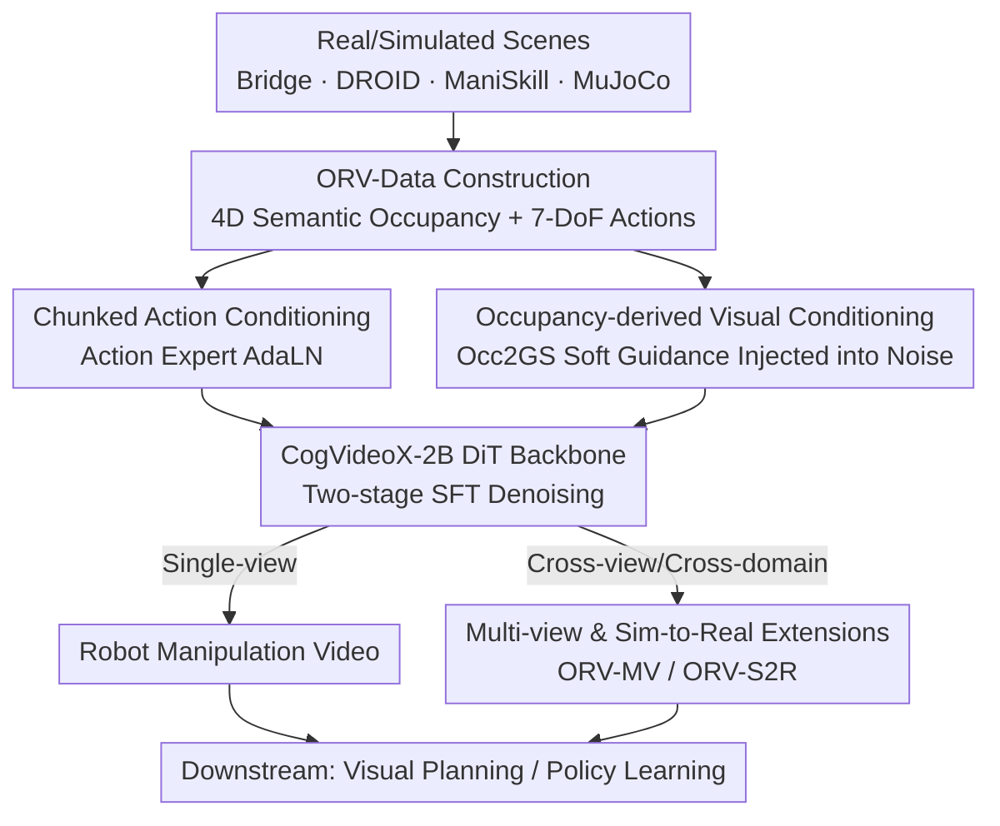

# ORV: 4D Occupancy-centric Robot Video Generation

**Conference**: CVPR 2026  
**Paper**: [CVF Open Access](https://openaccess.thecvf.com/content/CVPR2026/html/Yang_ORV_4D_Occupancy-centric_Robot_Video_Generation_CVPR_2026_paper.html)  
**Code**: Code, models, and data will be released upon acceptance according to the paper  
**Area**: Robotics / Embodied World Models  
**Keywords**: Robot Video Generation, 4D Semantic Occupancy, World Models, Action-Conditioned Diffusion, Sim-to-Real

## TL;DR
Based on a pretrained video diffusion model (CogVideoX-2B), ORV utilizes "chunked 7-DoF action conditioning" combined with "soft visual priors rendered from 4D semantic occupancy" to drive robot manipulation video generation. By bridging the gap between sparse control signals and dense pixels, ORV establishes a high-fidelity, controllable, cross-view consistent robot world model that supports sim-to-real transfer. It achieves an FVD 18.8% lower than the SOTA and serves as a data engine for visual planning and policy learning.

## Background & Motivation

**Background**: Embodied AI suffers from a severe shortage of data. While traditional physics simulators (such as ManiSkill and MuJoCo) enable safe policy training and low-cost data collection, they lack visual realism. Consequently, "controllable video generation" has emerged as a promising data engine—predicting future RGB observations given an action sequence, which is equivalent to a neural simulator capable of rendering realistic frames.

**Limitations of Prior Work**: Existing action-conditioned video generation methods (such as IRASim, HMA, and AVID, which mostly use 7-DoF end-effector poses for control) still suffer from three major drawbacks: (p1) insufficient visual fidelity and temporal consistency; (p2) drift in future predictions and misalignment with real manipulation controls; and (p3) limitation to single-view generation without multi-view consistency constraints.

**Key Challenge**: The authors attribute p2 and p3 to a fundamental "representation gap"—the input consists of sparse low-dimensional controls (7-DoF pose trajectories) while the output comprises dense high-dimensional pixel dynamics, lacking a bridge that can explicitly convey geometric and semantic information to the generator. Relying solely on abstract conditions like actions or language makes it difficult for the model to faithfully translate control into pixel variations.

**Key Insight**: The authors observe that **4D semantic occupancy** serves as an ideal bridge. As a canonical voxel representation, it is robust to geometric noise (whether the reconstructed real surface is noisy or the simulated parametric surface is perfectly clean, the occupancy field provides a stable description, as shown in Paper Fig. 2), making it naturally suitable for sim-to-real transfer. Meanwhile, it carries both geometry and semantics, providing more complete information than fine-grained cues like optical flow, masks, or skeletons.

**Core Idea**: Complement the limitation of "action priors" with "occupancy-derived visual priors." By rendering 4D semantic occupancy into 2D maps injected as soft guidance into the diffusion process, and combining this with chunked action conditioning, a two-stage fine-tuning is performed on a pretrained video foundation model. This yields ORV, a faithful and general robot video generation framework.

## Method

### Overall Architecture
The task of ORV is formulated as a robot manipulation world model: given context $(S, O, \phi, \rho)$, model $M$ predicts the future states $s_{t:t+\Delta T}$ and corresponding observations $o_{t:t+\Delta t}$. While traditional text-to-video conditioning is $\rho_1:=\mathrm{Embed}(\text{text})$ and action-conditioned video generation evolves to $\rho_2:=\mathrm{Embed}(a_{t:t+\Delta t})$, ORV further introduces $\rho_3:=\mathrm{Embed}(c_{t:t+\Delta t}\sim\pi'(s_{1:t}),\, a_{t:t+\Delta t}\sim\pi(s_{1:t}))$, where $a$ represents the agent actions, $c$ denotes the occupancy field, and $\pi/\pi'$ represents the non-interactive (offline, one-time collection) prior extraction process, which can be established in either real environments (via human teleoperation) or simulators.

To avoid expensive large-scale pretraining and reduce training costs, ORV is built directly on top of the open-source pretrained video model **CogVideoX-2B** (DiT architecture, bidirectional diffusion) and undergoes **two-stage supervised fine-tuning (SFT)**: the first stage injects action conditions, and the second stage injects occupancy-derived visual conditions. The entire pipeline consists of: offline extraction of occupancy $\mathcal{C}$ and actions $\mathcal{A}$ from real/simulated scenes (constructed by the ORV-Data pipeline) $\rightarrow$ chunk-wise injection of actions into each DiT block via Action Expert AdaLN, and injection of rendered 2D soft occupancy maps into the initial noise $\rightarrow$ DiT denoising to generate videos. Based on this, three modes—single-view, multi-view (ORV-MV), and sim-to-real (ORV-S2R)—are derived, which ultimately serve downstream tasks such as visual planning and policy learning.

### Key Designs

**1. ORV-Data Construction: Generating 4D Semantic Occupancy for Robotic Scenes to Enable Prior Access**

The entire concept of ORV relies on occupancy priors. However, embodied scenes lack readily available occupancy datasets. Thus, the authors design a four-step data pipeline to construct 4D semantic occupancy "out of thin air" from existing robotic datasets (BridgeData V2, DROID, RT-1). Step 1: **Semantic Identifier Alignment**: Using VLMs to caption keyframes, performing K-means clustering on approximately 150,000 labels to obtain a dataset-level semantic label set of around 50 categories (table, countertop, towel, spoon, pan, etc.); then utilizing Grounding DINO + SAM2 to extract temporally consistent instances across frames and map them to semantics. Step 2: **Occupancy Reconstruction**: Using MonST3R to reconstruct sparse 4D points (bypassing reconstruction for videos with depth channels), employing NKSR for densification to fill holes and resist noise, and voxelizing into a canonical coordinate system, performing a majority vote on the projected semantic labels within each voxel to assign semantics. Step 3: **Semantic Identifier Assignment** completes the binding of "occupancy + semantics." Step 4: Performing **bullet-time occupancy-to-Gaussian rendering** during actual deployment. Finally, RAFT is used to filter out rendered data with poor inter-frame consistency. This very pipeline "upscales" broad robotic data into geometric/semantic priors suitable as conditioning, serving as the prerequisite for all subsequent designs.

**2. Chunked Action Conditioning: Aligning 7-DoF Controls into Video Latents with Action Expert AdaLN**

The 7-DoF end-effector pose sequence $A\in\mathbb{R}^{T\times D_a}$ ($D_a=7$) is a high-level control signal. The challenge lies in its temporal resolution mismatch with video latent variables and the high overhead of direct frame-by-frame injection. Borrowing from IRASim, ORV employs **Adaptive Layer Normalization (Action Expert AdaLN)** to modulate video latents directly inside each DiT block, but introduces a **chunking** mechanism for temporal alignment: it first pads reference frames with zero actions according to the temporal compression of the 3D VAE, and then uses a shallow MLP ($\varepsilon_{action}$) to compress $r$ consecutive actions into a single token: $A\in\mathbb{R}^{T\times D_a}\to \mathrm{MLP}(\mathrm{Pad}(A))\in\mathbb{R}^{(\frac{T}{r}+1)\times D}$, where $r$ is the chunk size and $D$ is the feature dimension. Even more efficiently, Action Expert AdaLN **reuses parameters from the pretrained Vision Expert AdaLN**. Since each AdaLN accounts for about 1/3 of the total parameters, parameter reuse avoids substantial redundant computations. Ablations show that removing chunking (directly encoding discrete actions) drops PSNR by 3.2% and success rate by 5.5%, while forcing actions into Text/Vision Experts leads to performance collapse (success rate dropping from 74.7% to 52.9%), proving the necessity of this dedicated, aligned, and parameter-reused injection scheme.

**3. Occupancy-Derived Visual Conditioning: Injecting Occupancy Rendered into Soft 2D Graphics into Noise instead of Multi-layer Hard Control**

Translating abstract 3D actions into 2D pixels is difficult, which is why the authors introduce pixel-level soft visual conditioning. However, directly projecting voxels onto a 2D plane causes sudden pixel jumps between adjacent frames or views. To address this, ORV assigns a **non-learnable Gaussian Splatting** to each voxel grid, which is then rendered from a designated view (i.e., Occ2GS), improving condition quality while saving VRAM. To resolve perspective distortion during rendering, the authors propose an **adaptive scaling rule**: Gaussian scale $\sigma = k_2\cdot \hat{z}^{\,k_1}$, where $\hat{z}\in[1,2)$ is the normalized depth in canonical space, and the exponent $k_1$ and baseline scale $k_2$ control the scaling behaviors of the near and far planes, respectively. Regarding injection, an encoding MLP ($\varepsilon_{visual}$) is used with the input map, and the visual condition is added to the initial noise via a zero-initialized projector: $z_{in}=\text{Zero-MLP}(z_{in}+\mathrm{MLP}(\mathcal{C}))+z_{in}$. The key difference from previous designs is that: prior ControlNet-style layer-by-layer control injections incur high computational costs, and when the conditions are "soft" (not pixel-aligned with ground truth), they risk contaminating the video latents; ORV adds soft conditions only to the initial noise, treating them as guidance rather than hard constraints, which is both computationally efficient and robust. In the ablation study, ControlNet injection yields an FVD of 20.069, whereas ORV's noise-injection achieves 16.525.

**4. Multi-View and Sim-to-Real Extensions: Reusing the Same Occupancy Prior for ORV-MV and ORV-S2R**

Occupancy is 4D, viewpoint-agnostic, and robust to geometric noise, allowing the same framework to derive two capabilities with minimal extra cost. **ORV-MV** adds a **view attention layer (multiview module, processing $F_V\in\mathbb{R}^{B_V\times S_V\times D}$, $S_V=VHW$, representing tokens across views)** before the single-view temporal attention (single-view module, processing $F_P\in\mathbb{R}^{B_P\times S_P\times D}$, $S_P=THW$, representing tokens across time). Both modules inherit the 3D (2D+1D) attention of the pretrained model. Differentiated conditioning is also applied: the single-view module takes text/action/occupancy maps, while the multi-view module **excludes action priors**, focusing solely on cross-view correspondence. This generates view-consistent videos, compensating for previous methods' limitation of capturing only a single surface shape, which leads to holes/artifacts upon changing views. **ORV-S2R** leverages the appearance-invariant property of occupancy-derived priors (such as depth maps): simulators can cheaply provide such priors, which are paired with an extra image generator (ControlNet) to synthesize diverse initial frames before being rolled out into realistic videos, thereby accomplishing sim-to-real transfer over large domain gaps. In essence, both are reuses of the "same occupancy prior with different conditioning/attention setups." thus detailed together in this design point.

### Loss & Training
Training follows the standard diffusion denoising loss, performing two-stage SFT on CogVideoX-2B: approximately 30K steps for the action-conditioned base model, and an additional 20K steps for occupancy-guided fine-tuning and multi-view generation. Ablations reveal that "fine-tuning from CogVideoX-2B" significantly outperforms "training from scratch" (FVD 17.682 vs 84.831), indicating that leveraging pretrained video foundation models is crucial for fidelity (FID/FVD).

## Key Experimental Results

### Main Results

Conditional video generation is evaluated on three real-world datasets: BridgeV2, DROID, and RT-1, predicting 15 subsequent frames given a single initial observation. The following table extracts core columns (such as FVD) for BridgeV2 and RT-1 from Table 1 of the paper:

| Dataset | Setting | Method | PSNR↑ | SSIM↑ | FID↓ | FVD↓ |
|--------|------|------|-------|-------|------|------|
| BridgeV2 | Action-conditioned | IRASim | 25.276 | 0.833 | 10.510 | 20.910 |
| BridgeV2 | Action-conditioned | **ORV** | 25.631 | 0.873 | 3.821 | **17.682** |
| BridgeV2 | Occ. + Action | IRASim† | 27.352 | 0.862 | 9.413 | 22.503 |
| BridgeV2 | Occ. + Action | **ORV** | **28.258** | **0.899** | **3.418** | **16.525** |
| RT-1 | Action-conditioned | IRASim | 26.048 | 0.833 | 5.600 | 25.580 |
| RT-1 | Action-conditioned | **ORV** | 27.086 | 0.863 | 4.210 | 20.031 |

ORV achieves leading performance across most metrics. The claimed "FVD is 18.8% lower than SOTA" corresponds to IRASim 20.910 $\rightarrow$ ORV 17.682 under action conditioning on BridgeV2 (about a -15.4% change; ⚠️ the 18.8% figure is subject to the original text and might correlate to a different baseline/dataset combination). When feeding the same occupancy + action conditions to IRASim†, ORV still outperforms it, demonstrating that the advantage derives from framework design rather than merely introducing occupancy information.

Two downstream tasks are tested: visual planning on the VP2 benchmark (Paper Table 2), where ORV achieves an average success rate of 66.0 (74.7 normalized by simulator), outperforming iVideoGPT's 63.9 (72.2), reflecting a gain of approximately +3.5%; and policy learning on SimplerEnv-WidowX (Paper Table 3, acting as a data engine augmenting ~25% synthetic data):

| Policy Model | Spoon on Towel | Carrot on Plate | Stack Cube | Eggplant in Basket | Avg. Success Rate |
|----------|---------------|-----------------|------------|--------------------|-----------|
| RoboVLM +Finetune | 27.6% | 26.7% | 12.1% | 52.8% | 29.8% |
| RoboVLM **+ORV** | 32.2% | 29.6% | 15.7% | 57.9% | **33.9%** |
| SpatialVLA +Finetune | 12.8% | 26.1% | 26.5% | 79.3% | 36.2% |
| SpatialVLA **+ORV** | 14.7% | 28.4% | 27.8% | 83.0% | **38.5%** |

RoboVLM achieves an average absolute increase of +4.1% (relative ~13.7%), while SpatialVLA improves by +2.3% on average (relative ~6.5%). ⚠️ The "+6.4% policy learning" cited in the abstract/teaser likely reflects the **relative** gain metric for SpatialVLA (≈6.5%) rather than absolute percentage points; refer to the original text for precise metrics.

### Ablation Study

Injection mechanisms for action and occupancy conditions (Paper Table 4, BridgeV2):

| Configuration | PSNR↑ | SSIM↑ | FID↓ | FVD↓ | Success↑ |
|------|-------|-------|------|------|----------|
| CogVideoX (Pure Text Baseline) | 19.432 | 0.752 | 7.509 | 83.561 | - |
| Actions into Text Expert | 20.424 | 0.772 | 4.104 | 23.586 | 52.9 |
| No chunking (Direct discrete actions) | 24.813 | 0.850 | 3.793 | 19.944 | 70.6 |
| Ours (Action condition base) | 25.631 | 0.873 | 3.821 | 17.682 | 74.7 |
| Occupancy injected via ControlNet | 26.974 | 0.865 | 3.613 | 20.069 | - |
| Ours (Occupancy full, noise injection) | 28.258 | 0.899 | 3.418 | 16.525 | - |

Conditioning resources and training strategies (Paper Table 5, Fine = pixel-level fine condition, Coarse = occupancy-rendered coarse condition):

| Configuration | Source | PSNR↑ | FID↓ | FVD↓ |
|------|------|-------|------|------|
| Unconditioned (base) | - | 25.631 | 3.821 | 17.682 |
| + Depth | Fine | 30.288 | 3.061 | 14.321 |
| + Depth | Coarse | 28.031 | 4.522 | 18.548 |
| Full Conditions | Fine | 30.431 | 2.998 | 14.301 |
| Full Conditions | Coarse | 28.258 | 3.418 | 16.525 |
| Training from scratch | - | 23.518 | 19.357 | 84.831 |
| Fine-Tuning from CogVideoX-2B | - | 25.631 | 3.821 | 17.682 |

### Key Findings
- **Occupancy Visual Priors Contribute Signficantly**: Adding full conditions yields relative PSNR improvements of 18.72% (25.621 $\rightarrow$ 30.431, Fine) and 10.24% ($\rightarrow$ 28.258, Coarse) over the baseline. The coarse condition closely approaches the fine condition, indicating that pixel-level alignment is not strictly required to harvest most of the gains.
- **Injection Site > Injected Information**: For the same occupancy conditions, injecting into the initial noise (ORV) yields a lower FVD than ControlNet-style layer-by-layer injection (16.525 vs. 20.069), validating the insight that forcing soft conditions into layers contaminates latent variables.
- **Robustness is the Core Selling Point** (Paper Table 7 Zero-Shot Cross-Granularity): A model trained with coarse conditions remains stable across both fine and coarse conditions (Coarse $\rightarrow$ Fine drops PSNR by only 1.423). In contrast, a model trained with fine conditions collapses when encountering coarse inputs (Fine $\rightarrow$ Coarse drops PSNR by 11.240 and increases FVD by 109.792). This illustrates that Cosmos-Transfer / RoboTransfer methods that rely on pixel-level fine conditions are highly sensitive to inaccurate conditioning, whereas ORV's soft occupancy constraints are robust—the fundamental reason for its sim-to-real transfer capability.
- **Multi-view** (Paper Table 6, 3 Views with view0 as Anchor): Adding visual priors improves cross-view generation for view1/view2 (e.g., view1 FVD 16.36 $\rightarrow$ 13.67). ⚠️ The "with / without" labeling order and some value directions in this table appear inconsistent; refer to the original text for exact metrics.

## Highlights & Insights
- **Porting "Occupancy" from Autonomous Driving to Robotic Manipulation as Visual Priors**: The authors address the representation gap from actions to pixels. By using coordinate-system 4D occupancy (which is robust to geometric noise, viewpoint-agnostic, and contains semantics) as a bridge, they simultaneously alleviate alignment drift (p2), single-view limitations (p3), and sim-to-real transfer issues within a unified, elegant approach.
- **Soft Conditions Should Be Softly Injected**: Realizing that ControlNet-style layer-by-layer hard injection contaminates latent variables when conditions are imperfect, they instead feed the rendered occupancy maps only into the initial noise as guidance. This saves compute and ensures robustness. This rule of "letting condition quality dictate the injection method" can easily transfer to other controllable generation tasks.
- **Clever Parameter Reuse**: Action Expert AdaLN directly reuses parameters from the Vision Expert AdaLN, saving about 1/3 of redundant AdaLN computations, which is a highly practical cost-saving engineering design.
- **Trading Training Precision for Generalization via Coarse Conditions**: Table 7 reveals that "the finer the training condition, the more fragile the transferability." Proactively training with coarse occupancy conditions yields cross-granularity robustness, an intuitive finding highly valuable for researchers specializing in sim-to-real.

## Limitations & Future Work
- **Dependency on a Heavy Data Pipeline**: ORV-Data links multiple foundational models including MonST3R, NKSR, Grounding DINO, SAM2, VLMs, and RAFT. The occupancy quality is affected by cascading errors across these components; the paper also filters out inconsistent data using RAFT, implying that not all outputs from the pipeline are readily usable.
- **Reconstruction Quality Sets the Ceiling**: Reconstructing 4D occupancy from single or multi-view videos is inherently noisy and may fail for transparent, reflective, or fast-deforming objects. ⚠️ The paper does not fully quantify such edge cases.
- **Coupled with CogVideoX-2B Backbone**: Fidelity heavily depends on the pretrained video foundation model (training from scratch yields FVD 84.831). It remains unverified whether similar benefits hold with larger backbones or newer world models.
- **Moderate Downstream Gains**: The absolute policy learning improvement is around +2.3% to +4.1%, which is effective but not transformative as a data engine. Additionally, multi-view generation still suffers from issues like inconsistent lighting in the source data.

## Related Work & Insights
- **vs IRASim / HMA / AVID (Action-Conditioned Video Generation)**: These methods rely solely on 7-DoF actions as conditions, constrained by the sparse-control-to-dense-pixel gap, leading to lower fidelity and weaker alignment. ORV injects occupancy-derived visual priors to resolve geometric/semantic missing links. Even when passing the same occupancy + action conditions to IRASim†, ORV remains superior, proving that its advantages lie in architecture design rather than information volume.
- **vs Cosmos-Transfer / RoboTransfer (Scene Graph-Conditioned Transfer)**: These methods condition on multimodal maps (like depth/normals) and are highly sensitive to conditional accuracy. In contrast, ORV's soft occupancy constraints are robust to geometric noise and do not collapse under zero-shot coarse-fine transfer, rendering them far more suitable for sim-to-real.
- **vs UniScene, etc. (Autonomous Driving Occupancy Generation)**: Translating the successful paradigm of "occupancy as a scene representation" to robot manipulation world models, while solving the data scarcity issue of occupancy in embodied domains (via the self-built ORV-Data).
- **vs TesserAct / EnerVerse / iVideoGPT (Embodied World Models)**: Rather than executing expensive large-scale pretraining, ORV is built upon open-source pretrained video foundation models with two-stage fine-tuning and provides native support for multi-view consistency and sim-to-real transfer, offering stronger generalizability.

## Rating
- Novelty: ⭐⭐⭐⭐⭐ Introduces 4D semantic occupancy as visual priors for robotic video generation, addressing fidelity, alignment, multi-view consistency, and sim-to-real transfer in a unified, novel, and self-consistent manner
- Experimental Thoroughness: ⭐⭐⭐⭐⭐ Covers three major datasets plus downstream tasks (visual planning and policy learning); conducts detailed ablations across injection sites, conditioning granularities, pretraining backbones, and robustness
- Writing Quality: ⭐⭐⭐⭐ Clear motivation and complete figures/tables, although some specific metrics (such as the 18.8% claim, +6.4% gain, and Table 6 annotations) require cross-checking with the original paper for clarification
- Value: ⭐⭐⭐⭐⭐ Provides a controllable and transferable neural robot simulator alongside its occupancy dataset, delivering direct engineering value for addressing the scarcity of embodied intelligence data

<!-- RELATED:START -->

## Related Papers

- [\[CVPR 2026\] Video2Robo: 3DGS-based Synthetic Data from One Video Enables Scalable Robot Learning](video2robo_3dgs-based_synthetic_data_from_one_video_enables_scalable_robot_learn.md)
- [\[CVPR 2026\] Towards Human-Like Robot Handwriting via Contour-Aware Generation](towards_human-like_robot_handwriting_via_contour-aware_generation.md)
- [\[ICLR 2026\] ViPRA: Video Prediction for Robot Actions](../../ICLR2026/robotics/vipra_video_prediction_for_robot_actions.md)
- [\[CVPR 2026\] IGen: Scalable Data Generation for Robot Learning from Open-World Images](igen_scalable_data_generation_for_robot_learning_from_open-world_images.md)
- [\[CVPR 2026\] Learning a Unified Latent Action Space from Videos with Action-centric Cycle Consistency](learning_a_unified_latent_action_space_from_videos_with_action-centric_cycle_con.md)

<!-- RELATED:END -->
