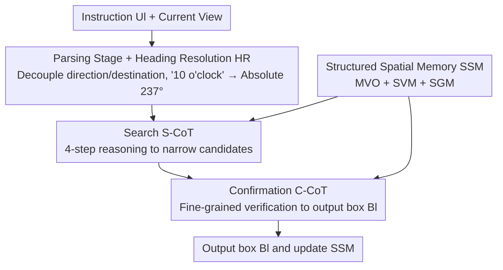

# Parse, Search, and Confirmation: Training-Free Aerial Vision-and-Dialog Navigation with Chain-of-Thought Reasoning and Structured Spatial Memory

**Conference**: CVPR 2026  
**Area**: Robotics / Embodied Navigation  
**Keywords**: Aerial Vision-and-Dialog Navigation, UAV, Training-Free, Chain-of-Thought, Spatial Memory  
**Code**: https://github.com/QY6616/PSC-AVDN (To be released)

## TL;DR
Addressing the issue that conventional Aerial Vision-and-Dialog Navigation (AVDN) requires supervised fine-tuning and lacks cross-domain generalization, this paper proposes PSC-AVDN. This training-free framework decomposes MLLM navigation into a "Parsing-Search-Confirmation" three-stage Chain-of-Thought (CoT) and incorporates a Structured Spatial Memory (SSM) to compensate for missing spatial/historical information. It achieves training-free SOTA performance on ANDH / ANDH-Full, performing comparably to or better than several fine-tuned methods.

## Background & Motivation
**Background**: Aerial Vision-and-Dialog Navigation (AVDN) requires drones to fly based on natural language instructions and resolve ambiguities through dialogue. High-altitude top-down views (similar to remote sensing) offer wide coverage but feature sparse and small landmarks, suitable for disaster relief and environmental monitoring. Traditional AVDN methods rely heavily on **supervised fine-tuning**.

**Limitations of Prior Work**: Supervised fine-tuning is costly in terms of computation and labeling, and often fails to generalize across domains. A natural alternative is using MLLMs in a training-free manner by feeding the current view and dialogue to the model. However, naive iterative search is unreliable for two reasons: ① **Weak direction grounding**: MLLMs are primarily trained on close-range ground views and struggle to translate abstract spatial terms (e.g., "slightly to the right") into geometric cues reflecting drone layouts. Small landmarks in aerial views further hinder alignment. ② **Lack of global spatial understanding and temporal state tracking**: AVDN requires maintaining beliefs across multiple steps, but autoregressive language-driven reasoning lacks structural mechanisms for mapping or long-term consistency, causing fragmented environmental interpretation.

**Key Challenge**: The domain gap between MLLM vision-language priors (ground-view) and AVDN geometric requirements (aerial-view), combined with the inherent lack of explicit spatial memory in language-driven reasoning.

**Goal**: To overcome these limitations by (1) **decoupling** direction understanding from target localization and (2) providing MLLMs with an **explicit structured spatial memory**.

**Core Idea**: Utilize a "Parsing-Search-Confirmation" three-stage CoT for (1) and a Structured Spatial Memory (SSM) for (2), achieving a purely training-free approach through MLLM native capabilities and prompt engineering.

## Method

### Overall Architecture
The AVDN task involves $L$ dialogue rounds. In each round $l$ with instruction $U_l$, PSC-AVDN executes a "Parsing → Search → Confirmation" cycle to output a target box $B_l=(x^1_l,y^1_l,x^2_l,y^2_l)$. The final box denotes the destination. The Parsing stage uses a general LLM to convert ambiguous instructions into stable geometric cues and destination descriptions. The Search stage (S-CoT) explores the aerial observation to narrow down candidate regions. The Confirmation stage (C-CoT) performs fine-grained verification and disambiguation. The SSM provides multi-scale observations, spatial visual memory, and structured geometric memory to maintain global context and long-term consistency.

### Key Designs

**1. Parsing Stage + Heading Resolution (HR): Decoupling Ambiguous Directions**

MLLMs struggle to translate terms like "10 o'clock" into geometric actions. Ours uses a general LLM (DeepSeek-V3) to decompose instruction $U$ into movement direction phrases $s_{dir}$ and destination descriptions $s_{des}$. The **Heading Resolution (HR)** module uses rule-based parsing to map clock-based, degree-based, or compass-based terms to an absolute angle $\alpha \in [0,2\pi)$. Combined with the current heading $\phi$, it calculates the relative heading:

$$\delta = \mathrm{wrap}(\alpha - \phi),$$

where $\mathrm{wrap}(\cdot)$ normalizes the angle. This decouples direction understanding from localization, providing reliable geometric signals $\delta$ and preventing early navigation failure.

**2. Search CoT (S-CoT): Four-Step Interpretable Reasoning**

To improve stability in large aerial scenes, S-CoT decomposes search into four serial steps: ① **Destination Analysis** extracts semantics (category, landmarks, relations) from $s_{des}$. ② **Scene Understanding** builds a holistic view using multi-scale observations $V_t$ and spatial visual memory $M_t$. ③ **Reference Grid Map Generation** divides the main view into an $N\times N$ grid with predicted labels to form structured geometric memory $R_t$. ④ **Target Localization** outputs candidate regions based on visual features and destination constraints.

**3. Confirmation CoT (C-CoT): Fine-grained Disambiguation**

C-CoT verifies candidates through an interpretable chain: it prompts the model to generate verifiable step-by-step reasoning, checking spatial and relational constraints against multi-scale views. By analyzing local structures and adjacency (e.g., verifying if a "large warehouse" actually has a "red building on its left"), it excludes false positives and outputs the final bbox $B$ with confidence scores.

**4. Structured Spatial Memory (SSM): Explicit Spatial/History Cues**

SSM addresses the lack of global context in single-frame observations through three components: ① **Multi-scale Visual Observation (MVO)** resamples the global map $I$ into different scales $V^i_t=\mathrm{Resample}(I,s_i)$ to capture both global layout and local details. ② **Spatial Visual Memory (SVM)** integrates historical views, trajectories, and orientations into a global coordinate canvas: $M_t=(M_{t-1}\oplus V_t)\oplus(T_t\oplus\theta_t)$. ③ **Structured Geometric Memory (SGM)** prompts the model to label the $N\times N$ grid for mid-scale views, updating a persistent memory $R_t=\mathrm{Update}(R_{t-1}, \bar R_t)$ to provide stable structural priors for multi-step reasoning.

## Key Experimental Results

### Main Results
Evaluated on ANDH (sub-trajectories) and ANDH-Full (complete trajectories) using SR (Success Rate), SPL (Success weighted by Path Length), and GP (Goal Progress). Results on ANDH Unseen Val.:

| Method | Setting | SPL | SR | GP |
|------|------|------|------|------|
| GPT-4o | Training-Free | 3.4 | 3.9 | -11.8 |
| Qwen-VL-Max | Training-Free | 8.7 | 9.2 | 5.5 |
| **PSC-AVDN (Ours)** | Training-Free | **17.8** | **22.6** | **39.2** |
| FELA | Supervised | 17.2 | 20.6 | 63.0 |
| HAA-LSTM | Supervised | 18.3 | 20.0 | 54.4 |

Ours significantly outperforms training-free baselines and matches or exceeds some supervised methods in SPL/SR. While GP remains lower than some fine-tuned models, it demonstrates strong performance for a zero-shot approach.

### Ablation Study
Three-stage Reasoning (ANDH Unseen Val.):

| Configuration | SPL | SR | GP |
|------|------|------|------|
| Baseline (Iterative search) | 8.7 | 9.2 | 5.5 |
| + Parsing | 13.5 | 14.6 | 26.2 |
| + Search | 15.6 | 17.5 | 25.8 |
| + Confirmation (Full PSC) | **16.3** | **19.3** | **35.7** |

SSM Components (on top of PSC):

| Configuration | SPL | SR | GP |
|------|------|------|------|
| w/o SSM | 16.3 | 19.3 | 35.7 |
| + SVM | 16.5 | 20.4 | 36.6 |
| + MVO | 16.6 | 21.1 | 38.3 |
| + SGM (Complete SSM) | **17.8** | **22.6** | **39.2** |

### Key Findings
- **Parsing** contributes the largest performance jump (SR 9.2→14.6), confirming that direction decoupling is the most critical factor for MLLM navigation.
- SSM components provide cumulative gains: SVM improves temporal consistency, MVO aids multi-scale perception, and SGM optimizes spatial reasoning.
- A 5×5 grid size is optimal; too fine or too coarse grids degrade performance as they must match the scale of aerial landmarks.

## Highlights & Insights
- **Direction decoupling is the most effective gain**: Simply resolving directions via HR doubled SR, proving that rule-based geometric parsing is far more effective than letting MLLMs "guess" orientation.
- **Training-free yet competitive**: By relying on general LLMs/MLLMs and prompt engineering, the framework avoids task-specific training while remaining comparable to supervised methods.
- **Self-generated geometric memory**: Unlike GeoNav which requires external models like Grounded-SAM, SGM allows the MLLM to generate its own reference grid, minimizing external dependencies.

## Limitations & Future Work
- There remains a gap in GP (Goal Progress) compared to fine-tuned methods over long-range trajectories.
- High inference costs due to multi-step CoT and multi-scale view processing.
- HR's rule-based approach may fail on unconventional directional expressions.
- The 12 semantic categories for the grid are derived from dataset statistics and might need adjustment for specialized environments.

## Related Work & Insights
- **vs. Supervised AVDN**: Supervised models (FELA, TA-GAT) are accurate but lack cross-domain adaptability; PSC-AVDN is plug-and-play with lower engineering costs.
- **vs. GeoNav**: GeoNav relies on external cognitive maps (Grounded-SAM/OpenGIS), whereas PSC-AVDN performs structured reasoning natively within the MLLM chain.
- **vs. Open-Nav**: While both use training-free CoT, PSC-AVDN specifically addresses high-altitude challenges like directional ambiguity and small landmarks.

## Rating
- **Novelty**: ⭐⭐⭐⭐ First training-free AVDN framework using structured three-stage CoT and multi-modal SSM.
- **Experimental Thoroughness**: ⭐⭐⭐⭐ Comprehensive multi-stage and component ablations across two datasets.
- **Writing Quality**: ⭐⭐⭐⭐ Clear structure and well-defined motivation-to-solution mapping.
- **Value**: ⭐⭐⭐⭐ High practical value for UAV deployment where training resources are limited.

<!-- RELATED:START -->

## Related Papers

- [\[CVPR 2026\] FantasyVLN: Unified Multimodal Chain-of-Thought Reasoning for Vision-and-Language Navigation](fantasyvln_unified_multimodal_chain-of-thought_reasoning_for_vision-and-language.md)
- [\[CVPR 2026\] Towards Training-Free Scene Text Editing](towards_training-free_scene_text_editing.md)
- [\[CVPR 2026\] TRM-VLA: Temporal-Aware Chain-of-Thought Reasoning and Memorization for Vision-Language-Action Models](trm-vla_temporal-aware_chain-of-thought_reasoning_and_memorization_for_vision-la.md)
- [\[CVPR 2026\] Memory-Augmented Scene Understanding and Exploration for Open-World Aerial Object-Goal Navigation](memory-augmented_scene_understanding_and_exploration_for_open-world_aerial_objec.md)
- [\[CVPR 2026\] ACoT-VLA: Action Chain-of-Thought for Vision-Language-Action Models](acot-vla_action_chain-of-thought_for_vision-language-action_models.md)

<!-- RELATED:END -->
